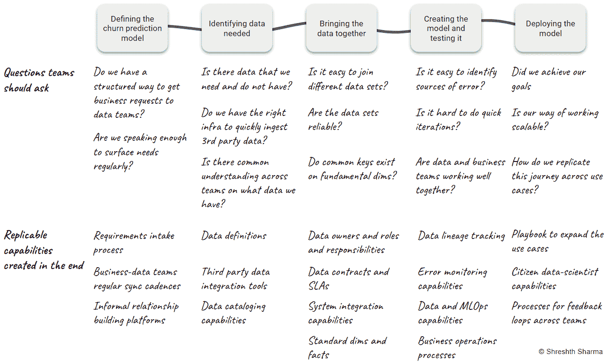

# 修正基础是使用高级人工智能的关键

> 原文：<https://towardsdatascience.com/fixing-fundamentals-is-essential-to-use-fancy-ai-b867ffc650b8>

## 三种技术可以帮助公司构建基础，为基于数据的竞争优势奠定基础

迈克·科诺诺夫在 [Unsplash](https://unsplash.com?utm_source=medium&utm_medium=referral) 上拍摄的照片

从商业智能到大数据到机器学习再到人工智能，数据世界在过去二十年里取得了令人眼花缭乱的进步。然而，研究人员总是不断指出关于公司未能利用数据的[的令人清醒的数字。通常，缺乏管理层的支持、数据团队没有关注真正的业务问题、公司没有合适的技能组合等都被视为罪魁祸首。](https://fortune.com/2019/10/15/why-most-companies-are-failing-at-artificial-intelligence-eye-on-a-i/)

在我看来，通常是缺乏专注和耐心来建立基础。坦率地说，构建基础是枯燥、乏味且耗时的。谁真正喜欢治理和文档之类的东西？我的猜测是，既不是想尝试新技术的数据科学家，也不是在季度报告的世界里寻求快速洞察力和结果的高管。然而，事实是，除非基本面是固定的，否则获得洞察力和利用最新的技术是非常困难的。但是这些基本面是什么呢？有三个关键方面:

*   *干净可靠的数据源。*至少对最常用或最关键的数据集，如收入、产品使用和销售漏斗，有单一的真实来源(黄金数据表)。
*   *治理*。至少黄金数据集应该被维护、治理、附加 SLA、跟踪血统、提供数据字典，并为用户提供数据契约。
*   *稳健流程*。在生产数据、处理数据和消费数据的团队中，明确、定义和记录角色和职责，以及操作手册。

公司可以做以下 3 件事来建立这些基础:

1.  **限制分心**

我们生活在一个技术快速创新和需要快速见效的时代。每一次新的进步发生时，都有一个不可避免的问题，即如何利用它来创造竞争优势。以最近关于 ChatGPT 的兴奋为例。无疑是一项举足轻重的技术。也许它可以通过轻松理解现有代码来帮助一名新雇佣的工程师快速提升，或者通过修复 bug 或编写测试用例来提高效率。但这无助于理解为什么产品和财务团队创建的成本基础不同，哪一个是用于定价决策的正确依据，这反过来会影响对华尔街的收入指导。如果公司的数据成熟度较低，这些技术有时会分散注意力。

一个人可以通过专注于以最简单的方式实现结果来限制分心。一个完美的例子是通过分析一部电影的情感轨迹来预测它的成功。而先进的 NLP 技术擅长于表面处理那些通常表现良好的弧。电影的主要演员和导演的过去 IMDb 评级的简单平均值是特定电影成功的更好预测。

**2。做一个围栏和钢螺纹的基础构建**

修正基本面通常是一项跨职能部门、耗时多年的大规模工作。这可能令人望而生畏，但有两种方法可以帮助解决这个问题:

*圈地能力。*这里的目标是保证容量和优先级。通常会有多个团队参与端到端的修复工作:平台/基础设施、数据工程、商业智能、数据科学/分析、职能团队、数据治理等。修复基础是所有团队的首要任务，这一点至关重要，他们要么为项目投入特定人员，要么保证容量，例如，如果使用 sprints，则保证一定数量的故事点。

钢线。这是成功的关键。简单地说，在开始时，除了一个用例之外，构建所有端到端的东西。它是“钢”线的原因是它不应该断裂，不会让任何元素滑脱。“一个”用例很重要，因为如果一个人试图解决所有的基本问题，就会适得其反，看起来更像一个大规模的 it 项目。专注于一个用例有助于快速向业务交付价值，获得知识并创造成功。虽然每个用例都是独一无二的，但是一条主线将会创建模板并建立可以构建的功能。例如，一个用例的模型文档创建了一个如何做文档的框架。类似地，可扩展的能力得到构建，例如数据沿袭工具。下面是一个使用客户流失预测模型作为用例的起点示例，以及要“穿钢丝”的元素、要问的问题和要创建的功能。

“钢丝”集合了交付用例的所有方面，提出了更高层次的问题，并帮助创建可复制的能力和过程(图片由作者提供)

**3。关注实现**

有没有想过为什么你公司的人不使用数据或者对你开发的酷工具感兴趣？也许他们只是不知道如何使用它。或者他们想做，但是觉得太费时间了。或者这可能是一个简单的犹豫寻求帮助的问题。

为了充分利用数据，整个组织都需要支持。每个人都需要在学习的旅途中一起来。数据团队需要学习讲故事，职能团队需要学习听数据故事。这也是我所说的“基础建设”的问题。选择一个对业务团队真正重要的用例，并将其付诸实践。例如，销售团队可能关心客户最有可能购买什么产品。通过创建可靠的转换数据集、在其上构建模型、创建帮助销售团队轻松获得洞察力的工具/仪表板、开展培训课程以及创建治理工件来实现。

构建基本面是一项艰巨的工作，但影响也很大。一旦构建了一个钢丝，我已经看到了用例构建的指数级进展。这为许多可能性打开了大门，组织最终开始相信它可以使用数据来创造竞争优势。这感觉比人工智能更奇妙。

在 [LinkedIn](https://www.linkedin.com/in/shreshth/) 和 [Medium](https://biztechdata.medium.com/) 上关注我，获得更多关于人工智能&数据驱动决策和人机合作的见解