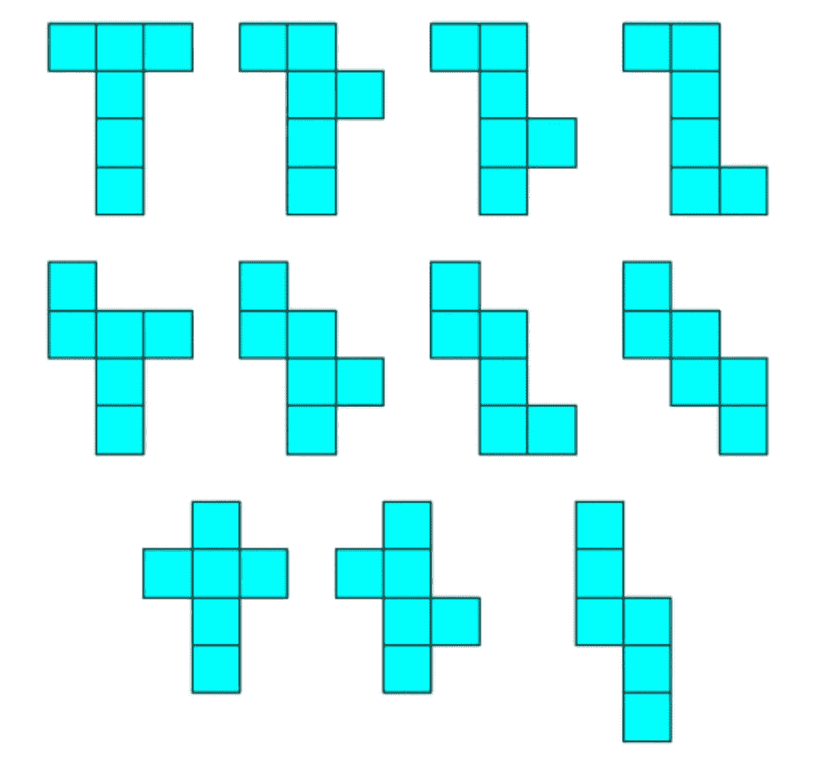
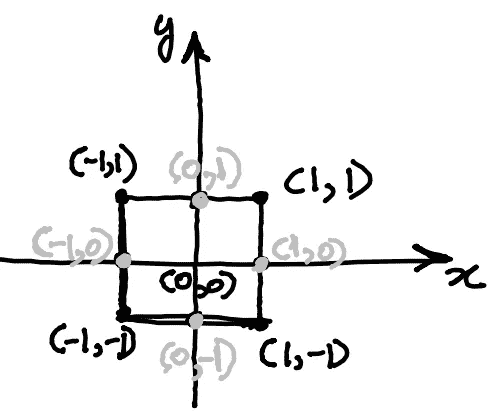
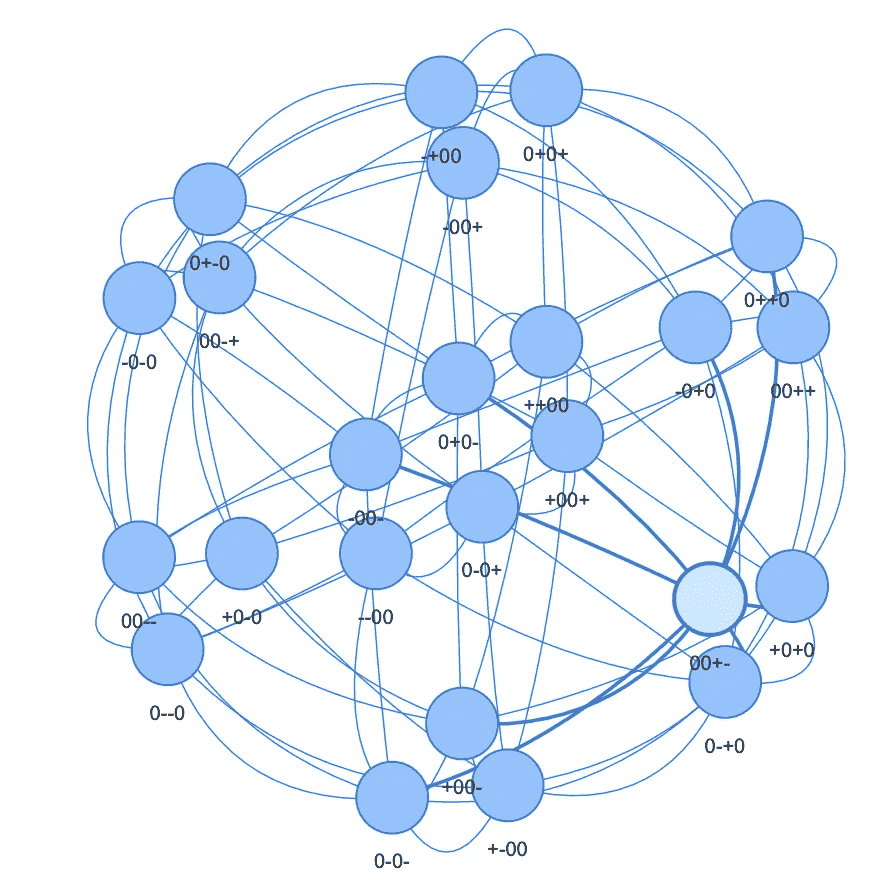
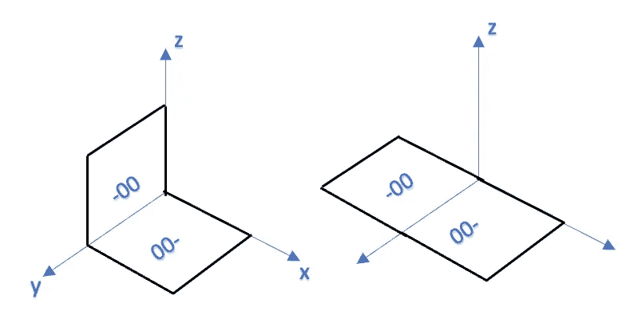
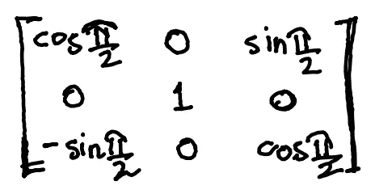
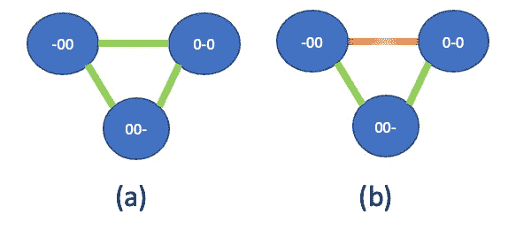
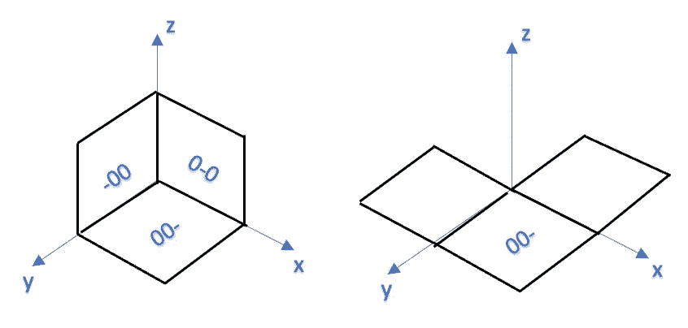
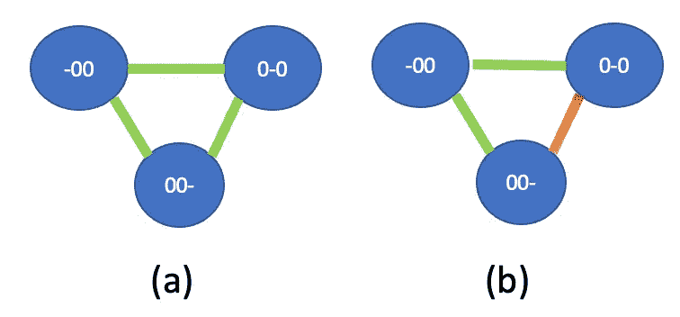
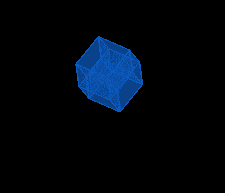

# 用图论将一个四维立方体展平到你的桌子上

> 原文：<https://towardsdatascience.com/flattening-a-4-d-cube-onto-your-desk-a4730312d91c>

## 用计算机科学算法探索更高维的物体

图论在 web2.0 环境中的适用性是显而易见的，像脸书(友谊的无向图)和 Twitter(关注者的有向图)这样的网站就是围绕着它们建立的。另一个明显的应用是在计算机网络中。运筹学领域也充满了图论问题，它始于将数学应用于战场后勤领域。例如，见[这里的](https://medium.com/@rohitpandey576/data-science-in-battle-applying-graph-theory-to-the-ukraine-war-6cda499c86fc)。

但是图论是如此的多才多艺，它在数据科学中也有应用。除了神经网络是特殊类型的图这一事实之外，它还是组合测试领域的前沿和中心，在组合测试领域，我们以涵盖重要属性或属性组合的方式设计实验。比如，看这里的。这是我第一次开始了解它的背景。

然而，在本文中，我们将讨论一个不同的应用。我从小就对四维立方体着迷。我想把它握在手中，像操纵一个三维立方体一样操纵它。正如我们将看到的，我一点也不知道缺失的部分是图论(由于它在数据科学中的应用，我最近才把它加入我的武器库)。

# **我)那么立方体有什么新鲜事吗？**

## **I-A)展平一个立方体**

立方体是一种生活在三维空间中的物体，大多数人都很熟悉它(思想盒子)。它有六个相同的正方形面，其中一些面之间有 12 条边。你用立方体盒子做什么？你把它们切开(看看里面是什么)。这通常通过沿边缘切割来完成。有一些方法可以做到这一点，使六个面仍然与主体保持连接，并平放在地板上。事实证明，当我们以不同的方式进行切割时，会出现 11 个拓扑不同的网格(这意味着你不能平移和旋转一个网格，使其与任何其他网格完全重叠)。这些如下所示。

图 1:切开一个立方体盒子，把它平放在桌子上，得到 11 个不同的网格。图片作者。

请注意，在每个网格中，正好有五条幸存的边。这不是巧合。如果我们把立方体的面看作一个图的顶点，把幸存的边看作这个图的边，那么上图中的每个网格就是一棵生成树。这意味着只有一条路径连接任意两个顶点。由于原始立方体中有十二条边，我们正好切掉其中的七条来得到十一个网格中的任何一个。选择要切割的七条边的方式总数为{ 12 \选择 7} = 792。但是很多都不会导致生成树，因为一个或两个面与身体的其他部分完全隔离。结果是，略少于一半的切割导致生成树，384。并且每个生成树都通向一个有效的网状网络。在这 384 个网格中，如果我们旋转和平移它们，大多数都是以前看到的网格的重复(这意味着它们在拓扑上是等价的)。换句话说，如果我们可以以任何方式将一个网格放置在另一个网格上，使得后者完全覆盖前者，则这两个网格被认为是同一个网格。所以只有上图中的 11 个拓扑独特的出现。

不清楚是什么时候有人第一次数出了这 11 个网眼。这是一个不用计算机也能在合理的时间内解决的问题。因此，在计算机出现之前是否考虑并解决了这个问题是一个有趣的问题。今天大多数作者都引用了 1984 年的文献。在[2]中，加德纳提出了存在多少个网格的问题，他似乎知道答案(在 1966 年)，尽管他没有明确说明。

如果你想知道这种东西的应用，顺便说一下，一个例子是太阳帆，它必须在发射时紧凑，并展开成具有大表面积的东西。

## **I-B)展平一个宇宙魔方**

立方体的概念可以扩展到任何维度的空间。在二维空间中，我们有正方形。在四维空间中，我们得到一个宇宙魔方，一个由三维立方体组成的四维物体。就像一个三维立方体可以展平到二维空间以形成一个正方形网格一样，一个立方体也可以展平到三维空间以形成一个三维立方体网格。

加德纳在 1966 年提出了存在多少这样的网格的问题(见[2]第 x 页)。1985 年(261 目)在[1]中通过一个叫“成对树”的新概念回答。网格最终在 2015 年的 MathOverflow 帖子中可视化了[3]。

到目前为止，似乎还没有人考虑过把一个四维立方体一直展平到二维空间，变成一个正方形网格。这就是我们将在第三节探讨的内容。但是首先，让我们描述一些符号。

# **II)立方体符号**

在这一节中，我们建立一些符号来标识 n 维立方体的各种元素。让我们从二维立方体或正方形开始。我们放置它的方式是，正方形的中心在原点，(0，0)，如下图 2 所示。

图 2:正方形中不同的兴趣点。图片作者。

为简便起见，我们称整个正方形为“00”，因为它的质心恰好位于(0，0)。正方形顶边的中心是(0，+1)。同样，为了简洁起见，我们将其命名为“0+”。类似地，底边被命名为 0-。左边缘为“-0”，右边缘为“+0”。左上角的顶点是(-1，+1)，所以我们称它为“-+”，依此类推。

对于 d 维空间中立方体的任何给定实体，其名称由 d 个字符表示，每个字符可以是-，0 或+中的一个。一串全零是立方体的中心(并且只有一个)。其中一个零被 a +或 a-替换，成为一组(d-1)维立方体。有 2d 个这样的立方体(d 种选择非零字符位置的方法，然后给它分配 a +或 a -)。类似地，有 d*(d-1)/2*4 = 2*d*(d-1)维(d-2)的立方体(选择非零字符的两个位置，然后用“+”或“-”以 4 种方式填充这两个位置)等等。

# **III)二维网格**

我们在第(1)节中看到了如何将一个三维立方体展平成一个二维的桌子，使得所有的面保持连接并且没有一个面重叠。有没有可能用四维立方体或宇宙魔方做同样的事情？有点令人惊讶的是，答案是肯定的。下面显示的就是一个这样的网格。我通过小心翼翼地将“顶部”的三维立方体展平到一张桌子上，其中一些面仍然贴在上面，然后通过反复试验尝试展平剩余的面，使它们不会重叠，从而获得了它。

图 3:将一个四维立方体展平到桌面上的一种方法，这种方法不会使任何一个面相互重叠。图片作者。

显而易见的问题是，有多少这样的网格存在？

## **III-A)有效网格的属性**

对于图 1 中立方体的有效网格，我们注意到两个关键属性，它们也适用于图 2 中的立方体网格:

1.  很明显，所有的面仍然彼此相连(根据定义)。因此，可以从网格中的任何面开始，到达任何其他面。
2.  还要注意，任意两个面之间，最多有一条边。原始立方体或宇宙魔方是这样，因此网格也一定是这样。

结合以上两个事实，并将固体的面视为图的顶点，很明显，网格形成了一个生成树(一个图，所有顶点都可以从任意顶点到达，并且任意两个顶点之间至多有一条边)。这种见解可能是 Turney 在[1]中用来计算一个宇宙魔方的三维网格数的第一步。因此，立方体或宇宙魔方的每一个有效的二维网格(或者就此而言，任何(d

Fig-4: The graph of the 2-d faces of the Tesseract. Image by author.

For the case of the cube, each physical edge maps 1:1 with a graph edge (this might seem obvious, but you’ll see later why I called it out). So, we start with 12 edges and have to cut exactly 7 edges (so 6–1=5 remain) before “opening it up” into a mesh (which is why all the meshes in figure 1 had 5 edges connected). Once we make the 7 cuts (in a way that all the vertices remain reachable from each other), there is only one way to flatten to a mesh.

For a Tesseract, each physical edge actually corresponds to three edges of the graph. This is because three faces meet at every physical edge (as opposed to 2 for a cube). So while the number of physical edges is just 32, the number of graph edges (in the graph where each face is a vertex) is actually 32*3 = 96 (3 ways to choose 2 of the faces meeting at each physical edge). Of these 96 graph edges, only 23 can remain in the flattened mesh. For a given physical edge, if all three graph edges are intact, it will be impossible to flatten the Tesseract to a table without overlap.

# **IV)生成树到网格**

## **IV-A)基本操作**

假设我们有一个可以展平成网格的立方体面图的生成树，用邻接表表示。我们如何从这个图形到实际的展平的立方体网格(如图 2 所示)？我们可以想象通过旋转面部来做到这一点，就像在现实世界中一样。d 维立方体的任何两个相连的面都是垂直的。例如，三维立方体的两个面(根据第 II 节中的术语)00 和-00。请注意，在本节的图中，我已经将原点从立方体的中心移动到其中一个顶点，以使展平过程更加清晰。

图 5:两个面的简单展平操作。图片作者。

我们总是可以固定其中一个面，并沿着连接它们的边将另一个面旋转到它的平面，如上图所示。这是我们将在其上构建的基本操作。注意，无论展开发生在多大的空间维度，初始和最终的构型都是唯一的。总是有一个围绕连接两个面的公共边(这里是 y 轴)的简单旋转，可以用矩阵形式表示。在上面的例子中，这个旋转矩阵(x-z 平面上的旋转)是:

图 6:描述 x-z 平面旋转的旋转矩阵。

在计算机上执行此操作的一个微妙之处是，旋转(取决于角度是正还是负)可能会将-00 面带到 00 面的顶部或附近。我们希望避免旋转导致面重叠。如果在旋转矩阵中插入\pi/2 导致面重叠，我们只需插入-\pi/2。

## **IV-B)两个简单网格**

现在，让我们只取一个三维立方体的三个面。比如 00-，0–0 和-00。这三个面如下图所示。

图片作者。

在原始立方体中，它们都是相互连接的。这三张脸的脸图看起来像图 7-a。

图 7:仅对应于立方体的三个面的图形。作者图片

但这不是一棵树。在树中，任意两个顶点之间只有一条路径。在上图中，在-00 和 0–0 之间有两条路径(直接路径和通过第三个顶点 00-)。为了使它成为一棵树，我们必须切掉一边。在图 3-b 中，我们选择剪切-00 和 0–0 之间的顶边。现在我们有了一棵树，我们需要得到相应的网格。

首先，我们选择一个面，在展平的网格中，所有其他面都将旋转到该面的平面中。如果我们打开一个立方体的盒子，这将是放在地板上的那张脸。这一张是“基面”，选择是任意的。在上面的例子中，我们选择 00-(图中的底面)作为基础面。

这里，剩余的两个面直接连接到基础面。我们可以简单地将它们分别旋转到基面的平面，就像前面描述的“基本操作”一样，得到下面的网格。

作者图片

这是一个简单的例子，两个面都必须直接连接到基础面进行旋转。让我们回到图 7-a，这次在 0-0 和 00-之间切边。我们得到了另一棵有效的生成树。让我们保持基面不变。

作者图片

现在，我们必须分两步进行旋转。0–0 面连接到-00 面。如果我们首先旋转-00 面，将 0–0 面带到其平面所需的旋转(旋转矩阵以及围绕其旋转的轴)将会改变(因为现在一切都已旋转)。为了避免这种情况，我们首先旋转 0–0 面并将其带入-00 平面。只有这样，我们才能将这两个面带到 00 面所在的 x-y 平面。这种操作顺序如下所示。

作者图片

请注意，这里 0–0 面需要两次旋转，因为它距离树中的基面(00-)有两次跳跃，而-00 面需要一次旋转，因为它距离基面有一次跳跃。有了这两种情况的直觉，给定我们选择保留的边的生成树，我们可以开发将立方体展平为二维网格的通用算法。

## **IV-C)用于执行旋转的算法**

给定从 d 维立方体到网格的生成树，可以设计一种算法，以正确的顺序将旋转应用于所有的面。首先，我们知道立方体的所有面都需要被访问(并且必须对那些访问中的面执行某些操作)。由于面被表示为图形，所以首先想到的是图形探索算法(探索图形的所有顶点的算法)。

最简单和最广为人知的图探索算法被称为深度优先搜索(DFS 参见 Cormen 等人的《算法导论》[4]的第 22.3 节)。我们不是将它应用于立方体的原始图，而是应用于生成树(它也是一个图，只是边的数量少得多)，从基面开始。这是因为它是映射到我们所追求的网格的生成树。

我们需要在所有面上执行的基本操作是旋转，将它们带到与基面相同的平面上。当我们从一个面到下一个面(执行 DFS)时，我们知道根据第 IV-A 节将后者带到与前者相同的平面所需的旋转。因为我们从基面(b)开始，这是唯一没有旋转的面。生成树中直接连接到基础面的面(让我们称它们为“第一层面”)旋转一次。连接到第一层面(“第二层”)的那些得到两次旋转(首先将它们带到与相应的第一层面相同的平面，然后到基础面的平面)。

对于任何给定的面(比如 f)，在树中有一条从基面(b)到它的路径。从基面 b 开始，沿着这条路径遇到的每个新面都有一个相应的旋转，可以应用到它，使它与路径中的前一个面在同一个平面。沿着路径累积的这些旋转中的每一个都必须应用于给定的面 f。我们可以通过在树上的深度优先搜索来保存所有这些旋转的记录。DFS 中有一个顶点颜色的概念(再次参考 Cormen 等人[4]的 22.3 节)，可以是白色、灰色或黑色。白色意味着图(或树)的顶点还没有被碰到(所有顶点在算法开始时都是白色的)。灰色表示它已被访问过，但探索中其下游的所有顶点尚未被处理，黑色表示算法已处理完该顶点及其所有下游顶点(一旦算法完成，所有顶点均为黑色)。只要我们还在遍历一条路径(还没有完成)，沿着这条路径遇到的所有顶点都将被标记为灰色。因此，我们可以维护对应于每个灰色顶点(或面)的要执行的旋转的列表。当一个顶点被标记为黑色时，我们只需从列表中删除相应的旋转。

然而，将这些旋转应用到给定面(f)的顺序也很重要，正如我们在截面 IV-B 的三面网格的第二个示例中看到的。给定面应首先旋转到它直接连接的面的平面，然后旋转到路径中它之前的平面，依此类推，顺序相反，直到它最终与基面在同一平面。这确保了我们不必在其他旋转发生时更新旋转。“stack”数据结构非常适合这种情况，因为它具有“后进先出”的属性(想象一堆脏盘子)。

因此，我们不是在遇到面时应用对应于灰色顶点的所有旋转，而是将旋转和要应用旋转的面存储在一个堆栈中。一旦深度优先搜索完成了对所有顶点的探索，我们实际上通过从堆栈中一次弹出一个面和相应的要应用的旋转来应用旋转。下面是这种算法通过执行所需的旋转序列从立方体到网格的直观演示。

图片由作者创作，使用:[https://github.com/ryu577/pyray](https://github.com/ryu577/pyray)

而这里的是上述算法的 Python 实现。

这是一个将这种算法应用于常见的三维立方体的视频:

# **V)计算界限**

当我们在第三部分看到我们的第一个二维网格时(图 3)，我们问有多少个。在没有确切答案的情况下，我们希望上限和下限尽可能紧密。

我们将在第六节中描述从其中一个开始生成随机网格的方法。如果我们只保留拓扑上不同的网格，我们不仅会建立一个网格库，还会建立一个计算下限，这是我们设法收集的不同数字。任何理论下限最终都会被计算下限所取代。到目前为止，该算法(我偶尔运行它 10 分钟，并添加到网格集合中)已经成功收集了大约 600 个不同的网格(这个计数一直在增加)。因此，一个立方体的二维网格数的当前计算下限是 600。

对于上界，回想一下 IV-C 节中的算法，该算法在可能的情况下从面图的生成树生成有效的网格(这通常是不可能的)。即使在我们用这种方法得到的网格中，也会有与之前看到的其他网格拓扑相似的版本。因此，生成树的数量应该是不同网格数量的一个合理上限。

此外，由于每个网格对应于一个唯一的生成树(但是一个生成树可能不会产生一个网格)，因此计算网格数量的一种方法(同时建立一个网格库)是遍历所有可能的生成树。对于每一个，我们检查一个网格是否是可能的，如果它碰巧是一个“拓扑新颖”的网格(意思是我们以前没有见过任何与之拓扑相似的网格)，我们把它保存在某个地方。

问题是生成树的数量是 10 个⁰(可以通过将[基尔霍夫矩阵树定理](https://en.wikipedia.org/wiki/Kirchhoff%27s_theorem)应用于图 4 中的图来获得)。因此，即使我们花一毫秒来处理一棵生成树，也要花比目前宇宙年龄更长的时间来穷尽所有的生成树。因此，我们从这种攻击中得到的唯一东西是网格数的一个非常大的上限。有很多方法可以改进这一点，但我们现在不会深入讨论它们，因为它们仍然保持天文数字的上限。

# **VI)工作网格生成算法**

在 IV-C 节中的算法将总是给我们一个对应于生成树的网格，如果这样的网格是可能的话(通常不是这样)。如果我们有办法迭代生成树，我们就可以在可能的地方生成网格

如前一节所述，获得不同网格数量下限的一种方法是简单地开始生成它们，并消除那些与之前看到的网格在拓扑上相同的网格。这种算法将继续“收集”网格，有点像优惠券收集者问题，并维护迄今为止看到的不同网格的“库”。这种方法的一个问题是，我们永远无法确定我们是否以及何时看到了所有的网格。当我们非常接近生成所有网格时，它将变得越来越难“收集”了。到最后，我们随机绘制的每个网格几乎都是以前见过的。因此，如果我们已经生成了许多网格，而没有遇到新的网格，这可能是因为我们已经简单地完成了我们的收集，或者剩下了一些，当随机绘制时，很难看到新的网格。

现在，我们选择忍受这个缺点，简单地收集尽可能多的网格。我们的算法有两部分。

第一种方法从一个给定的网格开始，并从它生成另一个有效的随机网格，这个随机网格保证与前一个不同。这是通过切割第一个网格的两个连接面之间的边来完成的。这创建了两个子网格和两个子树(原始生成树被一分为二)。然后，我们找到另外两个面(一个来自第一个子网格，一个来自第二个)将两个子树“粘贴”在一起，并创建一个新的生成树。因为两个“子树”再次连接，所以能够从任何面到任何其他面的属性被恢复。然后，我们可以使用 IV-C 节中的算法，看看这个新树是否能生成有效的网格。如果没有，我们简单地生成一个新的树，并继续下去，直到我们找到另一个有效的网格。网格以文本文件的形式保存在磁盘上，文本文件是相应生成树的邻接表。

第二部分将新的网格与所有现有的网格进行比较，并删除以前见过的网格。

这些想法在下面的 Python 代码中实现:[https://github . com/Ryu 577/pyray/blob/master/pyray/shapes/twod/tst _ sq _ mesh . py](https://github.com/ryu577/pyray/blob/master/pyray/shapes/twod/tst_sq_mesh.py)。第二部分是真正的计算瓶颈。我们收集的网格越多，将一个新网格与所有以前的网格进行比较的代价就越大。如上所述，这个两部分算法可以永远循环运行，直到它变得非常非常难以找到新的网格。

# 结论

计算一个四维立方体的二维网格的问题有两个最流行的数学问题的特征。这很容易用一种几乎任何人都能理解的方式来解释和构建。与此同时，似乎即使是我们最先进的工具也无法解决这个问题。至少，我们可以在这个问题上释放我们的计算能力，发现几乎所有的网格。

_______________________________________________________

如果你喜欢这个故事，成为推荐会员:)

[https://medium.com/@rohitpandey576/membership](https://medium.com/@rohitpandey576/membership)

# **参考文献**

[1]论文 1984，其中三维网格被映射到成对的树(【https://unfolding.apperceptual.com】T4)。

[2]马丁·加德纳 1966 年的书(《数学巨著》):[https://www . logic-books . info/sites/default/files/The _ 庞 _ 书 _ of _ 数学. pdf](https://www.logic-books.info/sites/default/files/the_colossal_book_of_mathematics.pdf)

[3] MathOverflow 帖子，其中绘制了所有不同的三维网格([https://math overflow . net/questions/198722/3d-models-of-the-unfoldings-of-the-hyper cube/](https://mathoverflow.net/questions/198722/3d-models-of-the-unfoldings-of-the-hypercube/))

[4]科尔曼等人的《算法导论》