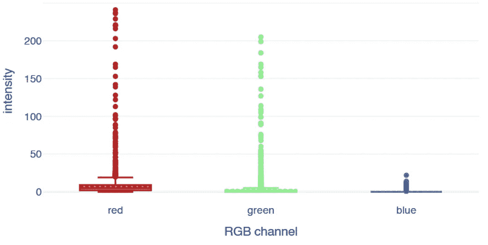
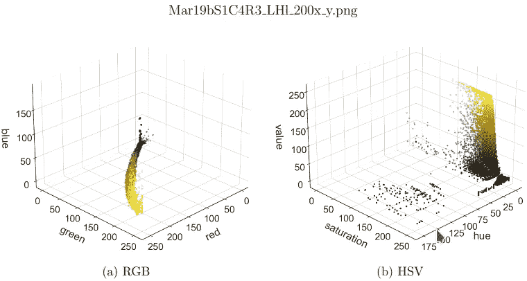
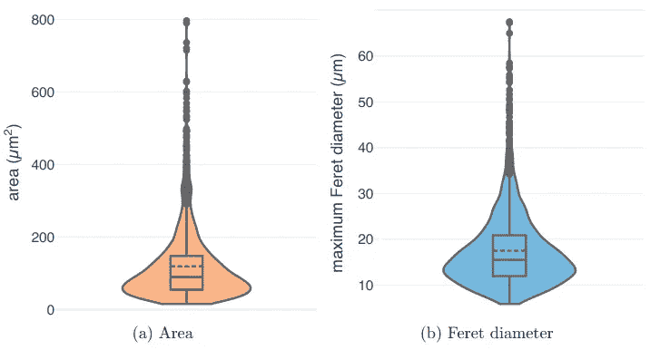
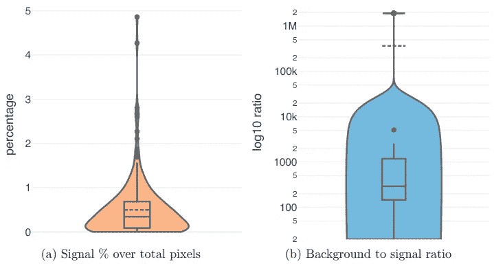
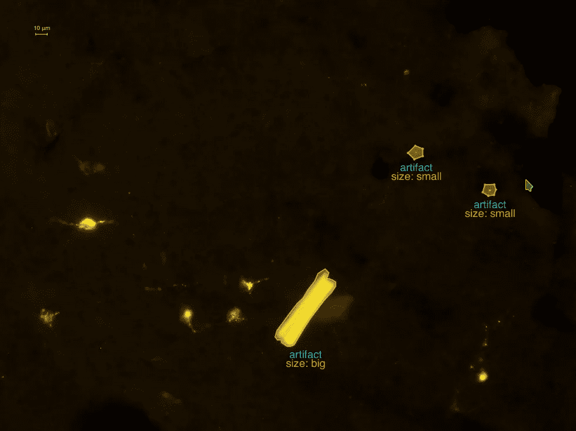

# 荧光神经元细胞数据集—第二部分

> 原文：<https://towardsdatascience.com/fluorescent-neuronal-cells-dataset-part-ii-e1ac27e26d7>

## 独特的特征和挑战

[JESHOOTS.COM](https://unsplash.com/@jeshoots?utm_source=medium&utm_medium=referral)在 [Unsplash](https://unsplash.com?utm_source=medium&utm_medium=referral) 上拍照

在本系列的第二篇文章中，我们将更详细地浏览 [*荧光神经元细胞*(*【FNC】*)](http://amsacta.unibo.it/6706/)的数据，强调它们的一些特有特性和挑战。

如果您错过了第一部分，请查看更多有关数据收集方式及其含义的详细信息:

 [## 荧光神经元细胞数据集—第一部分

### 一种新的目标分割、检测和计数基准

towardsdatascience.com](/fluorescent-neuronal-cells-dataset-part-i-ac123196b963) 

# 独特的特征

荧光神经元细胞数据集带有一些特殊的特征，可能值得一提，以帮助分析这些数据。

## RGB 通道

由于有意选择了特定波长的光线，图片主要由两种流行的色彩构成:

*   荧光标记发出的黄色调
*   背景的暗色调。

因此，要填充的颜色通道只有红色和绿色，它们的组合产生黄色，而蓝色通常是空的(*图 1* )。

**图一。**像素强度分布— [作者图片](http://amsdottorato.unibo.it/10016/1/thesis_CLISSA_DSC.pdf)

因此，通过 3D 色彩空间*表示 FNC 数据可能是多余的*，并且较低维度的表示可能是足够的(例如灰度)。

另一方面，分散在额外维度中的剩余信息可能有助于从背景中辨别细胞的像素——为什么要丢弃它呢？然而，RGB 并不是唯一可用的[色彩空间](https://en.wikipedia.org/wiki/Color_space)，所以人们可能会想，对于 FNC 数据的分析来说，*其他表示法是否可能更方便*。

*图 2* 将一幅图像的像素显示为三维色彩空间中的点。颜色反映了图像中像素的外观，而位置是使用 RGB(左)或 [HSV](https://en.wikipedia.org/wiki/HSL_and_HSV) (右)编码确定的。

**图二。** RGB 与 HSV 色彩空间— [作者图片](http://amsdottorato.unibo.it/10016/1/thesis_CLISSA_DSC.pdf)

在 RGB 表示中，点是杂乱的，并且几乎是对齐的。相反，云在 HSV 空间中分散得多，这可以促进细胞像素和背景之间更容易的分离。

这一观察表明*不同的色彩空间对于特定的学习任务*来说或多或少都是方便的，因此选择一个色彩空间可能会影响结果。出于这个原因，FNC 数据集的作者在他们为这些数据提议的 [**c-ResUnet**](https://www.nature.com/articles/s41598-021-01929-5) 架构中插入了一个学习过的色彩空间转换。

## 细胞特征

除了技术规格，考虑要分割/检测/计数的对象的特征也很重要。

例如，我们可以检查像*面积*和*最大值* [*费雷特直径*](https://en.wikipedia.org/wiki/Feret_diameter) 这样的量的分布，以了解不同神经元细胞之间大小的可变性。

**图 3。**细胞面积和费雷特直径— [图片由作者提供](http://amsdottorato.unibo.it/10016/1/thesis_CLISSA_DSC.pdf)

这两个指标表明，大多数细胞尺寸较小，第 75 百分位分别约为 150μm 和 21μm。尽管如此，这两种分布呈现长尾效应，延伸到更高的值，达到上述度量值的三倍以上。

另一个重要的方面是每张图片中对象的数量。

**图 4。**计数分布— [图片作者](http://amsdottorato.unibo.it/10016/1/thesis_CLISSA_DSC.pdf)

大多数图像呈现低数量的神经元，中值为 21，第一个峰值为 *56 个图像，没有细胞* ( *# cells=0* )。剩下的那些反而形成了一条非常长的尾巴——事实上是分布的一半——在一幅图像中，较高的值挤在几个局部峰值周围，最多可达 68 个单元。

总而言之，这些细胞在大小、形状和数量方面表现出相当的异质性。因此，这需要一个足够灵活的模型来处理这种可变性。

# 挑战

FNC 数据集提出了一些在训练期间必须解决的特定挑战。

## 阶级不平衡

其中之一肯定是背景和细胞像素之间的极度不平衡。

**图 5。**阶层失衡— [作者图片](http://amsdottorato.unibo.it/10016/1/thesis_CLISSA_DSC.pdf)

几乎 90%的图像包含不到 1%的细胞像素。更重要的是，这个百分比在最好的情况下不超过 5%，最大值为 4.86%。

就绝对值而言，在 50%的图像中，背景像素大约是细胞像素的 20 到 300 倍，分布的重要部分延伸到超过 1000 倍。

当然，学习任务通常会受到班级比例失调的影响，因此对 FNC 数据的分析应该考虑必要的补救措施来处理它。

## 确凿的例子

除了班级不平衡之外，一般来说，FNC 和荧光显微镜成像也面临一些特殊的挑战。

**图 6。**挑战— [作者图片](http://amsdottorato.unibo.it/10016/1/thesis_CLISSA_DSC.pdf)

例如，有时多个单元靠得很近，甚至相互重叠。在这种情况下，精确的分割对于正确处理细胞团块至关重要。因此，可能需要一些技巧来帮助模型分离不同的细胞实例(例如[分水岭](https://en.wikipedia.org/wiki/Watershed_(image_processing))后处理)。

## 嘈杂的标签

此外，复杂性的一个重要来源是由于细胞识别中固有的任意性而导致标签中存在噪声。

事实上，有时甚至人类专家也不同意是否应该将标记染色视为细胞。因此，可能会发生类似的例子在图像上被稍微不同地标记的情况。

不幸的是，这个问题很难解决。然而，在评估结果时，人们可能希望将它考虑在内，或者至少在查看纯度量时意识到这个问题。

## 史前古器物

最后，学习任务受到偶然存在的荧光团积累的阻碍，这些荧光团产生与细胞非常相似的发射。

当这种情况发生时，图片可能包含虚构的物体或在形状、大小或颜色方面类似神经元细胞的无趣结构。

**图 7。**生物文物— [作者图片](http://amsdottorato.unibo.it/10016/1/thesis_CLISSA_DSC.pdf)

这些伪像可能从细丝和点状伪像(*图 7 和图 8* )的小区域变化到更大的结构，如*图 7* 中的条纹或*图 8* 中的“马卡龙”形物体。

**图 8。**技术神器— [作者图片](http://amsdottorato.unibo.it/10016/1/thesis_CLISSA_DSC.pdf)

因此，该模型确实需要理解细胞的形态，并将其与颜色信息一起考虑，以便识别它们。

> 干得好，走到了这一步！

在本文中，我们介绍了在荧光神经元细胞数据集上执行的一些 EDA，强调了在分析这些数据时要解决的一些特殊特征和挑战。

在本系列的下一篇也是最后一篇文章中，我们将讨论一些建议的度量标准，以评估特定于这些数据的检测和计数性能。

> 如果你喜欢这个话题，你可以在[ [1](http://amsdottorato.unibo.it/10016/1/thesis_CLISSA_DSC.pdf) 、 [2](https://rdcu.be/cB1Ds) 中阅读更详细的讨论。另外，你可以继续下载[数据集](http://amsacta.unibo.it/6706/)，用原始论文的[代码](https://github.com/robomorelli/cell_counting_yellow)做实验，用**数据**玩自己。
> ***让我知道你在评论里发现了什么！***

# 参考

[1] L. Clissa，[通过机器和深度学习支持科学研究:荧光显微镜和操作智能用例](http://amsdottorato.unibo.it/10016/) (2022)， *AlmaDL* [2] R .莫雷利等人，[通过 c-ResUnet 的深度学习实现荧光显微镜中的细胞计数自动化](https://rdcu.be/cB1Ds) (2021)，*科学报告*