# MNIST 上的 Flux.jl 性能分析

> 原文：<https://towardsdatascience.com/flux-jl-on-mnist-a-performance-analysis-c660c2ffd330>


布拉登·科拉姆在 [Unsplash](https://unsplash.com/?utm_source=unsplash&utm_medium=referral&utm_content=creditCopyText) 拍摄的照片

## 在上一篇文章中定义了各种模型和训练算法后，我们现在来看看它们在应用于 MNIST 数据集时的表现。

# 介绍

在之前的一篇文章([*flux . JL on MNIST——主题变奏曲*](/flux-jl-on-mnist-variations-of-a-theme-c3cd7a949f8c) )中，我们定义了三种不同的神经网络(NN)，目的是使用 MNIST 数据集识别手写数字。此外，我们实现了梯度下降算法(GD)的三个变体来训练这些模型，它们可以与不同的成本函数和不同的优化器结合使用。

因此，我们有相当多的积木，它们可以以各种方式组合，以实现我们识别手写数字的目标。具体来说，我们有以下组件(要了解更多信息，请查看上面引用的前一篇文章):

*   型号: *4LS，3LS，2LR*
*   GD 变体:*批量 GD、随机 GD* 和*小批量 GD*
*   成本函数:均方误差( *mse* )和交叉熵( *ce* )
*   优化者:*下降*和*亚当*

在本文中，我们将分析这些组件的不同配置对于图像识别的表现如何，以及需要多少努力(以 GD 的迭代次数和用于该目的的时间表示)来训练它们。

# 学习曲线

我们不仅对模型在用 GD 训练后的性能感兴趣，而且我们还想通过在每次迭代后查看成本函数(或*损失函数*的同义词)的值来了解 GD 在执行过程中的表现。

绘制这些值与迭代次数的关系，我们得到所谓的*学习曲线*。这条曲线很好地描述了 GD 收敛的速度，以及在训练过程中是否存在问题(例如，如果 GD 陷入平稳状态)。

为了在培训期间收集这些值，我们必须在 GD 实现中添加几行代码:

*   由于计算损失在计算上可能是昂贵的，我们不希望总是在每次*迭代时都这样做，而是只在每次*到第 n 次*迭代时才这样做。这由新的(可选的)关键字参数`logstep`(第 1 行)控制。1 的`logstep`意味着我们在每次*迭代后*计算并存储损失，例如 100 的值意味着我们仅在每次第 100 次迭代后才这样做。
    仅举例说明差异有多大:使用随机 GD 对 4LS 模型进行 4000 次迭代，不记录损失需要 3.8 秒，每次迭代计算损失需要 262.9 秒。*
*   在第 2 行中，用于存储损失历史的数组`hist`被初始化为零。
*   在第 9 行中，我们检查是否已经到达应该记录损失的迭代，并将相应的损失值存储在`hist`数组中(第 10 行)。
*   在函数的末尾(第 13 行)，我们返回完整的损失历史。

*注意* : Flux 提供了一种回调机制，可以根据时间间隔来实现这种日志记录。即，使用该机制，损失值不会在每 *n* 次迭代之后被记录，而是在每 *n* 秒之后被记录。

# 准确(性)

训练完模型的参数后，我们想知道这组参数在用于识别手写数字时的表现如何。因此，我们将测试数据集上的模型预测与测试数据集的实际标签(`test_y_raw`)进行比较，并计算正确识别数字的比例。这个分数叫做模型的*精度*。

例如，我们通过调用`model4LS(test_x)`获得 4LS 模型的预测。结果是一个由 10，000 个热点向量组成的数组。为了将它们与`test_y_raw`中的标签进行比较，我们必须将独热向量转换成数字。这可以使用函数`Flux.onecold()`来完成，它简单地返回一个热向量中 1 位的索引。也就是说，如果第一位是 1，函数返回 1，如果第二位是 1，我们得到 2，依此类推。由于我们的模型产生一个第一位设置为 1 的独热向量，如果“数字 0”被识别，我们必须将`onecold()`的结果减 1 以获得正确的标签。

因此，精度计算如下:

```
function accuracy(y_hat, y_raw)
    y_hat_raw = Flux.onecold(y_hat) .- 1
    count(y_hat_raw .== y_raw) / length(y_raw)
end
```

例如，调用`accuracy(model4LS(test_x), test_y_raw)`将获得测试数据集上 4LS 模型的准确性。

`accuracy`功能使用 btw。*用`.`-算子广播朱莉娅的*机制。第一个公式中的运算`.-`从表达式左侧数组的每个元素的*中减去 1。第二个公式中的`.==`将`y_hat_raw`的*每个*元素与`y_raw`中的*每个*对应元素进行比较(产生一个布尔数组)。*

# 培训和分析

以下所有的训练都是在一台 8 GB 内存的苹果 M1 上使用 Julia 1.7.1 和 Flux 0.13.3 完成的。

列出的所有运行时间都是使用等于批量的`logstep`完成的。即损失函数值仅在运行结束时取一次，因此对运行时间没有显著影响。

给那些想要自己重复分析的人一个提示:如果你想要用相同的配置分析不同数量的迭代，例如，比较 1000 次迭代和 2000 次迭代的结果，你不必运行 1000 次迭代和 2000 次迭代。相反，这可以以相加的方式完成(即，首先运行 1000 次迭代，然后再运行 1000 次)，因为每次迭代都应用于同一组模型参数。

# 分析

## 批量梯度下降

我们从一个“经典”组合开始分析:批处理 GD 变体和`Desc`-优化器。对于 4LS-和 3LS-模型，我们将使用 *mse* 损失函数和 2LR 交叉熵。正如前一篇文章中所讨论的，这些模型和成本函数的配对应该工作得最好。

一些实验表明，0.2 的学习率在这种情况下效果很好。

**4LS 和 3LS 的结果** 使用 500 次迭代，我们可以看到 4LS 模型在大约前 200 步快速收敛，然后明显变慢。在 3LS 模型上，这种减速在不到 100 次迭代时就已经开始了:

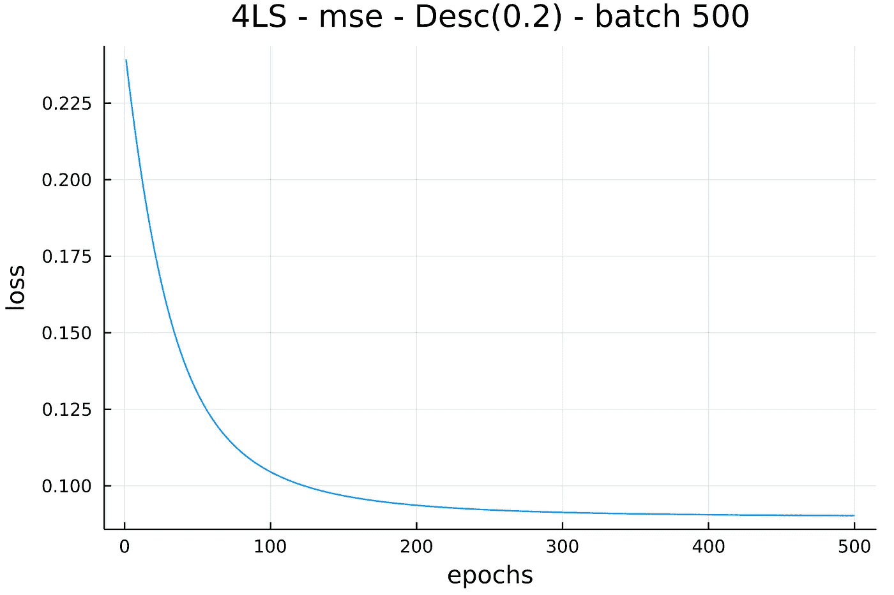

迭代 1–500[图片由作者提供]


迭代 1–500[图片由作者提供]


批次 GD — 4LS、3LS[图片由作者提供]

训练 3LS 模型需要更长的时间，因为它有更多的参数。但是我们可以看到:并不是随着参数数量的线性增加。更高的努力也导致了更好的结果，在大约 2000 次迭代后显示:4LS 保持在大约 11%的精度，而 3LS 增加到几乎 20%。

但是在这两种情况下，结果都不是压倒性的(至少在评估的迭代范围内)。

**2LR 的结果**
2LR-型号的结果完全不同。通过 500 次迭代，我们在大约 200 秒内获得了几乎 93%的准确率。

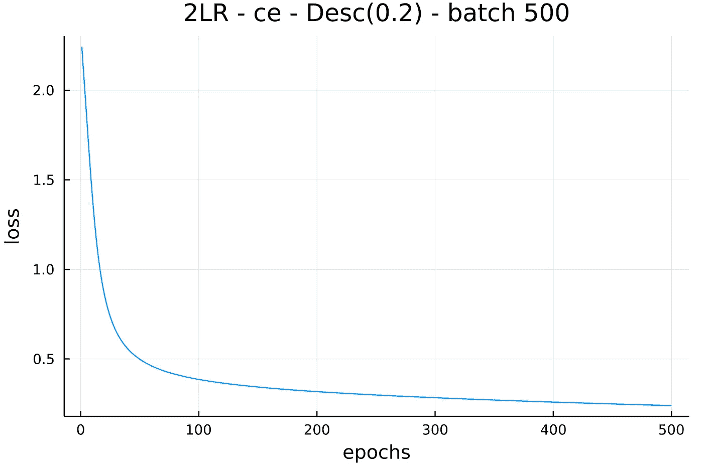

迭代 1–500[图片由作者提供]

因此，在将迭代次数增加到 4000 次后，这些数字进一步提高，达到 96%以上的准确度。

放大迭代 8000 次到 16000 次之间的学习曲线，我们可以看到在损失方面仍有良好的进展。


迭代 1–16，000[图片由作者提供]

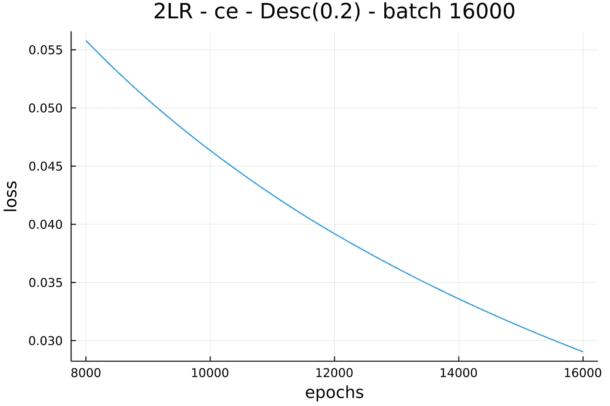

迭代 8000–16000 次[图片由作者提供]


批量 GD—2LR[图片由作者提供]

进行更多的迭代仍然会减少损失:从 16，000 次迭代到 32，000 次迭代会将其值从 0.033 减少到 0.013。但是准确性没有明显的变化(它保持在 96%和 97%之间，甚至随着迭代次数的增加而有所下降)。所以这可能是我们从这个配置中能得到的最好的了(真的不差！).

在这一点上请注意:损失是根据训练数据计算的，而准确性是基于测试数据的。因此，这里描述的情况可能是对训练数据的过度拟合(因此损失进一步减少)，这不会导致对测试数据的更好预测(即准确性没有提高)。

## 随机梯度下降

现在我们来看看 GD 的下一个变种。使用随机 GD，我们应该期望大大降低运行时间，但可能也会降低质量。

**4LS 和 3LS**
的结果，实际上，4LS-model 在不到一秒的时间内完成 500 次迭代，达到 0.090 的损耗和 10.28%的精度。对于 3LS 模型来说，同样数量的迭代需要一秒多一点的时间，而我们得到的准确率接近 14%。


迭代 1–500[图片由作者提供]

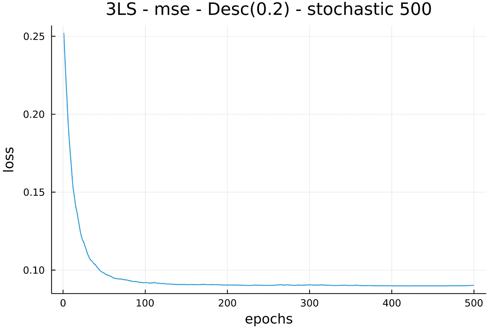

迭代 1–500[图片由作者提供]

仔细观察学习曲线，我们还可以看到它们不像批次 GD 中的曲线那样平滑。曲线上的小突起是由于随机 GD 并不总是以最佳方式达到最小值。

这里出现了与上面相同的问题:我们能通过更多的迭代获得(显著)更好的结果吗？用 4LS 做 1000 次迭代，精度(至少有一点)提高到 11.35%。但是在 2，000 次迭代时，我们再次变差(10.28%)，在 8，000 次迭代时，我们回到 11.35%。发生了什么事？

放大学习曲线(迭代 2，000 到 4，000 次之间)很有启发性。在这里，我们可以在一个具体的例子上看到我们之前在理论上描述的:随机 GD 不以最直接的方式移动到最小值，而是以之字形路径移动。而在这里，它似乎根本没有朝着正确的方向前进。

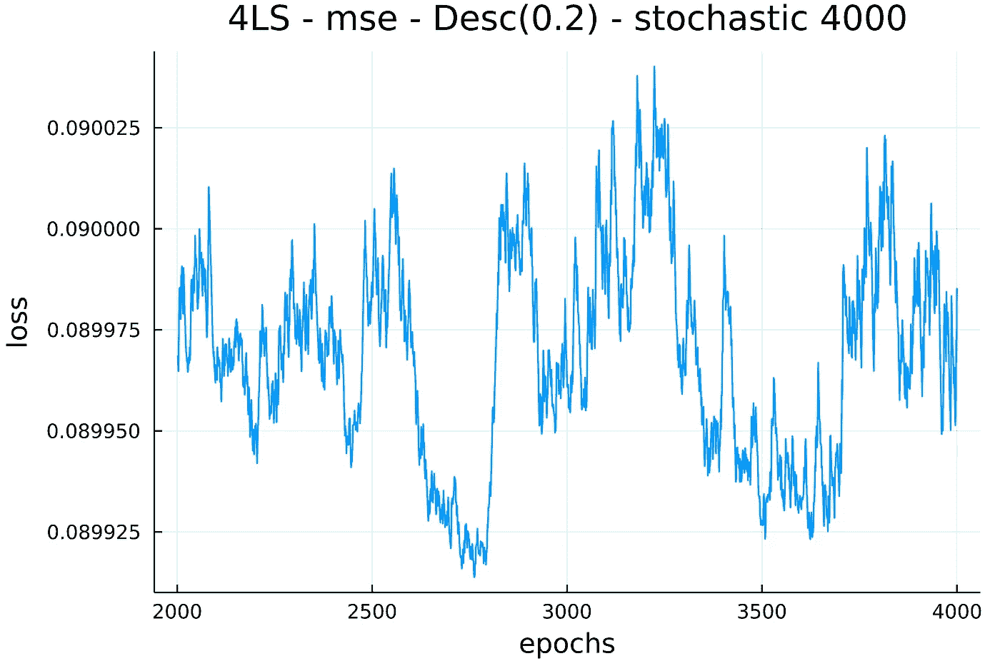

迭代 2000–4000 次[图片由作者提供]

对于 3LS 模型，同样的情况似乎会发生，因为我们在 500 次迭代时达到 13.94%的精度，在 1000 次迭代时回落到 13.12%。但是学习曲线表明这里的情况不同:

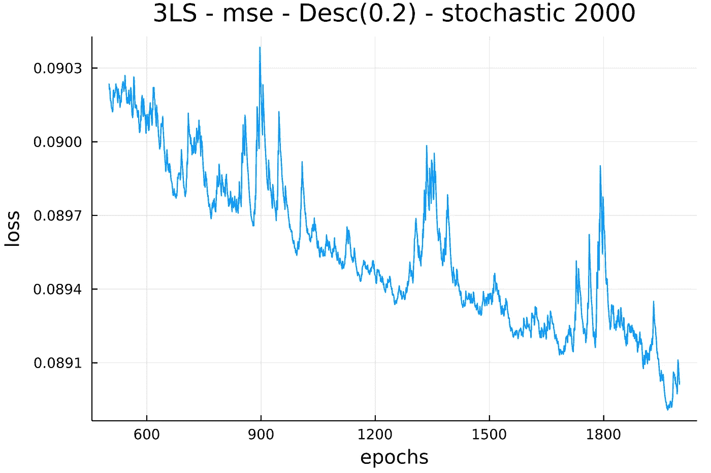

迭代 500–2000 次[图片由作者提供]

曲线也是振荡的，但是有一个明显的下降趋势。因此，经过 16，000 次迭代后，我们的准确率接近 80%，经过 512，000 次迭代后，我们的准确率达到 96.64%。

除此之外，学习曲线以一种有趣的方式发展:

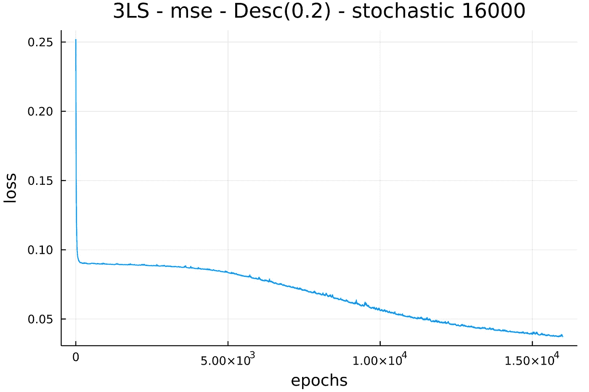

迭代 1–16，000[图片由作者提供]

在最初几次迭代中迅速降低之后，损耗在大约 4，000 次迭代之前没有太大变化。有一个平稳期。但是我们又一次看到了显著的进步。

所以也许 4LS 显示了同样的现象，我们不应该这么早放弃？事实上，在 15，000 次和 20，000 次迭代之间的范围内，损耗开始下降得更快，在大约 60，000 次迭代以上的范围内，学习曲线再次变得更陡:

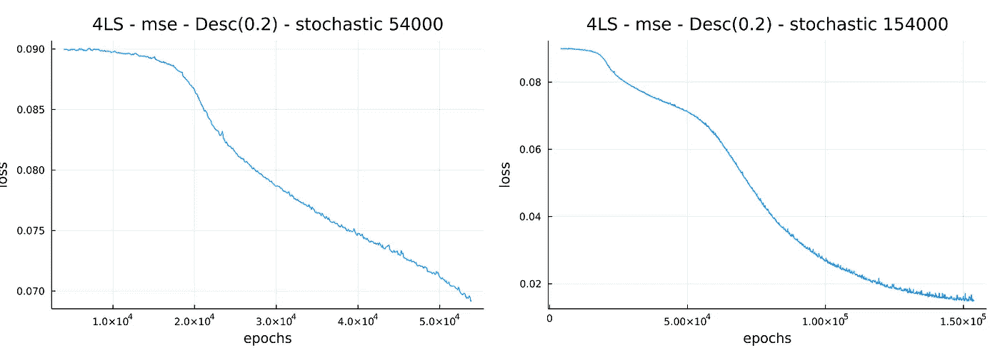

迭代 4001–54，000 和 4001–154，000[图片由作者提供]

通过超过 1 M 的迭代，我们在 4LS 的情况下实现了 94.78%的准确度。

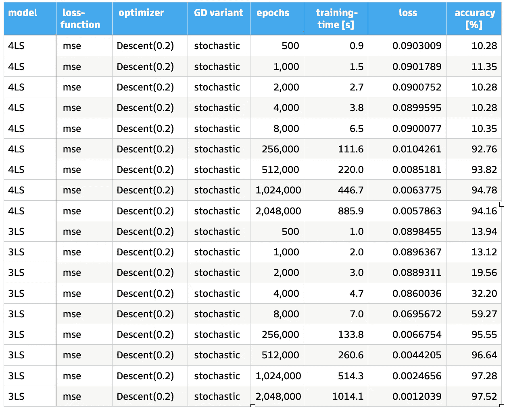

随机 GD — 4LS，3LS[图片由作者提供]

**2LR 的结果** 与 4LS 和 3LS 相比，2LR 在 500 次迭代时的性能明显更差:我们仅获得 9.75%的精度(但与使用批处理 GD 的大约 200 秒相比，只需要 2.7 秒)。不幸的是，如果我们做更多的迭代，结果不会变得更好。即使迭代超过 200 万次，我们也只能得到 10.1%的准确率。学习曲线显示了与这一发现一致的清晰画面:

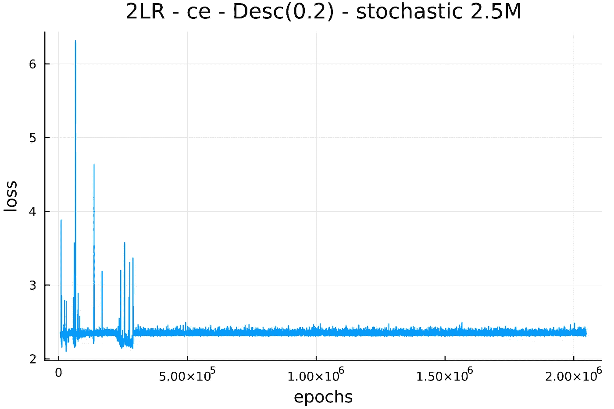

迭代 8，001–2，048，000[图片由作者提供]

为什么我们用这种配置会得到这么差的结果？答案大概是:太无知了。随机 GD 忽略 60，000 个实例中的 59，999 个(这是一个很大的数目！).然后我们将剩下的少量信息输入损失函数。 *mse* 以同样的方式使用该信息的每一位来计算损失，但是 *ce* 本身有一些内置的“无知”:它只考虑产生的唯一热向量的一个值(最大值)。也就是说，它非常重视那个值，而忽略了其他值。从许多实例来看，这可能是一个好策略，但是在我们的情况下(尤其是从一个未经训练的模型开始)，这可能只会导致随机的无意义。

## 小批量梯度下降

由于小批量 GD 是其他两种变体之间的折衷，它应该在我们到目前为止考虑的所有配置上都工作良好，但是比随机 GD 运行需要更长的训练时间。让我们看看，如果训练运行符合我们的期望。

**4LS 和 3LS 的结果** 实际上，我们对 4LS 和 3LS 模型都获得了极好的结果:在大约 50 万次迭代时，可分别实现 94.56%的准确度，在 200 万次迭代时，可分别实现 97.68%的准确度。


小批量 GD — 4LS，3LS[图片由作者提供]

**2LR 的结果**
同样适用于 2LR 模型:这里我们在 64，000 次迭代中有 96.98%的准确度。例如，学习曲线比带有 *mse* 的 4LS 模型的学习曲线更加振荡，但它明显收敛:


迭代 4，001–512，000[图片由作者提供]


小批量 GD—2LR[图片由作者提供]

# 结论

当我们查看每种测试配置所能达到的最佳精度时，我们会看到下图:


训练时间的最高准确度[图片由作者提供]

每个模型*都有一个* GD 变体，这并没有带来好的结果(至少在测试的迭代范围内)。剩下的两个 GD 变量导致所有模型的精度值远远超过 90%，这是非常好的。但是在训练时间上的差异是惊人的:3LS 和 mini-batch 用了将近一个小时，而 2LR 和 mini-batch 用了不到 50 秒。

在下表中，我们计算了一个名为“努力”的绩效指标，它是训练时间和准确性之间的比率。所以你可以看到这方面的佼佼者:

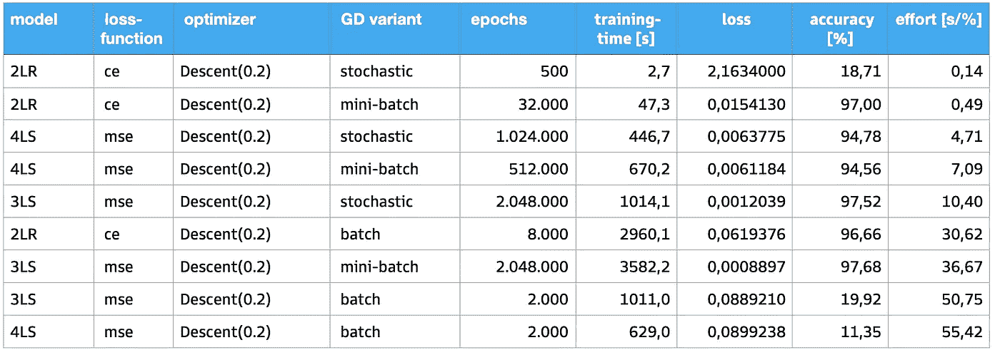

按“努力”排名[图片由作者提供]

另一个有趣的观察是，更多的模型参数不一定导致更好的准确性。

因此，我们可以看到我们的“构建模块”的不同配置如何导致行为和 KPI 的有趣变化。…但是我们是不是忘了什么？亚当怎么办？嗯，那是另一篇文章的素材:-)。