# MNIST——亚当呢？

> 原文：<https://towardsdatascience.com/flux-jl-on-mnist-what-about-adam-fb78e7f02acd>

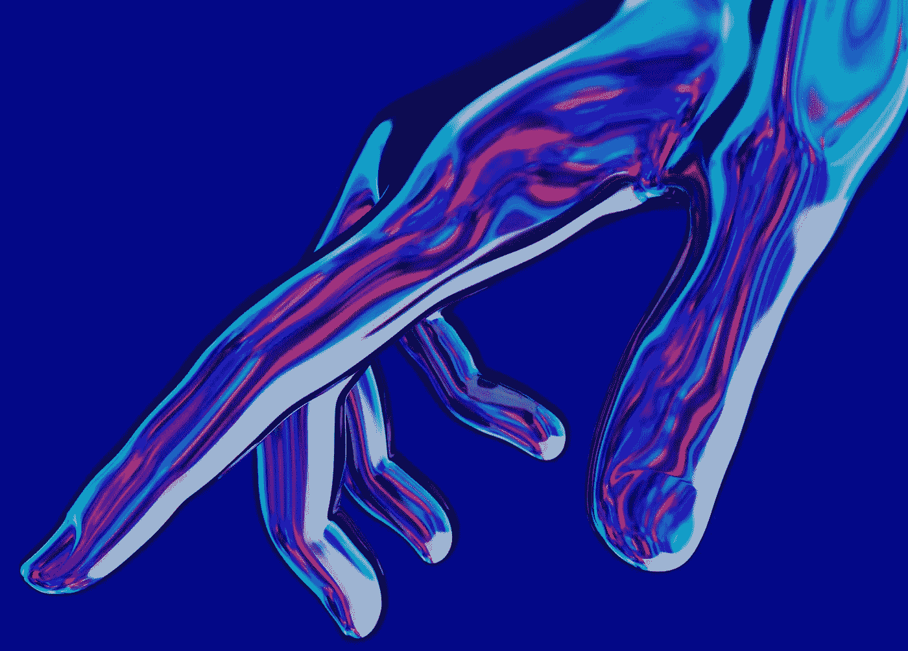

[西蒙·李](https://unsplash.com/@simonppt?utm_source=unsplash&utm_medium=referral&utm_content=creditCopyText)在 [Unsplash](https://unsplash.com/?utm_source=unsplash&utm_medium=referral&utm_content=creditCopyText) 上的照片

## 到目前为止，我们已经看到了使用标准梯度下降优化器的性能分析。但是，如果我们使用像亚当这样更复杂的方法，我们会得到什么结果呢？

在关于 MNIST 的[flux . JL——主题的变体](/flux-jl-on-mnist-variations-of-a-theme-c3cd7a949f8c)中，我展示了三种用于识别手写数字的神经网络，以及三种用于训练这些网络的梯度下降算法(GD)。

关于 MNIST 的后续文章[flux . JL——性能分析](/flux-jl-on-mnist-a-performance-analysis-c660c2ffd330)显示了使用不同参数的每个模型的性能以及训练它们需要付出的努力，这取决于所应用的 GD 变体。GD 算法使用标准的 GD 学习公式，在该分析中利用恒定的学习速率。

现在，我们将使用高级学习公式(现在称为“优化器”)执行此分析，并将结果与使用标准公式实现的性能进行比较。我们将使用的优化器名为 ADAM (= *自适应矩估计*)，由 *Diederik P. Kingma* 和 *Jimmy Ba* 于 [2015 年发表。它适应每次迭代的学习速率，是目前该领域最复杂的方法之一。](https://arxiv.org/abs/1412.6980)

与最后的分析类似，我们将应用所有三种 GD 变量进行训练:批量 GD、随机 GD 和小批量 GD。

# 批量梯度下降

## 4LS-型号

使用 batch GD 将 ADAM 应用于 4LS 模型，导致了显著的改进:仅用 500 次迭代，我们就获得了 74.16%的准确率，提高到 91%以上。相比之下，标准的`Descent`优化器停留在 11.35%。

批量 GD—4LS[图片由作者提供]

学习曲线说明了这种行为:左边是标准优化器，迭代 500 次，右边是 ADAM，迭代 1000 次。ADAM 非常快地将损失降低到低于 0.1 的值，然后稍微停滞，直到大约迭代 300，在那里它再次开始降低。`Descent`也相当快，直到低于 0.1(请注意 y 轴上的不同缩放比例)，然后停滞不前。除此之外，使用`Descent`减少损失并不能转化为准确性的提高(在测试数据集上)。

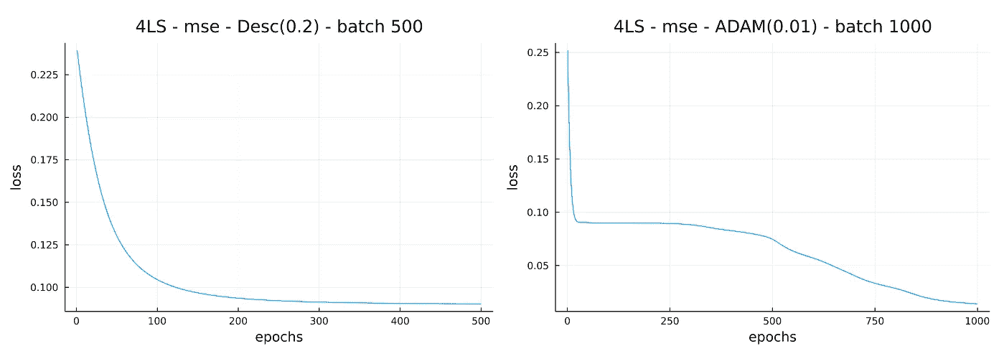

迭代 1-500(下降)和 1-1000(亚当)[图片由作者提供]

## 3LS 型号

对于 3LS 模型，我们得到了类似的结果。ADAM 在这里也显著地改进了结果:在 500 次迭代时，我们获得了 95.66%的准确度，在 1000 次迭代时，准确度可以略微提高到 96%以上。另一方面，标准优化器只能产生低于 20%的精度。

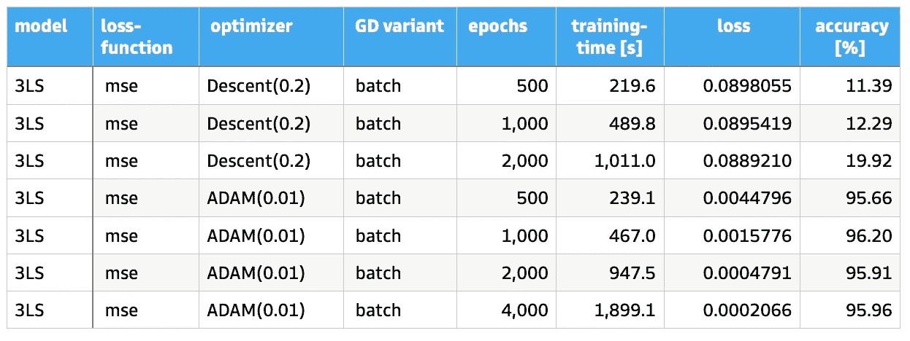

批量 GD—3LS[图片由作者提供]

学习曲线也显示了这一点:两个优化器都非常快地将损耗降低到低于 0.1 的值(再次注意 y 轴上的不同缩放)，ADAM 甚至比`Descent`更快，然后降低得更多。

与 4LS-model 相比，ADAM 在这里停滞得更快，但在这一点上已经取得了比 4LS 更好的准确性。

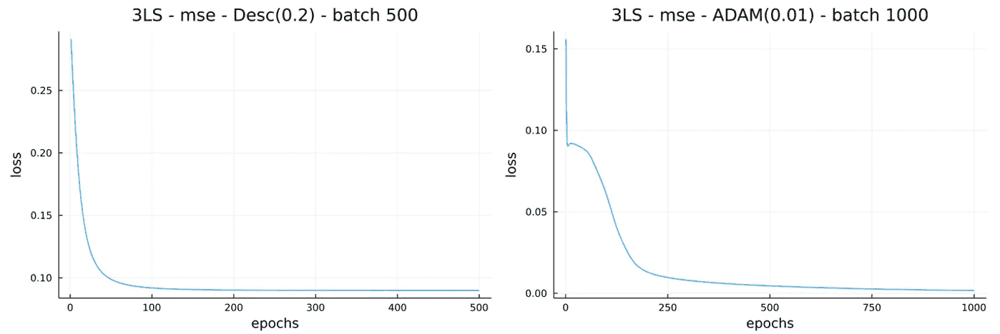

迭代 1-500(下降)和 1-1000(亚当)[图片由作者提供]

## 2LR 型号

在 2LR-model 上，我们已经用标准优化器得到了很好的结果，并且我们用 ADAM 达到了相同的准确度水平(超过 96%)。但是 ADAM 已经迭代了 500 次(然后略有下降)，而标准优化器需要 4，000 次迭代才能达到这个水平。

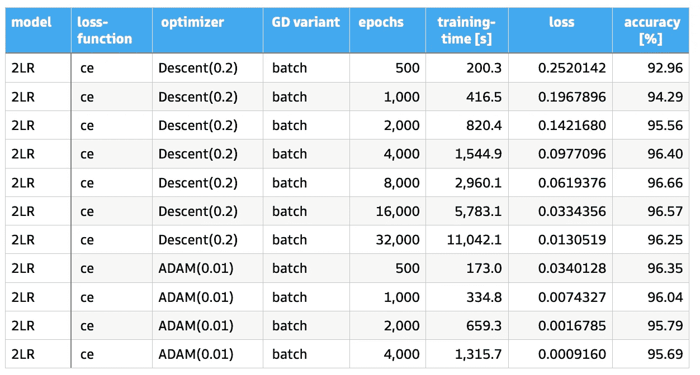

批量 GD—2LR[图片由作者提供]

在这种情况下，除了 ADAM 在开始时下降较快之外，学习曲线非常相似:

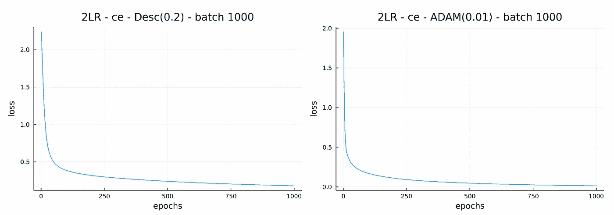

迭代 1-1，000 次(下降和亚当)[作者图片]

# 随机梯度下降

对于随机 GD，标准优化器在 4LS-和 3LS-模型上提供了相当好的结果。让我们看看，亚当是否能做得更好。

## 4LS-型号

对于两个优化器，4LS 模型的学习曲线具有相同的基本形状，但是 ADAM 导致更强的振荡。

迭代 1–1，024，000 次(下降和亚当)[图片由作者提供]

ADAM 用更少的迭代给了我们更高的精度，但最终我们没有得到从`Descent`得到的质量(在 200 万次迭代中，94.16%对 92.12%)。

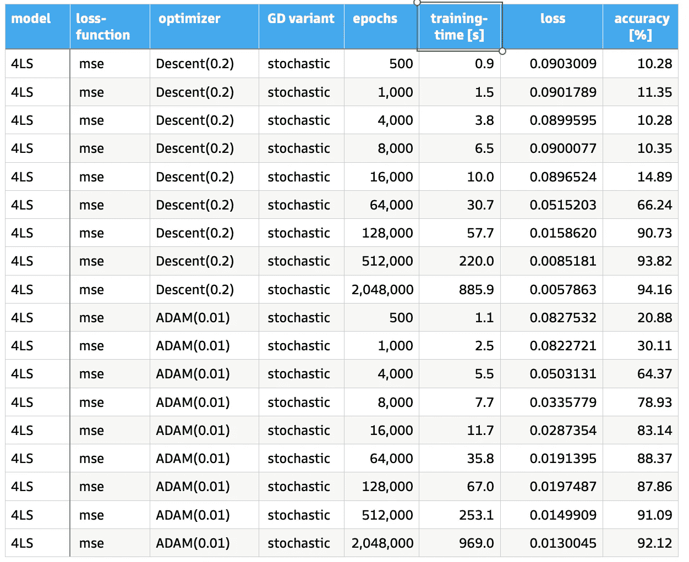

随机 GD—4LS[图片由作者提供]

## 3LS 型号

对于 3LS 模型，我们得到了几乎相同的情况:基本上相似的曲线，其中 ADAM 在开始时更快地收敛到较低的损失值(并且以这种方式振荡得更多):

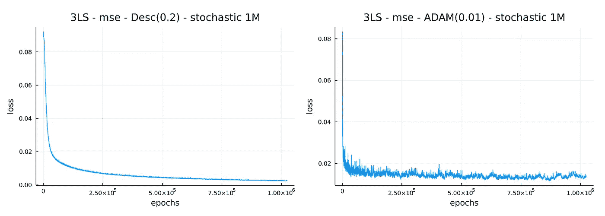

迭代 1–1，024，000 次(下降和亚当)[图片由作者提供]

这反映在我们能够达到的精度上。同样，ADAM 也没有达到我们用标准优化器达到的水平(在 200 万次迭代中，93.73%对 97.64%):

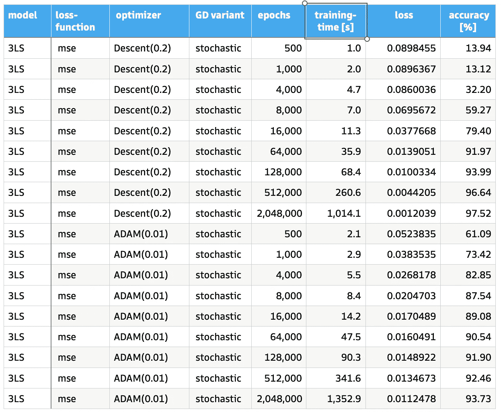

随机 GD—3LS[图片由作者提供]

## 2LR 型号

用标准优化器训练 2LR 模型是失败的。我们从来没有达到 20%以上的准确率。在这种情况下，ADAM 是一个真正的改进，在大约 50 万次迭代后达到了 87%以上的精度(然后又变得更差)。但是我们不能像其他配置那样达到 95%以上。

随机 GD—2LR[图片由作者提供]

使用 ADAM 的学习曲线显示出剧烈的波动，它并不真正符合上表中的数字，因为我们做的迭代次数越多，损失似乎越大。

迭代 1–1，024，000 次(下降和亚当)[图片由作者提供]

前 128，000 次迭代的 100 移动平均线更好地显示了该部分发生的情况。至少在最初的 40，000 次迭代中，损耗显著降低。但是这仍然不能解释为什么精度在高达大约 50 万次迭代的范围内提高。

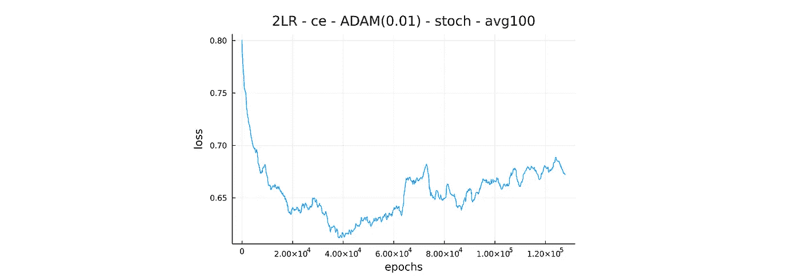

移动 100-平均值-迭代 1–128，000(ADAM)[图片由作者提供]

# 小批量梯度下降

小批量 GD 在所有三种模型上都取得了非常好的结果。所以留给亚当的空间并不多。让我们来看看不同之处。

## 4LS-型号

正如上面在其他配置中看到的，ADAM 在开始时收敛得更快(500 次迭代时 92.46%的准确性)，但没有达到标准优化器的水平(200 万次迭代时 94.49%对 93.28%):

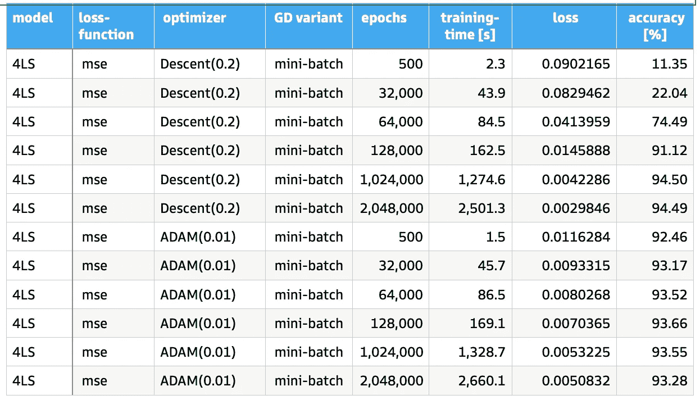

小批量 GD—4LS[图片由作者提供]

学习曲线反映了这些发现(同样，亚当导致了更多的振荡):

迭代 4，001–512，000(下降)和 1–512，000(亚当)[图片由作者提供]

## 3LS 型号

3LS 型号也是如此。ADAM 在 500 次迭代时已经达到了 94.47%的准确度，但是在 200 万次迭代时最终稍差(97.68%对 96.17%)。

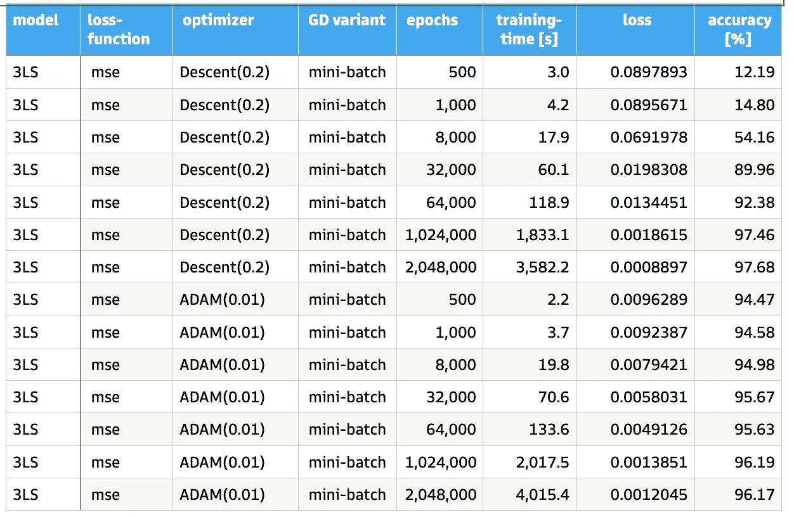

小批量 GD-3LS[图片由作者提供]

以类似的方式，这反映在学习曲线中:

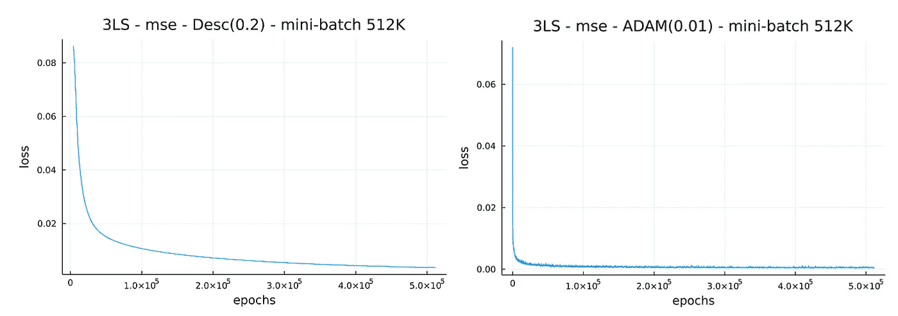

迭代 4，001–512，000(下降)和 1–512，000(亚当)[图片由作者提供]

## 2LR 型号

对于 2LR 型号，情况有点不同。亚当在开始时并没有收敛得更快。同样，它也达不到与标准优化器相同的准确性水平(97.0%对 91.33%)。

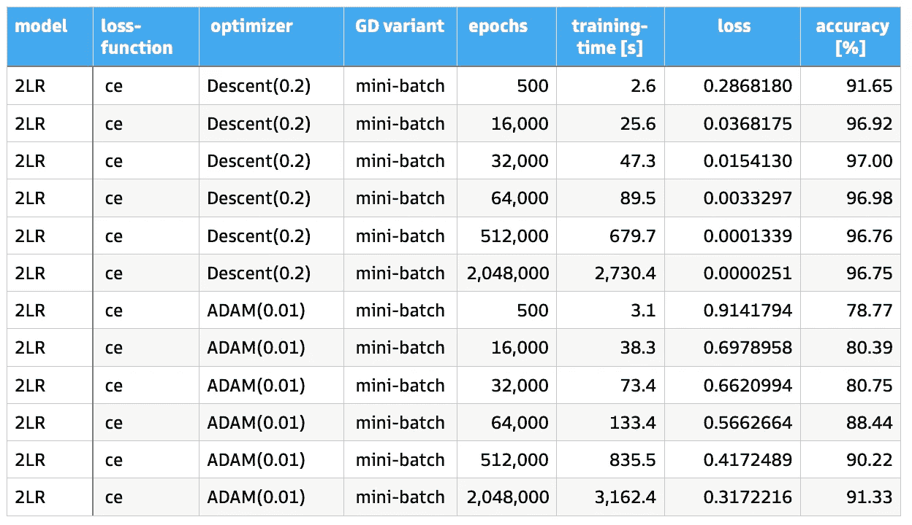

小批量 GD—2LR[图片由作者提供]

学习曲线在这里显示了(与随机 GD 一样)显著的振荡:

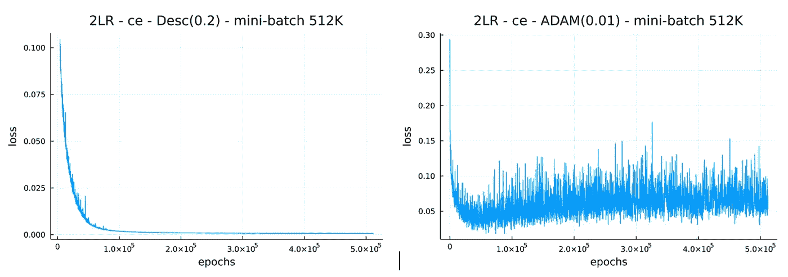

迭代 4，001–512，000(下降)和 1–512，000(亚当)[图片由作者提供]

# 结论

## 血统 vs .亚当

下图概述了使用标准优化器(左)和 ADAM(右)获得的最佳结果。它显示了与训练时间相关的准确性。在这里，我们可以看到，亚当做得很好:几乎所有的结果都在左上角。即以相对较小的努力实现了高精度。标准优化器提供了更广泛的结果。但最终它产生了一些最好的结果。

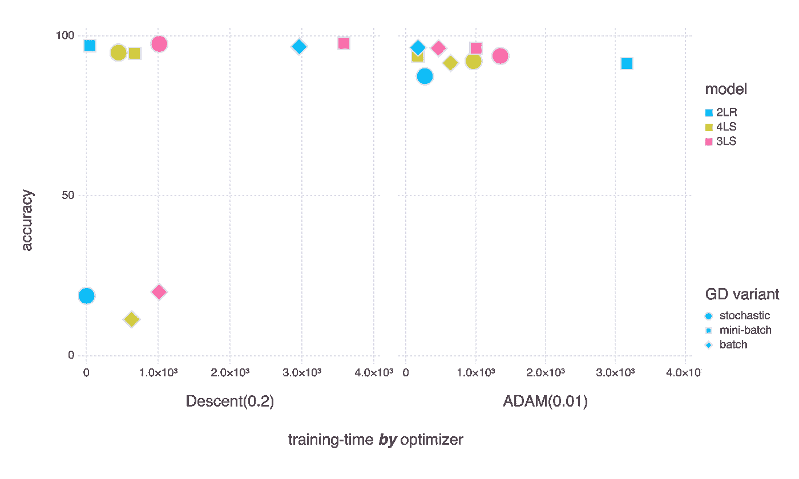

准确度与训练时间(下降和亚当)[图片由作者提供]

## 顶级表现者

下图显示了表现最好的人(准确率> 90%)。最好的结果是 3LS/下降(亮蓝色)，然后是 2LR/下降(亮黄色)。4LS 变异体(绿色)通常不太好。

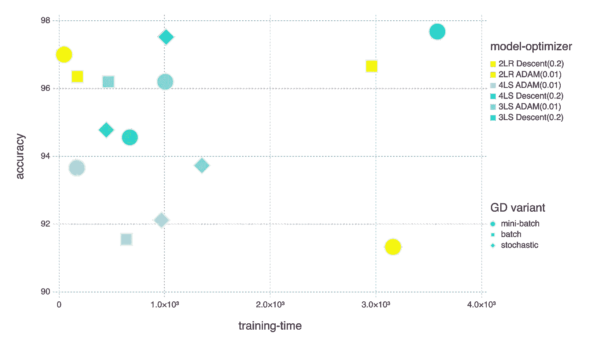

准确性与训练时间——最佳表现者[图片由作者提供]

## 努力

最后，在最近的分析中，我计算了一个名为“努力”的性能指标，这是训练时间和准确性之间的比率(描述了达到一定水平的准确性需要多少训练时间)。所以你也可以看到这方面的佼佼者:

按“努力”排名[图片由作者提供]

## 摘要

有趣的是，在标准优化器失败的三种情况下，我们都可以通过 ADAM 获得明显更好的结果。但在所有其他情况下，亚当都没有达到我们用`Descent`获得的水平。在这些情况下，迭代次数越少，收敛速度越快，但最终还是于事无补。因此，我们可以得出结论，这两种优化器可以很好地互补，但没有一种优化器可以适用于所有情况。