# 叶和 Choropleth 地图:从零到专业

> 原文：<https://towardsdatascience.com/folium-and-choropleth-map-from-zero-to-pro-6127f9e68564>

## 使用带有图层控制和自定义工具提示的 follow 创建交互式 Choropleth 地图的分步教程

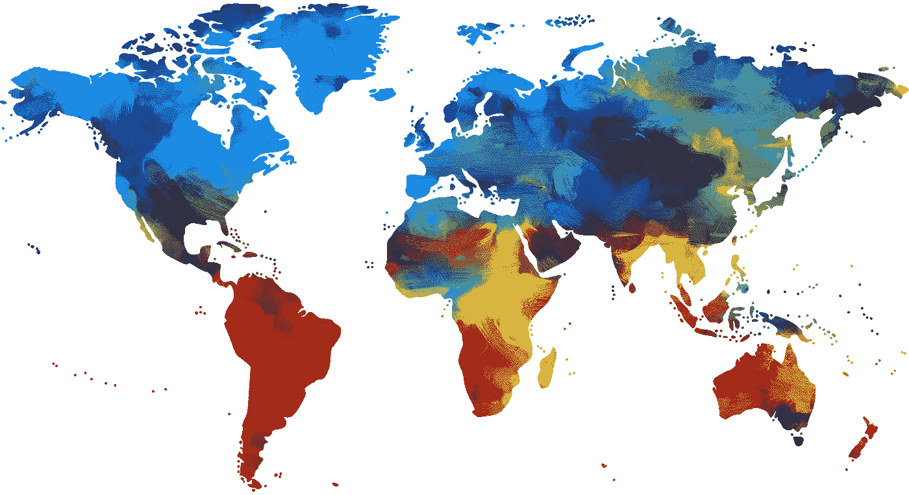

图片来源: [Pixabay](https://pixabay.com/illustrations/multicoloured-to-dye-paint-brush-1974699/)

# 介绍

Choropleth 地图可能是最流行的地理空间数据可视化之一。它是一种专题地图，在地图上的预定义区域使用不同的阴影图案或颜色来表示与变量或指标相关的地理特征。

它可以绘制在世界地图、美国地图上，或者按照不同的地理区域(如州、县、邮政编码等)进行划分。下图展示了一些来自维基百科的 choropleth 地图的例子。

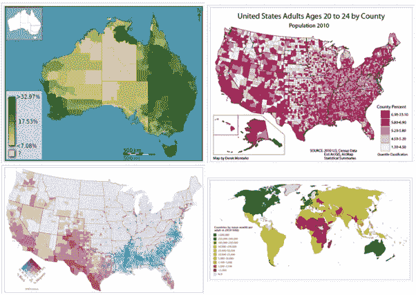

图片来源:[维基百科](https://en.wikipedia.org/wiki/Choropleth_map)

在 Python 中，有几个图形库可以用来绘制 choropleth 地图，如 follow、Plotly、Matplotlib 等。其中，follow 是一个高度专业化的地理空间可视化库。它是健壮的和可定制的，可以在任何地理区域或国家以各种风格和设计绘制 choropleth 地图。对于想要开始使用 Python 进行地理空间可视化的初学者来说，这是一个理想的选择。

在本教程中，我们将学习 learn 的核心概念，并使用它创建一个 choropleth 地图，该地图通过自定义工具提示和图层控件将美国县级的新冠肺炎案例可视化。我们将要创建的 choropleth 地图如下所示:

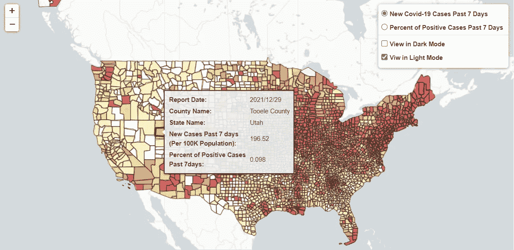

作者图片

# 先决条件

## #1:安装叶片:

您可以使用下面的命令，根据 folio 的[文档页](https://python-visualization.github.io/folium/installing.html)安装 folio:

```
$ pip install folium
```

或者

```
$ conda install folium -c conda-forge
```

## #2:安装 GeoPandas:

根据 GeoPandas 的[文档页面](https://geopandas.org/en/stable/getting_started/install.html)，建议使用 Anaconda / conda 安装 Geopandas。首先按照[指令](https://conda.io/projects/conda/en/latest/user-guide/install/index.html)下载并安装 Anaconda，然后使用以下命令安装最新版本的 GeoPandas:

```
conda install geopandas
```

# 下载数据

制作 Choropleth 地图需要两种主要的输入:

1.  包含地理区域标识符(例如，国家名称、县 fips 代码、邮政编码等)的表格数据集。)和我们希望在地图中可视化的指标(例如，人口、失业率等。)
2.  GeoJSON 文件，包含几何信息并定义预定义地理区域的边界(例如，国家、美国县、邮政编码等)。)

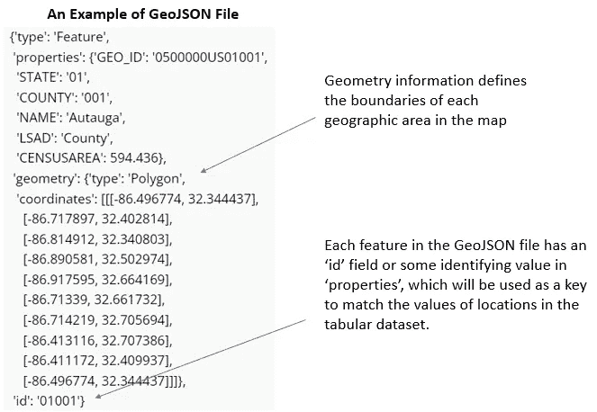

作者图片

现在，我们已经了解了数据输入要求和 GeoJSON 文件的作用，我们可以继续下载教程所需的两个数据集。这两个文件都是开放的数据集，可以免费下载和使用。

**数据集 1** : [美国新冠肺炎县一级的社区传播](https://data.cdc.gov/Public-Health-Surveillance/United-States-COVID-19-County-Level-of-Community-T/8396-v7yb/data)

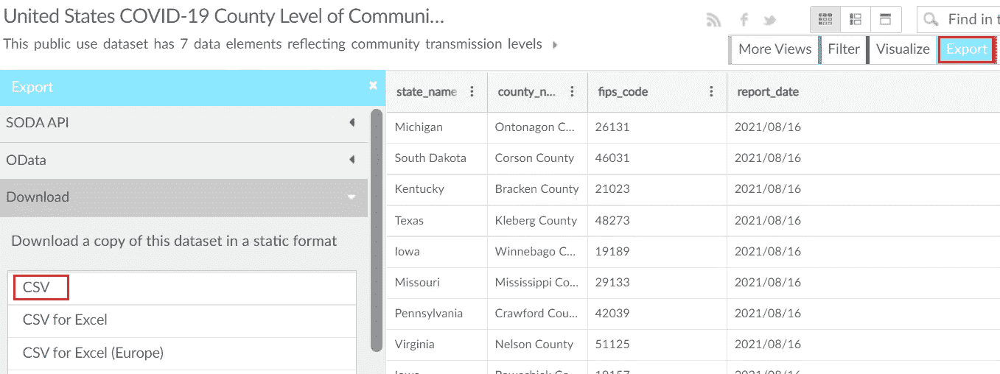

数据来源:[疾病预防控制中心](https://data.cdc.gov/Public-Health-Surveillance/United-States-COVID-19-County-Level-of-Community-T/8396-v7yb/data)

**数据集 2** : [美国各县的 GeoJSON 文件](https://public.opendatasoft.com/explore/dataset/georef-united-states-of-america-county/export/?disjunctive.ste_code&disjunctive.ste_name&disjunctive.coty_code&disjunctive.coty_name&sort=year)

你可以去[public.opendatasoft.com](https://public.opendatasoft.com/explore/dataset/georef-united-states-of-america-county/export/?disjunctive.ste_code&disjunctive.ste_name&disjunctive.coty_code&disjunctive.coty_name&sort=year)，向下滚动到“地理文件格式”部分，下载美国各县的 GeoJSON 文件。

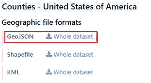

作者图片

# 导入库并读取数据

让我们导入所有必要的库并将数据读入 Python。请注意，为了读取 GeoJSON 文件，我们需要使用 GeoPandas，这是一个开源库，专门用于处理地理空间数据类型，使使用 python 处理地理空间数据变得更加容易。


作者图片

接下来，让我们仔细看看 covid_df 数据帧。

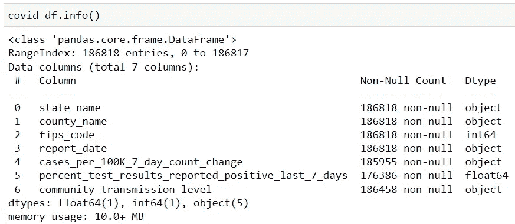

作者图片

该数据集跟踪每个 report_date 在美国县一级的新冠肺炎指标。由于我们正在创建一个静态 choropleth 地图，因此我们将数据框限制为最近的 report_date(即我们示例中的 12/29/2021)。

我们还需要做一些数据争论来清理一些数据字段。我们会将“fips_code”的数据类型更改为 string，如果缺少前导零，则填充前导零。我们还将创建两个具有正确数据类型和格式的新列“new_cases_7days”和“pct_positive_7days ”,并删除原始列。

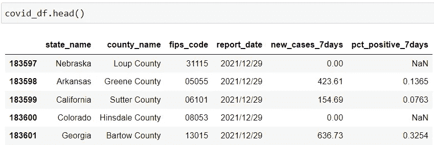

清理后的 covid_df(图片由作者提供)

最后，让我们将 geojson 与 covid_df 结合起来，以创建最终数据集，为可视化做好准备。通过连接这两个数据集，我们确保 covid_df 数据框中的 fips_code 与 GeoJSON 文件中的 coty_code 完全匹配，这在稍后使用 follow 绘制 choropleth 地图时至关重要。


可视化的最终数据框(图片由作者提供)

# 使用 leav 创建 Choropleth 地图

## 第一步:启动一个基础叶子地图

要使用 leav 创建 choropleth 地图，我们需要首先使用 leav 启动一个基础地图。映射()，然后向其中添加图层。我们可以通过使用 location 参数将起始坐标传递给地图。我们在这里选择的起始坐标(40，-96)大致代表美国地图的中心。

我们可以从内置图块集列表中选择所需的地图图块(例如 tiles="Stamen Terrain ")，默认为 OpenStreetMap，或者只需将图块选项保留为“无”。我们还可以使用 zoom_start 参数设置地图的初始缩放级别。

## 步骤 2:将 Choropleth 地图图层添加到底图中

基础地图最初是空的。我们可以使用 leav 创建 choropleth 地图图层。Choropleth()并使用 add_to()方法将其添加到基本地图中。在叶子里。Choropleth()函数，有几个导入参数我们需要指定:


作者图片

请注意，在上面的代码中，我们可以使用 quantile()和 tolist()创建一个自定义色标，并通过 threshold_scale 参数轻松传递我们的自定义色标，而不是使用固定值范围。仅用几行代码，我们就用 Folium 创建了一个带有自定义色阶的基本 choropleth 地图！

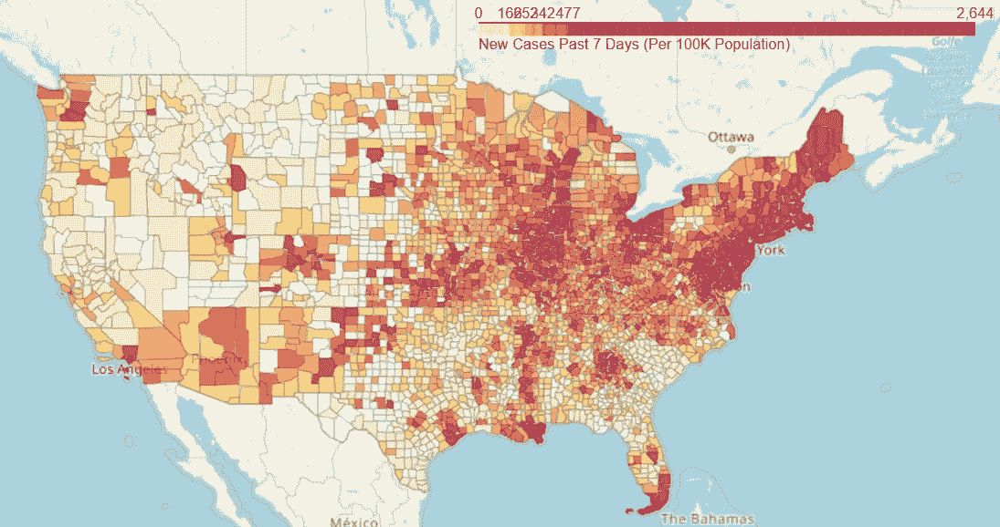

作者图片

## 步骤 3:向地图添加自定义工具提示

我们上面创建的基本地图看起来相当不错！然而，目前，当用户悬停在地图上时，没有工具提示显示每个县的信息，如县名、Covid 病例数、阳性率等。这将是一个很好的添加到地图的功能，以使可视化更具交互性和信息量。

要添加自定义工具提示，我们需要使用 follow . features . geo JSON()方法和 GeoJsonTooltip 函数来设置“字段”和“别名”参数。这些字段将是我们想要在悬停工具提示中显示的 df_final 中的任何列，而别名将是我们给予这些字段的标签/名称。

请注意，我们还可以将 HTML 元素传递给“aliases”参数来格式化工具提示。例如，我们可以使用
将长格式文本分成两行，如下面的代码所示。

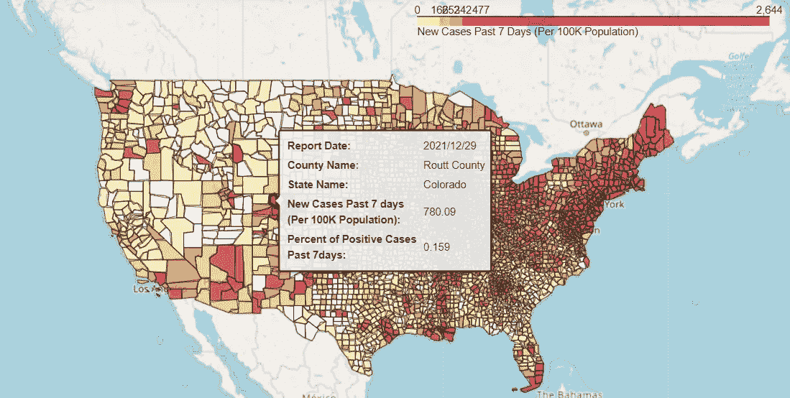

作者图片

# 添加层控制以在指标之间切换

到目前为止，我们的 choropleth 图仅可视化了来自 df_final 数据帧的一个指标——“新病例 _ 7 天”。如果我们也有兴趣了解不同县之间“pct_positive_7days”指标的变化情况会怎样？

我们可以按照上一节中显示的相同步骤，为“pct_positive_7days”创建另一个映射。但是有没有什么方法可以在同一个地图上用一个切换按钮显示多个指标，这样我们就不需要分别显示多个地图了？

答案是肯定的，解决问题的秘密武器是使用叶子。FeatureGroup()和 leav。LayerControl()。

叶子。FeatureGroup()方法创建要素组图层。我们可以把东西放在里面，把它们作为一个单独的层来处理。我们可以创建多个要素组图层，每个图层代表一个我们希望在地图上显示的度量。然后，我们可以添加 LayerControl 来勾选/取消勾选 FeatureGroup 图层，并在不同的指标之间切换。

让我们看看如何通过下面的代码实现这一功能:

**步骤 1:** 我们启动一个底图，创建两个名为 fg1 和 fg2 的特征组图层，并将它们添加到底图中。我们为将在 LayerControl 中显示的每个 featureGroup 图层命名。“覆盖”参数允许您将层设置为覆盖层(勾选图层控制中的复选框)或基础层(勾选单选按钮)。

**步骤 2:** 我们将第一个 choropleth 地图图层(用于“新病例 7 天”指标)添加到 fg1:

**第三步:**我们将第二个 choropleth 地图图层(用于“pct_positive_7days”指标)添加到 fg2。除了与“pct_postive_7days”指标相关的一些更改之外，代码结构与步骤 2 中的相同。

步骤 4: 我们添加图层控制到地图中。请注意，在代码中，我还添加了一个平铺层来选择暗模式和亮模式。我们还可以将交互式地图保存到 HTML 文件中。

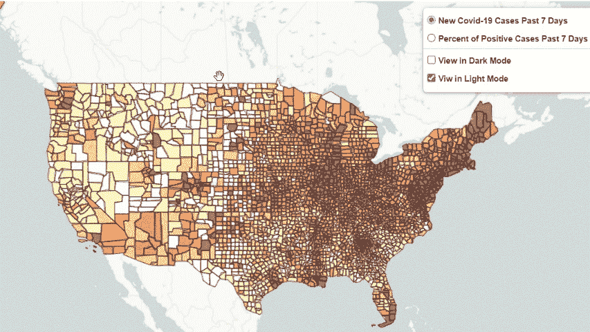

Choropleth 地图(图片由作者提供)

# **收尾思路**

Folium 是我学习并用于地理空间可视化的第一个地理空间绘图工具，我非常喜欢它！它易于使用，但非常强大和灵活。这是一个很棒的 python 库，可以让您开始了解地理空间数据可视化领域中使用的概念和技术，也是添加到您的数据科学家工具箱中的一个很好的工具。感谢阅读，我希望你喜欢这篇文章！

# 参考和数据来源:

1.  Folium 的 Github 文档页面:[https://python-visualization.github.io/folium/](https://python-visualization.github.io/folium/)
2.  数据来源:[美国新冠肺炎县一级社区](https://data.cdc.gov/Public-Health-Surveillance/United-States-COVID-19-County-Level-of-Community-T/8396-v7yb/data)。这是一个开放的数据集，无需许可即可公开使用。
3.  数据来源:[美国县界](https://public.opendatasoft.com/explore/dataset/georef-united-states-of-america-county/export/?disjunctive.ste_code&disjunctive.ste_name&disjunctive.coty_code&disjunctive.coty_name&sort=year)。这是一个由[public.opendatasoft.com](https://public.opendatasoft.com/explore/dataset/georef-united-states-of-america-county/export/?disjunctive.ste_code&disjunctive.ste_name&disjunctive.coty_code&disjunctive.coty_name&sort=year)提供的开放数据集，你可以免费下载。

你可以通过这个[推荐链接](https://medium.com/@insightsbees/membership)注册 Medium 会员(每月 5 美元)来获得我的作品和 Medium 的其他内容。通过这个链接注册，我将收到你的一部分会员费，不需要你额外付费。谢谢大家！