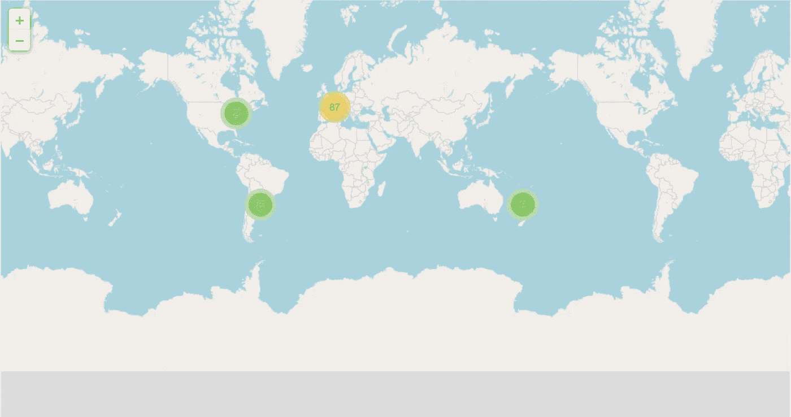
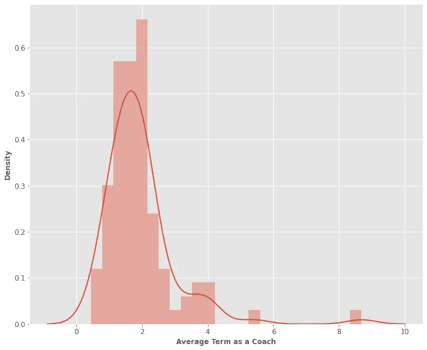
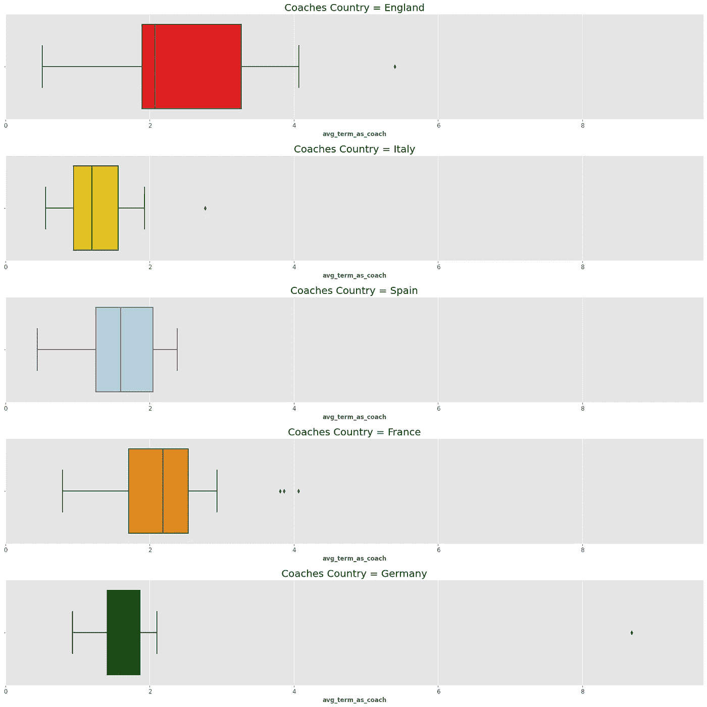
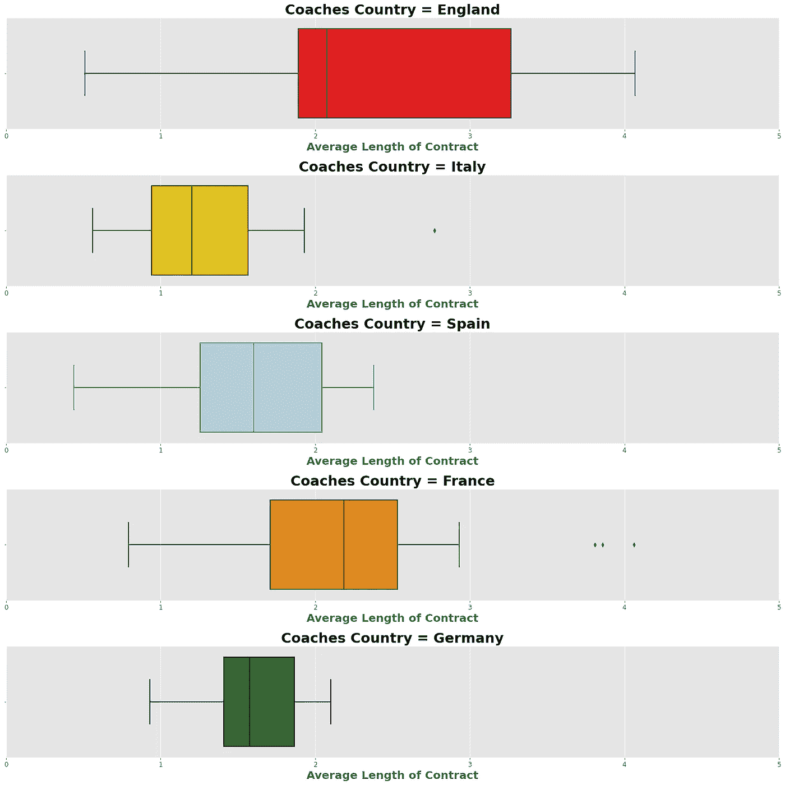
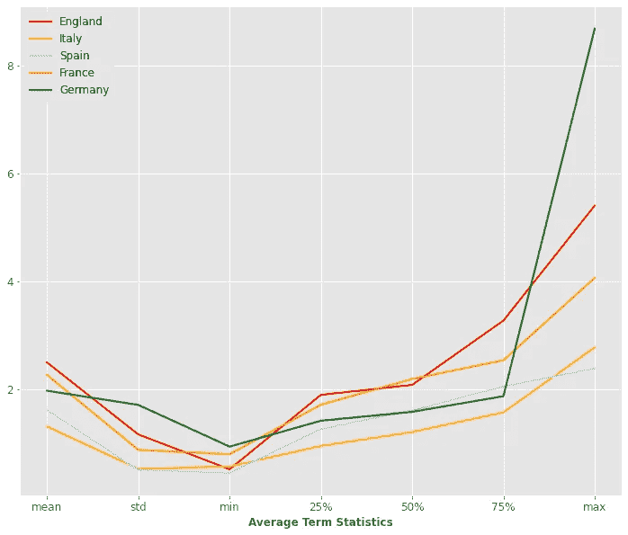
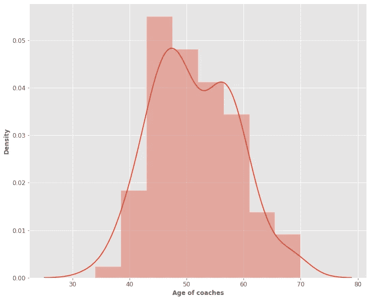
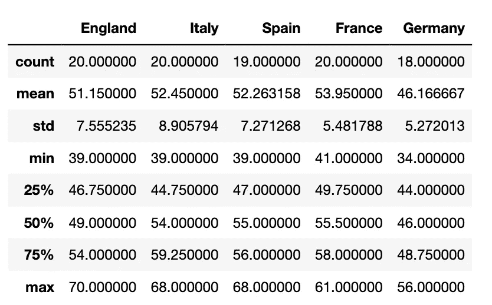
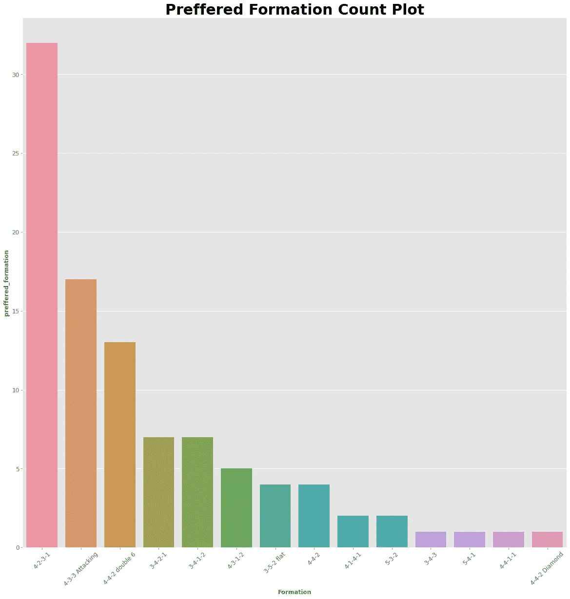
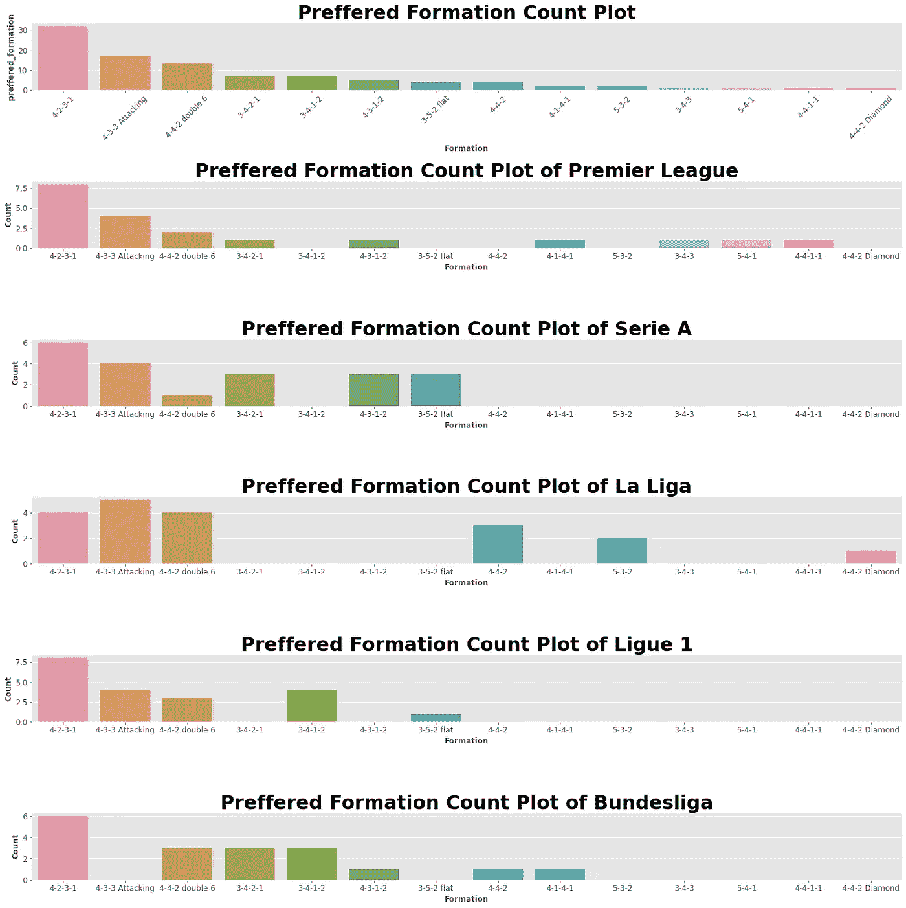

# 利用 Python 进行足球教练分析

> 原文：<https://towardsdatascience.com/football-coaches-analysis-using-python-db38aaab28e9>

## 以下是我如何利用数据科学从最佳国际锦标赛中提取关于教练的深刻信息。

照片由 [Nguyen Thu Hoai](https://unsplash.com/@thwhoai?utm_source=unsplash&utm_medium=referral&utm_content=creditCopyText) 在 [Unsplash](https://unsplash.com/s/photos/football-coach?utm_source=unsplash&utm_medium=referral&utm_content=creditCopyText)

> **声明**:我不是足球分析师！我不以做足球分析为生。这篇文章中的假设是由一个热情的足球迷和爱好者做出的。不要打仗，要做爱。❤

> 在意大利，足球几乎是一种宗教。

我从小就追随我的球队(❤罗马)，从那以后我就爱上了足球。

另一个有趣的事实是，我和数据打交道。特别是我在航天工程与工程力学系工作，每天的主要任务就是分析数据，写机器学习算法。

我最喜欢统计学的一点是，事实上，它可以应用于所有具有可重复性的研究。足球由季节、比赛和比赛中反复出现的事件组成。出于这个原因，这是一个“统计研究”的完美例子，足球分析是一个新兴领域。

在这篇文章中，我将对欧洲最重要的 4 个联赛(**德甲、英超、意甲、西甲**)的教练进行统计研究。我将使用 Python 和一些基本的库，用最简单易懂的方式来做这件事。尽管如此，即使对于像我这样的足球迷来说，一些发现也是非常有趣和有见地的。我希望你也会觉得它们很有趣。:)开始吧！

# 1.图书馆和数据

这些是您需要导入的库:

***可选:如果你想让情节看起来和文章中的一模一样，导入这个:***

好了，现在让我们“谈数据”。

## 1.1 来源和可用性

数据集来自****，可以从这个[源](https://www.kaggle.com/datasets/vaske93/football-coaches-stats-and-tropheys)下载。
数据使用不需要版权许可( [CC0 1.0 通用(CC0 1.0)](https://creativecommons.org/publicdomain/zero/1.0/) )，可以免费下载使用。该数据集相当新(6 个月前更新)，并且可以在几秒钟内下载，因为它非常小(大约 100 行和 13 列)。****

## ****1.2 概述****

****让我们来看看:****

****举个例子，我们把英超的所有教练都打印出来:****

****appointment_date 和 contract_until_date 列实际上没有什么帮助。让我们摆脱他们。另外，让我们去掉重复行和 NaN 行:****

****很好，现在我们准备好了，让我们开始一些探索。****

# ****2.教练的出生地****

****首先，我们来看看每个联盟有多少教练:****

****好吧，公平。我们每个国家有近 20 名教练，这是可以预见的，但他们来自哪里？****

****为了清楚起见，让我单独报告图像:****

********

****作者图片，使用上面的代码生成****

****我们可以看到，大部分来自欧洲，这是可以预见的。我们在美国和澳大利亚有几个异常值，在南美有 6 个。****

****我们在大洋洲看到的两位教练之一是安托万·孔波雷****

****南美 6 帅之一是**皇家贝蒂斯主帅曼努尔·佩莱格里尼:******

****杰西·马希是一名来自美国的教练。****

# ****3.教练条款****

****我们已经看到**杰西·马希并没有真正的团队……**有多少教练没有俱乐部？****

****因此，我们有一个由被解雇的教练组成的数据集的一致部分。**多少年后，教练最终会被解雇？******

****为了进行此分析，让我们使用“***avg _ term _ as _ a _ coach***”列。让我们使用下面的代码将它转换成 float，看看有多少行在转换中有“问题”:****

****只有一个。因此，用平均值替换有问题的行值是合理的，这不会给研究带来什么麻烦。让我们找出其中的意思。****

****让我们替换它:****

****让我们把它画出来:****

********

****作者图片，使用上面的代码生成****

****所以欧洲的平均期限是 1-3 年。我们有一些大约 5-6 年的异常值和过去 8 年的异常值。需要考虑的一件有趣的事情是每个联盟的蔻驰平均任期。换句话说，问题如下:****

> ****“在意大利/德国/英国/西班牙执教的蔻驰的平均任期是多少”****

****除了几个国际教练，一个教练倾向于在他的联赛内流动(例如因扎吉从拉齐奥到国际米兰，或者尤里克从维罗纳到都灵，或者意大利人从拉斯佩齐亚到佛罗伦萨)。**这意味着一个团队一个任期的平均长度基本上就是项目的平均长度**。当然，一个经常改变项目的团队很可能没有像他们期望的那样赢得很多比赛，所以我们可以把这看作是一个“不好的信号”。另一方面，如果一名教练的平均任期更长，这意味着他所在的俱乐部信任他，这也是一个好迹象。****

****三言两语:****

> ****一个联盟的长期平均“教练平均任期”是增加联盟“健康”并使其更具挑战性的一个因素****

****让我们用箱线图来绘制它:****

********

****作者图片，使用上面的代码生成****

****“德国”联赛(德甲)上的离群值使得剧情非常难以解读。我们知道在德甲有一个局外人在俱乐部呆了超过 8 年，但是为了更清楚，让我们把它切掉:****

********

****所以在**意**，项目通常是**短**。在**英国**，即使分布变化很大，项目平均**更长**，法国**也是如此**。****

****绘制统计数据的另一种有效方法如下:****

********

****作者使用上述代码制作的图像****

****除了局外，英格兰足球(众所周知更具挑战性的足球)在几乎所有四分之一的领域都有更长的项目。这在某种程度上证实了我们的假设。****

# ****4.教练年龄****

> ******注意**:下面的分析使用了与上面非常相似的代码。由于这个原因，它没有被充分报道。****

****另一个非常有趣的因素是教练的年龄。我不是“革命思想”的粉丝，我认为足球归根结底是一项非常简单的游戏，不需要任何革命:它本身就是美丽的。因此，我相信成为足球专家会有很大的不同。要有经验，你需要足够老。现代史上最好的教练(安切洛蒂、穆里尼奥或者瓜迪奥拉)都年过五十，这不可能是巧合。****

****当然也有过类似 [**纳格尔斯曼**](https://it.wikipedia.org/wiki/Julian_Nagelsmann) 和[**阿特塔**](https://it.wikipedia.org/wiki/Mikel_Arteta) (34 岁和 40 岁)这样的反例但是，如下面的情节所示，他们是分布的左尾:)****

********

****属于作者的图像****

****但有趣的是，我们注意到有些联赛确实更喜欢年轻教练，比如德国的:****

********

****属于作者的图像****

********

******法兰西**是拥有最老教练的国家，即使最高值低于意、英、西。**西班牙**的平均值还是挺高的。****

******英格兰**处于趋势中间。总的来说，它更喜欢年轻球员(**中位数**)，但第一四分位数比意大利和德国大。****

****需要强调的是，唯一与其他联赛明显不同的是德国，它拥有所有联赛中最年轻的教练。****

# ****5.教练的想法！****

****好吧，但是他们踢球的实际方式是什么？他们如何安排队员在球场上的位置？让我们展示一下:****

********

****作者使用上面显示的代码制作的图像****

****所以:****

1.  ****他们中的很多人更喜欢 4 名后卫****
2.  ****一小部分使用 **3 个防守者******
3.  ****他们中很少有人(一两个)使用 **5 后卫******

****但是一个教练阵型不亚于他的足球理念。那么他们是如何“看”不同联赛的足球的呢？****

********

****作者使用上述代码制作的图像****

****所以**英超的踢球方式是最异类的。那里有许多不同的队形。法甲是最同质的一个**(只有 5 种不同的方式)。在**意大利**6 教练用 3 后卫而不是 4(那是最高的！).**以进攻方式著称的西甲**，最常见的阵型是 4–3–3 进攻。数据科学是令人敬畏的家伙:)****

# ****6.摘要****

****让我们总结一下我们接触到的一些要点。****

1.  ****大多数欧洲教练实际上来自欧洲，有些来自南美，只有少数来自美国。****
2.  ****15.3%的欧洲教练在球队被解雇时无法(立即)找到另一支球队。意大利的项目比其他地方都要短，而英国的项目最长。****
3.  ****除了**德国**之外，整个欧洲的足球教练年龄分布都非常相似(见第四章统计)。在德国，教练相当年轻****
4.  ******英超**的踢球方式最异质，而**法甲**的踢球方式最同质。**西甲**教练更喜欢进攻型的阵型。****

# ****7.结论****

****如果你喜欢这篇文章，你想知道更多关于机器学习的知识，或者你只是想问我一些你可以问的问题:****

****A.在 [**Linkedin**](https://www.linkedin.com/in/pieropaialunga/) 上关注我，在那里我发布我所有的故事
B .订阅我的 [**简讯**](https://piero-paialunga.medium.com/subscribe) 。这会让你了解新的故事，并给你机会发短信给我，让我收到你所有的更正或疑问。
C .成为 [**推荐会员**](https://piero-paialunga.medium.com/membership) ，这样你就不会有任何“本月最大数量的故事”，你可以阅读我(以及成千上万其他机器学习和数据科学顶级作家)写的任何关于最新可用技术的文章。****