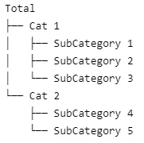
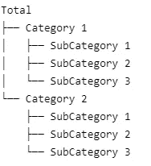

# Python 中的预测协调

> 原文：<https://towardsdatascience.com/forecast-reconciliation-in-python-8203c16254b2>

## 使用 Python 将分层预测协调成一致的预测。

在 [Unsplash](https://unsplash.com/s/photos/tree?utm_source=unsplash&utm_medium=referral&utm_content=creditCopyText) 上由 [Fabrice Villard](https://unsplash.com/es/@fabulu75?utm_source=unsplash&utm_medium=referral&utm_content=creditCopyText) 拍摄的照片

# 介绍

根据我的经验，处理没有潜在“级别”的实时时间序列数据有点不寻常。例如，考虑可能通过杂货店的交易产生的数据。可以在单个产品级别、购物者级别或商店级别描述交易。所购买的产品也可能被归类到特定类型的产品中，而这些类别又可能落入更广泛的类别中。对于企业主来说，这种复杂的层级结构可能会使对其业务做出准确和公正的预测变得复杂。一个数据驱动的人最有可能对每个不同的水平做出预测，但它们并不总是相加。这就是和解变得必要的地方。

我在这篇文章中的大部分解释都是基于 Rob J. Hyndman 和 George Athanasopoulos 的《预测:原理和实践》一书。这是一个很好的预测资源，而且完全免费。我强烈建议你花些时间阅读 Hyndman 的[更详细的解释](https://otexts.com/fpp3/hierarchical.html)在某些时候协调层次和分组预测。我并不打算在这里取代这本书，虽然我仍然打算给出一个预测协调的解释。相反，我写这篇博文的目的是为阅读这篇文章的人提供开发他们自己的预测协调代码所需的背景知识。我发现现有的包没有得到一致的维护，或者(在我看来)它们没有达到在生产环境中被认为是可靠的开发阶段。但是，即使你真的使用了现有的和解软件包，盯着书本上的数学公式或应用别人创建的一些预定义函数，也不是获得对实际发生的事情的确切理解的最佳方式。希望通过分享关于如何编写自己的 Python 代码来协调层次预测的简要说明，我还可以提供一些其他方式可能无法获得的额外见解。

# 分层时间序列

首先，我将简单介绍一下层次时间序列和分组时间序列的区别(不，它们不是完全一样的东西)。当层次结构中的较低级别仅属于一个域时，时间序列被视为*层次结构*。例如，考虑以下层次结构树:

`Sub-Category 1`归属于`Category 1`，`Sub-Category 4`归属于`Sub-Category 2`等。这种*排他性*定义了一个层次时间序列。同样需要注意的是，从数学上来说，每一个子类别应该加起来就是它们上面的类别，`Total`是每一个底层类别的总和。数学表达式如下所示:

*T*=*C1*+*C2*=*SC1*+*SC2*+*SC3*+*SC4*+*SC5*
*C1*=*SC1*+*SC2*+*SC3*

另一方面，一个*分组的*时间序列是子域之间的排他性不存在的时候。例如，考虑相同的层次结构树，但是只有三个子类别分布在两个主要类别中的每一个上:

同样的层次结构也可以用下面的树来描述:

层次结构组的多种排列的复杂性意味着所使用的原始公式不再有效。Hyndman [将](https://otexts.com/fpp3/hts.html#grouped-time-series)这种结构概念描述为*“不会以独特的层级方式自然分解。”*

理解分层时间序列和分组时间序列之间的区别很重要，因为求和矩阵(在下一节中解释)取决于时间序列的结构。

# 连贯预测的基石

调和的——或者说*一致的——预测由几个关键部分构成:*

**基本预测:**
每个层次级别的预测，表示为一个 *m* x *n* 矩阵( *m* 行和 *n* 列)，其中矩阵的列表示数据的层次级别，行表示预测范围的每个时间段。

**求和矩阵:**
求和矩阵描述了数据的层次/分组结构。对于分层求和矩阵，列数与底层的唯一类别数相匹配。行数由所有级别中唯一类别的总数决定。求和矩阵的值是二进制值，表示哪个底层(列)类别映射到所有级别的每个层次结构。考虑先前共享的具有两个类别和五个子类别的分层数据的例子。求和矩阵如下所示:

因为分组的时间序列数据不会以“唯一的方式”分解，所以不存在唯一的底层。这意味着求和矩阵需要额外的列和行。帖子前面的分组数据如下所示:

**映射矩阵:**
预测对账的关键组件是映射矩阵。该矩阵根据所使用的对账方法而变化，但原则是相同的。当您将映射矩阵与求和及基本预测矩阵相乘时(对于分层或分组时间序列)，结果是一组一致的预测。接下来的挑战是找到一个“最佳”映射矩阵，它可以用来使预测与最小的方差相一致。

# 对账方法

存在许多不同的调和方法来寻找最佳映射矩阵，并且一些方法比其它方法更好。我不会详细讨论其中的大部分，但我仍然会列举几个。对账方法分为两类:[单级](https://otexts.com/fpp3/single-level.html)和[最小痕迹](https://otexts.com/fpp3/reconciliation.html#the-mint-optimal-reconciliation-approach)方法。

一些单级方法包括:

*   自下而上
*   自上而下
*   中间输出

一些最小跟踪方法包括:

*   普通最小二乘法(OLS)
*   方差缩放的加权最小二乘(WLS)
*   具有结构缩放的 WLS

对于不同的最小痕迹方法的更严格的解释——以及一些额外的方法——请随意查看本文。

# 可用的协调工具

如前所述，有几个现有的工具/包可以应用大多数协调方法。前面提到的 Rob Hyndman 帮助开发了一个名为`[fabletools](https://fabletools.tidyverts.org/reference/reconcile.html)`的 R 包，在我看来这是最好的预测包之一，也是预测协调的最好工具。开发名为`[scikit-hts](https://scikit-hts.readthedocs.io/en/latest/readme.html)`的 Python 包的工作也在进行中。然而，它仍然有很多问题，并且不具备`fabletools`中存在的所有功能。

# Python 中的预测协调

我不会分享对所有可用的不同方法进行编码的解释，也不会严格展示机器学习的所有典型部分(即，我不会将数据分成训练/测试集，生成预测，查看准确性指标等。).我的目的是演示如何编写自己的协调算法，所以我将只使用一个带有预先存在的预测的样本数据集。

以下是样本数据集中每个等级级别的图:

调节该数据集中的预测的第一步是定义基本预测和求和矩阵。为了做到这一点，我们需要定义层次结构的底层/中层/顶层。我发现使用以下格式的数据可以使这个过程变得非常简单:

注意，我已经将`date`、`parent`、`child`和`forecast`作为列包含在数据集中。当然，你选择怎样组织你的数据完全取决于你自己。但是我用来收集协调预测所需的所有信息的方法要求数据以这种方式格式化。

接下来，我们可以在该数据集中定义不同的层次结构，并将数据重组为正确的基本预测矩阵结构:

从重构的数据集中，定义求和矩阵可以使用以下代码轻松完成:

最后，我们可以定义我们的映射矩阵。在这篇文章中，我将演示如何使用普通的最小二乘法来协调预测。既然您已经定义了基本预测和求和矩阵，那么其他方法无需对代码进行太多重大调整就可以轻松实现。如果你想使用任何其他方法，你可以参考 Hyndman 书中的[这一](https://otexts.com/fpp3/reconciliation.html#the-mint-optimal-reconciliation-approach)部分，了解不同的最佳协调方法。

在使用 OLS 调节法时，我们将使用以下公式:

设求和矩阵`sm` = *S* ，基本预测矩阵`bf` = *F* ，预测范围= *h.* 那么，对于映射矩阵 *M:*

以及协调的预测输出 *R* :

你还应该使用本文前面给出的公式，仔细检查所有的东西加起来是否一致:

*T*=*C1*+*C2*=*SC1*+*SC2*+*SC3*+*SC4*+*SC5*
*C1*=*SC1*+*SC2*
*C2*=

*就是这样！您已经使用普通最小二乘法成功地调节了预测。*

# *参考*

***除特别注明外，所有图片均为本人所有。**

*[1] Rob J. Hyndman 和 George Athanasopoulos，*预测:原则和实践，第 3 版。* (2022)、[https://otexts.com/fpp3/](https://otexts.com/fpp3/)
【2】沙妮卡·l·维克拉马苏里亚、乔治·阿萨纳索普洛斯、罗布·海德曼；*通过轨迹最小化对分层分组时间序列进行最优预测协调*(2019)；
【3】米切尔·奥哈拉-怀尔德、罗布·海德曼、埃罗·王；*寓言工具*(2022)；[https://fabletools.tidyverts.org/reference/reconcile.html](https://fabletools.tidyverts.org/reference/reconcile.html)
【4】卡洛·马扎费罗*sci kit-HTS*(2019)[https://scikit-hts.readthedocs.io/en/latest/readme.html](https://scikit-hts.readthedocs.io/en/latest/readme.html)*

* [## 感知器算法

### 理解并用 R 编写你自己的感知器算法

towardsdatascience.com](/the-perceptron-algorithm-b74d95d6e1cb)  [## 加入我的介绍链接-本顿特里普媒体

### 作为一个媒体会员，你的会员费的一部分会给你阅读的作家，你可以完全接触到每一个故事…

medium.com](https://medium.com/@bentontripp/membership)*