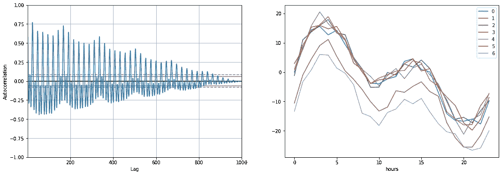
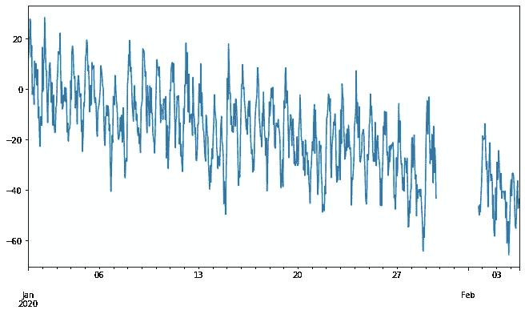
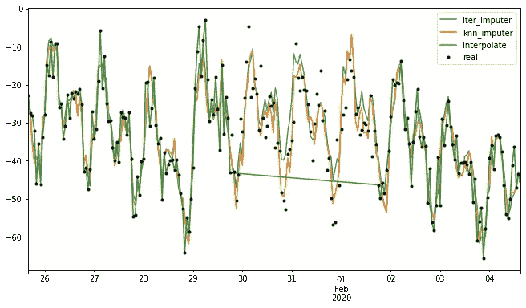
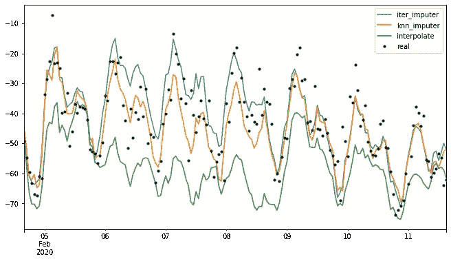

# 具有缺失值的预测时间序列:超越线性插值

> 原文：<https://towardsdatascience.com/forecast-time-series-with-missing-values-beyond-linear-interpolation-2f2adf0a0cba>

## 比较备选方案以处理时间序列中的缺失值


照片由 [Kiryl Sharkouski](https://unsplash.com/@kshar2?utm_source=medium&utm_medium=referral) 在 [Unsplash](https://unsplash.com?utm_source=medium&utm_medium=referral) 上拍摄

拥有干净易懂的数据是每个数据科学家的梦想。不幸的是，现实并不那么美好。我们必须花费大量的时间来进行数据探索和清理。然而，一个好的探索性分析是提取最有用的见解和产生更好结果的关键。

在预测应用的背景下，**数据中呈现的动态的详细概述是做出最佳决策的良好起点**。从预测架构的选择到预处理技术，有很多可供选择的方案。**最重要的，同时也被低估的，是用来处理缺失值的方法**。

**遗漏的观察值没有全部相同的含义**。由于缺乏信息或摄入过程中的问题，可能会缺少值。在大多数情况下，没有对所有情况都有效的黄金法则来填充缺失值。我们能做的就是了解分析领域。**对于时间序列，我们必须考虑系统中的相关性动态以及数据中存在的时间相关性**。

在这篇文章中，我们试图解决一个存在缺失值的时间序列预测任务。**我们研究不同的策略来处理时间序列**的缺失观测值。从标准的线性插值到更复杂的技术，我们试图比较不同的可用方法。令人兴奋的部分在于我们只管理 scikit-learn 的实验。**用简单的 scikit 预测时间序列——用** [**tspiral**](https://github.com/cerlymarco/tspiral) 学习是可能的。我发布了 [**tspiral**](https://github.com/cerlymarco/tspiral) ，目的是利用 scikit-learn 生态系统的完整性和可访问性来解决时间序列预测任务。

# 实验设置

我们的范围是测试不同的插补策略如何影响时间序列预测的性能。为此，我们首先生成一些具有每日和每周季节性的每小时合成时间序列。



模拟时间序列的季节性模式(图片由作者提供)

其次，我们人为地生成一些缺失的区间，插入到我们的时间序列中。



缺失值的时间序列示例(图片由作者提供)

至此，我们已经准备好开始建模了。我们想要测试**预测准确性如何根据用于填充缺失值**的方法而变化。除了众所周知的线性插值之外，我们还想测试总是应用于表格数据集的技术如何也适用于时间序列。具体来说，我们测试了 k 近邻(knn)和迭代插补。

对于 knn 方法，我们使用 k-最近邻方法来填充缺失值。每个缺失要素都使用最近邻要素的值进行估算。缺少多个要素的样本的相邻要素可能会有所不同，具体取决于要估算的要素。另一个有趣的方法是使用迭代插补。每个具有缺失值的要素都被建模为其他要素的函数。通过这种方式，我们拟合一个模型来预测每个特征，将其他特征作为输入。由此产生的预测用于估计缺失的观察值并提供插补。估计过程可以重复更多次以保证鲁棒性，直到重建误差足够低。

在时间序列上下文中，我们将相同的技术直接应用于滞后的目标特征，保持基础算法和预测策略不变。



不同插补策略的重构比较(图片由作者提供)

**着眼于重建能力，迭代和 knn 插补看起来很有前途**。用简单的内插法，我们只限于连接更近的观测值，而不考虑系统的性质。使用 knn 或迭代插补，**我们可以复制数据中的季节性模式和潜在动态**。通过在我们的预测管道中采用这些预处理技术，我们可以提高插补能力，从而实现更好的预测。



不同插补策略的预测比较(图片由作者提供)

# 结果

将缺失值填充合并到机器学习预测管道中非常简单。我们只需选择所需的插补算法，并将其叠加在所选的预测算法之上。**插补在滞后目标上进行，在没有缺失值的完整特征集上安装预测算法很有用**。下面是一个使用递归预测方法的迭代插补(使用线性模型)示例。

```
from sklearn.linear_model import Ridge
from sklearn.pipeline import make_pipeline
from sklearn.impute import IterativeImputer 
from tsprial.forecasting import **ForecastingCascade**model = **ForecastingCascade**(
    make_pipeline(
        **IterativeImputer**(Ridge(), max_iter=10), 
        Ridge()
    ),
    lags=range(1,169),
    use_exog=False,
    accept_nan=True
)
model.fit(None, y)
pred = model.predict(np.arange(168))
```

我们在我们的合成时间序列上比较了三种提到的填充技术(线性插值、knn 和迭代插补)。丢失的时间间隔有一个随机的长度，并被随机插入到我们的时间序列的最后部分。该选择希望同时测试重构能力和插补对预测未来值的影响。


不同插补策略的性能比较(图片由作者提供)

正如所料，**结果显示了 knn 和迭代估算器对根据测试数据计算的性能**的积极影响。他们可以捕捉数据中的季节性行为，并提供更好的重建，从而实现更好的预测。

# 摘要

在这篇文章中，我们介绍了线性插值的有效替代方法来处理时间序列场景中的缺失值。我们发现如何简单地使用 scikit-learn 和 [**tspiral**](https://github.com/cerlymarco/tspiral) 将我们的自定义插补策略整合到我们的预测管道中。最后，我们发现所提出的技术可以产生性能提升，如果适当地采用并根据分析案例进行验证的话。

[**查看我的 GITHUB 回购**](https://github.com/cerlymarco/MEDIUM_NoteBook)

保持联系: [Linkedin](https://www.linkedin.com/in/marco-cerliani-b0bba714b/)