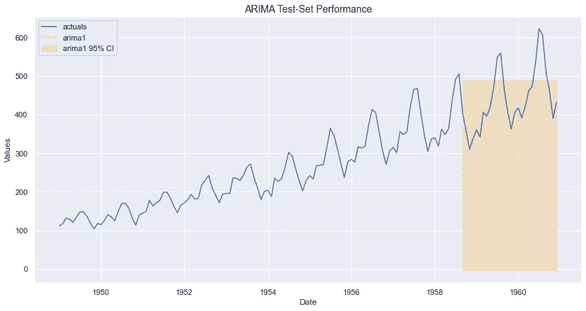
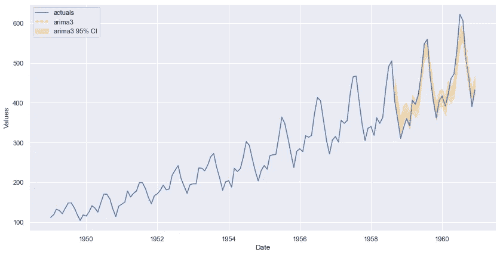
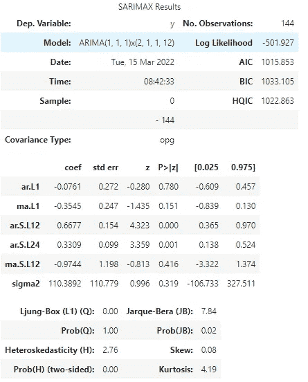
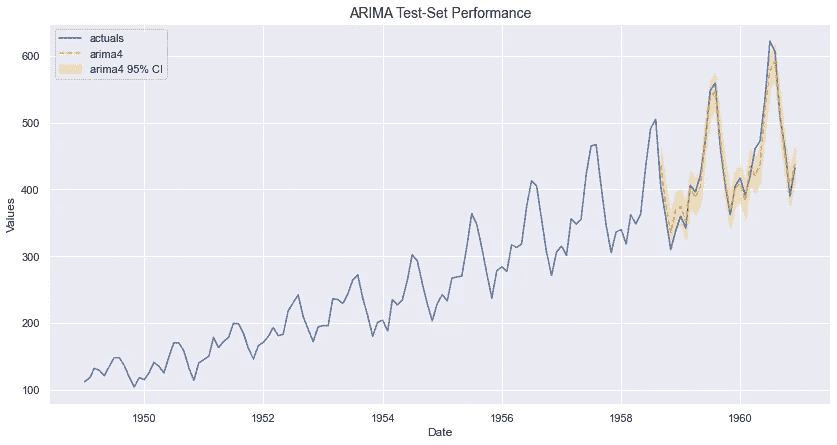

# 使用 Scalecast 更轻松地预测 Python 中的 ARIMA

> 原文：<https://towardsdatascience.com/forecast-with-arima-in-python-more-easily-with-scalecast-35125fc7dc2e>

## 使用 ARIMA、SARIMA 和 SARIMAX 进行指定、测试和预测比以往任何时候都更容易


米盖尔·阿尔坎塔拉在 [Unsplash](https://unsplash.com?utm_source=medium&utm_medium=referral) 上拍摄的照片

自回归综合移动平均(ARIMA)模型仍然是预测时间序列数据最流行和最有效的方法之一。这是一个线性模型，它将一个序列的过去的滞后、误差和平稳性相关联，以形成关于数据的基本统计属性的理论。它利用这些信息来预测未来的价值。

用 Python 实现 ARIMA 模型的一种常见方式是使用 [statsmodels](https://www.statsmodels.org/devel/generated/statsmodels.tsa.statespace.sarimax.SARIMAX.html) 。有许多关于这种实现的教程，大多数拥有数据科学相关学位的人都经历过这种练习。

如果您了解 ARIMA 模型的基础并对其感到满意，那么您可能会喜欢一个减少数据准备和实现该模型所需的代码行的库。事实上，我可以非常快速地编写脚本，用 ARIMA 进行验证和预测，结果证明是准确的。这都涉及到使用 scalecast 包。易于安装:

```
pip install scalecast
```

我们将使用一个开放数据库许可的 [Kaggle](https://www.kaggle.com/rakannimer/air-passengers) 上提供的每月乘客计数数据集。参见本文中使用的代码[这里](https://github.com/mikekeith52/scalecast-examples/blob/main/arima/arima.ipynb)。参见 [GitHub](https://github.com/mikekeith52/scalecast) 上的 scalecast 项目。

# **Scalecast**

这个软件包是为那些知道他们的模型需要被验证并用于产生未来预测的预测者准备的。也许你不想花太多时间去分解模型的细节。如果是这样的话，从导入结果到测试和预测，代码的基本流程是这样的:



作者图片

这个模型很容易指定，代码的每一行都有很强的可解释性。当然，这个例子会给你一个类似于“天真”预测的东西，其中统计属性没有真正被检验，模型没有真正预测任何有用的东西。因此，可以使用稍微复杂一点的脚本，如下所示:


作者图片


作者图片

在这个过程中，你会看到一些图表的结果，包括 ACF、PACF 和季节分解图。你也可以解释统计测试的结果，如增强的 Dickey-Fuller 和 Ljung-Box，以查看系列的期望水平和模型的有效性。使用发现的洞察力，您可以尝试指定和重新指定模型，直到找到您喜欢的模型。还好这里选的那个好像还不错，没多久我就找到了。

总的来说，这个过程仍然比 statsmodels 需要更少的代码行，但它变成了一个迭代过程，需要人工干预和对图形的解释，以找到使模型有用的最佳 ARIMA 阶数。也许你没有时间做这些，想把人的部分自动化掉。

# **全自动化**

自动化可能会给建模过程带来问题，例如指定“嘈杂的”模型和统计上不可靠的模型的风险。但是，这个风险对你来说可能是值得的。如果是这种情况，您可以使用以下两种解决方案。

## 解决方案 1 —使用 pmdarima 的 auto_arima 函数设置订单

从 pmdarima 使用 auto_arima 需要安装 pmdarima 软件包:

```
pip install pmdarima
```

完成后，您可以对时间序列调用函数，它会通过最小化信息标准(如 AIC)来快速找到最佳顺序，该信息标准用于测量模型的拟合度，但也会惩罚太多可能导致过度拟合的参数。我总是只使用训练集来做这一部分，这样我就不会泄漏数据和过度拟合。下面是一个使用相同数据集和 scalecast 流程进行预测的示例:


作者图片



作者图片

我们可以看到，从 auto_arima 中选择的 ARIMA 模型是(1，1，0)(0，1，0)[12]，并且该模型似乎也很适合。您可以尝试向函数传递其他参数和不同的信息标准，看看是否会得到不同的结果。您还可以看到该模型的汇总统计数据:

```
f.regr.summary()
```



## 解决方案 2 —网格搜索 scalecast 中的最佳订单

如果您不喜欢 auto_arima 函数，并且仍然希望自动为您的系列找到最佳模型，scalecast 本身提供了另一种搜索最佳 arima 阶数的方法，那就是通过对数据的验证切片进行网格搜索。

这可能为 auto_arima 方法提供了优势，因为它实际上会在样本外数据上验证所选订单，而不是使用不完美的信息标准。网格搜索方法也不需要调用 Python 脚本的另一个库。缺点是它可能比 auto_arima 花费更长的时间，并且您不能快速地迭代通过这么多的模型。

以下是该过程的代码:



作者图片

该代码搜索 12 个 ARIMA 模型，通过测试最接近测试集观测值的 12 个观测值的每个误差，找到具有最佳阶数的模型。这 12 个观察值被排除在每次训练迭代之外。数字 12 可以在上面代码的第一行修改。正如我们所看到的，这种方法也产生了极好的效果！

# 选择模型并导出结果

我们在这个脚本中指定了四个 ARIMA 模型。哪个最好？我们可以比较 scalecast 中的几个误差和精度指标，包括 RMSE、MAE、MAPE 和 R2。我将选择测试集 MAPE 性能。首先，让我们将结果，包括测试集预测、预报和模型统计数据，导出到熊猫数据框架的字典中。

```
pd.options.display.max_colwidth = 100
results = f.export(to_excel=True,
                   excel_name='arima_results.xlsx',
                   determine_best_by='TestSetMAPE')
```

然后，我们使用以下代码选择一些信息来查看每个模型:

```
summaries = results['model_summaries']
summaries[
    [
         'ModelNickname',
         'HyperParams',
         'InSampleMAPE',
         'TestSetMAPE'
    ]
]
```


作者图片

不出所料，第一个没有选择订单的 ARIMA 显然是最差的。使用网格搜索找到订单的 ARIMA 在技术上是最好的(测试集上的误差为 3.6%)，但其他三个模型都非常相似。它们都没有显示出过度拟合的迹象，因为它们的样本内和测试集指标非常接近。让我们一起来看看他们的预测。他们将按照他们的测试集 MAPE 性能从最好到最差排序。


作者图片

# 外部变量——下一次

我们已经概述了季节性 ARIMA (SARIMA)模型的使用，但该模型还有其他可用的变体。例如，使用外生变量，如假日或异常值，可以通过向对象添加所需的变量，并在`manual_forecast()`函数中指定`Xvars`参数，如果使用`auto_forecast()`，也可以在网格中指定。更多信息参见[文档](https://scalecast.readthedocs.io/en/latest/Forecaster/_forecast.html#module-src.scalecast.Forecaster.Forecaster._forecast_arima)。

# 结论

使用 scalecast 软件包指定和实现 ARIMA 的结果从未如此简单。我希望这些代码对您有用，并且您能够使用这种方法建立自己的 ARIMA 流程！