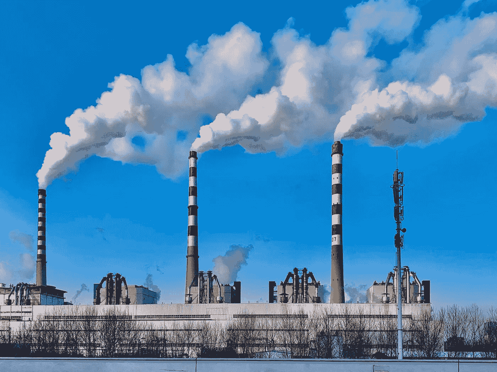
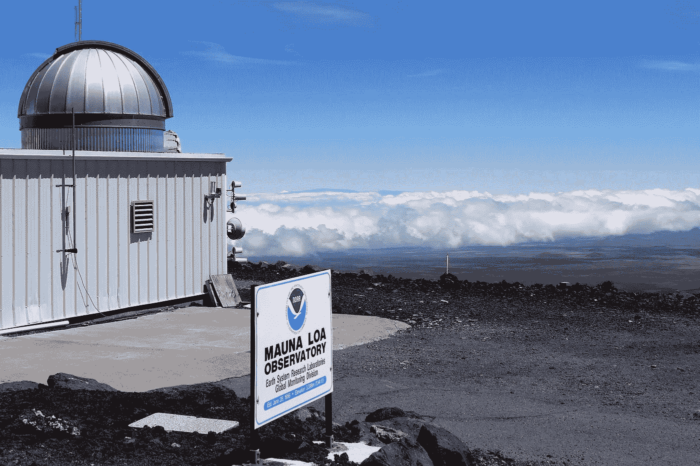
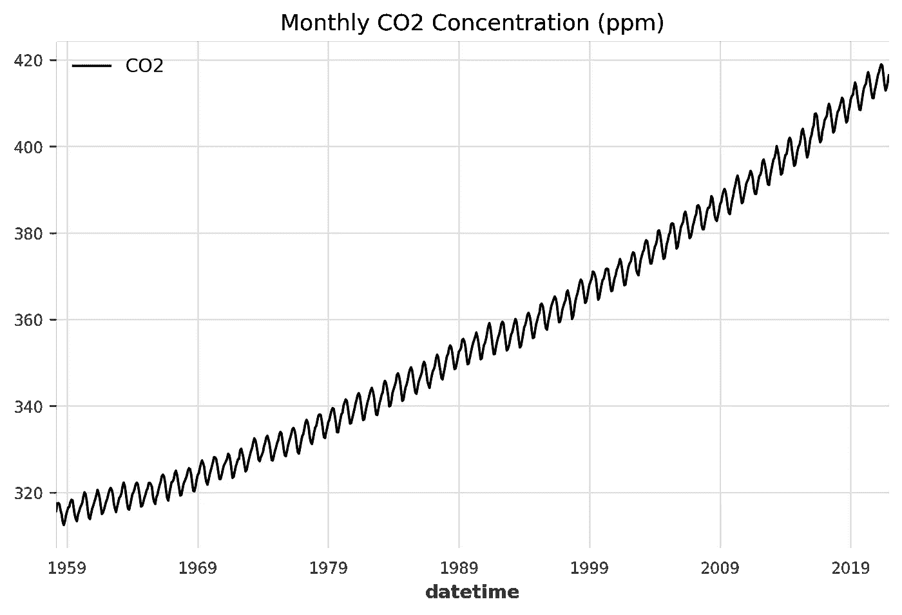
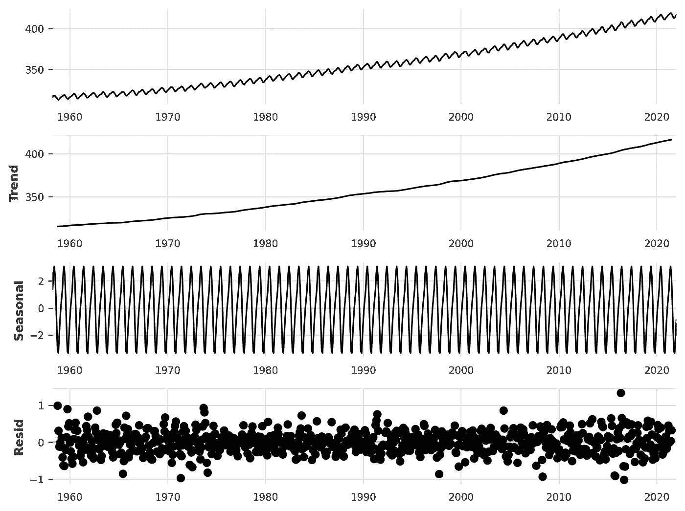
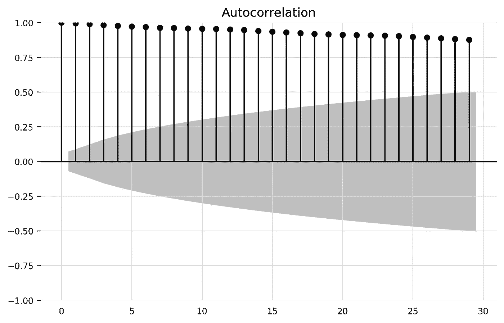
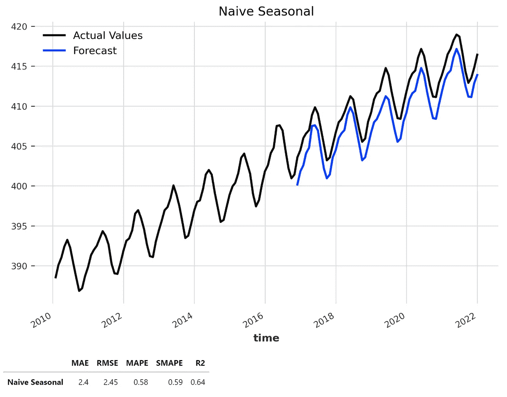
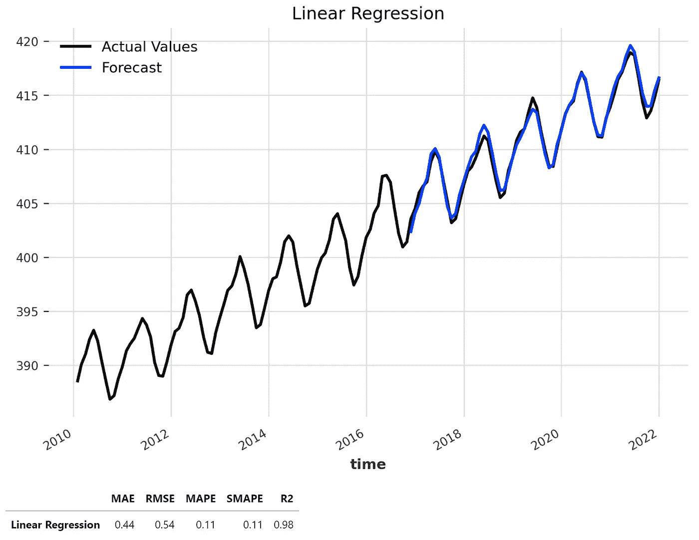
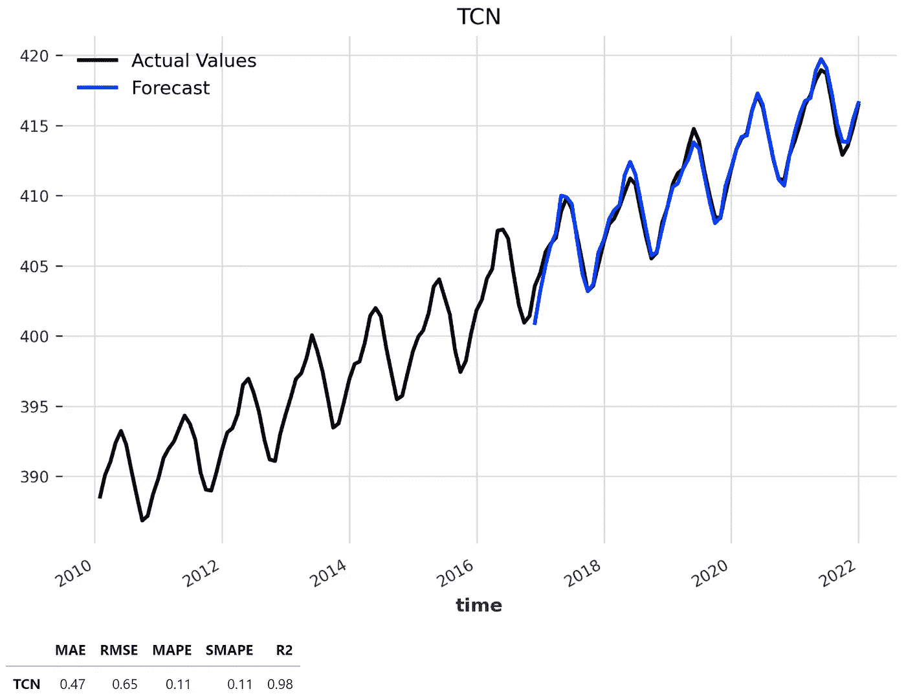

# 用 Python 预测大气 CO2

> 原文：<https://towardsdatascience.com/forecasting-atmospheric-co2-concentration-with-python-c4a99e4cf142>

## 如何用飞镖创建时间序列预测模型

安德里亚斯·费尔斯克在 [Unsplash](https://unsplash.com?utm_source=medium&utm_medium=referral) 上的照片

气候变化无疑是人类面临的最大挑战之一，专家认为这是对我们人类生存的威胁。2021 年，世界范围内记录了前所未有的热浪和野火，而洪水给欧洲和亚洲带来了破坏。根据政府间气候变化专门委员会(气专委)第六次评估报告，极端天气事件日益频繁与气候变化有关，需要在全球范围内采取严厉措施来解决这一问题。否则，数百万人将受到影响，他们的生活质量将在随后的几年中显著下降。

二氧化碳(CO2)和甲烷(CH4)等温室气体(GHG)将热量储存在大气中，从而使我们的星球保持温暖，有利于生物物种的生存。不管怎样，人类活动，如燃烧化石燃料，导致大量的 GHG 被排放，从而过度增加了地球的平均全球温度。因此，向可持续的全球经济过渡势在必行，这样我们才能减缓气候变化，确保我们人类的繁荣。在本文中，我们将对大气 CO2 浓度数据应用时间序列预测，从而有机会探索机器学习和气候变化的交集。

# 飞镖图书馆

飞镖标志—由 Unit8 提供的图像

[darts 库](https://unit8co.github.io/darts/)开发者的目标是用 Python 简化时间序列分析和预测。Darts 支持多种预测方法，从 ARIMA 和指数平滑等经典统计模型，到基于机器学习和深度学习的新方法。此外，darts 包括各种功能，让我们了解时间序列的统计特性，以及评估预测模型的准确性。如果你想了解更多关于飞镖的知识，可以阅读[本库的详细介绍](https://medium.com/unit8-machine-learning-publication/darts-time-series-made-easy-in-python-5ac2947a8878)，或者参考[官方 API 文档](https://unit8co.github.io/darts/generated_api/darts.html)。darts 库将让我们基于莫纳罗亚火山二氧化碳数据集创建各种预测模型。此外，我们将比较这些模型的准确性，并使用最佳模型来预测 2022 年的大气 CO2 浓度值。

# 莫纳罗亚二氧化碳数据集

莫纳罗亚天文台——照片由 NOAA 拍摄

莫纳卢阿火山是同名的[莫纳罗亚天文台(MLO)](https://gml.noaa.gov/obop/mlo/) 的所在地，这是一个自 1950 年以来一直监测大气的研究机构，其偏远的位置为记录气候数据提供了理想的条件。1958 年，查理斯·大卫·基林建立了 MLO 的 CO2 监测计划，并开始记录大气中 CO2 浓度迅速增加的科学证据。莫纳罗亚火山二氧化碳数据集是从斯克里普斯海洋研究所下载的，包括从 1958 年到 2021⁴.的每月大气二氧化碳浓度值，单位为百万分之一(ppm)此外，数据集还包含季节性调整和平滑版本的数据，但我们的分析将专门关注标准时间序列。

# 时间序列分析

在本节中，我们将提取一些关于数据集及其统计属性的见解。这将通过使用各种类型的绘图和其他时间序列分析技术来完成。

我们首先导入项目所需的 Python 库，包括 pandas、Matplotlib 以及 statsmodels 和 darts 库中的各种函数。之后，我们将 Matplotlib 图形 DPI 设置为 300，这样我们就可以获得本文的高分辨率图形，但这是可选的。

导入库之后，我们继续将数据集加载到 pandas 数据框架中。然后，我们对它应用一些数据预处理技术，比如删除不必要的列，设置每月日期时间索引并删除空值。

作者图片

在清理数据集之后，我们使用`plot()` pandas 函数创建一个简单的时间序列线图。显然，有一个明显的上升趋势，突出了大气 CO2 浓度在过去几十年中迅速增加的事实。此外，由于地球的自然碳循环，还有季节性，因为植物在 year⁵.的不同季节吸收和释放二氧化碳具体来说，当植物在春天开始生长时，它们通过光合作用从大气中去除二氧化碳。相比之下，当落叶树在秋天落叶时，二氧化碳会因呼吸作用而释放出来。

作者图片

我们使用`seasonal_decompose()` statsmodels 函数对时间序列进行分解，即提取趋势、季节和残差成分。在此之后，我们绘制这些组成部分，并更好地理解之前提到的趋势和季节性。在这种特殊情况下，我们已经可以通过目视检查线图来识别组件，但是季节分解在更复杂的情况下非常有用。

作者图片

我们使用`plot_acf()` statsmodels 函数来绘制时间序列的自相关函数(ACF ),即其滞后值之间的线性关系。由于时间序列趋势，我们可以看到自相关性对于小的滞后是高的，并且在滞后 5 之后开始逐渐降低。ACF 还应该突出时间序列的季节性成分，但在这种情况下是看不出来的。

# 时间数列预测法

在本节中，我们将在 CO2 数据集上训练各种预测模型，并比较它们的性能。在此之后，我们将选择最准确的模型，并基于它创建 2022 年的预测。

我们首先将 pandas 数据帧加载到一个 TimeSeries 对象，这是 Darts 库所需要的。之后，我们创建`plot_backtest()`和`print_metrics()`效用函数，让我们绘制预测图并显示各种模型指标，包括 MAE、RMSE、MAPE、SMAPE 和 R。

## 创建一个简单的预测模型

设置基线精度是标准做法，因此我们将通过创建一个简单的模型来实现。这将有助于我们评估更复杂模型的性能，理论上，与基线相比，这些模型应该具有更高的准确性。在这种情况下，我们将创建一个简单的季节模型，该模型总是预测 K 步之前的值，K 等于季节周期。

作者图片

为了测试简单的季节性模型，我们使用了预测时间跨度为 12 个月的`historical_forecasts()`函数。此函数在扩展窗口中连续训练模型，默认情况下保留每个预测的最后一个值。这种技术被称为回溯测试或时间序列交叉验证，与典型的训练/测试方法相比，它更加复杂。生成预测后，我们使用效用函数显示图表和指标。如我们所见，朴素季节模型表现相当好，SMAPE 值为 0.59%。

## 创建指数平滑预测模型

既然我们已经设置了基线精度，我们将基于霍尔特-温特指数平滑法创建一个预测模型，这是一种自 1960s⁶.以来一直成功使用的经典方法

作者图片

如前所述，我们使用`historical_forecasts()`函数以及效用函数来评估模型性能。显然，指数平滑模型明显优于朴素模型，SMAPE 值为 0.1%。通过观察预测值与绘制的数据集值几乎相同，我们也可以直观地确认这一点。

## 创建线性回归预测模型

在过去的几年中，机器学习模型作为传统方法的一种替代方法被广泛应用于时间序列预测。通过简单地将滞后值作为特征添加到数据集中，我们可以将时间序列预测转换为回归 task⁷.因此，我们能够使用任何 [scikit-learn](https://scikit-learn.org/stable/) 回归模型或其他具有兼容 API 的库，包括 XGBoost 和 LightGBM。在这种情况下，我们将基于 scikit-learn 库创建一个线性回归模型。

作者图片

通过使用`historical_forecasts()`和效用函数，我们测试线性回归模型并随后显示结果。我们可以看到，该模型性能优异，SMAPE 值为 0.11%。

## 创建时间卷积网络预测模型

近年来，深度学习在时间序列预测中变得流行，递归神经网络是研究和实际应用中的标准选择。无论如何，时间卷积网络是一种替代架构，提供了有前途的 results⁸，所以我们要测试它的性能。

作者图片

如前所述，我们使用`historical_forecasts()`和效用函数来测试时间卷积网络模型并显示结果。此外，我们还通过使用`Scaler()`类来规范化时间序列。显然，与基线相比，TCN 模型具有明显更好的性能，SMAPE 值为 0.11%。

## 创建预测

正如预期的那样，所有的模型都优于朴素的季节模型，提供了极好的准确性。无论如何，我们可以看到指数平滑提供了最好的性能，因此我们对 2022 年大气 CO2 浓度的预测将基于它。

作者图片

我们使用`fit()`函数在整个数据集上拟合指数平滑模型，然后显示结果。正如我们可以直观地观察到的，模型已经成功地识别了时间序列的组成部分。此外，我们可以将我们的结果与英国气象局(Met Office)2022 年的官方二氧化碳预测(T4)进行比较。正如所料，两个预测值几乎相同，从而验证了指数平滑模型的准确性。令人惊讶的是，指数平滑提供了最好的结果，而不是机器学习和深度学习模型。无论如何，我们应该记住，与经典方法相比，新模型并不一定在每种情况下都更好。此外，可以通过应用超参数调整来优化机器学习模型，这是一种耗时且复杂的技术，但可以提供显著的改进。

# 结论

在本文中，我们探索了数据科学可用于应对气候变化的方法之一，这是一个不断 grows⁹的蓬勃发展的多元化研究领域，因此我鼓励您了解更多信息。可悲的是，我们还发现今年大气中的二氧化碳浓度预计会增加，这突出表明必须减少排放，以确保我们人类的繁荣。最后，这篇文章的代码和数据可以在这个 [Github 仓库](https://github.com/derevirn/co2-forecasting)获得，所以可以随意克隆它。我也鼓励你在评论中分享你的想法，或者在 [LinkedIn](https://www.linkedin.com/in/giannis-tolios-0020b067/) 上关注我，我经常在那里发布关于数据科学、气候变化和其他主题的内容。你也可以访问我的[个人网站](https://giannis.io/)或者查看我的新书，名为[用 PyCaret](https://leanpub.com/pycaretbook/) 简化机器学习。

# 参考

[1]翟，等. IPCC 2021:气候变化 2021:物理科学基础.第一工作组对政府间气候变化专门委员会第六次评估报告的贡献。”(2021).

[2]约翰·霍顿。“全球变暖。”物理学进展报告 68.6 (2005): 1343。

[3]Daniel c . Harris，“查理斯·大卫·基林和大气二氧化碳测量的故事”分析化学 82.19(2010):7865–7870。

[4] Keeling，Charles D .等人，“1978 年至 2000 年大气 CO2 和 13CO2 与陆地生物圈和海洋的交换。一.全球方面。”(2001).

[5]查尔斯·d·基林，“农村地区大气中二氧化碳的浓度和同位素丰度”地球化学与宇宙化学学报 13.4(1958):322–334。

[6]彼得·温特斯，“用指数加权移动平均法预测销售”管理学 6.3(1960):324–342。

[7]托马斯·迪特里希，《时序数据的机器学习:综述》模式识别统计技术(SPR)和结构与句法模式识别(SSPR)IAPR 联合国际研讨会。施普林格，柏林，海德堡，2002。

[8]白、、j .、科尔特和弗拉德连科尔通。"用于序列建模的一般卷积和递归网络的经验评估."arXiv 预印本 arXiv:1803.01271 (2018)。

[9] Rolnick，David 等人，“用机器学习应对气候变化”美国计算机学会计算调查(CSUR)55.2(2022):1–96。