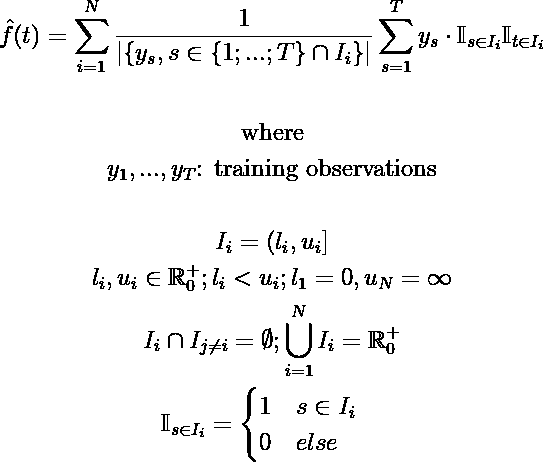
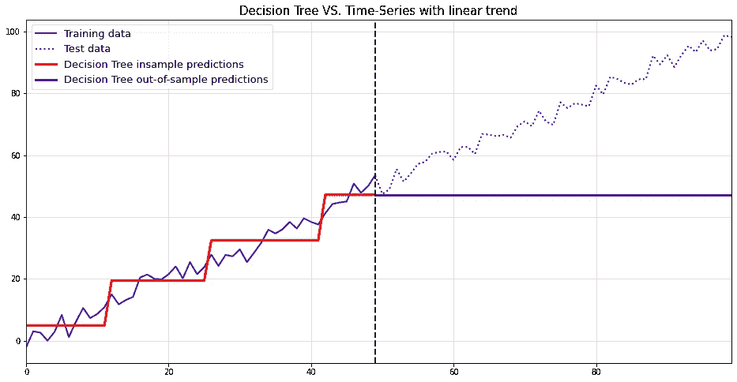
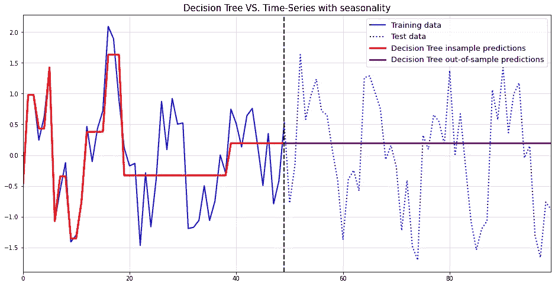
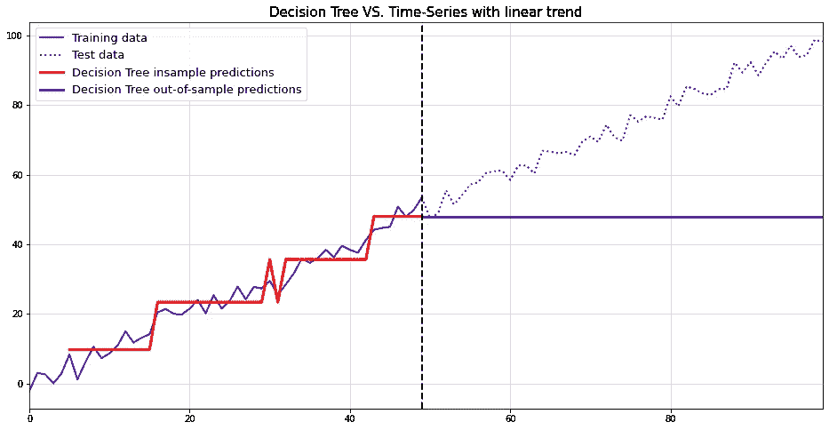
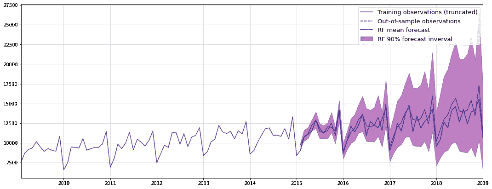
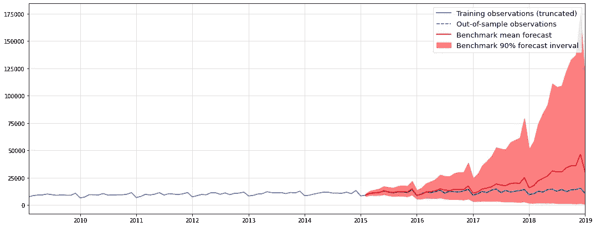
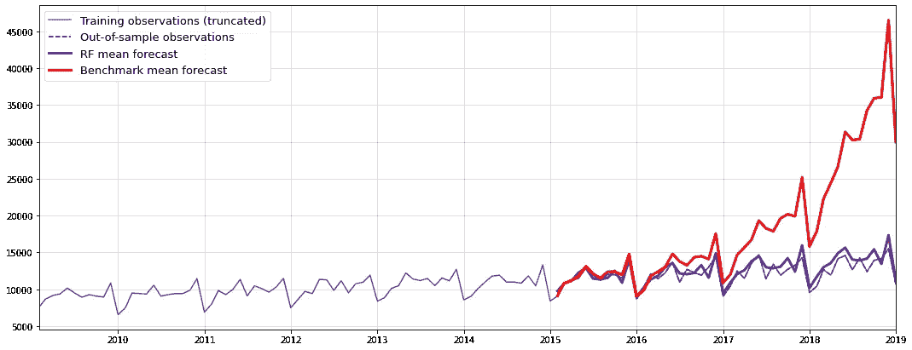

# 用决策树和随机森林进行预测

> 原文：<https://towardsdatascience.com/forecasting-with-decision-trees-and-random-forests-ac081ff451ec>

## 对于表格数据，随机森林灵活而强大。它们也适用于时间序列预测吗？让我们找出答案。

约翰·西门子在 [Unsplash](https://unsplash.com/s/photos/tree?utm_source=unsplash&utm_medium=referral&utm_content=creditCopyText) 上拍摄的照片

# 介绍

今天，深度学习主导了现代机器学习的许多领域。[另一方面，基于决策树的模型仍然大放异彩，尤其是对于表格数据。](https://openreview.net/forum?id=vdgtepS1pV)如果你查找各个 *Kaggle* 挑战的获胜方案，很有可能其中就有一个树模型。

树方法的一个主要优点是，它们通常不需要太多的微调来获得合理的结果。这与深度学习形成了鲜明的对比。这里，不同的拓扑和架构会导致模型性能的显著差异。

对于时间序列预测，决策树不像表格数据那样简单，但是:

# 树木和森林对预测的挑战

你可能知道，拟合任何基于决策树的方法都需要输入和输出变量。然而，在单变量时间序列问题中，我们通常只将我们的时间序列作为目标。

为了解决这个问题，我们需要增加时间序列，使其适合树形模型。让我们先来讨论两种直观但错误的方法，以及它们失败的原因。显然，这些问题适用于所有决策树集成方法。

## 作为时间回归的决策树预测

也许最直观的方法是将观察到的时间序列视为时间本身的函数，即

(图片由作者提供)

带有一些独立同分布随机附加误差项。在之前的一篇文章中，我已经说过为什么逆时间回归是有问题的。对于基于树的模型，还有另一个问题:

> ***决策树用于回归反对时间不能外推未来*** *。*

通过构造，决策树预测是训练数据集子集的平均值。这些子集是通过将输入数据的空间分割成轴平行的超矩形而形成的。然后，对于每个超矩形，我们取这些矩形内所有观察输出的平均值作为预测。

对于相对于时间的回归，这些超矩形仅仅是时间间隔的分割。更确切地说，这些区间是互斥的，完全穷尽的。

预测是这些时间间隔内时间序列观测值的算术平均值。从数学上来说，这大致可以解释为

(图片由作者提供)

现在考虑使用这个模型来预测未来某个时间的时间序列。这将上述公式简化为:

(图片由作者提供)

换句话说:对于任何预测，我们的模型总是预测最终训练区间的平均值。这显然是没用的…

让我们用一个简单的玩具例子来想象这个问题:

对于简单的线性趋势，使用决策树将时间序列建模为时间的函数是非常失败的。(图片由作者提供)

季节性模式显然也存在同样的问题:

对于季节性时间序列，针对时间的决策树回归也不起作用。(图片由作者提供)

用一句话概括以上内容:

> ***决策树对非分布数据失效，但在对时间的回归中，未来每个时间点都是非分布的。***

因此，我们需要找到一种不同的方法。

# 自回归预测的决策树

一个更有前途的方法是自回归法。在这里，我们简单地将随机变量的未来视为依赖于其过去的实现。

(图片由作者提供)

虽然这种方法比按时回归更容易处理，但它也不是没有代价的:

1.  **时间序列必须在等距离的时间戳处观察**:如果你的时间序列是在随机时间测量的，你不能使用这种方法而不做进一步的调整。
2.  **时间序列不应包含缺失值**:对于许多时间序列模型，这一要求不是强制性的。然而，我们的决策树/随机森林预测器需要一个完全观察到的时间序列。

由于这些警告对于大多数流行的时间序列方法来说是常见的，所以它们不是太大的问题。

现在，在进入示例之前，我们需要再看一下之前讨论过的问题:**基于树的模型只能在训练数据的范围内进行预测**。这意味着我们不能仅仅用决策树或随机森林来模拟自回归依赖性。

为了举例说明这个问题，我们再举一个例子:

*自回归决策树无法预测具有线性趋势的时间序列*。(图片由作者提供)

还是那句话，一点用都没有。要解决最后一个问题，我们需要首先移除趋势。然后，我们可以拟合模型，预测时间序列，并对预测进行“重新趋势化”。

对于去趋势化，我们基本上有两种选择:

1.  **拟合线性趋势模型** —这里我们用线性回归模型对时间序列进行回归。然后从训练数据中减去它的预测，以创建一个平稳的时间序列。这消除了一个不变的、确定的趋势。
2.  **使用一阶差分** —在这种方法中，我们通过[一阶差分](https://otexts.com/fpp2/stationarity.html#:~:text=series%20is%20stationary.-,Differencing,-In%20Figure%208.1)来转换时间序列。除了确定性趋势，这种方法还可以消除随机趋势。

由于大多数时间序列是由随机性驱动的，第二种方法似乎更合理。因此，我们现在的目标是预测转换后的时间序列

(图片由作者提供)

通过自回归模型，即

(图片由作者提供)

显然，差异和滞后从我们的训练数据中移除了一些观察值。应该注意不要用这种方式删除太多信息。也就是说，如果数据集很小，不要使用太多滞后变量。

为了获得原始时间序列的预测，我们需要通过以下方式重新转换差分预测

(图片由作者提供)

并且，递归地进行进一步的预测:

(图片由作者提供)

对于我们的运行示例，这最终导致了一个合理的解决方案:

基于差分时间序列的决策树预测最终奏效。(图片由作者提供)

# 从树木到随机预测预报

现在让我们将上述方法应用于真实世界的数据集。我们使用圣路易斯联邦储备银行数据库中的酒类销售数据。为了评估，我们使用过去四年作为维持集:

圣路易斯联邦酒精销售数据-培训和抵制集。(图片由作者提供)

# 生长用于预测的自回归随机森林

由于单个决策树往好里说会令人厌烦，往坏里说会不准确，所以我们将使用随机森林来代替。除了典型的性能改进，随机森林允许我们生成预测间隔。

要创建随机森林预测间隔，我们按如下步骤进行:

1.  **训练一个自回归随机森林**:这一步相当于像以前一样拟合决策树
2.  **在每个预测步骤中使用随机抽取的决策树**:我们让一个随机抽取的单一决策树来执行预测，而不是只使用`forest.predict()`。通过多次重复此步骤，我们创建了一个决策树预测示例。
3.  **从决策树样本中计算感兴趣的数量**:这可以是中值到标准差或更复杂的目标。我们主要对平均预测和 90%的预测区间感兴趣。

下面的 Python 类完成了我们需要的一切:

由于我们的数据严格为正，具有趋势和年度季节性，我们应用以下转换:

*   **对数转换**:我们的预测需要通过指数转换重新转换。因此，取幂的结果也将严格为正
*   **第一个差异**:如上所述，这消除了数据中的线性趋势。
*   **季节性差异** : [季节性差异](https://faculty.fuqua.duke.edu/~rnau/Decision411_2007/Class10notes.htm)的工作方式类似于具有更高滞后订单的第一差异。此外，它允许我们消除确定性和随机性的季节性。

所有这些变换的主要挑战是正确地将它们的逆变换应用于我们的预测。幸运的是，上面的模型已经实现了这些步骤。

# 评估随机森林预测

使用数据和模型，我们在测试期间得到以下结果:

随机森林预测、训练和测试数据。(图片由作者提供)

这个看起来很不错。为了验证我们不仅仅是幸运，我们使用了一个简单的基准测试[进行比较:](https://www.sarem-seitz.com/facebook-prophet-covid-and-why-i-dont-trust-the-prophet/#:~:text=An%20even%20simpler-,forecast,-model)

简单基准模型的比较预测。(图片由作者提供)

显然，基准区间比随机森林差得多。平均预测开始时还算合理，但在几个步骤之后就迅速恶化了。

让我们在一张图表中比较这两种平均预测:

平均预测随机森林与基准。(图片由作者提供)

很明显，随机森林在长期预测方面要优越得多。事实上，随机森林有一个`909.79`的 **RMSE** ，而基准的 RMSE 是`9745.30`。

# 结论

希望这篇文章能让你对使用树模型进行预测的注意事项有所了解。虽然单个决策树有时可能有用，但随机森林通常更有效。也就是说，除非你的数据集非常小，在这种情况下，你仍然可以减少森林树木的`max_depth`。

显然，您可以轻松地在任一模型中添加外部回归变量，以进一步提高性能。例如，在我们的模型中加入月度指标可能会产生比现在更准确的结果。

作为随机森林的替代方案，可以考虑梯度推进。Nixtla 的 mlforecast 软件包有一个非常强大的实现——除了他们所有其他的预测工具。但是请记住，我们不能将预测区间的算法转换为梯度推进。

另一方面，请记住，使用高级机器学习进行预测是一把双刃剑。虽然在表面上很强大，但时间序列的 ML 比横截面问题的 ML 更容易过度拟合。但是，只要您根据一些基准正确地测试您的模型，它们也不应该被忽略。

PS:你可以在这里找到这篇文章[的完整笔记本。](https://github.com/SaremS/sample_notebooks/blob/master/Probabilistic%20Forecasts%20with%20Random%20Forests.ipynb)

# 参考

**【1】**布雷曼·利奥。随机森林。机器学习，2001 年，45.1，第 5–32 页。

**【2】**brei man，Leo 等《分类与回归树》。Routledge，2017。

**【3】**汉密尔顿，詹姆斯·道格拉斯。时间序列分析。普林斯顿大学出版社，2020 年。

[4]美国人口普查局，商业批发商，制造商销售分支机构和办事处除外:非耐用品:啤酒、葡萄酒和蒸馏酒精饮料销售[S4248SM144NCEN]，从圣路易斯美联储银行检索；https://fred.stlouisfed.org/series/S4248SM144NCEN(CC0:公共领域)

*原载于 2022 年 9 月 19 日 https://www.sarem-seitz.com***。**