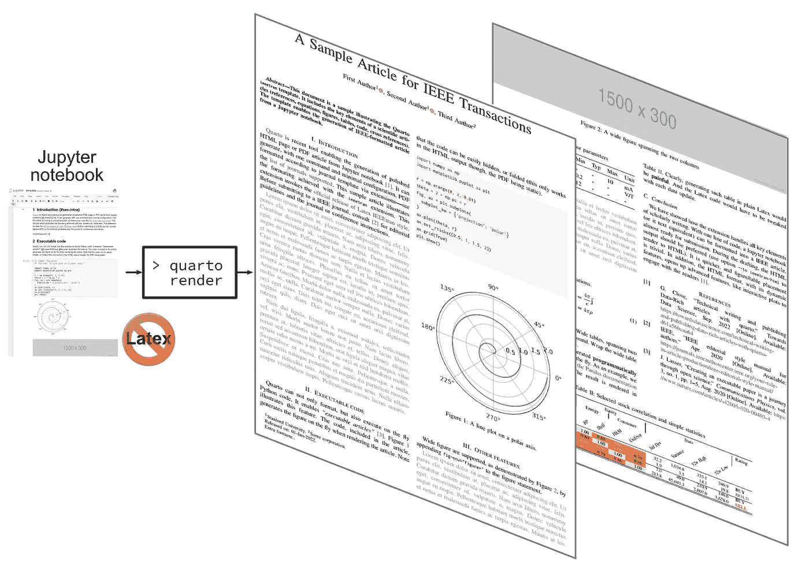

# 为 IEEE 交易日志格式化 Jupyter 笔记本

> 原文：<https://towardsdatascience.com/formatting-a-jupyter-notebook-for-ieee-transactions-journals-4453d5b3c633>

## Quarto 是一个用于 Jupyter 笔记本的开源技术发布系统，可以使用模板进行扩展。本文介绍了一个用于生成 IEEE 格式文章的模板。


尼克·扬森[CC BY-SA 3.0](https://creativecommons.org/licenses/by-sa/3.0/)[pix4 free](https://pix4free.org/)的研究论文

在[“文档即代码”范式](https://www.writethedocs.org/guide/docs-as-code/)中，技术作者使用软件开发工具来编辑、协作和发布技术文档。除了它在记录软件项目方面的主场之外，它特别适合于工程师和科学家，写数据丰富的文章。类似于软件项目，这样的文章依赖于重要的计算机代码。因此，在同一个环境中管理代码和相应的文章可以提高生产率，并有利于更深入的协作，因为代码体现了这种方法。相比之下，仅仅在手稿和结果上进行合作，而没有解释我们如何到达那里的代码，会混淆该方法的关键元素。

当文章采用计算笔记本的形式时(相对于静态手稿)，就实现了额外的集成。文章可以直接调用代码，以便重新运行一些分析并动态更新图表。这进一步提高了再现性。只要代码和支持材料(数据和软件依赖)是共享的，任何人都可以复制文章的计算部分。

正如[1]所指出的，一个可重现的工作流程的主要目的不是处理赤裸裸的欺诈。相反，它是为了获得更好的奖学金。这是因为再现性灌输信任，这是合作的先决条件。在同一参考文献中，还指出了一些作品不需要被复制，并且在结果的可复制性和再利用之间存在连续体。同样，我们不提倡不适当的一揽子要求，即每一个单独的图或表都应该从头开始可复制。

尽管如此，在许多情况下，这是可取的。例如，数据丰富的分析涉及复杂的数学和容易出错的代码。新的数据，新的假设，新的发现可能会出现，可能会挑战或加强先前的结论。拥有一个可重现的分析管道来按需重新运行分析被认为是一个好的实践。如果文章是计算笔记本，更新的结果可以容易地合并到更新的文章中。正如在[2]中所提到的，努力追求再现性是一种纪律，可以带来更好的工作。

Jupyter 笔记本非常适合作为一篇成熟的学术文章——尤其是当文章依赖于数据分析时。它使叙述性故事和为分析提供动力的代码之间紧密联系起来。然后，完整的文章被视为代码。这种*“article-as-code”*范式已经在科学和工程的各个领域流行开来。

例如，参考文献。[3]是一篇化学论文，并提供了一个完整的同伴[笔记本，可在 Google Colab](https://colab.research.google.com/github/jupyter-papers/mock-paper/blob/master/FerroicBlocks_mockup_paper_v3a.ipynb) 上免费获得。笔记本完整地复制了期末论文，同时也包含了代码和解释。

参考文献。[4]提供了在 Jupyter 笔记本中编写和共享计算分析的十条规则。这篇论文发表在生物学杂志上，但是这些规则更普遍适用。以下是十条规则的浓缩版

*   讲一个故事，解释过程，而不仅仅是结果。
*   使用编码最佳实践:模块化代码，明确依赖关系，使用版本控制，共享数据，构建分析管道。
*   设计您的笔记本有三个目的:阅读、运行和探索。

除了正式的学术文章，工程设计和分析报告也受益于计算笔记本格式。工程设计通常依赖于方程、快速内联计算、用于算法描述的伪代码以及探索权衡的图表。这些元素在笔记本上都是一等公民。此外，可能需要重要的代码来配置支持工具(*，例如* CAD、FEM 模拟)，这些代码通常对再现设计至关重要。

在工程分析阶段，来自模拟或实验的大型数据集、原型被处理并总结在表格和图表中。笔记本电脑非常适合用作自动分析管道。

这个概念在芯片设计中被拉长了。例如，[本*“Code-a-chip”*授予](https://sscs.ieee.org/membership/awards/isscc-code-a-chip-travel-grant-awards)前往最大的半导体芯片设计会议，并展示创新的笔记本驱动设计。

Quarto 是 Jupyter 笔记本的发布系统。它是专为撰写精美的学术文章而设计的。我们在以前的文章[5]中探讨了它的功能。

特别是为 [7 家期刊和出版社](https://github.com/quarto-journals/)(计算机械协会、美国化学学会、爱思唯尔期刊……)提供了内置模板。它还提供了从 Latex 类添加新模板的扩展机制。

IEEE 期刊没有内置模板。IEEE 出版了全球近三分之一的电气工程、计算机科学和电子技术文献。

这里我们介绍作者开发的 [ieeetran 模板](https://github.com/gael-close/ieeetran)。从一个 Jupyter 笔记本中，它产生了一篇根据 IEEE class“IEEEtran”格式化的 PDF 文章。该模板支持 IEEE 规范，即两列格式以及跨越两列的`figure*`和`table*`环境。除了用一个命令来处理双列表之外，编写器不需要任何 Latex 命令。

[实际模板](https://github.com/gael-close/ieeetran/blob/main/_extensions/ieeetran/ieeetran-template.tex)的开发包括调用现有类在 Latex 中填充模板文章。虽然模板开发需要 Latex 知识，但这对作者来说是透明的。

通过解压文档目录中[库](https://github.com/gael-close/ieeetran)的内容来安装模板。要使用该模板，运行下面的单个命令，调用输出格式为`ieeetran-pdf`的 Quarto。

```
quarto render article.qmd --to ieeetran-pdf
```

下图说明了工作流以及示例输入和输出文档。



从 Jupyter 笔记本到完全格式化的 IEEE 纸的转换只需一个命令。图片作者。

总之，我们开发了一个 Quarto 扩展，可以无缝地将 Jupyter 笔记本转换成 PDF 格式的 IEEE 论文。尽管如此，我们还是建议在文章起草过程中使用 HTML 输出(使用参数`--to ieeetran-html`)。起草也可以完全在通常的笔记本编辑器中进行，保证最终的格式化只需要一个命令。编写器不需要任何 Latex 命令。一个限制是该模板还不支持会议格式。

Quarto 正在降低采用“文档即代码”范式的门槛。有了模板扩展机制，就可以很容易地开发出基于现有 Latex 类的模板。格式化一篇论文成为一项常规操作，节省了关注文章内容的宝贵时间。

# 参考

[1] J. Baillieul *等人*，“关于研究监管和研究可再现性的未来的第一次 IEEE 研讨会的报告。”2016【上线】。可用:[https://www . IEEE . org/content/dam/IEEE-org/IEEE/web/org/IEEE _ reproducibility _ workshop _ report _ final . pdf](https://www.ieee.org/content/dam/ieee-org/ieee/web/org/ieee_reproducibility_workshop_report_final.pdf)

[2] L. A. Barba，“定义开源软件在研究再现性中的作用”，*计算机*，第 55 卷第 8 期，第 40–48 页，2022 年 8 月【在线】。可用:[http://dx.doi.org/10.1109/MC.2022.3177133](http://dx.doi.org/10.1109/MC.2022.3177133)

[3] M. Ziatdinov，C. Nelson，R. Vasudevan，D. Chen，S. Kalinin，“自下而上构建铁电体:原子尺度铁电畸变的机器学习分析”， *ChemRxiv* ，2019 年 4 月【在线】。可用:[https://chemrxiv . org/engage/chemrxiv/article-details/60c 74146567 dfe 2305 ec3d 40](https://chemrxiv.org/engage/chemrxiv/article-details/60c74146567dfe2305ec3d40)

[4] A. Rule *et al.* 《在 jupyter 笔记本上书写和分享计算分析的十个简单规则》， *PLoS Comput。生物。*第 15 卷第 7 期第 e1007007 页 2019 年 7 月【在线】。可用:[http://dx.doi.org/10.1371/journal.pcbi.1007007](http://dx.doi.org/10.1371/journal.pcbi.1007007)

[5] G. Close，“python 中的信号链分析:硬件工程师案例研究”2021 年 2 月【上线】。可用:[https://towardsdatascience . com/signal-chain-analysis-in-python-84513 fcf 7 db 2](/signal-chain-analysis-in-python-84513fcf7db2)