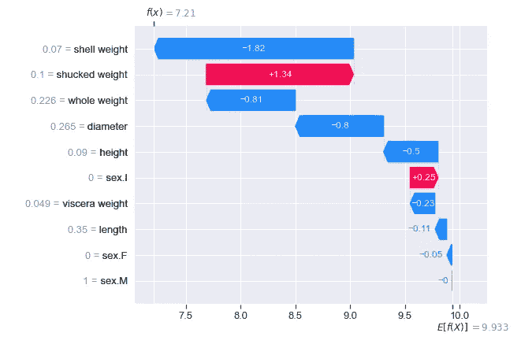
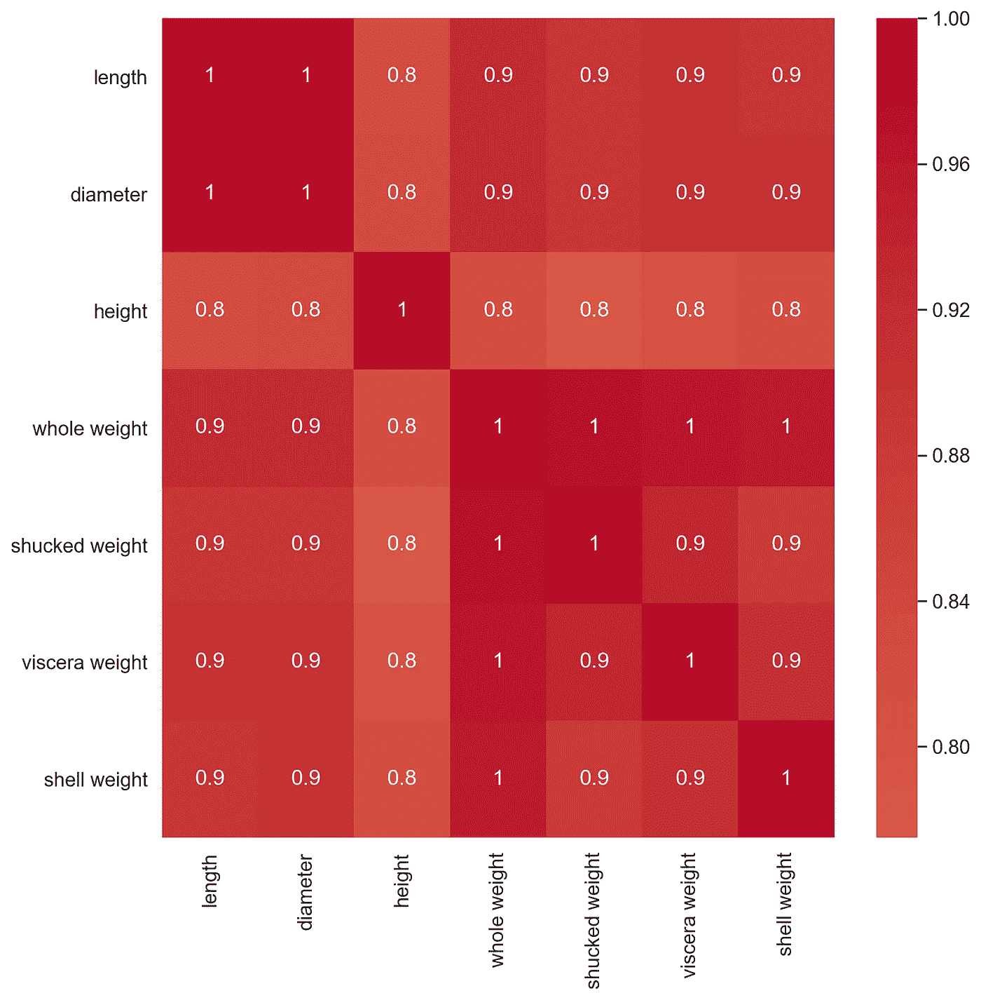
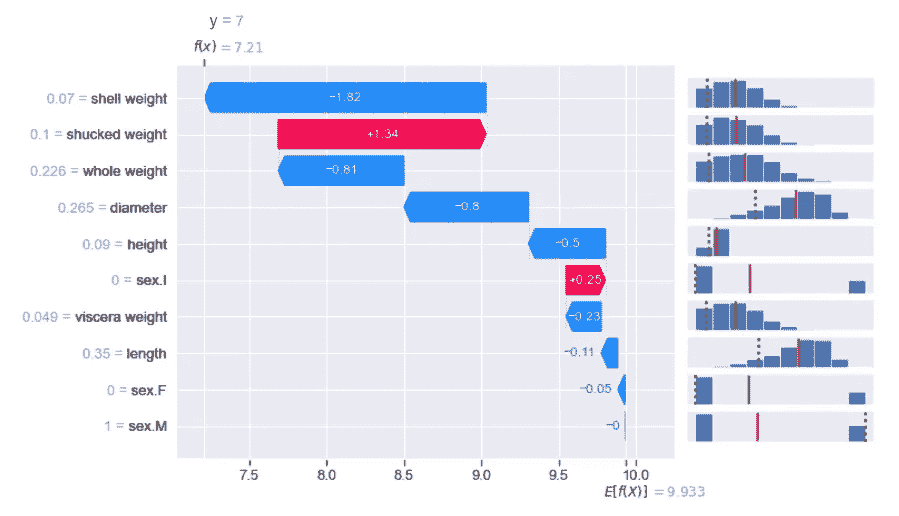
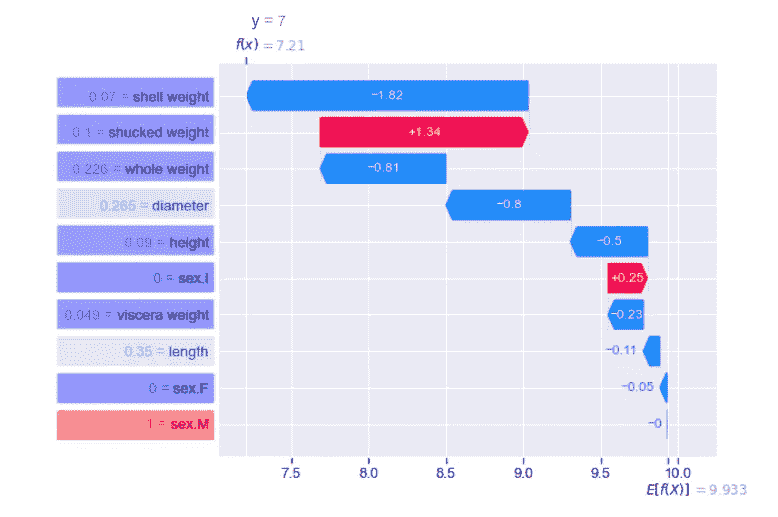
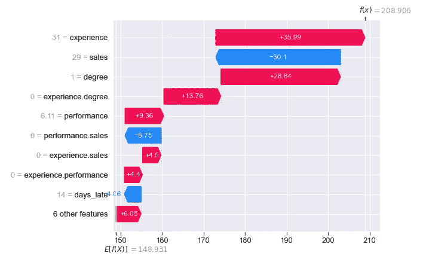
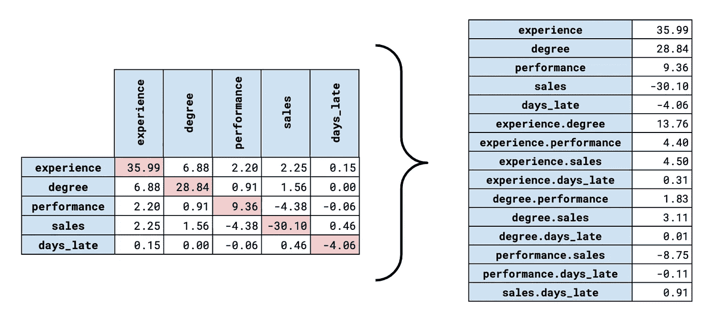

# 四个自定义 SHAP 图

> 原文：<https://towardsdatascience.com/four-custom-shap-plots-8605d73b4570>

## 超越 Python 包，创建 SHAP 值的定制可视化

来源:作者

SHAP 值是理解模型如何进行预测的重要工具。SHAP 软件包提供了许多可视化，使这个过程更加容易。话虽如此，我们不必完全依赖这个一揽子方案。通过创建我们自己的 SHAP 图，我们可以进一步了解模型是如何工作的。在这篇文章中，我们将解释四个定制的 SHAP 情节，以及你能从中学到什么。你可以在 [GitHub](https://github.com/conorosully/medium-articles/blob/master/src/shap_custom.ipynb) 上找到用来创建图的代码。

如果你刚到 SHAP，那么看看**下面的**视频**。**如果你想要更多，那就来看看我的 [**SHAP 课程**](https://adataodyssey.com/courses/shap-with-python/) **。**注册我的 [**简讯**](https://mailchi.mp/aa82a5ce1dc0/signup) :)即可免费获取

讨论的一个图是图 1 中的瀑布图。这是可视化单个预测的 SHAP 值的好方法。你的模型做出的每一个预测都会有自己的瀑布图。它可用于准确解释每个特征对最终预测的影响。例如，这只鲍鱼的壳重使预测的年轮数减少了 1.82。

图 1:使用鲍鱼数据集和 XGBoost 创建的瀑布图

为了创建这个图，我们首先必须使用 SHAP 包计算 SHAP 值。然后，我们将这些值传递给提供的瀑布图函数。还有许多其他可用的情节，但我们不一定要使用它们。一旦我们有了 SHAP 价值观，我们就可以自由地创造我们自己的观想。现在，让我们开始我们的第一个。

# **地块 1: SHAP 对比热图**

正如我们在瀑布图中看到的，对于给定的预测，模型中的每个要素都有一个 SHAP 值。我们能够计算出这些 SHAP 值在所有预测中的相关性。对每一个成对的特征组合都这样做，我们可以构建一个如图 2 所示的 SHAP 相关热图。这里我们可以看到，例如，鲍鱼壳的**直径**和**高度**的 SHAP 值的相关性为 0.4。

图 2: SHAP 相关矩阵

我们可以将其与图 3 所示的标准关联热图进行比较。这是使用特征值创建的，可以告诉我们这些特征是否相关。换句话说，它可以告诉我们两个特征是否倾向于向相同或相反的方向移动。另一方面，SHAP 值给出了要素对预测的贡献。因此，SHAP 相关将告诉我们两个特征是否倾向于在相同的方向上移动预测。

图 3:标准相关矩阵

我们已经可以看到一些不同之处。请注意，在图 3 中，总重量和去皮重量呈正相关(1)。相比之下，这些特征的 SHAP 值是负相关的(-0.5)。即使这些特征以相同的方向移动，它们的贡献也倾向于以相反的方向移动预测。直觉上，这似乎很奇怪。一个潜在的原因是这两个特征之间存在相互作用。

另一个区别是 SHAP 相关可以计算连续变量和分类变量。这是因为 SHAP 值将始终是连续的，无论它们是针对哪个要素计算的。这就是为什么三个二元变量(即性别。我，性。m 和性。f)包括在 SHAP 关联热图中，但不包括在标准关联热图中。

# 图 **2:调整后的瀑布图**

下一个情节更多的是对现有的 SHAP 情节的补充。在本文的开始，在图 1 中，我们看到了一个瀑布图。通过包含一些附加信息，我们可以了解更多关于预测的信息。查看图 4，我们添加了鲍鱼的实际环数(即 y=7)。我们还为每个特性添加了一个分布图。红线给出了该特征的平均值。虚线给出了用于进行预测的实际特征值。

图 4:带有特性分布的瀑布图

图 5 是可视化该信息的另一种方式。这里，特征被颜色块包围，颜色由特征的值决定。我们坚持 SHAP 一揽子方案使用的惯例。如果某个特性的值相对于该特性的平均值较低，则该块会更蓝。如果特征值较高，该块将为红色。在图 4 中，我们可以看到大多数特征值都低于平均值(即红线左侧)。这对应于您在图 5 中看到的所有蓝色块。

图 5:带有特征颜色的瀑布图

通过在上面的图中包括实际的年轮数 y，我们可以看到这个模型对这种鲍鱼有多精确。如果我们看到预测值与实际值非常不同，我们对 SHAP 值的解释可能会改变。在我们的例子中，预测值与实际值非常接近。如果它们不同，我们可以查看瀑布图，以了解是否有任何特征导致了不正确的预测。

通过包括分布图或色块，我们给出了特征值的上下文。这让我们能够更全面地解释为什么模型会做出这样的预测。在我们看到哪个因素对预测贡献最大之前。现在，我们可以开始理解为什么这个特性如此重要。为了更好地理解这一点，我们来举一个银行业的例子。

来源: [flaticon](https://www.flaticon.com/premium-icon/bankruptcy_2979948?term=bankruptcy&page=1&position=4&page=1&position=4&related_id=2979948&origin=search)

假设我们建立一个用于接受/拒绝贷款申请的模型。月收入可能是一个重要因素。随着这一特征的减少，你更有可能拖欠贷款。假设模型拒绝了一个应用程序。在我们能够说“我们拒绝了你的申请，你的月收入是这个决定的主要驱动力”之前。现在有了一个调整后的瀑布图，我们可以说，“我们拒绝了你的申请。这是因为你的月收入远低于我们一般客户。”

# 图 3:交互热图

接下来我们要看的两个图是 SHAP 相互作用值的可视化。如果你不熟悉这些，我建议你阅读下面的文章。我们将深入探讨如何解释这些价值。总而言之，对于一个给定的预测，我们将有一个 SHAP 相互作用值的矩阵。矩阵的对角线给出了主要效应，而非对角线给出了交互效应。每个预测都有一个这样的矩阵。

  

为了创建第三个图，我们首先计算所有相互作用值矩阵中每个细胞的绝对平均值。相互作用的影响减半，因此我们也将非对角线乘以 2。然后，我们可以将其显示为热图，如图 6 所示。热图将围绕对角线对称，因此我们只显示下半部分。

图 6: SHAP 互动价值观热图

该图类似于均值 SHAP 图，因为它可以突出重要的特征。除了现在，我们可以突出重要的主效应和交互效应。例如，我们可以看到，平均主效应对于体验、程度、性能和销售都很大。这告诉我们，这些特征往往会对模型的预测产生重大影响。同样，我们可以看到，体验程度和绩效销售互动的影响是显著的。

# **剧情 4:互动瀑布剧情**

我们的最后一个图是 SHAP 互动值的瀑布图。这可以用与普通瀑布图相同的方式来解释。除了现在我们不能看到主效应和交互效应是如何对预测起作用的。例如，体验**主效果**增加了 35.99 美元的预测奖金。类似地，体验度**互动效应**增加了 13.76 美元的预测奖金。

图 7:交互瀑布图

如果你看看用来创建这个情节的代码，你会发现我们已经相当狡猾。问题是 SHAP 软件包没有提供一种方法来可视化预测的相互作用值。通过一点工作，我们能够使用为正常 SHAP 值创建瀑布图的函数。如图 8 所示，这涉及到将二维矩阵中的交互值转换为一维数组。一旦我们有了这个数组，我们可以把它传递给瀑布函数，SHAP 会把它当作一组正常的 SHAP 值。

图 8:交互矩阵到交互数组

支持我成为我的 [**推荐会员**](https://conorosullyds.medium.com/membership) **:)**

  

|[Twitter](https://twitter.com/conorosullyDS)|[YouTube](https://www.youtube.com/channel/UChsoWqJbEjBwrn00Zvghi4w)|[时事通讯](https://mailchi.mp/aa82a5ce1dc0/signup) —注册免费参加 [Python SHAP 课程](https://adataodyssey.com/courses/shap-with-python/)

## 图像来源

所有图片都是我自己的或从[www.flaticon.com](http://www.flaticon.com/)获得的。在后者的情况下，我拥有他们的[保费计划](https://support.flaticon.com/hc/en-us/articles/202798201-What-are-Flaticon-Premium-licenses-)中定义的“完全许可”。

## 参考

南伦德伯格， *SHAP 蟒包* (2021) *，*https://github.com/slundberg/shap

南伦德伯格和 s .李，*解释模型预测的统一方法* (2017)，[https://arxiv.org/pdf/1705.07874.pdf](https://arxiv.org/pdf/1705.07874.pdf)