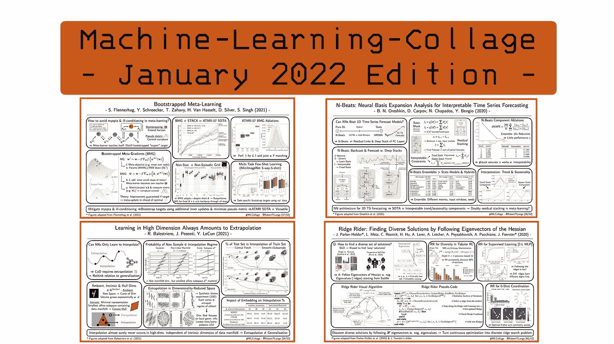
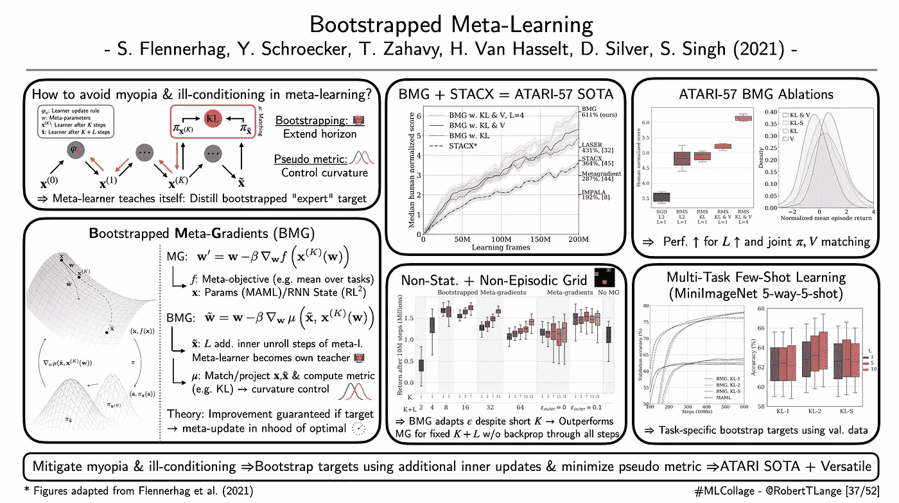
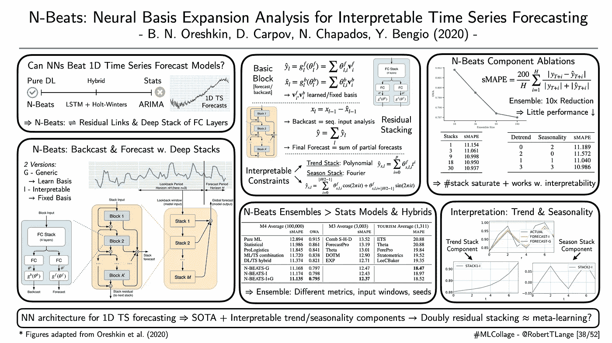

# 2022 年 1 月要读的四篇深度学习论文

> 原文：<https://towardsdatascience.com/four-deep-learning-papers-to-read-in-january-2022-fbe183e6bf6c>

## **从自举元学习到深度学习的时间序列预测，外推&泛化与利用 Ridge Rider 探索多样性最优的关系**

欢迎来到一月份的【T4:机器学习-拼贴】系列，在这里我提供了不同深度学习研究流的概述。那么什么是 ML 拼贴呢？简单地说，我为我最近最喜欢的一篇论文起草了一张幻灯片的视觉摘要。每一周。在月底，所有由此产生的视觉拼贴都被收集在一个摘要博客帖子中。因此，我希望给你一个视觉和直观的深入了解一些最酷的趋势。所以，废话不多说:这里是我最近阅读的四篇最喜欢的论文，以及为什么我认为它们对深度学习的未来很重要。

## **“自举元学习”**

*作者:Flennerhag 等人(2021)* |📝[论文](https://arxiv.org/pdf/2109.04504.pdf)

**一段总结:**元学习算法旨在自动发现归纳偏差，这允许跨许多任务的快速适应。经典的例子包括 MAML 或 rl2。通常，这些系统在双层优化问题上被训练，其中在快速内部循环中，人们仅考虑单个任务实例化。在第二个更慢的外部循环中，系统的权重然后通过在许多这样的单独任务上分批来更新。因此，系统被迫发现并利用任务分布的底层结构。大多数时候，外部更新必须通过内部循环更新过程来传播梯度。这会导致两个问题:如何选择内环的长度？目光短浅允许更容易的优化，同时可能是短视的。此外，元目标可能表现不稳定，遭受消失和爆炸梯度。那么，我们如何克服这种短视的优化困难呢？自举元学习(Bootstrapped meta-learning)提出通过将内部循环运行得更长一点来构建所谓的自举目标。然后，我们可以使用由此产生的网络作为短期学生的老师。类似于 DQNs，引导目标从计算图中分离出来，并简单地作为损失计算中的固定量。因此，我们本质上是向前推动元代理。用于比较专家和学生的度量可以进一步控制元目标的曲率。在一组 toy RL 实验中，作者表明自举可以允许快速探索适应，尽管时间跨度较短，并且它优于时间跨度较长的普通元梯度。与 STACX 元梯度代理一起，自举元梯度提供了一个新的雅达利 SOTA，也可以应用于多任务少镜头学习。总之，这项工作为如何积极地操纵元学习问题公式化打开了许多新的视角。

ML-Collage [37]:作者的数字。|📝[论文](https://arxiv.org/abs/1905.10437)

## **“N-Beats:可解释时间序列预测的神经基础扩展分析”**

*作者:Oreshkin 等人(2020)* |📝[纸张](https://arxiv.org/abs/1905.10437) |🤖[代码](https://github.com/ElementAI/N-BEATS)

**一段话总结:**传统的时间序列预测模型，如 ARIMA，来自金融计量经济学领域，依靠拟合的移动平均线来预测趋势和季节性成分。它们往往只有很少的参数，同时保持清晰的可解释性。最近，混合模型，结合递归神经网络和微分预测已经变得越来越流行。这允许灵活的函数拟合，同时保持更经典方法的归纳偏差。但是，是否也有可能训练有竞争力的预测者，这些预测者基于纯粹的深度学习方法？在 N-Beats 中，作者介绍了一种用于单变量时间序列预测的新网络架构，该架构在 M4 M3&旅游基准上建立了一个新的 SOTA。该体系结构由多个残差块栈组成，它们同时执行预测和回溯。单个堆栈的部分预测被组合成所考虑的时间范围的最终预测。此外，单个块预测的基础可以被学习或固定为合适的和可解释的函数形式。例如，这可以是捕捉趋势的低维多项式或季节性成分的周期性泛函。作者将他们的方法与集成技术相结合，融合了基于不同度量、输入窗口和随机初始化训练的模型。此外，它们还表明，随着更多叠加的增加，性能增益达到饱和，并直观地分析了固定基础叠加预测确实是可解释的。

ML-Collage [38]:作者的数字。|📝[论文](https://arxiv.org/abs/1905.10437)

## **‘高维学习总是等于外推’**

*作者:Balestriero 等人(2021)* |📝[论文](http://arxiv.org/abs/2110.09485) | 🗣 [播客](https://twitter.com/MLStreetTalk/status/1478360446264610821?s=20)

**一段话总结:**神经网络(NNs)只能学习插值吗？Balestriero 等人认为，为了解决高维任务，神经网络必须进行外推。他们的推理依赖于插值的简单定义，也就是说，每当数据点落入观察到的训练数据的凸包中时，就会发生插值。随着原始输入空间的维数线性增长，该空间的体积以指数速率增长。我们人类挣扎于三维空间之外的几何直觉的可视化，但是这种现象通常被称为维度的诅咒。但如果数据位于一个更低维度的流形上呢？那么，是否有可能避开维数灾难，只用几个样本就能获得插值？在一组合成实验中，作者表明，实际上重要的不是流形的原始维度，而是所谓的内在维度，即包含数据流形的最小仿射子空间。他们表明，对于常见的计算机视觉数据集；随着所考虑的输入维数的增加，测试集样本包含在训练集的凸包中的概率迅速降低。作者还强调，这种现象存在于神经网络嵌入或不同的降维技术中。在所有情况下，插值百分比随着更多输入维度的考虑而降低。那么这能告诉我们什么呢？为了使无核武器国家成功地解决一项任务，他们必须在“外推法”制度下运作！但并不是所有的人都像其他人一样一般化。所以这就提出了新的问题，关于外推和更普遍的概括之间的关系。例如，数据扩充和规范化扮演什么角色？

ML-Collage [39]:作者的数字。|📝[论文](http://arxiv.org/abs/2110.09485)

## **“脊骑士:通过遵循黑森的特征向量寻找不同的解决方案”**

*作者:帕克-霍尔德等人(2020)* |📝[论文](https://arxiv.org/abs/2011.06505) | 🗣 [谈话](https://youtu.be/MHz5zG9DDIY?t=2095) |🤖[代码](https://colab.research.google.com/drive/1RTwd7IOgOC7Meky1jCekbyQNG8fu_Stg?usp=sharing)

**一段话总结:**现代深度学习问题往往要处理很多局部最优。梯度下降已被证明偏向于简单的高曲率解。这个问题的经典例子包括计算机视觉中的形状与纹理优化，或者不能推广到新玩家的自我游戏策略。其中优化过程结束的局部最优可能取决于许多任意因素，例如初始化、数据排序或诸如正则化的细节。但是，如果我们不是试图获得一个单一的最优值，而是同时探索一组不同的最优值，那会怎么样呢？脊骑士算法旨在这样做，通过迭代地跟随具有负特征值的 Hessian 的特征向量——所谓的脊。作者证明，只要特征向量沿轨迹平滑变化，这个过程就是局部损失减少的。通过遵循这些不同的脊，脊骑士能够在列表 RL 和 MNIST 分类的上下文中覆盖许多不同的局部最优。作者表明，脊骑士也可以帮助发现最佳零射击协调政策，而不必访问潜在的问题对称性。总之，Rider 将连续优化问题转化为在不同山脊上的离散搜索。它为稳健优化开辟了一个有希望的未来方向。但是在该方法的可扩展性方面还存在许多未解决的问题，包括有效的特征分解和多个特征向量的同时探索。

ML-Collage [40]:作者的数字。|📝[论文](https://arxiv.org/abs/2011.06505)

这是这个月的🤗让我知道你最喜欢的论文是什么。如果你想获得一些每周的 ML 拼贴画输入，查看 Twitter 标签 [#mlcollage](https://twitter.com/hashtag/mlcollage) ，你也可以在最后的摘要中看到更多的拼贴画📖博客帖子:

 [## 2021 年 12 月要读的四篇深度学习论文

### 从感官替代到决策转换器、持续进化策略和敏锐感知最小化

towardsdatascience.com](/four-deep-learning-papers-to-read-in-december-2021-e28f31e6aab4)