# 您可能错过的自动化探索性数据分析的四个 R 包

> 原文：<https://towardsdatascience.com/four-r-packages-for-automated-exploratory-data-analysis-you-might-have-missed-c38b03d4ee16>

## 通过 R 中的实际例子探索有用的工具来简化探索性任务


图片作者。

# 目录

1.  [简介](#2382)
2.  [自动化探索性数据分析包](#0360)
    2.1[Data explorer](#aba1)
    2.2[g gally](#c2a2)
    2.3[SmartEDA](#ecbe)
    2.4[tableone](#1fd6)
3.  [结论](#a887)
4.  [参考文献](#d0b7)

# 1.介绍

**探索性数据分析** **(EDA)** 旨在通过统计和可视化技术总结数据的特征，对数据进行初步调查，这是任何数据科学工作流程中至关重要的早期步骤。

在这篇文章中，我们将探讨四个 R 包，它们有助于完成这个初始任务，并在数据处理、可视化和报告方面提供实质性的支持。

对于这个例子，我们使用由以下特征组成的`Cardiovascular Disease Dataset`:

1.  `id`:患者唯一标识符(int)
2.  `gender`:患者性别(1:女，2:男)
3.  `age`:以天为单位的年龄(整数)
4.  `height`:身高厘米(整数)
5.  `weight`:以千克为单位的重量(浮动)
6.  `ap_hi`:收缩压(int)
7.  `ap_lo`:舒张压(int)
8.  `cholesterol`:胆固醇(1:正常，2:高于正常，3:远高于正常)
9.  `gluc`:葡萄糖(1:正常，2:高于正常，3:远高于正常)
10.  `smoke`:患者是否吸烟(二元)
11.  `alco`:酒精摄入量(二元)
12.  `active`:身体活动(二进制)
13.  `cardio`:有无心血管疾病(二元)

我们加载数据集并观察第一行:


图片作者。

Base R 提供了`summary`，这是一个通用函数，用于从不同的输入对象(如数据集)生成结果概览。特别是，当数据集作为输入(例如`summary(df)`)提供时，它为数字列返回不同的度量(例如平均值、中值、最小值、最大值等)，为分类列返回分布(计数)。它还返回有关丢失数据的信息(如果存在):


总结的输出。图片作者。

现在，让我们跳到提供进一步数据探索功能的包。

# 2.自动化探索性数据分析包

## 2.1 数据浏览器

`DataExplorer`简化并自动化 EDA 流程和报告生成。该软件包自动扫描每个变量，执行数据分析，它提供了几个有用的功能来生成离散和连续特征的不同图表。

重要的是，该包允许通过调用数据集上有用的`create_report`函数(例如`create_report(df)`)来轻松生成**完整的 HTML 报告**。可以传递额外的参数，如响应变量`y`，以将各种双变量分析添加到报告中:

该代码片段在工作目录中生成一个 HTML 文件。当用浏览器打开时，它显示如下:

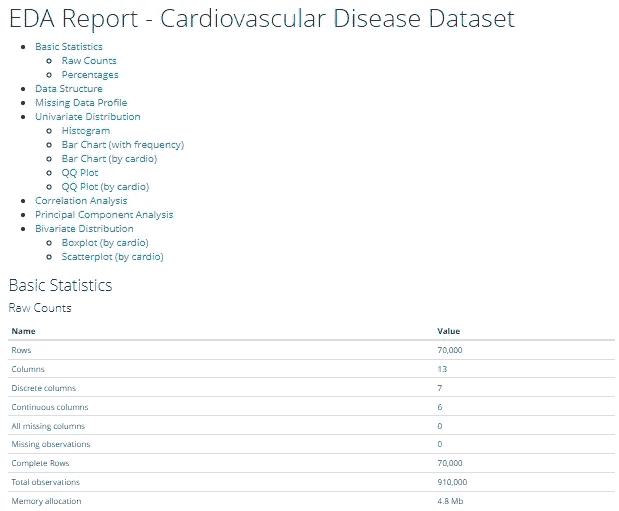

HTML 报告的早期部分，目录的综合。图片作者。

从目录中可以看出，该报告涵盖了 EDA 过程中执行的大部分任务，并且可以由一行代码生成。

特定任务的附加程序包功能报告如下:

*   `plot_str(df)`绘制数据集结构:

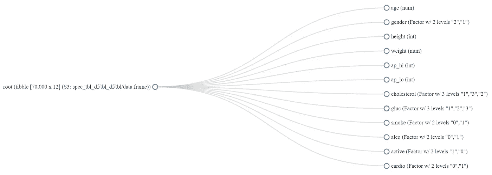

plot_str(df)的输出。图片作者。

*   `plot_bar(df)`绘制每个离散特征的条形图:

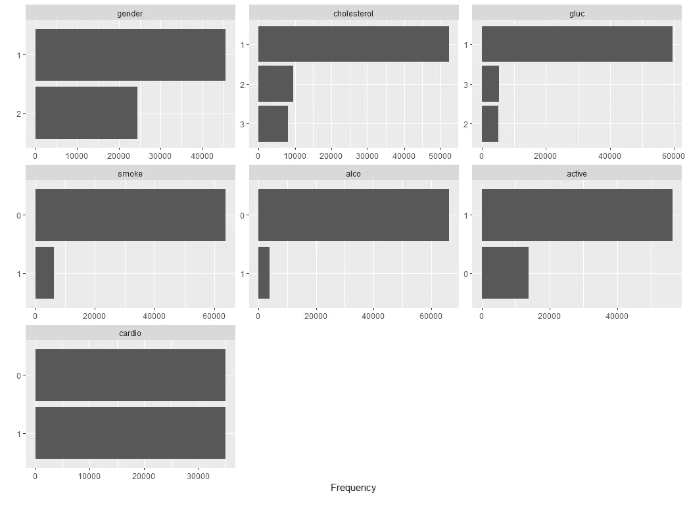

plot_bar 的输出(df)。图片作者。

*   图表也可以通过离散变量分组，例如心血管疾病的存在，通过`plot_bar(df, by="cardio")`:

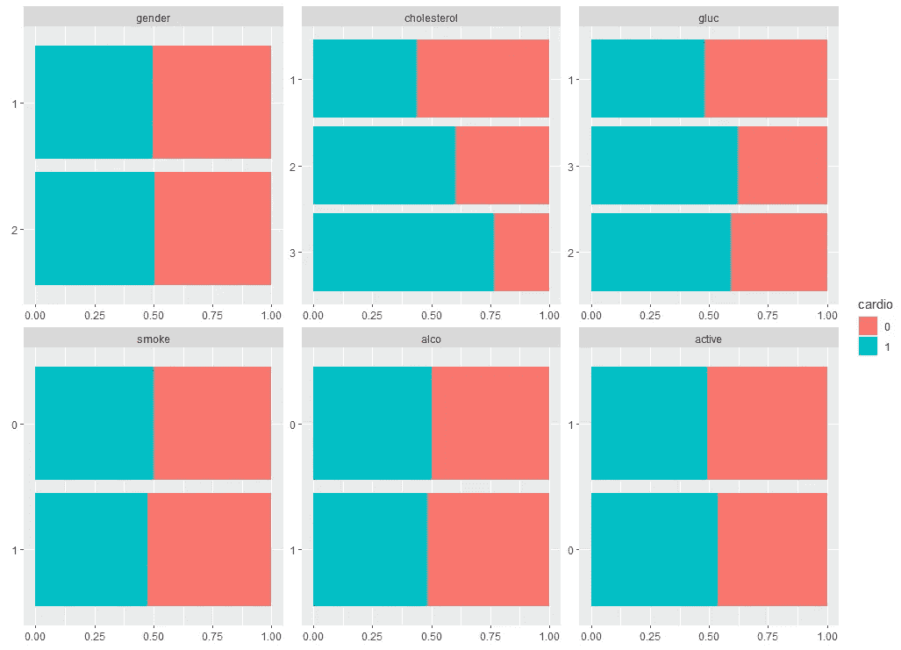

plot_bar 的输出(df，by="cardio ")。图片作者。

通过观察这些图，人们可以立即注意到患有心血管疾病的患者呈现较高的胆固醇值，并且可以被诱导通过统计测试来进一步研究由较高胆固醇所代表的心血管疾病的风险。

*   `plot_qq(df)`绘制每个连续特征的分位数:

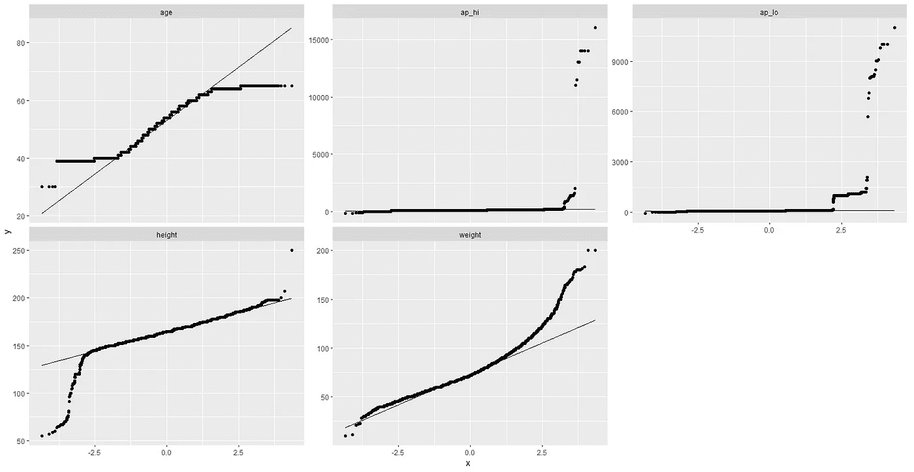

plot_qq(df)的输出。图片作者。

例如，通过观察第一个 QQ 图(年龄)，人们可能会注意到这些点倾向于在极端处弯曲，这表明年龄具有更多的极值，如果它具有正态分布的话(这种行为被称为“*重尾”*)。

*   `plot_density(df)`绘制每个连续特征的密度估计值:


plot_density(df)的输出。图片作者。

*   `plot_correlation(df)`要可视化关联热图:

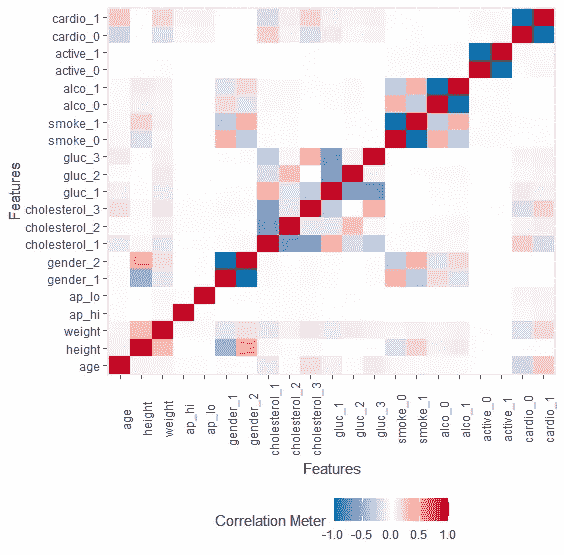

plot_correlation(df)的输出。图片作者。

*   `plot_prcomp(df)`执行主成分分析(PCA ),并绘制每个主成分解释的方差百分比:

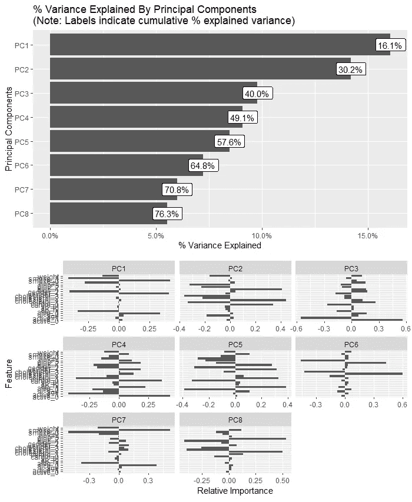

`plot_prcomp(df). Image by author.`的输出

软件包文档包含可用函数的完整列表。

## 2.2 GGally

`GGally` ⁴扩展了流行的`ggplot2`绘图包，提供自动可视化数据集和组合几何对象的功能。

特别地，可以利用数据集上的`ggpairs` ⁵函数(例如`ggpairs(df)`)并获得显示每个变量与每个其他变量的相互作用的成对图:


图片作者。

`ggpairs`提供了一种简单的方法来生成用于描述性分析的图，证明有助于发现异常值、观察分布和直观检查组间差异。

在我们的例子中，为了简单起见，我们选择只为数据集的四个变量生成图(`df %>% select("age", "cholesterol", "height", "weight")`)，并且我们通过`ggplot2`美学(`aes(color = df$cardio, alpha = 0.5)`)基于心血管疾病的存在应用不同的颜色。

通过在下方、上方和对角线 panels⁵.中指定所需的绘图类型，可以进一步定制图表

## 2.3 SmartEDA

`SmartEDA` ⁶是一个强大的工具包，它通过提供以下功能来自动化大多数 EDA 任务:

*   描述统计学
*   数据可视化
*   自定义表格
*   HTML 报告

类似于我们对`DataExplorer`所做的，我们可以通过调用`ExpReport`函数生成一个完整的 HTML 报告。我们可以指定一个响应变量`Target`来包含对报告的进一步双变量分析:

这个代码片段在工作目录中生成一个名为`Report.html`的文件。当用浏览器打开时，它看起来如下:

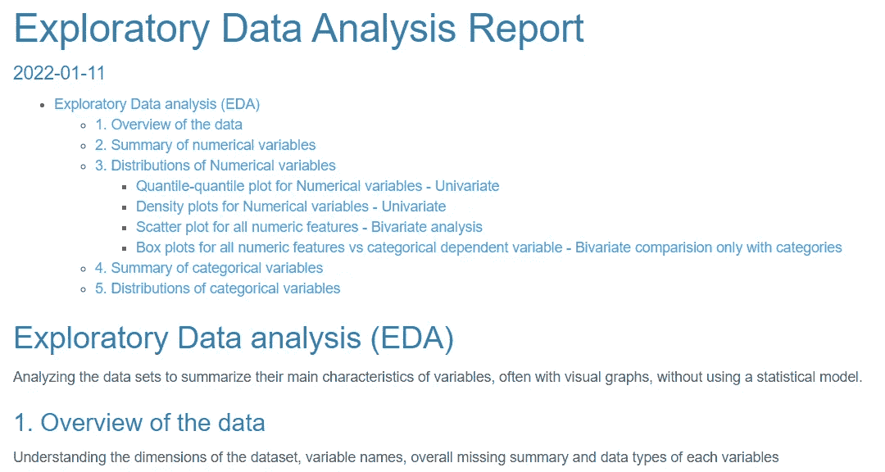

HTML 报告的早期部分，目录的综合。图片作者。

该报告包含一套完整的探索性分析，无需编码即可生成。

特定任务的附加程序包功能报告如下:

*   `ExpData(data=df, type=1)`显示数据集的概览:

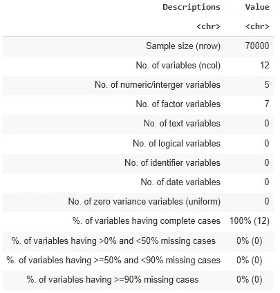

ExpData 的输出(数据=df，类型=1)。图片作者。

*   `ExpData(data=df, type=2)`显示了数据结构:


ExpData 的输出(数据=df，类型=2)。图片作者。

*   `ExpCatStat(df, Target="cardio", Pclass="1", plot=TRUE)`对于基于信息值的可变重要性:

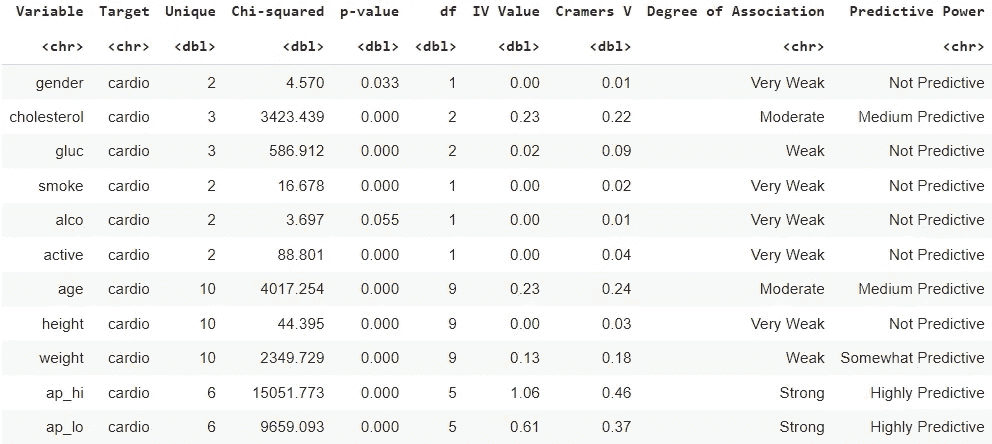

ExpCatStat `(df, Target="cardio", Pclass="1", plot=TRUE)`的输出。图片作者。

从该输出中，我们获得了与心血管疾病(`Target="cardio"`)的每个协变量的**关联度**和**预测能力**的信息。特别是我们可以观察到，收缩压**和舒张压**被归类为心血管疾病的 ***高度预测*** ，而**胆固醇和年龄**则显得是 ***中度预测*** 。该函数还生成每个变量的信息值图:


ExpCatStat `(df, Target="cardio", Pclass="1", plot=TRUE)`的输出。图片作者。

该软件包提供了各种方便的功能来生成图和表。可用函数的完整列表以及示例都可以在 documentation⁷或 GitHub⁶.的软件包中找到

## 2.4 表一

在生物医学期刊论文中，*表 1* 提供了基线患者特征的定量细分。`tableone`包旨在从研究出版物中生成典型的*表 1* (因此得名)。

在使用它之前，我们执行一个可选的预处理步骤，使类别和列名更具可读性:


作者图片

我们现在使用`CreateTableOne`函数来生成一个对象，该对象总结了所有的基线变量，包括连续变量和分类变量，可选地通过一个或多个变量进行分层，并执行统计测试。在我们的案例中，我们通过`strata`论证决定根据心血管疾病的存在进行分层:


打印输出(表一)。图片作者。

从表中可以看出:

*   **分类变量**表示为**计数和百分比**。
*   **连续变量**显示为:
    -在**正态**分布的情况下:**均值和标准差**。
    —**非正态**分布时:**中位数和四分位距**。

该表提供了按心血管疾病分层的基线特征的直接和直观的概述。

通过分别访问`TableOne`对象的`CatTable`和`ContTable`元素，可以只看到分类变量或连续变量。例如:

```
# categorical part only
df$CatTable
```

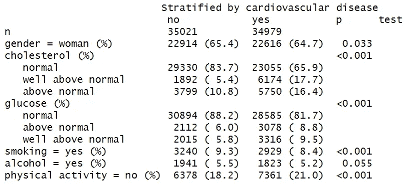

df$CatTable 的输出。图片作者。

# 3.结论

在本文中，我们使用了四个 R 包来完成不同的 EDA 任务，从汇总表到详细的 HTML 报告，并大大简化了对新数据集的探索。

r 提供了几个软件包，这些软件包具有灵活快速地汇总数字和分类数据的特性。我们举几个:`skimr` ⁹、`Hmisc` ⁰、`desctable`、`summarytools`、`dlookr`。

普图恩达等人⁴ (2019)分享了提供 EDA 功能的不同封装之间的深刻比较，以及 CRAN 中可用的封装:

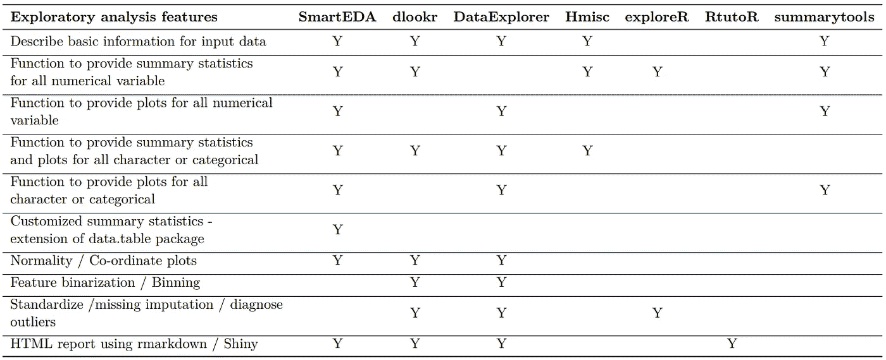

不同 R 封装的 EDA 特性比较。来自⁴的普图恩达等人(2019 年)。

出于好奇，我们可以观察一下去年(2021 年)被引用包的下载次数如下:

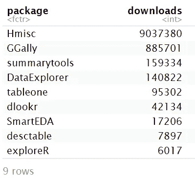

图片作者。

我们还可以观察包的下载趋势:

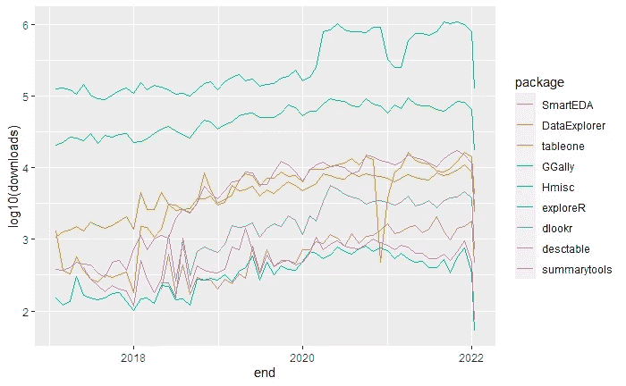

图片作者。

# 4.参考

[1][kaggle.com/sulianova/cardiovascular-disease-dataset](https://www.kaggle.com/sulianova/cardiovascular-disease-dataset)

[2][rdocumentation . org/packages/base/versions/3 . 6 . 2/topics/summary](https://www.rdocumentation.org/packages/base/versions/3.6.2/topics/summary)

[cran.r-project.org/package=DataExplorer](https://cran.r-project.org/package=DataExplorer)

[cran.r-project.org/package=GGally](https://cran.r-project.org/package=GGally)

[5][rdocumentation . org/packages/GGally/versions/1 . 5 . 0/topics/gg pairs](https://www.rdocumentation.org/packages/GGally/versions/1.5.0/topics/ggpairs)

[github.com/daya6489/SmartEDA](https://github.com/daya6489/SmartEDA)

[cran.r-project.org/package=SmartEDA](https://cran.r-project.org/package=SmartEDA)

[cran.r-project.org/package=tableone](https://cran.r-project.org/package=tableone)

[9]cran.r-project.org/package=skimr

[cran.r-project.org/package=Hmisc](https://cran.r-project.org/package=Hmisc)

[cran.r-project.org/package=desctable](https://cran.r-project.org/package=desctable)

[cran.r-project.org/package=summarytools](https://cran.r-project.org/package=summarytools)

[cran.r-project.org/package=dlookr](https://cran.r-project.org/package=dlookr)

[14] Putatunda，Sayan 和 Ubrangala，Dayananda 和 Rama，Kiran 和 Kondapalli，Ravi，“*SmartEDA:a R Package for Automated explorative Data Analysis*”，开源软件杂志，2019 年第 4 卷，[链接](http://dx.doi.org/10.21105/joss.01509)。