# Python 中的四种形参和两种实参

> 原文：<https://towardsdatascience.com/four-types-of-parameters-and-two-types-of-arguments-in-python-357ccfdea3db>


图片来自[皮克斯拜](https://pixabay.com/?utm_source=link-attribution&utm_medium=referral&utm_campaign=image&utm_content=6345331)

## 什么是强制、可选、args、kwargs 参数和位置、关键字参数

不同的编程语言有不同的语法，但函数是他们永远无法回避的概念之一。当我们提到函数或方法时，在大多数情况下，我们会将参数传递给这些函数。

作为最灵活和动态的编程语言之一，Python 对于函数参数的传递有一些特殊的规则。这是为了使开发人员能够以最大的灵活性完成他们的工作。然而，对于新手来说，掌握所有这些标准可能并不容易。

在本文中，我将使用示例来展示所有这些规则，包括强制、可选、关键字和非关键字可变长度参数、位置和关键字参数。

# 0.参数和自变量的定义


图片由 [Gerd Altmann](https://pixabay.com/users/geralt-9301/?utm_source=link-attribution&utm_medium=referral&utm_campaign=image&utm_content=4255411) 从 [Pixabay](https://pixabay.com/?utm_source=link-attribution&utm_medium=referral&utm_campaign=image&utm_content=4255411) 拍摄

我不是一个喜欢记忆概念或定义的人。然而，为了方便起见，澄清一些我们将在本文中大量使用的关键词是很重要的。

当我们说形参和实参时，可能会有些混乱。有些人可能认为他们是一样的。然而，普遍认为它们有如下不同。

*   **参数**是函数定义中的变量。换句话说，它们存在于函数签名中，并将在函数体中用作变量。
*   **参数**是我们调用函数时传递给它的实际值。换句话说，参数可以是整数、字符串或任何对象。

# 1.强制和可选参数


来自[像素库](https://pixabay.com/?utm_source=link-attribution&utm_medium=referral&utm_campaign=image&utm_content=1842149)的[像素](https://pixabay.com/users/pexels-2286921/?utm_source=link-attribution&utm_medium=referral&utm_campaign=image&utm_content=1842149)的图像

在 Python 中，我们可以很容易地定义一个带有强制和可选参数的函数。也就是说，当我们用默认值初始化一个参数时，它就变成可选的了。否则，该参数将是强制性的。

```
def my_func(man1, man2, opt1=0, opt2=''):
    print('man1:', man1)
    print('man2:', man2)
    print('opt1:', opt1)
    print('opt2:', opt2)
```

在上面的例子中，`man1`和`man2`是强制的，因为它们没有在函数定义中初始化。因此，如果我们调用函数而不传递参数，它将抛出一个错误。

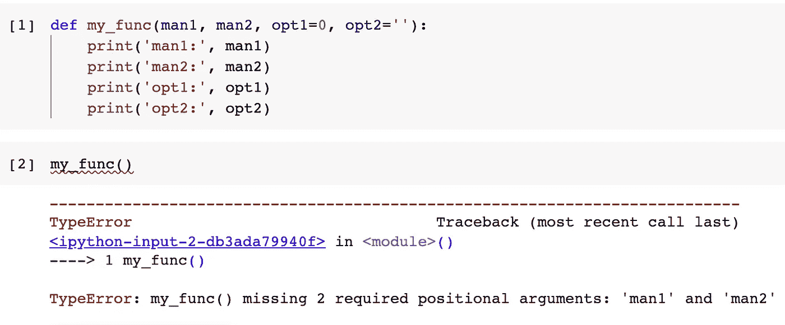

对于可选参数，我们不需要传递任何参数。如果没有，将使用默认值。

```
my_func(man1='a', man2='b')
```

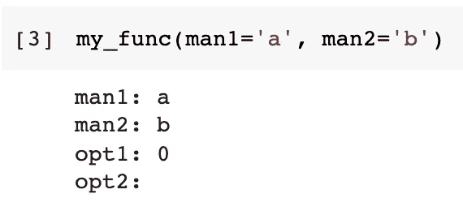

## 1.1 所有的强制参数必须在前面

当我们想定义一个既有强制参数又有可选参数的函数时，所有的强制参数必须在所有的可选参数之前。

```
def my_func(opt1=0, man1, man2, opt2=''):
    print('man1:', man1)
    print('man2:', man2)
    print('opt1:', opt1)
    print('opt2:', opt2)
```

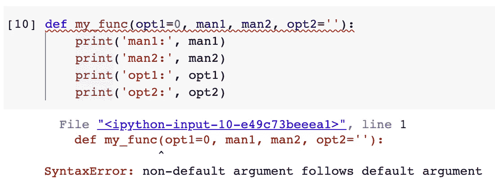

这是因为 Python 允许位置参数，这将在下一节介绍。如果允许像上面那样定义一个函数，当我们传递一个位置参数`a`时，无论是可选参数`opt1`还是强制参数`man1`都会很混乱。根据论据的数量来决定这个太不靠谱了。

# 2.位置参数和关键字参数


图片来自 [Pixabay](https://pixabay.com/?utm_source=link-attribution&utm_medium=referral&utm_campaign=image&utm_content=2979107) 的 [Gino Crescoli](https://pixabay.com/users/absolutvision-6158753/?utm_source=link-attribution&utm_medium=referral&utm_campaign=image&utm_content=2979107)

## 2.1 什么是立场论点？

当我们把参数传递给函数时。我们不必给出参数名，只要我们将参数传递到它们原来的位置。这就是立场论点。

```
# my_func(man1, man2, opt1=0, opt2='')my_func('a', 'b')
```

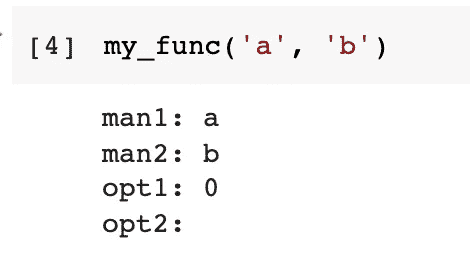

## 2.1 关键字参数不区分位置。

当参数不是位置参数时，它必须是关键字参数。当我们明确地提到一个参数的参数名时，它就变成了一个关键字参数。

虽然我们需要键入更多的单词，但使用关键字参数可能会更方便，因为位置是不敏感的，所以我们不需要关心位置。

```
# my_func(man1, man2, opt1=0, opt2='')my_func(man2='a', man1='b')
```

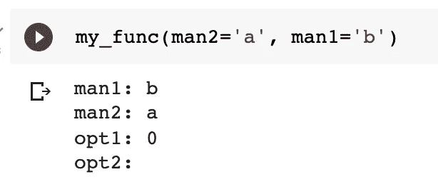

在上面的例子中，我们在`man1`前面经过`man2`。

## 2.2 强制参数和可选参数的位置参数

位置参数不仅仅用于强制参数。只要我们遵循这个位置，它也可以被传递给可选参数。

```
# my_func(man1, man2, opt1=0, opt2='')my_func('a', 'b', 10, 'c')
```

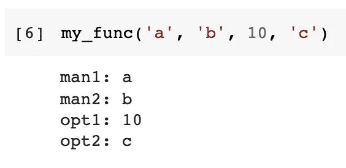

## 2.3 混合位置和关键字参数

我们也可以混合这两种类型的论点。当我们想要使用一个带有几个强制参数但有许多可选参数的函数时，这通常是有效的。

例如，我们可以将两个位置参数传递给两个相应的强制参数，然后通过对第二个可选参数使用关键字参数来跳过第一个可选参数。

```
# my_func(man1, man2, opt1=0, opt2='')my_func('a', 'b', opt2='c')
```


## 2.4 位置参数必须在前面

到目前为止，它非常灵活，对不对？现在，有一个重要的规则。也就是说，所有位置参数必须在所有关键字参数之前。

```
# my_func(man1, man2, opt1=0, opt2='')my_func(man1='a', 'b', 10, opt2='c')
my_func(man1='a', man2='b', opt1=10, 'c')
```

以上两个函数调用无效。


Python 不接受这一点是有道理的。假设我们有四个参数`p1`、`p2`、`p3`和`p4`。

*   如果我们有`a`、`b`和`p4=d`的论点，那么很明显`p1=a`、`p2=b`和`p4=d`。
*   如果我们有参数`p2=b`和`c`，那么参数`c`应该传递给`p1`或`p3`会非常混乱。它需要更多人为的规则来解决这个问题，开发者需要记住它。

## 2.5 强制关键字参数

Python 中有一个技巧，可以强制函数调用使用关键字参数而不是位置参数。我们可以在函数参数列表中添加一个星号，右边的任何参数只能通过关键字实参传递。

```
def my_func(man1, *, man2):
    print(man1)
    print(man2)
```

如果我们试图对它们都使用位置参数，就会出现错误。

```
my_func('a', 'b')
```


但是，如果我们对`man2`使用关键字参数，就不会有任何问题。

```
my_func('a', man2='b')
```


# 3.可变长度参数


图片来自 [Pixabay](https://pixabay.com/?utm_source=link-attribution&utm_medium=referral&utm_campaign=image&utm_content=1453075) 的[鲁迪和](https://pixabay.com/users/skitterphoto-324082/?utm_source=link-attribution&utm_medium=referral&utm_campaign=image&utm_content=1453075)彼得·斯皮特林

在 Python 中，我们可以定义两种长度可变的参数。它们可以被认为是可选参数的特殊类型。换句话说，当我们调用这个函数时，传递给参数的参数数量没有限制。

## 3.1 可变长度参数— *args

当我们要定义一个变长参数时，参数`*arg`就是这样一个语法。

```
def my_func(*args):
    print(args)
```

当我们调用这个函数时，我们可以传递任意多的参数。它们将作为元组在函数中被访问。

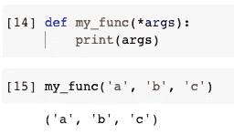

## 3.2 关键字变长参数— **kwargs

另一种类型的可变长度参数是关键字。名称`kwargs`代表关键字参数。

```
def my_func(**kwargs):
    print(kwargs)
```

当我们调用函数并希望将参数传递给`kwargs`参数时，我们需要为每个参数指定键和值。


如示例所示，参数将作为字典接收。

还有一个限制是我们不能使用任何带特殊参数的键。基本上，键必须符合 Python 变量名的语法。


## 3.3 组合关键字和非关键字变长参数

我们可以在函数中使用关键字和非关键字的变长参数。但是，不允许将关键字一放在非关键字一的前面。

```
# invaliddef my_func(**kwargs, *args):
    print(kwargs)
    print(args)
```

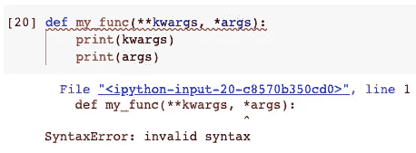

反过来也可以。

```
def my_func(*args, **kwargs):
    print(args)
    print(kwargs)my_func('a', 'b', 'c', name='Chris', age=33)
```


这与我们不能在任何位置参数前有关键字参数的规则非常相似。

## 3.4 可以重命名“*args”和“**kwargs”

我发现有些学习者不知道我们可以改变这两个变长参数名的名称。他们认为这些是 Python 中的保留关键字，并作为语法强制执行。

其实那也不确定。我们可以用他们的任何名字。唯一重要的是对可变长度参数使用单星号，对关键字参数使用双星号。

```
def my_func(*whatever, **does_not_matter):
    print(whatever)
    print(does_not_matter)my_func('a', 'b', 'c', name='Chris', age=33)
```

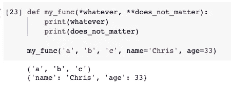

# 4.组合所有类型的参数


图片来自 [Pixabay](https://pixabay.com/?utm_source=link-attribution&utm_medium=referral&utm_campaign=image&utm_content=3655741) 的 [Gundula Vogel](https://pixabay.com/users/guvo59-9285194/?utm_source=link-attribution&utm_medium=referral&utm_campaign=image&utm_content=3655741)

## 4.1 关键字变长参数必须是最后一个

我们可以在一个函数中使用所有 4 种类型的参数。当然，也有一些强制规则。

因为关键字可变长度参数要求我们用关键字传递参数，所以它必须在参数队列的末尾。

```
# Invaliddef my_func(**kwargs, man):
    print(args)
    print(kwargs)def my_func(**kwargs, opt=0):
    print(args)
    print(kwargs)
```

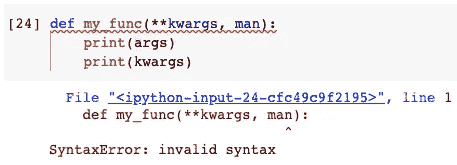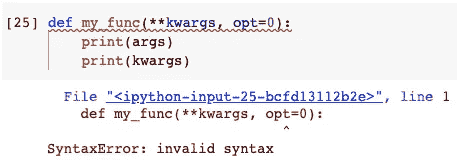

## 4.2 使用所有 4 种类型时的陷阱

当我们在一个函数中使用所有四种类型的参数时，有一个陷阱需要特别小心。

假设我们将函数定义如下。

```
def my_func(man, opt='default', *args, **kwargs):
    print(man)
    print(opt)
    print(args)
    print(kwargs)
```

当我们调用这个函数时，可选参数和变长参数很容易混淆。考虑下面的函数调用。

```
my_func('mandatory value', 'a', 'b', 'c', name='Chris', age=33)
```


值`a`被认为是可选参数的值。在这种情况下，可选参数不再是可选的。如果我们希望将`a`、`b`和`c`都传递给`args`，那么下面的函数调用是有效的。

这个问题可以通过在定义函数时调整参数的位置来解决。

```
def my_func(man, *args, opt='default', **kwargs):
    print(man)
    print(opt)
    print(args)
    print(kwargs)
```

如果我们改变`args`和`opt`的位置，我们可以如下调用函数，使得可选参数仍然是可选的。

```
my_func('mandatory value', 'a', 'b', 'c', name='Chris', age=33)
```

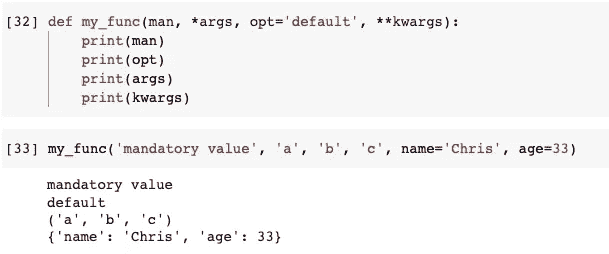

# 摘要


图片来自[皮克斯拜](https://pixabay.com/?utm_source=link-attribution&utm_medium=referral&utm_campaign=image&utm_content=6928973)

在本文中，我介绍了 Python 中所有 4 种类型的参数和 2 种类型的实参。参数是函数中的变量，而实参是调用函数时传递给参数的值。

这些参数可以是强制的，也可以是可选的。对于可选参数，它们可以有不同的长度，可以有也可以没有关键字。变元可以是位置变元，它依赖于用值决定哪个参数的位置。或者，我们可以用关键字显式传递值，这是关键字参数。

<https://medium.com/@qiuyujx/membership>  

如果你觉得我的文章有帮助，请考虑加入 Medium 会员来支持我和成千上万的其他作者！(点击上面的链接)