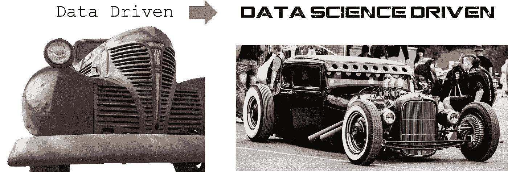

# 从数据驱动到数据科学驱动

> 原文：<https://towardsdatascience.com/from-data-driven-to-data-science-driven-f2db93f83d51>

# 从数据驱动到数据科学驱动

数据科学驱动是新数据驱动的三个原因

作者用 Pixabay 的图片创作的图片(左:Momentmal，右:sick-street-photography)

2010 年，当我还在研究生院攻读学位时，我创办了一家小型咨询公司，出售我的数据分析技能。我网站的口号是“数据驱动”就这样。我知道这是原创，但我试图捕捉 90 年代的潮流。

早在 20 世纪 90 年代和 21 世纪初，企业应该更加“数据驱动”的想法就像野火一样蔓延开来。越来越多的证据表明，创造一种数据驱动的决策文化有助于企业在缺乏数据知识的竞争中脱颖而出，越来越多的企业开始要求他们的领导者具备数据素养。

Gartner 和 Forrester 开始开发评估公司“数据驱动”程度的指标。公司开始收集更多的数据，供应商也在兜售能够自动化数据洞察工作流程的产品，这是领导者真正成为数据驱动型决策者所必需的。

然而，今天，数据驱动开始有点过时了。这个概念让人联想到结构化数据集和预制仪表板的图像。在当今的数字世界中，数据产生的速度如此之快，以至于它们很少能够很好地处理结构或洞察力，而是以杂乱的物联网消息流、网站中的嵌入式信息或文件共享中的大量扫描图像的形式出现。

数据驱动并不是不好，只是在当今的商业环境中不够用，需要改进。为了让大大小小的企业能够更好地应对这些新数据源，从而保持相关性和竞争力，学生、领导者和企业家需要开始培养数据科学驱动的思维模式。

在本文的剩余部分，我提供了 3 个理由，说明为什么我认为数据科学驱动的思维模式是我们用数据思考的下一步发展。

# **超级数字**

早在 21 世纪初，数据驱动意味着你擅长使用数据来为决策提供信息。作为领导者，我们面临的最大挑战是利用数据获取洞察力的速度，这将有助于及时做出业务决策。为了实现这一目标，公司花费了大量资金来收集、组织、清理和自动化数据分析，以便在做出决策之前将信息掌握在正确的人手中。

从那时起，世界变得更加数字化，疫情只是加速了技术专家对全球经济数字化的预测。公司看到近 70%的员工在[疫情](https://www.apollotechnical.com/statistics-on-remote-workers/)的高峰期远程工作。

再加上脸书宣布建造元宇宙，一个大规模多模式的虚拟体验，我们剩下的是工作世界有史以来最大的数据足迹。

不幸的是，对于旧的数据驱动的思维模式来说，这些新的数字信息来源并没有变得更容易解释和分析。事实上，像物联网消息、互联网和保存的虚拟聊天视频这样的数据源在这个巨大的数字信息海洋中更具代表性，因为它们是非结构化的，非常嘈杂。

但亲爱的读者，不要害怕，因为有一个解决方案可以从这些新的数字流中学习，以解开它们隐藏的秘密，并利用它们不断发展的普遍性，这个解决方案就是数据科学。在当今世界，数据科学驱动的思维方式比单纯的数据驱动思维方式更有价值，这至少有 3 个主要原因。

# **原因 1:数据科学随处可见数据**

过去，数据驱动意味着您能够快速使用数据以及时的方式为决策提供信息。这也意味着，当数据进入您的组织时，您可以应用于数据的结构越多，就越容易获得洞察力并做出明智的决策。

不幸的是，当今世界已经高度数字化，产生的许多信息都是嘈杂的、非结构化的信息，这些信息旨在为用户提供体验，而不是为决策者提供决策数据。因此，尽管在当今的商业环境中，许多领导者都懂数据，但许多人都忽略了这些新的数字信息流中包含的潜在价值。

拥有数据科学驱动的思维模式有助于我们摆脱这种限制，因为数据科学的工具和技术允许我们开始假设我们可能如何从这些非结构化的来源中获得结构。自然语言处理的数据科学领域使我们能够使用聚类分析或潜在狄利克雷分配等统计方法来将非结构化源组织成有意义的[组](https://highdemandskills.com/lda-clustering/)。一旦结构化，就可以利用更传统的分析来支持数据驱动的下游决策，或者支持其他面向数据科学的任务。我们可以从网站到结构化数据集，以支持数据驱动的格式访问信息(见图)。

作者图片

# **理由 2:数据科学使我们能够预测、分类和识别数据中的可靠信号**

仅仅使用数据科学来从非结构化来源中构建结构只是数据科学驱动的思维方式能够改善数据驱动的思维方式趋势的一种方式。更传统地说，数据科学还允许我们超越使用数据作为描述过去发生的事情的方式。数据科学使我们能够估计未来可能发生的事情，组织新数据，并为我们提供一种了解信号是否是真正可靠的信号的方法。

因此，那些发展数据科学驱动思维的人也将有更多的选择来了解数据如何在业务中操作。

形成这种思维模式的人可能会看到，分析和构建与特定公司和/或行业相关的新闻警报源可能会预测未来的股票价格。

培养数据科学驱动思维的人可能会理解，如何根据客户通过电子邮件发送的文档过去的发送历史，将这些文档自动发送给相应的响应团队。

那些发展数据科学驱动思维模式的人将会明白，相对于数字空间中的噪音，他们品牌周围的人口统计情绪差异何时是真正有意义的。

# **原因 3:数据科学支持更复杂的业务决策自动化**

第三个也是最后一个原因是，数据科学驱动思维是对数据驱动理念的改进，是前两个原因的延伸。也就是说，了解数据科学的前景和局限性，可以确保领导者意识到业务决策流程可能会受益于更复杂的自动化。自动化允许我们在决策过程中考虑一些不确定性。

数据驱动在很大程度上与基于规则的思维相关联。基于规则的思考看起来有点像这样:如果这个信号是真的，那么就执行这个业务流程，否则就执行另一个流程。

数据科学驱动使我们在决策时更加细致入微。相反，我们认识到，如果对某件事情的真实性有 90%的信心就足以自动做出决定，那么数据科学就给了我们承担这种风险的方法。

# **数据科学如何做到这一切？统计数据**

数据科学及其相关工具和技术能够做到这一切的主要原因与该领域的统计基础有关。统计学允许我们通过在那些信号周围建立噪声模型来在噪声数据中找到信号。然而，大多数领导者并不知道这种努力的价值，因为大多数统计学教授的重点是数学，而不是统计思维能让 https://iase-web.org/documents/papers/icots6/5b1_john.pdf?实现的思维方式 1402524962 。也就是说，传统上统计学没有得到很好的应用。另一方面，数据科学已经取得了如此大的成功，因为它的基础是从应用中诞生的。因此，begin data science driven 进一步鼓励和支持对统计思维的应用理解。

# 结论

所以，最后，我想引用 [Samuel S. Wilks](https://www.jstor.org/stable/2280089?refreqid=excelsior%3Aa975503897e32c8061090fcd4574cfa6) 的一句话，他在 1951 年向美国统计协会发表演讲时解释了赫伯特·乔治·威尔斯的话:

"总有一天，统计思维会像读写能力一样成为高效公民的必要条件！"

虽然我们在对待社会世界的方式上可能没有实现这样的社会进化，但商业世界为我们提供了自己的压力来推动思想的信封。数据驱动的思维减弱；数据科学驱动思维万岁！

比如参与学习数据科学、职业发展或糟糕的商业决策？[加入我](https://www.facebook.com/groups/thinkdatascience)。