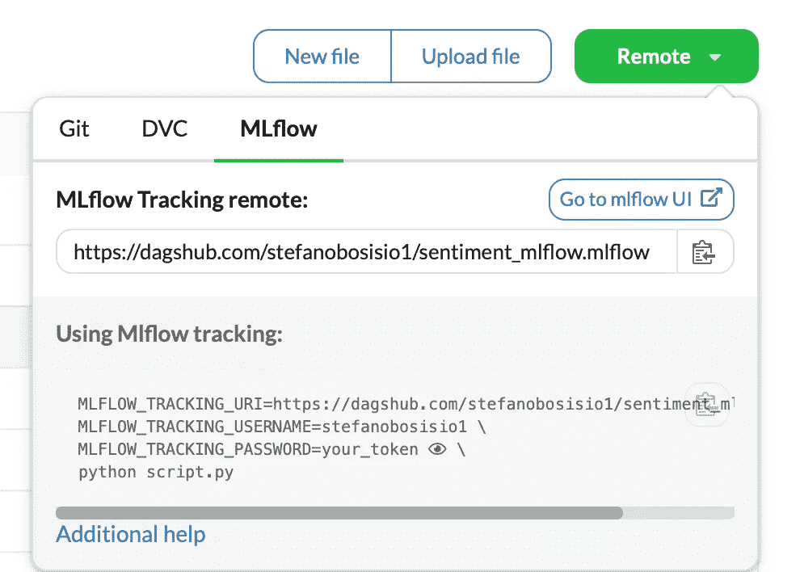
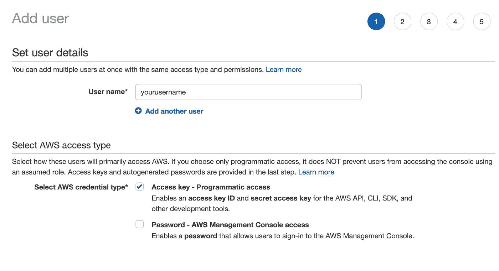
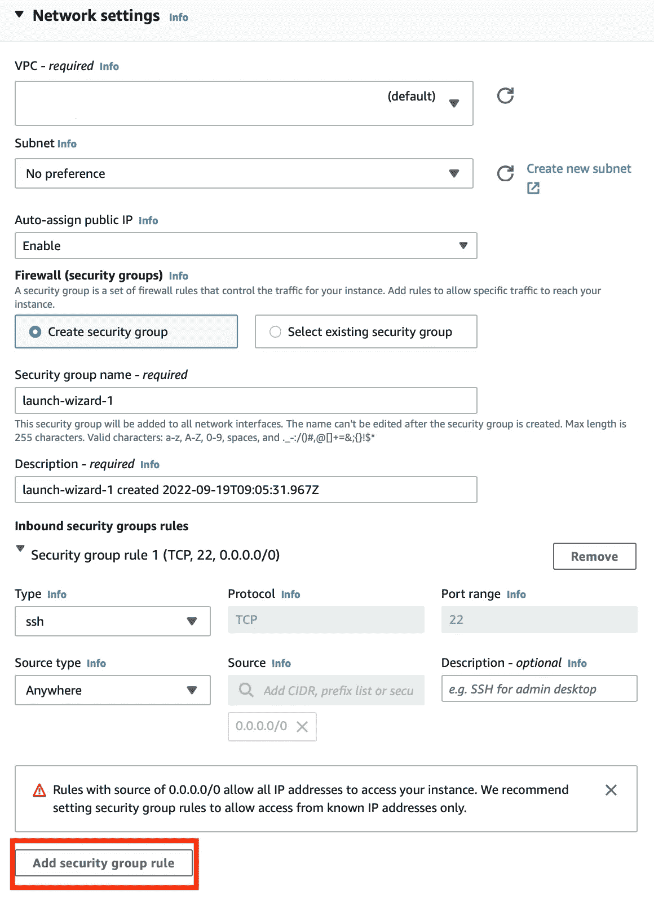
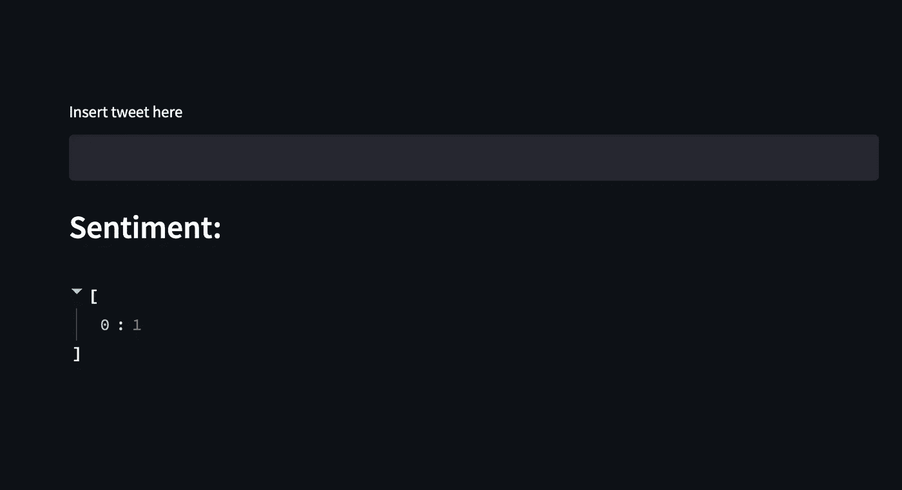
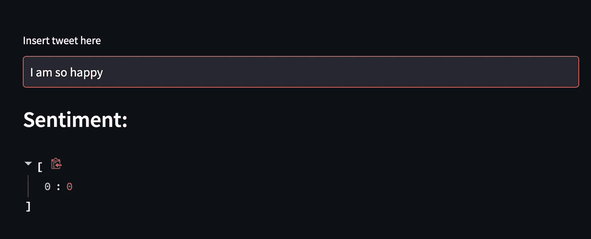

# 从开发到部署:包含 MLflow、SageMaker 和 Streamlit 的端到端情感分类器应用

> 原文：<https://towardsdatascience.com/from-dev-to-deployment-an-end-to-end-sentiment-classifier-app-with-mlflow-sagemaker-and-119043ea4203>

## 在本教程中，我们将从 DagsHub-MLflow 开始构建一个 NLP 应用程序，然后在 SageMaker 和 EC2 中进行部署，前端在 Streamlit 中。


图片由 [Unsplash](https://unsplash.com/photos/dyaxQ-aoGWY) 上的 [Yoann Siloine](https://unsplash.com/@siloine) 拍摄

## 目录

[— 1。设置 DagsHub repo 和需求](#bda8)
—[创建您的 DagsHub rep](#0056)o
—[设置虚拟环境](#dbf5)
—[用 DVC](#b026)
— [2a 下载数据。在 MLflow 中启动您的第一个实验](#f770)
—[朴素贝叶斯模型作为情感分类的骨干](#444b)
—[建立 DagsHub MLflow 并运行实验](#8cb4)
— [2b。做一个更通用的代码来核算不同的型号](#3605)
— [3。在 MLflow 中注册您的模型并部署到 SageMaker 端点](#3306)
—[将模型添加到 MLflow 注册表](#23d6)
—[设置 AWS IAM 角色以从 MLflow](#ee27)
部署— [将您注册的模型部署到 AWS SageMaker](#1d93)
— [4。在 EC2 实例上部署一个 streamlit 应用程序，并通过您的仪表板运行预测](#0d7c)
—[创建一个简单的 Streamlit 仪表板应用程序](#874f)
—[将您的仪表板部署到 EC2 实例](#664d)
— [优点、缺点、局限性、未来要做的工作](#80e5)—
—[结论](#b5e3)
— [支持我的写作](#99f1)

欢迎来到这个关于机器学习的新教程。今天我们将使用以下工具开发一个完整的端到端应用程序，从模型开发到模型部署:DagsHub、MLflow、AWS SageMaker、AWS EC2 和 Streamlit。特别是，我们将使用 DagsHub 作为我们的 GitHub repo，因为它提供了 MLflow 和数据版本控制`dvc`的集成版本。通过这种方式，我们不必在云上设置新的 MLflow 服务器和存储桶，因为一切都已准备好用于我们的新模型实验。

我们将实施情感分类模型，这是我们必须处理的工作的大纲:

1.  我们将探讨如何建立 DagsHub 回购以及我们需要什么要求。
2.  我们将致力于一个 tweet 情感数据集，分析不同的`sklearn`模型，并将在 MLflow 中跟踪它们。
3.  一旦我们学会了如何比较模型，我们将跳到 AWS SageMaker 上的 MLflow 部署端。我们将回顾 IAM 用户和角色以及端点创建
4.  最后，我们将把我们的分类模型包装在一个 Streamlit 应用程序中，托管在一个 EC2 实例上。

# 1.设置 DagsHub 回购和要求

在这里你可以找到我今天要处理的所有相关代码。

## 创建您的 DagsHub repo

图 1:一键创建一个新的 DagsHub repo。

图 1 显示了如何在 DagsHub 中创建一个 repo。只需点击你的个人资料图片旁边的“创建”按钮，然后给回购提供一个名称和描述，你就可以开始了。一旦创建了回购，与 Github 不同的是，您会看到更多的特性。如果你点击“远程”,窗口会显示 DagsHub 提供的 3 种服务:Git、DVC 和 MLflow。

## 设置虚拟环境

对于这个项目，我强烈建议你使用虚拟环境。因此，用以下代码克隆您的 DagsHub 存储库

```
git clone [https://dagshub.com/stefanobosisio1/sentiment_mlflow.git](https://dagshub.com/stefanobosisio1/sentiment_mlflow.git)
```

并创建一个 Python `venv`在你的终端`python -m venv venv`中键入这个命令将创建一个`venv/`文件夹。使用`venv/bin/pip install --upgrade pip`将`pip`升级至最新版本

## 和 DVC 一起下载数据

正如我之前提到的，DagsHub 提供了一个基于`dvc`的数据版本系统——你可以在这里找到更多信息[。简而言之，DVC 是一个出色的 Python 工具，它允许您保持对数据的控制和版本。](https://dvc.org/doc/user-guide)

我们将使用下面的数据。这些是来自 Twitter 的无版权数据，CC0 1.0 许可证，[可从这里](https://paperswithcode.com/dataset/twitter-sentiment-analysis)公开获得。在 Python: `venv/bin/pip install dvc`中安装`dvc`，并使用:`venv/bin/dvc init`在终端`dvc`中的存储库文件夹中初始化

现在你已经准备好克隆`split-data`文件夹了:

```
venv/bin/dvc get https://dagshub.com/nirbarazida/tweet-sentiment-analysis-data split-data/
```

我们已经准备好第一次提交 DagsHub——注意我们是如何使用`dvc`提交的:

```
venv/bin/dvc add split-data
git add .gitignore split-data.dvc 
git commit -m "A NICE MESSAGE FOR COMMIT"
git push origin 
```

# 2a。在 MLflow 中启动您的第一个实验

我们已经准备好处理 MLflow 了。首先，让我们用一个非常简单的朴素贝叶斯分类器为我们的代码创建一个主干，来学习如何构建模型和 MLflow 设置

## 作为情感分类骨干的朴素贝叶斯模型

[在这里你可以找到代码。](https://dagshub.com/stefanobosisio1/sentiment_mlflow/src/main/naivebayes.py)我们将尝试获取整个工作流的精髓，而不是深入数据科学的本质，因此我们将只使用这些文件:`split-data/X_train`和`split-data/y_train`。首先，我们需要预处理我们的数据，并清除它们:

*   停用词，如`and, but, a, an...`
*   标点
*   特殊字符，如标签、标记、换行符或撇号

在 99%的情况下，这是每个 NLP 项目的第一步。因此，我们只需要三个简单的函数:`remove_stopwords`、`remove_punctuation`和`remove_specific_chars`:

图 2:文本清理功能:用 NLTK 删除停用词，用 string 模块删除标点符号，而特定字符删除标签、新行以及撇号。

每个函数接收给定的文本作为输入，并创建一个新的`outline`字符串。此外，在预处理之前，我们要将输入数据帧中的所有字符串小写，如图 3 所示:

图 3:输入文本的预处理和清理。

在设置 MLflow 之前，让我们完成第一个朴素贝叶斯分类器下的工作流(图 4)。在预处理位之后，数据可以分成训练集和验证集。要将字符串转换成数字，需要调用`sklearn`矢量器(如`CountVectorizer`或`TfidfVectorizer`)。矢量化之后，输入数据可以被分类器读取，`MultinominalNB`，我们可以继续进行训练和度量。

图 4:全模型循环。数据被清理，然后分成训练集和验证集。输入字符串用 CountVectorizer 进行矢量化，然后传递给朴素贝叶斯模型进行分类。

## 设置 DagsHub MLflow 并运行实验

要设置 DagsHub MLflow 服务器，我们需要来自 DagsHub 的跟踪 uri、跟踪用户名和密码。为什么？

*   跟踪 uri 是 MLflow 服务器的 url，工件将被报告到该服务器。我们需要这些信息来建立连接
*   DagsHub 需要跟踪用户和密码来验证我们的实验并访问 MLflow 服务器

在您的 repo 中，单击远程按钮，您将找到所有需要的信息，如图 5 所示。



图 5:跟踪 uri、用户名和密码(隐藏)以设置 DagsHub MLflow 跟踪。

您可以将这些信息复制到一个`setup_mlflow.txt`文件中，并在我们的主代码中解析它。然后，图 6 显示了如何在您的代码中设置 MLflow 跟踪，以及 MLflow 如何集成到您的主干代码中——记住[在这里您可以找到完整的代码](https://dagshub.com/stefanobosisio1/sentiment_mlflow/src/main/naivebayes.py)

图 6:模型代码中 MLflow 的设置。

简而言之，这些是 MLflow 用于跟踪实验的关键要素:

*   通过`mlflow.set_tracking_uri(mlflow_tracking_uri)`建立与 MLflow 服务器的连接
*   设置一个实验，如果已经存在`mlflow.create_experiment`和`mlflow_client.get_experiment_by_name`，则检索其`id`
*   用上下文管理器`with mlflow.start_run(...)`开始实验
*   尽可能多地利用[ml flow 自动日志功能](https://gist.github.com/Steboss89/8ba3f007239b4ae982d575e5f04071f0)，比如`mlflow.sklearn.autolog(...)`。自动记录功能使用 Python 模块`inspect`跟踪实验以及为不同“风格”的模型(如`sklearn`、`torch`等)生成的人工制品和物体。)
*   用`mlflow.end_run()`结束你的实验

实验运行后，您可以在 MLflow UI 中可视化指标和工件，可以通过两种方式访问:

*   将`.mlflow`添加到您的 DagsHub 回购协议中(例如【http://dagshub.com/stefanobosisio1/sentiment_mlflow.mlflow】T4
*   或者单击“远程”,并在“MLflow”部分下单击“转到 mlflow UI ”(图 5)

图 7 显示了 MLflow UI 应该是什么样子。通过点击“开始时间”,您将访问关于您的模型的更多信息，比如模型的参数、度量、标签和工件。在 artefacts 框中，您会注意到一个`model`文件夹，它存储由 MLflow 自动生成的文件，以便在预测时调用您的模型，例如 condo 环境、python 需求和二进制文件。所有这些都在两行简单的代码中！


图 7:使用朴素贝叶斯运行第一个测试后的 MLflow UI 示例。

# 2b。编写一个更通用的代码来考虑不同的模型

通常最好的做法是有一个通用的代码，以考虑不同的场景和不同的模型。出于这个原因，我们将把我们的朴素贝叶斯代码发展成一个更通用的代码，在这里我们可以选择不同的单词矢量器，以及不同的模型。在这里你可以找到参考代码

第一件事是将我们所有的预处理函数和模型转换成一个`sklearn`管道:

图 8:使用清理函数和情感分类器返回 sklearn 管道的函数。

在选择了我们想要使用的模型和矢量器之后,`pipeline`就创建好了。`[PreprocessTweets](https://dagshub.com/stefanobosisio1/sentiment_mlflow/src/main/multiple_models.py#L44)`[现在是一个类，它包含了我们在上面](https://dagshub.com/stefanobosisio1/sentiment_mlflow/src/main/multiple_models.py#L44)中创建的所有清理函数。为了设置它，我们需要记住导入`sklearn.base.BaseEstimator`和`sklearn.base.TransformerMixing`，并在类定义中继承这些方法。核心功能在`fit_transform`函数中，其中输入数据帧列`text`被清理并作为`numpy`数组返回，因此它可以被矢量器步骤接收。

第二步是拥有一个解析器功能，例如用`argparse`

图 9: Argparse 处理不同的输入，有一个更通用的接口。

通过这种方式，可以处理不同的模型，扩展代码并并行运行。

图 10:设置 MLflow 参数，直接调用跟踪器，安装管道并保存所有内容。

图 10 显示了概括的最后步骤。给定输入的解析参数，我们现在可以为不同的实验设置 MLflow(例如，一个实验将运行朴素贝叶斯，另一个是逻辑回归，另一个是随机森林)。我们可以用`mlflow.start_run`直接开始跟踪，而不是把所有东西都包在`mlflow`上下文管理器中。请记住，可以同时调用多个自动记录功能，MLflow 将能够记录不同型号口味的产品。最后，运行预测，保存模型并将其报告给 MLflow 服务器。

通过这种方式，您将能够并行地或者用一个简单的 bash 脚本运行多个实验(图 10)。对于本教程，我已经运行了一个朴素贝叶斯模型，一个逻辑回归模型，以及带有`CountVectorizer`和`TfIdfVectorizer`矢量器的随机森林。

图 11:提交多个实验和模型的 bash 脚本示例。

在这个阶段，在 MLflow tracking 中，所有这些模型都在同一个实验系列下，因此您可以对它们进行比较，并决定哪一个是最好的模型——图 12

图 12:在 MLflow 中，您可以立即比较您运行的所有实验，并检查它们的指标和图表。

# 3.在 MLflow 中注册您的模型并部署到 SageMaker 端点

## 向 MLflow 注册表添加模型

每次在 MLflow 中保存模型时，您都会在模型的工件框中看到“注册模型”选项。这个小按钮允许您将当前模型添加到 MLflow 数据库中，该数据库确定哪些模型已注册并准备好用于“试运行”和“生产”环境，以及在模型需要淘汰时用于“归档”。


图 13:带有“注册模型”选项的 MLflow 中的人工制品框。

只需选择性能最佳的型号，并注册到 MLflow 注册表中。如图 14 所示，这种手动操作可以在 Python 中轻松完成。这种方法对于 CI/CD 非常有用。

图 14: Mlflow Python API 允许通过运行 id 在注册表中添加模型。

选择您的模型应该处于的环境，即“暂存”或“生产”。您的模型将有一个来自模型注册中心的类似 uri:`models:/NAME_OF_YOUR_MODEL_IN_THE_REGISTRY/environment`

## 设置要从 MLflow 部署的 AWS IAM 角色

如果你已经准备好了所有的 AWS 角色，你可以跳过这一段，否则请跟我来。

假设你在 AWS 中有一个注册账户，让我们进入 IAM(身份和访问管理)下的 AWS 控制台——同样的操作可以在 Terraform 中完成。在这里，我们可以转到`Users`下，点击`add Users`。选择一个用户名，例如`stefano`，点击`access key`。这将允许您拥有对正确设置至关重要的`aws_access_key_id`和`aws_secret_access_key`。



图 15:创建一个新用户并选择访问密钥凭证类型。

在第二步中，将用户添加到组中。如果你没有 sagemaker 群，创建一个新的群。像`sagemakergroup`一样设置组名，添加两个策略:`AmazonSageMakerFullAccess`和`AmazonEC2ContainerRegistryFullAccess`。这些是授予用户处理 SageMaker 和图像容器的所有权限的关键角色。继续剩余的步骤，最后下载您的凭证 csv 文件——或者记下访问密钥。

接下来，转到“角色”下，单击“创建角色”。在`Trusted Entity Type`中选择`AWS service`，在`Use Cases`下寻找`SageMaker`，选择`Sagemaker — Execution`。继续，最后给角色起个名字(例如`awssagemakerdeployment`)。一旦角色被创建，点击它并在某处复制`arn`——它将类似于`arn:aws:iam::YOUR_AWS_NUMBER:role/awssagemakerdeployment`。我们以后会需要这些信息。

最后，您需要设置 AWS CLI 界面。在您的终端类型`aws configure`中，系统会提示您输入用户访问密钥和秘密访问密钥(包含在下载的 csv 文件中),并添加最适合您的项目的区域(例如，对我来说是`eu-west-1`)和输出格式(例如`json`)。这将为 MLflow 使用正确的用户和权限部署到 SageMaker 准备所有必需的凭证设置。

## 将您注册的模型部署到 AWS SageMaker

我们需要做的第一件事是在 AWS ECR 中创建 MLflow 模型启动器的图像。MLflow model launcher 是您在每个模型的 artefact box 中看到的东西，其中我们有一个模板化的代码，可以检索保存的模型并作为前端接口运行它，以进行预测。要创建这个容器，只需使用`mlflow`并在您的终端中键入:

```
venv/bin/mlflow sagemaker build-and-push-container
```


图 16: MLflow 已在 ECR 中推送 mlflow-pyfunc 映像。

根据您的互联网连接，此命令将在 AWS ECR 上构建和推送基本 MLflow 映像。检索图像 uri，类似于`YOUR_AWS_NUMBER.dkr.ecr.YOUR_REGION.amazonaws.com/mlflow-pyfunc:VERSION_NUMBER`。

从这里开始，您需要一小段代码[，这里是链接](https://dagshub.com/stefanobosisio1/sentiment_mlflow/src/main/register_model.py)，以将您的模型部署到 SageMaker——图 17。

图 17:将注册的 MLflow 模型部署到 SageMaker 端点。

在图 17 的 Python 代码中，我们使用了 create ECR image container uri、model uri——在本例中用于“staging”环境——和`awssagemakerdeployment`的`arn`。部署将需要几分钟时间。前往 SageMaker 推理页面，您将看到新的闪亮端点。请记住:端点是有成本的！所以实验完记得删。在这种情况下，我们使用一个`ml.t2.medium`实例，它是最小和最便宜的。

这样一个端点可以很容易地从这个脚本中进行本地查询:

图 18:给定一条输入 tweet，从部署的 SageMaker 端点运行预测的脚本。


图 19:一旦模型被部署，模型在 Sagemaker 推断端点中是可见的。

# 4.在 EC2 实例上部署 Streamlit 应用程序，并通过您的仪表板运行预测

我们遗漏了什么？一个简单的前端，一个实用的用户界面，通过简单地输入我们的输入 tweet 来查询模型。为此，Streamlit 派上了用场。Streamlit 已经做好了一切准备，可以使用它简单而伟大的 Python 模块[来创建一个伟大的界面，正如你从 Streamlit 图库](https://streamlit.io/gallery)中看到的那样。

我必须承认，我不是 Streamlit 中疯狂花哨设计的超级专家，但是，我知道如何用最少的努力创建一个简单的仪表板，以接收输入 tweet 并返回预测。

## 创建简单的 Streamlit 仪表板应用程序

[仪表板的参考代码可在此处找到。](https://dagshub.com/stefanobosisio1/sentiment_mlflow/src/main/dashboard.py)

首先，安装`streamlit`版本 1.11.0，因为您可能会遇到新版本和 Python > 3.8 的错误:

```
venv/bin/pip install streamlit==1.11.0
```

然后，我们需要一些元素来创建一个紧凑的前端。从图 18 中，我们可以复制`check_status`和`query_endpoint`函数，它们将被用来调用端点。如图 20 所示，这些调用然后围绕 Streamlit 进行包装

图 20:在我们的 Streamlit 应用程序中接收输入 tweet 并返回情感的简单代码。

您可以通过调用`streamlit`在本地测试这段代码，如下所示:

```
venv/bin/streamlit run dashboard.py
```

这将直接在您的浏览器中运行。如果一切正常，您就可以将这个应用程序部署到 EC2 实例了

## 将您的仪表板部署到 EC2 实例

在 AWS 控制台上，转到 EC2 并点击`Launch Instance:`

*   为您的机器选择一个名称。
*   在“应用程序和操作系统映像(亚马逊机器映像)”下，选择 Ubuntu——我用的是 22.04
*   “实例类型”可以是一个`t1.micro`——我们不需要这个应用程序的超级能力
*   在“密钥对”上，单击“创建密钥对”。选择`RSA`和`.pem`格式，并给密钥对命名，例如`StreamlitDeployment`。一个`.pem`文件将被下载到您的本地。
*   “网络设置”:点击“编辑”并向下滚动，直到您可以添加一个“自定义安全组”，如图 21 所示。这里添加一个“自定义 TCP ”,可以访问 Streamlit 使用的端口“8501”。将来源保留为“任何地方”。请注意，对于公司的应用程序，这必须在您的 VPC 内得到保护。



图 21:选择 Add security group rule 为 Streamlit 使用的端口 8501 建立新的 TCP 连接。

保持所有其他设置不变，并创建虚拟机。然后，记下机器的“公共 IPv4 DNS”，其格式类似于`ec2-MACHINE_IP.compute-1.amazonaws.com`。最后，检查机器的“用户名”,点击机器的“实例 ID ”,然后点击“连接”。在这种情况下，机器用户名应该是`ubuntu`。

现在我们可以从本地命令行连接到机器。首先，我们需要对下载的`pem`密钥对文件授予读取权限，然后我们可以使用以下命令对虚拟机进行`ssh`:

```
chmod 400 StreamlitDeployment.pem 
ssh -I "StreamlitDeployment" ubuntu@PUBLIC_IPv4_DNS
```

在前面的段落中检索到了`PUBLIC_IPv4_DNS`。

在虚拟机中，我们需要安装所有缺失的依赖项:

```
sudo apt-get updatewget [https://repo.continuum.io/miniconda/Miniconda3-latest-Linux-x86_64.sh](https://repo.continuum.io/miniconda/Miniconda3-latest-Linux-x86_64.sh) -O ~/miniconda.shbash ~/miniconda.sh -b -p ~/minicondaecho "PATH=$PATH:$HOME/miniconda/bin" >> ~/.bashrcsource ~/.bashrcpip install streamlit
pip install pandas
pip install boto3
```

最后，我们可以将我们创建的`dashboard.py`文件复制到虚拟机:

```
scp -i "StreamlitDeployment.pem" dashboard.py ubuntu@PUBLIC_IPv4_DNS:~/. 
```

以及 AWS 存储在我们笔记本电脑上的`~/.aws`下的`credentials`文件

```
scp -I "StreamlitDeployment.pem" ~/.aws/credentials ubuntu@PUBLIC_IPv4_DNS:~/.aws/.
```

直接从终端，我们可以立即测试 Streamlit 应用程序:

```
streamlit run dashboard.py**You can now view your Streamlit app in your browser.**Network URL: **http://172.31.22.205:8501**External URL: **http://54.146.192.225:8501**
```

如果您连接到`[http://54.146.192.225:8501](http://54.146.192.225:8501,)` [、](http://54.146.192.225:8501,)`External URL`，您将能够与仪表板应用程序进行交互:



图 22:我们创建并从 EC2 实例运行的 Streamlit 应用程序示例。

一切都很好，但我们可以做得更好，利用`TMUX`启动一个流会话，这样我们就可以从虚拟机注销，并在不保持连接的情况下与应用程序交互。让我们安装 TMUX:

```
sudo apt-get tmux
```

并开始流式会话:

```
tmux new -s StreamlitSession
```

现在我们可以自由运行 Streamlit，应用程序将在 tmux 会话中运行:



图 23:仪表板中给出的输入和来自情感分类器的输出结果的例子。

您可以通过按下`Ctrl+B`离开 SSH 外壳，并在旁边按下`D`键。这个组合将使您脱离`tmux`会话，您将能够从 SSH 连接中注销。如果您想停止`tmux`会话，只需重新连接到机器并寻找正在运行的作业的`PID`

```
ps aux | grep streamlit
```

并终止该进程

```
kill PID NUMBER
```

# 优点、缺点、局限性和未来的工作

在这个阶段，我们可以稍微回顾一下整个过程。我们可以立即指出一些优点:

*   Git-DagsHub 接口通过提供一个专用的 MLflow 服务器和存储来减轻我们的负担。这节省了大量时间和麻烦，因为我们不必设置虚拟机或特定的 VPC 权限或基础架构(例如对等)，就可以在我们的所有云工具之间共享 MLflow 系统
*   如果我们是基于 AWS 的 MLflow 提供了一个超级简单的接口来处理我们注册的模型。我们不需要担心创建 docker 文件或特定的 SageMaker 代码

还有一些缺点:

*   我们可能不基于 AWS。在这种情况下，MLflow 为 Azure 部署提供了一个很好的解决方案，但不适用于 Google 云平台。[不久前我曾试图填补这一空白](/spin-up-your-models-in-gcp-ai-platform-with-mlflow-deployment-plugin-c0198077dca1)，但还需要进一步的工作，以在 MLflow 模型注册中心和 GCP 之间建立更无缝的接口
*   如果您想将这个模型升级到 Heroku，DagsHub 目前没有提供任何与这个部署提供者的 CI/CD 接口。因此，您需要创建更多的图像(docker-compose ),让注册的模型和端点接口被 Heroku 包装起来，并作为定制图像托管
*   SageMaker 端点成本！在部署您的超级 ML 模型之前，考虑部署 SageMaker 批量转换作业而不是端点的可能性。[这里是 GitHub 问题请求和到适应该批量转换请求的 MLflow PRs 的链接。](https://github.com/mlflow/mlflow/issues/1472)

因此，我们需要从这个出发点考虑今后的工作。首先，我们可以找到一种合适的方式来填补 MLflow 和其他云提供商(不是 Azure，不是 AWS)之间的差距。额外的帮助可能来自谢顿。Seldon 提供了一个 MLflow 接口来托管和旋转模型——不管 Kubernetes 可能会带来哪些复杂问题。值得一提的是最近的 MLflow 实现[，这是一个新的 mlflow 部署控制器](https://github.com/wianai/mlflow-deployment-controller)，可以在多个云平台上铺平所有的部署道路。请继续关注，因为我将尝试与您分享类似的内容:)

# 结论

这是一个很长的教程，但我想你对最后的结果很满意。我们学到了很多东西，所以让我们来回顾一下:

*   我们学习了如何创建一个简单的模型并将其记录到 MLflow 中，如何向 MLflow 认证，以及跟踪我们的实验。关键要点:实现 MLflow Python bits、身份验证、跟踪概念。
*   我们看到了如何使我们的代码更通用，利用了`sklearn`管道的功能，创建了我们的定制转换器来处理数据，并使它们成为最终训练管道的一部分。
*   我们学习了如何将我们最好的模型部署到 AWS。首先，我们将模型注册到 MLflow registry，然后使用 MLflow sagemaker 部署方案并设置 AWS IAM 角色。
*   最后，我们用 Streamlit 为我们的模型创建了一个前端，并学习了如何设置 EC2 实例来适应这个应用程序。

我希望你喜欢这个教程，并感谢阅读它。

# 支持我的写作

*通过我的推荐链接加入 Medium 来支持我的写作和项目:*

[](https://stefanobosisio1.medium.com/membership) [## 通过我的推荐链接加入 Medium-Stefano Bosisio

### 阅读 Stefano Bosisio(以及媒体上成千上万的其他作家)的每一个故事。为什么支持我？1)关于人工智能的文章…

stefanobosisio1.medium.com](https://stefanobosisio1.medium.com/membership) 

如果有任何问题或意见，请随时给我发电子邮件，地址是:stefanobosisio1@gmail.com，或者直接在 Medium 这里。