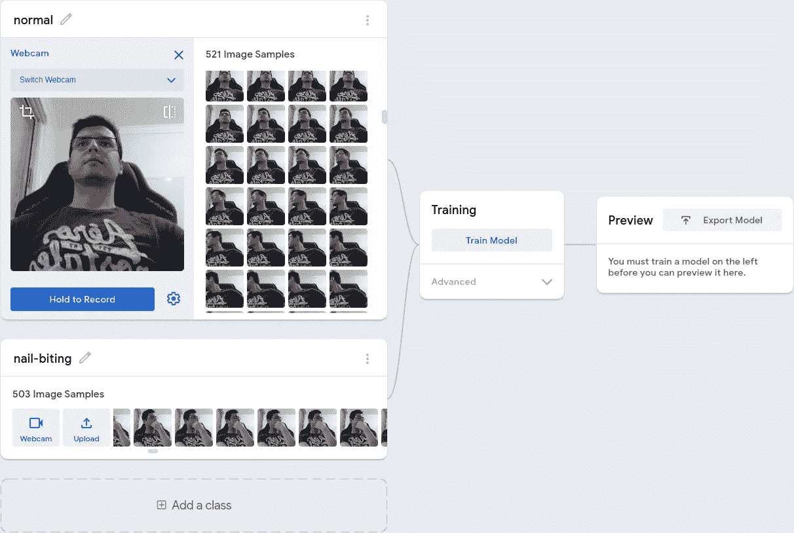
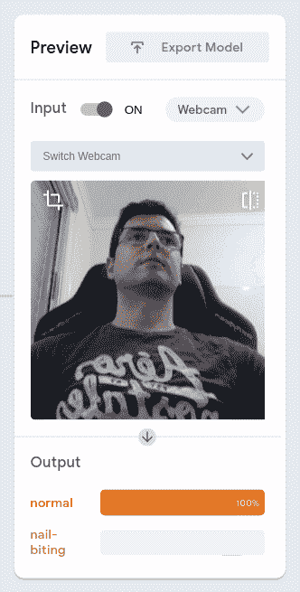
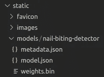
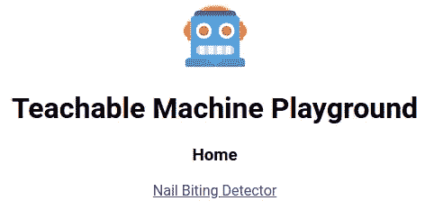
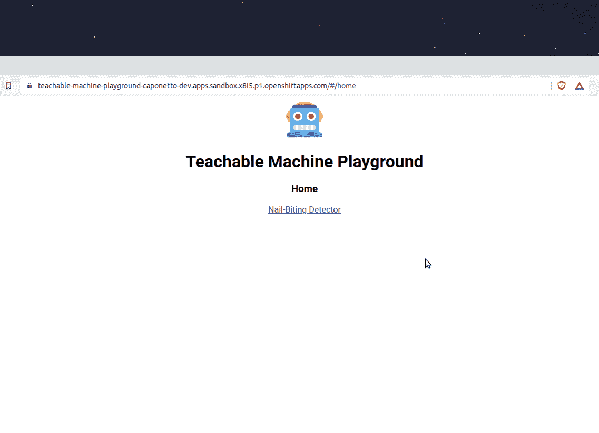

# 从训练到部署:用机器学习停止咬指甲

> 原文：<https://towardsdatascience.com/from-training-to-deployment-stop-biting-your-nails-with-machine-learning-ffed31a59040>

## 了解如何通过几次点击来训练机器学习模型，在简单的 web 应用程序中将其付诸实践，并将其部署到云上与他人共享。

为了完成所有这些，我们将使用 Teachable Machine、ReactJS、GitHub Actions 和开发者沙箱。

照片由[帕特里克·福尔](https://unsplash.com/@patrickian4?utm_source=medium&utm_medium=referral)在 [Unsplash](https://unsplash.com?utm_source=medium&utm_medium=referral) 拍摄

# 介绍

[Teachable Machine](https://teachablemachine.withgoogle.com/) 是一个令人兴奋的工具，它提供了一种简单的方法来训练和测试机器学习模型，而无需该领域的专业知识。数据集可以直接从网络摄像头或麦克风创建，并用于训练图像、声音或姿势分类器。

训练本身是由工具自动完成的，并且在训练完成后可以立即测试生成的模型。如果您对刚刚构建的模型满意，可以将其导出为 Tensorflow 格式，并在应用程序中使用。

这里有一个值得一看的展示可教机器的视频。

现在你已经对可教机器有了更好的了解，我相信你已经绞尽脑汁在想用这样一个神奇的工具可以做的许多应用了。查看[这个资源库](https://github.com/SashiDo/awesome-teachable-machine)，它提供了一个用可教机器建造的项目的精选列表。

因此，我想展示如何使用由可教机器训练的模型来构建一个简单的 web 应用程序。这个应用程序也将被部署到云中，使它成为一个更真实的应用程序，并使您能够与其他人共享它。

别担心，我们只会使用免费的东西。此外，一切都将是客户端的唯一，这意味着没有个人数据将流向服务器。

让我们开始吧！

# 游戏攻略

## 第一步:考虑一个应用程序

我们的应用将是一个*咬指甲探测器*！

该检测器的目的是在用户工作/学习/玩耍等时通过他们的网络摄像头监控用户，并在手指靠近嘴时发出恼人的警报。希望这将把一个不愉快的触发器映射到用户的大脑中，这将使他们在再次向嘴移动手指时三思而行。

由于我们将构建一个 web 应用程序，并将其部署到云中，因此几乎任何带有摄像头和浏览器的设备都可以用来进行这种令人不安的现代监控。然而，重点将放在坐在电脑前的人身上，即面对他们的网络摄像头，这使得我们的模型更容易构建。

我理解有些人努力摆脱这种强迫性习惯，所以让我们试着建立一些可能帮助他人的东西，对吗？！

## 第二步:训练机器学习模型

训练我们的*咬指甲探测器*用可教的机器很容易。

使用网络摄像头，我们需要收集两类图像:(1) *咬指甲*类，由手指靠近嘴的图像表示；(2) *正常*类，由手指离开嘴的图像表示。

因此，一旦您[开始](https://teachablemachine.withgoogle.com/train)使用可示教机器(转到*开始* → *图像项目* → *标准图像模型*)，继续按下录制按钮，直到您每节课获得大约 500 张图像，这对该分类器来说应该绰绰有余。

在收集图像时改变位置(主要是手和脸)以在数据集中创建多样性是很重要的。此外，在 n*normal*类中包括一些没有人在镜头前的图像，只是为了确保模特明白没有人在镜头前意味着一切都很好。你甚至可以创建一个 *nobody* 类！

使用从网络摄像头拍摄的图像构建训练数据集

一旦收集了数据集，就只需要训练和测试模型了。如果结果看起来不错，那么将训练好的模型导出为 Tensorflow.js 格式。输出将是一个 zip 文件，包含两个 JSON 文件(`model.json`和`metadata.json`)和权重(`weights.bin`)。

测试得到的训练模型

> **注意:**请记住，最终的训练模型非常简单，可能最适合在创建数据集时记录的同一个人，并且条件相似。然而，你可以通过更精细的训练来改进它，比如收集更多的数据和调整训练超参数。

## 步骤 3:创建 web 应用程序

我不打算从头开始实现 ReactJS 应用程序，因为这不是本文的目标。相反，我已经为我们的 web 应用程序准备了样板代码。这是一个简单的 ReactJS 应用程序，我称之为*可教机器游乐场*，在这里你可以很容易地添加你的新页面来练习你的新模型。

代码是开源的，可以在 GitHub 库上获得，供你克隆或派生。您将发现一个简单的 ReactJS 应用程序，其中包含一些随时可以使用的组件。脚本和 GitHub 工作流也可以让生活变得更简单。

在继续之前，克隆[库](https://github.com/caponetto/teachable-machine-playground)并构建应用程序。确保已经安装了 [Node.js](https://nodejs.org/) 和 [Yarn](https://yarnpkg.com/) 。您可以简单地在应用程序的根文件夹中运行`yarn install && yarn build:dev`来构建代码。此命令将安装所有尚未安装的依赖项，并在开发模式下构建代码。

现在让我们看看如何向代码中添加一个新的模型。

**3a)添加训练好的模型文件**

解压缩从可示教机器中导出的文件，并将其放在`/static/models`文件夹下的新文件夹中。

在我的例子中，我创建了一个名为`nail-biting-detector` 的文件夹，并将模型文件放在那里。

添加训练好的模型文件

**3b)配置路线**

寻找`Routes.tsx`文件(`/src/app/Routes.tsx`)。您必须分别向与您的新页面路径和模型文件相对应的`nav`和`models`对象添加条目。这些条目将允许您为您的模型创建一个新的路由页面，并使其易于访问模型文件。

在我的例子中，我用`nbd`键添加条目，这是`nail-biting detector`的缩写。当所有步骤完成后，我可以通过`/nail-biting-detector`路径访问我的新页面。

为页面和模型文件创建路线

**3c)设置型号信息**

在将模型文件添加为应用程序的一部分并相应地配置了路线之后，让我们创建一个对象，该对象将包含一些关于模型的有用信息，并使前面的步骤中加载模型变得容易。

查找`Model.tsx`文件(`/src/app/Model.tsx`)并导出一个`ModelDescriptor`常量。在我的例子中，我用与*咬指甲检测器*模型相关的信息添加了`NAIL_BITING_DETECTOR_MODEL`常量。

设置模型信息(仅显示代码的相关部分)

**3d)添加模型页面**

既然路线已经准备好了，您只需要在`/src/pages`文件夹下实现页面的逻辑。我已经准备了一些组件和挂钩，以便于开发使用网络摄像头和火灾通知的页面。

在我的例子中，当检测到类`nail-biting`时，页面`NailBitingDetectorPage`简单地呈现网络摄像头并发出烦人的通知(浏览器和声音)。很简单，是吧？！

> **注意:**实施的通知行为可能因操作系统/浏览器而异。我已经在 Ubuntu/Chrome、Android/Chrome、Windows/Chrome 和 macOS/Safari 上验证过了。

创建 NailBitingDetectorPage(仅显示代码的相关部分)

最后，你需要去`App.tsx` ( `/src/app/App.tsx`)和地图的路线与网页，以便它可以访问。

用 NailBitingDetectorPage 映射路线(只显示代码的相关部分)

**3e)构建并运行**

一旦前面的步骤都完成了，你就可以开始尝试了！

在应用程序的根文件夹中执行`yarn install && yarn build:dev`来构建代码。此命令将安装所有尚未安装的依赖项，并在开发模式下构建代码。

然后执行`yarn start`启动开发服务器，在浏览器中打开 [https://localhost:9001](https://localhost:9001) 。您甚至可以在连接到同一网络的其他设备上加载应用程序，但您需要使用您的 IP 地址，而不是`localhost`。

可教机器游乐场主页

> **注:**每次添加新路线，都会在主页上显示为要导航到的链接。

## 步骤 4:构建并推送容器映像

对于这一步，您必须用`yarn build:prod`构建生产代码，用`yarn build:image`构建容器映像，并将其推送到 quay.io 或 docker hub 等注册中心。

我使用`podman`来构建图像，但是如果你喜欢的话，也可以随意使用`docker`。如果你不使用`podman`，你将不得不对`yarn build:image`脚本(`/package.json`)做一些小的改动。

要自定义映像注册表、名称或标记，您可以在构建映像之前导出以下预定义的环境变量:

`IMAGE_REGISTRY (default value: quay.io/caponetto)`

`IMAGE_NAME (default value: teachable-machine-playground)`

`IMAGE_TAG (default value: latest)`

如您所见，使用默认值将准备一个名为`teachable-machine-playground`的容器图像，该图像将被推送到我的`quay.io`帐户，标签为`latest`，这里的[是可用的](https://quay.io/repository/caponetto/teachable-machine-playground)。

如果您计划将代码推送到您的 GitHub 帐户，我还准备了一个 GitHub 工作流(`/.github/workflows/publish.yml`)，它构建并将容器映像推送到`quay.io`。您只需定制环境变量，并添加 quay.io 密码作为存储库密码(`REGISTRY_PASSWORD`)。

将容器图像推送到 quay.io 的环境变量(仅显示代码的相关部分)

## 步骤 5:将您的 web 应用程序部署到开发人员沙箱中

现在，让我们使用已经发布到 quay.io 的容器映像，在 Red Hat OpenShift 的开发人员沙箱(或简称为开发人员沙箱)上创建一个应用程序。

如果你不熟悉开发者沙盒，这里有一段来自[官方网站](https://developers.redhat.com/developer-sandbox)的引言，它几乎概括了它的所有功能:

> 沙盒在一个共享的多租户 OpenShift 集群中为您提供了一个私有的 OpenShift 环境，该集群预先配置了一组开发人员工具。您可以轻松地从源代码或 docker 文件创建容器，使用提供的示例和堆栈构建新的应用程序，从我们的模板目录添加数据库等服务，部署 Helm charts，等等。

此外，如果您想了解更多，请查看我的一次演讲，我在演讲中展示了如何将开发者沙箱与托管的卡夫卡和 DMN 连接起来。

一旦您登录到您的开发人员沙箱实例，转到`Developer`透视图并单击`Add`。您将看到创建应用程序的各种方法。然后点击`Container images`卡，在表格中填入适当的信息。

您必须提供图像 URL 并确保您的路线在 HTTPS 可用(移动通知仅适用于 HTTPS)。下面的 GIF 详细展示了怎么做。

将容器映像部署到开发人员沙箱

或者，您可以使用我之前提到的 GitHub 工作流(`/.github/workflows/publish.yml`)来部署您的映像。在这种情况下，您必须设置与您的 OpenShift 实例(`OPENSHIFT_SERVER`和`OPENSHIFT_TOKEN`)和名称空间(`OPENSHIFT_NAMESPACE`)相关联的秘密。

> **注意:**来自开发者沙箱的令牌每天到期。

部署到 OpenShift 的环境变量(仅显示相关的代码部分)

一旦这些信息准备就绪，您就可以在触发发布工作流时选择“部署”复选框。除了构建 web 应用程序并将容器映像推送到 quay.io，工作流还将在 OpenShift 实例上部署应用程序。自动化❤

好了，我们快到了！既然已经从容器映像创建了应用程序，那么只需等待几秒钟，应用程序就会启动。一旦准备就绪，您就可以访问和测试您的应用程序了。

测试部署的应用程序

正如你所看到的，当我把手放在嘴边时，浏览器会触发一个桌面通知(部分显示在 GIF 的顶部)。你听不到，但是浏览器也会发出烦人的声音警报。

如果您构建了这个应用程序，并且想要监控您自己，请让这个浏览器窗口保持打开，正常地做您的事情。如果你走神，把手放在嘴附近，你会收到通知。:D

> **重要提示**:同样，如果您打算将该应用程序用作您的个人咬指甲探测器，请确保在专用浏览器窗口中加载该应用程序。只要不最小化应用程序窗口，您就可以正常使用电脑(在应用程序窗口上方打开其他窗口)。如果您最小化浏览器窗口或在同一个浏览器窗口中切换选项卡，网络摄像头将停止拍摄帧。
> 
> **注意**:开发者沙箱可以让你的应用程序运行 8 个小时。过了这段时间，你必须再次扩大规模。

# 结束语

在这篇文章中，我展示了创建包含从机器学习模型派生的功能的 web 应用程序是多么容易。我打算激励人们去思考机器学习模型的适用性，而不是把时间花在编码本身上。这就是为什么我选择了 Teachable Machine 并提供了样板代码(但尽可能保持简单)。

希望您可以运用一些想法，并使用这些工具轻松创建概念证明。如果它们变得适用，那么您可以将更多的时间集中在编码部分(训练一个更高级的模型和构建一个好看的应用程序)。

我会试着想出更多的应用程序，并将它们添加到[库](https://github.com/caponetto/teachable-machine-playground)。此外，拥有桌面版和移动版的 playground 也不错，这样我们就可以拥有操作系统的全部功能。

也许我们可以在打响指、拍手甚至做一些手势时触发设备上的某些东西？你放在抽屉底部的那部旧手机可以变成一个监控管家，对你做的一些手势或声音做出反应！自动化工作并节省时间是很棒的，不是吗？

所以一定要尝试你的想法并分享结果！

> **注意:**如果您发现了任何问题或想要对代码做出贡献，请不要犹豫，提出问题、讨论或请求。你将非常受欢迎！另外，这是我的[个人网站](https://caponetto.dev)，你可以在那里找到我的社交媒体链接来联系我。

今天到此为止。感谢阅读！😃