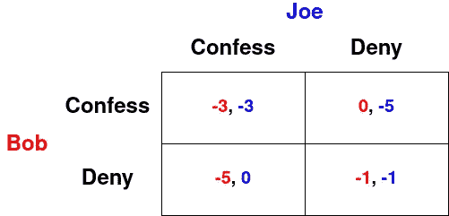
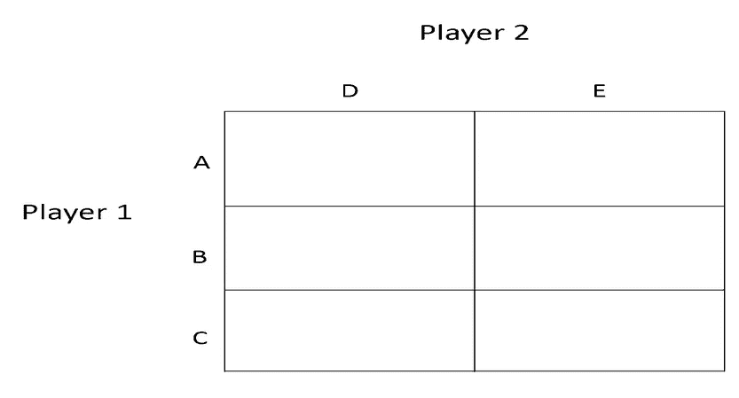
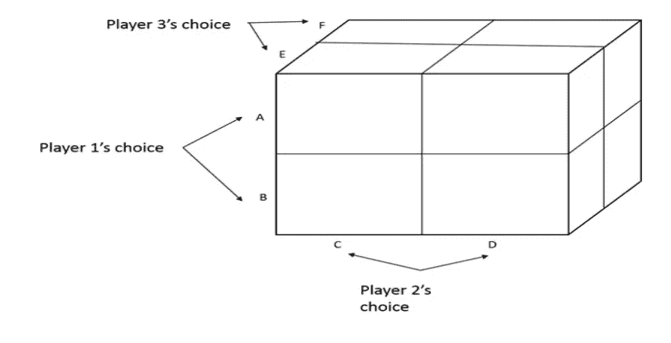
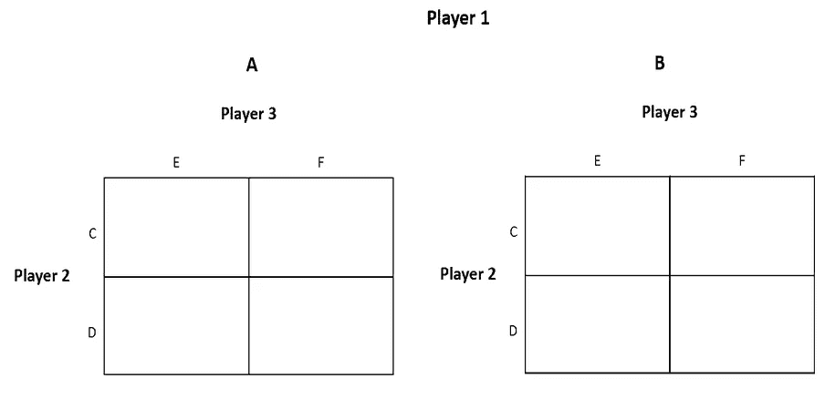

# 数据科学家的博弈论

> 原文：<https://towardsdatascience.com/game-theory-666abe63215e>

## **基础:同时移动游戏&优势可解策略**

[GR Stocks](https://unsplash.com/@grstocks?utm_source=medium&utm_medium=referral) 在 [Unsplash](https://unsplash.com?utm_source=medium&utm_medium=referral) 上拍照

很多人会从学习和/或流行文化中了解到博弈论。电影《美丽心灵》让许多人知道了约翰·纳西和他在这个领域的工作。对于数学家和经济学家来说，博弈论是一个迷人的研究领域，它作为一个研究领域的重要性怎么强调都不为过:53 个诺贝尔经济学奖中有 12 个授予了对博弈论做出贡献的经济学家。

那就是 22%！

我认为这在一定程度上表明了这一研究领域的重要性。虽然数据科学家不需要成为博弈论专家，但我确实认为对博弈论机制的理解是数据科学家工具箱中潜在的有用工具。

***数据科学家可以用博弈论来结构化地分析竞争动态。将博弈论与数据科学和分析相结合可以产生更好的预测，从而产生战略决策的结果，这反过来将为企业、消费者、个人和社会产生更好的结果。博弈论是一个有用的额外概念，数据科学家可以应用它来预测理性的玩家/实体将如何做出决策。帮助分析数据驱动决策问题的主要组件包括:***

*   ***可供选择的选项或选择的集合。***
*   ***基于这些选择的一组结果。***
*   ***对每个结局的估价。***

***博弈论与在动态、互动的环境中解决问题的数据科学家最为相关。这种背景可能是社会的、商业的、政治的、军事的或者完全是其他的。***

***只要上下文涉及 2 个或更多实体之间的战略互动，博弈论就可以帮助数据科学家产生更好的预测模型，并帮助实体做出更好的决策，以最大化战略互动结果的效用。***

一些常见的成功结合博弈论和数据科学的例子包括:

*   Armorway(现在的 Avata Intelligence)数据科学家[开发了一种算法，以提高美国海岸警卫队巡逻队](https://www.rand.org/content/dam/rand/pubs/perspectives/PEA100/PEA150-1/RAND_PEA150-1.pdf)实时事件的效率。因此，美国海岸警卫队将巡逻效率提高了 60%。
*   内特·西尔弗运用博弈论和数据科学来预测选举结果，最著名的是奥巴马竞选

<https://www.theguardian.com/world/2012/nov/17/nate-silver-interview-election-data-statistics>  

# 什么是博弈论？

博弈论试图根据一系列假设，对两个或更多参与者之间的战略互动进行建模。在最简单的层面上，由于大量明显不切实际的假设，博弈论可能会让人觉得非常做作。这种感觉没有错，但是这些人为的假设对于建立基础知识是必要的，在此基础上我们可以在以后建立更真实地代表现实世界战略互动的模型。

本文从最基础的层面开始，旨在为读者提供以下学习成果:

*   完全信息同时移动博弈的定义
*   对游戏关键特征的理解，如**玩家、策略和回报**。
*   识别游戏中的**优势**和**劣势**策略的工具，包括如何应用劣势策略的**迭代删除**以达到战略平衡。
*   理解**纳什均衡**解决方案的概念，以及如何在游戏中找到纳什均衡，包括手动和使用 NashPy 库。

我觉得有必要声明，虽然对博弈论的基础来说不重要，但我相信计算或算法博弈论对于更能代表真实世界的更复杂的游戏来说是必不可少的。因此，我们将很早就开始使用计算，而传统的游戏及其解决方案都是手工完成的。

让我们从一些基本定义开始:

*   “**战略**”是互动的意思。
*   在战略游戏中，不止一个玩家做决定。
*   每个玩家对结果的满意度既取决于他们自己的决定，也取决于其他玩家的决定。
*   一个完全竞争的市场是非战略性的。
*   一个寡头垄断的市场，就像智能手机市场一样，由少数玩家主导。这是战略性的:每个公司决定供应多少和收费多少；产品差异化；玩家有限。

同样的逻辑也适用于**消费者**:

*   非战略性决策的一个例子是消费者支出可能是食品杂货。消费者只需要弄清楚什么样的商品能让他或她开心就行了。
*   另一方面，战略性消费者决策的一个例子可能是**投资**，它不仅受到消费者偏好的影响，还受到诸如该商品的价值是否会随着时间的推移而上升等因素的影响。
*   这些决定受到其他消费者决定的影响，他们可能会问自己类似的问题。

这只是许多例子中的两个。商业世界之外的一些其他例子可能包括:

*   政治活动和平台销售。
*   讨价还价。
*   比赛和竞赛。
*   合作。
*   军事和外交冲突。
*   人际交往。

我们需要考虑的一些关键术语

*   **玩家**以及他们采取行动的顺序。
*   每个玩家都可以使用的**动作**。在参与人 1 可以行动的博弈中，他有什么选择？参与人 2 和游戏中的其他参与人也一样。
*   **收益**:一个衡量每个玩家对游戏每种可能结果的快乐程度的数字。这个数字可以是美元，但不一定要分配一个客观的数字。重要的是，这些数字正确地给玩家的结果排序:较高的数字表示更喜欢的结果，较低的数字表示不太喜欢的结果。
*   一个玩家的**策略**规定了在游戏中他可能采取行动的每一个可能点他会做什么。
*   一个**策略配置文件**是一个策略列表——游戏中的每个玩家一个策略。

# 游戏类型

游戏属于一系列的类别，这取决于它们所代表的战略形势的类型。

## 同时移动博弈与顺序移动博弈

*   在同步博弈中，所有玩家同时决定采取什么行动。
*   单轮石头剪子布可以被建模为同时移动游戏。
*   在顺序移动博弈中，一个玩家必须先做出决定，然后其他人可以在做出决定之前看到这个玩家的选择。
*   国际象棋可以被建模为一个连续移动游戏。

## 一次性游戏与重复游戏

*   在单杆游戏中，**玩家按照描述玩游戏，收集他们的奖金，然后再也不会彼此互动**。游戏一旦结束，就真的结束了。对于任何给定的玩家来说，不需要担心其他玩家将来的惩罚或奖励。
*   **“真正的”一次性游戏在现实世界中很少见**因为人们永远无法完全确定他们再也不会相互交流了。一个相对接近一次性游戏的战略情形是，高速公路上休息站的顾客和员工之间:双方玩家都认为他们不太可能在未来再次相遇。
*   在一个重复的游戏中，**玩家多次按照所描述的方式进行游戏**，因此原则上玩家有可能在明天通过自己的行为来惩罚或奖励其他玩家今天的行为。
*   要被建模为一个重复博弈，战略互动不一定要重复给定的次数。我们所需要的是，这个博弈有可能会重复。
*   许多现实世界的战略互动最好被建模为**重复博弈**。例如(与上述相反)，在办公楼自助餐厅里，员工和顾客之间的互动最好被建模为一个重复游戏:互动双方的参与者都认为他们很有可能会再次相遇。
*   如果所有玩家都知道所有其他玩家的收益函数，那么这个博弈就是一个完全信息的**博弈**。换句话说，如果每个玩家都确切地知道其他玩家对游戏的每一个可能结果会有多高兴，那么这个游戏就是一个完全信息的游戏。
*   完全信息的“真实”游戏在现实世界中很少见，因为很少能完全了解另一个人的偏好。一个接近完全信息博弈的例子是一张 20 美元钞票的拍卖。一个竞标者可以合理地确定，所有其他参与者都乐意为低于 20 美元的任何金额买单，并且他们得到的价格越低就越高兴，如果他们得到的价格正好是 20 美元，他们就保持中立(他们既没有赚钱也没有赔钱)，如果他们得到的价格高于 20 美元，他们就很难过(因此首先可能永远不会出价高于 20 美元)。
*   尽管如此，重要的是要注意到**仅仅因为游戏中的收益可以用一些客观的术语(如美元)来考虑，并不意味着我们可以必然地假设这就是所有玩家关心的**。例如，一个竞标者很可能仅仅从赢得拍卖这一事实中获得满足。在这种情况下，他很可能愿意为一张 20 美元的钞票出价超过 20 美元。
*   如果玩家没有其他支付函数的完整图片，这个博弈就是不完全信息的**博弈**。
*   大多数拍卖可以被认为是不完全信息的博弈。例如，考虑悉尼邦迪一套公寓的拍卖，最终以 200 万美元成交。其他竞标者不知道获胜者对这个结果有多高兴:也许 200 万美元远远低于他/她愿意支付的价格，因此他/她非常满意；也许 200 万美元正是她的最高限额，所以她对这个结果很矛盾。

## 优化:

一般来说，我们将考察战略情境中的**参与者试图做出选择，以获得尽可能让他们富裕的结果**。在我们之前遇到的博弈论术语中:游戏中的玩家试图选择策略**最大化他们的收益**。博弈论以数学的方式对这些选择进行建模，将一个给定玩家的收益表达为他自己以及其他玩家行为的函数。因此，我们需要一种方法来选择行动(由我们的问题玩家),使他的收益最大化。为此，我们需要一种叫做最优化的数学方法。

## 派生物

我们试图最大化的许多功能将具有以下“山丘”形状:

对于博弈论的大多数商业应用，我们希望最大化某样东西(也许是利润)或者最小化某样东西(也许是成本)。一个简单的表示可能是一个 sad 二次型的利润函数，它的最大值是导数= 0 的点。(来源:作者)

制作这个图非常简单:

这在 python 中建模相当简单。(来源:作者)

如果 x 是参与人的行动，F(x)是该行动的结果，选择最佳可用策略意味着选择使 F(x)最大化的 x 值。当我们的收益函数 F(x)有上面的形状时，这将是 x 值

用直观的术语来说，这是因为导数测量的是 F(x)的变化率，其中 x 的变化非常小。如果函数在某个特定的 x 值处增加，则该 x 值不是使函数最大化的值:通过增加 x 可以获得更高的 F(x)。如果函数在某个特定的 x 值处减少， x 值不是使函数最大化的值:通过减小 x 可以得到更高的值。只有当函数在 x 中既不增加也不减少时，该值才能是最大值，当导数为零时，函数既不增加也不减少。

**警告一句**:这个推理只适用于上述形状的函数:sad 二次函数。更一般来说，0 的导数不仅出现在最大值，而且最大值的导数可能是正的，也可能是负的。现在我们将只坚持悲伤的二次曲线，因为这简化了事情。

## **优化示例:**

假设一个游戏中的玩家(姑且称他为玩家 1)试图选择他的策略(我们称之为 **x1** )来最大化他的收益。但既然这是一个策略情况，参与人 1 的收益不仅仅取决于他自己的策略，还取决于博弈中另一个参与人的策略，参与人 2 的策略选择我们标为 **x2** 。因此，参与人 1 的收益将是一个依赖于和的函数。

# 囚徒困境

这是博弈论的一个经典例子，被用来

*   介绍表示同时移动游戏的方法
*   解决这类游戏的一种方法。

文森特·奈特关于经典囚徒困境的 YouTube 视频。提到这一点似乎是合适的，因为我们正在使用他的 nashpy 库(来源:文森特·奈特的 youtube 频道【https://www.youtube.com/watch?v=qcQMeiUnfVQ)

假设两个小偷，鲍勃和乔，被警察抓住并被分开审问。如果两个小偷合作，不泄露任何信息，他们将各获得一年的短期徒刑。如果一个人坦白，他将得到一笔交易，而另一个小偷将被判 5 年的长期徒刑。如果他们都坦白，他们都会被判三年中等刑期。

经典的囚徒困境(来源:作者)

假设两个囚犯都明白游戏的本质，彼此没有忠诚，在游戏之外也不会有报应或奖励的机会。不管对方怎么决定，每个囚犯都通过背叛对方(“坦白”)获得更高的奖励。推理包括分析两个玩家的最佳反应:

*   鲍勃要么否认，要么承认。如果鲍勃否认，乔应该坦白，因为获得自由比服刑一年要好。
*   如果鲍勃坦白，乔也应该坦白，因为服刑 3 年总比服刑 5 年好。所以不管怎样，乔应该坦白，因为不管鲍勃的策略是什么，坦白都是乔的最佳对策。平行推理会表明鲍勃应该坦白。

因为不管其他玩家的选择如何，坦白总是比合作带来更好的收益，所以这对乔和鲍勃来说都是一个**严格优势策略**。相互坦白是博弈中唯一的**强纳什均衡**(也就是说，唯一的结果是每个参与者通过单方面改变策略只会变得更糟)。因此，两难之处在于，相互否认比相互背叛产生更好的结果，但这不是理性的结果，因为从自利的角度来看，否认的选择是不理性的。因此，囚徒困境是一个纳什均衡不是帕累托有效的博弈。

## 报偿

关于收益的一个提示:我经常看到人们对囚徒困境得出错误的结论，并认为否认，否认是纳什均衡。我认为这是对收益误解的结果。这个博弈中的收益可以表示为

*   潜在刑期的年数，在这种情况下收益是负的。这应该是直观的，因为 10 年徒刑显然不如 1 年徒刑有吸引力。
*   代表玩家相对偏好的任意数字，在这种情况下，较高的正数对应较低的句子。

在任何一种情况下，结果都是一样的:严格优势策略是两个囚犯都坦白，因为任何一方都没有动力偏离这个策略*(注意，这可能会在连续博弈中发生变化……)。Nashpy 库对游戏建模很有用:*

用 nashpy 建模的经典囚徒困境(代码源:作者，包源: )

上面代码的输出(来源:作者)

## 支付矩阵

收益矩阵是一种便捷的方式来表示定义同时移动游戏的所有信息——玩家**、**策略**和**收益**。因为我们会在整个课程中用它来表示这类博弈，这里有一些收益矩阵的性质:**

*   行玩家为他的每个策略得到一个单独的行。因此，在一个博弈中，参与人 1(横列参与人)有 3 个策略，参与人 2(纵列参与人)有 2 个策略，这个博弈可能是这样的:

行玩家有 3 个策略，列玩家有 2 个策略(来源:作者)

如果有 2 个以上的玩家呢？在这种情况下，我们需要 3 个维度来表示收益矩阵，就像这样:

3 个玩家的收益矩阵(来源:作者)

为了使这个三维收益矩阵更易处理(并给我们空间来写所有的收益)，这样的矩阵通常被一分为二，以便能够以二维表示:

三个玩家的收益矩阵(来源:作者)

最后，在完全信息博弈中，参与者不仅完全知道自己的收益，也完全知道博弈中所有其他参与者的收益。所以像囚徒困境这样的完全信息博弈的所有参与者都知道整个收益矩阵(包括所有收益)。

## 收益，最佳对策和收益矩阵

按照惯例，收益矩阵中的收益是这样写的，首先列出行参与者的收益，然后列出列参与者的收益。如果有两个以上的球员，季后赛名单将包含 3 个元素，像这样:(x，y，z)。

给定玩家的**最佳反应函数**是一个函数，它将游戏中所有其他玩家的*策略作为自变量，并产生一个输出，即在所有其他玩家都采用指定策略的情况下，使玩家 I 的收益最大化的策略。*

所以，在囚徒困境中，“如果乔希望鲍勃坦白，他也应该坦白”的正式说法是:

乔的最佳对策

这里“BR”代表“最佳反应”，下标“J”表示这是乔的最佳反应函数。

在收益矩阵中跟踪最佳回应的一个有用方法是强调与最佳回应相关的收益，如视频中所示。也就是说，在确定某个一般参与人 I 的最佳对策时，我们可以固定所有其他参与人的策略组合，然后确定参与人 I 的哪个策略给他的收益最高。一旦这个过程被博弈中所有其他参与人的所有可能的策略组合重复，我们就完全刻画了参与人 I 的最佳反应函数。

最后我们介绍了术语**对称博弈:** *如果一个人可以在不改变博弈的情况下改变参与者的身份，那么这个博弈就是对称的。*

在两人博弈的情况下，就像囚徒困境，这意味着我们可以翻转谁是行中人，谁是列中人，不改变收益，改变后仍然代表同一个博弈。

例如，如果 Joe 的犯罪记录比 bob 长，那么他可能会被判处比 Bob 更多的刑期。会在同样的情况下。这将使游戏不对称。类似地，如果鲍勃关心乔，不想让他进监狱(而乔对鲍勃没有这种善意的感情)，鲍勃的收益将不同于乔在相同情况下的收益，博弈将是不对称的。

## 主导策略

我们也遇到过术语**优势策略:** *如果对于一个给定的玩家，有一个策略比他可以选择的任何其他策略给他更高的收益，不管其他玩家选择什么策略组合，那么这个策略就是玩家的优势策略。*

更正式的说法是，如果一个参与者的最佳反应函数对于任何可能的参数组合都有相同的输出，那么他就有一个优势策略(在这种情况下，他的优势策略就是输出)。

不太正式的说法是，**如果不管其他玩家做什么，一个玩家的某个行动总是比其他所有行动都好，那么这个玩家就拥有优势策略**。

如果有一种策略对一个玩家来说是“总是最好的”，那么对理性行为的合理预期就是他会一直使用这种策略。如果游戏中的每个玩家都有一个优势策略，那么这种逻辑可以将我们预期在游戏中发生的事情缩小到只有一个策略配置文件:也就是说，我们有一个策略列表(每个玩家一个)对应于我们认为可能的结果。

当一个玩家有一个优势策略时，这个博弈有一个优势策略的均衡:即。每个参与人都有自己的优势策略。囚徒困境就是这样一个游戏。

## 现实世界的囚犯困境

囚徒困境不仅仅是关于囚徒的。它也是一种代表许多现实生活情况的寓言。使战略局势成为囚徒困境的关键属性是，每个参与者都有一个优势战略——这种行动总是最好的，因此很难被认为是合理的选择——但所有参与者选择优势战略的结果是，双方最终都比他们选择不同的情况更糟糕。在占优策略均衡中，两人都要在监狱里度过 8 年，而如果他们都否认的话，他们可能只服刑 1 年。

**例 1:军备竞赛**

考虑两个强国争夺全球影响力的地缘政治背景，就像美国和苏联在冷战期间的情况一样。如果双方面临的选择是是否积累武器和军事能力，那么可以认为这样做是一种优势战略。

如果其他国家没有积累，你可以这样做，并最终决定性地占上风。如果另一个国家正在积累，那么你最好也这样做，否则会被认为是软弱的，被你的对手攻击。

结果是一场军备竞赛。

如果两个国家以大致相同的速度积累武器，任何一方都不会相对于另一方获得相对优势，因此他们都花费了资源，最终达到了他们之前的水平。

**例 2:体育运动中的兴奋剂**

通过与上述类似的推理，可以认为对于某些运动中的竞技运动员来说，服用提高成绩的药物(PED 氏症)是一种占优势的策略。

*   如果你的对手都没有服用，那么你自己服用兴奋剂几乎可以保证获胜。
*   如果你的所有对手都服用兴奋剂，那么你自己服用兴奋剂是保持竞争力的唯一方法。
*   如果所有运动员都服用兴奋剂，那么没有人会相对于其他人获得相对优势。

## 关于“合理性”的一点注记

我们在博弈论中假设每个参与者都寻求最大化自己的收益(这叫做理性)。这个假设有多合理？如果玩家是:

*   **利他主义**:关心其他玩家的收益，以及他们的收益有多高。
*   **嫉妒**:关心其他玩家的收益，希望他们的收益比自己的低。
*   平等主义者:希望所有的收益尽可能平等。

如果我们想反映这些偏好，我们可以相应地修改玩家的收益。例如，如果我们的一个囚犯非常在意不把另一个送进监狱，我们可以通过减少他认罪而另一个否认的结果来表示。

或者，如果一项运动中有很大比例的运动员宁愿不使用 ped 而输，也不愿使用 ped 而赢，那么这种战略情况可能不是囚徒困境。理性假设指出，玩家寻求最大化他们的收益，但没有限制或假设是什么决定了这些收益。

# 结论:

*   一个玩家有一个占优策略，如果这个策略给他们的收益比他们能做的任何事情都高，不管其他玩家在做什么。如果一个玩家有一个优势策略，期待他们使用它。