# 使用计算机视觉目标检测的垃圾路线优化

> 原文：<https://towardsdatascience.com/garbage-route-optimization-using-computer-vision-object-detection-17a217d5582d>

## [变更数据](https://towardsdatascience.com/tagged/data-for-change)

# 使用计算机视觉目标检测的垃圾路线优化

## 由我 10 岁的女儿 Isabella 合著，她的科学展项目变成了她的第一个动手机器学习项目

以下是我女儿五年级科学展期末报告的编辑版本。我们在一起工作了两个月，每次几个周末。就我个人而言，这是一个*非常*有益的机会来教她(我所知甚少)计算机视觉和 Python 编码。

从她执行第一个 Colab cell `2+2`的那一刻起，她就被迷住了——只看到它演变成一个完全成熟的系统，可以检测图像中的垃圾:

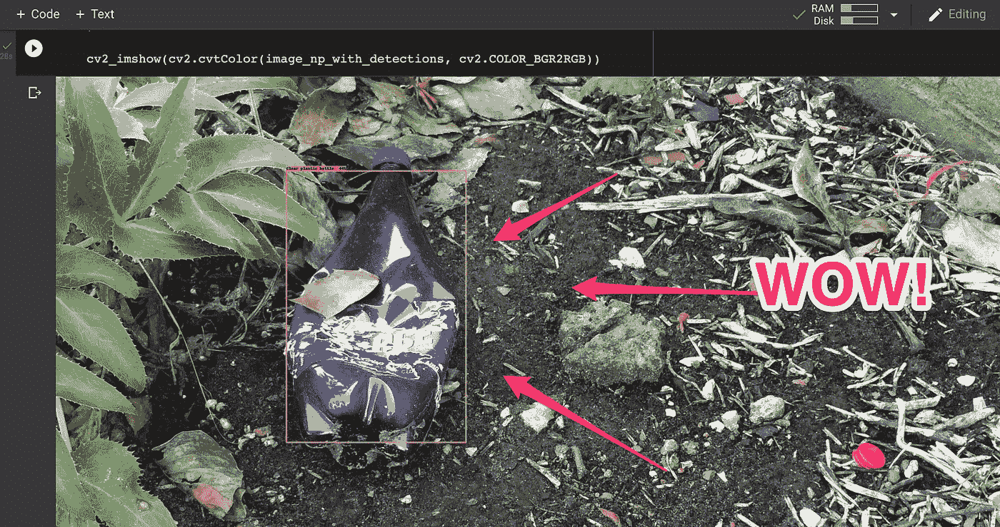

我女儿对我们第一个经过训练的模型在验证集图像中识别垃圾的最初反应。【图片由作者提供。]

我期待着与下一代人工智能工程师合作更多的项目！

## 问题动机

我对我在我的城市里看到的垃圾数量感到困扰。保持街道清洁很重要，因为垃圾会渗入我们的土壤和水源。这种环境影响对我们的健康是可怕的——更不用说动植物了。似乎这还不够，我们自然景观的美丽被垃圾大大削弱了。

为了提高对这一问题的认识，我假设市议会需要良好的数据来(1)确认问题存在于他们的地区，以及(2)确定哪些地区最需要垃圾收集资源。为了解决这个问题，我设想了一种安装在城市车辆(警车、垃圾车等)上的摄像机。)在车辆执行其日常公民职责时被动地收集视频数据。然后，摄像头数据由计算机视觉系统处理，该系统可以自动检测摄像头视野中的垃圾。最后，我设想向市议会提供一个数据产品(比如热图)。

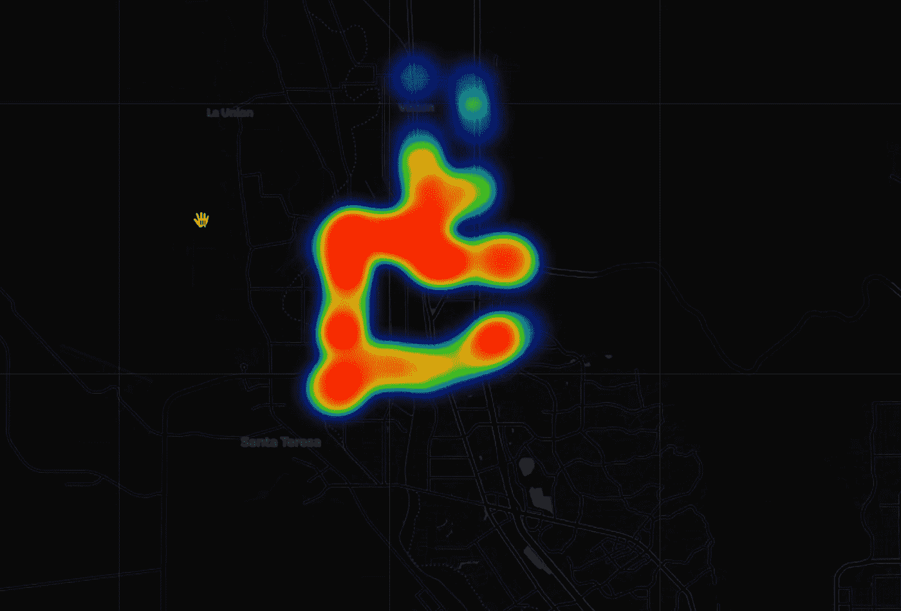

德克萨斯州埃尔帕索垃圾检测热图。【图片由作者提供。]

有了这样一个系统，我相信城市会对最需要帮助的地区采取有针对性的行动。

## 蓝图

我开始我的项目时，头脑风暴了这个问题的多种解决方案。在一个解决方案中，我设想了一个简单的、非技术性的实现:

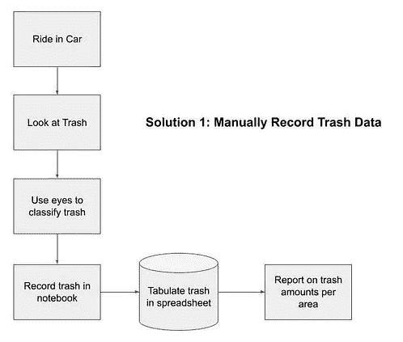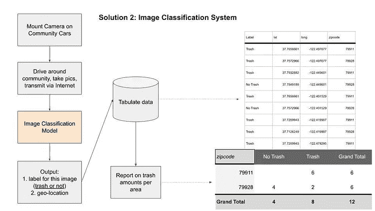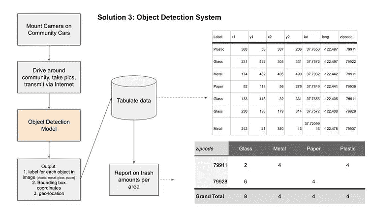

提议系统的蓝图。【图片由作者提供。]

解决方案 1 有许多限制。也就是说，它不可扩展。没有一个城市会让它的工人每天都盯着每条街上的垃圾。因此，我考虑了“解决方案 2”，它利用机器学习来对来自相机馈送的图像进行分类。这种解决方案很有吸引力，因为它是可行的，并且具有商业现成组件的成本效益。解决方案 2 有两个重要的局限性:它不能识别多个垃圾项目，也不能识别不同种类的垃圾。因此，我考虑了“解决方案 3”，一个被训练来识别每张图像的多种垃圾类型的物体检测系统。

以下是我如何准备和使用我的机器学习模型的蓝图:

机器学习工作流的系统图。【图片由作者提供。]

## 建筑物

以下摘录来自我的 [Google Colab 笔记本](https://colab.research.google.com/drive/1PU3rJeuUgWYHnpZ-uyFwaCfxoU6rArYA#scrollTo=zwgMTbrjereU)。

首先，我在 Colab 中安装了 Tensorflow 对象检测库。

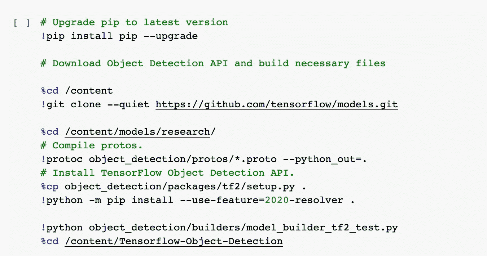

【图片由作者提供。]

然后我下载了 [TACO 数据集](https://github.com/pedropro/TACO)，它包含了数以千计的 COCO 格式的标签垃圾图片。

[图片由作者提供， [TACO Github 库](https://github.com/pedropro/TACO/)在[麻省理工学院许可](https://github.com/pedropro/TACO/blob/master/LICENSE)下的截图。]

接下来，我将 COCO 数据格式从 XML 转换为适合 Tensorflow 对象检测器的 CSV 格式。然后我创建了一个数据框，其中包含文件名、类(“Trash”)和边界框坐标。

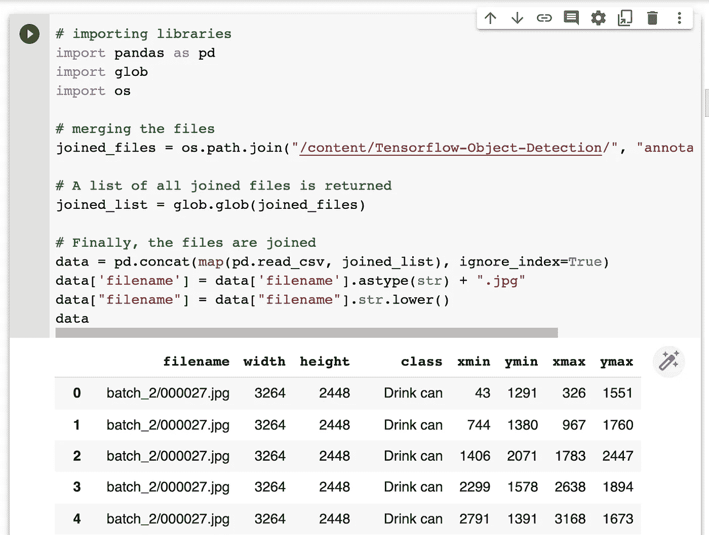

【图片由作者提供。]

然后，我创建了一个数据混洗和分割，将图像随机分配到训练、测试和验证组。

【图片由作者提供。]

我从 TensorFlow 库中配置了一个具有预训练权重的 [efficientDet_d0_512x512](https://tfhub.dev/tensorflow/efficientdet/d0/1) 对象检测器。这有助于减少训练时间，因为模型已经配置了一些基本层来检测各种对象。这里的任务是用垃圾的例子“微调”基础模型，以便它也能学会检测我的例子。

然后，我对模型进行了训练，并观察了它的 total_loss 函数，以确定它的训练是否正确。请注意，随着模型在训练迭代中不断运行，损失函数会逐渐减小。

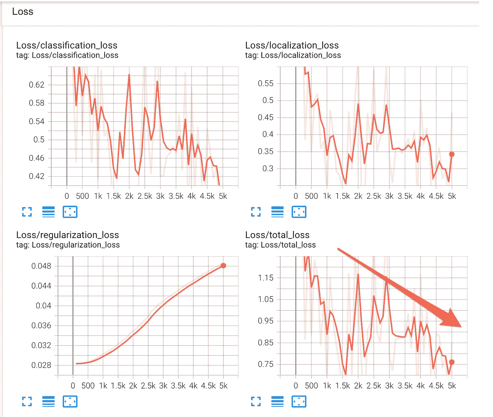

【图片由作者提供。]

我导出了模型权重，以便以后可以根据需要重新加载它们。这很重要，因为否则每次我想运行对象检测推理时，我都必须重新训练该模型，这并不好，因为花了 1.5 小时来完成训练该模型。

我还确认了我可以可靠地重新加载我导出的模型，如下所示:

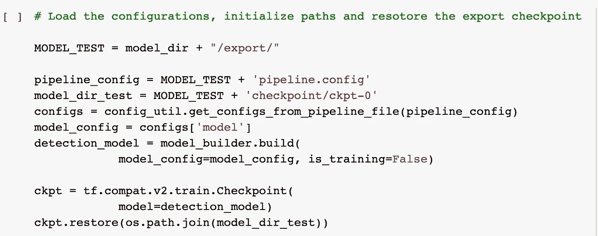

【图片由作者提供。]

急于看到我的结果，我使用了一个脚本，该脚本将拍摄模型从未见过的新照片，以可视化其性能:

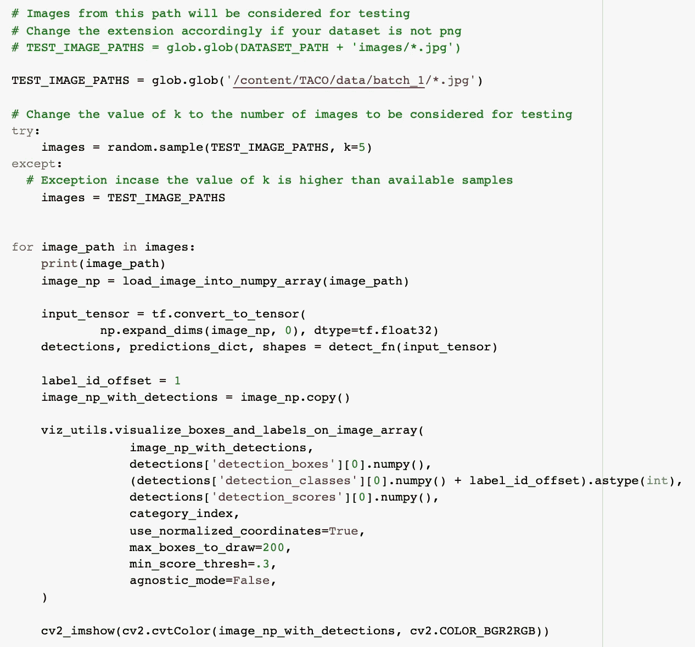

【图片由作者提供。]

以下是该步骤的一些输出示例:

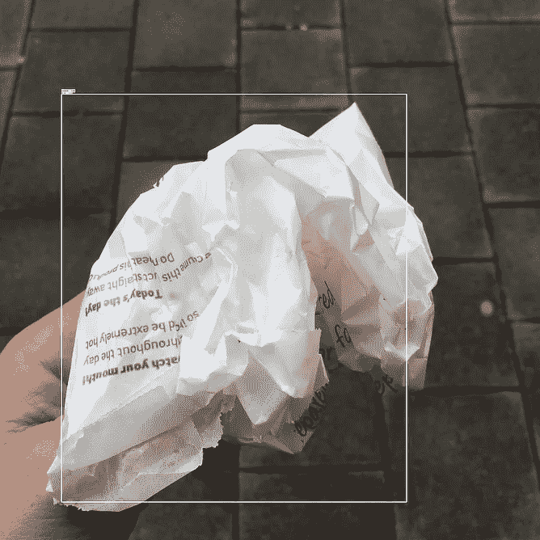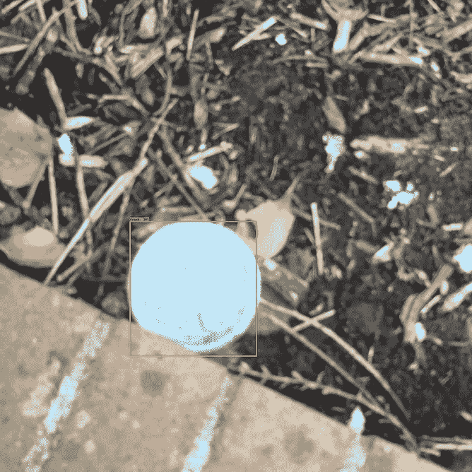

【图片由作者提供；底层图片是[麻省理工学院许可的](https://github.com/pedropro/TACO/blob/master/LICENSE)来自 [TACO 开源库](https://github.com/pedropro/TACO/)的数据。]

模型完成后，我将注意力转向从图片的 EXIF 元数据中提取纬度和经度。我用这个脚本成功地完成了这个任务:

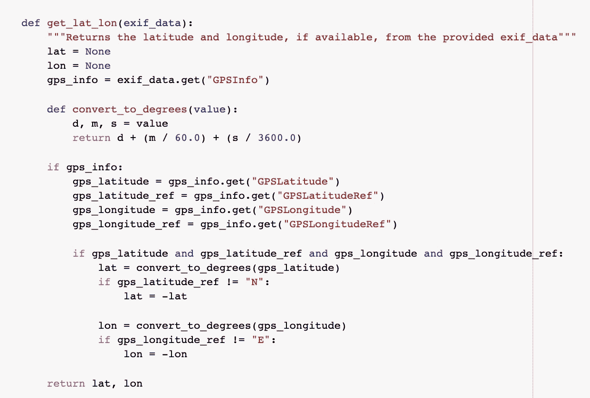

【图片由作者提供。]

另一天，我坐在父亲汽车的后座上，他开着车在德克萨斯州埃尔帕索的各个街区转悠，而我则用 iPad 拍照。这些图片包括地理位置数据，我可以使用上面的脚本提取。

拍完所有的照片后，我们将 iPad 连接到电脑上，下载照片。后来，我们将这些图像上传到 Colab 环境的“custom_data”文件夹中。

对于 custom_data 文件夹中的每个图像，以下脚本(1)执行对象检测推理，(2)提取纬度/经度，(3)将数据一起存储在 dataframe(表)中。

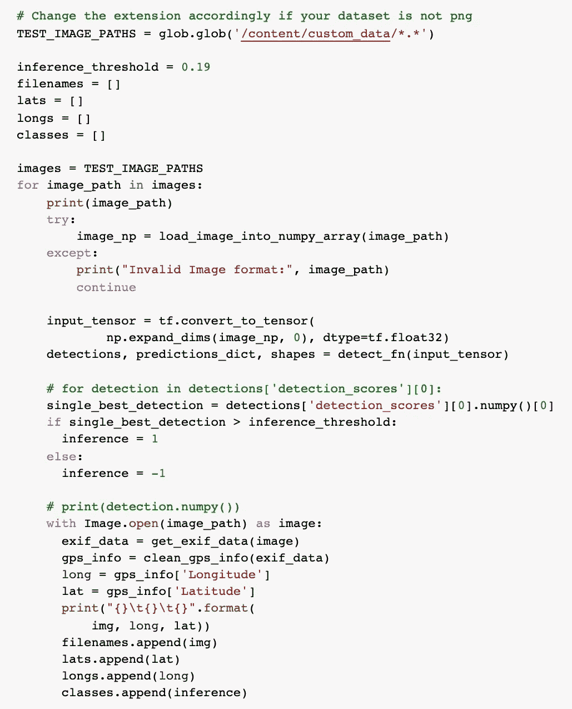

【图片由作者提供。]

下面是一个输出示例:

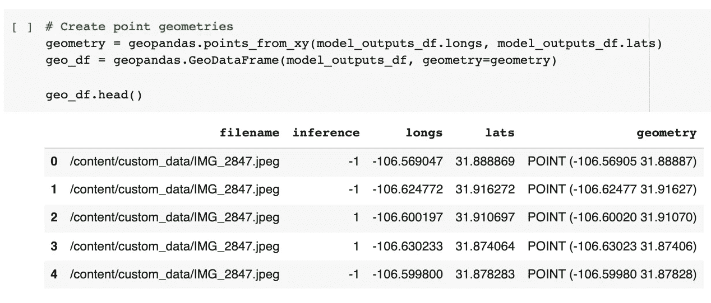

【图片由作者提供。]

接下来，我为 GeoPandas 安装了一个 lyum 插件，它提供了一个热图功能:

【图片由作者提供。]

从上面的脚本中输入数据帧创建了一个交互式热图，显示垃圾或多或少的区域。以下是德克萨斯州埃尔帕索不同地区的一些热图截图:

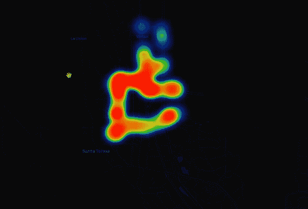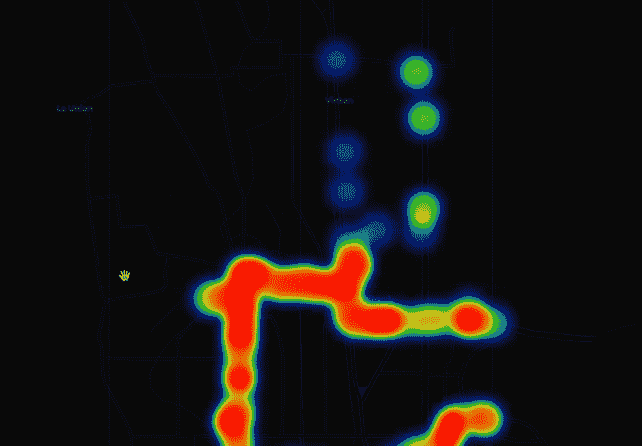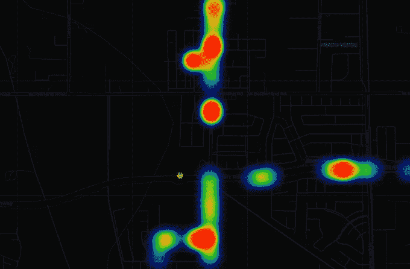

【每张图片由作者提供。]

回顾这些数据，我做了一些重要的观察。首先，沃尔玛的停车场出奇的干净。我曾假设那里会非常脏，因为人和车太多了。然而，经过思考，我认为这是一个干净的区域，因为企业有兴趣创造一个友好的购物环境，因此定期清洁停车场。第二，我假设 10 号州际公路附近的区域会因为交通流量而变脏。我的数据支持这一结论，埃尔帕索市应该分配更多的资源清理该地区。第三，农业区(又名“上谷”)脏得惊人。我推测更少的房屋和人会导致更少的垃圾。恰恰相反。

## 结论

总之，这是一个学习更多关于 Python、机器学习和对象检测的伟大项目——所有这些都是在为城市做好事的背景下进行的！对于最初的问题，这是一个很好的解决方案，因为如果没有自动化，人们执行这样的分析将会非常耗时。我提出的解决方案是一种经济高效的方法，可以快速识别城市中有大量垃圾的区域。我可以想象在城市车辆上配置我的系统，以便他们在执行其他日常任务时定期收集这些数据。

下一次，我会做一些不同的事情。例如，我会尝试为拍摄城市照片创造一种更平衡的采样方法。我担心我是如此渴望找到垃圾的照片，在这样做的时候，我可能在我的数据中过度采样了垃圾(偏见)。我记得在一个公园里，我可以看到许多垃圾，我特意跑过去给它们拍照。

至于改进我的设计，我会做两个重要的改变。首先，当同一块垃圾出现在多张照片中时，我会找到一种方法来处理垃圾计数过多的问题。这发生在汽车缓慢移动时，我快速拍摄了一系列照片，从而在一张照片的前半部分和第二张照片的后半部分包含了垃圾。在这种情况下，同一个垃圾在一个特定的区域被计数两次。改进这种设计的一种方法是创建一个地理过滤器，在每个地理半径内只取一个样本。例如，即使 10 张照片是在同一纬度/经度拍摄的，那么其中一张照片应该仅用于分析。

第二，该模型有时会将*相同的垃圾项目*识别为预测数组中的多个推断。这里有一个例子:

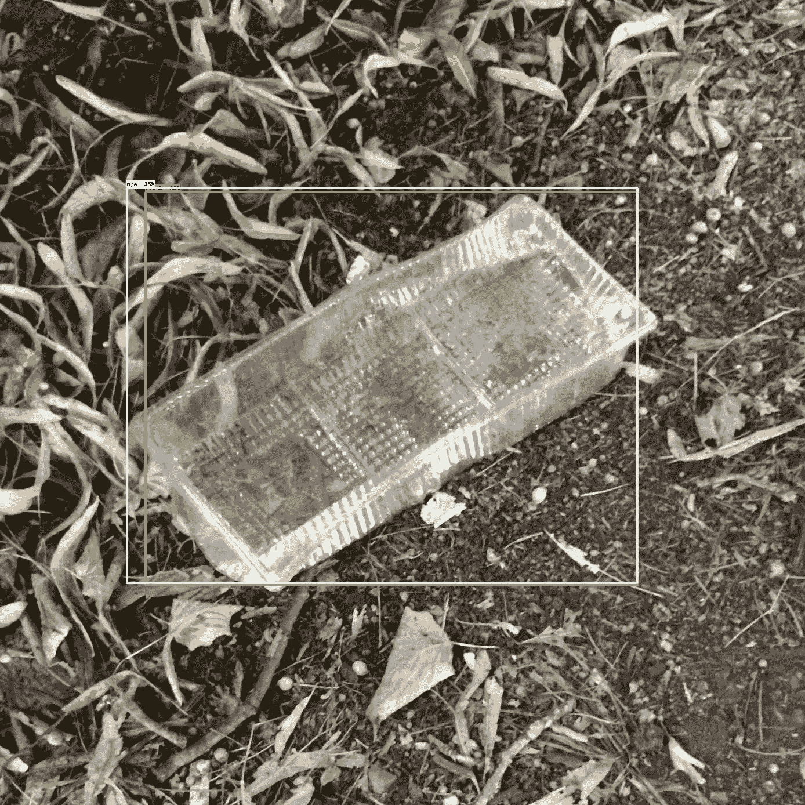

【图片由作者提供；底层图片是来自 [TACO 开源库](https://github.com/pedropro/TACO/)的 [MIT 许可的](https://github.com/pedropro/TACO/blob/master/LICENSE)数据。]

未来的改进包括处理推理以确定一个边界框是否实质上在另一个推理边界框内，这样我只从许多相似的预测中的一个得到结果。在这里，为了使项目在我分配的时间内易于处理，我采用了一系列预测中最有可能的对象检测推断。举例来说，我的系统在热图中只识别和绘制一个项目，即使物体检测器可以发现两个项目(见下图)。这导致了在特别脏的地区对垃圾的统计不足。

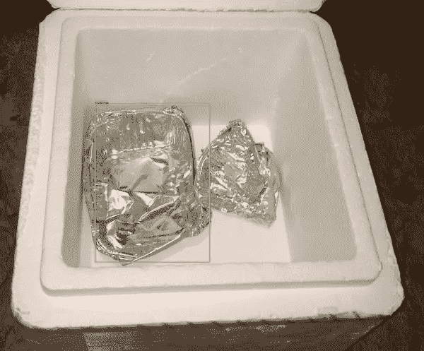

【图片由作者提供；底层图片是[麻省理工学院许可的](https://github.com/pedropro/TACO/blob/master/LICENSE)来自 [TACO 开源库](https://github.com/pedropro/TACO/)的数据。]

第三，我的第一个训练模型使用了 60+类的 TACO 数据集(铝箔，气溶胶罐，包装纸等。).但是我假设我没有足够的训练数据来准确地捕获这么多不同的类，在这种情况下，我正在微调一个现有的模型。相反，我使用了一个脚本，将所有垃圾类转换成一个名为“trash”的超类这样，我可以用大约 2400 个不同的垃圾样本来训练物体检测器。这一改变提高了我的模型持续检测上传图像中垃圾的能力。

我的想法在这个项目中不断发展。起初，我想建立一个对象检测器模型，因为它可以计算每张图像中的多块垃圾，并报告不同类型的垃圾(铝、纸、玻璃等)。).但是我遇到了一些挑战，例如(1)意识到当相同的垃圾出现在不同的图像中时，该模型会对其进行多次计数，以及(2)以不同的准确度对相同的项目进行多次分类。为了解决这些问题，我的设计必须改变。首先，我创建了一个只有一个类(“trash”)的对象检测器，并对每张图像只计数一个 Trash 实例。回想起来，我应该使用图像分类器。我怀疑这样训练会更快。

这个项目应该帮助其他人谁想要扩展我的工作。我希望有一天世界各地的城市都能实施这个项目。这样，他们可以识别最脏的区域并优化垃圾收集工作。我真心喜欢帮助地球和编码。这个项目是我结合这些激情的完美方式。

—

非常感谢[佩德罗·普罗恩萨](https://medium.com/u/a6b447eb702d?source=post_page-----17a217d5582d--------------------------------)和[佩德罗·西莫斯](https://medium.com/u/c391c9b3d21f?source=post_page-----17a217d5582d--------------------------------)开源他们的项目， [TACO:垃圾检测上下文中的垃圾注释](https://arxiv.org/abs/2003.06975)，这使得这项工作成为可能。

这里使用的训练、测试和验证数据集是在[麻省理工学院许可](https://github.com/pedropro/TACO/blob/master/LICENSE)下的，可以在位于【https://github.com/pedropro/TACO】T2 的 GitHub 上获得。用于创建热图可视化的数据是作者拍摄的图像。