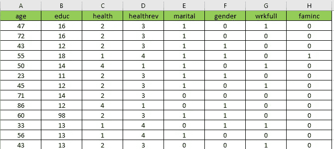
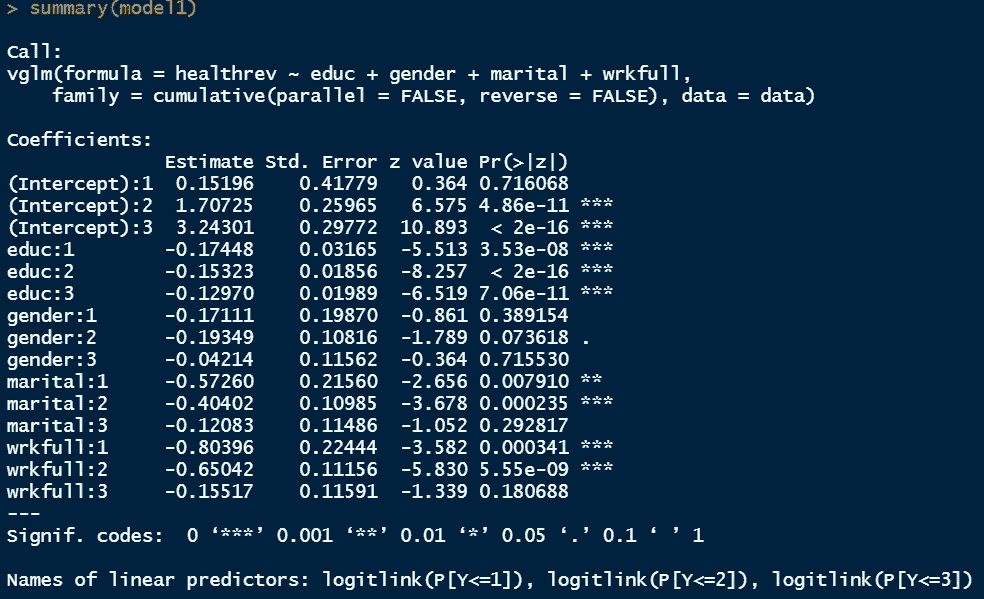

# R 中的广义有序回归模型

> 原文：<https://towardsdatascience.com/generalized-ordinal-regression-model-in-r-930834edae10>

## R 系列中的统计

安托万·道特里在 [Unsplash](https://unsplash.com/s/photos/math?utm_source=unsplash&utm_medium=referral&utm_content=creditCopyText) 上拍摄的照片

> **简介**

我们已经研究了几个逻辑回归模型，这些模型能够对二元和有序响应变量进行简单和多元回归分析。这些逻辑回归模型的结果通常是所有预测变量的系数。我们做的一个基本假设是比例奇假设。在这种假设下，我们假设预测变量的系数在不同水平的结果之间没有变化。例如，如果响应变量有三个不同的级别，我们假设该系数对于从第一级别到第二级别的转换以及从第二级别到第三级别的转换都有效。不同级别的系数可能不同，这是许多真实世界数据的情况。因此，我们需要拿出不同的模型，没有比例奇假设。

如果我们希望系数在响应变量的每个水平上变化，该模型通常被称为广义有序回归模型。另一方面，如果我们允许系数仅在某些系数上变化，则该模型称为部分比例奇数模型。在这篇文章中，我们将通过 r 中的广义有序回归模型的基础和实现。

> **想法的简化**

比例奇模型的假设可以借助一个例子来阐明。假设我们收集了数百人的数据。这些数据包括他们的教育程度、年龄、婚姻状况、健康状况、性别、家庭收入和全职工作状况。我们想导出一个健康状况的回归模型，把教育程度、性别、婚姻状况、家庭收入作为预测变量。预测变量都是二进制的，这意味着除了教育之外，它们的值不是 0 就是 1。教育变量是连续的，代表个人完成教育的年数。

*   教育:数字和连续
*   婚姻状况:二进制(0 表示未婚，1 表示已婚)
*   性别:二进制(0 代表女性，1 代表男性)
*   家庭收入:二进制(0 代表平均或低于平均，1 代表高于平均)
*   健康状况:依次(1 表示差，2 表示一般，3 表示好，4 表示优秀)

如果我们执行一个有序的逻辑回归并保持比例奇数假设，我们将最终得到每个预测变量的单个系数值。假设家庭收入的系数是“x ”,这意味着家庭收入每增加一个单位(在这种情况下从 0 到 1，因为变量是二进制的),高于一个健康状态类别的对数概率或对数几率是“x”。因此，我们可以对这一模型得出如下结论。

1.  如果家庭收入增加到高于平均水平，健康状况从差到一般的对数几率是 x。
2.  如果家庭收入增加到高于平均水平，健康状况好于平均水平的对数几率是 x。
3.  如果家庭收入增加到平均水平以上，那么从身体健康到身体健康的对数几率是 x。

这就是比例奇比模型的本质，在该模型中，对数奇比在所有水平的结果中保持不变。这种假设在现实世界的数据中经常被违反，因此我们不能继续使用比例奇模型假设。

> **解决方案**

有两种可能方法来处理违反比例奇数假设的变量。一种方法是遵循广义有序 logit 模型，其中允许所有预测变量的影响发生变化。相比之下，可能会有这样的情况，其中一些解释变量是允许变化的，这种模型被认为是部分比例奇数模型。

*   广义有序回归模型->所有预测因子的效果都可能不同
*   部分比例奇数模型->某些预测因子的效果是允许变化的

在部分比例奇数模型中，只有那些违反比例奇数假设的变量才允许变化。其他的保持不变。

> **数据集**

这个案例研究的数据源将是 [UCI 机器学习库的成人数据集](https://archive.ics.uci.edu/ml/datasets/adult)。在该数据集中，估计大约有 30000 个人基于他们的人口统计信息被识别，这些信息包括但不限于他们的种族、教育、职业、性别、工资、每周工作时间、就业状况以及他们的收入。

[来自 UCI 机器学习知识库的成人数据集](https://archive.ics.uci.edu/ml/datasets/adult)

为了在 R 中实现，我们将对原始数据进行一些修改。事实上，修改与上面的“**想法的简化”一节中的描述完全相同。**

*   学历:数值型，连续型。教育对健康状况有很大影响。
*   婚姻状况:二进制(0 表示未婚，1 表示已婚)。我认为这个变量的影响会小一些，但还是包括在内了。
*   性别:二进制(0 代表女性，1 代表男性)。它的影响可能也较小，但发现它会很有趣。
*   家庭收入:二进制(0 代表平均或低于平均，1 代表高于平均)。这可能对健康状况有潜在影响。
*   健康状况:依次(1 表示差，2 表示一般，3 表示好，4 表示优秀)

要使用的修改数据

> **R 中的实现**

首先，我们需要导入所需的库并加载数据。这里，我使用了 VGAM 软件包中的 vglm()命令来实现比例奇数模型和广义序数模型。命令中唯一不同的是

*   对于 PO 模型(比例奇数):平行=假
*   对于广义序数模型:parallel = True

使用命令“parallel = True”对序数模型使用 vglm()相当于使用我们在之前使用[的 clm()命令。](/simple-logistic-regression-for-ordinal-variables-in-r-1d95fa278c5e)

> **结果解读**

广义序数模型综述

从结果总结中，我们发现每个预测值有三个系数估计值。所有预测器的系数都是负的。该模型估计处于或低于特定类别的 logit 概率或对数几率。类别也显示在上面的结果中(最后一行)。由于健康状态有四种可能的结果(1 表示差，2 表示一般，3 表示好，4 表示优秀)，因此有三种潜在的二元模型在幕后工作。

*   logitlink(P[Y≤1])是处于或低于第一类的 logit 或 log 几率
*   logitlink(P[Y≤2])是处于或低于第二类的 logit 或 log 几率
*   logitlink(P[Y≤3])是处于或低于第三类的 logit 或 log 几率

例如，如果我们考虑婚姻状况，

*   对于婚姻状况的每一个单位变化(在这种情况下，从 0 到 1 或从未婚到已婚)，处于健康状况类别 1 和处于健康状况类别 1 以上的 logit 或 log 比值比之间的差异变化-0.572。
*   处于或低于第 2 类健康状况和处于第 2 类以上健康状况的 logit 或 log 比值比之间的差异为-0.404，婚姻状况每改变一个单位(在这种情况下，从 0 到 1 或从未婚到已婚)。
*   对于婚姻状况的每一个单位变化(在这种情况下，从 0 到 1 或从未婚到已婚)，处于或低于第 3 类健康状况和处于第 3 类以上健康状况的 logit 或 log 比值之间的差异变化-0.12。

我们可以通过执行下面的代码来获得奇数比率

> exp(coef(model1，matrix = TRUE))

奇数比率

上述结果表明，婚姻状况的三个比值比分别为 0.564、0.667 和 0.886。从这里，我们可以得出结论，

*   已婚人士处于第 1 类(健康状况较差)健康状况的几率是未婚人士的 0.564 倍。
*   已婚人士处于或低于第 2 类(健康状况较差)健康状况与高于第 2 类(健康状况较好)健康状况的几率是未婚人士的 0.667 倍。
*   已婚人士处于或低于第 3 类(健康状况较差)健康状况与高于第 3 类(健康状况较好)健康状况的几率是未婚人士的 0.886 倍。

> 我们可以说，结婚降低了处于或低于健康状况类别的几率。另一方面，结婚与处于更好健康状态类别的更高机会相关。

我们还可以对“教育”预测值做出如下结论:

*   受教育年限每增加一个单位，处于 1 类(健康状况较差)健康状况的几率降低 0.839 倍。
*   教育年数每增加一个单位，处于或低于第 2 类(健康状况较差)健康状况的几率减少 0.857 倍。
*   教育年数每增加一个单位，处于或低于第 3 类(健康状况较差)健康状况的几率减少 0.878 倍。

因此，教育程度也与健康状况呈正相关。

> **结论**

我们已经讨论了广义有序逻辑回归模型和部分比例奇数模型背后的基本思想。在这篇文章中，广义有序逻辑回归模型在 R 中的实现被证明和解释的结果。将来，我们将实施部分比例奇数模型，其中只有那些违反 PO 假设的变量才会发生变化。

> **数据集确认**

[杜瓦博士和格拉夫博士(2019 年)。UCI 机器学习知识库[http://archive . ics . UCI . edu/ml]。加州欧文:加州大学信息与计算机科学学院(CC BY 4.0)](https://archive.ics.uci.edu/ml/datasets/adult)

感谢阅读。

   