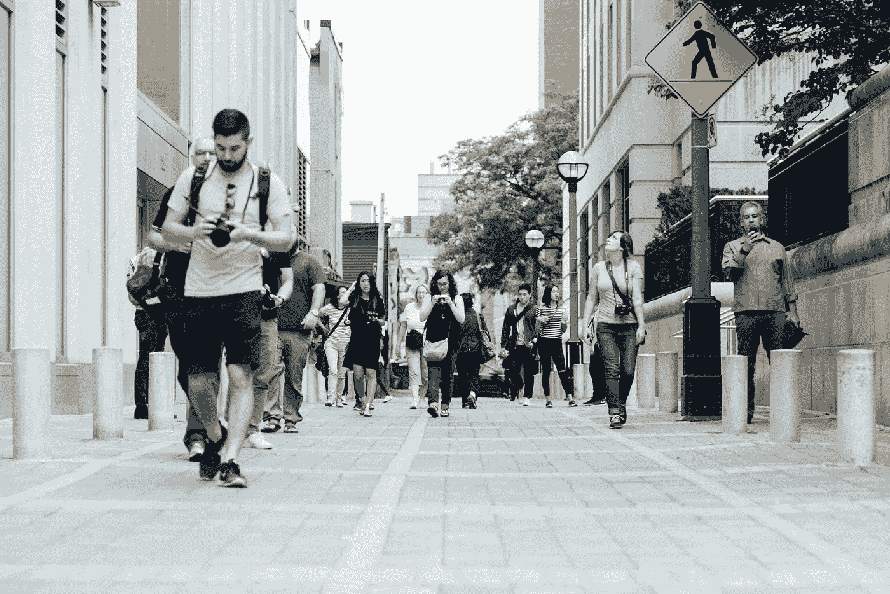
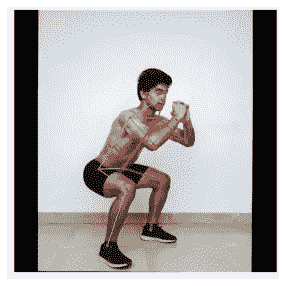
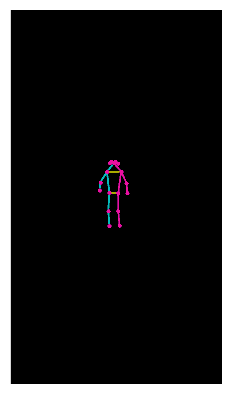
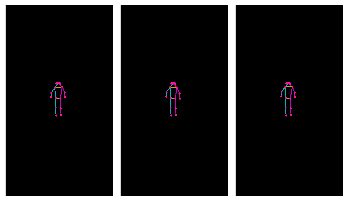
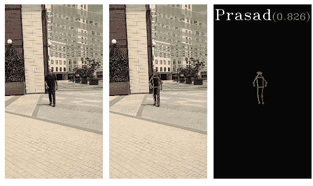

# 用人的步态生成数字签名

> 原文：<https://towardsdatascience.com/generating-digital-signatures-with-the-gait-of-people-3a66f0c44b7b>

## *用机器学习提高网络安全的创新尝试*

照片由[马特·奎因，Unsplash](https://unsplash.com/photos/Q6-jv031muY?utm_source=unsplash&utm_medium=referral&utm_content=creditShareLink)

早在 2018 年初，我们就预见到了人类手掌和手指上各种点的地标检测的有用性，并解释了[我们如何在地标检测](https://medium.com/ymedialabs-innovation/classification-of-hand-gesture-pose-using-tensorflow-30e83064e0ed)的基础上利用机器学习来理解手的各种信号。从那时起，我们已经见证了多种产品利用这个有用的想法来理解手势，主要是通过静态快照。在今天的文章中，我们想向前迈出一步，专注于一个更大的问题，即通过步态检测在短视频中利用人体上的更多标志来识别人。我们相信，随着人体标志检测和更快处理的不断进步，这类应用将占据中心位置。

# 为什么步态检测很重要？

当新冠肺炎疫情袭击世界的时候，人们不得不戴口罩遮住脸。突然之间，许多面部识别模型只能通过来自额头和眼睛的有限的标志点集来做出决定。一夜之间，通过面部识别生成的数字签名就失效了。我们还看到，随着 3D 打印机的出现，犯罪分子正在生成人脸来模仿他们的目标。更糟糕的是，今天，容易获得的 [Deepfake](https://en.wikipedia.org/wiki/Deepfake) 模型足以让观众相信目标受害者所说的一些陈述。

当今最受欢迎的技术中的所有这些漏洞和缺点将需要探索更新的技术。通过一个人走路的方式生成数字签名可能是一个有希望的开端。

# 人体标志检测模型

虽然从头开始开发步态检测模型可能是一项非常有趣和充满乐趣的工作，但它需要大量的数据、大量的计算能力和时间，而我们许多人都无法获得这些。因此，我们将努力在已经开展的一些良好工作的基础上再接再厉。作为一名机器学习应用程序开发人员，了解研究领域的所有发展非常重要。通过深度学习模型识别人体各种标志的工作将形成我们架构的基本组成部分。

[TensorFlow Hub](https://www.tensorflow.org/hub) 为我们提供了[许多有学问的模型](https://tfhub.dev/s?module-type=image-pose-detection)，这些模型将帮助我们检测人体的地标。由于我们不会调整这些模型，相反，我们更感兴趣的是通过这些模型执行推理，我们甚至可以选择通过切换到 [TensorFlow Lite](https://www.tensorflow.org/lite) 版本来改善我们的延迟，方法是牺牲一点模型的准确性。在我们的实验中，我们将选择 TensorFlow Hub 中的 MoveNet 模型的 [Thunder 变体的 TensorFlow Lite 版本。MoveNet 模型将为我们提供 17 个 X-Y 坐标以及每个关键点的置信度得分。](https://tfhub.dev/google/movenet/singlepose/thunder/4)

地标关键点(图片来源: [TensorFlow](https://www.tensorflow.org/hub/tutorials/movenet)

# 数据类型

既然我们的人体地标检测模型已经定型，下一步就是关注数据。因为我们的目标是建立一个应用程序，我们将创建一种个人行走的数字签名，我们不太可能有大量的个人数据。在实际场景中，我们可能最多只能获得 6-10 秒的视频记录，我们将不得不继续工作。我们的目标非常类似于说金融机构可以收集最多 1 或 2 个客户的签名样本，而后者在他们那里开立新账户。

深入到我们的问题设置，我们将在视频的每一帧上运行我们的姿势估计模型，以生成图像中地标位置的时间序列数据，如下所示。

左:输入视频，中:检测，右:关键点(作者提供的 GIF)

现在，一个自然的问题出现了，我们如何在仅仅 10 秒钟的记录中描绘出一个人的行走模式。这是我们必须填补空白的关键之处，因为数据远远优于机器学习或深度学习模型。我们将尽可能多地模仿我们能想到的模式。

# 数据扩充

数据扩充是一种创建人工数据集以补充现有数据不足的技术。新生成的数据模拟了现有数据中模式的缺失部分，从而简化了训练期间 ML 模型的学习过程。我们已经在专门针对图像数据增强的[上一篇文章](https://medium.com/ymedialabs-innovation/data-augmentation-techniques-in-cnn-using-tensorflow-371ae43d5be9)中深入讨论了这个主题。

在我们试图解决的问题中，除了更少的数据量，我们甚至必须意识到这样一个事实，即个人的行走方式可能与我们的参考视频不同，期望个人总是保持类似的风格是不合逻辑的。尽管行走方式发生了变化，但总的来说，他/她身体各部分的运动和协调的整体动态应该在一段时间内(比如说过去几年)保持相当相似。然而，由于不同的情况，行走的缺失部分不同，从而产生不同的风格，我们将通过数据扩充来补充它。

**a)快走:**
拍摄参考视频时，个人可能不会为其他事情烦恼，但在现实生活中，他/她肯定会很匆忙。当人走得快时，帧之间的点对点过渡将不是平滑和连续的。为了模拟视频中的这种情况，我们可以定期随机跳过几帧。

快走(作者 GIF)

**b)慢走:**
与快走类似，一个人可能受伤了，或者可能有足够的时间，因此可能走得很慢。要模拟缓慢行走的情况，您需要在现有帧之间插入帧。这个慢速视频中的界标应该从其附近的帧中插入，使得人的运动看起来是连续的，并且在恒定 fps 速率下视频中帧数的增加使得人走得慢。

慢走(作者 GIF)

**c)滞手:**
很多时候，走路的时候，一个人可能一只手或者两只手拿着一个包。在这种情况下，拿着袋子的手不会移动太多，并且会在小范围内振动。我们通过保持对应于所选手的手腕、肘和肩的界标在小范围内移动来模拟这样的条件。

左:左手停滞，中:右手停滞，右:双手停滞(作者 GIF)

**d)仅顶部姿势:**
有时，记录目标运动的摄像机可能被安装在更高的高度或怪异的角度，这样它只能捕捉到目标的顶部姿势。我们需要通过向下移动人的标志来模拟这种情况，以便自然地看起来只有顶部姿势是可见的。

顶部姿态可见(GIF 由作者提供)

**e)随机噪声:**
记录目标运动的相机的另一个问题可能是它已经变旧了，并且其中的帧有故障。也有可能是拍摄对象的光线条件不合适。在这种情况下，一些标志可能随机消失，和/或姿态估计模型已经做出了非常低置信度的预测。这种类型的增强也比其他增强增加了更多的正则化效果，以防止我们的模型过度拟合。

故障关键点(作者提供的 GIF)

一个人可能不得不在中途停下来看看他/她的手机或者做一些其他的活动。在这种情况下，腿会保持静止，但身体的其他部位，如手和头可能会移动一点。

走走停停(作者 GIF)

**g)左右行走:**
到目前为止，在所有的视频中我们都假设拍摄对象会直线行走在镜头正前方。但是对象可能随机向左或向右移动。

左:向右移动，右:向左移动(作者 GIF)

**h)混合组合:**
无论录音多短，主题都不需要以一种方式改变他的常规风格。因此，我们必须将上述两个或多个条件组合起来，以串行甚至并行的方式模拟混合风格。

**我)想更多的替代方案:**
我们的模型只有在接受训练时看到的多样化数据量多，才会有好的表现。虽然上述一系列可供选择的行走方式将为我们的数据集增加多样性，但我们可以想到的提供更多数据扩充的场景类型从来没有硬性限制。

# 建筑模型

构建分类模型可能听起来很有趣，可以直接对主题进行分类，并将每个主题创建为一个类。但是这种方法有一个很大的缺点。我们正在考虑将这个解决方案扩展到几千个，分类器方法将产生一个大的密集矩阵(最后一层)。更重要的是，尽管我们已经做了所有的数据扩充，但我们仍然真的没有数据可以通过每个类别的表示学习来创建良好的边界。

为了解决上述问题，我们将使用一次性学习。通过一次性学习，我们将能够即时评估新人的视频，甚至无需将他们纳入培训。一次性学习利用相似性函数来比较两个实体彼此相似的程度。

我们的架构将包括[暹罗网络](https://en.wikipedia.org/wiki/Siamese_neural_network#:~:text=A%20Siamese%20neural%20network%20(sometimes,to%20compute%20comparable%20output%20vectors.)。由于我们的数据是基于时间序列的，我们将在暹罗网络中使用递归神经网络(GRU 或 LSTM)。我们将把一个参考视频的地标位置的时间序列数据和测试视频的地标位置的时间序列数据传递到暹罗网络中。然后，单独的潜在表示将通过密集层，以分别基于属于或不属于同一个人的视频来最大化或最小化分数。

高层架构(图片由作者提供)

# 结果

在我们的实验中，我们通过拍摄人们行走的视频来收集数据。我们甚至修剪了开源数据集中的免费可用的步行视频，我们还收集了几个视频，视频所有者允许我们使用他们的资源进行研究。

这是对一个测试视频的推断结果，该视频被提供给我们训练过的模型。与对象的参考视频的相似性分数显示在括号内。对于所有不正确的参考视频，该模型给出的相似性得分小于 0.5

左:测试输入视频，中:检测，右:带有相似性得分的结果(作者提供的 GIF)

# 这种方法是最好的吗？

不，一点也不。我们这个实验的全部目的是生成一种新型的数字签名。随着旨在加强安全性的创新技术的每一次进步，伪造者总会找到规避它的方法。目前，在 [vid2vid](https://github.com/NVIDIA/vid2vid) 的帮助下，可以生成复制受害者步态的假视频。然而，结合面部识别的步态分析将是生成个人数字签名的良好机制。然而，我们相信这个实验中展示的简单方法可以形成一个很好的基线模型来推进事情的发展。

# 结论

在本文中，我们学习了如何在现有解决方案的基础上进行构建。我们利用姿态估计解决方案的优势，通过利用暹罗网络和数据增强来模拟许多可能的行走场景，来定制我们的步态检测。在本文中，我们展示了如何重新设计机器学习解决方案来解决其他用例。

# 密码

如果你想看看这个实验中使用的代码，你可以在这个 GitHub 库中找到它。

 [## GitHub-Prasad 9/gait 检测:

### 代码存储库通过人们的行走方式来识别他们…

github.com](https://github.com/Prasad9/GaitDetection) 

你也可以看看我们以前的文章，解释高斯混合模型和期望最大化的算法。

 [## 揭秘高斯混合模型和期望最大化

### 以简化的方式解释高斯混合模型及其期望最大化的基本算法

towardsdatascience.com](/demystifying-gaussian-mixture-models-and-expectation-maximization-a66575deaea6)