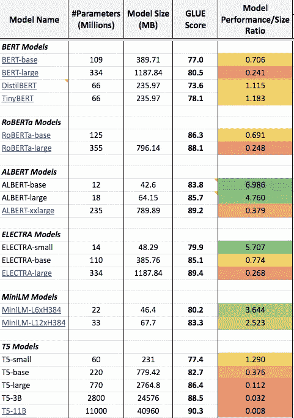
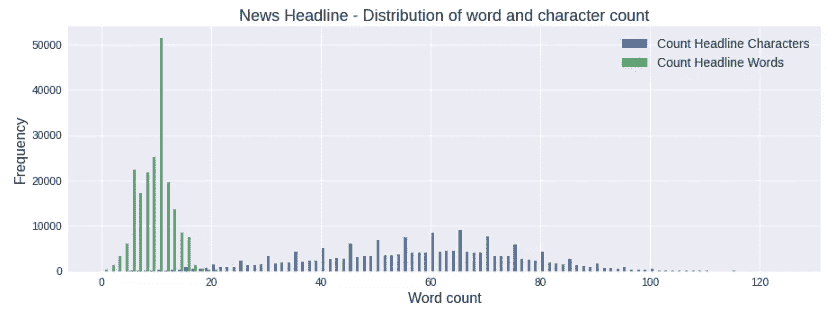
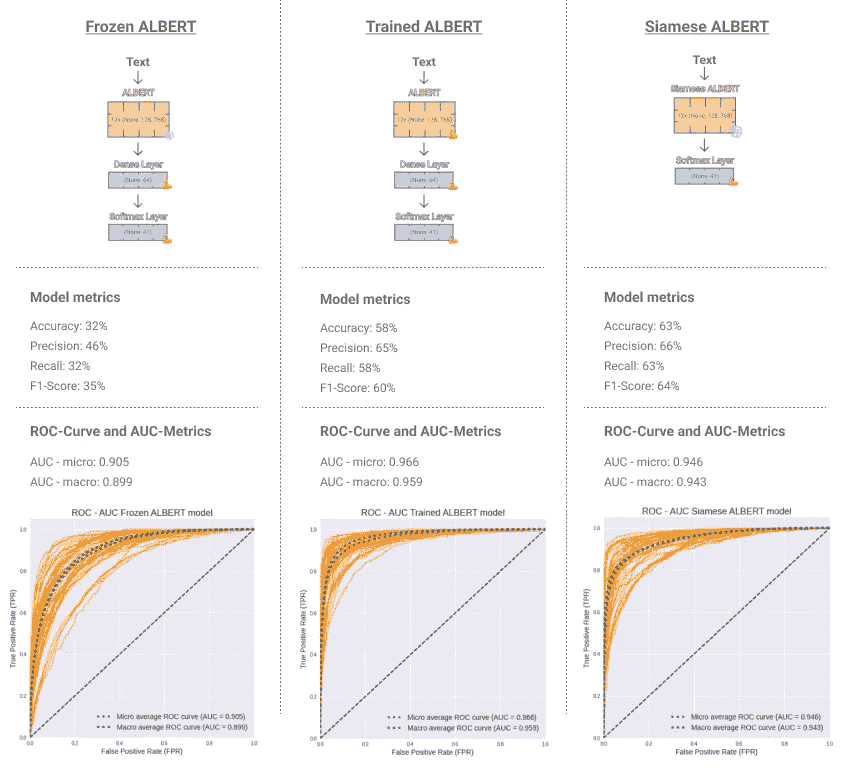
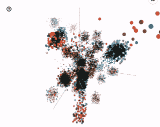
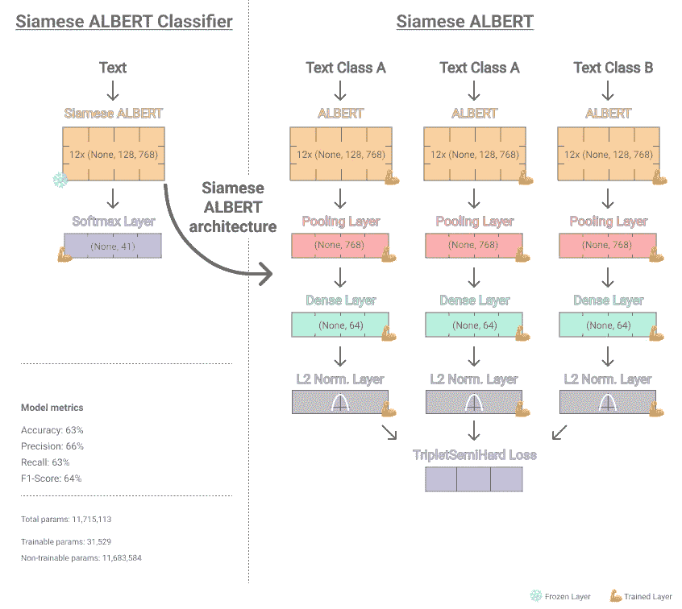
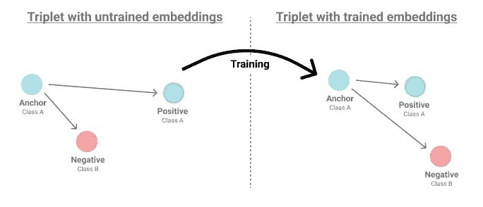

# 从每一篇文本中提取最先进的见解

> 原文：<https://towardsdatascience.com/generating-state-of-the-art-text-embeddings-with-hardware-accessible-by-everyone-46bc7d084703>

## 不需要 OpenAI GPT-3 和类似的工具来为你的自然语言处理任务获得最先进的语义文本洞察。

来源:由[作者](https://medium.com/@janschmitz_80340/membership)创作

在这篇文章中，我将展示大型语言模型，如 **GPT-3，并不能通过其密集的文本嵌入**为许多 NLP(自然语言处理)任务生成最佳的语义文本洞察，以及**如何让每个人都可以用广泛可用的硬件生成最先进的嵌入**。

来源:强力胶模型对比—全面评测[此处](https://docs.google.com/spreadsheets/d/1Oe-v2zhYyFW3P1K-mLZME0pwxWMQ9qxP0fhZCRZ_XVA/edit?usp=sharing) —由[作者](https://medium.com/@janschmitz_80340/membership)创作

密集文本嵌入是编码单词含义的文本的矢量表示。这样，意义相近的词在矢量表示中是相近的。这些嵌入对于复杂的任务非常有用，例如比较文本内容的相似性、语义搜索、释义挖掘等。在过去的几年中，语言模型的规模呈指数增长，由于资源的限制，许多从业者几乎不可能用最新的模型进行实验。我可能有一个解决方案给你😉。

来源:蒸馏伯特，伯特的蒸馏版本:更小、更快、更便宜、更轻——[https://arxiv.org/pdf/1910.01108.pdf](https://arxiv.org/pdf/1910.01108.pdf)

# 问题陈述和前进方向

我们大多数人面临的限制是，我们没有权限或财力部署大型 GPU/TPU 集群来运行大型语言模型，如 T5、MPNet 或 GPT-3。为了克服这些限制并获得最先进的文本嵌入，我在以下两个步骤上花了很多时间，我想与你们分享:

1.  基于所有相关语言模型的性能和模型参数的数量对其进行比较和排序，以找到最有效的预训练模型。
2.  应用并比较不同的微调技术如何提高预训练模型的性能。

# 动机

当然，我有自己的理由生成高质量的文本嵌入。我的目标是使用文本嵌入作为我自己的模型的输入，以帮助决定我自己的金融资产选择。由于我收到了很多公开我的模型的请求，我发起了一个名为 [**PinkLion**](https://www.pinklion.xyz/) 的项目。

我设计了 PinkLion，通过提供对潜在预测模型的访问，实现动态投资组合优化和资产分析。这些模型可以访问成千上万只股票、基金/ETF 和加密货币的日常资产数据。

> 请随意尝试，并分享反馈🙏。(还处于粗略状态) [www.pinklion.xyz](http://www.pinklion.xyz/)

 [## 粉色狮子

### 不再猜测，投资时使用科学。股票，基金和密码在一个地方。用机器学习改善你的投资组合。

www.pinklion.xyz](https://www.pinklion.xyz/) 

# 1.根据性能和规模对语言模型进行比较和排序

作为第一步，我们必须对现有的语言模型、它们的性能以及它们的规模有一个很好的了解。因此，目标是基于各种基准测试任务比较不同的语言模型，并确定它们相对于其参数数量的表现如何。

## 模型性能的定义—胶水和强力胶

尽管阅读了大量研究论文，但令人惊讶的是，很少发现跨多个基准任务(如 SentEval [1]、GLUE [2]、SQuAD[3]、RACE [4]或 SWAG [5])的完全透明的模型评估。在进一步研究这个话题后，我得出结论，认为[***【通用语言理解评测】【2】***](https://gluebenchmark.com/)*似乎是最广泛使用的评测语言模型性能的基准。*

> *GLUE 是一个工具和数据集的集合，用于评估一个模型在一组九个自然语言任务中的性能。这九项任务集中在文本相似性和释义、分类和推理领域。*

*有了这个结论，我开始收集所有相关语言模型的 GLUE 评估结果。尽管 GLUE 被广泛使用，但是仍然很难获得所有相关的分数，尤其是对于较小的模型版本。本文中的所有后续数字都是按照以下顺序从 GLUE 排行榜、模型的研究论文或相应模型的 Github 页面获得的。*

*对于每个对如何详细组成 [GLUE [2]](https://gluebenchmark.com/) 基准感兴趣的人来说，这里是组成基准的任务名称、缩写、描述和度量。*

> *如果您对详细的粘合任务不感兴趣，请跳到下一节“**模型比较和排名”。***

*   ***语言可接受性语料库(CoLA)** :判断一个句子的语法是否正确。— *指标:马修相关性**
*   ***斯坦福情感树库(SST-2)** : 判断句子是正面情感还是负面情感。——*公制:* *准确度**
*   ***微软研究院释义语料库(MRPC)** :判断两个句子是否是彼此的释义。— *指标:准确性/F1**
*   ***语义文本相似度基准(STS-B)** :确定两个句子的相似度，分值从 1 到 5。— *指标:皮尔森相关性/斯皮尔曼相关性**
*   ***问答式自然语言推理(QNLI)** :判断问题的答案是否在第二句话中。(这个数据集是从班数据集构建的。)— *度量:准确度**
*   *Quora 问题对(QQP) :判断两个问题是否语义等价。— *指标:准确性/F1**
*   ***多体裁自然语言推理(MNLI)** :确定一个句子是否包含、反驳或与一个给定的假设无关。(该数据集有两个版本，一个版本的验证和测试集来自同一个发行版，另一个版本称为不匹配，其中验证和测试使用域外。— *指标:准确度**
*   ***识别文本蕴涵(RTE)** :确定一个句子是否包含给定的假设。— *指标:准确度**
*   ***Winograd 自然语言推理(WNLI)** :判断含有匿名代词的句子和替换了该代词的句子是否包含。(该数据集是从 Winograd 模式挑战数据集构建的。)— *度量:准确度**

*通过取所有任务的平均值来计算最终的粘合分数。像 MRPC 和 STS-B 这样有两个跟踪指标的任务首先被平均，然后被认为是该任务的单一得分。*

**

*来源:胶水任务描述—表格可在此处[找到](https://docs.google.com/spreadsheets/d/1Oe-v2zhYyFW3P1K-mLZME0pwxWMQ9qxP0fhZCRZ_XVA/edit?usp=sharing) —由[作者](https://medium.com/@janschmitz_80340/membership)创建*

## *模型比较和排序*

*在定义了我们如何度量模型的性能之后，这里是收集到的不同语言模型家族的见解。下表显示了每个模型的参数数量、模型的内存存储量(这些数字已从 Tensorflow Hub 或相应模型的 Github 页面获得)以及上文所述的粘合分数。最后，**最后一列*模型性能/大小比率*显示了基于模型的粘合分数及其参数数量计算的比率。***

> *模型性能/尺寸比=粘合分数/模型参数数量*

*换句话说，如果一个模型在 GLUE benchmark 上用更少的参数表现得更好，那么这个比率就更高。因此，*型号性能/尺寸比*栏中的数字越高越好。*

**

*来源:语言模型对比—全面评测[此处](https://docs.google.com/spreadsheets/d/1Oe-v2zhYyFW3P1K-mLZME0pwxWMQ9qxP0fhZCRZ_XVA/edit?usp=sharing) —由[作者](https://medium.com/@janschmitz_80340/membership)创作*

*从整体来看，很明显，随着模型尺寸的增加，性能/尺寸比迅速降低。因此，模型中每个增加的参数都有很强的收益递减。简单看一下 Google[【11】](https://arxiv.org/pdf/1910.10683.pdf)已经公布的 T5 车型家族，这一点就变得非常明显。*

**

*来源:T5 家族对比—全面评测[此处](https://docs.google.com/spreadsheets/d/1Oe-v2zhYyFW3P1K-mLZME0pwxWMQ9qxP0fhZCRZ_XVA/edit?usp=sharing) —由[作者](https://medium.com/@janschmitz_80340/membership)创作*

*最小的 T5 型号 T5-small 拥有 6000 万个参数，粘合分数为 77.4，性能/尺寸比为 1.29。相比之下，最大的 T5 型号 T5–11B 的胶合分数为 90.3，比 T5-small 高 12.9 分。*

*为了实现 12.9 点或 16.6%的分数增加，模型大小必须从 6000 万个参数增加到 110 亿个参数，即增加了 18300%🤯。*

*现在你可能想知道为什么 GPT-3 没有出现在上表中。原因是 GPT-3 不是在普通胶水基准上正式评估的，而是在[强力胶【6】](https://super.gluebenchmark.com/)基准上评估的。*

> *SuperGLUE 是在 image GLUE 之后创建的一个新基准，它具有一组新的更难的语言理解任务。*

*幸运的是，强力胶排行榜列出了普通胶水基准测试中的 GPT-3 和多个型号(伯特-大号、罗伯塔-大号、T5–11B)。比较伯特-基地和 GPT-3，GPT-3 只有更高的强力胶分数 2.8 分(69.0 → 71.8)。尽管 GPT 3 号的参数是它的 1605 倍。同样，RoBERTa-large 和 T5–11B 的参数比 GPT-3 少，但得分更高，分别为 84.6 和 89.3。*

**

*来源:强力胶对比—全面评测[此处](https://docs.google.com/spreadsheets/d/1Oe-v2zhYyFW3P1K-mLZME0pwxWMQ9qxP0fhZCRZ_XVA/edit?usp=sharing) —由[作者](https://medium.com/@janschmitz_80340/membership)创作*

*了解到真正的大型模型，如 GPT-3 在强力胶上的表现优于其他模型(罗伯塔-大型和 T5–11B)，我们可以假设 GPT-3 在普通胶水基准上也优于这些模型。*

*回到我们正常的 GLUE 比较，我们可以看到实现最佳*性能/大小比*的语言模型家族是 ALBERT (A Lite BERT) 模型。*

**

*来源:阿尔伯特家族对比—全面评估[此处](https://docs.google.com/spreadsheets/d/1Oe-v2zhYyFW3P1K-mLZME0pwxWMQ9qxP0fhZCRZ_XVA/edit?usp=sharing) —由[作者](https://medium.com/@janschmitz_80340/membership)创作*

*ALBERT-base 模型实现了*的 **6.986** ，是所有测试语言模型中最高的比率。高比率可以解释为非常好的胶合分数 83.9，同时是所有测试模型中最小的，只有 1200 万个参数。因此，ALBERT-base 提供了每个部署参数的最佳性能。由于参数数量很少，艾伯特-基和艾伯特-大可以很容易地在 K80 或 P100 GPU 上训练。**

## **模型比较的结论**

**当用有限的资源生成密集文本嵌入时，最好考虑的模型族是 ALBERT 族。在所有评估的语言模型中，ALBERT-base 和 ALBERT-large 具有最好的*性能/大小比*。两者都有 1200 万和 1800 万个参数，胶合分数分别为 83.8 和 85.7。这使得这两种型号成为最小的型号之一，同时提供了与 T5 型号相当的性能，而 T5 型号则大得多。此外，GPT-3 在 SuperGLUE 基准测试中表现不佳，如果下游任务与文本生成无关，则不应该选择它作为模型。完整评价可以在 [**这里**](https://docs.google.com/spreadsheets/d/1Oe-v2zhYyFW3P1K-mLZME0pwxWMQ9qxP0fhZCRZ_XVA/edit?usp=sharing) 找到。**

**在接下来的章节中，我将展示如何使用不同的微调技术来进一步提高 **ALBERT-base** 的性能。**

# **2.通过应用和比较不同的微调技术来提高预训练模型的性能**

**在选择了 ALBERT-base 作为我们的语言模型之后，我们现在想要微调一般训练的模型，使它更适合我们自己的应用程序。有许多方法可以微调模型以生成文本嵌入。然而，不同的微调方法会导致非常不同的定性结果。因为比较不同的微调技术需要付出大量的努力，所以我想分享我自己的结果，以便将来其他人更容易理解。**

**在这一节中，我们将比较三种不同的微调过的 ALBERTs，它们都是用不同的微调技术改变的。这里是不同方法和结果的初步概述。**

****

**来源:比较 ALBERT-base 微调架构—全面评估[此处](https://github.com/JanSchm/CapMarket/blob/master/bot_experiments/text%20embeddings/3-Evaluate_All_ALBERT_Classifiers.ipynb) —由[作者](https://medium.com/@janschmitz_80340/membership)创建**

1.  ****冻结艾伯特:**冻结艾伯特由常规预训练艾伯特基础模型组成，该模型被冻结，因此在微调时不会更新其参数。此外，它还有一个可训练的分类头，包括一个 dense 和一个 softmax 分类层。该模型将作为我们的**基线基准**，因为它将代表 ALBERT-base 在没有重大微调的情况下的表现。**
2.  **经过训练的艾伯特:经过训练的艾伯特和冰冻的艾伯特有着完全一样的架构，然而，所有的组件都是完全可以训练和微调的。这意味着 ALBERT-base 组件和分类头(密集层+ Softmax 层)可以针对分类微调任务完全调整它们的权重。**
3.  ****暹罗阿尔伯特:**暹罗阿尔伯特的灵感来自通用[暹罗框架【7】](https://proceedings.neurips.cc/paper/1993/file/288cc0ff022877bd3df94bc9360b9c5d-Paper.pdf)，在我们的例子中，它包括三个相同的基于阿尔伯特的网络，这些网络使用共享权重。除了三个子网络之外，还为分类微调任务添加了由 softmax 层表示的分类头。**

## **资料组**

**为了了解不同的微调方法在现实世界中的比较，我选择了 [HuffPost 新闻分类数据集【8】](https://www.kaggle.com/datasets/rmisra/news-category-dataset)作为文本语料库。该数据集包含 2012 年至 2018 年间从《赫芬顿邮报》收集的 **200853** 条新闻记录，标题和描述分布在 41 个独特的新闻类别中。因此，这个数据集非常适合于查看我们可以在多大程度上针对分类任务对模型进行微调。这是数据集的一个示例。**

****

**来源:赫芬顿邮报新闻分类数据样本——由[作者](https://medium.com/@janschmitz_80340/membership)创建**

> **我们微调任务的目标是根据给定的新闻标题预测新闻类别。**

## **数据准备**

**由于我们希望仅使用新闻标题作为输入来预测新闻类别，因此我们首先希望通过计算和绘制每个新闻标题的字符和字数分布来获得数据集的更好概述。**

**对于新闻标题的字数，最小字数为 0，最大字数为 44，平均一个新闻标题有 9 个字。然而，从分布情况来看，我们可以得出，由于许多标题有大量的单词，所以平均值被夸大了。**

**新闻标题的字符计数的分布显示了类似的情况，其中大量标题具有大量字符。对于字符计数，0 是最小计数，320 是最大计数，平均一个标题有 57 个字符。**

****

**来源:赫芬顿邮报新闻标题单词和字符的概率分布——由[作者](https://medium.com/@janschmitz_80340/membership)创建**

**为了提高输入数据的质量，我们删除了每个标题少于 10 个单词的所有新闻记录。应用此条件**将记录数量从 200853 减少到 189339。****

**删除标题少于 10 个单词的所有记录，并应用 80/20 训练和验证数据集拆分后，类别分布如下所示。**

****

**来源:赫芬顿邮报训练和验证拆分新闻类别——由[作者](https://medium.com/@janschmitz_80340/membership)创建**

**现在很明显，我们有一个高级别不平衡，与*政治*是占主导地位的阶级。这种偏差将在训练过程中通过给每个类分配不同的权重来纠正(稍后会有更多的介绍)。**

## **比较微调技术**

**在对我们的 3 个模型(*冰冻艾伯特*、*训练艾伯特*、*暹罗艾伯特*)进行了训练之后，我们现在能够更详细地查看模型的性能，该训练数据集具有 160682 条对新闻类别进行分类的记录。**

**以下所有指标均来自验证数据集，该数据集显示，从整体来看， ***暹罗阿尔伯特*的性能最好**，，其次是*受过训练的阿尔伯特*，然后是*冷冻阿尔伯特*。**

> *****暹罗阿尔伯特*几乎在所有指标上表现最佳****

**首先比较*冻结的艾伯特*和*训练的艾伯特*，前者使用基于艾伯特的网络的未改变的权重，后者由于赫芬顿邮报的训练过程而具有微调的权重，我们已经可以看到显著的性能提升。经过*训练的艾伯特*的准确率为 58%，F1 得分为 60%，AUC-micro 值为 0.996，而*冷冻艾伯特*的准确率为 32%，F1 得分为 35%，AUC-micro 值为 0.905。**

****

**来源:比较 ALBERT-base 微调指标—全面评估[此处](https://github.com/JanSchm/CapMarket/blob/master/bot_experiments/text%20embeddings/3-Evaluate_All_ALBERT_Classifiers.ipynb) —由[作者](https://medium.com/@janschmitz_80340/membership)创建**

**第二步比较*siame ALBERT*我们可以看到，siame 版本在几乎所有指标上都优于其他两款车型。*暹罗阿尔伯特*在验证数据集上的准确率为 63%，几乎是*冷冻阿尔伯特*准确率的两倍，也高于*训练过的阿尔伯特*的准确率。综上所述，Siamese ALBERT 的准确率为 63%，F1 分数为 64%，AUC-micro 值为 0.946，略低于*训练过的 ALBERT* 方法的同等分数。**

**因为我们最初的目标是创建最好的文本嵌入，这里是由 Siamese ALBERT 生成的嵌入。正如我们所看到的，我们确实为不同的新闻标题类别实现了不同的聚类。暹罗嵌入的一个有趣的特征是，它不仅为不同的类别创建聚类，而且具有类似内容的新闻标题类别，如 T *世界邮报*、*世界邮报*和*世界新闻*在嵌入空间中彼此靠近。**

****

**来源:暹罗阿尔伯特新闻标题嵌入——由[作者](https://medium.com/@janschmitz_80340/membership)创建**

**不同评估步骤和嵌入代的完整代码可在我的**[**Github**](https://github.com/JanSchm/CapMarket/blob/master/bot_experiments/text%20embeddings/3-Evaluate_All_ALBERT_Classifiers.ipynb)上获得。****

# ****暹罗阿尔伯特的实现****

****上面介绍的 *Siamese ALBERT* 是在硬件受限的情况下产生高质量文本嵌入的最佳方法。因此，我也想分享一下*暹罗阿尔伯特*是如何工作的，以及如何实现这个网络并重现上面的结果。****

****让我们先来看看隐藏在单个*连体阿尔伯特*盒子后面的架构的高级表示。Siamese ALBERT 由 3 个基于 ALBERT 的子网组成，这些子网相互分担重量。****

********

****来源:暹罗伟业网络建设— [代号](https://github.com/JanSchm/CapMarket/blob/master/bot_experiments/text%20embeddings/2-Train_Siamese_ALBERT_Classifier_TripletSemiHardLoss_.ipynb) —由[作者](https://medium.com/@janschmitz_80340/membership)创作****

****暹罗系统的输入是文本标题和新闻类别的三元组。该三元组由来自相同类别的两个标题(例如，类别世界新闻)和来自不同类别的一个标题(例如，类别政治)组成。文本标题通过三个子网络，产生三个输出，这些输出被传递到**三元半硬损失函数**，该函数试图使两个相似类别的输入更接近，同时试图在嵌入空间内使具有不同类别的第三个输入的输入远离。尽管看起来三元连体结构有 3 个网络，但它只有一个网络为每个子网提供相同的权重。因此，子网彼此共享它们的权重。****

## ****三重损失****

****在 2015 年【9】的 [Face Net 研究论文中引入了三重损失，以找到一种可扩展的方法来处理人脸识别等任务，这些任务的特点是类别数量多而每类样本数量少。](https://arxiv.org/pdf/1503.03832.pdf)****

********

****来源:三重损失嵌入图—由[作者](https://medium.com/@janschmitz_80340/membership)创作****

****一般来说，三联体损失-连体结构可以用于非常不同的目的，例如文本和图像相似性任务。这可以归因于这样的事实，即它允许直接学习从其输入到紧致欧几里得空间的映射，其中距离直接对应于相似性的度量。换句话说，**三重损失最小化锚和正之间的距离，最大化锚和负之间的距离**。锚和阳性具有相同的类别，而阴性是从不同的类别中取样的。*三重态损失*函数由欧拉距离函数表示。****

********

****来源:三重损失图解—[https://www.tensorflow.org/addons/tutorials/losses_triplet](https://www.tensorflow.org/addons/tutorials/losses_triplet)****

## ****暹罗阿尔伯特实施****

****但是在我们迷失在理论之前，让我们从实现开始。一如既往，第一步是加载数据集，在我们的例子中，它是《赫芬顿邮报》的数据集，随后，清理和准备数据，以便可以提供给我们的网络。这些步骤已经在前面的章节中简要描述过，用于数据准备的代码结合完整的实现可以在 [**这里**](https://github.com/JanSchm/CapMarket/blob/master/bot_experiments/text%20embeddings/1-Train_Siamese_ALBERT_TripletSemiHardLoss.ipynb) 找到。****

****在清理和准备好我们的数据之后，我们加载 **ALBERT tokenizer** 并设置一个数据生成器函数，以实现一个灵活的实现，将我们的数据批量提供给 siamese 模型。****

****接下来，我们将从 Tensorflow Hub 加载预训练的 ALBERT-base 模型。在这个例子中，暹罗艾伯特网络采用三个输入(单词 _ id、掩码、类型 _ id)。这些不是之前三重损耗输入的*锚、正*和*负*,而是艾伯特模型需要的正常输入。在 3 个并行输入之后，加载的艾伯特基网络被合并到*暹罗艾伯特*中作为单一层，我们将从其中提取*汇集输出*权重并将它们馈送到 64 维密集层中。密集层之后是 L2 归一化层，而最后的 **L2 层对于训练成功至关重要，否则网络会有不稳定的训练迭代**和问题收敛。****

****你现在可能想知道:为什么没有 3 个独立的子网络或不同的输入流来为网络提供一个锚定的、积极的和消极的类示例？****

****事实上，我分享的实现不需要配置由 3 个子网络组成的网络架构。在定义我们网络的损耗函数时，我们使用了 [Tensorflow Addons 三重半硬损耗【10】](https://www.tensorflow.org/addons/tutorials/losses_triplet)函数实现，它在后台处理这个问题。损失函数确保在我们摄入的批次中找到三元组。这个过程被称为在线学习，并确保只训练(在我们的半硬损失函数的情况下)半硬三元组。****

****此外，我们定义了一个回调函数来保存我们的训练运行。最后，我们用 model.fit()启动训练运行。这些都是训练一个合理的连体网络所需的步骤。完整的代码可以在 这里 [**访问。**](https://github.com/JanSchm/CapMarket/blob/master/bot_experiments/text%20embeddings/1-Train_Siamese_ALBERT_TripletSemiHardLoss.ipynb)****

# ****结论****

****当面临硬件限制时，ALBERT-base 和 ALBERT-large 是生成高质量文本嵌入的优秀语言模型。这两种模式都拥有目前所有可用的预训练语言网络中最好的性能/规模比之一。GPT-3 不是关于许多语言任务的最先进的模型，因此除了语言生成应用之外，不应该考虑使用它。****

****使用微调技术来进一步提高模型在各种指标上的性能，与传统的微调方法相比，siamese 架构在性能上有所提高，传统的微调方法只是在预训练网络之后添加微调头。****

****我希望我的发现可以帮助人们在未来建立自己的项目和产品。****

> ****感谢您的阅读！****

## ****-简·施密茨****

*   *******如果你喜欢这个，*** [***订阅***](https://medium.com/@janschmitz_80340/membership) ***到我的媒介获取更多内容！*******
*   *******你也可以*** [***关注我上媒***](https://medium.com/subscribe/@janschmitz_80340)****
*   *******或***[***PinkLion***](https://www.pinklion.xyz/)***并给我一些反馈*******

# ****参考资料:****

****[1] SentEval:句子嵌入评估工具包[https://github.com/facebookresearch/SentEval](https://github.com/facebookresearch/SentEval)****

****[2]胶水:通用语言理解评测[https://gluebenchmark.com/](https://gluebenchmark.com/)****

****[3]小队:史丹福问答数据集【https://rajpurkar.github.io/SQuAD-explorer/ ****

****[4] RACE:来自考试的大规模阅读理解数据集[https://arxiv.org/pdf/1704.04683.pdf](https://arxiv.org/pdf/1704.04683.pdf)****

****[5] SWAG:基于常识推理的大规模对抗性数据集[https://arxiv.org/pdf/1808.05326.pdf](https://arxiv.org/pdf/1808.05326.pdf)****

****[6]强力胶:通用语言理解系统的一个更棘手的基准[https://arxiv.org/pdf/1905.00537.pdf](https://arxiv.org/pdf/1905.00537.pdf)https://super.gluebenchmark.com/****

****[7]使用“暹罗”时间延迟神经网络的签名验证[https://proceedings . neur IPS . cc/paper/1993/file/288 cc 0 ff 022877 BD 3d f 94 BC 9360 B9 c5d-paper . pdf](https://proceedings.neurips.cc/paper/1993/file/288cc0ff022877bd3df94bc9360b9c5d-Paper.pdf)****

****[8]米斯拉，里沙卜。(2018).新闻类别数据集。10.13140/rg . 2 . 2 . 20331.18729 .[https://www . ka ggle . com/datasets/RMI SRA/news-category-dataset](https://www.kaggle.com/datasets/rmisra/news-category-dataset)—Misra，Rishabh & Grover，Jigyasa。(2021).为 ML 雕刻数据:机器学习的第一步。****

****[9] FaceNet:人脸识别和聚类的统一嵌入【https://arxiv.org/pdf/1503.03832.pdf ****

****[10]tensor flow Addons loss:TripletSemiHardLoss【https://www.tensorflow.org/addons/tutorials/losses_triplet ****

****[11]用统一的文本到文本转换器探索迁移学习的极限[https://arxiv.org/pdf/1910.10683.pdf](https://arxiv.org/pdf/1910.10683.pdf)****