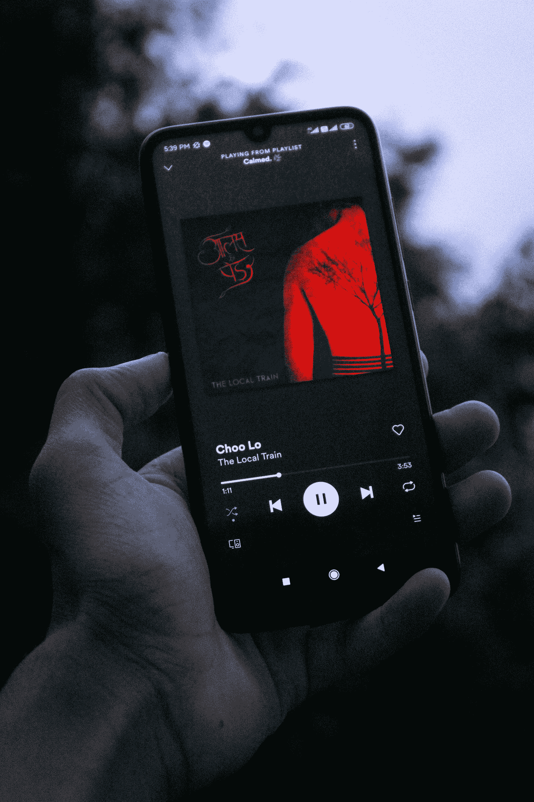
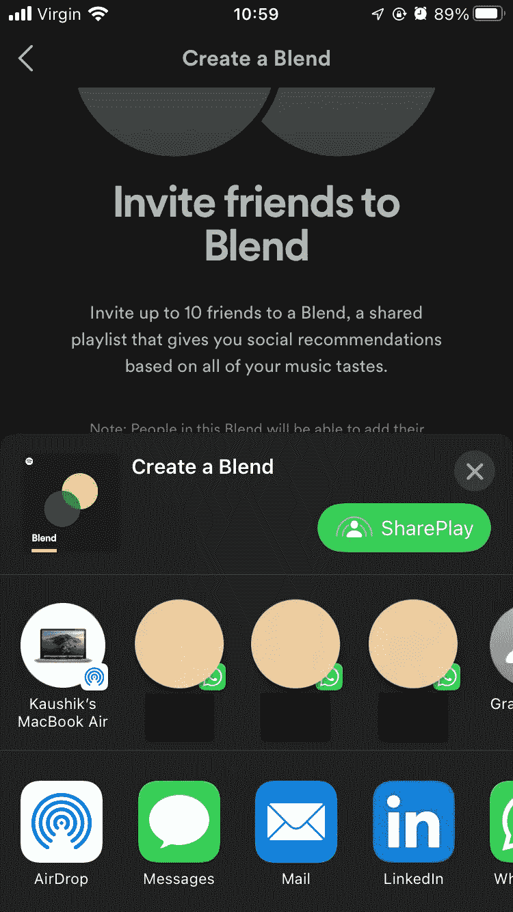
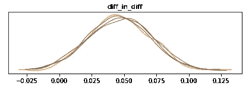
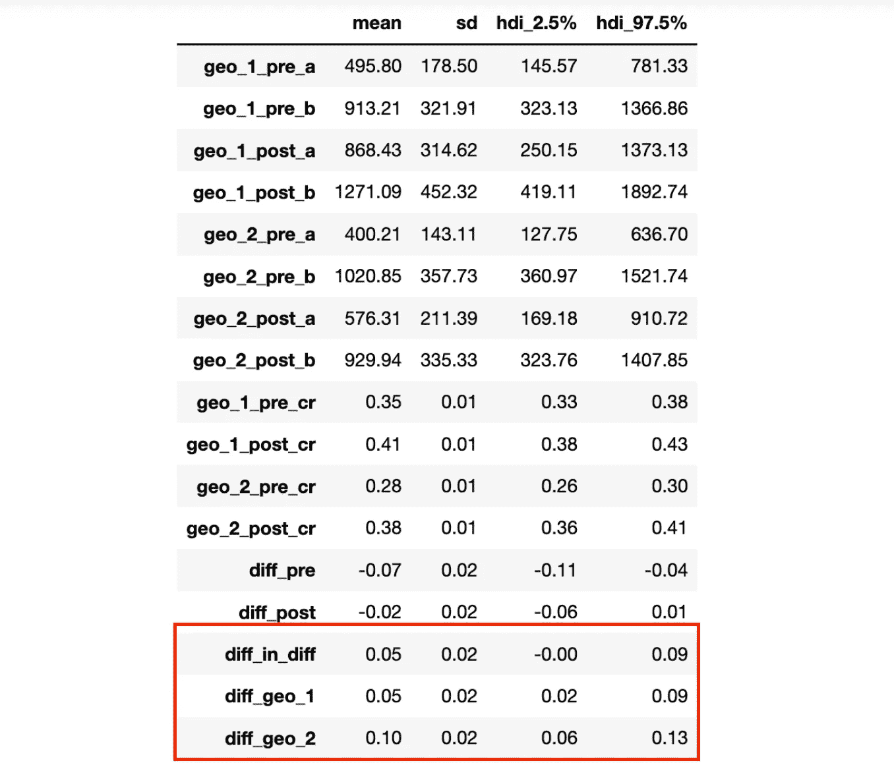

# Geo Lift 实验 II: Spotify Blend 案例研究

> 原文：<https://towardsdatascience.com/geo-lift-experiments-ii-spotify-blend-case-study-476a81099744>

## 这是两部分系列的第 2 部分，介绍产品环境中的 geo lift 实验:

1.  [理解差异中的差异](/geo-lift-experiments-i-understanding-difference-in-differences-5f35e41a2fdb)
2.  Spotify Blend 案例研究

在这一部分，我们将把我们在[第一部分](/geo-lift-experiments-i-understanding-difference-in-differences-5f35e41a2fdb)中探索的内容应用到案例研究中。让我们深入案例研究。



照片由[迪帕克·乔杜里](https://unsplash.com/@deepak_jpeg?utm_source=medium&utm_medium=referral)在 [Unsplash](https://unsplash.com?utm_source=medium&utm_medium=referral) 拍摄

## 产品背景:Spotify Blend

假设我们是 Spotify 播放列表体验团队的项目经理。对于任何不熟悉这个功能的人来说，这是一个允许用户与他们选择的朋友创建播放列表的功能。然后，播放列表会自动生成用户及其朋友都喜欢的歌曲。它还向用户显示他们的音乐品味和朋友的音乐品味之间的匹配分数。当用户收听新音乐时，该品味匹配分数改变，并且播放列表提供的推荐变得更好。

作为这个特性的项目经理，让我们假设我们发现用户在设置混合的体验上有一些摩擦。邀请朋友加入 blend 时，会向用户显示一个本机共享模式，以便与朋友共享邀请链接(如下所示)。当朋友们点击与他们分享的链接时，他们就会被添加到混合中。让我们假设，查看数据，我们看到在用户点击邀请按钮和他们的朋友成功接受他们的邀请之间有相当大的落差。我们没有太多的数据来说明这到底是为什么，因为这可能是由于用户没有通过共享模式发送邀请。也可能是朋友没有回复邀请信息。



点击 Spotify Blend 功能上的邀请按钮时的原生共享模式。(图片由作者提供)

## 假设

我们假设，通过在 Spotify 应用程序中保持这种体验，用户更有可能成功邀请他们的朋友，并创建一个混合。我们希望更改这部分功能，允许用户通过用户名(或从关注者下拉列表中选择)搜索用户，以便将他们添加到混合中。作为一个数据驱动的项目经理，我们希望将此作为一个实验来验证我们的假设和假说。

## 问题

由于多个用户之间的交互对该功能至关重要，因此一个用户使用该功能的方式并不独立于另一个用户使用该功能的方式。因此，如果我们将此作为传统的 AB 测试来运行，将每个用户作为随机单元，那么我们将违反 SUTVA。从用户的角度来看，如果用户可以在 Spotify 中搜索并邀请他们的朋友，但他们的朋友在控制组中，看不到邀请，这将中断他们的体验，并影响他们使用该功能的方式。

解决这个问题的一个方法是将网络分成互相跟随的用户群，并在群集级别执行随机分配。然而，由于这是 Spotify 的首批多用户体验之一，让我们假设没有任何基础设施来运行这种类型的实验。就开发资源而言，建立基础设施的成本很高，我们希望更有资源来更快地迭代。

让我们假设，通过一些探索性的数据分析，我们发现 98%的用户只创建与来自他们自己地理位置的其他用户的混合。通过将我们的特征变化限制在特定的地理区域，我们非常接近于重建 SUTVA。因此，这似乎是一个地球同步轨道提升实验的绝佳候选。我们承认，地理提升实验的结果并不像我们要进行的社交聚类实验或如果我们 100%的用户只与来自他们自己地理的用户创建混合那样是一个强有力的因果关系指标。但是我们认为，如果把这个实验作为一个地理提升实验来运行，我们会得到这个变化的影响的一个很好的指示。

我们的控制地理位置将为`geo_1`，我们的治疗地理位置将为`geo_2`。我们将只在`geo_2`发布改变，我们相信这将增加点击邀请按钮的用户被至少一个朋友接受邀请的可能性。因此，我们的成功度量将是表示用户是否成功邀请 1 个朋友加入混合的转换度量。

## 混杂因素

让我们假设我们已经仔细地选择了`geo_1`和`geo_2`，这样我们可以控制的任何混杂因素都可以在两个地理区域一致地应用。任何可能对此功能的指标产生影响的普遍获得活动都适用于两个地区。

现在我们已经清楚了上下文，让我们假设我们已经运行了这个实验一段时间，并且已经收集了足够的数据。所以让我们深入分析一下。

## 分析

在开始分析之前，值得注意的是，这里使用的数据是人工生成的，因此已经是本练习的理想格式。在现实世界中，我们可能需要执行一些 ETL 操作来获得这种格式的数据。然而，这超出了本文的范围。这些数据也不代表 Spotify 的实际用户参与度数据。

让我们导入依赖项并研究实验数据。

```
import pandas as pd
import numpy as np
import pymc3 as pm
import theano.tensor as tt
import matplotlib.pyplot as plt
import arviz as azexperiment_data = pd.read_csv('experiment_data.csv')experiment_data.head()
```


我们看到数据包含一个散列来表示用户 Id，用户在哪个组中，转换后的列表示用户的邀请是否成功。让我们继续总结不同组的转化率。


我们将把每组的转换率建模为一个具有 Beta 分布的变量，就像我们之前在做[转换率的贝叶斯建模](/bayesian-ab-testing-part-i-conversions-ac2635f878ec)时所做的那样。我们不会通过检查来估计每个 Beta 分布的参数，而是将它们建模为 0 和相应组样本大小之间的均匀分布变量。所以让我们开始这样做:

```
diff_model = pm.Model()with diff_model:
    geo_1_pre_a = pm.Uniform('geo_1_pre_a', lower=0, upper=1367)
    geo_1_pre_b = pm.Uniform('geo_1_pre_b', lower=0, upper=1367)    

    geo_1_post_a = pm.Uniform('geo_1_post_a', lower=0, upper=1893)
    geo_1_post_b = pm.Uniform('geo_1_post_b', lower=0, upper=1893)

    geo_2_pre_a = pm.Uniform('geo_2_pre_a', lower=0, upper=1522)
    geo_2_pre_b = pm.Uniform('geo_2_pre_b', lower=0, upper=1522)    

    geo_2_post_a = pm.Uniform('geo_2_post_a', lower=0, upper=1408)
    geo_2_post_b = pm.Uniform('geo_2_post_b', lower=0, upper=1408)
```

既然我们已经对分布参数进行了建模，我们就可以对每个转换率的分布进行建模了。

```
with diff_model:
    geo_1_pre_cr = pm.Beta('geo_1_pre_cr', alpha=geo_1_pre_a, beta=geo_1_pre_b)

    geo_1_post_cr = pm.Beta('geo_1_post_cr', alpha=geo_1_post_a, beta=geo_1_post_b)    

    geo_2_pre_cr = pm.Beta('geo_2_pre_cr', alpha=geo_2_pre_a, beta=geo_2_pre_b)    

    geo_2_post_cr = pm.Beta('geo_2_post_cr', alpha=geo_2_post_a, beta=geo_2_post_b)
```

在对每个转换率进行建模后，我们现在可以对特性发布前后的差异进行建模，同时对差异中的差异进行建模，这就是我们的提升。

```
with diff_model:
    diff_pre = pm.Deterministic('diff_pre', (geo_2_pre_cr - geo_1_pre_cr))
    diff_post = pm.Deterministic('diff_post', (geo_2_post_cr - geo_1_post_cr))
    diff_in_diff = pm.Deterministic('diff_in_diff', diff_post - diff_pre)
```

既然我们已经对差异进行了分层建模，我们可以添加我们的观察值。但在此之前，我们不妨也对每个 geo 中的提升进行建模，以帮助我们更好地理解不同混杂因素导致的提升。

```
with diff_model:
    diff_geo_1 = pm.Deterministic('diff_geo_1', (geo_1_post_cr - geo_1_pre_cr))
    diff_geo_2 = pm.Deterministic('diff_geo_2', (geo_2_post_cr - geo_2_pre_cr))
```

最后，我们将观察到的转化率添加到模型中，然后对其进行采样。我们将这些转化率建模为伯努利变量，该变量使用之前建模的转化率作为转化率的概率。

```
with diff_model:
    geo_1_pre_conversions = pm.Bernoulli('geo_1_pre_conversions', p=geo_1_pre_cr, observed=conversion_values['geo_1_pre'])

    geo_1_post_conversions = pm.Bernoulli('geo_1_post_conversions', p=geo_1_post_cr, observed=conversion_values['geo_1_post'])    

    geo_2_pre_conversions = pm.Bernoulli('geo_2_pre_conversions', p=geo_2_pre_cr, observed=conversion_values['geo_2_pre'])    

    geo_2_post_conversions = pm.Bernoulli('geo_2_post_conversions', p=geo_2_post_cr, observed=conversion_values['geo_2_post'])trace = pm.sample()
```

一旦模型被采样，我们就可以绘制采样分布图。

```
with diff_model:
    az.plot_trace(trace, compact=False)
```



查看`diff_in_diff`图，隆起很可能大于 0，隆起的最高概率约为 5%。

我们现在可以检查所有模型的统计数据，并了解它们的 95%可信区间在哪里。

```
with diff_model:
    display(az.summary(trace, kind='stats', round_to=2, hdi_prob=0.95))
```



特别是，我们想看看最近 3 个模型的统计数据— `diff_in_diff`、`diff_geo_1`和`diff_geo_2`。

看起来我们的`diff_in_diff`平均值为 5 %, 95%的可信区间在 0-9%之间。因此，虽然这一变化很可能确实影响了用户邀请的成功程度，但也很可能只是很小的影响。

查看我们的控制地理，`diff_geo_1`表明在`geo_2`发布变更前后平均有 5%的差异，95%可信区间位于 2–9%之间。由于这个原因，我们没有发布特性变化，这种变化很可能是由于混杂因素造成的。

## 结论

虽然看起来我们想要测试的变化可能对用户的邀请有多成功产生了影响，但这种影响可能非常小。如果我们对此次升级感到满意，我们可以将该功能推广到多个地区，并持续监控成功指标。然而，如果我们觉得影响太小，我们可以重新评估我们的假设，想出其他方法来改善用户体验。

感谢阅读这篇文章！我希望它能帮助你更好地理解当传统的实验不起作用时，如何用这种方法来测试真实的产品特性。

*如果你喜欢阅读我的文章，愿意支持我的写作，并且正在考虑订阅一个媒体，请随时使用我下面的推荐链接。我会从你的订阅费中提成。*

[](https://medium.com/@kaushsk12/membership) [## 通过我的推荐链接加入 Medium

### 阅读 Kaushik Sureshkumar(以及媒体上成千上万的其他作家)的每一个故事。您的会员费直接…

medium.com](https://medium.com/@kaushsk12/membership)