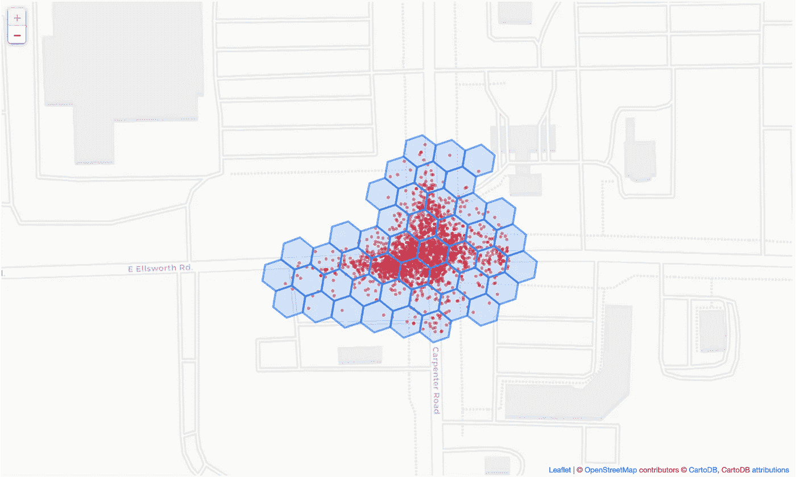
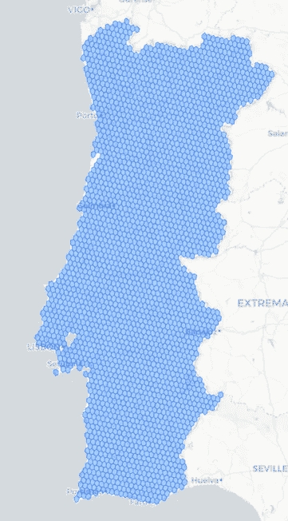
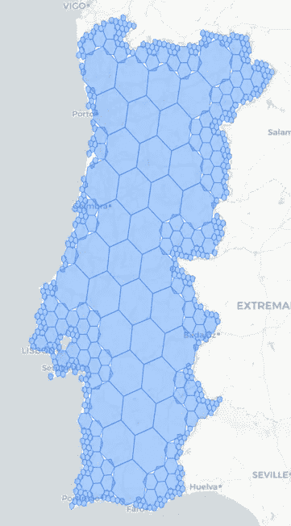
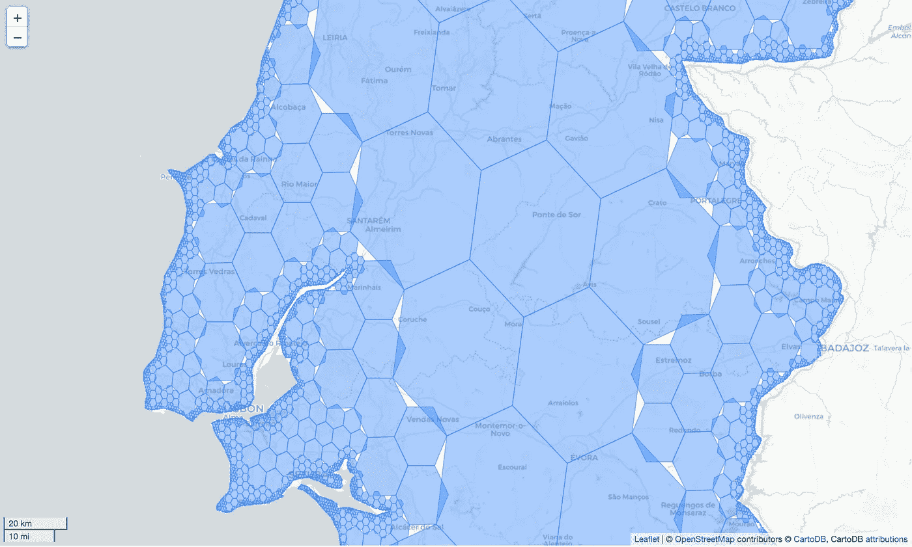
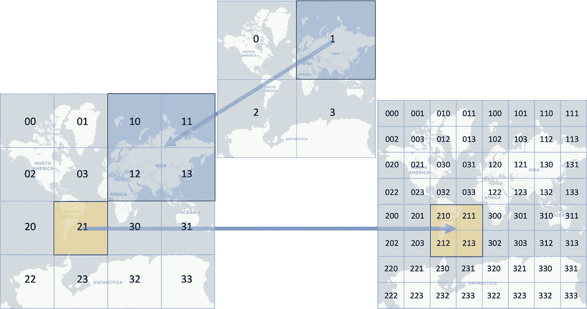
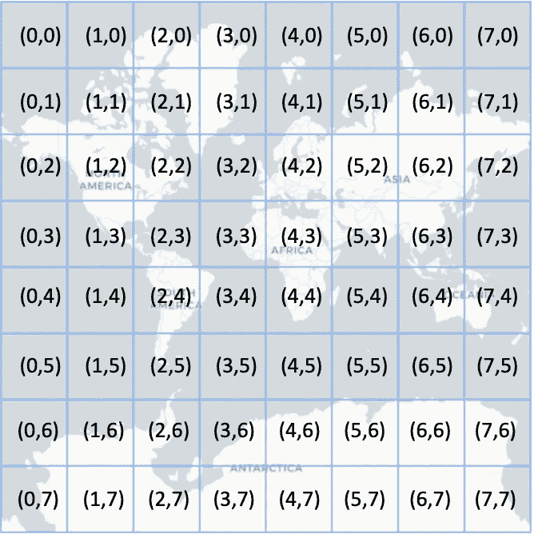

# 带四键的地理围栏

> 原文：<https://towardsdatascience.com/geofencing-with-quadkeys-7c5b9866ff98>

## 本文介绍了如何创建带有方形分区的地理围栏

上图显示了使用此处描述的算法对葡萄牙大陆进行的等级方形离散化。图片由作者用[叶子](http://python-visualization.github.io/folium/)包和 [OpenStreetMap](https://www.openstreetmap.org/) 图像制作。

地理围栏是划定任意地理区域的虚拟边界。我们使用这些构造来分类某个对象是否位于感兴趣的区域内，例如当我们想要确定一辆汽车是否进入了特定的停车场时。地理围栏不必与特定的物理位置相对应，可以传达更微妙的概念，如龙卷风走廊或禁飞区。

为了让地理围栏发挥作用，我们需要一些地理定位设备来报告感兴趣的对象在世界上的位置，并需要一种方法来定义围栏本身。我们通常使用地理空间多边形来处理这最后一点，其顶点是在纬度和经度空间中定义的位置。简单地说，当物体的跟踪设备报告一个我们可以用数学方法确定的位于多边形内部的位置时，物体就在围栏内部。在某种意义上，geofence 是一个二元分类器，用于确定对象相对于 geofence 内部的位置。

地理围栏系统传统上使用特定的存储和查询工具，这些工具允许从地理多边形到透明地映射地理空间顶点的内部表示的直接转换。这些系统是精确的，但是需要定制的存储和索引格式，这些额外的需求通常会降低存储空间和查询性能。例如，想想 [PostgreSQL](https://postgresql.org/) 扩展 [PostGIS](https://postgis.net/) ，它扩展了基本功能以添加地理空间处理特性，比如函数、数据类型和索引。

通常情况下，应用不需要高精度的地理围栏检测。想一想需要什么来确定你的一辆车是否进入了加油站。没有必要编码位置边界的所有细节，一个粗略的草图可能就是你所需要的，特别是如果它将使位置的编码*更简单*和检测*更快*。此外，如果您可以使用更轻便的地理围栏系统，您可能希望在您的 edge 物联网设备上实现它。

# 哈希备选方案

那么我们有什么选择呢？有趣的是，一些选项使用固定的分层地理空间网格，六边形或正方形。这些替代方法可以将 geofence 区域缩小到 64 位整数索引的列表，您可以轻松地存储和快速查询这些索引。您只需要一个常规的数据库或内存存储以及基本的集合包含逻辑就可以让这些替代方案发挥作用。

这些算法根据它们选择的几何形状将纬度和经度空间中的位置散列成唯一的整数。两者都是通过建立一个固定的层次地理空间网格来工作的，所以你必须接受一些近似误差。幸运的是，您可以使用这两种方法来离散大约 5 米或 16 英尺。

# 优步·H3 的选择

在其他文章中，我探索了优步的 H3(T1)的潜力，这是一种分层的六边形空间索引。这个空间索引系统是强大而轻便的，因为它是用 C 语言实现的，允许在边缘设备上使用。

</geospatial-indexing-with-ubers-h3-766399b690c>  </fast-geospatial-indexing-with-h3-90e862482585>  

由于其哈希特性，我们还可以使用 H3 来实现高速地理围栏查询。正如我在另一篇文章中所展示的，我们可以将地理围栏设想为一组 H3 指数，每个指数都有一个相关的空间六边形。下图显示了这个概念，其中我们用一组相连的 H3 指数来定义地理围栏。包含测试只是将位置转换为相关的 H3 指数，然后运行集合包含测试。

上图显示了如何从一组 H3 六边形设计地理围栏。地理围栏包含所有六边形和所有红点。为了测试任意点的包含性，我们需要将其转换为适当的 H3 指数，并执行集合包含测试。图片由作者用[叶子](http://python-visualization.github.io/folium/)包和 [OpenStreetMap](https://www.openstreetmap.org/) 图片制作。

请注意，存储这样的地理围栏是非常便宜的，每个六边形作为一个 64 位整数进行加权。上面描述的地理围栏只有 45 个这样的整数。但是当地理围栏变大时会发生什么呢？我们可以不断将六边形添加到不断增长的 geofence 中，但这种方法有一定的局限性，因为 H3 表示可能会比其他 geo-polygon 表示更加重要。

我们可能会选择使用更大的六边形尺寸来替代日益严重的地理围栏问题。正如你可以从优步的文档中看到的，H3 六边形等级意味着当增长到最接近的级别时，每个六边形代表较低级别的七个六边形。但是这种选择是以丢失细节为代价的。

然而，优步·H3 API 确实提供了一个解决方案，允许我们在层次结构中混合和匹配不同级别的六边形。下面两张葡萄牙大陆的图片展示了这一过程是如何进行的。

上图显示了离散为 2，769 个 6 级 H3 六边形的葡萄牙大陆地图。图片由作者用[叶子](http://python-visualization.github.io/folium/)包和 [OpenStreetMap](https://www.openstreetmap.org/) 图像制作。

上图显示了将葡萄牙大陆地图离散为 2，769 个六级六边形。优步提供了将这些六边形合并到更高级别的六边形以填充整个地理围栏形状的选项。我们可以在下图中看到这个过程的结果。

通过压缩前一组 H3 六边形，我们将计数减少到 501。图片由作者用[叶子](http://python-visualization.github.io/folium/)包和 [OpenStreetMap](https://www.openstreetmap.org/) 图像制作。

这种方法的显著优点是，它将六边形的数量减少到 501，或整整一个数量级。缺点是，由于其固有的几何形状，六边形不会完全重叠，并且会有一些小区域未被覆盖。正如优步的文献所解释的那样，这种效应对于许多统计应用来说并不重要。但是当涉及到地理围栏时，上面的简化杀死了它。

下图更详细地说明了这种效果。

上图显示了葡萄牙大陆中央区域的 H3 压缩离散化。不同层次的六边形之间的差距非常明显。图片由作者用[叶子](http://python-visualization.github.io/folium/)包和 [OpenStreetMap](https://www.openstreetmap.org/) 图片制作。

这是地理围栏的相关问题吗？正如我在上面和之前的一篇文章中所展示的，如果你能忍受这种参差不齐的边缘，这种方法会非常有效。geofence 仅包含无缝连接的相同大小的六边形，因此不会出现包含检测错误。另一方面，对于较大的形状，压缩后的案例显示的间隙可能大到足以导致 geofence 包含检测错误。

# 四键选择

四键的几何结构确实解决了间隙问题。正如你从开始的图像中看到的，正如四键数学所暗示的，正方形的层次在不同层次的四键之间提供了紧密的配合。你可以从它的来源、[微软在线文档](https://docs.microsoft.com/en-us/bingmaps/articles/bing-maps-tile-system)和下面的文章中读到更多关于这个主题的内容。

</geospatial-indexing-with-quadkeys-d933dff01496>  

如下图所示，与 H3 不同，四键层次结构允许你紧密地适应不同层次的方块，没有重叠或死区。请注意，方形图块的固定位置意味着我们只能在层次结构中从较低到较高的级别(较低的缩放比例)合并特定的图块集。

上图展示了 Bing 地图切片系统的层次结构。图片由作者用[叶子](http://python-visualization.github.io/folium/)包和 [OpenStreetMap](https://www.openstreetmap.org/) 图片制作。

上图揭示了四键的两个优秀特性。首先，四键代码是以四进制表示的整数，这意味着每个“缩放”级别需要两个额外的位来表示。第二，每个四键对应于一个更大的地图上的一个图块，我们可以把它想象成一个位图，每个图块作为一个“像素”我们将在这里使用这两个特性。

## 数字四键编码

让我们注意，它需要一个数字(0、1、2 或 3)来表示缩放级别。我们在将四键描述为字符串时使用这种方法，因为它方便地打包了图块位置信息和缩放级别(字符串长度)。

通过认识到每个数字只需要两位来编码，我们也可以将这种表示转换成二进制整数。如果我们保持在线地图通常可用的最大 23 个缩放级别，我们需要 48 位来存储完整的四键哈希。有足够的空间来保存缩放级别，只需要五位。这是一个可能的编码的公开提议:

<https://github.com/joekarl/binary-quadkey>  

就个人而言，我会颠倒编码设计，在低位保留散列，在高位保留缩放级别。这种方法会使下面需要的一些数学运算变得更容易。

为了简单起见，我们将使用基本编码，仅使用低 48 位来存储散列，并在其他地方保持缩放级别。这种方法使得代码更容易实现和遵循。

## 隐式位图

如前所述，我们可以认为四键仅仅是地理空间散列，地图上的方块，或者是*位图*上的*像素*。下图显示了 EaEarth 的 sap 是一组 8x8 的瓦片。为什么不是 8x8 的位图，我们可以在上面画线和多边形？

上图显示了缩放级别为三的 Bing 地图切片。请注意，我们可以将这些看作数组或位图。图片由作者用[叶子](http://python-visualization.github.io/folium/)包和 [OpenStreetMap](https://www.openstreetmap.org/) 图像制作。

位图概念在高缩放级别时变得非常有用，在这种情况下，每个图块都像我们喜欢的那样小，我们可以使用它们来“绘制”对应于地理围栏区域的填充多边形。当然，这幅画是一个虚拟的概念。通过“绘制”一个像素，代码将向给定缩放级别的现有集合添加一个四键代码。

将附近的瓷砖合并成更大的瓷砖是一个简单的过程。请参考前面说明缩放操作的图像。请注意，当绘制索引值以数字 3 结束的四键(最后两位设置)时，我们可以检查相邻三个图块的存在。当绘制图块“213”时，我们可以检查是否存在“212”、“211”和“210”如果这些图块存在，代码可以用图块“21”替换它们，并将其放置在适当的缩放级别设置上。如果适用，重复该过程。

现在我们可以看看在位图上绘制填充多边形的过程。

## 在位图上绘制填充多边形

我们首先为多边形顶点选择一个合适的表示。您可以使用可用的 [GitHub 库](https://github.com/joaofig/quadkey-geofence)来跟踪实现。我们从通用[多边形填充脚本](https://github.com/joaofig/quadkey-geofence/blob/main/polyfill.py)的代码开始。

上面的类存储多边形顶点的每个实例。(图片来源:作者)

该算法的第一步包括从多边形顶点到边的转换。下面的代码显示了如何存储多边形的边。

多边形边需要特定的顺序，填充算法才能发挥最佳效果。(图片来源:作者)

暂时不要担心“活动边缘”。我们将在后面讨论这个概念。

对于每条边，我们收集 y 坐标的最小值和最大值、与最小值 *y* 相关的 x*值以及边斜率的倒数。存储多边形边信息的类对填充算法所需的特殊排序方法进行编码。此功能与选择接下来要加工的边相关。*

为了创建多边形边，我们使用一个专用函数来计算所需的属性，并将它们存储在目标存储对象上。所有这些值将帮助多边形填充算法决定下一条水平线的起点和终点。

上面的代码使用连续的顶点对创建边。(图片来源:作者)

每对连续的顶点都转换成一条多边形边，如以下代码所示:

上面的函数将顶点序列转换成相应的边序列。注意代码是如何复制第一个点来闭合多边形的。(图片来源:作者)

请注意，该函数会过滤掉任何水平边缘(参见第 9 行)。该测试明确地避免了生成边的代码被零除的可能性，并反映了多边形填充算法是如何工作的:通过顺序填充水平线。增加这样的边是多余的。

我们现在可以看看绘制填充多边形的代码。这里我们使用一个 [NumPy](https://numpy.org/) 数组作为位图。我们首先确定多边形的边，创建支持数组和活动边列表。这个列表是算法工作的基础。

上面的代码包含了位图的多边形填充算法，这里实现为 NumPy 数组。(图片来源:作者)

在第 12 行，代码进入一个循环，遍历所有扫描行，并为每一行设置一个活动边列表。活动边缘与当前绘制的扫描线相交。我们使用一个不同的数据结构来保存这些，因为算法强加了可变性(见第 30 行)。

上面的类定义了活动边的属性。(图片来源:作者)

该算法使用两个函数来管理活动边缘的列表，一个函数插入其最小值 *y* 等于当前扫描线的边缘，另一个函数移除不再与其相交的活动边缘。

请注意，第一个函数在插入时将边转换为活动边。它对边列表进行操作，并返回活动边列表。第二个函数仅适用于活动边。(图片来源:作者)

在更新和排序活动多边形边的列表后，算法可以绘制所需的水平线。内部循环处理成对的活动多边形边，并在它们之间绘制一条水平线。在外循环的最后，代码更新所有有效边沿的 *x* 位置。

下面是调用多边形填充函数的方法:

上面的代码定义了一个任意多边形，将其转换成 NumPy 数组，最后显示出来。(图片来源:作者)

这是结果:

上图显示了运行前一幅图像的代码的结果。(图片来源:作者)

现在，我们已经了解了如何在位图上绘制填充多边形，让我们将该过程扩展到使用不同缩放级别的四键生成 geofence。

## 用四键绘制填充多边形

可以想象，将地理多边形转换为一组四键类似于上面的算法。这个过程在概念上非常简单。我们从要编码的地理多边形开始，使用提供的[比例表](https://docs.microsoft.com/en-us/bingmaps/articles/bing-maps-tile-system#ground-resolution-and-map-scale)确定目标细节级别，将所有地理多边形顶点转换为图块坐标，然后绘制填充的多边形。在此过程中，我们递归地将图块聚集到较高的细节级别，从而减少最终的图块数量。请遵循[地理多边形四键填充脚本](https://github.com/joaofig/quadkey-geofence/blob/main/quadkeyfill.py)上的代码。这个脚本类似于前面的脚本，但是它不是显示位图，而是将生成的四键保存到数据库中。关于这个问题的更多信息，请参见[库文档](https://github.com/joaofig/quadkey-geofence)。

我们首先将一个多边形定义为一组有序的空间坐标，并对源多边形使用纬度和经度空间坐标。这个空间是连续的，纬度从-90 到 90 度，经度从-180 到 180 度。

下一步需要将这些坐标离散到一个等距空间，其粒度取决于我们想要达到的细节水平。根据经验，我使用微软提供的[地面分辨率表](https://docs.microsoft.com/en-us/bingmaps/articles/bing-maps-tile-system#ground-resolution-and-map-scale)来粗略估计每个“像素”的大小。选择名为“*地面分辨率(米/像素)*的第三列的值，并将其值乘以 256，这是“滑动地图”图块的标准大小。得到的值是赤道上“像素”宽度的合理估计，单位为米。在 20 级和零纬度，每块瓷砖的尺寸为 38 米(约 125 英尺)。随着远离这些纬度(向北或向南)，像素大小将会减小。

该算法首先将纬度和经度上的所有源数据点转换到目标离散空间。每个坐标现在是一个整数对，而不是实数对。如前所述，离散化取决于“缩放级别”

坐标之间的转换是一个两步过程。首先，我们将纬度和经度转换为所需级别的四键。接下来，我们提取四键瓦片坐标。

上面的函数实现了从纬度和经度到指定细节级别的图块坐标的两步转换过程。(图片来源:作者)

在按顺序通过所有地理多边形顶点运行此转换后，我们就可以使用栅格多边形填充算法了，该算法与上一节中的算法非常相似。它通过从最小(顶部)到最大(底部)循环通过所有离散扫描线( *y* 坐标)来工作。该函数绘制的“画布”是一个*字典*，它将一个细节级别映射到同一级别的整数编码四键的*集合*。让我们通过下面的代码来遵循算法逻辑。

上面的代码显示了四键多多边形填充功能。主循环从上到下遍历扫描线，同时管理活动边。(图片来源:作者)

该函数首先使用下面的代码从多边形中收集边的列表。注意除了边缘列表，该函数如何返回扫描线 *y* 坐标范围。

(图片来源:作者)

接下来，我们进入主循环，遍历离散化的 *y* 坐标范围。除了像素绘制(第 20 到 24 行)之外，代码与我们之前看到的类似。如你所见，我们使用了两种不同的绘图功能，一种用于偶数扫描线，另一种用于奇数扫描线。原因是偶数编号的扫描线没有提供机会来合并附近的图块以生成较低分辨率的图块(请参见上面的讨论)。

上面的代码显示了偶数扫描线生成函数。请注意，它只是用四键范围更新缩放级别设置。(图片来源:作者)

下面的函数将图块坐标转换为四键索引，如上所述。

上面的代码显示了如何在给定的缩放级别将图块坐标转换为四键索引。注意，我们生成的位序列没有添加电平数据。(图片来源:作者)

奇数扫描线绘图功能更有趣，因为它必须处理合并图块的可能性。

上图包含了在奇数扫描线上绘图的函数。这些扫描线是图块合并的候选。(图片来源:作者)

它不仅仅更新缩放级别集，而是遍历生成的四键并调用一个专门的函数。对于每个要插入的四键，该函数测试一个终止数字“3”，这是潜在扩展的签名。如果是，它还会测试相邻四键的缩放级别设置。请注意简化的四键代码二进制编码是如何有用的:

上面的代码执行隐式递归图块扩展和插入。(图片来源:作者)

扩展四键包括移除相邻键，并在上面的缩放级别中插入一个更大的键。代码遍历缩放级别，直到无法再找到要展开的四键。

结果是一个 Python 字典，其中缩放级别作为键，缩放级别集作为值。下面的函数显示了如何将新生成的围栏插入数据库。

上面的代码在数据库中以相同的名称插入了一个区域列表。这种方法对于具有多个多边形的国家边界非常有用。(图片来源:作者)

## 询问

我们现在可以开始查询生成的数据，在这种情况下，通过填充的数据库。这个想法很简单:给定纬度和经度空间中的任意位置，我们想要确定它属于哪个地理围栏(如果有的话)。但是首先要克服一个障碍。我们已经生成了各种缩放级别的四键，那么我们如何知道对任意位置使用哪一个呢？

简单的回答是我们不知道，所以我们查询所有的缩放级别。这个解决方案并不像看起来那么复杂，而且，如果有合适的索引，它也很快。让我们看看如何进行查询。

我们的第一步是确定我们的数据库包含哪些缩放级别。这里，我们在实例化数据库对象时这样做。

数据库查询示例代码。(图片来源:作者)

查询过程从使用存储的最大缩放级别将纬度和经度坐标转换为四键开始。接下来，代码将四键转换为编码整数，包含值和缩放级别。我们去掉最后一个，然后把散列转移到适当的位置。接下来，对于所有当前缩放级别，代码生成一个相应四键值的列表。我们确信所有这些四键都包含输入位置。最终的数据库查询非常简单。只需使用一个集合包含子句。

请注意，为了让这个查询在大规模运行时表现良好，我们需要向表中添加一个适当的索引。对于大规模数据集，我们甚至可以考虑发出并行查询，通过四键前缀分割表以限制索引大小，等等。

# 结论

地理围栏是地理空间分析行业的工具之一。我们已经看到了它们的常规实现，并讨论了它们的缺点。我们还提出了基于散列或网格的替代方案:基于六边形的优步 H3 和基于正方形的四键。我们看到了 H3 如何合并不同缩放级别的六边形，以及该解决方案如何将一些区域排除在地理围栏之外，从而导致潜在的检测错误。最后，我们看到了基于四键分层正方形的替代方案如何通过生成无缝瓦片集来工作，以及如何高效地查询这些瓦片集。

我希望你喜欢这篇文章！

# 参考

## Git 储存库

<https://github.com/joaofig/quadkey-geofence>  

## 地理空间哈希

[H3:优步城市等级空间索引](https://eng.uber.com/h3/)

[必应地图磁贴系统—必应地图|微软文档](https://docs.microsoft.com/en-us/bingmaps/articles/bing-maps-tile-system)

[🌐微软(github.com)提出的使用四键的地理平铺的 Python 实现](https://github.com/muety/pyquadkey2)

## 多边形填充

[多边形填充教学工具](https://www.cs.rit.edu/~icss571/filling/how_to.html)

[高效扫描线多边形填充算法(PDF)的实现](https://core.ac.uk/download/pdf/234644791.pdf)

[扫描线填充算法(PDF)](https://scholar.cu.edu.eg/?q=ehesham/files/scanlinefill.pdf)

[扫描线填充算法—加州大学戴维斯分校(PDF)](https://web.cs.ucdavis.edu/~ma/ECS175_S00/Notes/0411_b.pdf)

## 国界

<https://github.com/datasets/geo-countries>  

[国家多边形作为 GeoJSON —数据集—数据中心—无摩擦数据](https://datahub.io/core/geo-countries)

[世界行政边界—国家和领土— Opendatasoft](https://public.opendatasoft.com/explore/dataset/world-administrative-boundaries/export/)

joo Paulo Figueira 在葡萄牙里斯本的[TB . LX by Daimler Trucks and bus](https://tblx.io/)担任数据科学家。