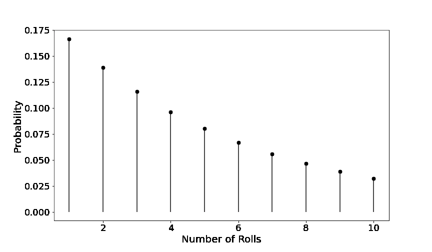

# 简单解释了几何分布

> 原文：<https://towardsdatascience.com/geometric-distribution-simply-explained-9177c816794f>

## 几何分布的简单描述和用途


莫里茨·金德勒在 [Unsplash](https://unsplash.com?utm_source=medium&utm_medium=referral) 上拍摄的照片

# 介绍

在这篇文章中我想讨论一个统计学中常见且容易理解的分布， [**几何分布**](https://en.wikipedia.org/wiki/Geometric_distribution) 。这种分布被用于许多行业，如金融、体育和商业。因此，如果您是一名数据科学家，了解这一点非常重要。

在本帖中，我们将详细介绍它的定义、直觉、一点数学知识，最后在一个例题中使用它。

# 定义、属性和类型

几何分布是一种离散的概率分布，它推断出我们在获得成功之前需要进行的 [**伯努利试验**](https://en.wikipedia.org/wiki/Bernoulli_trial) 的次数的概率。伯努利试验是指单个事件只有两种结果:以一定的固定概率成功或失败。

几何分布通常被称为离散版的 [**指数分布**](https://en.wikipedia.org/wiki/Exponential_distribution) **。如果你想了解指数分布，我之前写过一篇关于它的短文，你可以在这里找到:**

[](/exponential-distribution-simply-explained-349d05b1bdb8)  

实际上有两种不同类型的几何分布:

*   首先是获得成功所需的试验次数**。**
*   二是成功前的**失败次数**。

第一种被称为**移位几何分布。**

实际上，这两种方法都可以使用，但需要从一开始就明确区别，以确保结果的一致性。

在本文中，我们将使用移位版本，因为我觉得它更容易用数学和直觉来处理。

几何分布的一个关键性质是它是[](https://en.wikipedia.org/wiki/Memorylessness)**无记忆的。这意味着，仅仅因为上一个结果是失败的，下一个就不太可能成功。这是因为每个伯努利轨迹都是独立的[](https://en.wikipedia.org/wiki/Independence_(probability_theory))**。****

# ****数学细节****

****由于几何分布与伯努利分布[和**二项式分布**](https://en.wikipedia.org/wiki/Binomial_distribution) 密切相关，其 [**概率质量函数(PMF)**](https://en.wikipedia.org/wiki/Probability_mass_function) 呈现类似的形式:****

********

****作者在 LaTeX 中生成的方程。****

****其中 ***p*** 是成功的概率， ***n*** 是获得成功所需的事件数。****

****[**【均值】**](https://en.wikipedia.org/wiki/Expected_value) 简单来说就是:****

********

****作者在 LaTeX 中生成的方程。****

****其中 ***p*** 是再次试验成功的概率。****

****让我们通过一个例子让这个理论更具体。****

# ****示例和图表****

****在常规六面模具上**第五**辊出一个 **4** 的概率有多大？****

****在这种情况下我们有:***n = 5******p = 1/6。*** 把这个代入上面的 PMF，我们发现概率为:****

********

****作者在 LaTeX 中生成的方程。****

****这种情况下的期望值是:****

********

****作者在 LaTeX 中生成的方程。****

****这意味着我们希望使用模具在第六个**辊**上轧制一个 **4** 。****

****我们还可以使用 Python 为一系列试验绘制这个场景，***【n】****:*****

```
***# Import packages
from scipy.stats import geom
import matplotlib.pyplot as plt# Probability and Number of Trials
n = [1, 2, 3, 4, 5, 6, 7, 8, 9, 10]
p = 1/6# Generate the PMF
dist = geom.pmf(X, p)# Plot the distribution
plt.figure(figsize=(12, 7))
plt.scatter(n, dist, linewidth=2, color='black')
plt.xticks(fontsize=18)
plt.yticks(fontsize=18)
plt.ylabel('Probability', fontsize=20)
plt.xlabel('Number of Rolls', fontsize=20)
plt.vlines(n, 0, dist, colors='black', linewidth=2, alpha=0.7)
plt.savefig('plot.png')
plt.show()***
```

**********

*****作者用 Python 生成的图。*****

*****我们观察到掷出 4 的概率随着掷骰数的增加而呈指数下降。这是有道理的，因为我们的第一个 4 不太可能发生在第 100 次滚动中。*****

*****这种概率相对于成功所需试验次数的指数下降是几何分布 PMF 的一般形式。*****

# *****结论*****

*****在本文中，我们讨论、解释并绘制了几何分布图。要记住的关键点是，几何分布计算连续伯努利试验失败指定次数后的成功概率。*****

# *****和我联系！*****

*   *****要在媒体上阅读无限的故事，请务必在此注册！T3*💜******
*   *****[*当我在这里发布注册邮件通知时，可以获得更新！*](/subscribe/@egorhowell) 😀*****
*   *****[*领英*](https://www.linkedin.com/in/egor-howell-092a721b3/) 👔*****
*   *****[*推特*](https://twitter.com/EgorHowell) 🖊*****
*   *****[*github*](https://github.com/egorhowell)*🖥******
*   ******[](https://www.kaggle.com/egorphysics)**🏅********

> *******(所有表情符号由 [OpenMoji](https://openmoji.org/) 设计——开源表情符号和图标项目。许可证: [CC BY-SA 4.0](https://creativecommons.org/licenses/by-sa/4.0/#)*******