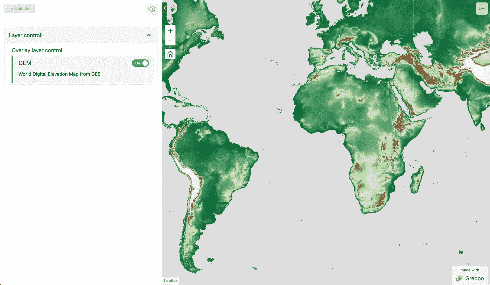
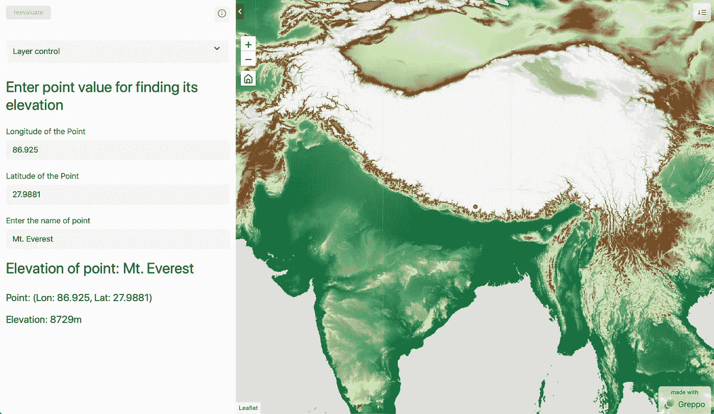

# 带有谷歌地球引擎和 Greppo 的地理空间应用程序

> 原文：<https://towardsdatascience.com/geospatial-app-with-google-earth-engine-and-greppo-2c166b373382>

## 如果没有丰富的 JavaScript 经验，使用 Google Earth 引擎是很困难的。Greppo 让您在 Python 中克服了这个问题。


使用 Greppo 和 GEE 的最终 web 应用程序。图片作者。

谷歌地球引擎是数据科学家工具箱中处理地理空间数据的一个神奇工具。然而，用 GEE 代码编辑器构建 web 应用程序需要很高的学习曲线。基于 JavaScript 的应用创建器需要专门从事 Python 开发的数据科学家投入大量时间

Greppo 是弥合这一差距的完美工具。

> 在这篇博文中，我将使用一个流行的 GEE 用例 DEM(数字高程模型)来构建一个 web 应用程序。我将带你了解 GEE 的基础知识、客户机-服务器模型、API 如何工作以及 GEE 数据模型。在这种背景下，这篇文章将使用 Greppo 创建一个使用 GEE 的 Python 接口的应用程序，并强调 Greppo 的心智模型和易于使用的界面。

***注:这里所有代码都是用 Python 写的。它们是从*** [***文档***](https://developers.google.com/earth-engine/guides?hl=en) ***中移植来的 GEE 的样本 JavaScript 代码。***

# 入门指南

在我们开始之前，你需要访问谷歌地球引擎。按照此处的说明[注册](https://earthengine.google.com/signup/)并获得访问权限。

以下是关于 Greppo 及其使用方法的快速教程:

</build-a-geospatial-dashboard-in-python-using-greppo-60aff44ba6c9>  

接下来，让我们设置 Python 环境来安装依赖项。要理解什么是 Python 环境以及如何设置它，请阅读这篇。将以下包安装到 Python 环境中。

```
pip install earthengine-api greppo
```

web-app 的代码将放入 ***app.py、*** 中，通过命令行使用命令`greppo serve app.py`服务并运行 app。

> 注意:要在命令行中运行`greppo`命令，需要激活安装了 greppo 的 python 环境。app.py 文件可以被重命名为任何名称，但是在运行命令`greppo serve app.py`时一定要在这个文件夹中，或者在一个相对的文件夹结构`greppo serve /demo/folder/app.py`中。

Greppo 的 GitHub 库:[https://github.com/greppo-io/greppo](https://github.com/greppo-io/greppo)

如有任何问题，请使用“问题”在 [GitHub](https://github.com/greppo-io/greppo) 上联系我们，或在 [Discord 频道中点击](https://discord.gg/RNJBjgh8gz)。

## GEE 认证和初始化

为了能够使用谷歌地球引擎，你需要创建一个服务帐户，并获得与该帐户相关的访问密钥文件。这只需要几分钟的时间，但是请确保按照说明正确操作。遵循此处的说明[。要使用服务帐户和密钥文件，请使用以下代码进行初始化。](https://developers.google.com/earth-engine/guides/service_account?hl=en)

> 注意:确保将 key-file.json 保存在另一个位置，最好安全地保存在您计算机的根文件夹中，不要提交到公共存储库中。

# 了解 GEE 的客户机-服务器模型

正如 GEE 的开发者文档所说，Earth Engine 不像你以前用过的任何 GIS 或地理空间工具。GEE 主要是一个云平台，所有的处理都在云中完成，而不是在你的机器上。您将与 GEE 进行的交互仅仅是翻译并发送到 GEE 云平台的指令。为了更好地理解这一点，我们必须通过 GEE 的客户端与服务器及其懒惰计算模型。

## [客户端与服务器](https://developers.google.com/earth-engine/guides/client_server)

先说我之前提到的， ***GEE 主要是一个云平台*** 。它让你在云中完成所有的处理。那么，你如何访问这个处理功能呢？

这里是`earthengine-api`库派上用场的地方。Python 包`earthengine-api`向客户机(也就是您)提供对象，作为在云中传递和处理的服务器对象的代理。

为了更好地理解客户机-服务器模型，让我们以客户机中的一个字符串变量和服务器中的一个字符串变量为例。在客户端创建一个字符串并打印它的类型时，我们得到 Python `class str`对象来表示一个字符串。如果我们想将一个字符串发送到服务器，以便在云中使用或操作，我们可以使用`ee.String`将数据包装在一个代理容器中，该容器可以在服务器中读取。更具体地说，`ee. objects`是一个`ee.computedObject`，它是代理对象的父类。

```
>> # Client side string
>> client_string = 'I am a Python String object'
>> print(type(client_string))
<class 'str'>>> # Server side string
>> server_string = ee.String('I am proxy ee String object!');
>> print(type(server_string))
<class 'ee.ee_string.String'>
```

代理对象不包含任何实际数据或处理功能/算法。它们只是服务器(云平台)上对象的句柄，仅仅是传达要在服务器上执行的指令。可以把它想象成一种使用代码与服务器通信的方式，要做到这一点，您需要将数据和指令包装在特定类型的`ee.computedObject`容器中。

当对数据执行循环或使用条件语句时，这种理解变得更加重要。为了执行这些，指令将被发送到服务器来执行它们。要了解这些是如何实现的[查看本页](https://developers.google.com/earth-engine/guides/client_server)了解更多细节。

## [惰性计算模型(延迟执行)](https://developers.google.com/earth-engine/guides/deferred_execution)

因此，从上面我们知道`earthengine-api`包仅仅是向服务器发送指令。那么，死刑是如何以及何时执行的呢？

客户端库`earthengine-api`将所有指令编译成一个 JSON 对象并发送给服务器。但是，这不会立即执行。执行被*推迟*直到有对结果的请求。对结果的请求可以是一个`print`语句，或者是要显示的`image`对象。

这种随需应变的计算会影响返回给客户端(您是用户)的内容。来自 earthengine-api 的结果是一个指向要获取数据的 GEE tile 服务器的 url。因此，在提到的感兴趣区域内的图像被选择性地处理。感兴趣区域由客户端显示中地图的缩放级别和中心位置决定。而且，当您移动和缩放时，图像会被处理并发送到客户端进行查看。因此，图像是延迟计算的。

# 使用 Greppo 和 GEE

使用 Greppo 显示和可视化地球引擎图像对象是相当直接的，你需要使用的是:`app.ee_layer()`。在 GEE 中存储地理空间数据的基本数据类型是，

*   `Image`:地球引擎中的基础栅格数据类型。
*   `ImageCollection`:图像的堆叠或时间序列。
*   `Geometry`:地球引擎中的基本矢量数据类型。
*   `Feature`:带属性的`Geometry`。
*   `FeatureCollection`:一套`Feature`。

在理解了 GEE 的客户机-服务器和惰性计算模型之后，我们可以推断，这些数据类型是根据对其可视化的请求按需处理的。

## 那么，如何配合 GEE 使用 Greppo 呢？

最好用一个例子来解释。先说 app 的脚手架。你必须首先从`Greppo`导入`app`对象，因为这将是你与前端通信的入口点。然后你将不得不`import ee`，向地球引擎认证你自己，并用你的上述服务账户的凭证初始化你的会话。

接下来，让我们从从目录中选择数据集开始。这里，我们使用`USGS/SRTMGL1_003`来获取数字高程图。我们需要首先为 DEM 图像数据中所有大于 0 的值获取一个土地掩膜，为此我们使用`dem.get(0)`。接下来，我们需要在 DEM 上应用蒙版，只显示陆地，为此我们使用`dem.updateMask(dem.gt(0))`，并将结果指定为我们要显示的`ee_dem`。由于所有数据都存储为 int 16(32767 和-32768 之间的值的矩阵)，我们必须使用调色板来显示矩阵。

要添加调色板，我们创建一个可视化参数对象，其中包含生成 RGM 或灰度图像的指令。这里我们使用包含`Hex values:[‘006633’, ‘E5FFCC’, ‘662A00’, ‘D8D8D8’, ‘F5F5F5’]`的调色板，并将其线性映射到与指定的`min -> #006633`和`max -> #F5F5F5`相对应的值。

> 注意:存储在 DEM 中的数据是栅格，表示为矩阵，每个像元包含表示像元的点的高程(米)。

然后使用 Greppo 在 web 应用程序中可视化该地图，您只需使用`app.ee_layer()`。`ee_object`是地球引擎图像对象，`vis_param`是可视化参数字典，`name`对应于将在 web-app 前端使用的唯一标识符，`description`是可选的，为 app 用户提供额外的指导。关于这一点的更多内容可以在文档 [***这里***](https://docs.greppo.io/map-components/ee-layer.html) 中找到。



上述步骤中的 web-app 视图。图片作者。

# 端到端通信:完整的网络应用

到目前为止，我们已经看到了如何只在 Greppo 可视化地球引擎对象。然而，Greppo 能够在前端和后端之间进行复杂的交互。让我们用一个例子来寻找用户指定的一个点的高程。我们将使用 Greppo 的三个 API 特性。

*   `app.display()`:在前端显示文本或减价。
*   `app.number()`:前端的数字输入功能，供用户输入数值。它在后端绑定到的变量将被更新为用户指定的值。
*   `app.text()`:前端的文本输入功能，供用户输入数值。它在后端绑定到的变量将被更新为用户指定的值。

更多详情请参考 [***文档***](https://docs.greppo.io/index.html) 。

让我们从使用`app.display` ( `name`是惟一的标识符，值是显示的文本，可以是多行字符串)显示一些文本来指导 web 应用程序用户开始。之后，让我们使用`app.number()`创建两个数字输入，分别代表该点的经度和纬度。

`app.number()`接受 name、显示在前端的标识符和 value，value 是这个元素的默认值。接下来，我们也创建一个文本输入，使用`app.text()`和`name`和`value`获得点的名称，如前面提到的`app.number()`一样。

使用该点的纬度和经度，我们现在可以用可视化参数`color: ‘red’`为该点创建一个地球引擎几何图形对象。我们现在可以使用上面提到的`app.ee_layer()`来显示。

为了找到该点的高程，我们在 DEM 对象上使用地球引擎方法`sample`。我们对 DEM 中的点进行采样，以从 DEM 中获取属性。我们从输出中取出第一个点，并使用`.get`方法找到与属性`elevation`相关联的值。最后，我们编写了一个多行字符串来显示输出。

> 注意:要将地图居中到一个点，并在初始加载时缩放，使用`app.map(center=[lat, lon], zoom=level)`。



具有交互功能的网络应用视图。图片作者。

# 结论

我们的目标是使用 google earth engine 的数据和计算功能以及 Greppo 的 web 应用程序开发库，完全用 Python 创建 web 应用程序。我们了解了 GEE 的工作原理，了解了如何将 Greppo 与 GEE 集成。学会使用`app.ee_layer()`、`app.display()`、`app.number()`和`app.text()`创建一个完整的 web 应用程序，与前端和后端进行端到端的通信。

所有的演示文件都可以在这里找到:【https://github.com/greppo-io/greppo-demo/tree/main/ee-demo 

> 查看一下 [***GitHub 资源库:此处***](https://github.com/greppo-io/greppo)*为 Greppo 上最新更新。如果您的用例有错误、问题或功能请求，请联系 [Discord channel](https://discord.gg/RNJBjgh8gz) 或在 GitHub 上提出问题。用 Greppo 造了什么东西？贴 GitHub。*

*   *GitHub 库:[https://github.com/greppo-io/greppo](https://github.com/greppo-io/greppo)*
*   *文献:[https://docs.greppo.io/](https://docs.greppo.io/)*
*   *网址:[https://greppo.io/](https://greppo.io/)*

**注:文章原载* [*此处*](https://www.kdnuggets.com/2022/03/building-geospatial-application-python-google-earth-engine-greppo.html) *。**