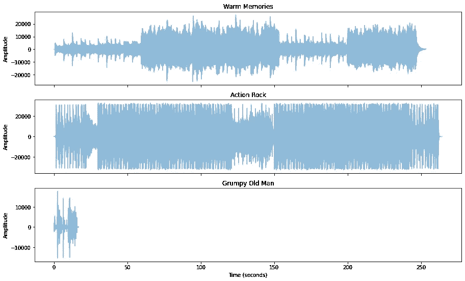
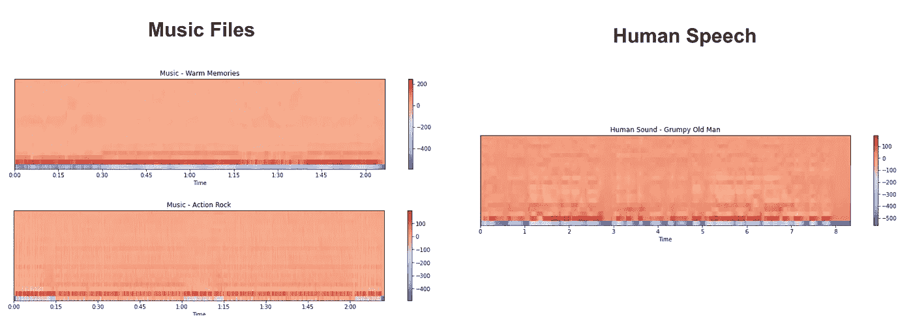

# 了解 Python 中的音频特征提取

> 原文：<https://towardsdatascience.com/get-to-know-audio-feature-extraction-in-python-a499fdaefe42>


理查德·霍瓦特在 [Unsplash](https://unsplash.com?utm_source=medium&utm_medium=referral) 上的照片

# 了解 Python 中的音频特征提取

## 探索音频文件的波形相关特征，以便在分析和 ML 中进一步使用

在大数据时代的兴起，我们可以收集比以往更多的数据。数据收集不再局限于数字格式的交易数据，而是出现了其他格式和结构，包括文本、图像、音频甚至视频格式。如果进行相应的处理和分析，我们可以在现有表格数字数据的基础上，使用这些多媒体数据生成更有价值的见解。在本文中，我将分享我们如何从音频文件中提取一些突出的特征，以便进一步处理和分析。

*本分析中使用的完整代码共享在* [*本 Github 项目*](https://github.com/oliviatan29/audio_feature_analysis) *下。*

# 音频文件和概念

在音频数据分析中，我们处理和转换由数字设备捕获的音频信号。根据它们被捕获的方式，它们可以是多种不同的格式，如 wav、mp3、m4a、aiff 和 flac。

引用[Izotope.com](https://www.izotope.com/en/learn/whats-the-difference-between-file-formats.html)的话，波形(wav)是**最流行的数字音频格式**之一。它是一种无损文件格式，这意味着它捕捉原始音频的最接近的数学表示，没有明显的音频质量损失。在 mp3 或 m4a(苹果的 mp3 格式)中，数据以这种方式被压缩，因此它可以更容易地分发，尽管质量较低。在音频数据分析中，大多数库支持 wav 文件处理。

作为波的一种形式，声音/音频信号具有以下一般属性:

*   **频率**:单位时间内振动的发生次数
*   **振幅**:波浪上一点从其平衡位置测得的最大位移或移动距离；影响声音强度
*   **声速**:声波在单位时间内传播的距离

从音频文件中提取的信息只是上述主要属性的变换。

# 音频文件的探索性分析

在这个分析中，我使用三个不同的音频文件来比较不同音频类型的不同数字音频特征。它们在 Chosic.com 和 Freesound.org 有售。

1.  [月之琴键的温馨回忆](https://www.chosic.com/download-audio/27281/)【1】—舒缓的钢琴主导音乐
2.  LesFM 的动作摇滚【2】—激烈的摇滚音乐
3.  [脾气暴躁的老人包](https://freesound.org/people/ecfike/sounds/131652/)由 ECF ike[3]——人类的简短发言

这些文件源的详细信息可以在本文末尾找到(参考资料部分)。

这些文件将主要用这些 Python 包来分析: [**librosa**](https://librosa.org/doc/main/index.html) 用于音频信号提取和可视化， [**pydub**](https://pypi.org/project/pydub/) 用于音频文件操作， [**wave**](https://docs.python.org/3/library/wave.html) 用于读取 wav 文件。

## 通用音频参数

就像我们通常通过获取数据的统计摘要(即使用" *Dataframe.describe* "方法)来开始评估表格数据一样，在音频分析中，我们可以从获取**音频元数据摘要**开始。我们可以利用 **pydub** 中的 **audiosegment** 模块来实现。

以下是一些可以提取的一般特征:

*   **通道**:通道数量；1 个单声道，2 个立体声
*   **样本宽度**:每个样本的字节数；1 表示 8 位，2 表示 16 位
*   **帧率/采样率**:使用样本的频率(赫兹)
*   **帧宽**:每个“帧”的字节数。一帧包含每个通道的样本。
*   **长度**:音频文件长度(毫秒)
*   **帧数**:样本的帧数
*   **强度**:以 dBFS 为单位的响度(相对于最大可能响度的 dB)

```
from pydub import AudioSegment# Load files
audio_segment = AudioSegment.from_file("Downloads/Warm-Memories-Emotional-Inspiring-Piano.wav")# Print attributes
print(f"Channels: {audio_segment.channels}")
print(f"Sample width: {audio_segment.sample_width}")
print(f"Frame rate (sample rate): {audio_segment.frame_rate}")
print(f"Frame width: {audio_segment.frame_width}")
print(f"Length (ms): {len(audio_segment)}")
print(f"Frame count: {audio_segment.frame_count()}")
print(f"Intensity: {audio_segment.dBFS}")
```

上述三个文件的参数值可以在下面找到。它们都是立体声文件，采样率为 44100Hz。由于它们具有相同的采样率，因此长度较长的**文件也具有较高的帧数**。这里有一个有趣的发现，即“动作摇滚”文件比其他文件有更高的强度值，因为与其他文件相比，它是具有明显的更高响度的摇滚音乐。


分析的三个音频文件的通用音频参数(图片由作者提供)

我们还可以将这些文件的**振幅随时间的变化**可视化，以了解波浪运动。

```
import wave# Open wav file and read frames as bytes
sf_filewave = wave.open('Downloads/Warm-Memories-Emotional-Inspiring-Piano.wav', 'r')
signal_sf = sf_filewave.readframes(-1)# Convert audio bytes to integers
soundwave_sf = np.frombuffer(signal_sf, dtype='int16')# Get the sound wave frame rate
framerate_sf = sf_filewave.getframerate()# Find the sound wave timestamps
time_sf = np.linspace(start=0,
                      stop=len(soundwave_sf)/framerate_sf,
                      num=len(soundwave_sf))# Set up plot
f, ax = plt.subplots(figsize=(15, 3))# Setup the title and axis titles
plt.title('Amplitude over Time')
plt.ylabel('Amplitude')
plt.xlabel('Time (seconds)')# Add the audio data to the plot
ax[0] = plt.plot(time_sf, soundwave_sf, label='Warm Memories', alpha=0.5)plt.legend()
plt.show()
```



振幅随时间变化的可视化(图片由作者提供)

## 衍生音频特征

转到更有趣的(尽管可能有点令人困惑:))特性。使用 [librosa](https://librosa.org/doc/main/index.html) 分析**音频特征**可以提取和可视化许多高级特征。

**声谱图**

提取的音频特征可以在声谱图上可视化。引用[维基](https://en.wikipedia.org/wiki/Spectrogram)的话，频谱图是信号的 [**频率**](https://en.wikipedia.org/wiki/Frequencies) **随时间**变化的 [**频谱**](https://en.wikipedia.org/wiki/Spectral_density) **的**直观表示。它通常被描述为[热图](https://en.wikipedia.org/wiki/Heat_map)，强度以不同的颜色梯度显示。****

```
import librosax, sr = librosa.load('Downloads/Warm-Memories-Emotional-Inspiring-Piano.wav')# Spectrogram of frequency
X = librosa.stft(x)
Xdb = librosa.amplitude_to_db(abs(X))
plt.figure(figsize=(15, 3))
librosa.display.specshow(Xdb, sr=sr, x_axis='time', y_axis='hz')
plt.colorbar()
```


温馨回忆音频文件声谱图(图片由作者提供)

垂直轴显示频率，水平轴显示剪辑的时间，颜色变化显示音频波的强度。

**均方根(RMS)**

这里的均方根是指信号的**总幅度，通俗地说可以解释为音频文件的 ***响度*或*能量*** 参数。**

```
y, sr = librosa.load(audio_data)# Get RMS value from each frame's magnitude value
S, phase = librosa.magphase(librosa.stft(y))
rms = librosa.feature.rms(S=S)# Plot the RMS energy
fig, ax = plt.subplots(figsize=(15, 6), nrows=2, sharex=True)
times = librosa.times_like(rms)
ax[0].semilogy(times, rms[0], label='RMS Energy')
ax[0].set(xticks=[])
ax[0].legend()
ax[0].label_outer()
librosa.display.specshow(librosa.amplitude_to_db(S, ref=np.max),
                         y_axis='log', x_axis='time', ax=ax[1])
ax[1].set(title='log Power spectrogram')
```

动作摇滚和暴躁老头文件的可视化结果如下所示。在这里，我们可以看到动作摇滚文件的 RMS 值始终很高，因为这种摇滚音乐始终响亮而强烈。另一方面，脾气暴躁的老人文件在响度上有平滑的上下波动，因为人类的语音自然会根据语音重点而有移动的音高和音量。


动作摇滚和暴躁老头文件的 RMS/能量谱图(图片由作者提供)

**过零率**

引用[维基百科](https://en.wikipedia.org/wiki/Zero-crossing_rate)，过零率(ZCR)是**信号从正到零再到负或者从负到零再到正**的速率。它的值已经广泛用于语音识别和音乐信息检索，是**对敲击声**进行分类的关键特征。像摇滚、金属、emo 或朋克音乐这样的高度打击乐声音往往具有较高的过零率值。

我们可以通过放大幅度时间序列中的某一帧，统计它在 y 轴上通过零值的次数，并对整个音频进行外推，来手动得到这个数据。或者，librosa 中有一个函数，我们可以用它来获得过零状态和速率。

```
y, sr = librosa.load('Downloads/Action-Rock.wav')
zcrs = librosa.feature.zero_crossing_rate(y)print(f"Zero crossing rate: {sum(librosa.zero_crossings(y))}")plt.figure(figsize=(15, 3))
plt.plot(zcrs[0])
plt.title('Action Rock')
```

以下是样本音频文件的过零点值和速率。在这里，我们可以看到动作摇滚文件的过零率明显高于温暖记忆文件，因为它是一首高度打击乐的摇滚歌曲，而温暖记忆是一首更平静的原声歌曲。


温暖记忆和动作摇滚文件的过零率(图片由作者提供)

**梅尔频率倒谱系数(MFCC)**

引用 [Analytics Vidhya](https://medium.com/analytics-vidhya/understanding-the-mel-spectrogram-fca2afa2ce53) 的话，人类不会线性感知频率。与高频相比，我们更擅长检测低频中的差异，即使差距是相同的(即“50 和 1，000 赫兹”对“10，000 和 10，500 赫兹”)。在**的梅尔音阶**、**中，等距离的音高在听者听来是等距离的**。

[Mel 频率倒谱系数(MFCC)](https://en.wikipedia.org/wiki/Mel-frequency_cepstrum)是声音的短期功率谱的表示，基于 Mel 尺度中的一些变换。它通常用于语音识别，因为人们的声音通常在一定的频率范围内，并且彼此不同。在 Librosa 中，获取和显示 MFCCs 非常简单。

```
x, sr = librosa.load('Downloads/131652__ecfike__grumpy-old-man-3.wav')
mfccs = librosa.feature.mfcc(x, sr=sr)# Displaying  the MFCCs:
plt.figure(figsize=(15, 3))
librosa.display.specshow(mfccs, sr=sr, x_axis='time')
```

人类语音的 MFCCs 值似乎比音乐文件更低且更动态。在下面的截图中，我们可以看到，与音乐文件相比，人类语音文件上有更多的深蓝色斑点以及不断变化的深红色和浅红色阵列。



音乐文件与人类语音的 MFCCs 可视化(图片由作者提供)

**色度**

我们可以使用[色度特征](https://en.wikipedia.org/wiki/Chroma_feature#:~:text=Chroma%2Dbased%20features%2C%20which%20are,to%20the%20equal%2Dtempered%20scale.)可视化来了解某个音高的**特征** {C，C♯，d，D♯，e，f，F♯，g，G♯，a，A♯，B}在采样帧中呈现的主导程度。

在下面的示例中，我们可以看到动作摇滚音乐文件有很强的 D 音阶，偶尔有 A 音阶。

```
x, sr = librosa.load('Downloads/Action-Rock.wav')hop_length = 512chromagram = librosa.feature.chroma_stft(x, sr=sr, hop_length=hop_length)
fig, ax = plt.subplots(figsize=(15, 3))
img = librosa.display.specshow(chromagram, x_axis='time', y_axis='chroma', hop_length=hop_length, cmap='coolwarm')
fig.colorbar(img, ax=ax)
```


动作摇滚音频文件的色度可视化(图片由作者提供)

**温度图**

[Tempo](https://en.wikipedia.org/wiki/Tempo) 指的是一段音频的**速度，通常以每分钟节拍(bpm)为单位来衡量。与古典音乐相比，像 hip-hop、techno 或 rock 这样的乐观音乐通常具有更高的节奏，因此节奏图特征对于音乐流派分类是有用的。**

可以使用下面的命令在 librosa 中计算它。

```
y, sr = librosa.load('Downloads/Warm-Memories-Emotional-Inspiring-Piano.wav')
hop_length = 512# Compute local onset autocorrelation
oenv = librosa.onset.onset_strength(y=y, sr=sr, hop_length=hop_length)
times = librosa.times_like(oenv, sr=sr, hop_length=hop_length)
tempogram = librosa.feature.tempogram(onset_envelope=oenv, sr=sr,
                                      hop_length=hop_length)# Estimate the global tempo for display purposes
tempo = librosa.beat.tempo(onset_envelope=oenv, sr=sr,
                           hop_length=hop_length)[0]
```

我们可以把节奏图中的速度想象成如下。在这里，我们可以看到一个摇滚音乐文件，它在整首歌中始终有一个高节奏，而与之相比的是一首结合了一些强节奏和弱节奏的舒缓歌曲。摇滚歌曲文件的整体速度约为 172bpm，而平静歌曲文件的速度约为 161bpm。


体温图可视化(图片由作者提供)

# 结束语

音频数据可能包含有价值的信息，这取决于分析师/工程师如何发现它们。这里分享的功能大多是技术音乐功能，可以**用于机器学习模型**而不是商业/产品分析。它们可以用于许多应用，从娱乐(对音乐流派进行分类)到商业(从客户电话中清除非人类语音数据)和医疗保健(识别心跳异常)。

*本分析中使用的完整代码共享在* [*本 Github 项目*](https://github.com/oliviatan29/audio_feature_analysis) *下。*

# 资源

要了解有关音频/音乐特征提取的更多信息，您可以浏览下面的资源。

[](https://link.springer.com/book/10.1007/978-3-540-74048-3) [## 音乐和动作的信息检索

### “现代信息社会正在经历数字内容的爆炸，包括文本、语音、视频和…

link.springer.com](https://link.springer.com/book/10.1007/978-3-540-74048-3)  [## 指数

### 关于 CCRMA 音乐信息检索研讨会

musicinformationretrieval.com](https://musicinformationretrieval.com/index.html) [](https://www.kdnuggets.com/2020/02/audio-data-analysis-deep-learning-python-part-1.html) [## 使用 Python 深度学习的音频数据分析(第 1 部分)- KDnuggets

### 虽然许多关于深度学习的文献和讨论都与计算机视觉和自然语言处理(NLP)有关…

www.kdnuggets.com](https://www.kdnuggets.com/2020/02/audio-data-analysis-deep-learning-python-part-1.html) 

**使用的音频参考**

[1]温暖的回忆——月之琴键的情感激励钢琴|[https://soundcloud.com/keysofmoon](https://soundcloud.com/keysofmoon)
归属 4.0 国际(CC BY 4.0)
音乐推广[https://www.chosic.com/free-music/all/](https://www.chosic.com/free-music/all/)

[2]动作摇滚由 LesFM |[https://lesfm.net/motivational-background-music/](https://lesfm.net/motivational-background-music/)
音乐由[https://www.chosic.com/free-music/all/](https://www.chosic.com/free-music/all/)
创作共用 CC 由 3.0 推广

[3]坏脾气老头包坏脾气老头 3.wav 由 ecfike |音乐推广由[https://freesound.org/people/ecfike/sounds/131652/](https://freesound.org/people/ecfike/sounds/131652/)创作共用 0