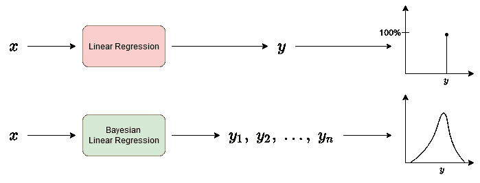
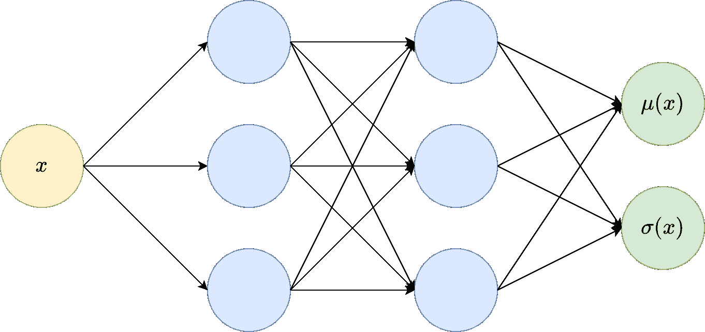
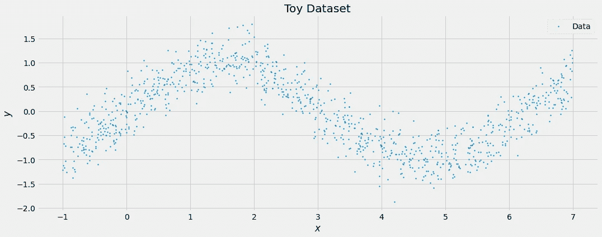
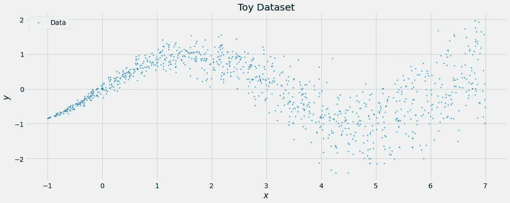
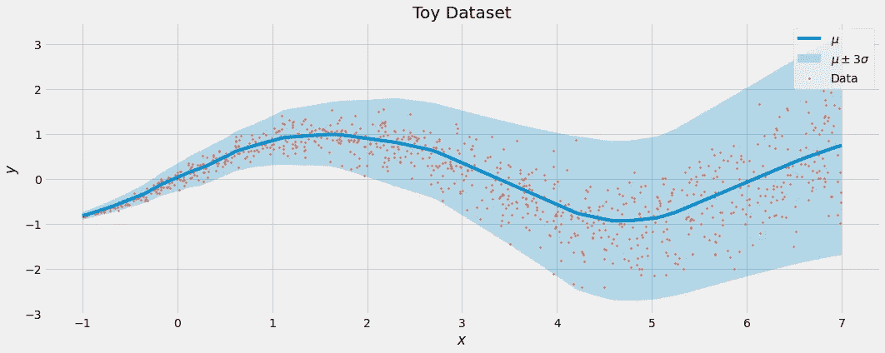

# 免费获取回归神经网络中的不确定性估计

> 原文：<https://towardsdatascience.com/get-uncertainty-estimates-in-neural-networks-for-free-48f2edb82c8f>

## 给定正确的损失函数，标准的神经网络也可以输出不确定性


Christina Deravedisian 在 [Unsplash](https://unsplash.com?utm_source=medium&utm_medium=referral) 上拍摄的照片

W 当我们建立一个机器学习模型时，我们通常以这样的方式设计它，它输出**一个单一的数字**作为预测。来自 [scikit-learn](https://scikit-learn.org/stable/) 的大多数模型是这样工作的:基于树的模型、线性模型、最近邻算法等等。同样适用于 [XGBoost](https://xgboost.readthedocs.io/en/stable/) 和其他 boosting 算法，以及深度学习框架，如 [Tensorflow](https://www.tensorflow.org/) 或 [PyTorch](https://pytorch.org/) 。

虽然这通常是好的，但最好也有一个围绕这个*点估计*的不确定性度量。这是因为“我们将销售 1000 辆 50 型汽车”和“我们将销售 1000 辆 5000 辆汽车”之间的差异是巨大的:从第一个陈述中，你可以得出该公司将销售 1000 辆左右的汽车，或多或少，而第二个陈述告诉你该车型根本没有任何线索。

> ***注:*** *较低的不确定性并不意味着模型是正确的。作为人，它也可以对一些完全错误的事情非常固执己见。因此，像往常一样，评估模型的质量是至关重要的，在这种情况下也是如此。*

# 贝叶斯推理

如果你读过我关于贝叶斯推理的文章(*谢谢！你已经知道如何创建模型，不仅输出一个点，而是输出一个完整的目标分布。*



图片由作者提供。

[](/a-gentle-introduction-to-bayesian-inference-6a7552e313cb)  [](/bayesian-linear-regression-in-python-via-pymc3-ab8c2c498211)  

正因为如此，我们可以通过观察预测的分布或一些导出的数字(如标准差)来了解模型何时不确定。分布越窄(标准差越小)，模型越确定。

**不过，这一次我们不会去贝氏这里。**虽然贝叶斯推理是您应该在某个时候学习的一个很好的领域，但它有几个缺点:

*   它在计算上甚至比神经网络更复杂
*   数学上更难理解，而且
*   你必须了解新的图书馆。

因此，这篇文章是为那些了解他们的深度学习框架，并希望在没有太多麻烦的情况下包括一些不确定性估计的人准备的。然而，如果你想在某个时候进入**完全贝叶斯神经网络**的领域，试试 PyTorch 的 [Tensorflow Probability](https://www.tensorflow.org/probability) 或 [Pyro](https://pyro.ai/) 之类的库。

# 使神经网络揭示它们的不确定性

> **免责声明:**同样，我不知道以下方法是否出现在任何论文或书籍中。它刚刚出现在我的脑海里，我想把它写下来。如果你知道任何来源，请在评论中给我一个提示，我会添加到文章中。谢谢！
> ***更新:*** [*马蒂亚斯·瓦尔德内格罗·托罗*](https://www.linkedin.com/in/tetris/matias-valdenegro-toro-29383717/) *指出我即将介绍的损失在他们的论文* 中被称为方差衰减[*。*](https://arxiv.org/abs/2204.09308)

从现在开始，让我们坚持使用我们最喜欢的面包和黄油神经网络。在本文中，我将使用 Tensorflow 代码，但是您也可以轻松地将所有代码都用于 PyTorch 或其他框架。这里我们将考虑一个回归问题，但是类似的论点也可以用于分类任务。

## 推导均方误差

为了理解如何得到不确定性估计，我们必须先理解如何得到点估计。然后，我们将以一种简单的方式概括这一思想。因此，简单回顾一下，下面是**均方误差** (MSE)损失函数:


图片由作者提供。

这很直观:某些真实值 *yᵢ* 和模型预测值 *ŷᵢ* 之间的差距越大，亏损就越高。但是，当指数中的 2 替换为 4 时，我们可以用同样的方式进行讨论。或者去掉 2，用绝对值|*yᵢ*–*ŷᵢ|*代替([平均绝对误差](https://en.wikipedia.org/wiki/Mean_absolute_error)，MAE)。

那么，MSE 有什么特别之处呢？其中包含哪些假设？让我们来找出答案。⚠️ **危险:数学领先。如果这太多，直接跳到实现部分。这个结果很容易应用，即使你还不能理解这个理论。** ⚠️

假设如下:

> *给定输入特征* x *，真标* y *按正态分布***用* ***表示*μ*(*x*)*******标准差***，*即*y~N(μ *(* x *)，* σ)。*这意味着观察到的标签来自某个真值* μ *(* x *)，但被某个误差破坏，标准偏差为* σ。*这个误差也叫*噪声*。* ***注意，很多时候我们写*** **ŷ *而不是* μ *(* x *)。*****

**神经网络(和大多数其他模型)的任务是预测这个***μ*(x)***给定 *x.* 这使得平均预测正确**，这是我们能做的最好的事情，因为我们不能预测噪声。现在的表达*y*~*N*(*μ(*x*)，σ* )只是表示以下意思:*****

**********

*****图片由作者提供。*****

*****这只是用均值 *ŷ=μ(* x *)* 和标准差 *σ* 描述单个标签 *y.* 分布的正态分布的密度函数，现在我们没有单个观测值 *y* 及其对应的预测值 *ŷ* ，而是几个，比如说 *n* 。假设所有的观察都是随机独立的，我们得到*****

**********

*****图片由作者提供。*****

*****现在训练一个神经网络基本上意味着统计学家所谓的*最大似然估计。*这是一种比较花哨的说法我们要**最大化**上面的密度函数，也叫*似然函数*。*****

*****现在，我们可以将最大似然估计与 MSE 最小化联系起来，如下所示:*****

1.  *****最大化似然函数*****
2.  *****意味着最大化最右边的项*****
3.  *****意味着最大化 *e* 的指数*****
4.  *****意味着最小化指数中的和，*****
5.  *****意味着最小化 MSE(除以 *n* 不会改变最佳参数)。*****

*****或者作为一张图片:*****

**********

*****图片由作者提供。*****

## *****概化 MSE 损失*****

*****如果你熬过了最后一节，那么恭喜你，你已经走得很远了，你几乎达到了你的目标！我们只需要做一个简单的观察:*****

> *****我们将 *σ视为常数，在进行最大似然法时基本上将其忽略。******

*****但是 *σ* 也正是我们想要估计的！这是因为它从定义上抓住了预测中的不确定性。那么，我们让我们的模型**在 *μ* ( *x* )** 之外再输出一个值 *σ* ( *x* )怎么样？这意味着，即使对于简单的回归，模型也将有两个输出:一个是对真实值 *μ* ( *x* )的估计，另一个是给定 *x* 的不确定性估计 *σ* ( *x* )。*****

**********

*****图片由作者提供。*****

*****现在，我们可以用 *σ* ( *xᵢ* )代替上面等式中的所有 *σ* ，我们最终得到如下陈述:最大化似然函数意味着最大化该项*****

**********

*****图片由作者提供。*****

*****这反过来意味着最小化指数中的巨大总和，这是我们最新导出的损失函数(没有吸引人的名字，请在评论中提出建议)😉):*****

**********

*****图片由作者提供。*****

*****注意，我在中加入了 1/ *n* ，但是这并没有改变最优解，就像 MSE 的情况一样。*****

> ********注:*** *这种损失有一些有趣的性质。首先，它仍然包含 MSE 位(*yᵢ*–*μ*(*xᵢ*))。此外，还有两个涉及* σ *的术语:ln(* σ *(* x *))以及 1/* σ *(* x *)。******
> 
> ******为了保持较低的损耗，* ***型号不能输出非常大的值给**(*×63)***，因为随着*σ*(*×T70)的增长，ln(σ*(*×)增加该模型也不能输出接近于零的非常小的值，因为这样一来项 1/ σ *(* x *)就变大了。这样，模型被迫输出一个*合理的*猜测为*σ*(*x*)**到* ***平衡两项的罚值*** *。******
> 
> *****只有当(yᵢ*—*μ*(*xᵢ*))很小，即预测值非常接近真实值时，模型才能够输出很小的标准差* σ *(* x *)。在这种情况下，模型对其预测相当有把握。******

*****好了，理论到此为止。我们现在应该编码了！*****

# *****Tensorflow 中的实现*****

*****好了，我们已经知道，我们需要两样东西来制造一个标准的神经网络输出不确定性:*****

1.  *****包含预测标准偏差(=不确定性)的第二个输出节点，以及*****
2.  *****如上所述的客户损失函数。*****

*****在你选择的任何深度学习框架中实现这两件事应该都很容易。我们将在 Tensorflow 中进行，因为上次我已经选择了 PyTorch 来解释可解释的神经网络。😎*****

*****[](/interpretable-neural-networks-with-pytorch-76f1c31260fe)  

让我们从一个简单的例子开始。

## 不断的噪音

首先，我们将创建一个由 1000 个点组成的玩具数据集，通过

```
import tensorflow as tf

tf.random.set_seed(0)

X = tf.random.uniform(minval=-1, maxval=7, shape=(1000,))
y = tf.sin(X) + tf.random.normal(mean=0, stddev=0.3, shape=(1000,))
```

我们可以将这个数据集可视化:



图片由作者提供。

好的，所以它仅仅是一个正弦波加上了 *N* (0，0.3)分布噪声。在最好的情况下，模型的实际预测遵循正弦波，而每个不确定性估计在 0.3 左右。我们通过以下方式建立一个简单的前馈网络

```
model = tf.keras.Sequential([
    tf.keras.layers.Dense(32, activation='relu'),
    tf.keras.layers.Dense(32, activation='relu'),
    tf.keras.layers.Dense(32, activation='relu'),
    tf.keras.layers.Dense(2) # Output = (μ, ln(σ))
])
```

好了，我们已经通过定义一个有两个输出的神经网络处理了第一个要素。***** 

*******为了简化计算，我们直接假设第二个输出不是 *σ* ( *xᵢ* )，而是 ln( *σ* ( *xᵢ* ))。**我们这样做是因为最后一层的两个神经元可以输出任意的实数值，尤其是比零小**的数值，这对标准差没有意义。但是标准偏差的对数可以是任何实数，因此域匹配。而且我们无论如何都需要损失函数中的 ln( *σ* ( *xᵢ* ))，那就去争取吧。说到损失函数，我们可以通过*******

```
*****def loss(y_true, y_pred):
    mu = y_pred[:, :1] # first output neuron
    log_sig = y_pred[:, 1:] # second output neuron
    sig = tf.exp(log_sig) # undo the log

    return tf.reduce_mean(2*log_sig + ((y_true-mu)/sig)**2)*****
```

*****剩下的就是一切照旧了。你用这个损失函数和拟合来编译模型。*****

```
*****model.compile(loss=loss)

model.fit(
    tf.reshape(X, shape=(1000, 1)),
    tf.reshape(y, shape=(1000, 1)),
    batch_size=32,
    epochs=100
)*****
```

*****让我们检查模型已经学习的不确定性估计:*****

```
*****print(tf.exp(model(X)[:20, 1]))

# Output:
# tf.Tensor(
# [0.29860803 0.27371496 0.32216415 0.32288837 0.31084406 0.30166912
# 0.32059005 0.3331769  0.31244662 0.31863096 0.30940703 0.32042852
# 0.3231969  0.29584357 0.31141806 0.32493973 0.3169802  0.32060665
# 0.30542135 0.31733593], shape=(20,), dtype=float32)*****
```

*****我看不错！该模型了解到噪声具有大约 0.3 的标准偏差。这是模型所学内容的可视化:*****

**********

*****图片由作者提供。*****

*****我们就喜欢这样。实际预测 *μ* 遵循数据，而不确定性 *σ* 刚好高到足以捕捉标签 *y* 中的噪声。*****

## *****变化的噪声*****

*****我们现在通过引入非恒定噪声来增加一点趣味，统计学家称之为*异方差*。看看这个:*****

```
*****tf.random.set_seed(0)

X = tf.random.uniform(minval=-1, maxval=7, shape=(1000,))
sig = 0.1*(X+1)
y = tf.sin(X) + tf.random.normal(mean=0, stddev=sig, shape=(1000,))*****
```

*****这创建了一个数据集，其特征 *X* 中的噪声增加。*****

**********

*****图片由作者提供。*****

*****基本事实仍然是一样的:它是一个正弦波，模型应该能够捕捉到这一点。然而，该模型还应该知道， *X* 的值越高，意味着不确定性越高。*****

*******剧透:如果你在新的数据集上重新训练如上相同的模型，这正是你将看到的。*******

**********

*****图片由作者提供。*****

*****在我看来很可爱。*****

# *****结论*****

*****在本文中，您了解了如何调整神经网络，使其能够输出对不确定性的估计以及实际预测。它只需要一个额外的输出神经元和一个比 MSE 稍微复杂一点的损失函数。*****

*****不确定性估计的好处是，它们让您评估模型对其预测的信心，您知道是否可以信任模型的预测。它们还允许您报告估计的下限或上限，这在计算最好或最坏的情况时很有价值。*****

*****另一种获得不确定性估计的流行方法是使用贝叶斯推理。然而，数学更复杂，而且比我在这里向你展示的解决方案要慢得多。此外，我发现(深度)贝叶斯学习的软件包目前不像 Tensorflow 或 PyTorch 那样容易使用，尽管这可能会在贝叶斯方法获得更多牵引力时发生变化。不过，我喜欢这个话题，所以也来看看吧！😉*****

*****我在这里给你的是一个简单的工具，让你避开贝叶斯的争论，不需要你改变太多的日常行为，同时仍然给你一个贝叶斯世界的巨大好处。*****

*******奖金(感谢** [**的巨大投入)卡洛斯阿雅-莫雷诺**](https://www.linkedin.com/in/carlosayam/)**:**获得不确定性估计的另一种方法是使用自举。基本上，如果你使用随机森林，这就是正在发生的事情:你通过子采样从你的原始数据集创建 *b* 个更小的数据集，在每个数据集上训练一个模型，然后你得到 *b* 个输入的不同预测。这些 *b* 预测的平均值是你的最终预测，而这些 *b* 预测的标准差是不确定性的度量。例如，如果所有 *b* 模型的输出都差不多，那么不确定性就会很小。*****

*****然而，这种方法的问题是，你需要训练不同的车型，这可能相当昂贵。在随机森林中，它工作得很好，因为单个决策树快速且容易适应。对于神经网络来说，事情看起来更黑暗。杰里米·尼克松(Jeremy Nixon)等人也做了[研究](https://www.gatsby.ucl.ac.uk/~balaji/why_arent_bootstrapped_neural_networks_better.pdf)，即使抛开计算问题，自举神经网络可能也不会太有益。*****

*****我希望你今天学到了新的、有趣的、有用的东西。感谢阅读！*****

*******作为最后一点，如果你*******

1.  *******想支持我多写点机器学习和*******
2.  *******无论如何都计划获得一个中等订阅，*******

*******为什么不做** [**通过这个环节**](https://dr-robert-kuebler.medium.com/membership) **？这将对我帮助很大！😊*******

******说白了，给你的价格不变，但大约一半的订阅费直接归我。******

*****非常感谢，如果你考虑支持我的话！*****

> ******如有问题，在*[*LinkedIn*](https://www.linkedin.com/in/dr-robert-k%C3%BCbler-983859150/)*上写我！******