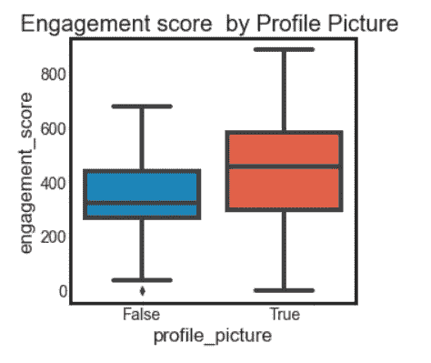
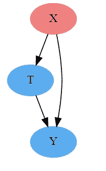
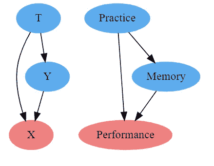
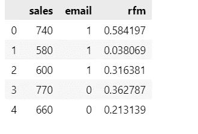
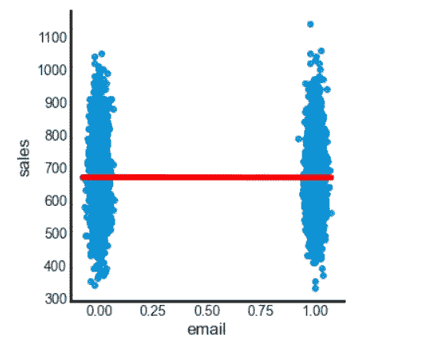
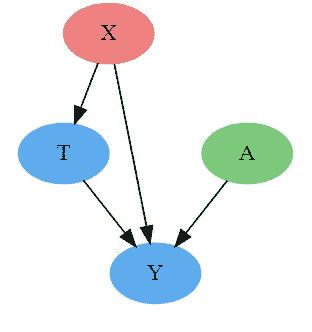

# 因果推理入门

> 原文：<https://towardsdatascience.com/getting-started-with-causal-inference-5cb61b707740>

# 因果推理入门

## 超越“相关性不是因果关系”,理解“为什么”


在 [Unsplash](https://unsplash.com?utm_source=medium&utm_medium=referral) 上由 [Carlos Muza](https://unsplash.com/@kmuza?utm_source=medium&utm_medium=referral) 拍摄的照片

在整个技术创新的旅程中，公司最梦寐以求的目标是找到改变人类行为的方法，方法是回答诸如“我如何才能让访问者成为顾客？”、“这个打折券有帮助吗？”、“哪项活动能带来更好的参与度和利润？”等。这需要使用数据来制定可靠的可操作方案，更具体地说，需要了解应该做些什么来将我们的关键指标推向所需的方向。

数据科学家一直在使用预测建模来生成可操作的见解，这些模型非常擅长做它们应该做的事情，即生成预测，但不是为我们提供可靠的可操作的见解。他们中的许多人遭受虚假的相关性和不同种类的偏见，我们将在本文中讨论。

那么，我们为什么需要因果推理呢？答案就在问题本身，因为我们需要知道**【为什么】**，为什么事情会发生？，例如，“销售是否因为优惠券代码而增加？”。因果推理是可操作处方的教父。这不是什么新鲜事，经济学家多年来一直用它来回答诸如“移民会导致失业吗？”、“高等教育对收入有什么影响？”等等。

## 联想 VS 因果？

我们经常听到类似**“联想不是因果关系”**的说法，这也是很直观的理解。现在让我们从数学的角度来看这个问题。假设，有人告诉你，在社交媒体网站上有个人资料图片的人有更好的参与度，那么为了增加参与度，我们应该要求用户上传一张个人资料图片。人们可以很快指出，有更多朋友的用户可能有一张个人资料照片，用“你可能认识的人”选项来提示用户是增加参与度的一种更好的方式。在这种情况下，个人资料图片不会引起参与，它只是与参与相关联。



作者图片

在我们开始学习数学之前，让我们先理解几个贯穿本文的术语，**治疗和控制。**治疗不过是某种我们想要知道效果的干预。在我们的情况下，有一张个人资料照片就是治疗。

**处理={1，如果单元 I 被处理，否则为 0 }**

Yᵢ是单位 I 的结果，Y₁ᵢ是单位 I 治疗的结果，Y₀ᵢ是未治疗的结果。因果推断的根本问题是，我们没有观察治疗和对照的易。因此，个体治疗效果是无法观察到的，有多种方法可以对其进行估计，但由于我们才刚刚开始，所以让我们关注**平均治疗效果(ATE)**

E[Y₁-Y₀]

ATT = E[Y₁-Y₀|T=1]，对被治疗者的平均治疗效果。

直觉上，我们理解在某些情况下，是什么让关联不同于因果关系，但对此有一个词的答案，它被称为**偏差**。在我们的例子中，没有个人资料照片的人可能有较少的朋友和/或来自较高的年龄组。因为我们只能观察到一种潜在的结果，也就是说，接受治疗的 Y₀不同于未接受治疗的 Y₀。治疗后的 Y₀高于未治疗的 Y₀，也就是说，有个人资料照片(治疗)的人在没有照片的情况下会有更高的参与度，因为他们可能更年轻，更懂技术，也有更多的朋友。被治疗的 Y₀也被称为**反事实**。这是我们没有观察到的东西，但却是唯一的理由。有了这样的理解，让我们再举一个例子，“与公立学校相比，私立学校教育能带来更高的工资吗？”。我们的理解是，上私立学校的学生有更富裕的父母，他们可能受教育程度更高，因为教育与财富有关，而不仅仅是暗示因果关系，因为高工资和私立学校教育之间似乎有关联。

关联由=***E[Y | T = 1]-E[Y | T = 0]***给出

因果关系由=***【e[y₁-y₀】***

用关联方程式中观察到的结果替换

*e[y | t = 1]-e[y | t = 0]= e[y₁|t=1]-e[y₀|t=0*

加上和减去治疗单位的反事实结果 E[Y₀|T=1](outcome，如果它们没有被治疗)

*e[y | t = 1]-e[y | t = 0]= e[y₁|t=1]-e[y₀|t=0]+e[y₀|t=1]-e[y₀|t=1】*

*e[y | t = 1]-e[y | t = 0]= e[y₁-y₀|t=1]+****{e[y₀|t=1]-e[y₀|t=0]}bias***

**联想= ATT+偏见**

**这是上帝的因果宇宙方程式。它告诉我们为什么关联不是因果关系，并且当治疗组和对照组都没有接受治疗时，治疗组和对照组在治疗前的差异是多少。如果 E[Y₀|T=1]=E[Y₀|T=0]，即在接受治疗之前，治疗和控制之间没有区别，那么我们可以推断关联是因果关系。**

因果推理技术旨在使治疗组和对照组在除治疗外的所有方面都相似。随机对照试验(RCT)或随机实验就是这样一种确保偏倚为零的方法。它包括随机分配单位到治疗组或对照组，如 E[Y₀|T=1]=E[Y₀|T=0]. **A/B 测试**是一项随机实验，是谷歌和微软等公司广泛使用的一种技术，旨在发现网站在用户体验或算法方面的变化所带来的影响。但这并不总是可能的，在我们的例子中，我们不能随机给用户上传个人资料图片的选项，或者我们不能要求人们吸烟以量化吸烟对怀孕的影响等。此外，它也不能用于非随机观察数据。

在我们进入一些方法来确保治疗组和对照组除了治疗之外在所有方面都是相似的之前，让我们先看看因果图，因果关系的语言。

## 因果图:因果关系的语言

因果图的基本思想是表示数据生成过程。听起来很简单？不过，也不尽然！它要求我们事先知道所有可能影响结果的因素，治疗是其中之一。

一个很常见的例子就是医学对病人存活率的影响。如果药物用于受疾病严重影响的人，也就是说，如果治疗包括重症患者，而对照组有不太严重的患者，这将在我们的设计中引入偏差。

减少这种偏差的一种方法是控制其他因素，如疾病的严重程度(随机分配不同严重程度的治疗)。通过对严重病例进行调理，治疗机制变得随机。让我们用因果图来表示这个。


图 A 和图 B(作者图片)

因果图由节点和边组成。节点代表不同的因素和结果，边代表因果关系的方向。在上面的图 A 中，药物导致患者存活，在图 B 中，严重程度和药物都导致患者存活，而严重程度也导致治疗。这些图表是有用的，因为它们告诉我们两个变量是否彼此相关，路径(节点之间的箭头)给了我们关系的方向

这让我们想到了**好路径和坏路径**的概念。好的路径或**前面** **门**是治疗与结果相关的原因，这也是我们分析感兴趣的。通常，这些是箭头背离治疗的路径，其余所有路径是坏路径或**后门**，我们需要对其进行控制，通常是箭头指向治疗的路径。在上面的例子中非常明显。不是吗？

关闭后门，或控制或调节影响治疗的变量只是确保偏差为零和我们的因果推断结果更有效的一些其他词语。我们称这种偏见为混杂偏见，这是因果宇宙中的大坏蛋。当有一个共同因素影响治疗和结果时，就会发生混杂，所以为了确定因果关系，我们需要通过控制共同原因来关闭后门。在我们上面的例子中，严重程度引入了混杂因素，因此除非我们控制严重程度，否则我们无法得到医学对患者存活率的因果估计(T - > Y)。



混杂偏倚(图片由作者提供)

我们是否应该控制一切，以确保我们的模型不会遭受混淆的偏见？但愿因果宇宙中的生命也是如此简单！

想象一下，我们想知道练习国际象棋对工作记忆的影响。我们以某种方式随机化了实践的度量，使得 E[Y0|T=1]-E[Y0|T=0] = 0。由于实践的测量是随机的，我们可以直接测量因果影响，而无需控制任何变量。然而，如果我们决定控制实际游戏中的性能，我们会将**选择偏差**添加到我们的估计中。通过调节表现，我们正在寻找表现相似的球员群体，同时不允许工作记忆发生太大变化，结果，我们没有得到练习对工作记忆的可靠影响。我们有这样一个例子，E[Y₀|T=0，Per = 1] > E[Y₀|T=1，Per = 1】，也就是说，那些不需要太多练习就能有更好表现的人可能有更好的工作记忆。



选择偏差(图片由作者提供)

**当我们未能控制治疗和结果的共同原因时，就会出现混杂偏倚。当我们控制治疗和结果的共同影响时(如上面的例子)，或者当我们控制从原因到结果的路径中的变量时(在下面的回归案例 3 中用例子讨论)，就会发生选择偏倚**

我们已经在理论上谈了很多，但我们如何实现这一点呢？**在数据已经收集后，我们如何控制变量以获得治疗效果？**

## 回归救援

回归就像数据科学宇宙的标题美国，在集成和神经网络成为主流之前很久就从数据中解决问题和创造价值。**回归是识别因果关系、量化变量之间的关系以及通过控制其他变量来关闭后门的最常见方式。**

如果你不熟悉回归，我建议你先经历一下。有数百(如果不是数千)本关于回归的书籍和博客，只需要一次谷歌搜索。我们的重点将更多地放在使用回归来识别因果影响上。

让我们看看这在实践中是如何工作的。我们必须了解电子邮件活动对销售的影响，更具体地说，我们希望评估模型

> 销售额= B₀+B₁*Email +误差。

数据是随机的，也就是说没有偏见，E[Y₀|T=1]-E[Y₀|T=0]=0.

我们可以直接计算出 ate

```
(df.groupby("Email")["Sales"].mean())
```


由于这是随机数据，我们可以直接计算出 ATE = 101.21–95.72 = 5.487。现在让我们试着回归一下。

```
result = smf.ols('Sales ~ Email', data=df).fit()result.summary().tables[1]
```


这很酷，对吧？我们不仅得到了作为电子邮件系数的 ATE，还得到**置信区间**和 **P 值**。截距给出了 Email=0 时的销售额，即 E[Y|T=0]，Email 系数给出了 ATE E[Y|T=1]-E[Y|T=0]。

对随机数据进行因果估计更容易，因为我们不必控制偏差。正如我们上面讨论的，控制混杂因素是一个好主意，但是我们应该小心选择偏差，因为我们不断增加我们控制的变量的数量。在接下来的几节中，我们将讨论在我们的因果估计工作中应该控制哪些变量，并使用回归来实现它们。

**案例 1:控制混杂因素。**

在缺乏随机数据的情况下，我们无法在不控制混杂因素的情况下获得无偏的因果影响。假设我们想量化多受一年教育对时薪的影响。这是我们的数据


让我们看看这个简单模型的结果

对数(lhwage) = B₀+ B₁*educ +误差

```
result = smf.ols('lhwage ~ educ', data=wage).fit()
result.summary().tables[1]
```


由于这是一个对数模型，教育程度每增加 1 年，小时工资预计增加 5.3%。但是这个模型有偏见吗？E[Y₀|T=1]-E[Y₀|T=0] =0 吗？由于这是来自实验的非随机数据，我们可以认为受教育年限越长的人父母越富有，网络越好，或者他们属于一个享有特权的社会阶层。我们也可以认为，年龄和经验年限也会影响工资和受教育年限。这些影响我们治疗和教育的混杂变量引入了偏见(E[Y₀|T=1]-E[Y₀|T=0)！=0)，我们需要对其进行控制。让我们将这些控件添加到我们的模型中，看看结果。

```
controls = ['IQ', 'exper', 'tenure', 'age', 'married', 'black', 'sibs', 'meduc']result = smf.ols('lhwage ~ educ +' + '+'.join(controls), data=wage).fit()result.summary().tables[1]
```


正如你在上面看到的，在考虑控制因素后，教育对时薪的影响降低到了 4.78%。这证实了第一个没有任何控制的模型是有偏差的，高估了多年教育的影响。这个模型并不完美，可能还有一些我们没有控制的混杂变量，但它肯定比前一个要好。

> 观察数据(非随机)的因果推断需要内部有效性，我们必须确保我们已经控制了可能导致偏差的变量。这不同于预测模型所需的外部有效性，我们使用训练测试分割来实现预测模型，以获得可靠的预测(不是因果估计)。

## 案例 2:控制预测因子以减少标准误差

我们已经在上面看到了如何增加混杂因素的控制可以给我们更可靠的因果估计。但是我们还应该在模型中加入什么其他的变量呢？我们是否应该在结果中加入那些善于捕捉方差但不是混杂因素的变量？让我们用一个例子来回答这个问题

假设我们开展了一个电子邮件活动来宣传我们的杂货店。电子邮件是随机发送的，不存在偏见，即没有其他变量影响我们的治疗分配，E[Y₀|T=1]-E[Y₀|T=0] =0。让我们算出电子邮件对销售的影响。



```
model = smf.ols('sales ~ email', data=email).fit()model.summary().tables[1]
```


看起来电子邮件活动对销售有负面影响。该系数具有较高的标准误差，并且不显著。让我们更深入地了解一下治疗(电子邮件)和控制(无电子邮件)销售的可变性



作者图片

由于该数据来自随机实验，电子邮件的分配通过抛硬币来完成，没有其他变量影响治疗。但是我们看到销售有很大的差异。这可能是因为电子邮件对销售的影响很小，而那些最近的、频繁的、大量购买的人(RFM 价值观)决定了销售。也就是说，如果产品像冬装一样是季节性的，我们可以说销售的可变性受到其他因素的影响，如用户的 rfm 得分或季节性。因此，我们需要控制这些影响，对我们的电子邮件活动的因果影响进行可靠的估计。让我们在模型中引入 rfm 分数。

```
model = smf.ols('sales ~ email + rfm', data=email).fit()model.summary().tables[1]
```


添加 rfm 后，电子邮件对销售产生了积极的影响，电子邮件变量也达到了 95%的显著水平。因此，控制具有高预测能力的变量有助于捕捉方差，并提供更可靠的因果估计。基本上，在上面的例子中，当我们观察相似的客户(rfm 得分水平相似)时，结果变量的方差较小。

总结案例 1 和案例 2，我们应该始终控制在我们的因果设计中具有强大预测能力的混杂因素和变量。



良好的控制(图片由作者提供)

**案例 3:不良控制导致选择偏差**

在数据繁荣的时代，我们不缺少可以直接放入模型的变量。我们在上面讨论过，我们不应该把所有的变量都加到模型中，否则我们会引入另一种偏差，称为选择偏差。

假设，我们想知道大学学历对工资的影响。我们设法随机分配了大学学位(大学教育 1 分，其他情况下 0 分)。如果我们现在在设计中控制白领工作，我们就引入了选择偏差。我们关闭了大学教育影响工资的前门路径。


```
model = smf.ols('wage ~ educ', data=df).fit()
model.summary().tables[1]
```


大学教育对工资有积极影响，受过大学教育的人平均比没有受过大学教育的人多挣 0.46 个单位。

```
model = smf.ols('wage ~ educ + whitecollar', data=df).fit()
model.summary().tables[1]
```


对白领工作的控制导致了选择偏差，关闭了大学学位影响工资的渠道之一。这导致低估了大学学位对教育的影响。由于随机化的原因，我们预计 E[Y₀|T=1]-E[Y₀|T=0] =0，然而在控制了白领工作 E[Y₀|T=0，WC=1] > E[Y₀|T=1，WC=1]之后，也就是说，即使没有大学学位也有白领工作的人可能比那些需要大学学位的人更勤奋。

回归分析在控制混杂因素方面非常有效，而且有点神奇。其方法是将数据划分为混杂单元格，计算每个单元格中的影响，并使用加权平均值合并它们，其中权重是单元格中处理的方差。

但是每个人都有自己的问题，回归也是如此。它不适用于非线性，并且由于它使用组中治疗的方差作为权重，ATE 受高方差因子的影响更大。但是这不是我们所拥有的唯一工具，还有其他方法都旨在使治疗组和对照组相似，我们将在本系列的第 2 部分讨论这些方法。

## *参考文献*

*   【https://matheusfacure.github.io/python-causality-handbook/ 
*   [https://www.bradyneal.com/causal-inference-course](https://www.bradyneal.com/causal-inference-course)
*   [https://theeffectbook.net/](https://theeffectbook.net/)
*   [https://www.masteringmetrics.com/](https://www.masteringmetrics.com/)
*   [https://www . Amazon . in/Applied-Data-Science-Transforming-Actionable/DP/0135258529](https://www.amazon.in/Applied-Data-Science-Transforming-Actionable/dp/0135258529)