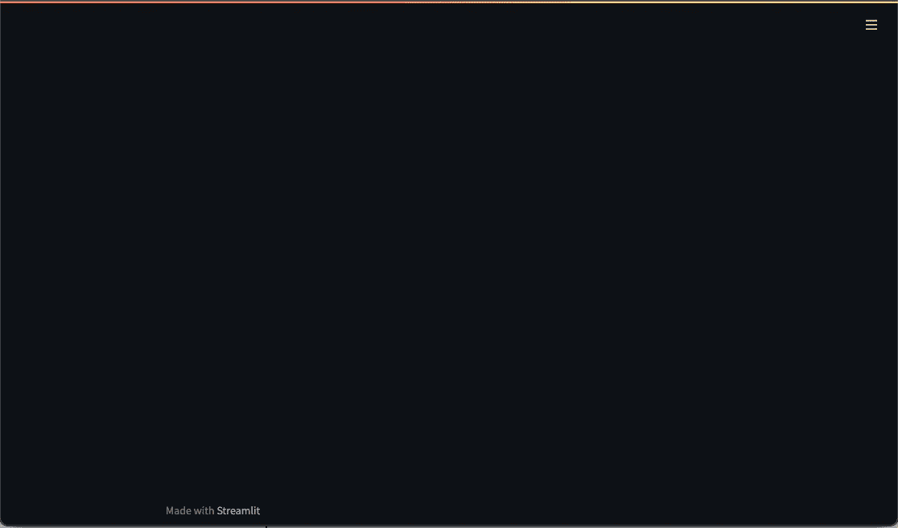
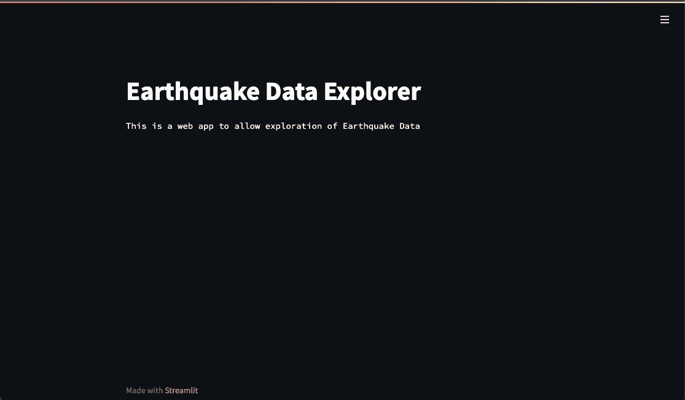
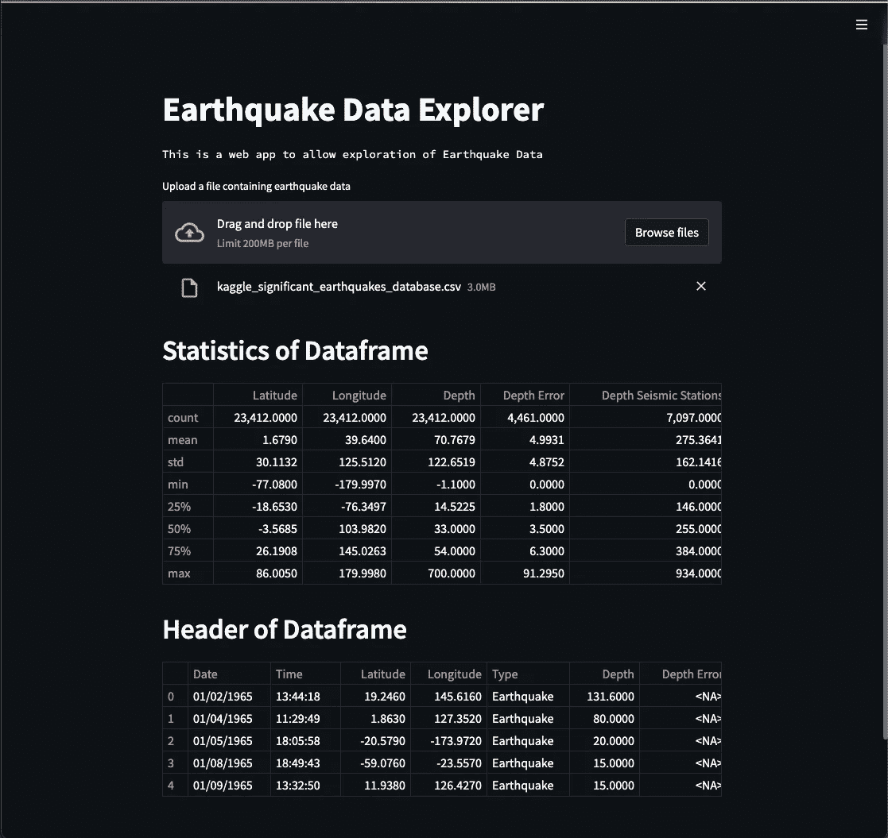
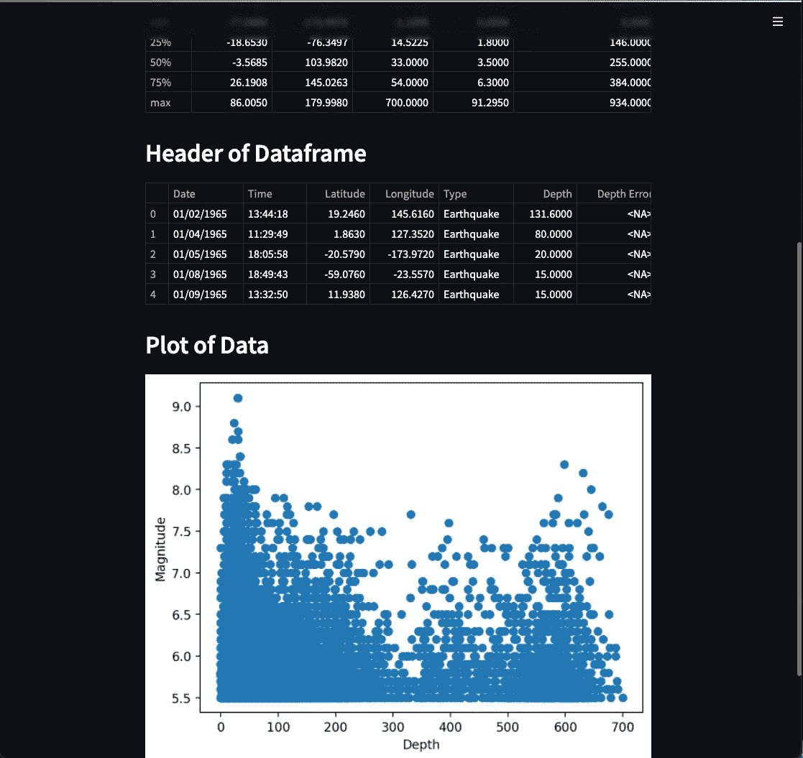
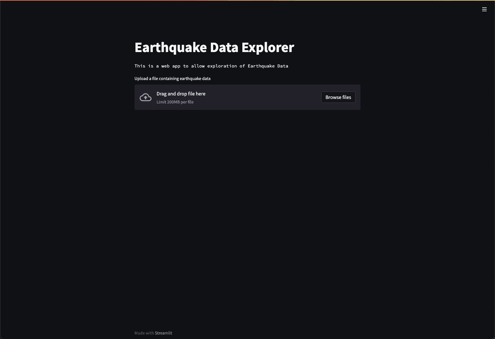

# 开始使用基于 Streamlit Web 的应用程序

> 原文：<https://towardsdatascience.com/getting-started-with-streamlit-web-based-applications-626095135cb8>

## 创建 Streamlit web 应用程序的简明介绍


卡斯帕·卡米尔·鲁宾在 [Unsplash](https://unsplash.com?utm_source=medium&utm_medium=referral) 上的照片

[Streamlit](https://streamlit.io) 是一个基于 python 的开源框架，用于开发和部署交互式[数据科学](https://en.wikipedia.org/wiki/Data_science)仪表盘和[机器学习](https://www.ibm.com/cloud/learn/machine-learning)模型。这意味着您不必依赖前端开发团队或花费大量时间学习 web 设计语言，如 [HTML](https://en.wikipedia.org/wiki/HTML) 、 [CSS](https://en.wikipedia.org/wiki/CSS) 或 [Javascript](https://www.javascript.com) 来部署您的仪表板或模型。

Streamlit 由前谷歌工程师于 2018 年创立，他们在开发和部署机器学习模型和仪表板时，获得了面临挑战的第一手经验。

它建立在 Python 之上，支持许多主流 Python 库，如 [matplotlib](https://matplotlib.org) 、 [plotly](https://plotly.com) 和 [pandas](https://pandas.pydata.org) 。

如果您想深入了解 Streamlit 的全部功能，请务必通过下面的链接查看他们的优秀文档。

[](https://docs.streamlit.io/)  

# 数据

本教程的数据可以在下面的 GitHub 资源库链接中找到。它起源于一个包含全球地震信息的 Kaggle 数据集。

原始数据可通过以下链接获得，并可在 CC0:公共领域下使用。

[https://www.kaggle.com/datasets/usgs/earthquake-database?select=database.csv](https://www.kaggle.com/datasets/usgs/earthquake-database?select=database.csv)

[](https://github.com/andymcdgeo/streamlit_tutorial_series)  

我为这篇文章发布了一个附带的视频教程，可以在下面访问:

# 安装 Streamlit

在运行 Streamlit 应用程序之前，我们首先需要安装库。如果您使用的是 PIP，只需使用下面的命令即可。

```
pip install streamlit
```

# 构建简化的应用程序

## 创建 app.py 文件

在您选择的 Python IDE 中，创建一个名为 app.py 的新文件。

## 导入库

该过程中的第一个编码步骤是导入所需的库。对于这个简单的应用程序，我们将导入 [streamlit](https://streamlit.io/) 、 [pandas](https://pandas.pydata.org/) 和 [matplotlib](https://matplotlib.org/) 。

```
*#Import the required Libraries*import streamlit as st
import pandas as pd
import matplotlib.pyplot as plt
```

## 运行 Streamlit 应用

要确认 [streamlit](https://streamlit.io/) 已正确安装和导入，并且可以运行，请转到终端并导航到 app.py 文件所在的位置，然后运行以下命令:

```
streamlit run app.py 
```

您的浏览器窗口应该会打开，您将看到一个空白的 streamlit 窗口，如下所示。如果您希望在另一个浏览器中打开应用程序，终端中还会显示网址。

一旦你的网络浏览器打开，你会注意到两件事，一个汉堡菜单在右上角，一个用 Streamlit 制作的文本在左下角。



使用 streamlit run app 后的初始 Streamlit app . py .图片由作者创建。

## 向 Streamlit 应用程序添加文本

现在我们已经确认了 [Streamlit](https://streamlit.io/) 正在运行，我们可以开始向我们的应用程序添加元素了。

为了让人们理解我们的应用程序，我们可以使用`st.title`和`st.text`给它一个标题和简短的描述。

```
*# Add a title and intro text*st.title('Earthquake Data Explorer')
st.text('This is a web app to allow exploration of Earthquake Data')
```

当您保存 app.py 文件时，您会看到新项目出现在您的 streamlit 应用程序的右上角。这通知您源文件已经更改，您有两个选择。


保存对源代码文件的更改后，出现在 streamlit 中的选项。图片由作者提供。

**重新运行** —点击此按钮将重新运行应用程序并刷新显示。每次对源文件进行更改并保存时，都需要按下此按钮。

**始终重新运行** —单击此按钮将在更改保存到源文件时自动重新运行应用程序。

选择其中一个选项后，应用程序现在将显示我们输入的标题和文本。



Streamlit 应用程序显示作者使用 st.title 和 st.write. Image 的内容。

## 在 Streamlit 中创建文件上传程序

Streamlit 的一大优点是用户可以上传自己的文件。这是通过`st.file_uploader()`实现的。

```
*# Create file uploader object*upload_file = st.file_uploader('Upload a file containing earthquake data')
```

在为用户创建上传文件的方式时，这段代码做了大量繁重的工作。当你添加这个并重新运行应用程序时，你会得到一个漂亮的上传框，你可以手动浏览文件或拖放文件。


使用 st.file_uploader()的文件上传程序对话框。图片由作者提供。

一旦我们设置了文件上传程序，我们现在需要添加一些基本的逻辑来检测文件何时被上传。如果有，则读取上传的 csv 文件。

```
if upload_file is not None: *# Read the file to a dataframe using pandas* df = pd.read_csv(upload_file)
```

所有剩余的代码现在都可以缩进放置在 if 语句下。这样，除非文件已经上传，否则后续代码不会运行。

## 在 Streamlit 中显示熊猫描述和数据

从[熊猫](https://pandas.pydata.org/)访问`df.describe()`和`df.head()`方法非常简单。我们将这些函数包装在`st.write()`方法中，所有的格式都会自动排序。

```
*# Create a section for the dataframe statistics* st.header('Statistics of Dataframe')
st.write(df.describe())*# Create a section for the dataframe header* st.header('Header of Dataframe')
st.write(df.head())
```

为了测试这是否有效，从 [Streamlit 教程系列 GitHub 存储库](https://github.com/andymcdgeo/streamlit_tutorial_series)中选择 CSV 文件*(ka ggle _ significant _ seismics _ database . CSV)*，并使用文件上传程序将其上传到应用程序。

文件上传后，应该会显示数据的统计信息以及前五行。



在 streamlit 中使用 st.write 方法显示 pandas 函数的示例。图片由作者提供。

## 用 Streamlit 显示 Matplotlib 图形

这个简单应用程序的最后一步是显示来自 [matplotlib](https://matplotlib.org/) 的图形。

首先，我们需要定义一个图形和轴。在本例中，我将它们分配给了`plt.subplots()`。

在这种情况下，我们可以创建图表，这将是一个地震深度与震级的散点图。

然后我们将`fig`包装在`st.pyplot()`中。

```
fig, ax = plt.subplots(1,1)ax.scatter(x=df['Depth'], y=df['Magnitude'])
ax.set_xlabel('Depth')
ax.set_ylabel('Magnitude')st.pyplot(fig)
```

当我们再次运行应用程序后，我们将会看到 matplotlib 图。



使用 streamlit 的 st.pyplot()函数显示 matplotlib 图形。

返回的图形是标准的 matplotlib 图形，没有任何交互功能。不使用 matplotlib，可以使用 plotly 创建交互式绘图。

## 完整代码

下面是使用 Streamlit 库生成一个非常简单的 web 应用程序的完整代码。

```
*#Import the required Libraries*import streamlit as st
import pandas as pd
import matplotlib.pyplot as plt*# Add a title and intro text* st.title('Earthquake Data Explorer')
st.text('This is a web app to allow exploration of Earthquake Data')*# Create file uploader object* upload_file = st.file_uploader('Upload a file containing earthquake data')*# Check to see if a file has been uploaded* if upload_file is not None: *# If it has then do the following:* *# Read the file to a dataframe using pandas* df = pd.read_csv(upload_file) *# Create a section for the dataframe statistics* st.header('Statistics of Dataframe')
   st.write(df.describe()) *# Create a section for the dataframe header* st.header('Header of Dataframe')
   st.write(df.head()) *# Create a section for matplotlib figure* st.header('Plot of Data') fig, ax = plt.subplots(1,1)
   ax.scatter(x=df['Depth'], y=df['Magnitude'])
   ax.set_xlabel('Depth')
   ax.set_ylabel('Magnitude')
   st.pyplot(fig)
```

下面是用上面的代码生成的最终 web 应用程序。该应用程序是非常静态的，只会在新文件上传时发生变化。



简化基于网络的应用程序，以可视化地震数据。图片由作者提供。

# 摘要

在这个简短的教程中，我们看到了如何用 Streamlit 创建一个非常简单的 web 应用程序。它允许我们将数据加载到我们的应用程序中，并立即显示描述性统计数据和 matplotlib 图。目前的应用程序是静态的，这意味着用户只会看到一个静态的数字和数据，没有交互或通过参数更新代码。这可以很容易地使用选择框，plotly 和许多其他 Streamlit 功能来增强。

如果你想要一个方便的小备忘单和 streamlit 一起使用，那么[从 Streamlit 文档](https://docs.streamlit.io/library/cheatsheet)中查看这个。

*感谢阅读。在你走之前，你一定要订阅我的内容，把我的文章放到你的收件箱里。* [***你可以在这里做！***](https://andymcdonaldgeo.medium.com/subscribe)

其次，通过注册会员，你可以获得完整的媒介体验，并支持我自己和成千上万的其他作家。它每个月只花你 5 美元，你可以完全接触到所有令人惊叹的媒体文章，也有机会用你的写作赚钱。如果你使用 [***我的链接***](https://andymcdonaldgeo.medium.com/membership)**报名，你会直接用你的一部分费用支持我，不会多花你多少钱。如果你这样做了，非常感谢你的支持！**