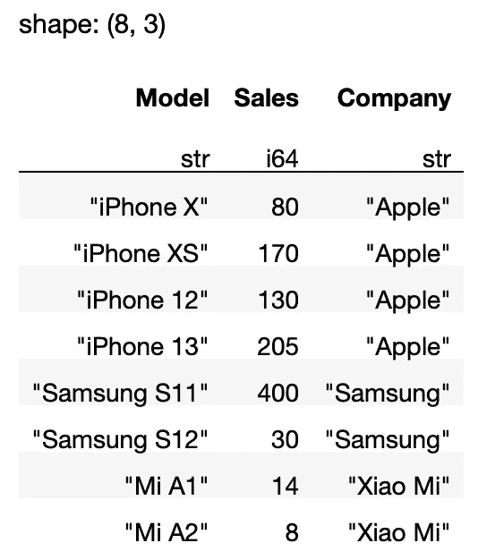
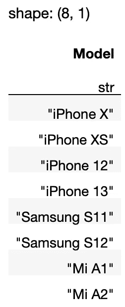
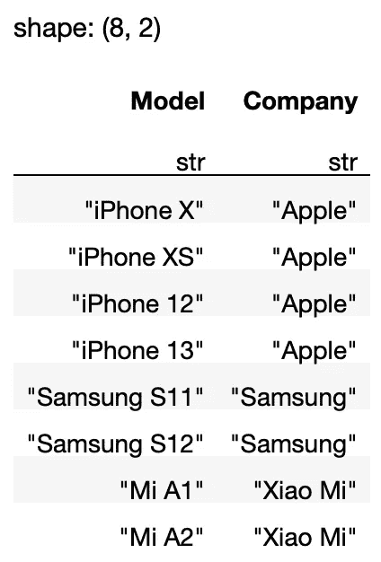
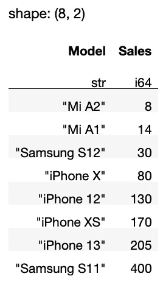
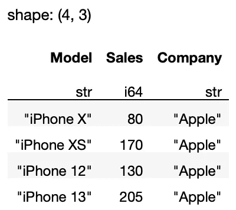
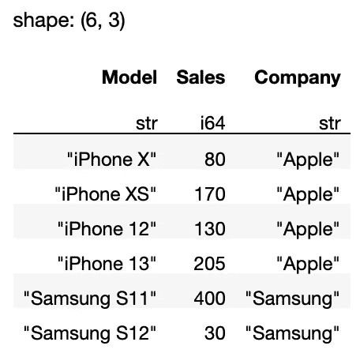
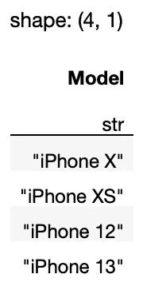
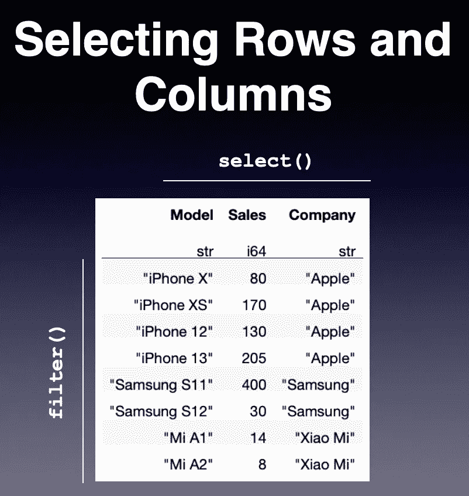

# Polars 数据帧库入门

> 原文：<https://towardsdatascience.com/getting-started-with-the-polars-dataframe-library-6f9e1c014c5c>

## 了解如何使用 Polars dataframe 库操作表格数据(并替换 Pandas)


汉斯-尤尔根·马杰在 [Unsplash](https://unsplash.com?utm_source=medium&utm_medium=referral) 上拍摄的照片

大多数使用 Python 的数据科学家/分析师都熟悉熊猫。如果你在数据科学领域，你可能已经投入了相当多的时间学习如何使用它们来操作你的数据。然而，对熊猫的主要抱怨之一是它在处理大型数据集时的速度和效率低下。幸运的是，有一个新的数据框架库试图解决关于熊猫的这一主要抱怨。

Polars 是一个完全用 Rust 编写的 DataFrame 库。在这篇文章中，我将带你了解极地犬的基本知识，以及如何用它来代替熊猫。在后续文章中，我将深入研究 Polars 的各种特性。

# 什么是 Polars？

理解 Polars 的最好方法是，它是一个比 Pandas 更好的数据框架库。以下是极地狗相对于熊猫的一些优势:

*   Polars 不对数据帧使用索引。消除索引使得操作数据帧变得更加容易(无论如何，索引在 Pandas 数据帧中是多余的)。
*   Polars 使用 *Apache Arrow 数组*在内部表示数据，而 Pandas 使用 NumPy 数组在内部存储数据。Apache Arrow arrays 在加载时间、内存使用和计算等方面效率更高。
*   Polars 比熊猫支持更多的并行操作。由于 Polars 是用 Rust 编写的，它可以并行运行许多操作。
*   Polars 支持*懒评估*。根据你的查询，Polars 将检查你的查询，优化它们，并寻找加速查询或减少内存使用的方法。而熊猫只支持*热切求值*，一遇到表达式就立刻求值。

# 安装 Polars

要安装 Polars，只需使用`pip`命令:

```
**pip install polars**
```

或者，使用`conda`命令:

```
**conda install polars**
```

对于本文，我将假设您已经安装了 Anaconda，并且熟悉 Jupyter Notebook。

# 创建 Polars 数据框架

学习一个新库的最好方法是亲自动手。因此，让我们从导入`polars`模块并创建 Polars 数据帧开始:

```
import polars as pldf = pl.DataFrame(
     {
         'Model': ['iPhone X','iPhone XS','iPhone 12',
                   'iPhone 13','Samsung S11','Samsung S12',
                   'Mi A1','Mi A2'],
         'Sales': [80,170,130,205,400,30,14,8],     
         'Company': ['Apple','Apple','Apple','Apple',
                     'Samsung','Samsung','Xiao Mi','Xiao Mi'],
     }
)
df
```

像熊猫一样，Polars 在 Jupyter Notebook 中展示数据帧时会将其打印出来:



作者图片

Polars 希望列标题名称是字符串类型。考虑下面的例子:

```
df2 = pl.DataFrame(
 **{
        0 : [1,2,3],
        1 : [80,170,130],
     }** )
```

上面的代码片段将*而不是*工作，因为字典中的键是整数类型(0 和 1)。要使它工作，您需要确保键是字符串类型(“0”和“1”):

```
import polars as pl
df2 = pl.DataFrame(
     {
        **"0"** : [1,2,3],
        **"1"** : [80,170,130],
     }
)
```

除了显示每一列的标题名称，Polars 还显示每一列的数据类型。如果想明确显示每一列的数据类型，使用`dtypes`属性:

```
df.**dtypes**
```

对于上述示例，您将看到以下输出:

```
[polars.datatypes.Utf8, 
 polars.datatypes.Int64, 
 polars.datatypes.Utf8]
```

要获得列名，使用`columns`属性:

```
**df.columns** #['Model', 'Sales', 'Company']
```

要以元组列表的形式获取数据帧的内容，请使用`rows()`方法:

```
df.**rows()**
```

对于上述示例，您将看到以下输出:

```
[('iPhone X', 80, 'Apple'),
 ('iPhone XS', 170, 'Apple'),
 ('iPhone 12', 130, 'Apple'),
 ('iPhone 13', 205, 'Apple'),
 ('Samsung S11', 400, 'Samsung'),
 ('Samsung S12', 30, 'Samsung'),
 ('Mi A1', 14, 'Xiao Mi'),
 ('Mi A2', 8, 'Xiao Mi')]
```

> Polars 没有指数的概念，不像熊猫。Polars 的设计理念明确指出索引在数据帧中没有用。

# 选择列

在 Polars 中选择列非常简单——只需使用*`select()`方法指定列名:*

```
*df.**select**(
    'Model'
)*
```

*上述语句返回一个包含*型号*列的 Polars 数据帧:*

**

*作者图片*

> *Polars 还支持方括号索引方法，这是大多数熊猫开发者都熟悉的方法。然而，Polars 的文档特别提到方括号索引方法是 Polars 的**反模式**。虽然您可以使用`df[:,[0]]`完成上述操作，但是在 Polars 的未来版本中，方括号索引方法可能会被删除。*

*如果需要多列，请以列表形式提供列名:*

```
*df.select(
    **['Model','Company']**
)*
```

**

*作者图片*

*如果想要检索数据帧中的所有整数(特别是`Int64`)列，可以在`select()`方法中使用一个*表达式*:*

```
*df.select(
    **pl.col(pl.Int64)**
)*
```

*众所周知，语句`pl.col(pl.Int64)`是一个极坐标表达式。该表达式被解释为“获取所有数据类型为 Int64 的列”。上述代码片段产生以下输出:*

**

*作者图片*

*在极性中，表达式是非常强大的。例如，你可以把*和*连在一起的表达式，就像这样:*

```
*df.select(
 **pl.col(['Model','Sales']).sort_by('Sales')** 
)*
```

*上面的表达式选择了*型号*和*销售*列，然后根据*销售*列中的值对行进行排序:*

**

*作者图片*

*如果需要多列，可以将表达式包含在列表中:*

```
*df.select(
    **[pl.col(pl.Int64),'Company']**
)*
```

**

*作者图片*

*如果您想获得所有字符串类型的列，请使用`pl.Utf8`属性:*

```
*df.select(
 **   [pl.col(pl.Utf8)]**
)*
```

**

*作者图片*

> *我将在以后的文章中更多地讨论表达式。*

# *选择行*

*要选择数据帧中的一行，使用`row()`方法传入行号:*

```
*df.row(0)   # get the first row*
```

*结果是一个元组:*

```
*('iPhone X', 80, 'Apple')*
```

> *如果您需要基于行号获取多行，您需要使用方括号索引方法，尽管在 Polars 中这不是推荐的方法。以下是一些例子:*
> 
> *`df[:2]# first 2 rows`
> `df[[1,3]] # second and fourth row`*

*要选择多行，Polars 建议使用`filter()`功能。例如，如果您想要检索所有苹果产品，您可以使用以下表达式:*

```
*df.filter(
    **pl.col('Company') == 'Apple'**
)*
```

**

*作者图片*

*您也可以使用逻辑运算符指定多个条件:*

```
*df.filter(
 **(pl.col('Company') == 'Apple') | 
    (pl.col('Company') == 'Samsung')** )*
```

**

*作者图片*

> *您可以在极坐标中使用以下逻辑运算符:*
> 
> *`|` —或者*
> 
> *`&`——还有*
> 
> *`~` —不*

# *选择行和列*

*通常，您需要同时选择行和列。您可以通过链接`filter()`和`select()`方法来实现，如下所示:*

```
*df.**filter**(
    pl.col('Company') == 'Apple'
).**select**('Model')*
```

*上面的语句选择所有包含*苹果*的行，然后只显示*型号*列:*

**

*作者图片*

*如果您还想显示`Sales`列，请向`select()`方法传递一个列表:*

```
*df.filter(
    pl.col('Company') == 'Apple'
).select(**[**'Model'**,'Sales']**)*
```

**

*作者图片*

## *如果你喜欢阅读我的文章，并且认为它对你的职业/学习有所帮助，请考虑注册成为一名灵媒会员。每月 5 美元，你可以无限制地访问 Medium 上的所有文章(包括我的)。如果你使用下面的链接注册，我会赚一小笔佣金(不需要你额外付费)。你的支持意味着我将能够投入更多的时间来写这样的文章。*

*<https://weimenglee.medium.com/membership>  

> 我将在即将到来的新加坡 ML 会议(2022 年 11 月 22-24 日)上主持一个关于 Polars 的研讨会。如果你想在 Polars 数据框架上快速起步，请在[https://ml conference . ai/machine-learning-advanced-development/using-Polars-for-data-analytics-workshop/](https://mlconference.ai/machine-learning-advanced-development/using-polars-for-data-analytics-workshop/)上注册我的研讨会。


# 摘要

在本文中，我已经向您展示了 Polars 数据框架的基础。您已经学习了提取行和列的基础知识以及`select()`和`filter()`方法的使用。以下是何时使用它们的快速总结:



作者图片*