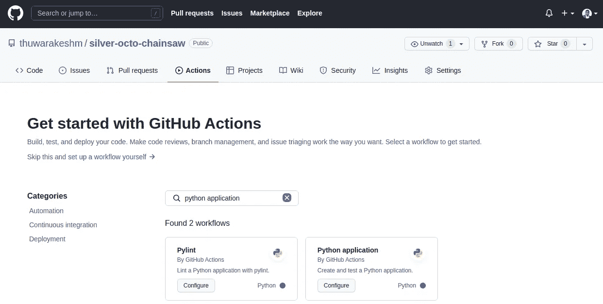
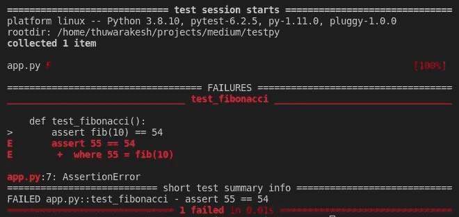
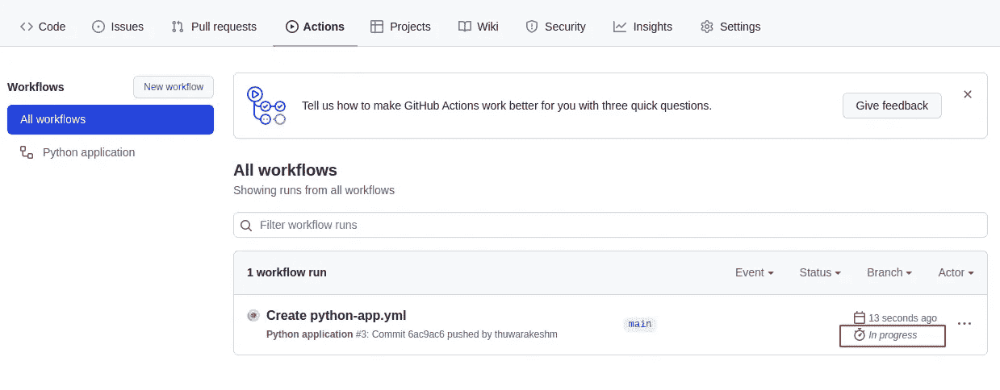
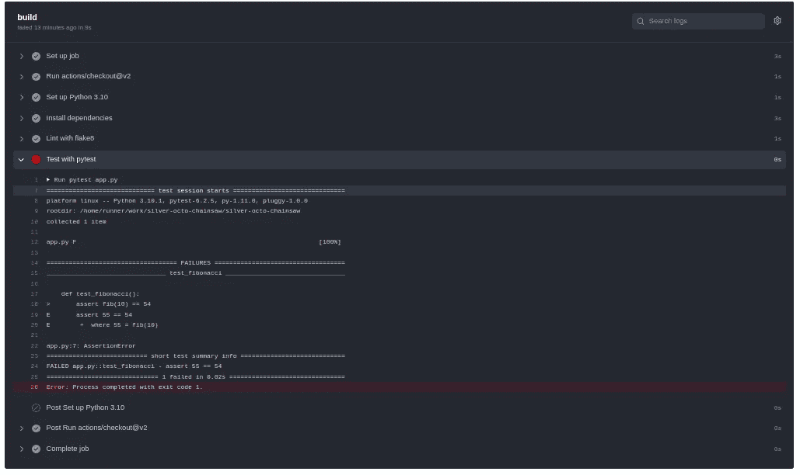
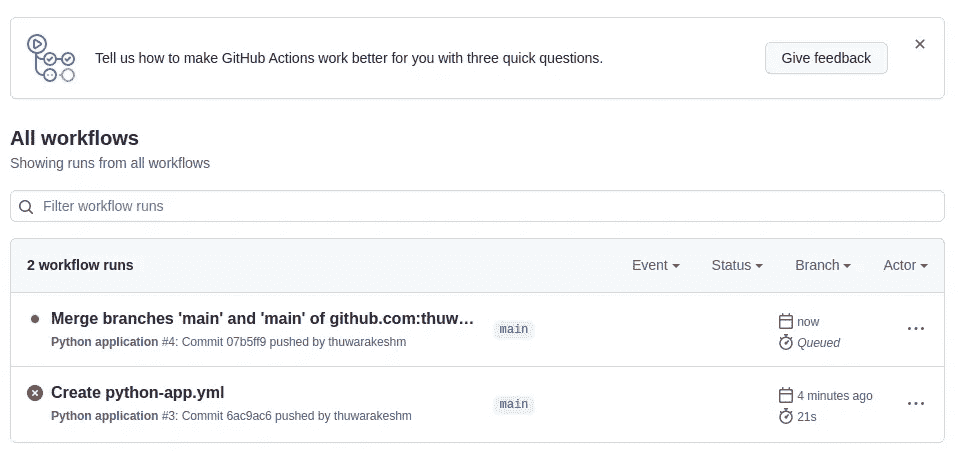

# 如何使用 GitHub 动作在每次提交时运行 Python 测试

> 原文：<https://towardsdatascience.com/github-automated-testing-python-fdfe5aec9446>

## 自动化枯燥的工作，并通过 CI 管道确保代码质量


使用 Github Actions 工作流运行 Python 测试——照片由 [RF 提供。_.来自](https://www.pexels.com/@rethaferguson?utm_content=attributionCopyText&utm_medium=referral&utm_source=pexels)[像素](https://www.pexels.com/photo/crop-laboratory-technician-examining-interaction-of-chemicals-in-practical-test-modern-lab-3825573/?utm_content=attributionCopyText&utm_medium=referral&utm_source=pexels)的工作室

避免错误比修复错误更容易。

测试是每个软件项目的关键组成部分。在几种不同类型的软件测试中，有些需要在每次提交时运行。例如，开发人员应该运行单元测试，以确保他们的新更改不会与之前的任何更改相矛盾。

然而，每次手动操作都是一种负担。这是一项枯燥、重复但不可避免的任务。编写单元测试很有趣，但不是在每次提交时都运行它们。

大多数开发团队使用他们的持续集成(CI)管道来触发它们。因此，开发人员不必担心无法运行它们。Github Actions 是一种(也许是非常流行的)这样的选项。

在这篇文章中，我将向您介绍我使用 Github 动作自动化 Python 测试的步骤。

</python-automl-sklearn-fd85d3b3c5e>  

# Python 测试如何在 GitHub 动作上工作

GitHub Actions 有一套预定义的工作流程，您可以即插即用。你也可以为流行的框架如 [Django](https://www.djangoproject.com/) 找到一个。我建议从其中一个开始，除非你的项目结构是独一无二的。

您可以通过点击 GitHub 存储库页面上的 Actions 选项卡来访问它。



GitHub 操作入门—作者截图。

在这篇文章中，我将使用下面的示例 Python 程序和测试。

运行 Python 测试来确认我们的斐波那契数生成函数是否正常工作。

我们可以在本地计算机上用`pytest app.py`运行上面的代码，其中 app.py 是模块的名称。运行它将导致如下所示的错误。



斐波那契数生成函数测试失败—作者截图。

现在，让我们在 GitHub Actions 上运行这个测试。执行以下操作，使项目成为 git 存储库，并将其推送到 GitHub。

```
# Create a requirement file to install dependencies whenever GitHub Actions runs the tests.
pip freeze > requirement.txtgit init
git add .
git commit -m 'initial commit'# Create a remote repository in github.com and do the following.
git remote add origin <Your Repository>
git branch -M main
git push -u origin main
```

您的远程存储库将包含两个文件；requirement.txt 和 app.py。转到操作选项卡并选择 Python 应用程序。

这将在中打开名为 python-app.yml 的新文件。github/工作流文件夹。您可以在这里配置事件、动作等。，以及它们的顺序。

默认文件是预先配置的，每当我们将更改推送到主分支或发出拉请求时，它都会运行一组操作。它运行在 Python 3.10 的 Ubuntu 容器上。从 requirement.txt 文件安装完依赖项后，它执行`pytest` shell 命令。

请将最后一行从`pytest`改为`pytest app.py`，并点击右上角的开始提交按钮。

因为我们已经将它配置为在每次推送时运行，所以您不必手动触发任何操作。如果您现在转到 Actions 选项卡，您可以看到我们创建的新工作流已经开始执行测试。



GitHub Actions 在提交时自动启动新的工作流——作者截图。

不出所料，一开始会失败。单击新的工作流运行，您可以看到它失败的原因。这与我们在本地运行它时出现的错误相同。



显示工作流运行错误的 GitHub 操作—作者截图。

每当新的变更没有通过测试，GitHub 也会给你发一封邮件。如果你正在遵循这个指南，一定要检查你的 GitHub 账户的收件箱。

让我们尝试在本地编辑它，并推送通过所有测试的代码。将断言中的值从 54 更改为 55，如下所示。

修正的斐波那契数生成函数及其测试。

现在提交这些更改并将其推送到远程存储库。在“操作”选项卡上，您可以看到一个新的工作流正在运行。



当我们将新的变更推送到远程存储库时，Github 动作会自动触发——作者截图。

这一次你也可以检查我们所有的测试没有任何错误通过。


GitHub 操作工作流运行中的所有测试通过—作者截图。

# 在 GitHub 操作中使用环境变量。

大多数 [python 项目都包含环境变量。](/python-project-structure-best-practices-d9d0b174ad5d)这些是每个部署所特有的特定变量。这个文件通常不放在远程存储库中。

</python-project-structure-best-practices-d9d0b174ad5d>  

例如，您可以在. env 文件中定义启动基于 Python 的 web 应用程序的端口。但是不需要将它提交给远程存储库，因为其他用户可能会使用不同的端口。

要为 GitHub 工作流指定环境变量，我们必须再次编辑 YAML 文件。在将操作系统设置成如下所示之后，让我们添加几行新代码。

在 GitHub 操作配置 YAML 文件中指定环境变量。

让我们更新代码，从环境文件中读取输入变量。应该是这样的。

从环境变量中读取值。

让我们提交并看看测试是否通过了 GitHub Actions 工作流。

```
git commit -am "Read inputs from env variables"
git push
```

如果您导航 GitHub 操作和相应的工作流运行，您现在可以看到测试通过。


测试功能从环境文件中读取输入并成功执行—作者截图。

# 更改工作流运行的触发器

每次有人向存储库提交变更时，都要执行一轮全面的测试，这可能有点过分。我们可能想把范围缩小到一个分支左右。

我们可以通过 YAML 文件完成这一工作和许多其他定制工作。在下面的例子中，我们配置为对 dev 分支的每个 push 和对 main 分支的每个 pull 请求运行测试。这也是大多数开发人员遵循的惯例。

更改配置 YAML 文件中工作流的触发函数。

要了解更多关于自定义触发器的不同方法，请查阅 [GitHub Actions 的文档](https://docs.github.com/en/actions/learn-github-actions/workflow-syntax-for-github-actions#on)。

# 安排测试

按照时间表运行测试也很常见。对于某些团队来说，这可能是唯一的做法。其他人可能更喜欢在每次推送时与测试并行进行。

我们可以[在 Github Actions 中安排工作流](https://docs.github.com/en/actions/learn-github-actions/events-that-trigger-workflows#scheduled-events)在特定的例程上运行。如果你熟悉玉米工作，你可以在 YAML 的文件中应用同样的方法。

这里有一个例子，它在每周日午夜运行我们的测试。

在配置 YAML 文件中的 GitHub 动作中安排测试。

# 最后的想法

CI 管道是 DevOps 的革命性一步。在 CI 管道中执行测试避免了将错误引入系统的机会。

我们可以使用 GitHub Actions 作为一个完美的 CI 工作流。在这篇文章中，我们讨论了如何在将任何更改推送到存储库之前使用它来执行 Python 测试。

我们还讨论了如何在 cronjobs 中调度工作流和定制事件触发器。我们可能必须非常具体地说明何时运行工作流。因为跑步是有代价的。

GitHub Actions 的[基本使用是免费的，最多 2000 分钟](https://docs.github.com/en/billing/managing-billing-for-github-actions/about-billing-for-github-actions)的系统时间。即使你的库是私有的，它也适用。但是超过这个限度，你就需要他们的一个付费计划。然而，如果这个库是一个公共库或者如果你使用你的私有库，它是完全免费的。

> 感谢阅读，朋友！在[**LinkedIn**](https://www.linkedin.com/in/thuwarakesh/)[**Twitter**](https://twitter.com/Thuwarakesh)[**Medium**](https://thuwarakesh.medium.com/)上跟我打招呼。
> 
> 还不是中等会员？请使用此链接 [**成为会员**](https://thuwarakesh.medium.com/membership) 因为，不需要你额外付费，我为你引荐赚取一小笔佣金。