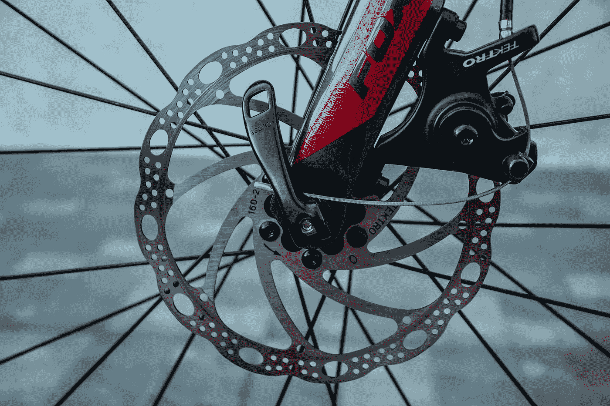
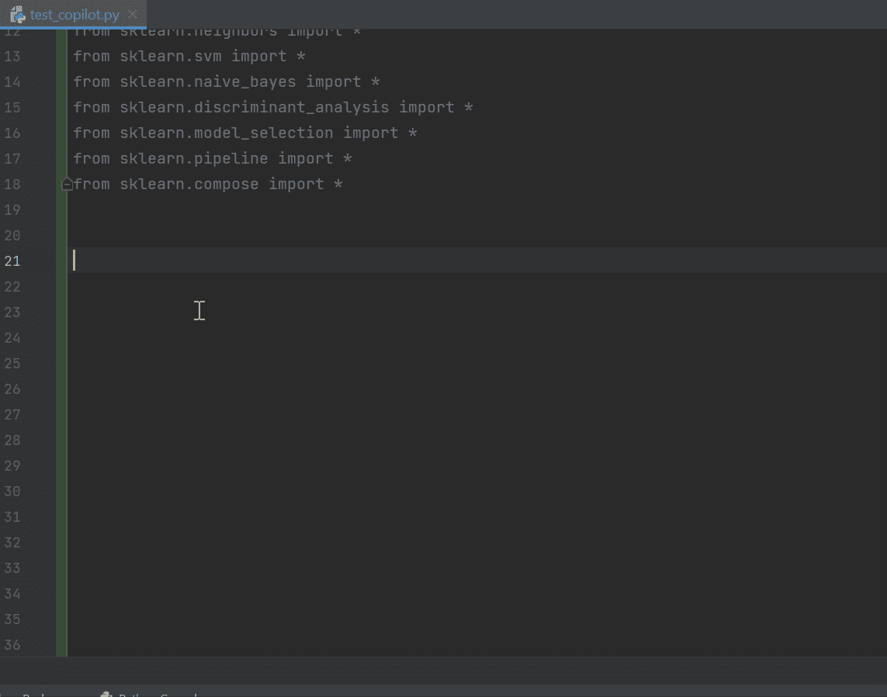
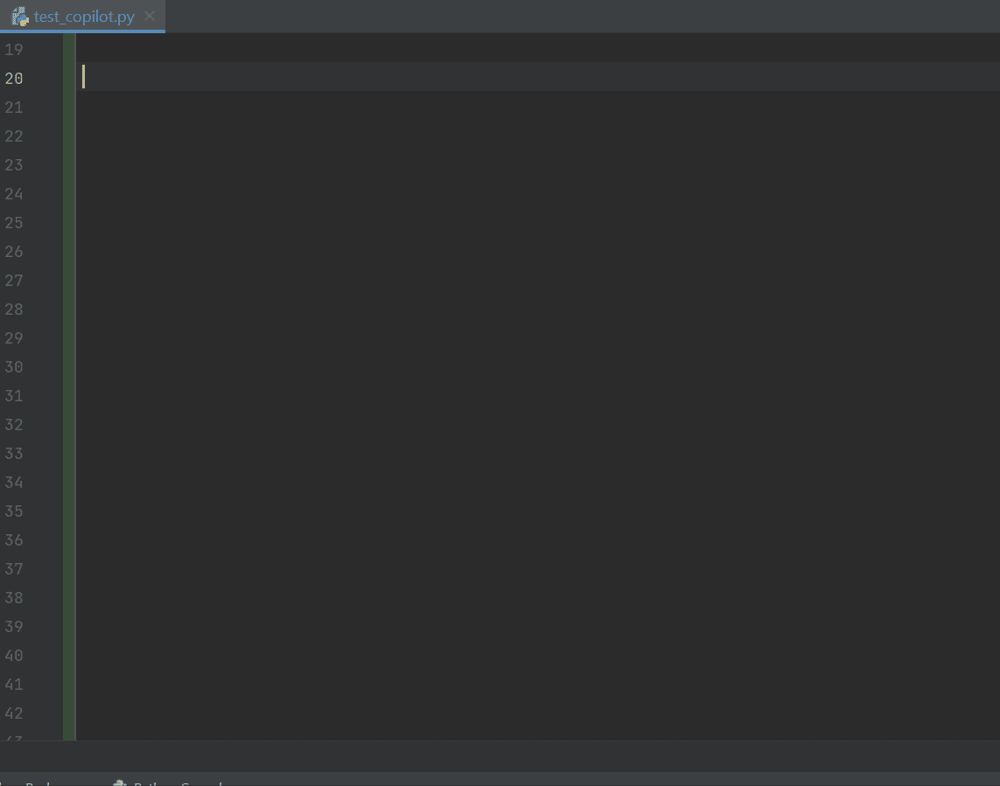
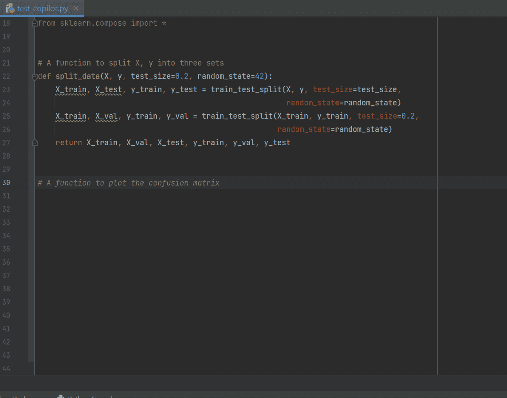
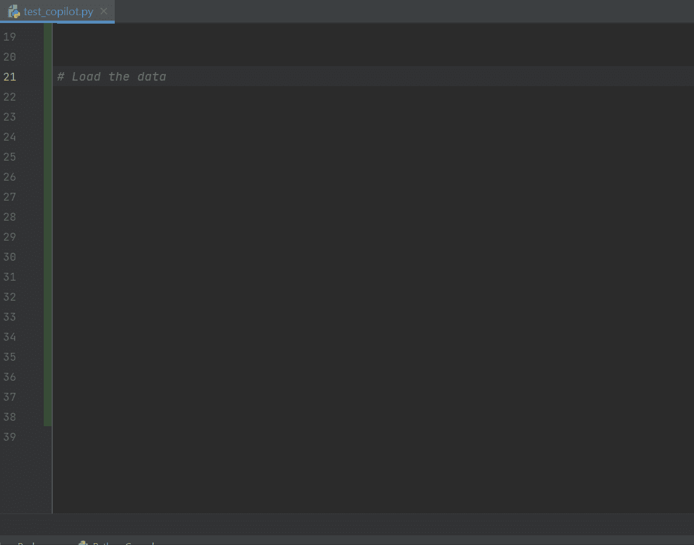
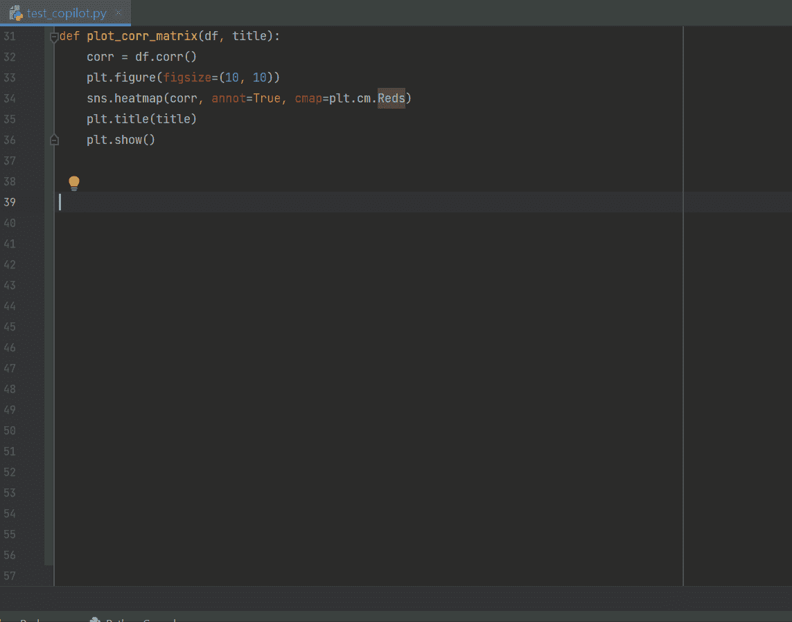
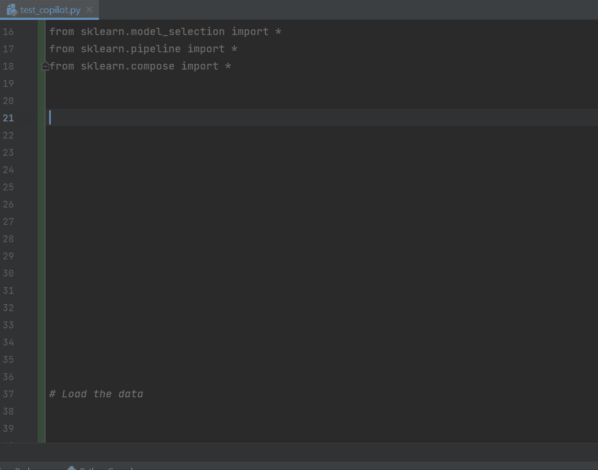
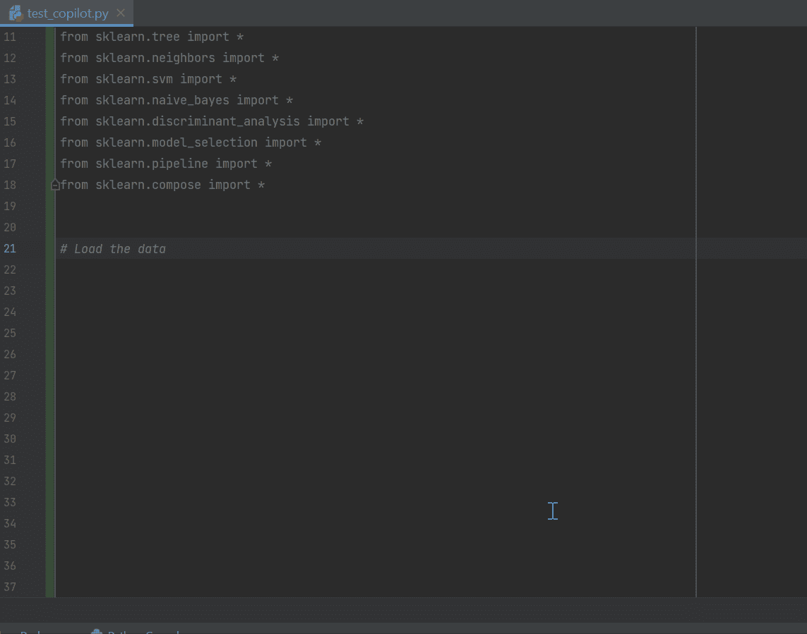
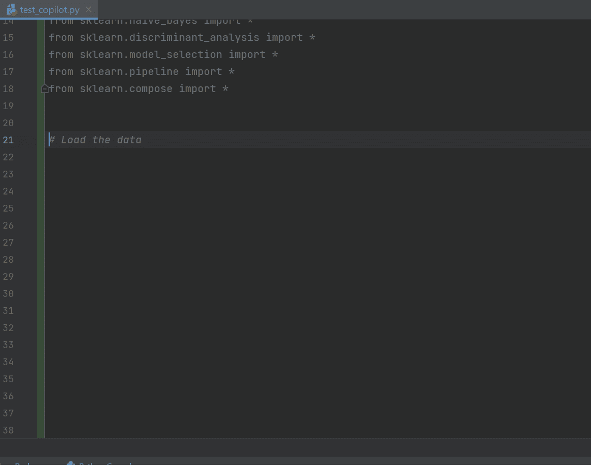

# GitHub Copilot 碾压数据科学和 ML 任务:终极回顾

> 原文：<https://towardsdatascience.com/github-copilot-crushes-data-science-and-ml-tasks-ultimate-review-c8bcbefb928a>

## 观看 Copilot 通过一次按键执行日常数据科学任务

**照片由** [**哈维谭维拉里诺**](https://www.pexels.com/@harveyvillarino?utm_content=attributionCopyText&utm_medium=referral&utm_source=pexels) **上** [**像素**](https://www.pexels.com/photo/vintage-technology-sport-bike-6503106/?utm_content=attributionCopyText&utm_medium=referral&utm_source=pexels)

## 介绍

我对自己说，要让我从 PyCharm 切换到 VSCode，需要的不仅仅是一个 AI 编码助手。那是 **Copilot Beta** 刚刚发布的时候，而且是 VSCode 专属。

我对它印象深刻，写了一篇关于它的文章([在网上疯传](/should-we-be-worried-now-that-github-copilot-is-out-12f59551cd95))，但我没有立即开始使用它的计划，如果我离开了十英里长的等候名单的话。

然后，几天前，我在 Twitter 上看到有人提到 Copilot 用于数据科学任务，我很想尝试一下，即使我必须安装 VSCode。令我高兴的是，我发现我不仅从等待名单中被清除了，而且我还可以在 PyCharm 中安装它。

在摆弄了一下这个工具之后，我没等多久就开始写这篇文章了。所以，开始了。

 [## 通过我的推荐链接加入 Medium-BEXGBoost

### 获得独家访问我的所有⚡premium⚡内容和所有媒体没有限制。支持我的工作，给我买一个…

ibexorigin.medium.com](https://ibexorigin.medium.com/membership) 

获得由强大的 AI-Alpha 信号选择和总结的最佳和最新的 ML 和 AI 论文:

 [## 阿尔法信号|机器学习的极品。艾总结的。

### 留在循环中，不用花无数时间浏览下一个突破；我们的算法识别…

alphasignal.ai](https://alphasignal.ai/?referrer=Bex) 

## 日常预处理任务的测试

让我们从小事开始，比如进口:

作者 GIF

只需要一行导入 Matplotlib 的提示就可以导入其他标准库。此外，在一个 Sklearn 语句之后，Copilot 开始从库中建议其他类。

如果您注意到，在用*改变其中一个导入语句以加载一个模块中的所有类之后，Copilot 选择了这个模式来整体导入其他模块。

然后，我将重点放在如下预处理任务上:

作者 GIF

Copilot 从一行注释中产生了完整的功能，将数据分为训练集、验证集和测试集——当您有如此多的数据，可以将其分为三个集时，通常会完成这项任务。

我还用 Copilot 写了一些函数，在打开一个新数据集的时候几乎都会用到。例如，一个处理`object`列的函数:

作者 GIF

`object`熊猫数据框中的列是最糟糕的——它们*吸*你的 RAM 为生。

如果你声称自己是一个真正的 Python 爱好者，那么下面的函数是不可协商的:

作者 GIF

如果你读过我去年 9 月的一些文章，你会知道我有点疯狂，全力以赴向[展示如何高效地处理大型数据集](/how-to-work-with-million-row-datasets-like-a-pro-76fb5c381cdd?source=your_stories_page----------------------------------------)。

在其中一篇文章中，我讨论了如何将列的数据类型转换为尽可能小的子类型，从而将数据集大小减少 90%。嗯，我让副驾驶重现了完全相同的功能，它出色地应对了这种情况:

作者 GIF

想象一下把这个打出来！

## 形象化

然后，我让 Copilot 展开它的可视化肌肉，开发一些功能来产生一些我通常手动创建的情节。

第一个想到的当然是创建一个关联热图:

作者 GIF

第一个建议是我最喜欢的一种热图——平方并以小数点后两位的精度标注。

接下来，我让 Copilot 为数据中的每个数字列创建一个 KDE 图网格。这是 Kaggle 上的一个流行视频，用于查看功能分布:

作者 GIF

这一次，Copilot 甚至用 NumPy Docs 风格编写的函数 docstring 让我感到惊讶——这是我的另一个最爱。

对于下一个，我想挑战 Copilot——我告诉它创建一个绘制两个时间序列的函数，以比较它们的增长:

作者 GIF

比较两个时间序列特征只能在归一化后进行。我不得不几次改变注释的措辞，并查看替代建议以获得这个版本的函数。

我也有点觉得好笑，副驾驶用第一人称写了第一条评论。但是，我感到失望的是，副驾驶将两个时间序列列彼此相对放置，而不是在顶部。

最近，我非常喜欢 UMAP 的****以及它如何在不丢失太多底层结构的情况下投射数据两个 2D。我想知道副驾驶是否能产生一个函数，用 UMAP 做 2D 投影，并画出结果。****

****我很惊讶它可以，因为 UMAP 应该是一个非常年轻的图书馆，GitHub 上没有太多关于它的代码:****

********

****显然，我错了。****

## ****机器学习任务****

****对于 ML 任务，我想从小处着手，比如让 Copilot 拟合一个线性回归模型:****

********

****作者 GIF****

****由于线性回归是最广泛使用的算法，我收到了许多好的建议。****

****然后，回到时间序列，我想要一个检测静态列的函数。[平稳是时间序列](/how-to-remove-non-stationarity-in-time-series-forecasting-563c05c4bfc7)中的一个基本概念，经常出现:****

********

****作者 GIF****

****这个建议非常粗糙，无法与你在`statsmodels` TSA 模块中拥有的优秀功能相提并论。但是我们必须承认它正确地解释了我的动机。****

****最后，终极挑战—我希望 Copilot 仅使用 NumPy 从零开始实施 PCA:****

********

****作者 GIF****

****这是最难做对的一个——我不得不多次修改注释，甚至打开/关闭文件几次来得到一个合理的建议。****

## ****多方面的****

****在这里，您可以看到我心血来潮修改的一些其他功能。****

****计算两个坐标之间的曼哈顿距离:****

********

****作者 GIF****

****创建嘈杂的图像:****

********

****作者 GIF****

****分类列的目标编码:****

********

****作者 GIF****

****将 Jupyter 笔记本解析为 JSON:****

********

****作者 GIF****

## ****副驾驶——判决****

****我在使用 Copilot 时注意到一些事情。****

****首先，它有很好的语境感。当我在脚本中包含/排除特定的库或一些代码时，我得到的建议经常改变。****

****在另一个个人项目中，我意识到 Copilot 可以从其他文件中提取特定的引用来帮助我编写剩余的代码。它也可以适应我的编码风格和评论。考虑到局部和全局变量，它完成了不同复杂度的`for`和`while`循环。****

****这是一个很好的节省时间的方法，特别是在你可以毫无困难地编写代码块，但是仍然需要花时间来编写的情况下。****

****通过在注释或文档字符串中尽可能具体，我得到了最好的结果。仅使用像 DataFrame 这样的词而不使用`X, y`会导致不同的功能或参数。****

****我会继续使用它吗？见鬼，是啊！****

****虽然我大部分时间都呆在 Jupyter 实验室，但像许多其他数据科学家一样，我猜想当人们想转向开源、生产级数据科学时，Copilot 会非常有帮助。在那个阶段，你将把大部分代码从笔记本转移到脚本中，在那里你可以愉快地使用 Copilot 的协助。****

****考虑到该软件仍处于测试阶段，它已经是一个了不起的工具。****

****感谢您的阅读！****

******您可以使用下面的链接成为高级媒体会员，并访问我的所有故事和数以千计的其他故事:******

**** [## 通过我的推荐链接加入 Medium。

### 作为一个媒体会员，你的会员费的一部分会给你阅读的作家，你可以完全接触到每一个故事…

ibexorigin.medium.com](https://ibexorigin.medium.com/membership) 

**或者直接订阅我的邮件列表:**

 [## 每当 Bex T .发布时收到电子邮件。

### 每当 Bex T .发布时收到电子邮件。注册后，如果您还没有中型帐户，您将创建一个…

ibexorigin.medium.com](https://ibexorigin.medium.com/subscribe) 

**你可以在** [**LinkedIn**](https://www.linkedin.com/in/bextuychiev/) **或**[**Twitter**](https://twitter.com/BexTuychiev)**上联系我，友好地聊一聊所有的事情数据。或者你可以读我的另一个故事。这些怎么样:**

 [## 再见熊猫！遇见 Terality——它邪恶的孪生兄弟有着相同的语法

### 编辑描述

towardsdatascience.com](/good-bye-pandas-meet-terality-its-evil-twin-with-identical-syntax-455b42f33a6d)  [## 2022 年你必须小心的 8 个蓬勃发展的数据科学图书馆

### 编辑描述

towardsdatascience.com](/8-booming-data-science-libraries-you-must-watch-out-in-2022-cec2dbb42437)  [## 6 个熊猫的错误，无声地告诉你是一个菜鸟

### 编辑描述

towardsdatascience.com](/6-pandas-mistakes-that-silently-tell-you-are-a-rookie-b566a252e60d)  [## Kagglers 正在使用的 7 个很酷的 Python 包

### 编辑描述

towardsdatascience.com](/7-cool-python-packages-kagglers-are-using-without-telling-you-e83298781cf4)  [## 22–2 个您不知道存在的内置 Python 库| P(保证)= .8

### 编辑描述

towardsdatascience.com](/22-2-built-in-python-libraries-you-didnt-know-existed-p-guarantee-8-275685dbdb99)  [## 如何在 2022 年开始使用 Kaggle(即使你很害怕)

### 编辑描述

towardsdatascience.com](/how-to-get-started-on-kaggle-in-2022-even-if-you-are-terrified-8e073853ac46)****