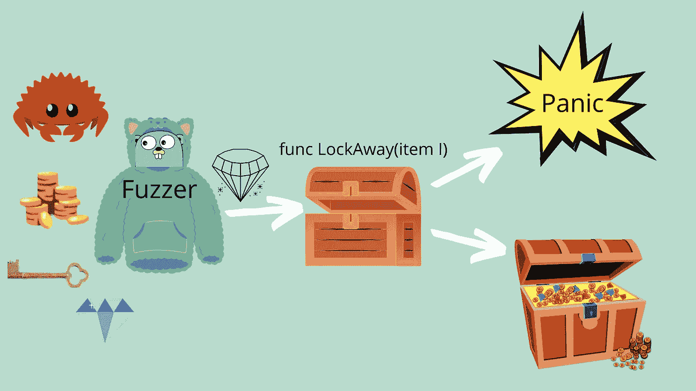

# Go 1.18 带来了许多惊人的变化

> 原文：<https://towardsdatascience.com/go-1-18-comes-with-many-amazing-changes-d33ac0afd6ee>

## Go 1.18 将于二月发布，它包含了多项改进语言的变化

图片由珀西·博尔梅尔提供。Gopher 由拓也·上田提供，原始 Go Gopher 由勒内·弗伦奇提供(CC BY 3.0)

期待已久的围棋 [1.18](https://tip.golang.org/doc/go1.18) 即将到来，这可能是很长一段时间以来讨论最多的围棋更新。语言中加入了一些重要的新东西，其中最突出的是泛型。

许多新加入的东西被忽略了，因为每个人都专注于泛型，所以让我们快速回顾一下即将到来的所有变化。在即将到来的更新中，有一些我觉得很重要的改变，你看不到提到那么多。

对于一些主要特性，我有一篇深入的文章，如果您想更深入地了解该特性，欢迎阅读。

如果你想看视频，你可以在我的 Youtube 上找到这篇文章。

我在视频中讲述了 Go 1.18 的所有变化

## 无商标消费品

泛型的可视化解释，用函数表示的一行，泛型接受多个输入。图片由珀西·博尔梅尔提供。Gopher 由拓也·上田提供，原始 Go Gopher 由勒内·弗伦奇提供(CC BY 3.0)

如前所述，Go 最终得到了泛型。这似乎是一个让开发人员感到不安的话题，一些开发人员似乎喜欢这个想法，一些似乎讨厌它。

泛型是一种允许函数接受多种不同数据类型的方式。当您必须对许多不同的类型执行相同的操作时，这很有用。

Go 中缺少泛型的问题以前已经解决了，每个数据类型使用重复的函数，或者使用一个空的`interface{}`来处理所需的数据类型，这个空的`interface{}`是用一个大的`switch`进行类型转换的。这两种变通方法是解决泛型缺乏的常见方法。在 1.18 版本中，这些解决方案，或者说黑客攻击可以被移除。

> `[]interface{} hack — Generic Developer`的日子一去不复返了

想象一下，你需要对一部分整数和一部分浮点数的值求和。这将需要您有两个重复的函数，函数将是相同的，一个`for range`通过并添加值并返回结果。唯一的区别是定义的输入参数数据类型。

在泛型出现之前，这需要一个特定于每种数据类型的汇总函数，如下所示。

用重复函数求解不同数据类型的总计数

使用泛型，所有这三个汇总函数都可以用同一个函数来代替。

让我们看看用泛型来解决这个问题时是什么样子。

汇总总值的通用解决方案

在我看来，这是一个巨大的进步。不仅减少了代码量，而且更易于维护、阅读，是一个不太复杂的解决方案。

如果你想了解更多关于如何使用泛型的知识，你可以阅读我写的关于泛型的文章。在这篇文章中，我们介绍了如何使用泛型，以及还可以用它做些什么。

 [## 在围棋中学习泛型

### 泛型在更新 1.18(将于 2022 年 2 月发布)中推出，带有一系列其他闪亮的新功能。你可以…

medium.com](https://medium.com/@percybolmer/learning-generics-in-go-318f53752ccd) 

## 模糊测试

Go 中的 Fuzzing 允许我们测试随机生成的函数输入。图片由珀西·博尔梅尔提供。Gopher 由拓也·上田提供，原始 Go Gopher 由勒内·弗伦奇提供(CC BY 3.0)

模糊是我最喜欢的更新之一。我很惊讶人们不再谈论它。它将使我们能够在测试过程中生成输入参数。

这听起来可能不多，但是它允许我们容易地扩展单元测试来定位和跟踪更多的 bug。表驱动测试允许我们给出许多不同的输入，但是你可能不会写几百个不同的测试输入，但是 fuzzing 可以允许这样产生。

Fuzzing 允许你测试数以千计的不同输入，这有助于发现隐藏的错误，你可能不会想到自己检查的错误。

关于模糊化的想法是，通过为你的函数生成一堆不同的输入，有更高的机会找到突破性的边缘情况。fuzzing 包将接受一个示例输入作为基础，称为`seed corpus`。fuzzer 将使用这些示例作为起点，并对其进行修改，以找到导致函数中断的值。

Fuzzing 将被添加到`testing`包中，它将是一个新的结构，使用方式与`testing.T`相同，但不是`testing.F`。

来自 [go.dev](https://go.dev/blog/fuzz-beta) 的一个关于 fuzzing 的例子看起来是这样的，注意他们如何添加 GET 查询参数作为种子语料库，这将允许 fuzzer 生成数千个类似的输入。

go.dev —模糊示例

如果你想了解如何使用 fuzzer 和编写 fuzzing 函数，for，etc HTTP 处理程序或更多，那么你可以阅读我的文章。

 [## 围棋模糊测试

### Fuzzing 是作为 Go 1.18 中标准库的一部分发布的。这是一个很酷的方法来定位你的…

medium.com](https://medium.com/@percybolmer/fuzzing-tests-in-go-96eb08b7694d) 

## 工作区

工作区模式允许我们以更好的方式替换版本和模块。图片由珀西·博尔梅尔提供。Gopher 由拓也·上田提供，原始 Go Gopher 由勒内·弗伦奇提供(CC BY 3.0)

发布工作区是为了让开发人员能够轻松地切换项目中使用的模块版本。这样做的原因是为了在同时处理多个模块时简化开发。

如果你一直在公司环境中使用 go 模块，你很可能被迫添加一个`replace`指令来改变或强制使用一个包的本地版本。

`replace`指令很容易忘记从您的`go.mod`文件中删除，如果将其推送到存储库，将会破坏其他开发人员的模块。因为工具现在将使用在`go.mod`文件中给定的路径，这很可能不存在于另一个开发人员的计算机上。

如果你对`replace`不熟悉，你可以通过告诉它用本地路径或特定版本替换某个模块来替换要在`go.mod`文件中使用的模块，让它获取一个本地分支，而不是用`go get`获取库

go . mod-最小替换指令。

你可以在要点中看到我是如何告诉 go 工具，任何时候它看到`github.com/programmingpercy/mymodule`它都应该从我在`/home/users/percy/experimental/mymodule`的计算机上的本地路径获取，而不是使用`go get`

最后，我们有一个针对`go.mod`文件中的`replace`指令的补救措施。这对我来说很重要，我经常发现自己同时在多个模块上工作，同时对它们进行修改。

要开始使用他们所说的`workspace`模式，您可以使用常规的 go 工具初始化工作区。类似于创建一个模块，您运行`go work init`。这将创建您的工作空间文件，我们可以开始使用。

注意，工作空间模式将使许多 go 工具开始使用`go.work`文件，并为您修改它。go 团队声明您不应该将`go.work`文件推送到存储库，因为这将在`go.mod`文件中再次引入`replace`的问题。

工作区模式将强制使用`go.work`中提到的所有模块，类似于`go.mod`文件。我们仍然可以使用`replace`指令来指定要使用的模块。这允许您继续使用 replace 指令，同时保持您的`go.mod`文件干净，并且只有。git 忽略`go.work`。

在[的提议中，](https://go.googlesource.com/proposal/+/master/design/45713-workspace.md)提到了更多的特性，在不同工作区之间切换以轻松测试多个依赖版本的能力，等等。迫不及待地想尝试这个功能。

## 荣誉奖

有一些变化值得一提，但没有大到足以有他们的一章。

**任何** —如果你开始看到`any`出现在 go 代码库中，不要惊慌。这是`interface{}`的一个新的预声明别名

**可比较的** —一个接口的预声明别名，包含所有可以使用`==`和`!=`进行比较的类型。这与泛型相关联，并被用作约束。

net/netip — 看起来我们将会得到一个新的处理 ip 地址的包。我在 Go 里做过很多人脉，处理 IP 地址一直很痛苦。看起来我不是唯一一个经历这种情况的人，让我们希望这个解决方案会更好。

**琴弦。削减**——我从来不知道我们需要的改进。strings 包附带了一个新的函数，`Cut`，它将找到一个分隔符并返回在分隔符前后找到的任何内容。它还将返回一个布尔值，表明是否找到了分隔符。

> IP:端口—我正看着你

## 结论

此次更新将带来许多受欢迎的变化。go 团队一直在努力工作，我们可以从许多重大变化中看出这一点。

我特别喜欢工作区和 fuzzing 的介绍。

go 语言正在成熟，作为一个地鼠，我很自豪地看着它成长。

如果你喜欢我写的文章，如果你想了解如何使用新特性，请确保查看关于主要主题的深入文章。你应该了解一下[泛型](https://medium.com/@percybolmer/learning-generics-in-go-318f53752ccd)和[模糊化](https://medium.com/@percybolmer/fuzzy-testing-in-go-96eb08b7694d)。

你还在等什么，[下载](https://go.dev/dl/#go1.18beta1)1.18 更新，并开始使用所有新的闪亮奖品！