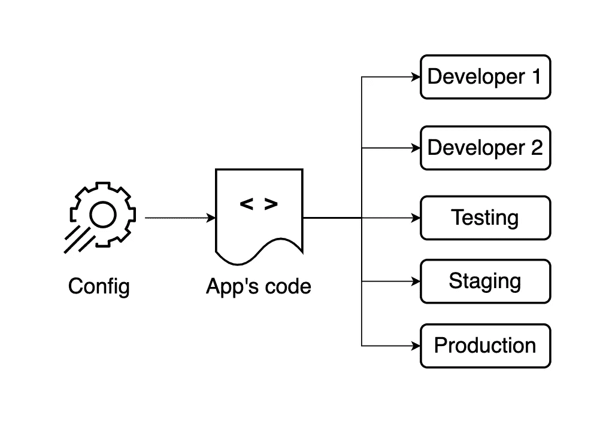

# 优秀的数据科学家写出优秀的代码

> 原文：<https://towardsdatascience.com/good-data-scientists-write-good-code-28352a826d1f>

## 为数据产品开发代码时如何善待自己和同事的建议

照片由[奎诺·阿尔](https://unsplash.com/@quinoal?utm_source=medium&utm_medium=referral)在 [Unsplash](https://unsplash.com?utm_source=medium&utm_medium=referral) 上拍摄

# 数据产品是软件应用程序

作为数据科学家，我们构建*数据产品*，即使用数据解决现实世界问题的产品。根据手头的问题，数据产品可以采取许多不同的形状和形式，包括静态报告、实时仪表板、交互式 web 应用程序、基于机器学习的 web 服务等。将这些类型的产品联系在一起的是，构建它们需要编写代码，例如用 Python、R、Julia 和/或 SQL 的一种方言编写代码。因此，尽管复杂性不同，但大多数数据产品本质上都是软件应用程序。

给定数据产品背后的代码的复杂性不仅取决于该产品的性质，还取决于其开发阶段。CRISP-DM 是一个众所周知的框架，它描述了数据科学项目不同阶段发生的事情。CRISP-DM 包括六个主要阶段:(I)业务理解，(ii)数据理解，(iii)数据准备，(iv)建模，(v)评估，和(vi)部署。随着项目的进展，对底层代码库的质量和健壮性的要求通常会增加。此外，数据科学项目通常需要业务利益相关者、其他数据科学家、数据工程师、IT 运营专家等各种参与者协调一致的努力。因此，为了使整个过程尽可能顺利和有效，并使相关的业务风险最小化，一个好的数据科学家应该(在许多其他事情中)能够编写好的代码。

但是什么才是“好代码”呢？也许这个问题最简洁的答案可以在下面的插图中找到，它打开了 R. C. Martin 的流行的“[干净代码](https://www.pearson.com/en-us/subject-catalog/p/clean-code-a-handbook-of-agile-software-craftsmanship/P200000009044/9780132350884)”一书:

这张图片是经 OSNews.com 许可复制的

为了减少数据科学代码中的 [WTF](https://dictionary.cambridge.org/dictionary/english/wtf) s/minute，我们可以遵循几十年来在[软件工程](https://en.wikipedia.org/wiki/History_of_software_engineering)领域开发的一些最佳实践。在[我作为数据科学家和顾问的工作](http://nextgamesolutions.com/)中，我发现以下最佳实践和原则特别相关和有用:

*   新团队成员加入项目所需的时间和成本最少；
*   代码以模块化的方式编写，并进行版本控制和单元测试；
*   该应用程序是完全可配置的，并且不包含控制其执行的硬编码值；
*   应用程序在执行环境之间是可移植的；
*   应用程序是可扩展的，无需改变工具、架构或开发实践；
*   没有同行评审，任何代码都不会被部署到产品中；
*   有一个监控基础设施，允许人们跟踪和了解应用程序在生产中的行为。

以下是对数据科学背景下的这些最佳实践的简要评论，以及一些关于如何实施它们的建议。处于职业生涯早期的数据科学家可能会对本文特别感兴趣。然而，我相信经验丰富的专业人士和数据科学经理也可以在这里找到有用的信息。

# 一次性写出一段完美的代码几乎是不可能的，这没关系

在数据科学项目中清晰地制定需求并不常见。例如，商业利益相关者可能希望使用机器学习模型来预测某个数量，但他们很少能够说出该预测的可接受不确定性。许多其他未知因素可能会进一步阻碍和减缓数据科学项目，例如:

*   手头的问题能在第一时间用数据解决吗？
*   哪些数据有助于解决这个问题？
*   数据科学家能访问这些数据吗？
*   现有数据质量是否足够好，是否包含足够强的“信号”？
*   将来建立和维护一个包含所需数据的 feed 需要多少成本？
*   使用某些类型的数据是否有任何法规限制？

因此，数据科学项目通常需要大量的时间和资源，变得高度迭代(参见上面提到的 CRISP-DM)，并且可能完全失败。鉴于数据科学项目的高风险本质，尤其是在项目的早期阶段，从第一天开始就编写生产级代码没有太大意义。相反，更务实地进行代码开发是有用的，类似于软件开发项目中的做法。

[我发现一种特别相关的软件开发方法](https://wiki.c2.com/?MakeItWorkMakeItRightMakeItFast)建议按照以下阶段来考虑应用程序代码库的发展:“*让它工作，让它正确，让它快速*”。在数据科学的环境中，这些阶段可以解释如下:

*   *让它工作*:为手头的业务问题开发一个原型解决方案，以便分析该解决方案，从中学习，并决定进一步的开发和部署是否合理。例如，这可能涉及使用默认超参数在有限的数据样本上快速构建预测模型。这个阶段的代码不一定要“漂亮”。
*   *纠正错误*:如果原型开发工作显示出有希望的结果，并且决定开发和部署成熟的数据产品，那么进展到这个阶段是合理的。原型代码现在被扔掉了，新的、产品级的代码按照相应的需求和最佳实践编写。
*   *快速完成*:在生产环境中运行部署的应用程序一段时间后，可能会到达这个阶段。观察一个数据产品在“野外”的行为通常会发现各种各样的计算效率低下。虽然产品本身可能会交付预期的商业价值，但这种低效率可能会导致不必要的成本(例如，由于云平台上的计算成本)，从而降低项目的整体 ROI。当这种情况发生时，人们可能需要回到应用程序代码库并尝试优化它。

现在让我们更深入地研究每一个想法，看看代码质量需求是如何随着项目的发展而变化的。

# 一.使其发挥作用

图片来自 [Bernd](https://pixabay.com/users/momentmal-5324081/) 来自 [Pixabay](https://pixabay.com/photos/cart-wood-middle-ages-spokes-2581608/)

## 首先建立一个原型

数据科学，就像任何其他科学一样，都是关于“弄清楚事情”，发现对于给定的问题什么可行，什么不可行。这就是为什么在一个项目的开始阶段，先从小处着手并构建原型是很重要的。根据[维基百科](https://en.wikipedia.org/wiki/Prototype)，

> 原型是为测试概念或过程而构建的产品的早期样品、模型或版本

这个定义的最后一部分特别重要:我们构建原型来尽可能廉价地分析和学习它们，以便我们可以快速决定进一步的开发和部署是否合理 [ROI-wise](/return-on-investment-for-machine-learning-1a0c431509e) 。如果使用得当，原型可以在开发周期的早期节省大量的时间、金钱和痛苦。

原型在数据科学项目中的实际形式取决于所解决的问题。示例包括但不限于:

*   展示可用数据价值的探索性分析；
*   quick-n-dirty 预测模型，其性能指标有助于了解手头的问题是否可以用数据来解决；
*   在本地静态数据集上运行的 web 应用程序，用于收集早期最终用户反馈。

## 原型代码是一次性代码

原型解决方案的代码需要被视为*一次性代码*。作为领导项目的数据科学家或项目经理，您必须向您的利益相关者明确说明这一点*。引用我最喜欢的一本书，《实用主义程序员》(Hunt&Hunt 2019)，*

> *“我们很容易被演示原型的表面完整性所误导，如果您没有设定正确的期望，项目发起人或管理层可能会坚持部署原型(或其子代)。提醒他们，你可以用轻木和胶带制作一个很棒的新车原型，但你不会试图在交通高峰期驾驶它！”*

*数据产品的原型实际上不需要写成代码。为了快速前进，可以(有时甚至应该)使用[低代码或无代码数据科学工具](/no-code-low-code-ai-new-business-models-and-future-of-data-scientists-a536beb8d9e3)构建原型。然而，当一个原型*被*写成代码时，有几个应该记住的注意事项。*

## *将原型构建为代码时，可以做什么*

*由于原型代码是一次性的，它:*

*   *不必“漂亮”或优化计算速度，因为开发速度在这个阶段更重要；*
*   *不必记录到与生产级代码相同的级别(但是，应该有足够的注释和/或基于 Markdown 的注释来理解代码的作用并确保其可再现性)；*
*   *不一定要受版本控制(尽管在任何项目开始时设置版本控制总是一个好主意)；*
*   *有硬编码的值也可以(但是*不是* 敏感的，比如密码，API 密匙等。);*
*   *可以编写并存储在 Jupyter 笔记本或类似介质(例如 [R Markdown 笔记本](https://rmarkdown.rstudio.com/lesson-10.html))中，而不是组织到函数库和/或生产就绪脚本集合中。*

## *当构建一个代码原型时，*不*可以做什么*

*尽管原型代码是一次性的，但项目仍有可能进入下一阶段，即开发一个成熟的数据产品。因此，人们应该尽最大努力编写尽可能类似于产品级代码的原型代码。这可以大大加快后续的开发过程。最起码，以下是在构建代码原型时*不*可以做的事情(参见下面的进一步讨论):*

*   *对变量和函数使用隐晦或缩写的名称；*
*   *混合代码风格(例如，在 Python 或 R 等语言中随机使用`camelCase`和`snake_case`来命名变量和函数，或者在 SQL 中使用大写和小写的命令名)；*
*   *根本不在代码中使用注释；*
*   *具有敏感值(密码、API 密钥等。)在代码中公开；*
*   *不要将笔记本或脚本与原型代码一起存储，以备将来参考。*

# *二。做正确的事*

**

*图片来自 [Pixabay](https://pixabay.com/illustrations/citroen-type-c-5cv-cabriolet-6655053/) 的 [Emslichter](https://pixabay.com/users/emslichter-1377910/)*

*如果原型阶段显示出积极的结果，项目可以继续开发生产就绪的解决方案。将数据产品提供给人类用户或其他系统的过程称为*部署*。数据产品的部署通常会带来大量的硬性要求，包括但不限于:*

*   *特定于项目的 SLA(例如，服务于模型预测的 API 的足够低的响应时间，web 应用程序的高可用性和并发性，等等。);*
*   *以完全自动化和可扩展的方式部署和运行应用程序的基础设施([devo PS](https://en.wikipedia.org/wiki/DevOps)/[m lops](https://en.wikipedia.org/wiki/MLOps))；*
*   *当应用程序需要时，提供高质量输入数据的基础设施；*
*   *监控运营(如 CPU 负载)和产品相关指标(如预测准确性)的基础设施；*
*   *对业务关键型应用程序的持续运营支持等。*

*数据工程、MLOps 和 DevOps 团队将涵盖其中的许多需求。此外，随着项目的进展，这些工程团队扮演的角色变得越来越重要。然而，数据科学家也必须“把事情做对”。让我们看看这对代码质量意味着什么。*

## *使用描述性变量名称*

*你能猜出下面这段代码中的`x`、`y`和`z`是什么意思吗？*

*`z = x / y^2`*

*如果不知道这段代码适用的上下文，基本上不可能说出这三个变量分别代表什么。但是，如果我们将这一行代码重写为:*

*`body_mass_index = body_mass / body_height^2`*

*现在代码做了什么就很清楚了——它通过将体重除以身高的平方来计算[体重指数](https://en.wikipedia.org/wiki/Body_mass_index)。此外，这段代码完全是 [*自文档化的*](https://en.wikipedia.org/wiki/Self-documenting_code)——不需要提供任何关于它计算什么的额外注释。*

*认识到生产级代码不是为我们自己写的，而是主要为其他人写的，这一点非常重要。其他人在某个时候会审查它，为它做出贡献，或者维护它向前发展。对变量、函数和其他对象使用*描述性名称* 将有助于显著减少理解代码功能所需的*认知工作* ，并将使代码更易于维护。*

## *使用一致的编码风格*

*如果代码是根据标准格式化的，那么阅读和理解一段代码所需的认知努力可以进一步减少。所有主要的编程语言都有他们官方的*风格指南* **。一个开发团队选择哪种风格并不重要，因为最终都是关于一致性。然而，如果团队选择一种风格并坚持使用它，这真的很有帮助，然后强制使用所采用的风格成为每个团队成员的集体责任。数据科学语言常用的代码风格示例包括 [PEP8](https://www.python.org/dev/peps/pep-0008/) (Python)、 [tidyverse](https://style.tidyverse.org) (R)以及 Simon Holywell (SQL)的 [SQL 风格指南](https://www.sqlstyle.guide/)。***

*为了编写风格一致的代码，而不必考虑所选风格的规则，请使用一个 [*集成开发环境*](https://en.wikipedia.org/wiki/Integrated_development_environment) (IDE)，如 [VSCode](https://code.visualstudio.com/) 、 [PyCharm](https://www.jetbrains.com/pycharm/) 或 [RStudio](https://www.rstudio.com/products/rstudio/) 。流行的 [Jupyter 笔记本](https://jupyter.org/)可以方便地进行原型开发，但是，它们*不*意味着**用于编写生产级代码，因为它们[缺少专业 IDE 提供的大多数功能](https://docs.google.com/presentation/d/1n2RlMdmv1p25Xy5thJUhkKGvjtV-dkAIsUXP-AL4ffI/)(例如，代码高亮显示和自动格式化、实时类型检查、导航到函数和类定义、依赖管理、与版本控制系统的集成等)。).从 Jupyter 笔记本上执行的代码也容易出现许多[安全问题](https://www.helpnetsecurity.com/2017/01/26/jupyter-notebooks-security-hole/)和各种不可预测的行为。***

*如果出于某种原因，你最喜欢的 IDE 不能根据给定的风格自动格式化代码，那么使用一个专用的库来做这件事，比如 Python 的`[pylint](https://pypi.org/project/pylint/)`或`[flake8](https://pypi.org/project/flake8/)`，R 的`[lintr](https://cran.r-project.org/web/packages/lintr/index.html)`或`[styler](https://cran.r-project.org/web/packages/styler/index.html)`，SQL 的`[sqlfluff](https://www.sqlfluff.com/)`。*

## *编写模块化代码*

*模块化代码是被分解成小的独立部分(例如函数)的代码，每个部分做*一件事*并且只做一件事。以这种方式组织代码使得维护、调试、测试和与他人共享变得更加容易，最终有助于更快地编写新程序。*

*设计和编写函数时，请遵循以下最佳实践:*

*   **保持简短*。如果您发现您的函数包含几十行代码，请考虑进一步拆分这些代码。*
*   **使代码易于阅读和理解*。除了使用描述性名称之外，还可以通过避免在项目中使用高度专业化的编程语言结构来实现这一点(例如，复杂的列表理解、过长的方法链或 Python 中的修饰符)，除非它们能显著提高代码速度。*
*   **尽量减少函数参数的数量*。这不是一个硬性规定，也有例外，但是如果你写的函数有 3-5 个以上的参数，它可能做了太多的事情，所以考虑进一步拆分它的代码。*

*互联网上充满了如何模块化 Python 代码的例子。对于 R 来说，有一本优秀且免费的书“ [R 包](https://r-pkgs.org/)”。许多这类对数据科学家有用的建议也可以在 [Laszlo Sragner](https://www.linkedin.com/in/laszlosragner/) 的[博客](https://hypergolic.co.uk/blog/)中找到。*

## *不要对敏感信息进行硬编码*

*为了安全起见，产品代码必须*永不* 以硬编码常量的形式暴露任何敏感信息。敏感信息的示例包括数据库的资源句柄、用户密码、第三方服务的凭证(例如，云服务或社交媒体平台)等。检验您的代码是否正确地排除了这些变量的一个很好的试金石是，它是否可以在任何时候开放源代码而不损害任何凭证。[十二因素应用](https://12factor.net/)方法建议将敏感信息存储在 [*环境变量*](https://en.wikipedia.org/wiki/Environment_variable) 中。处理这些变量的一种方便而安全的方法是将它们作为键值对存储在一个特殊的`[.env](https://dev.to/jakewitcher/using-env-files-for-environment-variables-in-python-applications-55a1)` [文件](https://dev.to/jakewitcher/using-env-files-for-environment-variables-in-python-applications-55a1)中，该文件永远不会提交给应用程序的远程代码库。用于读取这些文件及其内容的库在 [Python](https://github.com/theskumar/python-dotenv) 和 [R](https://github.com/gaborcsardi/dotenv) 中都存在。*

## *在清单文件中显式声明所有依赖项*

*常见的数据产品，其代码库依赖于数十个专门的库。代码可能在开发人员的本地机器上运行良好，所有这些依赖项都已安装并正常运行。然而，如果代码依赖管理不当，将应用程序转移到生产环境中经常会出问题。为了避免这样的问题，必须通过 [*依赖关系声明清单*](https://12factor.net/dependencies) 完整准确地声明所有的依赖关系。根据语言的不同，这个清单采用不同的形式，例如 Python 应用程序中的`[requirements.txt](https://pip.pypa.io/en/stable/user_guide/#requirements-files)`文件或 R 包中的`[DESCRIPTION](https://r-pkgs.org/Metadata.html)`文件。*

*此外，建议在应用程序执行期间使用*依赖隔离*工具，以避免来自主机系统的干扰。Python 中这类工具的常用例子有`[venv](https://docs.python.org/3/library/venv.html)`、`[virtualenv](https://virtualenv.pypa.io/en/latest/)`和`[conda](https://conda.io/projects/conda/en/latest/user-guide/tasks/manage-environments.html)`、[环境](https://conda.io/projects/conda/en/latest/user-guide/tasks/manage-environments.html)。类似的工具`[renv](https://rstudio.github.io/renv/index.html)`也存在于 r 中。*

## *使用单一的、版本控制的代码库*

*用于生产的数据产品的代码必须是*版本控制的* (VC) 和存储在其他项目成员可访问的远程存储库中。Git 可能是最常用的 VC 系统，如今开发生产就绪数据产品的数据科学家至少应该熟悉它的基本原理。这些基础知识，以及更高级的技术，可以从许多资源中学习，比如" [Pro Git](https://git-scm.com/book/en/v2) "一书，" [Happy Git 和 GitHub for the UseR](https://happygitwithr.com/) "一书，或者"[哦，妈的，Git！？！](https://ohshitgit.com/)网站。远程代码库管理最常用的平台有 [GitHub](https://github.com/) 、 [Bitbucket](https://bitbucket.org/) 和 [GitLab](https://about.gitlab.com/) 。*

*风险投资很重要，原因有很多，包括:*

*   *它支持项目成员之间的协作；*
*   *当出现问题时，它允许回滚到应用程序的前一个工作版本；*
*   *它支持自动化的[持续集成和部署](https://www.redhat.com/en/topics/devops/what-is-ci-cd)；*
*   *它创造了完全的透明度，这对于受监管行业的审计尤为重要。*

*给定应用程序的代码库将被存储在一个单独的库中，不同的应用程序不应该共享相同的代码。如果您发现自己在不同的应用程序或项目中重复使用相同的代码，那么是时候将这些可重复使用的代码分解到一个*单独的库* 中，拥有自己的代码库。*

## *使用配置文件存储不敏感的应用程序参数*

*根据[十二因素 App](https://12factor.net/config) 方法论，*

> *“一个应用的配置是在[部署](http://deploys)(试运行、生产、开发者环境等)之间可能变化的一切。)."*

*这包括各种证书、资源 URIs、密码，以及数据科学特定的变量，如模型超参数、用于估算缺失观测值的值、输入和输出数据集的名称等。*

**

*应用程序的配置允许根据环境使用不同的设置运行相同的应用程序。作者图片*

*几乎可以肯定，面向生产的数据产品将需要一个配置。为什么会这样的一个例子是，在开发环境中运行应用程序不需要像在生产环境中那样多的计算能力。与其将相应的计算资源值(例如 AWS EC2 实例参数)硬编码到应用程序的主代码中，不如将这些值视为配置参数更有意义。*

*配置参数可以以多种不同的方式存储在[中](https://stackoverflow.com/questions/6198372/most-pythonic-way-to-provide-global-configuration-variables-in-config-py)。十二因素 App 方法论[建议](https://12factor.net/config)将它们存储在环境变量中。然而，一些应用程序可能有太多的参数以环境变量的形式需要跟踪。在这种情况下，更明智的做法是将*不敏感的*参数放在专用的版本控制的*配置文件*中，并使用环境变量仅存储敏感参数。*

*配置文件最常见的格式是 JSON 和 YAML。YAML 文件是人类可读的，因此通常更可取。YAML 配置文件在 Python(例如，使用`[anyconfig](https://github.com/ssato/python-anyconfig)`或`[pyyaml](https://pyyaml.org/wiki/PyYAML)`库)和 R(例如，使用`[yaml](https://github.com/vubiostat/r-yaml)`或`[config](https://github.com/rstudio/config)`包)中都可以很容易地阅读和解析。*

## *为您的应用程序配备日志记录机制*

**日志* 是从应用程序的所有活动进程和 [*后台服务*](https://12factor.net/backing-services) 的输出流中收集的时序事件流。这些事件通常被写入服务器磁盘上的文本文件中，每行一个事件。只要应用程序在运行，它们就会不断生成。日志的目的是提供对正在运行的应用程序的行为的可见性。因此，日志对于检测故障和错误、发出警报、计算各种任务所花费的时间等非常有用。与其他软件应用程序一样，强烈建议数据科学家将日志记录机制注入到将在生产中部署的数据产品中。有一些易于使用的库可以做到这一点(例如 Python 中的`[logging](https://docs.python.org/3/howto/logging.html)`和 R 中的`[log4r](https://github.com/johnmyleswhite/log4r)`)。*

*需要注意的是，基于机器学习的应用由于各自算法的***的非确定性，有额外的监控需求。这种附加度量的例子包括输入和输出数据的质量、数据漂移、预测的准确性以及其他应用特定的量的指示符。这反过来要求项目团队花费额外的时间和精力来构建(通常是复杂的)基础设施，以操作和支持部署的模型。不幸的是，目前还没有构建这种基础设施的标准方法——项目团队将不得不选择对其特定数据产品至关重要的内容，并决定实现各自监控机制的最佳方式。在某些情况下，人们也可以选择加入商业监控解决方案，如由 [AWS SageMaker](https://docs.aws.amazon.com/sagemaker/latest/dg/model-monitor.html) 、[微软 Azure ML](https://learn.microsoft.com/en-us/azure/machine-learning/v1/how-to-monitor-datasets?tabs=python) 、[等](https://neptune.ai/blog/ml-model-monitoring-best-tools)提供的解决方案。****

## ****测试代码的正确性****

****在没有确认代码做了它应该做的事情之前，任何代码都不应该投入生产。确认这一点的最好方法是编写一组特定于用例的*测试*，然后可以在关键时间点自动运行(例如，在每个[拉请求](https://docs.github.com/en/pull-requests/collaborating-with-pull-requests/proposing-changes-to-your-work-with-pull-requests/about-pull-requests))。这种测试通常被称为“ [*单元测试*](https://en.wikipedia.org/wiki/Unit_testing) ”，其中“*单元是指用与生产代码相同的语言编写的低级测试用例，直接访问其对象和成员”*([Hunt&Hunt 2019](https://www.amazon.co.uk/Pragmatic-Programmer-journey-mastery-Anniversary/dp/0135957052/))。单元测试通常是为单个函数编写的，但也可以覆盖类和更高级别的模块。****

****有两种主要的方法来编写自动化测试。其中之一是首先编写一个函数或其他功能，然后编写对它的测试。另一种方法被称为 [*测试驱动开发*](https://en.wikipedia.org/wiki/Test-driven_development) ，意味着首先根据功能单元的预期行为编写测试，然后才编写单元本身的代码。这些方法各有利弊，哪种“更好”有点像哲学讨论。实际上，只要团队坚持一致的工作方式，使用哪种方法并不重要。****

****所有主要的编程语言都有专门的库来创建自动化代码测试。例子包括 Python 的`[unittest](https://docs.python.org/3/library/unittest.html)`和`[pytest](https://docs.pytest.org/en/7.0.x/)`以及 r 的`[testthat](https://testthat.r-lib.org/)`****

****单元测试中的一个重要概念是 [*代码覆盖率*](https://en.wikipedia.org/wiki/Code_coverage)**——被自动化测试覆盖的代码的百分比。这个度量*不是* 必须等于 100%(此外，在实践中通常很难达到高代码覆盖率，尤其是在大型项目中)。这方面的一些一般性建议如下:******

*   ******当您想在`print`语句中输入一些东西时，为每种情况编写一个测试，看看代码是否如预期的那样工作；******
*   ******避免测试你有信心可以工作的简单代码；******
*   ******当你发现一个 bug 时，总是要写一个测试。******

******可以使用各种工具自动计算代码覆盖率，例如 Python 中的`[coverage](https://coverage.readthedocs.io/)`库或 r 中的`[covr](https://covr.r-lib.org/)`，也有专门的商业平台可以计算代码覆盖率，随着时间的推移跟踪每个项目，并可视化结果。一个很好的例子是 [Codecov](https://about.codecov.io/) 。******

******最起码，单元测试应该在开发人员的机器上本地运行，并在项目的存储库中提供，以便其他项目成员可以重新运行它们。然而，如今“正确的方法”是在一个专用的自动化服务器上(例如 [Jenkins](https://www.jenkins.io/) )或者使用其他持续集成工具(例如 [GitHub Actions](https://github.com/features/actions) 、 [GitLab CI](https://about.gitlab.com/stages-devops-lifecycle/continuous-integration/) 、 [CircleCI](https://circleci.com/) 等)完全自动地运行测试。).******

## ******确保至少有一个人同行评审你的代码******

******一段代码可能没有错误，格式也很整洁，但是几乎总是有某些方面可以进一步改进。例如，代码作者可以使用某些语言结构，使其他人很难阅读该代码并理解其功能(例如，长方法链、复杂的列表理解等)。).在许多情况下，为了可读性，简化这些结构是有意义的。发现代码中可能需要改进的部分需要“一双新鲜的眼睛”，同行评审员可以在这方面提供帮助。评审者通常是团队中熟悉项目或直接参与项目的人。******

******当对代码库进行可能会显著影响最终用户的更改时，同行评审也很重要。******

******总的来说，同行评审的目的是简化代码，在其执行速度方面做出明显的改进，以及识别功能错误(即，发现代码执行良好但实际上没有做它应该做的事情的情况)。******

******组织代码审查并自动跟踪其进度的最佳方式是通过使用远程存储库管理平台的相应功能，在拉式请求时分配一个审查者。各大 VC 平台都提供这样的功能。******

## ******虔诚地记录事物******

******生产级代码*必须*记录在案。没有文档，将很难长期维护代码，有效地分发代码，并快速顺利地接纳新的团队成员。以下建议将有助于创建一个记录良好的代码库:******

*   ******当编写类、方法或纯函数时，如果使用其他语言，请使用 Python 的[*doc strings*](https://www.python.org/dev/peps/pep-0257/)**或类似的特定于语言的机制。使用这些标准机制非常有用，因为:(I)它们自动生成帮助文件，人们可以从控制台调用这些文件来了解给定的类或函数正在做什么以及它期望什么参数；(ii)它们使得使用特殊的库(例如，Python 的`[sphinx](https://www.sphinx-doc.org/en/master/)`、`[pydoc](https://docs.python.org/3/library/pydoc.html)`或`[pdoc](https://pdoc3.github.io/pdoc/)`、`[roxygen2](https://github.com/r-lib/roxygen2)`与 R 的`[pkgdown](https://pkgdown.r-lib.org/)`结合)成为可能，以便生成可在网络上使用的文档(即，以 HTML 文件的形式)，这些文档可以容易地与组织内的其他人或公众共享。********
*   ********编写脚本时，(I)在顶部 提供*注释，并简要说明脚本的用途；(ii)在可能难以理解的地方提供*附加注释* 。*********
*   *****在项目的远程存储库中，提供一个[自述文件](https://www.makeareadme.com/) ，它解释了关于该存储库的所有相关细节(包括其结构的描述、其维护者的姓名、安装说明，以及，如果适用的话，整个项目的外部支持文档的链接)。*****

# *****三。让它更快*****

**********

*****来自 [Pixabay](https://pixabay.com/photos/mercedes-benz-190-sl-cabriolet-3342783/) 的 [Emslichter](https://pixabay.com/users/emslichter-1377910/) 的图像*****

*****部署的应用程序可能会暴露各种计算效率低下和瓶颈。不过，在匆忙进入 [*代码重构*](https://en.wikipedia.org/wiki/Code_refactoring) 之前，回忆一下下面的 [*优化规则*](https://wiki.c2.com/?RulesOfOptimization) 还是有帮助的:*****

1.  *****优化的第一条规则:不要*****
2.  *****优化的第二条规则:暂时不要*****
3.  ******优化前的配置文件******

*****换句话说，在投入宝贵的时间试图解决问题之前，确保问题是真实的总是一个好主意。这是通过“*剖析*”来完成的(按照上面的规则 3)，在数据科学项目中，这通常意味着两件事:*****

1.  *****测量感兴趣的代码的性能；*****
2.  *****在整个项目的投资回报率及其产生的商业价值的背景下考虑预期的优化工作。*****

*****仅仅因为一段代码理论上可以被加速并不意味着它应该被加速。性能增益可能太小，不足以保证任何额外的工作。即使预期的性能增益可能是显著的，项目团队也必须评估从经济的角度来看，所提议的变更是否合理。只有当整个项目的预期投资回报率为正数且足够大时，提议的优化工作才有意义。因此，最终决定将由所有相关的项目成员做出——不再仅仅由数据科学家来断定优化工作是合理的。*****

# *****结论*****

*****数据产品本质上是不同复杂性的软件应用程序。然而，开发此类应用程序的数据科学家通常没有受过软件开发方面的正式培训。幸运的是，掌握软件开发的核心原则并不困难。本文简要概述了数据科学背景下的这些原则，希望能够帮助数据科学家为他们的项目编写更高质量的代码。*****

## *****您可能还喜欢:*****

***** [## 优秀的数据科学家不会收集项目需求。他们为他们挖掘

### “需求很少停留在表面”

towardsdatascience.com](/good-data-scientists-dont-gather-project-requirements-they-dig-for-them-c1585ac2ae2d)  [## 让我成为更好的数据科学家的 12 本书

### …现在在日常工作中帮助我

medium.com](https://medium.com/curious/twelve-books-that-made-me-a-better-data-scientist-842d115ef52a)  [## 所以，你的利益相关者想要一个可解释的机器学习模型？

### 这是你告诉他们的。

towardsdatascience.com](/so-your-stakeholders-want-an-interpretable-machine-learning-model-6b13928892de)*****