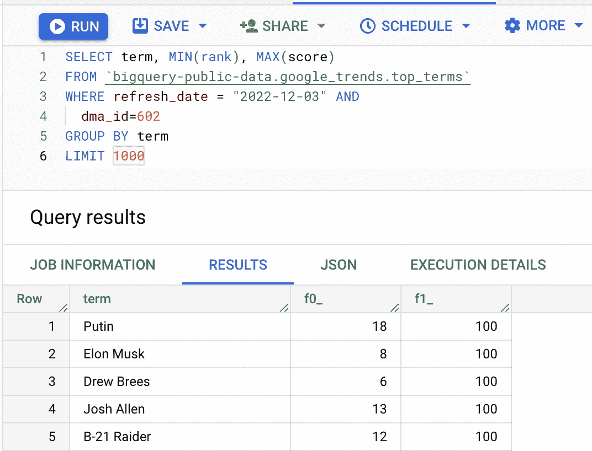
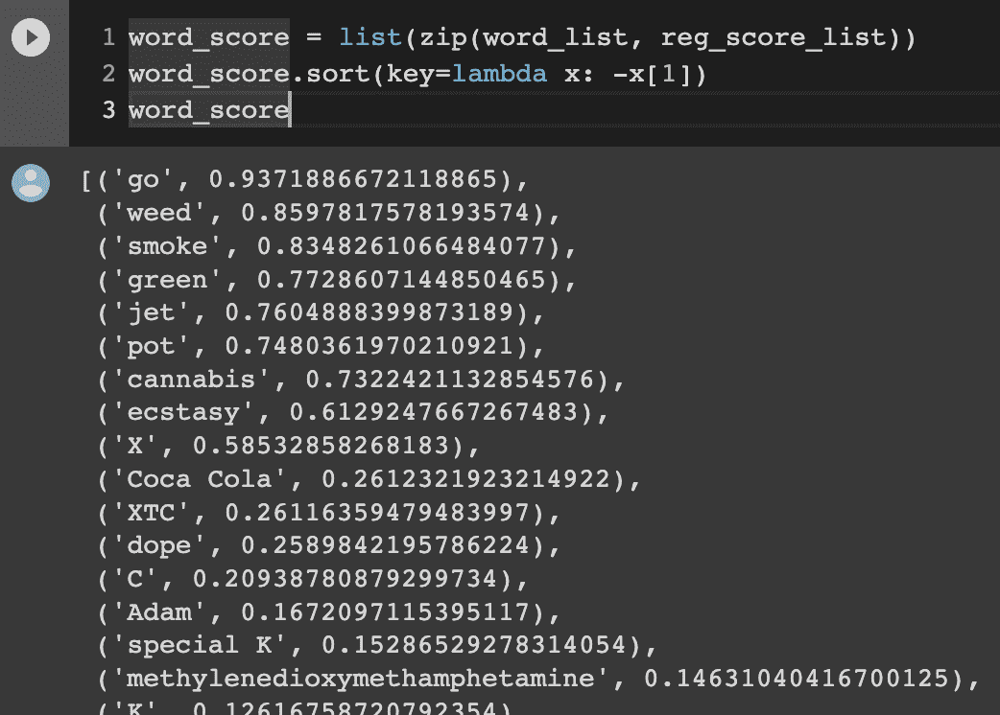
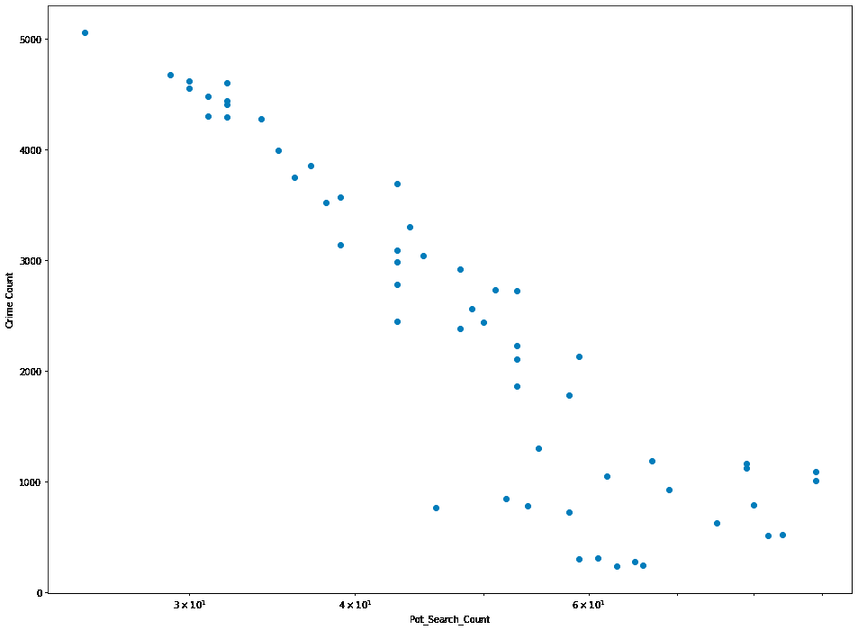
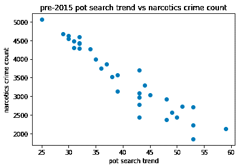
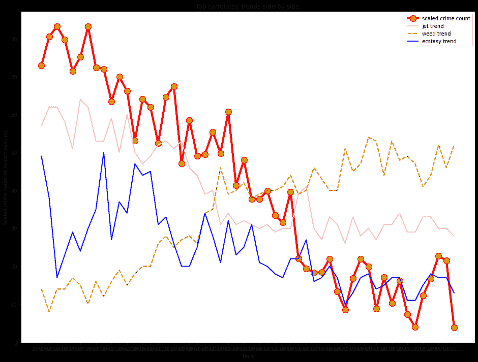
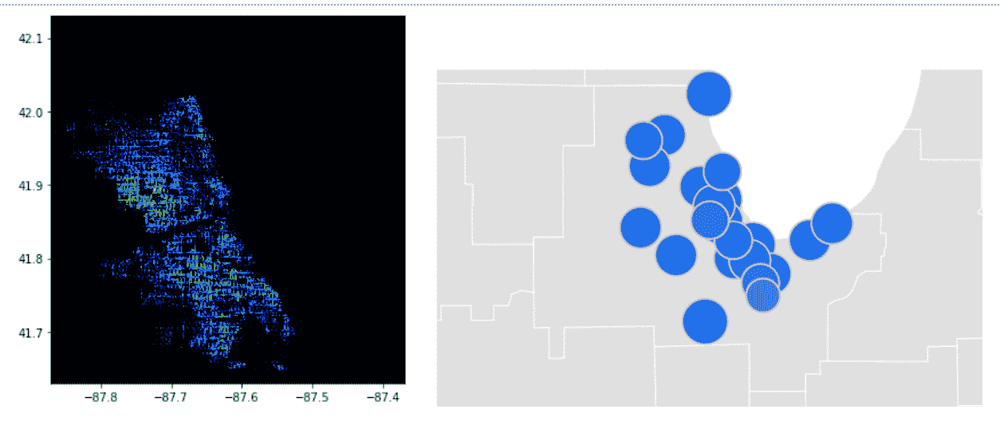
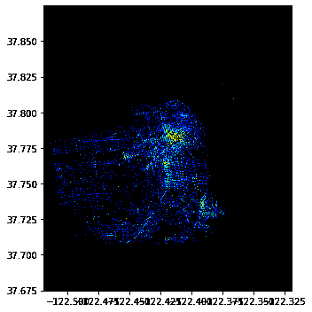
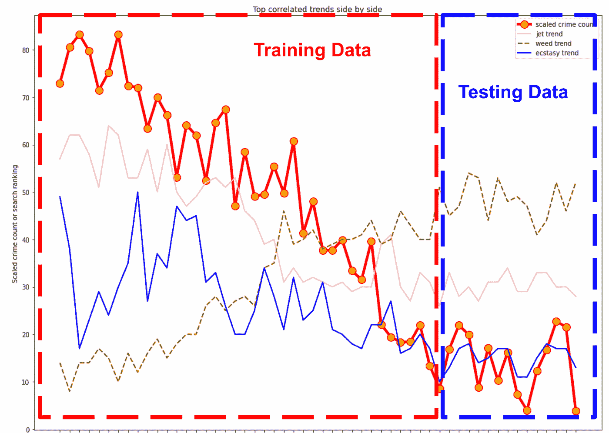
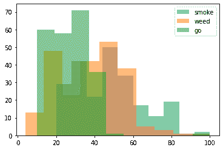

# 在 BigQuery 中使用 Google Trends 作为机器学习功能

> 原文：<https://towardsdatascience.com/google-trends-as-a-machine-learning-features-with-bigquery-d0cbbb1e8679>

合著者:[丹尼尔·申](https://www.linkedin.com/in/daniel-s-a39b73169/)，斯坦福大学的 MSCS


[Firmbee.com](https://unsplash.com/@firmbee?utm_source=medium&utm_medium=referral)在 [Unsplash](https://unsplash.com?utm_source=medium&utm_medium=referral) 上拍照

有时候，作为工程师和科学家，我们认为数据只是 RAM 中的字节、GPU 中的矩阵和进入预测黑盒的数字特征。我们忘记了它们代表了一些现实世界模式的变化。

例如，当真实世界的事件和趋势出现时，我们倾向于首先遵从谷歌来获取相关信息(例如，去哪里远足，术语 X 是什么意思)——这使得谷歌搜索趋势成为解释和理解我们周围正在发生的事情的非常好的数据源。

这就是为什么我们决定研究谷歌搜索趋势之间的复杂相互作用，用它来预测其他时态数据，并看看它是否可以用作时态机器学习模型的特征，以及我们可以从中得出的任何见解。

# ⚠️ **提醒一句**

在这个项目中，我们研究了如何将 **Google Trends** 数据用作时间序列模型或回归模型的特征。我们选择犯罪率作为我们的兴趣点(响应变量)，因为它是 **Google Cloud Platform** 上具有数百万行的大型时态数据集之一，这符合我们使用 BigQuery 的目的。

然而，我们会注意到，无论何时我们处理任何涉及敏感话题的数据集，重要的是不偏不倚，不要有太多关于受保护特征(即年龄、性别和种族)的先入为主的假设。我们在最后加入了一个我们鼓励你不要跳过的部分:**关于 AI ⚖️️.中公平性的讨论**

此外，对于该项目，我们主要关注的是 ML 模型中的**毒品相关犯罪**(即贩毒)。即便如此，我们认为最好不要在没有护栏和对其社会影响的进一步研究的现实世界中部署类似的模型。这项研究纯粹是为了探索和教育的目的，应该这样对待。

# ⚙️ **设置:通过 Google Colab 使用 big query**

**BigQuery** 是一个无服务器的数据仓库，拥有许多可用的公共数据集。这可能是一个用大规模数据集尝试机器学习的很酷的地方，其中许多数据集在`**bigquery-public-data**`下定期更新。在本节中，我们将介绍如何设置 BigQuery。

我们首先从我们在 BigQuery 上有积分的同一个帐户认证自己进入 **Google** **Colab** 。每个人都有大约 [1 TB 的查询量](https://cloud.google.com/bigquery/pricing#free-tier)，这对于我们的目的来说已经足够了(也就是说，我们每个优化的查询需要大约 200 MB)。学生也可以获得一些教育学分。

```
# Authenticate yourself into Google Colab
from google.colab import auth
auth.authenticate_user()
project_id = "YOUR_PROJECT_ID_IN_BIGQUERY"
# create a BigQuery client with the same account as Colab
from google.cloud import bigquery
client = bigquery.Client(project=project_id)
```

然后，我们可以将一个 IPython notebook 单元格转换成如下所示的 SQL 单元格，它会将输出存储到`**variable_name**`中的一个`pd.DataFrame`中。

```
%%bigquery variable_name --project $project_id

SELECT *
FROM `bigquery-public-data.chicago_crime.crime`
LIMIT 5
```

# 📚**同现:谷歌趋势特征建议使用** `**Wordnet**`

我们最初的想法是使用`google_trends.top_rising_terms` 数据集，对有日期偏移的列进行`LEFT JOIN`。然而，我们遇到了数据集被当前事件和名称所支配的问题，这些事件和名称与我们的响应变量无关。



用于选择芝加哥搜索趋势的 SQL 语句，由作者于 2022 年 12 月 3 日更新

然后，我们尝试使用非官方的 [PyTrends API](https://pypi.org/project/pytrends/) 为 Google Trends 获取术语。然而，我们很快就遇到了速度限制，所以我们必须更好地选择数据。我们唯一的选择是通过在谷歌趋势网站上查询每个单词来下载我们的数据，并手动将单词数据集与脚本结合起来。所以，我们专注于获得正确的**单词**特征。

我们的一个直觉是，描述物质的术语会有地区差异和不同的名称。针对这个问题，我们使用 [wordnet](https://wordnet.princeton.edu/) 生成了一组与一些常见街头毒品术语具有“**高共现度”**的词。

# 但是为什么要使用 NLTK 呢？

我们使用 WordNet 的灵感来自于基于[“共现”的推荐模型](https://learnforeverlearn.com/cooccurrence/)(也就是可能用于 YouTube 视频、亚马逊目录等)，这些模型经常对共现进行批量计算，以对相关项目进行排序。这类似于掩蔽语言模型(即 BERT)试图表现的内容。

```
import nltk=
nltk.download('wordnet')
nltk.download('omw-1.4')
from nltk.corpus import wordnet

all_words = set()
def find_word_features(word):
   words = set()
   for syn in wordnet.synsets(word):
       for i in syn.lemmas():
           words.add(i.name())
   print(words)
   all_words.update(words)
```

然后我们下载并结合一些简单的脚本。之后，我们拟合了若干个**线性回归**模型，提取了模型的 R 平方值，然后根据一个月后与犯罪率的相关性对它们进行了排名(详见后面的原因)。



作者列出的与 1 个月后犯罪率高度相关的热门词汇

我们非常惊讶地发现其中一些单词的 R 值非常高，尤其是单词“go”。这个词是与“狂喜”同现产生的，但最终，我们认为这只是与谷歌搜索上的短语“去哪里得到……”相关。

# 🥞**加入训练数据集**

连接数据集需要某种程度的数据操作，我们不会讨论技术细节。但我们在这里注意到，我们对总犯罪数量进行了 **1 个月**和 **2 个月**的转移，因为我们认为要想有时间相关性，搜索和我们的反应变量之间必须有一个时滞。

***时滞可以是我们以后调优的超参数。***

```
%%bigquery narcotics_year_month_two_months_lag --project $project_id

WITH shifted_date_tbl AS (
 SELECT
 date,
 CAST( DATE_SUB(CAST (date AS datetime), INTERVAL 2 MONTH) AS timestamp) AS shifted_date,
 *
 FROM `bigquery-public-data.chicago_crime.crime`
),
date_count AS (
SELECT
CONCAT(CONCAT(EXTRACT(YEAR FROM shifted_date), '-'), EXTRACT(MONTH FROM shifted_date)) AS year_month, COUNT(*) as crime_count
FROM shifted_date_tbl
WHERE primary_type = 'NARCOTICS'
GROUP BY year_month
ORDER BY year_month DESC
)

SELECT *
FROM `your-project-id.crime_search_trends.chicago_narcotics`
AS chicago_narcotics,
date_count
WHERE year_month = Month
```

在这一点上，我们还不想做任何功能工程，因为我们想在决定如何优化每个单词分布之前，将相关性可视化。

例如，我们可能想要记录或移动数据，或者将特征分布转换为分位数。但是我们首先要把分布可视化。

# 📈**特征选择的相关性**

我们分析了由 WordNet 和我们自己的直觉生成的 30-50 个单词。他们中的许多人遵循一个积极的趋势，如“喷气”，但我们惊讶地发现，负相关的，如“锅。”


“Jet”趋势分数与毒品犯罪计数(按作者)



按作者划分的“大麻”趋势得分与毒品犯罪计数

我们很好奇为什么会这样。我们最初的想法是，这与我们感兴趣的地区(芝加哥，发生在 2020 年)的大麻合法化有关，但事实证明，即使我们只关联 2015 年之前的数据，情况也并非如此。



按作者分列的 2015 年前“大麻”趋势与毒品犯罪数量

只有在将“正相关词”的趋势与“负相关词”如“大麻”并列后，我们才能意识到这种趋势。见下图。



按作者分列的毒品犯罪和其他术语的下降趋势以及“大麻”搜索趋势的上升

对此的一个合理解释是，随着时间的推移，与毒品相关的犯罪和逮捕一直在稳步下降，然而搜索趋势和流行文化实际上在对大麻的态度方面存在负相关。

这意味着，虽然是的，由于负相关，它将是预测犯罪的一个伟大特征，但不是出于我们最初认为的原因。这表明我们对特性的最初解释和模式可能是扭曲的，甚至可能是错误的。

# 🌐**地理分析**

我们还使用**热图**做了一些地理分析，搜索词语位置和犯罪地点。

```
%%bigquery crime_time_data --project $project_id

SELECT longitude, latitude
FROM `bigquery-public-data.chicago_crime.crime`
WHERE primary_type = "NARCOTICS" AND
longitude IS NOT NULL AND
latitude IS NOT NULL
```

不幸的是，没有办法从 Google Trends 中导出这些数据，所以我们无法推断和映射这些数据进行聚合。否则，我们可以在将每个犯罪地点映射到他们所在的县或城市后，对城市名称进行左连接。



芝加哥毒品犯罪密度图与搜索词密度图(按作者)



旧金山毒品犯罪密度地图，作者

# 🚀**训练预测模型**

我们不会深入讨论如何优化和选择模型的最佳特性，因为在 Medium 上已经有很多这样的指南了。

相反，在这一部分，我们将快速浏览

*   **(1)我们可以对这个数据集使用两个不同学校/类别的机器学习模型**
*   **(2)使用 CREATE MODEL 语句** **在** [**Google 云平台上训练具有海量数据集的模型的快速指南🚀**。](https://cloud.google.com/bigquery-ml/docs/reference/standard-sql/bigqueryml-syntax-create-time-series)

**时序/时间序列模型**与我们这里的相似，我们使用历史数据来预测未来趋势。这样的例子有[脸书先知](https://facebook.github.io/prophet/)模型，或者[ARIMA/萨里玛 模型。我们认为这通常很适合处理时态数据的问题，因为它可以考虑季节性和模式。](/time-series-forecasting-with-a-sarima-model-db051b7ae459)

你可以在进行一些 SQL 转换后，直接在 Colab 中训练它们，然后使用 CREATE MODEL 语句在 [Google 云平台上进行一次调用。](https://cloud.google.com/bigquery-ml/docs/reference/standard-sql/bigqueryml-syntax-create-time-series)



时序模型的训练和测试集拆分(按作者)

**回归模型**类似于我们对时移数据集所做的。在给定当前状态的情况下，我们将训练我们的模型来预测未来时间步会发生什么。这种类型的模型往往会过度拟合并忽略趋势，但如果我们在短时间内有大量可用数据，我们总是可以用过去几周、几天甚至几小时的数据来重新训练模型。

我们可以在 bigQuery 中使用这个命令训练一个**逻辑回归**模型

```
%%bigquery --project $project_id
CREATE OR REPLACE MODEL `crime_search_trends.narcotics_log_regression_3_terms_trend_quantile`
OPTIONS(MODEL_TYPE='LOGISTIC_REG')
AS
SELECT
 block AS feature1,
 # iucr AS feature1,
 arrest AS feature2,
 domestic AS feature3,
 # beat AS feature3,
 district AS feature4,
 ward AS feature5,
 community_area AS feature6,
 x_coordinate AS feature7,
 y_coordinate AS feature8,
 #drug terms
 NTILE(5) OVER(ORDER BY smoke) AS feature9,
 NTILE(5) OVER(ORDER BY weed) AS feature10,
 NTILE(5) OVER(ORDER BY go) AS feature11,
 smoke AS feature12,
 weed AS feature13,
 go AS feature14,
 CAST(primary_type = 'NARCOTICS' AS INT) AS label
FROM (
 SELECT *
   FROM `your_project_id.crime_search_trends.chicago_cooccur_processed`
   AS chicago_narcotics, (SELECT
     FORMAT_DATE('%Y-%m', date) AS year_month,
     FORMAT_DATE('%Y-%m-%d', date) AS year_month_date,
     *
   FROM `bigquery-public-data.chicago_crime.crime`
   WHERE date IS NOT NULL) AS crime_with_date
   WHERE year_month = Month
)
WHERE
 date BETWEEN '2004-01-01 00:00:01' AND '2018-01-01 23:59:59'
```

在特性探索过程中，我们的一个直觉是，也许一个词有多“流行”并不重要，我们只关心这个特性是上升的还是它的基线搜索率“高于平均水平”。

所以我们想使用**量化**作为特性工程函数——它可以在 bigquery 中使用`SELECT`语句中的`NTILE(N) OVER (ORDER BY feature_name) AS feature_name`来完成。



不同单词的流行趋势不同

您还可以使用`ML.TRAINING_INFO`标签在笔记本上获取培训信息，这些信息通常会在培训期间打印出来。这有助于优化超参数。

```
%%bigquery --project $project_id

SELECT
*
FROM
ML.TRAINING_INFO(MODEL `crime_search_trends.narcotics_log_regression_3_terms_trend_quantile`)
```

根据我们的研究，**分位数会降低 F1 分数，但会提高准确度、精确度或召回率**。我们认为这可能是因为我们的许多[术语在语义上高度相关](https://en.wikipedia.org/wiki/Multicollinearity)，因此总体上降低了机器学习模型的“整体性能”，因为数据集分布中即使很小的变化也会极大地影响性能。

解决这个问题的一个常见方法是对我们的数据集运行**普通最小二乘(OLS)模型**，迭代识别具有高度多重共线性的冗余要素(即，OLS 模型在迭代中赋予很小权重的要素)，直到出现我们认为是好的要素子集。把它输入到你选择的其他更复杂的模型中(比如逻辑回归，MLP，其他神经模型)。

# **⚖️关于人工智能中公平性的讨论**

让我们想象一个我们在这项研究中所做的更愤世嫉俗的例子。

假设我们正在为犯罪预测建立一个延时预测算法，假设我们是一个(无意中)信息不足的数据科学团队，试图建立一个期限很短的模型。我们快速构建它，它有很好的指标，所以我们把它扔给了 DevOps 团队。

由于我们不知道哪些词是有用的，假设我们建立了一个[无监督机器学习](https://en.wikipedia.org/wiki/Unsupervised_learning)模型，该模型为 Google trends 找到“高度预测”的词，并将其用作特征。随着时间的推移，该模型选择了一些被边缘化群体过度使用的词，现在该模型以最糟糕的方式出现了偏差。

在犯罪预测的情况下，如果用于错误的目的，这种模型将非常成问题，并对真实的人产生有害的影响。

在这项研究中，我们还表明，我们对什么是“好的特征”的看法，甚至我们对为什么一个特征可能是好的背后的直觉，可能是有缺陷的，或者只是确认偏差，就像“大麻”和“杂草”关键字的负相关性一样。

这就是为什么数据科学团队之间就“道德人工智能”进行清晰的沟通非常重要。其他人可能不太了解人工智能在幕后如何工作，因此，作为工程师和数据科学家，我们有责任确保我们的模型没有偏见和危害。