# 英语到 Cypher 与 GPT-3 在博士艾

> 原文：<https://towardsdatascience.com/gpt-3-for-doctor-ai-1396d1cd6fa5>

## 使用英语浏览医学知识图表

*作者黄思兴和 Maruthi Prithivirajan*

由[塞巴斯蒂安·比尔](https://unsplash.com/@sebbill?utm_source=unsplash&utm_medium=referral&utm_content=creditCopyText)在 [Unsplash](https://unsplash.com/s/photos/artificial-understanding?utm_source=unsplash&utm_medium=referral&utm_content=creditCopyText) 上拍摄的照片

2021 年 12 月，四名 Neo4j 工程师与 Maruthi 和我一起在新加坡医疗保健 AI Datathon & EXPO 2021(图 1)上开发了一个名为 Doctor.ai ( [此处](https://medium.com/p/8c09af65aabb)和[此处](https://neo4j.com/blog/doctor-ai-a-voice-chatbot-for-healthcare-powered-by-neo4j-and-aws/))的医疗聊天机器人。得益于 AWS Lex，Doctor.ai 以 Neo4j 图表的形式管理电子健康记录，并以英语与用户互动。

在 Datathon 之后，我们继续扩展了 Doctor.ai，在整合了三个公共知识图谱([此处](/transfer-knowledge-graphs-to-doctor-ai-cc21765fa8a6))之后，Doctor.ai 对疾病、基因、药物化合物、症状等都有所了解。这种扩展将患者的健康记录连接到医学知识网络。换句话说，它把具体和一般联系起来。现在我们可以在更广阔的背景下了解每个病人的病史。例如，在我们询问患者的最后一次诊断后，我们可以进一步询问是什么导致了该疾病，以及可以使用哪些药物(图 1)。

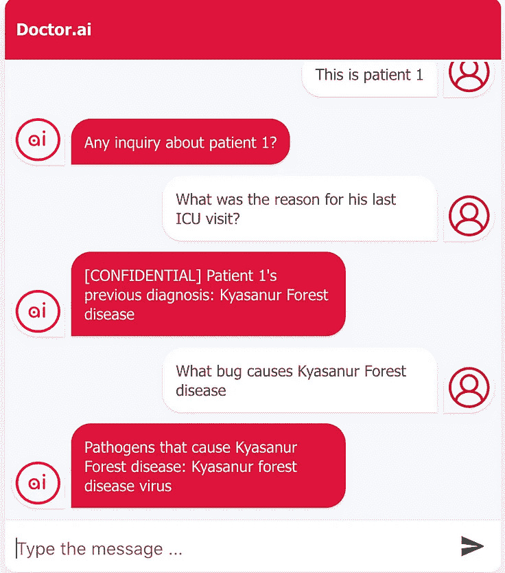

图一。Doctor.ai 的知识图谱和界面。图片作者。

在自然语言中，我们可以用许多不同的方式表达同样的想法，也就是重述。令人惊讶的是，我们人类可以重新措辞和重述很多，而我们的对话伙伴仍然可以理解我们。但对计算机来说，情况并非如此。编程语言往往有我们开发人员必须遵守的严格语法。违规将导致程序失败。自然语言理解(NLU)引擎的工作是将各种人类重述汇聚成一个严格的编程语句(图 2)。Doctor.ai 使用 AWS Lex 和 Lambda 作为其 NLU 引擎。

这一切都很好。Lex 和 Lambda 像宣传的那样工作。然而，开发非常耗时。首先，开发人员需要熟悉一系列新概念，如意图、话语、槽、槽类型和上下文。其次，对于每个意图，开发人员需要提供多个示例话语，设置插槽并管理上下文。最后，每个意图都与一个 Lambda 函数联系起来，在这个函数中，Cypher 查询被合成。Lambda 编程需要一些时间来适应，因为开发人员首先需要学习特定于 Lex 的规则。

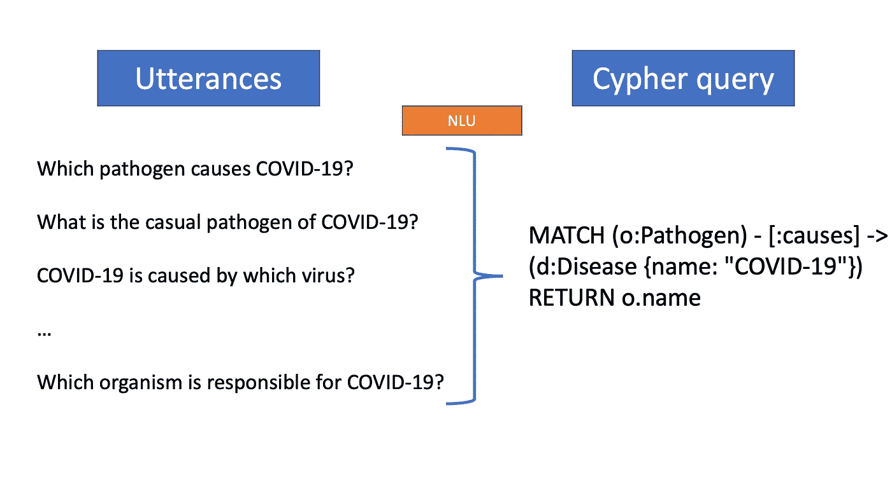

图二。自然语言理解引擎将一系列话语汇聚成一个严格的编程语句。图片作者。

问题是:我们能用简单而强大的东西代替 Lex 和 Lambda 吗？答案是肯定的。镇上有了一位新警长: [GPT-3](https://openai.com/blog/openai-api/) 。

OpenAI 的 GPT 3 号首次以其逼真的对话震惊了科技界。但这只是它众多惊人能力之一。除了[模仿史蒂夫·乔布斯](https://www.youtube.com/watch?v=0xiUGPmcTzg)，GPT-3 还可以执行一系列自然语言任务，包括摘要、语法纠正、代码解释、代码纠正、代码翻译、文本到命令等等。尽管仍需要人为干预，但 GPT 3 号独自就能正确完成大部分任务。更重要的是，它具有“认知”灵活性，可以根据人类的输入来提高其性能。在我们看来，GPT-3 可以被认为是 NLU 近年来改变游戏规则的技术迭代之一。

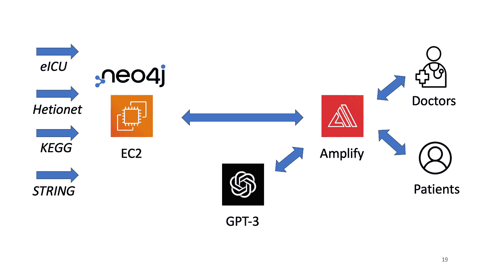

图 3。这个项目的架构。图片作者。

在本文中，我们将向您展示如何在 Doctor.ai 中使用 GPT-3。图 3 展示了该架构。我们将利用它的能力把我们的英语问题转换成密码。但是在这种情况下，`Text to Cypher`可能是一个更好的名字。这个项目的源代码存放在 Github 仓库中:

  

Neo4j 数据库转储文件位于:

[https://1drv.ms/u/s!Apl037WLngZ8hhj_0aRswHOOKm0p?e=7kuWsS](https://1drv.ms/u/s!Apl037WLngZ8hhj_0aRswHOOKm0p?e=7kuWsS)

# 1.GPT 三号账户

首先，我们需要一个 GPT 协议 3 的账户。请注意，并非所有地区都受支持，例如中国。确保您所在的地区在列表中[。一旦您获得了帐户，您就获得了一个密钥(图 4)。18 美元的初始贷款足够支付整个项目了。](https://beta.openai.com/docs/supported-countries)

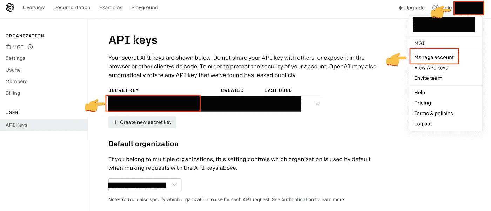

图 4。在您的帐户管理页面获取您的 GPT-3 密钥。图片作者。

# 2.在云上设置一个 Neo4j 后端

我们可以在 AWS、GCP 或 AuraDB 上托管我们的 Neo4j 数据库。你也可以简单地使用我下面的 CloudFormation 模板在 AWS 上设置它。用户名是`neo4j`，密码是`s00pers3cret`。

  

在任何情况下，您都可以使用上面的转储文件来恢复完整的数据库。例如，在 EC2 中，首先以`ubuntu`的身份登录您的实例，并执行以下 bash 命令:

代码 1。从转储文件恢复 Neo4j。

设置 EC2 或 Compute 时，确保端口`7686`打开。另外，HTTPS 和 HTTP 也分别需要端口`7473`和`7474`。如果你想使用 AuraDB，你至少需要专业版，因为 Doctor.ai 的知识图中节点和边的数量超过了免费版的硬性限制。

在继续之前，请测试您的 Neo4j 数据库。首先，在浏览器中输入地址:

登录后，您应该在界面中看到节点和关系:

图 5。用 Neo4j 浏览器考察 Doctor.ai 的知识图谱。图片作者。

现在让我们使用 JavaScript 中的`bolt`协议来测试连接。你首先需要`neo4j-driver`。

然后在控制台中输入`node`并执行以下命令:

代码 2。测试螺栓连接。

如果你看到输出`SARS-CoV-2`，这种情况下值得庆祝！

# 3.GPT-3

现在我们可以在 Doctor.ai 中使用 GPT-3，我们将修改我们的同事 Irwan Butar Butar 的`react-simple-chatbot`中的代码，该代码反过来基于 Lucas Bassetti 的工作。并且所有的动作都发生在一个文件中:`DoctorAI_gpt3.js`。在这个文件中，我们将从用户那里一次提取一个英语问题，打包并发送给 GPT-3。GPT-3 会将其转换成密码查询。我们对后端数据库执行这个密码查询。最后，我们将查询结果返回给用户。

GPT-3 是这样工作的:你给它一些英语-密码对作为例子。比如:

如果你有几个表达式应该从 GPT-3 中触发相同的响应，你可以用“或”或“或”把它们放在一起像这样。

GPT-3 将学习并为您的下一个英语问题生成密码查询。没有证据表明 GPT-3 以前接受过 Cypher 的训练。但是它可以用一些例子推断出密码的语法，并写出密码。太神奇了。你可以在 GPT 三号游乐场亲自测试一下:

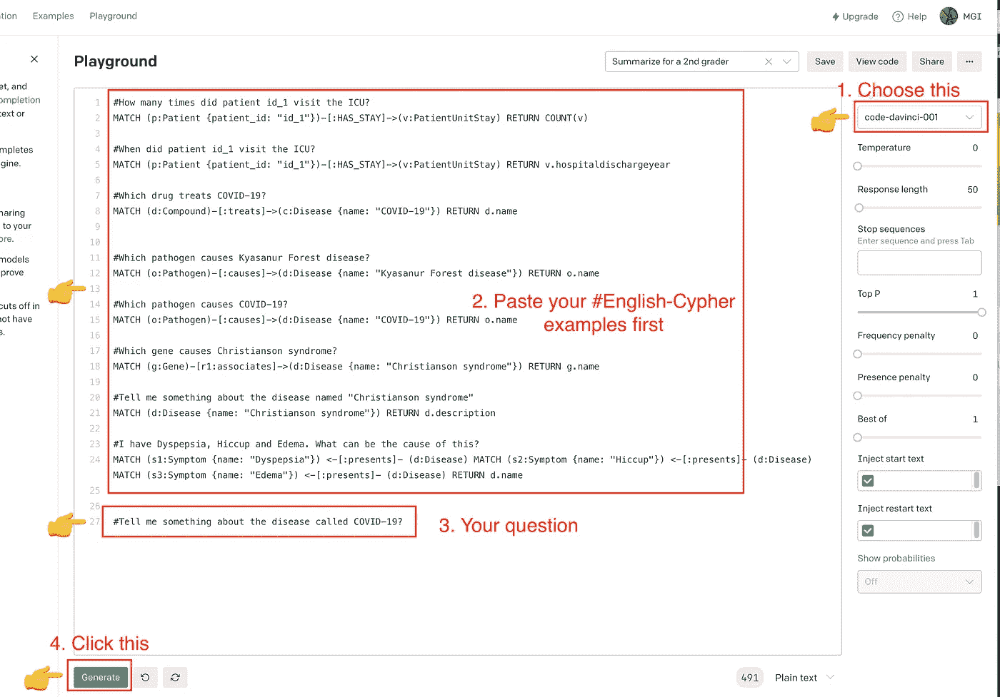

图 6。在操场上测试 GPT-3。图片作者。

英文提示以一个`#`符号开始。当您点击`Generate`按钮时，GPT-3 将在下一行生成正确的密码查询:

图 7。Cypher 测试的结果。图片作者。

你会注意到有过多的文本。你可以通过调节右边的`Response length`参数来控制。

`DoctorAI_gpt3.js`中的 GPT-3 部分只是上面演示的一个代码。

图 8。作者的 ai 医生图像的 GPT-3 组件。

# 4.用 GPT-3 密码查询 Neo4j

一旦 GPT 3 号完成了这一重任，剩下的事情就简单多了。Neo4j 查询的 JavaScript 只是上面代码 2 的扩展。

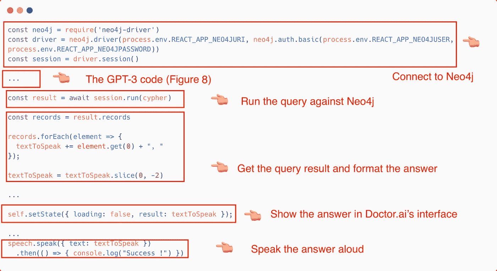

图 9。Doctor.ai. Image by author 的 Neo4j 查询组件。

您可以在 Github 资源库中看到完整的代码。

# 5.托管前端

现在是托管前端的时候了。这个过程已经在我的上一篇文章 [*Doctor.ai 中描述过，这是一个人工智能驱动的虚拟语音助手，用于医疗保健*](https://medium.com/p/8c09af65aabb) *。只有两个小变化。首先，将 Amplify 指向当前的 Github 资源库，而不是文章中提到的旧资源库。其次，环境变量完全不同。在`Configure build settings`页面的`Advanced settings`下，设置以下四个环境变量，并填入正确的值:*

请注意，在客户端，我们首先需要允许浏览器通过端口 7687 访问 URL。如果我们的 EC2 实例没有 SSL，这是必要的。如果使用 AuraDB 托管后端，就没有这个问题。但是在撰写本文时，AuraDB Free 太小，无法承载 Doctor.ai。在你浏览器的地址栏输入`https://[EC_public_ip]:7687`，点击`Advanced...` ➡️ `Accept the Risk and Continue`(此处读)。

图 10。在浏览器地址栏中输入 EC2 公共 IP。图片作者。

图 11。接受风险，继续。图片作者。

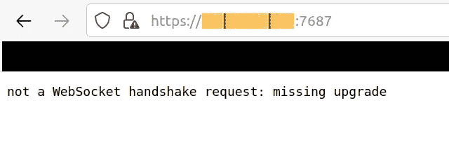

图 12。确认异常的消息。图片作者。

当您看到图 12 中的消息时，您已经准备好了。

# 6.测试 GPT-3 博士. ai

最后，我们可以测试这个新的 Doctor.ai，看看 GPT 的魔力-3:

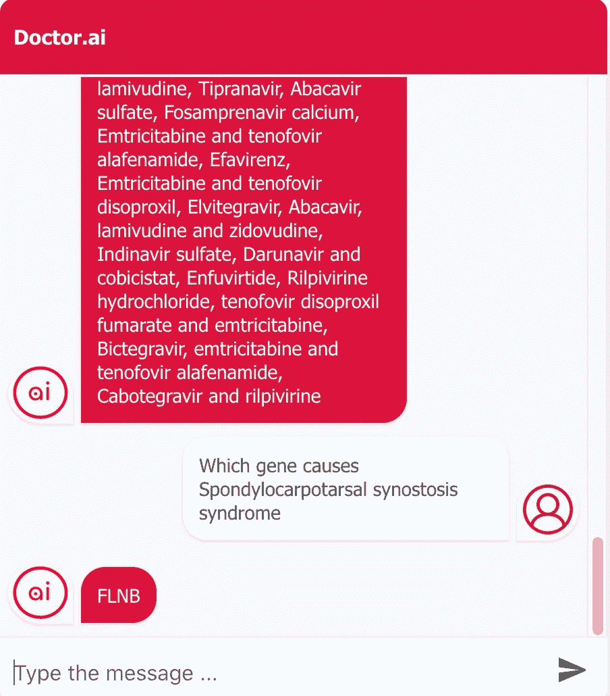

图 13。测试由作者提供的 GPT-3 powered Doctor.ai 图像。

在这里，我向艾医生询问了一些关于艾滋病毒感染和脊椎跗骨结合综合征的信息。这些问题遵循我们的培训示例的模式。因此，它们运行良好并不令人意外。让我们重新措辞我们的问题，看看 ai 医生是否还能理解我们的意图:

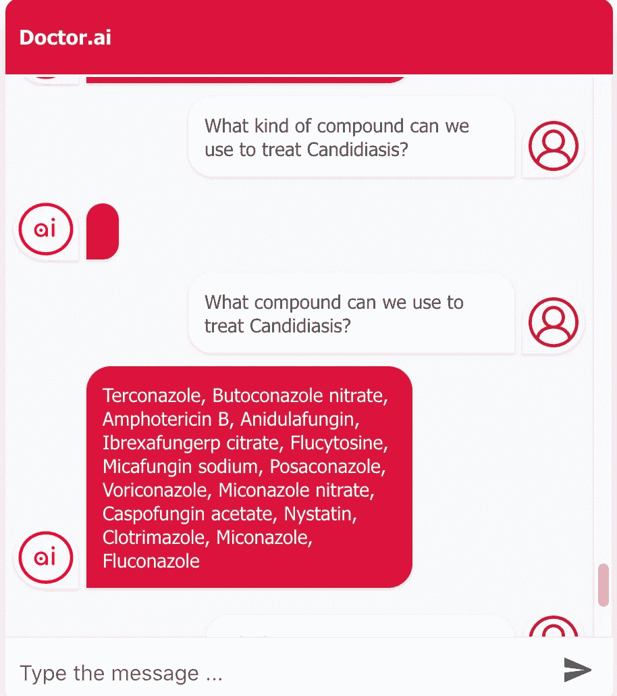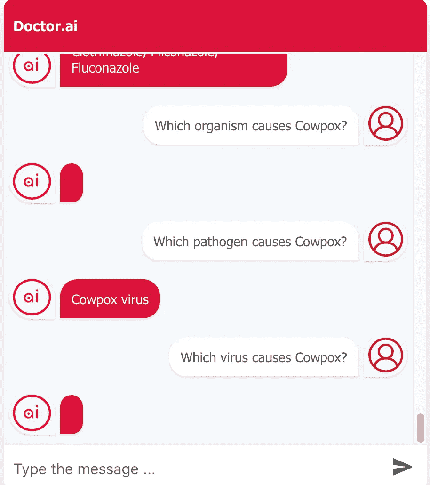

图 14。用重述测试 Doctor.ai。图片作者。

起初，艾医生无意中发现了这些重述。它可以识别一些语句，但不能识别其他语义相同的语句。要改进 Doctor.ai，可以给它提供更多的例子。让我们在训练集中添加一个额外的示例对:

通过它，Doctor.ai 能够在构建 Cypher 查询之前将关键字“有机体”转换为“病原体”。此外，它还可以推广到其他类似的问题。

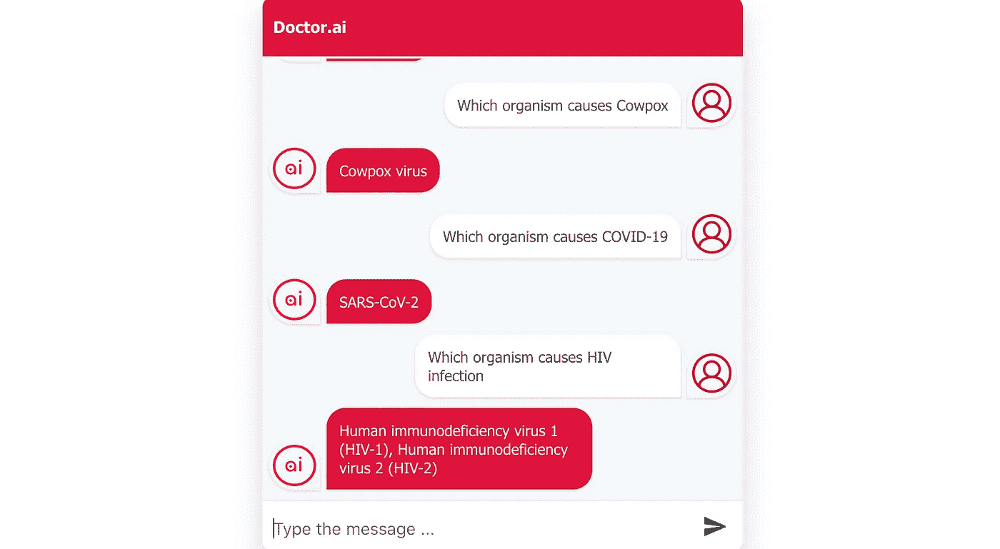

图 15。我们可以通过增加更多的训练例子来改进 NLU 医生。图片作者。

最后，我们来测试一下 Doctor.ai 能不能听懂代词。

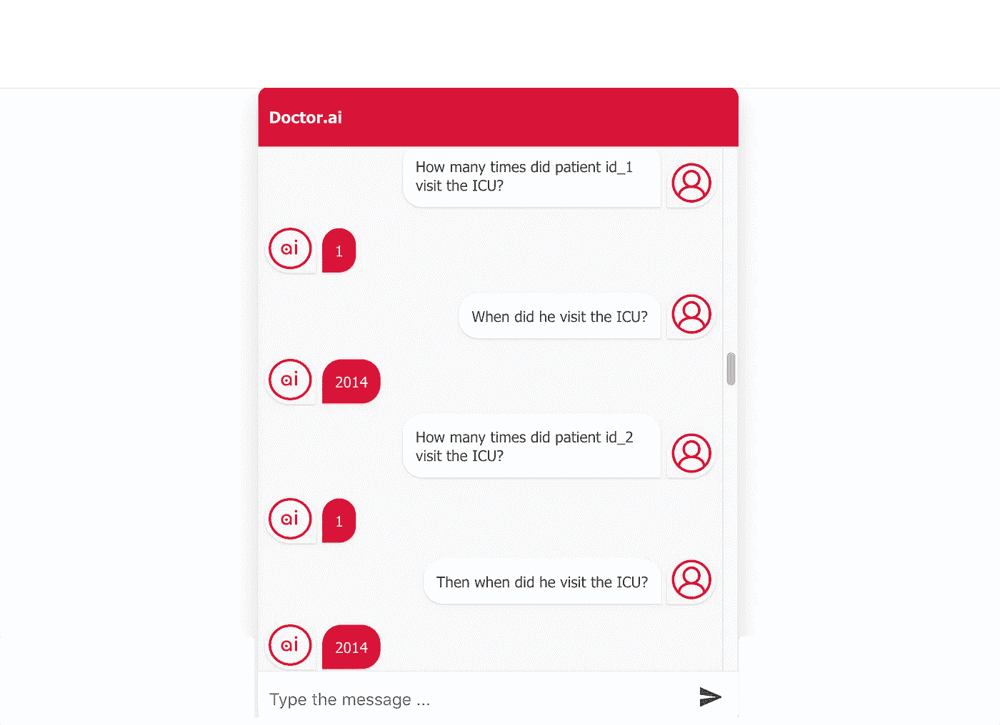

图 16。作者对博士艾形象的代词测试。

这里我们看到一个错误。患者 id_2 于 2015 年就诊于 ICU。经过仔细检查，很明显 GPT-3 询问的是病人 id_1 的入院时间，而不是 id_2。因此，当 GPT-3 遇到“他”或“她”等代词时，它假设我们指的是对话中提到的第一个而不是最后一个。

# 结论

GPT 3 是一个可怕的游戏改变者。在许多情况下，它对自然语言的理解可以与人类说话者相媲美，它只需要少量的训练数据。很容易扩展。如果它犯了一个错误，我们可以只添加一个或两个正确的答案到训练集，GPT-3 将把这种纠正推广到其他类似的情况。对于开发人员来说，向 GPT-3 展示一些例子要比写许多行死板的编程语句容易得多。在 GPT-3 之前，我们在 Doctor.ai 的 Lambda 中看到了大量代码重复。Lex 的配置也是劳动密集型的。GPT 3 号改变了这一切。只需在前端增加 60 行代码，它就取代了庞大的 Lex 和 Lambda。可以有把握地说，GPT-3 可以极大地减少开发和测试时间，并缩减其他自然语言相关项目的代码。

但它完美吗？不。正如这个项目所展示的，它在理解代词方面有困难。不知何故，它专注于第一个提到的问题，而不是最后一个提到的问题。那肯定不像人类。此外，一些重述可以智胜 GPT-3。但对我来说，这些都只是小问题。

这篇文章只是对 GPT-3 的一点皮毛。示例代码中的英语-密码对远非详尽。我们可以做更多来覆盖 Doctor.ai 中的整个知识图表。GPT-3 也可以通过[微调作业](https://beta.openai.com/docs/api-reference/fine-tunes)进行微调以获得更好的性能。可能性是无穷的。

我们鼓励您将 GPT-3 用于您自己的 NLU 项目。告诉我们你是如何使用它的。

Update: my next article [*Can Doctor.ai understand German, Chinese and Japanese? GPT-3 Answers: Ja, 一点点 and できます!*](https://dgg32.medium.com/can-doctor-ai-understand-german-chinese-and-japanese-gpt-3-answers-ja-%E5%8F%AF%E4%BB%A5-and-%E3%81%84%E3%81%84%E3%82%88-b63b10d67bf4)shows that Doctor.ai can understand German, Chinese and Japanese thanks to GPT-3.

# 执照

[*Hetionet*](https://github.com/hetio/hetionet) *发布为* [*CC0*](https://creativecommons.org/publicdomain/zero/1.0/) *。* [*STRING 在“4.0 知识共享”许可下*](https://string-db.org/cgi/access) *免费提供，而* [*学术用户可以免费使用 KEGG 网站*](https://www.kegg.jp/kegg/legal.html) *。*

 