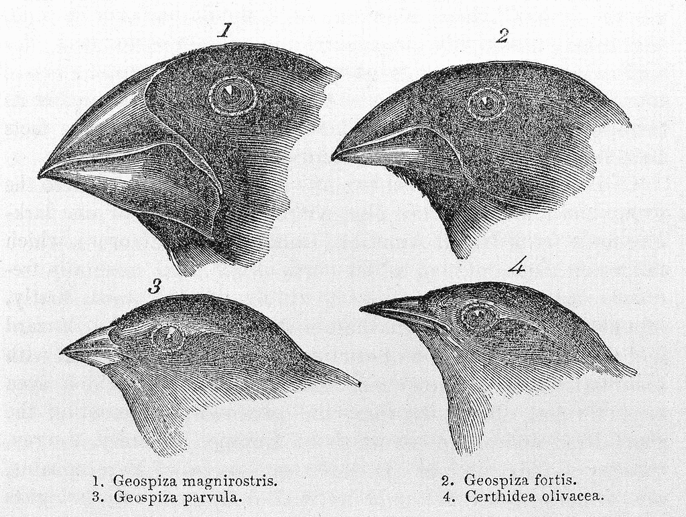
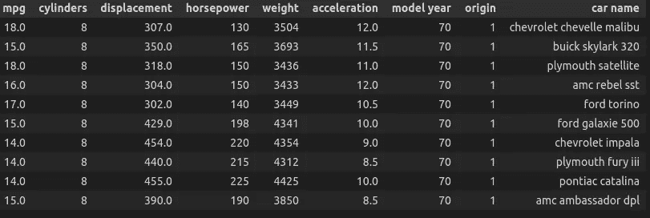
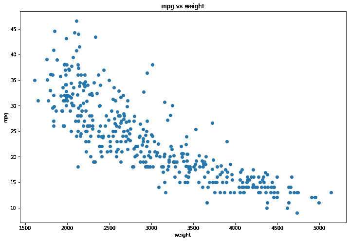
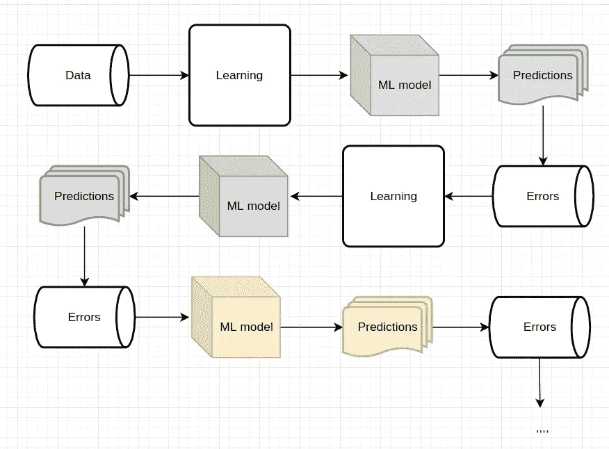
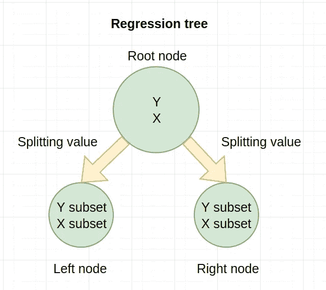
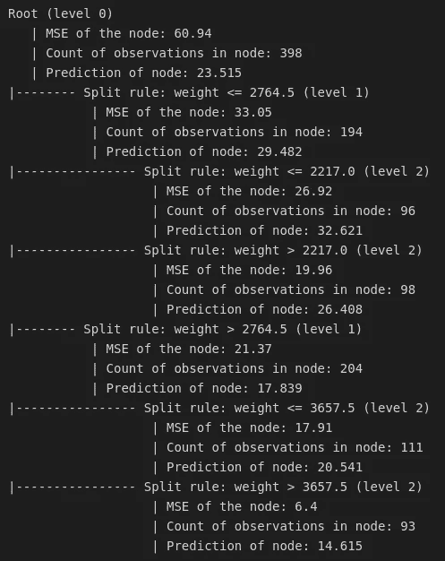
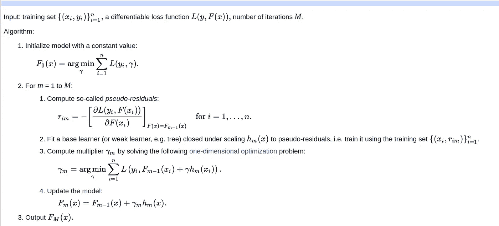
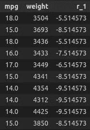
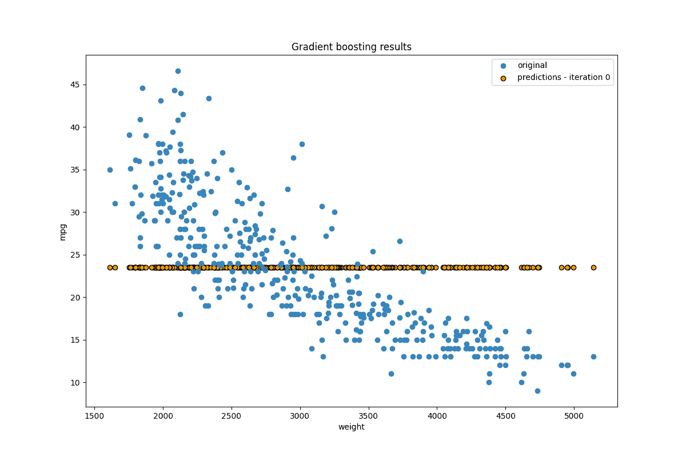

# Python 中的渐变提升从零开始

> 原文：<https://towardsdatascience.com/gradient-boosting-in-python-from-scratch-788d1cf1ca7>

## 使用 Python 编码并深入解释非常流行且在竞赛中获奖的梯度推进算法



喙的进化；图像许可[https://creativecommons.org/licenses/by/4.0/deed.en](https://creativecommons.org/licenses/by/4.0/deed.en)；原文链接[https://commons . wikimedia . org/wiki/File:Charles _ Darwin，_ Journal _ of _ Researches..._Wellcome_L0026712.jpg](https://commons.wikimedia.org/wiki/File:Charles_Darwin,_Journal_of_Researches..._Wellcome_L0026712.jpg)

这篇文章的目的是使用 Python 代码和可视化来解释流行且时常神秘的 ***梯度增强算法*** 。梯度提升是 CAT boost、ADA boost 或 XGBOOST 等竞赛获奖算法的关键部分，因此了解什么是提升、什么是梯度以及这两者在创建算法中的联系是任何现代机器学习从业者的必备知识。

Python 中回归的梯度推进的实现和动画可以在我的报告中访问:[https://github.com/Eligijus112/gradient-boosting](https://github.com/Eligijus112/gradient-boosting)

文章的主要图片描述了进化的过程，以及在很长一段时间内，一个鸟类物种的喙大小是如何适应周围环境的。[https://en.wikipedia.org/wiki/Darwin%27s_finches](https://en.wikipedia.org/wiki/Darwin%27s_finches)

正如动物在其栖息地以各种方式适应新的事实一样，机器学习算法也适应我们将它们置于其中的数据环境。梯度推进算法背后的主要思想是，其主要引擎是从其自身先前的错误中学习的低精度和简单的算法。

在每次迭代中，不仅错误被用于调整模型，前一次迭代的模型也被调用。因此，随着数据的每次传递，梯度推进模型变得越来越复杂，因为它将越来越多的简单模型加在一起。

简而言之，许多梯度增强算法的简化方程是一种递归:


直觉方程式

当前值 **m** (把它想象成现在)使用过去的信息( **m -1** )，并通过新的具有一定权重的当前证据( **G** )进行调整。

在下面的文章中，我们将更深入地探讨梯度增强的本质细节，我希望在阅读完所有代码和解释后，读者会发现梯度增强虽然听起来吓人，但并不复杂。

假设我们想要一个模型，根据汽车的重量来预测汽车可以行驶多少英里。可以从这里访问数据:

[https://archive.ics.uci.edu/ml/datasets/auto+mpg](https://archive.ics.uci.edu/ml/datasets/auto+mpg)

具有所有特征的数据:



汽车数据；按作者分类的表格

问题中的关系:



mpg ~体重；按作者分类的图表

有一个明显的关系——车越重，每加仑能跑的里程越少。让我们试着让一个基础学习者适应这些数据，看看它的表现如何。

让我们开始构建一个梯度推进的机器学习算法来模拟这种关系。

回归梯度推进算法的标题中有三个非常宽泛的机器学习术语:

*   **回归**
*   **渐变**
*   **增压**

在试图将它们合并在一起之前，至少对独立的定义有一个直观的理解是很重要的。

***机器学习中的回归*** 就是寻找一个连续变量的 **Y** 平均值和特征 **X** 之间的关系 ***f*** 。


简而言之就是回归

在回归中，我们试图预测的变量是连续的，也就是说，它可以有无穷多个值。比如人的体重，一个人在奥运会上完成一场比赛的速度，一个人的工资等等。

我们试图用特性 **X** 来解释 **Y** 变量的方式。例如，我们可以说一个人的工资( **Y** 变量)是由他或她的工作经验、学术成就、证书数量等( **X** 变量)决定的。

**数学中函数的梯度**是一个向量，它的每个坐标都是给定函数自变量的偏导数。


梯度定义

梯度在寻找使函数最小化或最大化的函数自变量的流行算法中被广泛使用。这是因为，在任何给定点 **x** 处，如果函数的梯度为负，那么原始函数在该点 **x** 处递减。如果在点 **x** 处梯度为正，则函数增加。这就是为什么机器学习中的许多损失函数试图尽可能简单(参数越少越好)并且可微分(能够找到梯度)。

机器学习中的术语 **boosting** 是指将一组 ***弱学习者*** 训练到训练数据中的过程，其中每个弱学习者从先前学习者的错误中迭代学习。

**弱学习器**是一种机器学习算法，它可以快速拟合数据，但在准确性、均方误差或其他指标方面的性能相对较差。



增强模式；按作者分类的图表

在上面的模式中，每个 ML 模型都是弱学习者。每个误差都是用过去的预测计算出来的。每个后续模型都试图用原始特性来拟合之前的**错误**(这里就大胆一点，跟着文章走，我稍后会详细解释这个过程)。****

最终预测是从得到的 ML 模型的所有输出的加权和:


最终增强预测；按作者分类的图表

**回归梯度推进**是一种将上述所有思想结合到一种机器学习方法中的算法。

在深入研究所有这三个想法是如何相互联系的之前，我们需要选择一个基础较弱的学习者来完成提升部分。一个非常流行的选择是回归决策树。要了解关于回归决策树的更多信息，请查看我的文章:

[](/regression-tree-in-python-from-scratch-9b7b64c815e3)  

快速回顾一下:



回归树模式；按作者分类的图表

树中的每个节点都保存有 Y 和 X 特征。此外，每个节点都具有:

*   从每个 Y 值中减去 Y 平均值的特殊残差。
*   残差的均方误差。
*   用于进一步创建节点的最佳分割特征和最佳分割值。
*   所有的初始超参数。

回归树的 Python 实现:

回归树；作者代码

要使一个弱学习者适应数据，运行下面的代码:

```
# Initiating the tree
reg = Tree(d, 'mpg', ['weight'], max_depth=2)# Fitting on data
reg.fit()# Initiating the tree

# Printing out the tree
reg.print_tree()
```

结果是:



树信息；作者图片

弱学习者建议首先在 2764.5 权重点分割数据，因为在该点，与根节点中的原始均方误差相比，一般均方误差将减少最多。


回归树预测；按作者分类的图表

正如我们从上面的预测中可以看到的，回归树将数据分为 4 部分:直到 2217 重量的所有数据，然后从 2217 到 2764.5，然后从 2764.5 到 3657.5，以及从 3657.5 开始的所有数据。预测值是属于该权重类别的 Y 变量的平均值。比较

此外，图表显示最大深度为 2 的回归树是弱学习者。让我们弄清楚如何把它们结合起来创造一个强大的学习者。

来自维基，**全梯度提升算法:**



[https://en.wikipedia.org/wiki/Gradient_boosting](https://en.wikipedia.org/wiki/Gradient_boosting)

乍一看，上面的算法很吓人。但是让我们一行一行地检查它，并通过编码找到一个完整的解决方案。

在编码解决方案中，让我们坚持以前的例子，并尝试使用汽车的重量作为解释来创建 mpg 的预测值。

因此，我们的数据


正在实践中


**下一个非常重要的部分是选择损失函数**。梯度增强树的一个非常流行的损失函数是:


它之所以受欢迎是因为对其求导会产生:


当简化算法中的各种公式时，这将非常方便。

使用我们选择的损失函数初始化算法(步骤 1 ):


现在，为了找到使该函数最小化的自变量，我们用 gamma 进行微分，并使其等于 0:


上式的右边只是初始 y 的平均值。**因此，我们总是以 y 的平均值作为初始预测来开始算法。**


在我们的实际例子中，mpg 因变量的平均值为 23.51。

算法的第二部分**是** **提升部分**，在这里我们使用来自前一次迭代的信息来调整每次迭代。

该算法第二步的第一部分涉及所谓的**伪残差**的计算。这个术语很容易混淆，听起来可能比实际情况更复杂。我喜欢称它们为残差，在本文中，我会交替使用这些术语。让我们回顾前几节，看看我们选择的损失函数是:


当 **m = 1** 时，算法定义的公式如下:


**第一次迭代的残差将通过从 y 的所有单个值中减去 y 的平均值来计算。**



第一批残差(R1)；平均每加仑=23.51

**从上一部分，术语梯度出现了，因为我们在进一步的步骤中使用损失函数的梯度。**

算法第二步的第二部分是用相同的特征 X 拟合回归树，但是现在 Y 值是从第一部分得到的残差。换句话说，使用回归树找到关系:


第二步的第三部分涉及一个相当长的公式。让我们扩展一下:


优化伽马射线产量:


因此使用以下公式找到迭代 m 的最佳伽马值**:**


上面的等式是原始算法的一般解。在他的原始论文中，[https://jerryfriedman.su.domains/ftp/trebst.pdf](https://jerryfriedman.su.domains/ftp/trebst.pdf)杰罗姆·h·弗里德曼提出，当使用决策树作为弱学习器时，我们不仅应该为每一层 **m** 使用一个伽马值，还应该为每一片叶子 **j** 使用一个伽马值。


假设区域(回归树中的叶子)R 有 **k** 个条目。然后我们可以解析地解决优化问题:


上面的等式最终确定了一个非常方便的特性，即每次迭代 m 和叶 j 处的最佳伽马值是落入该叶的残差的平均值。

该算法的第二步的第四部分就是在步骤 **m** 中对预测的定义:


右边的新术语 alpha 是在迭代之前定义的超参数。它被称为**学习率**，控制着每一步预测更新的程度。

弗里德曼提出的扩展是使用下面的等式:


**在 Python 实现中，我将使用 Friedman 的方法。**

我们可以进一步简化弗里德曼的方程。


弱学习者图；按作者分类的图表

给定一些特征集合，每个弱学习器预测前一次迭代的误差。在我们的示例中，X 特征是汽车重量。在每个叶节点，预测值是落在该叶中的平均残值。

因此，我们可以简单地将等式改写为:


梯度推进最终公式

算法的最后第三步就是最终预测的定义。如果我们训练 3 次迭代，那么预测是:


我们可以从等式的右侧看到，我们每次迭代的基本操作是更新 y 的平均值。从某种意义上说，我们以这样一种方式组合弱预测值，即我们从每个数据点的平均值获得最精确的偏差。这一点以及预测值持续的事实让我们称上面的算法**为回归问题。**

回归梯度提升在 Python 中的实现:

梯度推进；作者代码

生成梯度增强训练可视化的代码可在此处找到:

[](https://github.com/Eligijus112/gradient-boosting/blob/master/regression/boosting.py)  

学习率= 0.1，最大深度= 2；作者 GIF

正如我们所见，在没有任何训练的情况下，算法在开始时预测了 mpg 变量的平均值，而不管汽车的重量值。

在一次迭代(橙色点)之后，就预测而言，该算法只是勉强向正确的方向移动。

经过 30 次迭代后，该算法非常好地模拟了潜在的关系。



学习率= 0.3，最大深度= 2；作者 GIF

上图显示，将学习率从 0.1 增加到 0.3 会减少精确逼近该关系所需的迭代次数。但是，进一步增加该值会导致过度拟合。

具有两个输入特征重量和加速度的可视化:


作者 GIF

在本文中，我将回归、提升和梯度部分结合起来，创建了一个回归梯度提升算法。

我提供的所有代码都是开源的，是我写的，所以你想用多少就用多少。

快乐学习编码！

[1]作者: **Dua，Dheeru 和 Graff，Casey** ，
年份: **2017**
标题: **{UCI}机器学习资源库**
网址:**[**http://archive.ics.uci.edu/ml**](https://archive.ics.uci.edu/ml/datasets/auto+mpg)
院校:**加州大学欧文分校信息与计算机科学学院****