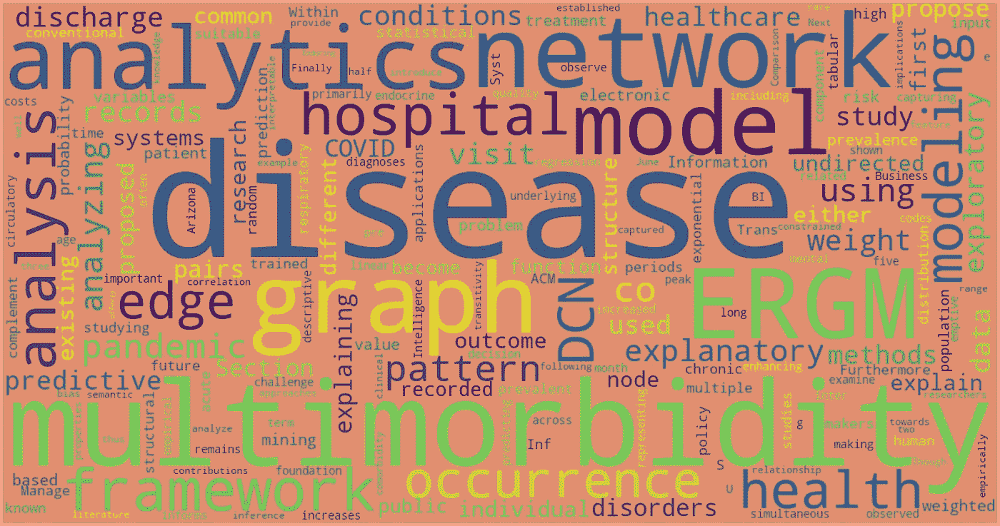
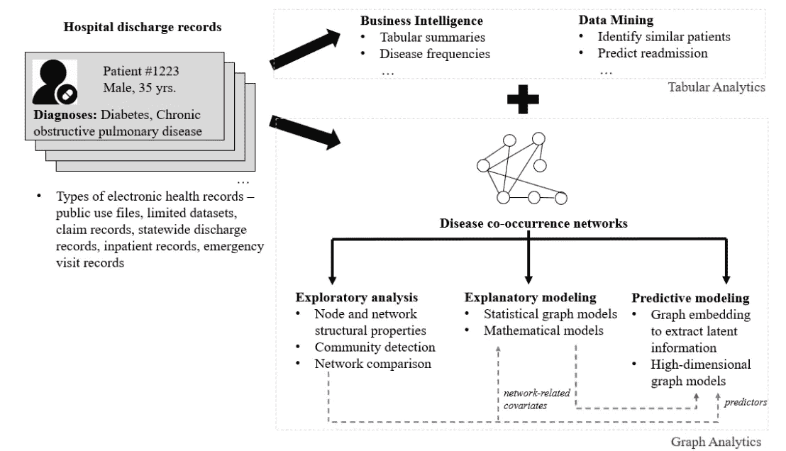

# 识别流行病持久影响的图形分析

> 原文：<https://towardsdatascience.com/graph-analytics-in-identifying-enduring-effects-of-pandemics-5225faacfe0e>

## 图形分析框架，旨在使用指数随机图形模型(ERGMs)确定新冠肺炎对医疗保健系统的持久影响



作者图片

# 内容

1.  介绍
2.  图形分析框架
3.  指数随机图模型的解释性建模
4.  实施环境管理系统
5.  结论

# 介绍

我们最近发表在《美国计算机学会管理信息系统汇刊》( TMIS)上的一项研究显示了图表分析在识别新冠肺炎疫情的持久影响方面的潜力。你可以在这里阅读原文:

[](https://doi.org/10.1145/3564274)  

我们开发了一个图表分析框架来调查新冠肺炎疫情之前和期间患者中多种疾病的同时发生，称为疾病多病性。通过分析电子健康记录(EHRs)数据，我们能够确定可用于检测病毒长期影响的模式和结构。

我们的研究发现，与传统方法相比，图形分析可以更准确、更全面地了解新冠肺炎对患者的影响。通过捕捉电子健康记录(EHRs)数据中的复杂关系和依赖关系，图表分析可以帮助医疗保健提供商更好地了解和解决病毒的长期影响。这些发现对正在进行的抗击新冠肺炎的努力也有重要意义，可以支持研究人员和决策者制定有效的干预措施和治疗方法。

# 图形分析框架



作者图片

提议的框架建立在分析医院出院记录的现有信息系统的基础上。除了传统的分析实践(如疾病患病率排名或使用数据挖掘来预测结果)之外，它还使用图表分析进行多病分析。该框架由三个相互关联的部分组成:探索性分析、解释性建模和预测性建模。它是从具有诊断代码(ICD-10 代码)的医院出院数据集凭经验创建的，并且可以通过在边权重分布上设置合适的阈值来转换成未加权的无向网络。在探索性分析中，可以检查网络及其节点的结构信息，可以使用 DeltaCon 或 NetSimile 等新方法进行比较。解释性建模使用数学或统计图形模型(如 ERGMs)，而预测性建模使用网络的节点和边的嵌入向量来表示潜在特征或拟合高维非线性模型以进行预测。

如果你对如何得到疾病网络的节点和边的嵌入向量感兴趣，请参考下面的博客:

[](https://medium.com/analytics-vidhya/analyzing-disease-co-occurrence-using-networkx-gephi-and-node2vec-53941da35a0f)  

# 指数随机图模型的解释性建模

ERGMs 是分析网络并探索其形成背后的模式和结构的统计模型。ERGMs 基于这样的概念，即特定网络结构的概率可以表示为图统计的指数函数，例如网络中边或三角形的数量。在这项研究中，我们利用指数随机图模型(ERGMs)来估计两种疾病形成联系的概率，称为多病性。然后，我们比较了新冠肺炎疫情之前和期间不同疾病类别的系数，以解释疫情对医疗保健系统的持久影响。

ERGMs 中使用的关键算法之一是马尔可夫链蒙特卡罗(MCMC)算法，这是一种从概率分布中进行采样以估计模型参数的方法。MCMC 使用随机游走过程来探索可能的模型配置的空间，并基于观察到的数据迭代地更新模型参数的估计。ERGMs 中使用的另一个重要算法是 Metropolis-Hastings 算法，它是 MCMC 算法的一个变体，允许更有效地探索模型空间。

ERGMs 的一个优点是，它们可以结合外部变量，如个体水平的特征，来解释网络的形成。这使得研究人员能够测试关于不同因素如何影响网络结构的假设，并预测网络将如何随时间演变。

ERGMs 的另一个好处是它们能够生成结构特性与观测数据相似的合成网络。这对于扩充有限的数据集或模拟干预对网络结构的影响非常有用。

ERGMs 的一个缺点是计算复杂，特别是对于大型网络。它们还需要大量的观察来产生可靠的估计，这使得它们不适合小的或稀疏的数据集。ERGMs 中使用的指数函数有时会产生不切实际的预测，尤其是对于结构复杂的网络或模型指定错误的情况。ERGMs 也有其他缺点，例如指数函数可能导致不准确或误导的结果，以及对假设和建模选择的敏感性。这使得比较不同研究的结果或使用不同的数据集或方法复制发现变得困难。因此，研究人员在使用 ERGMs 分析网络数据时，应仔细考虑其局限性和潜在偏见。

# 实施环境管理系统

在本节中，我将演示一些在 r 中实现 ERGMs 的简单代码，如果您对细节感兴趣，请在此阅读原文: [Package 'ergm'](https://cran.r-project.org/web/packages/ergm/ergm.pdf) 。

R 中的`ergm`包为拟合和分析 ERGMs 提供了一套全面的函数。为了拟合 ERGM，可以使用`ergm()`函数，该函数将包含网络数据的数据帧和指定要拟合的模型的公式作为输入。例如，以下代码通过一个包含边协变项和网络传递项的模型将 ERGM 拟合到存储在`network`数据框中的网络。

```
library(ergm)

# Fit the model
model <- ergm(formula = network ~ edges + transitivity, data = network)
```

以下是`ergm()`功能的一些附加核心参数:

1.  **nodecov** :该术语将每个定量属性或矩阵列的单个网络统计量添加到模型中，等于网络中所有边(I，j)的 attr(i)和 attr(j)之和。(数字)
2.  **nodefactor** :这个术语将多个网络统计信息添加到模型中，每个统计信息对应于 attr 属性(或给定属性的每个组合)的唯一值(的一个子集)。(分类)
3.  **控制**:这是微调“ergm”拟合的用户界面。例如，在内部控制中，您可以设置最大迭代次数、种子和抽样统计数据之间的建议数。

使用附加参数，代码可以重写如下:

```
library(ergm)

# Fit the model
model <- ergm(g1 ~ edges+nodecov(~Numeric_Variable1)
                 + nodecov(~Numeric_Variable2)
                 + nodefactor("Categorical_Variable1", 
                               levels=c("a", "b", "c"))
                 + nodefactor("Categorical_Variable2", 
                               levels=c("a","b")),  
                 control=control.ergm(MCMC.interval = 10000,
                                      MCMLE.maxit = 100,
                                      seed = 42))
```

`summary()`功能可用于获取拟合模型的汇总统计数据和诊断图。该函数将拟合的模型作为输入，并生成一个摘要报告，其中包含有关模型拟合度、模型系数和拟合优度度量的信息。例如，以下代码为拟合的模型生成一个摘要报告:

```
# Generate a summary report
summary(model)
```

如果你有兴趣学习如何操作 R 中的网络，请阅读这里:

[](/network-analysis-in-r-manipulating-network-data-ee388fba7215)  

# 结论

在这项研究中，我们开发了一个图表分析框架和一个基于 ERGM 的解释性图表模型，以检查新冠肺炎疫情之前和期间亚利桑那州医院出院记录中记录的疾病多病性。根据我们的分析，我们观察到，在疫情高峰期间，虽然精神障碍和呼吸障碍的多病率分别增加了 34.26%和 41.04%，但内分泌疾病和循环系统疾病的梯度并不显著。我们还发现，在疫情期间，急性疾病的多病率下降，而慢性疾病的多病率保持不变。

该框架和模型可用于任何包含有序或无序诊断代码列表的标准化电子健康记录数据库。这项研究为未来的研究提供了信息，将多病纳入问题场景，如疾病风险预测和健康结果建模的特征工程。解释性图形模型也可以用于补充深度学习和数据挖掘建模方法。这项研究对健康分析研究人员和政策制定者具有意义，为分析疾病多病模式提供了工具，并为避免公共健康危机的先发制人行动提供了指南。

## 引用作品:

***斯里尼瓦桑、卡尔提克、金行江。"检查新冠肺炎疫情之前和期间美国医院就诊的疾病多病性:图表分析方法."美国计算机学会管理信息系统汇刊(2022)。***[**【https://doi.org/10.1145/3564274】**](https://doi.org/10.1145/3564274)

# **相关阅读**

[](/network-analysis-in-r-manipulating-network-data-ee388fba7215)  [](https://medium.com/mlearning-ai/implementation-of-latent-network-models-visualize-network-data-in-r-b25c42f6d95a)  [](/visualize-high-dimensional-network-data-with-3d-360-degree-animated-scatter-plot-d583932d3693)  [](/networkx-code-demo-for-manipulating-subgraphs-e45320581d13) 