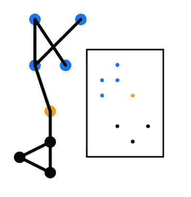
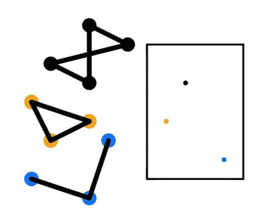
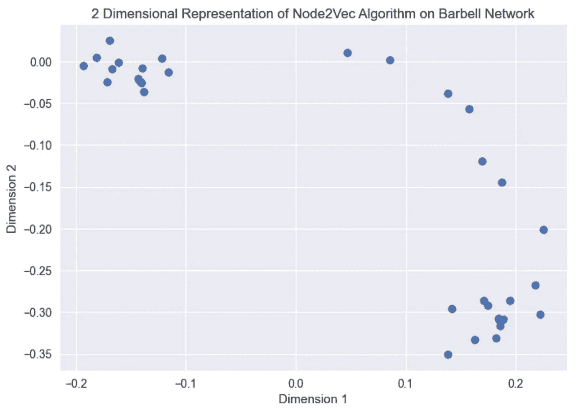
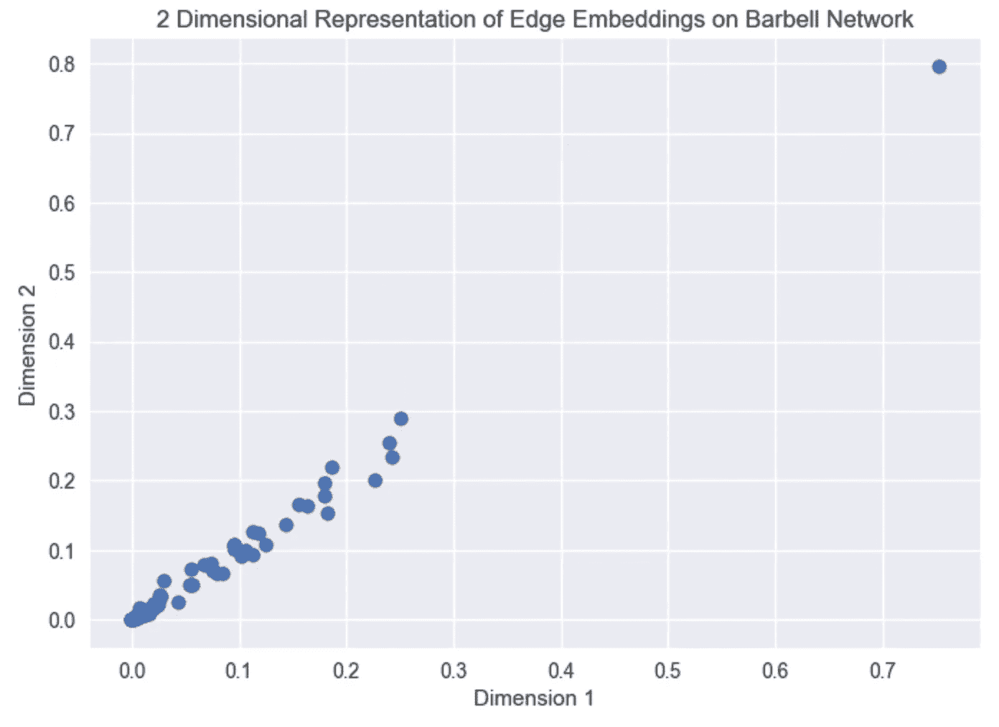
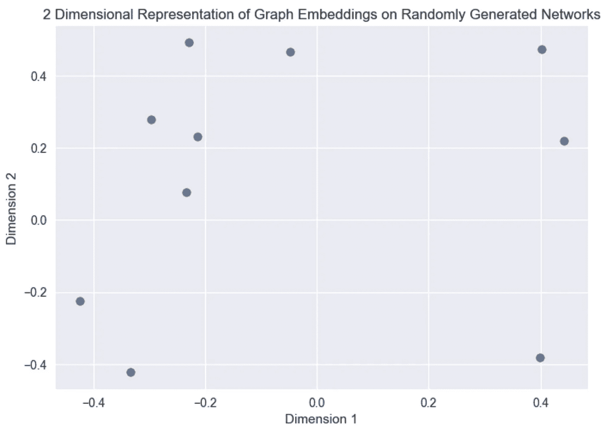

# 解释了图形嵌入

> 原文：<https://towardsdatascience.com/graph-embeddings-explained-f0d8d1c49ec>

## 节点、边和图嵌入方法的概述和 Python 实现


图片由 [Ester Marie Doysabas](https://unsplash.com/@estersthetic) 从 [Unsplash](https://unsplash.com/photos/9rw5JguAiVI) 拍摄

近年来，基于图形的机器学习有所增加。基于图的方法可应用于数据科学中的各种常见问题，如链接预测、社区检测、节点分类等。根据你如何组织你的问题和你所拥有的数据，有许多潜在的方法来解决它。这篇文章将提供一个高层次的概述和基于图形的嵌入算法背后的直觉。我还将介绍如何引用像`node2vec`这样的预建 Python 库来生成图中的节点嵌入。下面概述了本文涵盖的内容。

## 目录

*   图上的机器学习
    -图上机器学习的好处
*   什么是图嵌入？
*   图嵌入的类型
    -节点嵌入
    -边嵌入
    -图嵌入
*   Python 实现
    -需求
    -节点嵌入
    -边嵌入
    -图嵌入
*   结束语
*   资源

# 图上的机器学习

人工智能有各种分支，从推荐系统、时间序列、自然语言处理、基于图形等。通过基于图形的机器学习，有各种方法来解决常见的过程。图由节点之间的一系列成对关系组成。使用图可以解决各种各样的问题，这些问题可以包括社区检测、链路预测、节点分类等。这些问题和解决方案因问题和数据集而异。

与图的机器学习相关的主要问题是找到一种表示(或编码)图结构的方法，以便它可以很容易地被机器学习模型利用[1]。通常，机器学习中的问题需要与模型的图形相关联的结构化表格数据来学习某种表示。在过去，统计测量或核函数是实现这一点的主要方法。然而，近年来，趋势已经转向对图进行编码以生成嵌入向量来训练机器学习模型。

## 机器学习对图形的好处

机器学习模型的目标是接受训练，以大规模学习和识别数据集中的模式。在处理图形时，这一点可能会被放大。它们提供了文本、音频或图像等其他形式的数据所没有的不同且复杂的结构。基于图的机器学习可以检测和解释重复出现的潜在模式[2]。

例如，我们可能对确定与社交网络上的用户相关联的人口统计信息感兴趣。人口统计数据是指年龄、性别、种族等。像脸书或 Twitter 这样的公司的社交媒体网络从数百万到数十亿用户和数万亿边缘。一定有几种模式与来自该网络的用户的人口统计信息相关，这些模式不容易通过人类或算法检测到，但模型应该能够学习它们。类似地，当一对用户目前不是朋友时，我们可能想要推荐他们成为朋友。这进入了链接预测方面(基于图形的机器学习的另一个应用)。

# 什么是图嵌入？

特征工程是指处理输入数据以形成一组特征的常用方法，这些特征提供了原始数据集的紧凑且有意义的表示。特征工程阶段的结果将被用作机器学习模型的输入。虽然这是常见表格结构数据集的处理过程，但在处理图形时，这是一种难以执行的方法。我们需要找到一种方法来生成与所有图形数据相关联的适当表示。

从图中生成表示结构信息的特征有多种方法。最常见和直接的方法是从图表中提取统计数据。这可以包括诸如识别程度分布、页面等级分数、中心性度量、jaccard 分数等。离此更远的一步将是应用能够将期望的属性结合到模型中的核函数。核函数的问题是生成结果的相关时间复杂度。

最近的研究趋势已经转向寻找有意义的图形表示。这项研究的结果产生了图的嵌入。这些嵌入学习保持网络原始结构的图形表示。我们可以认为这是一个映射函数，它的目的是将一个离散的图转换成一个连续的域。一旦学习了该函数，就可以将其应用于该图，并且所得到的映射可以用作机器学习算法的特征集[2]。

# 图嵌入的类型

通常，对图形的分析可以分为 3 个粒度级别。节点级、边级和图级(整个图)。每一层都包含不同的生成嵌入向量的过程，所选择的过程应该取决于你正在处理的问题和数据。请参考下图，该图直观地概括了每个粒度级别的嵌入是如何彼此不同的。

## 节点嵌入

在节点级别，您生成一个与图中每个节点相关联的嵌入向量。这个嵌入向量可以保存图形表示和结构。本质上，彼此非常接近的节点也应该具有彼此非常接近的向量。这是 Node2Vec 等流行的节点嵌入模型的基本原则之一。



二维空间中节点嵌入的可视化表示。图片由作者提供。

## 边缘嵌入

边级别，您生成一个与图中每条边相关联的嵌入向量。链路预测问题是使用边缘嵌入的常见应用。链接预测是指预测一对节点应该具有连接它们的边的可能性。这些嵌入可以学习由图提供的边属性。例如，在一个社交网络图中，你可以有一个多边图，其中节点可以根据年龄范围、性别、友谊等通过边连接。表示该边的相关向量可以学习这些边属性。


二维空间中边缘嵌入的可视化表示。图片由作者提供。

## 图形嵌入

图级别的嵌入并不常见，它们包括生成一个表示每个图的嵌入向量。考虑一个有多个子图的大图，每个对应的子图都有一个表示图结构的嵌入向量。分类问题是一个常见的应用，其中图嵌入可能是有用的。这些类型的问题包括将一个图形分类到一个特定的类别。



二维空间中图形嵌入的可视化表示。图片由作者提供。

# Python 实现

## 要求

```
Python=3.9
networkx>=2.5
pandas>=1.2.4
numpy>=1.20.1
node2vec>=0.4.4
karateclub>=1.3.3
matplotlib>=3.3.4
```

如果没有安装 node2vec 包，这里的[是通过命令行安装的库文档。同样，你可以用 Python 安装 karateclub 包，指令如下](https://pypi.org/project/node2vec/)[这里](https://pypi.org/project/karateclub/)。

## 节点嵌入



从可视化的杠铃图生成的节点嵌入。图片由作者提供。

有许多方法可以计算节点嵌入，如 node2vec、深度行走、随机行走等。出于本教程的目的，我将使用 node2vec。

## 边缘嵌入



可视化杠铃图生成的边缘嵌入。图片由作者提供。

Hammard 嵌入器的源代码可以在[这里](https://github.com/eliorc/node2vec/blob/master/node2vec/edges.py#L91)找到。

## 图形嵌入



从许多随机生成的图中生成的图嵌入。图片由作者提供。

graph2vec 算法的源代码可以在[这里](https://karateclub.readthedocs.io/en/latest/_modules/karateclub/graph_embedding/graph2vec.html)找到。

# 结束语

简单地说，嵌入是一个将离散图映射到向量表示的函数。从图中可以生成各种形式的嵌入，即节点嵌入、边嵌入和图嵌入。所有这三种类型的嵌入都提供了一种矢量表示，将图的初始结构和特征映射到 x 维的数值量。

你可以在我的 GitHub 页面[这里](https://github.com/vatsal220/medium_articles/blob/main/graph_embeddings/graph_emb.ipynb)查看与本教程相关的资源库。

如果你想转型进入数据行业，并希望得到经验丰富的导师的指导和指引，那么你可能想看看最敏锐的头脑。Sharpest Minds 是一个导师平台，导师(他们是经验丰富的实践数据科学家、机器学习工程师、研究科学家、首席技术官等。)将有助于你的发展和学习在数据领域找到一份工作。点击这里查看。

# 资源

*   [1][https://www-cs . Stanford . edu/people/jure/pubs/graph representation-IEEE 17 . pdf](https://www-cs.stanford.edu/people/jure/pubs/graphrepresentation-ieee17.pdf)
*   [2]Aldo Marzullo、Claudio Stamile 和 Enrico Deusebio 的《图形机器学习》
*   [3][https://karateclub . readthedocs . io/en/latest/_ modules/karateclub/graph _ embedding/graph 2 vec . html](https://karateclub.readthedocs.io/en/latest/_modules/karateclub/graph_embedding/graph2vec.html)

如果你觉得这篇文章有用，这里有一些我写的其他文章，你可能也会觉得有用。

[](/calculating-data-drift-in-machine-learning-53676ff5646b)  [](/word2vec-explained-49c52b4ccb71)  [](/link-prediction-recommendation-engines-with-node2vec-c97c429351a8)  [](/recommendation-systems-explained-a42fc60591ed)  [](/text-summarization-in-python-with-jaro-winkler-and-pagerank-72d693da94e8) 