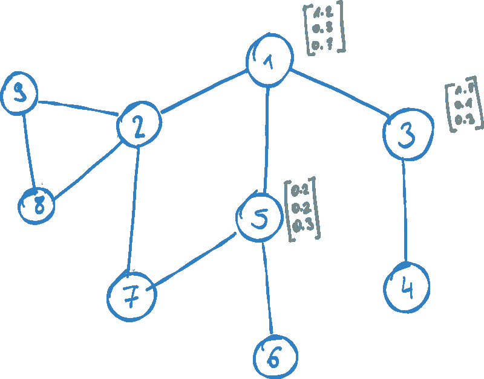
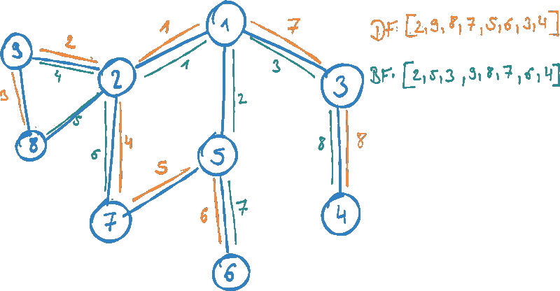
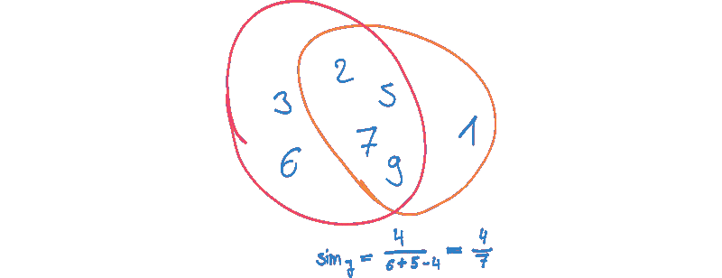
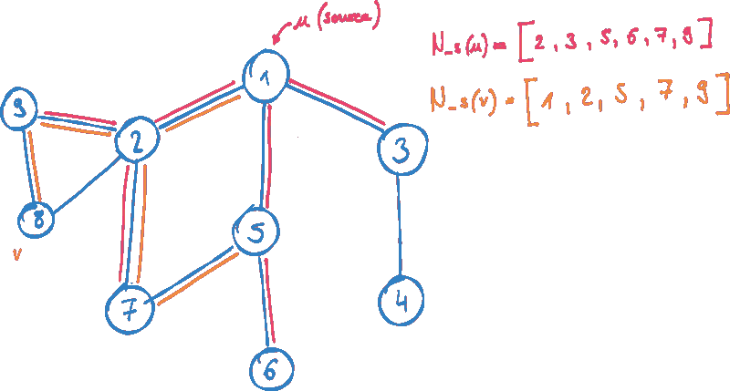
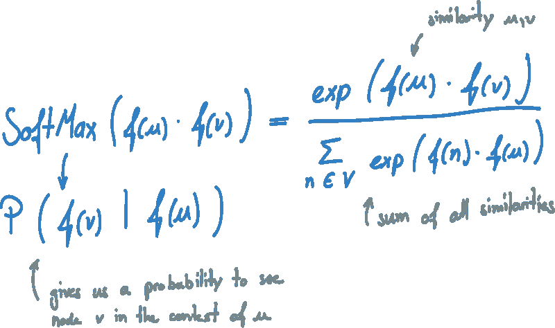
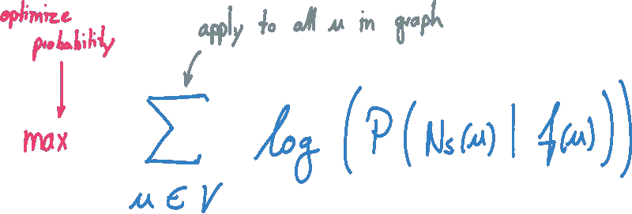

# 图形嵌入:节点如何映射到向量

> 原文：<https://towardsdatascience.com/graph-embeddings-how-nodes-get-mapped-to-vectors-2e12549457ed>

*   大多数传统的机器学习算法对数字向量数据进行处理
*   图嵌入通过学习从图结构数据到向量表示的映射，打开了强大的工具箱
*   它们的基本优化是:在嵌入空间中映射具有相似上下文的节点
*   图中节点的上下文可以使用两种正交方法之一来定义——同伦和结构等价——或者它们的组合
*   一旦定义了度量标准，数学就被简明地公式化了——让我们来探索一下。

# 图形数据库和机器学习

图形数据库对各种来源的相关数据的大数据应用程序有着广泛的热情和采用。它们基于强大的存储概念，使简洁的查询语言能够分析数据中复杂的关系模式。因此，像 PageRank、中心性检测、链接预测和模式识别这样的算法可以用简单和直观的方式来陈述。

然而，大多数发展良好的传统机器学习算法，如线性和逻辑回归、神经网络等，都是基于数字向量表示的。要打开这个强大的工具箱来处理图结构，我们需要一种方法来以向量形式表示我们的数据网络。图嵌入是从图中的数据学习这种映射的一种形式。

# 图嵌入的目的



作者图片

我们的目标是为图中的每个节点找到一个向量表示。映射应该代表节点的网络结构，而不是考虑节点的相关特征。换句话说，节点的嵌入向量应该基于它的关系和相邻节点。图中相似的节点应该在向量空间中紧密映射。我们将节点映射到的向量空间称为嵌入空间。

现在，如果我们看一下上面的陈述，我会想到两个问题，需要进一步思考:

*   是什么使得图中的两个节点*相似*？
*   嵌入空间中的*关闭*是什么意思？

# 网络中的相似节点

为了详细说明图中的相似性，让我们考虑一个句子:


作者图片

一个句子是一系列单词，每个单词都有一个确定的位置。因此，一个句子中的一个词恰好有一个祖先和一个后继者。为了定义一个单词在句子中的上下文，我们可以使用它周围的单词。例如，单词“capital”的距离一上下文是单词“the”和“of”。距离-两个上下文将是单词“是”，“的”，“的”，“德国”。这被称为 n-gram 模型，并被称为 word2vec 的用于查找单词嵌入的流行方法所使用。

类似于 n-gram，我们可以定义图中节点的上下文。尽管如此，我们在图形结构中比在单词序列中有更多的选择。在一般的图中，每个节点可能连接到两个以上的其他节点，而在一个句子中，一个单词只有一个直接的祖先和后继。

因此，一个句子是一个向量，沿着索引轴移动可以探索单词的上下文。然而，图被描述为二维邻接矩阵，并且节点的直接祖先是向量。为了探索节点的上下文，我们在每个距离级别上都有多个选择，并且我们必须决定如何遍历它们。

通常，有两种正交的方法来探索网络环境:



作者图片

1.  广度优先:在我们(可能)转移到距离为 2 的节点之前，我们首先详细说明源节点的直接邻居。这也被称为同性恋，来源于一个社会学概念，即人们通常倾向于与相似的人密切互动。因此，它基于图中相似节点具有紧密关系的假设。
2.  深度优先:我们首先沿着从源节点开始到其深度的路径探索一个连接链，然后再继续下一个。与同向性相反，这种度量从更广的角度捕捉了网络中节点的角色。我们不是着眼于密切的关系，而是寻求发现一个节点的结构角色:例如，它是如何嵌入到一个更大的社区环境中的。这种度量被称为结构等价。

我们可以使用这两种方法来查找节点的上下文——可能的话，可以将它们结合起来。有了一组描述每个节点上下文的节点，我们可以使用这些集合来比较每对节点的上下文相似性。例如，我们可以应用 Jaccard 相似度来度量两个上下文有多少重叠。这将为我们提供一种在图中找到具有相似网络结构的节点的方法。



作者图片

# 背景取样

然而，我们不能对任何给定节点的整个上下文进行采样，因为这最终会导致捕获任何节点的整个图。因此，我们采用一种叫做抽样策略的近似方法。想法是在源顶点开始固定数量的随机行走，以探索其上下文来生成随机样本。node2vec 定义的采样策略结合了同质性和结构等价性。它实现了一个参数来决定在行走的每一步中是应该靠近源节点(同向性)还是应该探索另一个距离级别(结构等价)。



作者图片

在 node2vec 中，我们试图为每个节点找到一个数字向量，而不是使用前面描述的 Jaccard 相似性。我们使用图中节点的采样上下文来优化映射函数，以将具有相似上下文的节点映射到一起。

# node2vec 的数学

让我们通过考虑下面的例子来详细探讨 node2vec 是如何工作的:

```
V: all nodes in graph
N_S(u): neighborhood of u determined by sample strategy S
f(u): mapping function of node u onto a vector
```

我们的目标是找到 V 中所有节点 u 的嵌入，使得具有相似上下文的节点的向量表示在嵌入空间中是接近的。我们已经知道图中相似的上下文意味着什么，但是我们仍然需要定义，嵌入空间中的接近意味着什么。


作者图片

现在让我们只考虑图中的两个节点:

```
u: source node
v: node in context of u
```

为了开始我们的数学，我们简单地为两个节点选择两个随机向量`f(u), f(v)`。为了度量嵌入空间中的相似性，我们使用两个向量的点积，即它们之间的角度。


作者图片

由于节点`v`在`u`的附近，现在的想法是递增地优化映射函数`f`，使得它们的相似性得到最大化。

为了将我们的相似性转化为概率，我们应用了一个 softmax。softmax 使用`u`与所有其他向量`v in V`的所有相似性的总和来标准化相似性得分`dot(f(u), f(v))`。因此，点积被转换成一个介于`[0,1]`之间的数字，所有的相似性加起来等于 1。结果是在节点`u`的上下文中从它们的向量表示中看到节点`v`的概率。现在，我们可以通过使用随机梯度下降更新我们的向量`f(u)`来递增地优化这个概率。



作者图片

下一步是推广这一概念，不仅对 N_S(u)中的一个节点 v 进行优化，而且对 u 上下文中的所有节点进行优化。如果给定节点 u，我们希望优化看到整个采样上下文的概率。如果我们假设样本独立，我们可以将此公式简化为简单概率的乘积。


作者图片

最后，我们想学习图中每个源节点 u 的映射。因此，我们将该公式同时应用于图的所有节点。我们使用 SGD 通过调整我们的映射`f`来优化总和，以便概率增加。我们逐步改进，直到达到最大迭代次数，或者在优化问题中找到一个固定点。



作者图片

# 进一步说明

当实现这个解决方案并在大型数据集上运行它时，有一个主要的挑战:当我们计算 softmax 来确定概率`P(f(v) | f(u))`时，分母中有一个归一化项，计算起来很难看。这个归一化项是图中`u`和所有其他节点的所有相似性的总和。它在优化的整个迭代中保持固定，因此对于源节点`u`的求和的所有迭代也是固定的。第一个优化是将该因子移出总和。

第二个挑战是，计算所有向量的这种因子非常昂贵。在每次迭代中，我们必须确定每个源节点`u`与图中所有其他向量的点积，以找到归一化因子。为了克服这一点，一种称为负采样的技术被用来近似这一因素。

# 边缘嵌入

上述方法也可以应用于不同的基本假设:代替寻找具有相似上下文的节点的映射，我们也可以设置将边映射到嵌入空间的不同目标，使得这些边靠近，共享相同的节点。结合 node2vec 中的节点和边嵌入，我们在更一般的术语*下导出图嵌入*，它能够将相关数据映射到向量表示。

# 结论

我们已经探索了如何找到一个映射`f(u)`来将一个图的节点映射到一个向量空间中，这样相似的节点是闭合的。有多种方法来定义图上下文中节点的相似性:同构和结构等价。两者都有正交的方法，node2vec 定义了一个策略，将两者结合成一个参数化的采样策略。采样策略是一种找到节点上下文的方法，这反过来又被用来导出我们的嵌入。嵌入空间中的相似性又被定义为两个映射向量之间的点积。嵌入本身是使用随机梯度下降的迭代优化。它在每次迭代中调整所有节点的向量，以最大化同时看到来自相同上下文的节点的概率。对非常大的数据集的实现和应用需要一些统计近似来加速计算。

node2vec 是打开传统机器学习算法的强大工具箱以处理图结构数据的重要钥匙。

就我个人而言，我再次被解决手头问题的算法定义的简单和简洁所吸引。我发现令人惊讶的是，如果将这些方法应用于正确的问题，使用正确的数据量，它们的效果会有多好。

## 参考

*   [node2vec:网络的可扩展特征学习](http://arxiv.org/abs/1607.00653)。a .格罗弗 j .莱斯科维奇。 *ACM SIGKDD 知识发现与数据挖掘国际会议(KDD)* ，2016。