# 图形机器学习@ ICML 2022

> 原文：<https://towardsdatascience.com/graph-machine-learning-icml-2022-252f39865c70>

## GraphML 有什么新特性？

## 最新进展和热点趋势，2022 年 7 月版

国际机器学习大会(ICML) 是研究人员发表最佳作品的主要场所之一。ICML 2022 挤满了数百份论文和[众多致力于图表的工作室](https://icml.cc/Conferences/2022/Schedule?type=Workshop)。我们分享最热门的研究领域的概况🔥在图表 m1 中。

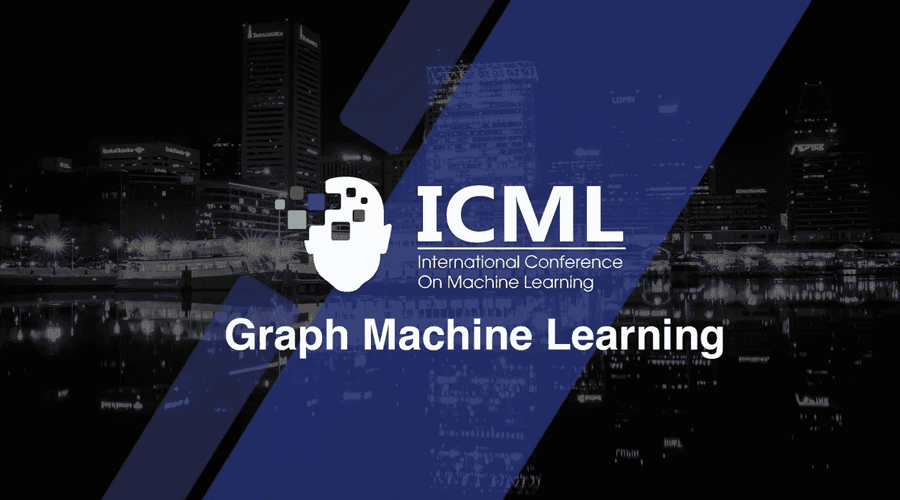

*本帖由* [*迈克尔·高尔金*](https://twitter.com/michael_galkin) *(米拉)和* [*朱兆承*](https://twitter.com/zhu_zhaocheng) *(米拉)撰写。*

我们尽最大努力强调了 ICML 会议上图形 ML 的主要进展，每个主题包含 2-4 篇论文。尽管如此，由于被接受的论文数量庞大，我们可能会错过一些作品——请在评论或社交媒体上让我们知道。

# 目录(可点击):

1.  [生成:去噪扩散就是你所需要的](#7cf5)
2.  [图形变形金刚](#b96e)
3.  [理论和表达性 GNNs](#165d)
4.  [光谱 GNNs](#5145)
5.  [可解释的 GNNs](#be73)
6.  [图形增强:超出边缘丢失](#fe10)
7.  [算法推理和图形算法](#2f59)
8.  [知识图推理](#bbee)
9.  [计算生物学:分子连接、蛋白质结合、性质预测](#774c)
10.  [酷图应用](#f4b7)

# 代:去噪扩散是你所需要的

**去噪扩散概率模型** ( [DDPMs](https://arxiv.org/abs/2006.11239) )将在 2022 年接管深度学习领域，几乎所有领域都具有令人惊叹的生成质量和比 GANs 和 VAEs 更好的理论属性，例如，图像生成( [GLIDE](https://arxiv.org/abs/2112.10741) 、 [DALL-E 2](https://openai.com/dall-e-2/) 、 [Imagen](https://gweb-research-imagen.appspot.com/paper.pdf) )、[视频生成](https://arxiv.org/pdf/2205.09853.pdf)、文本生成( [Diffusion-LM](https://arxiv.org/pdf/2205.14217.pdf) )，甚至[从概念上讲，扩散模型逐渐向输入对象添加噪声(直到它是高斯噪声)，并学习预测添加的噪声水平，以便我们可以从对象中减去它(去噪)。](https://arxiv.org/pdf/2205.09991.pdf)

扩散可能是 GraphML 在 2022 年的最大趋势——特别是当应用于药物发现、分子和构象异构体生成以及一般的量子化学时。通常，它们与等变 GNNs 的最新进展配对。ICML 为图形生成提供了几个很酷的去噪扩散实现。

在由 **Hoogeboom、Satorras、Vignac 和 Welling** 撰写的《[*3d*](https://arxiv.org/pdf/2203.17003.pdf)*中用于分子生成的等变扩散中，作者定义了用于分子生成的等变扩散模型( **EDM** ，其必须在原子坐标 *x* 上保持 E(3)等变(关于*旋转*、*平移*、重要的是，分子具有不同的特征形态:原子电荷是一个有序整数，原子类型是一个热点分类特征，原子坐标是连续特征，因此，例如，你不能只添加高斯噪声到一个热点特征，并期望模型工作。相反，作者设计了特定特征的噪声处理和损失函数，并缩放输入特征以训练稳定性。*

*EDM 采用[最先进的 E(n) GNN](https://arxiv.org/pdf/2102.09844.pdf) 作为神经网络，根据输入特征和时间步长预测噪声。在推理时，我们首先对期望数量的原子 *M* 进行采样，然后我们可以根据期望的属性 *c* 对 EDM 进行调节，并要求 EDM 生成分子(由特征 *x* 和 *h* 定义)作为 *x，h ~ p(x，h | c，M)* 。*

*在实验上，EDM 在实现负对数似然性、分子稳定性和独特性方面远远优于基于归一化流量和 VAE 的方法。烧蚀表明，等变 GNN 编码器至关重要，因为用标准 MPNN 代替它会导致性能显著下降。GitHub 上已经有[的代码了，试试吧！](https://github.com/ehoogeboom/e3_diffusion_for_molecules)*

*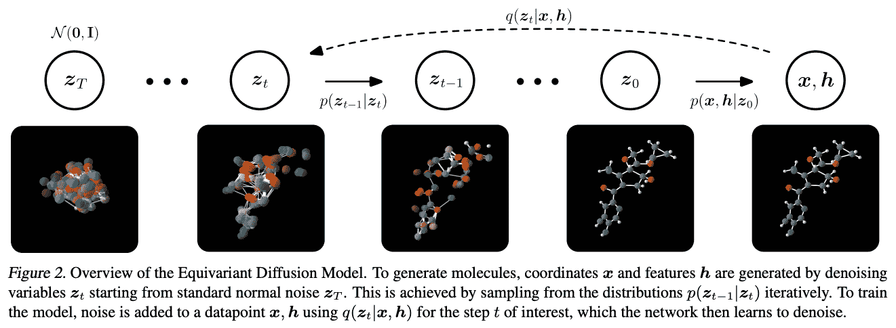*

*向前和向后扩散。来源: [Hoogeboom、Satorras、Vignac 和 Welling](https://arxiv.org/pdf/2203.17003.pdf) 。*

**

*基于扩散的生成可视化。来源:[推特](https://twitter.com/emiel_hoogeboom/status/1509838163375706112)*

*对于 2D 图形， [Jo、Lee 和 Hwang](https://arxiv.org/pdf/2202.02514.pdf) 提出了通过随机微分方程系统 ( **GDSS** )的**图形扩散。之前的 EDM 是去噪扩散概率模型(DDPM)的一个实例， **GDSS** 属于 DDPMs 的姐妹分支，即**基于分数的模型**。事实上，最近的[(ICLR ' 21)](https://openreview.net/pdf?id=PxTIG12RRHS)表明，如果我们用随机微分方程(SDEs)描述前向扩散过程，DDPMs 和基于分数的模型可以统一到同一个框架中。***

*SDE 允许将连续时间内的扩散建模为[维纳过程](https://en.wikipedia.org/wiki/Wiener_process)(为简单起见，假设它是添加噪声过程的一个奇特术语)，而 DDPMs 通常以 1000 步将其离散化(具有可学习的时间嵌入)，尽管 SDE 需要使用特定的解算器。与之前基于分数的图生成器相比， **GDSS** 将相邻关系 *A* 和节点特征 *X* 作为输入(并预测)。表示为 SDE 的向前和向后扩散需要计算*分数*——这里是联合对数密度(X，A)的梯度。为了获得这些密度，我们需要一个*基于分数的模型*，这里作者使用了一个[具有注意力集中](https://openreview.net/pdf?id=JHcqXGaqiGn)的 GNN(图形多头注意力)。*

*在训练时，我们求解一个**正向 SDE** 并训练一个得分模型，而在推理时，我们使用训练好的得分模型并求解**反向时间 SDE** 。通常，你会在这里使用类似于[朗之万动力学](https://en.wikipedia.org/wiki/Langevin_dynamics)的东西，例如，朗之万 MCMC，但是高阶[龙格-库塔](https://en.wikipedia.org/wiki/Runge%E2%80%93Kutta_methods)解算器原则上也应该在这里工作。实验表明，在 2D 图生成任务中，GDSS 远远优于自回归生成模型和一次性 VAEs，尽管由于集成了逆时 SDE，采样速度可能仍然是一个瓶颈。 [GDSS 码](https://github.com/harryjo97/GDSS)已经有了！*

*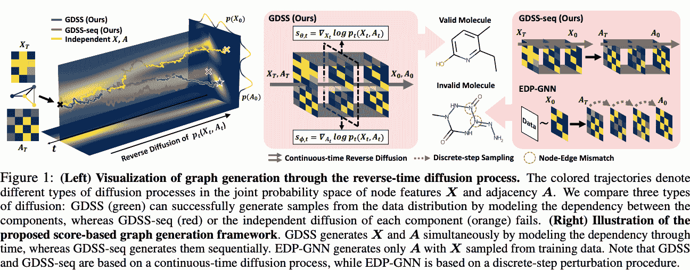*

*GDSS 直觉。资料来源:[乔、李和黄](https://arxiv.org/pdf/2202.02514.pdf)*

*👀现在看看 arxiv，我们期待今年会有更多的扩散模型发布——图中的 DDPMs 应该有他们自己的大博客，敬请关注！*

*➡️最后，非扩散生成的一个例子是 Martinkus 等人的工作，他们设计了用于一次性图形生成的 GAN。除了经常立即生成邻接矩阵的其他 GANs 之外， **SPECTRE** 的思想是根据拉普拉斯算子的前 k 个(最低)特征值和特征向量来生成图形，这些特征值和特征向量已经给出了集群和连通性的一些概念。1️⃣ **幽灵**生成 *k* 个特征值。2️⃣作者使用了一个聪明的技巧，从 top-k 特征向量诱导的[斯蒂费尔流形](https://en.wikipedia.org/wiki/Stiefel_manifold)中抽取特征向量。Stiefel 流形提供了一组标准正交矩阵，从中我们可以采样一个 *n x k* 矩阵。3️⃣Finally，获得一个拉普拉斯算子，作者使用一个[可证明强大的图网](https://papers.nips.cc/paper/2019/file/bb04af0f7ecaee4aae62035497da1387-Paper.pdf)来生成最终邻接。*

*实验表明， **SPECTRE** 比其他 GANs 好几个数量级，比自回归图形生成器快 30 倍🚀。*

*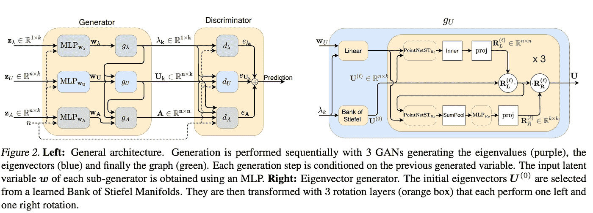*

*SPECTRE 生成特征值->特征向量->邻接的 3 步过程。来源:[马丁库斯等人](https://arxiv.org/pdf/2204.01613.pdf)*

# *图形转换器*

*在今年的 ICML 上，我们有两篇关于改进图形转换器的论文。*

*首先，[陈，奥布雷，博格瓦德](https://arxiv.org/pdf/2202.03036.pdf)提出**结构感知变压器**。他们注意到自我关注可以被重写为核平滑，其中查询键乘积是一个指数核。然后归结为找到一个更一般化的内核——作者建议使用节点和图的功能来添加结构意识，即**k-子树**和**k-子图**特征。*K-子树*本质上是 k-hop 邻域，可以相对快速地挖掘，但最终受限于 1-WL 的表达能力。另一方面，*k-子图*的计算成本更高(并且很难扩展)，但是提供了可证明的更好的区分能力。*

*无论您选择什么特征，这些子树或子图(为每个节点提取的)都将通过任何 GNN 编码器(例如，PNA)进行编码，汇集(总和/平均值/虚拟节点)，并在自我关注计算中用作查询和关键字(参见图示👇).*

*从实验上来说，k 为 3 或 4 就足够了，k-子图特性在我们能够负担计算费用的图上工作得更好。有趣的是，像拉普拉斯特征向量和随机游走特征这样的位置特征只对*k-子树 SAT* 有帮助，而对*k-子图 SAT* 则毫无用处。*

*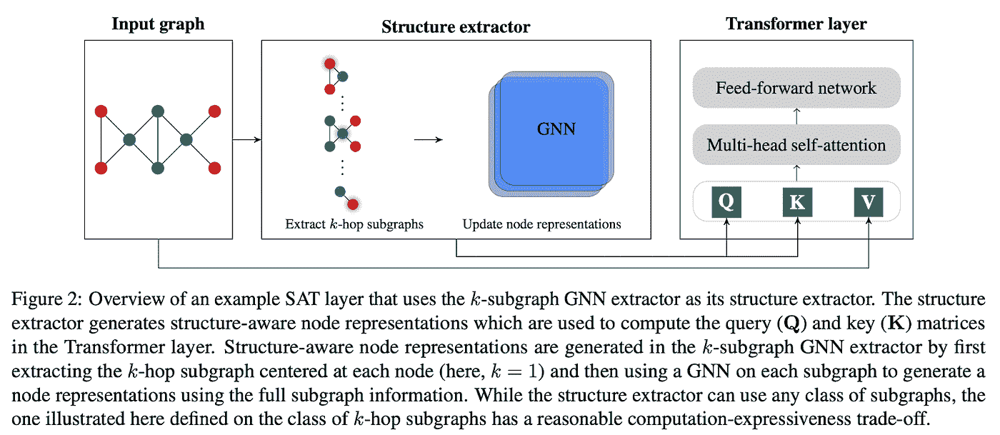*

*资料来源:【陈、奥布雷、博格瓦德*

*第二， [Choromanski，林，陈等人](https://arxiv.org/pdf/2107.07999.pdf)(该团队与著名[表演者](https://arxiv.org/abs/2009.14794)的作者有很多重叠)研究的是实现亚二次注意的原理性机制。特别是，他们考虑了相对位置编码(RPE)及其对不同数据形式(如图像、声音、视频和图形)的变化。考虑到图形，我们从[graph former](https://github.com/microsoft/Graphormer)得知，将最短路径距离注入注意力效果很好，但是需要完整注意力矩阵的具体化(因此，不可扩展)。我们能否在没有完全具体化的情况下近似 softmax 注意力，但仍然包含有用的图形归纳偏差？🤔*

*是啊！作者提出了两种这样的机制。(1)事实证明，我们可以使用**图形扩散核(GDK)**——也称为热核——模拟热传播的扩散过程，并作为最短路径的软版本。然而，扩散需要调用求解器来计算矩阵指数，因此作者设计了另一种方法。(2)随机行走图-节点核(RWGNK ),其值(对于两个节点)编码从这两个节点开始的随机行走获得的(这两个节点的)频率向量的点积。*

*随机漫步很棒，我们喜欢随机漫步😍查看下图，了解漫射和 RW 内核结果的可视化描述。具有 RWGNK 内核的最终转换器被称为**图内核注意力转换器****【GKAT】**，并且针对从 er 图中拓扑结构的综合识别到小型 compbio 和社交网络数据集的几个任务进行探索。GKAT 在合成任务上显示出更好的结果，并且在其他图形上的表现与 GNNs 相当。如果能看到真正的可伸缩性研究将转换器推向输入集大小的极限，那就太好了！*

**

*资料来源:[乔罗曼斯基、林、陈等](https://arxiv.org/pdf/2107.07999.pdf)*

# *理论与表达性 GNNs*

*GNN 社区继续研究突破 1-WL 表达能力的上限并保持至少多项式时间复杂性的方法。*

*➡️ [帕普和瓦腾霍夫](https://proceedings.mlr.press/v162/papp22a/papp22a.pdf)从当前理论研究的准确描述开始:*

> *每当引入新的 GNN 变体时，相应的理论分析通常会显示它比 1-WL 更强大，有时还会将其与经典的 k-WL 层次结构进行比较……我们能否找到一种更有意义的方法来衡量 GNN 扩展的表现力？*

*作者将表达性 GNNs 的文献分为 4 类:1️⃣ k-WL 和近似；2️⃣底座计数**(s)**；3️⃣子图和邻域感知 GNNs **(N)** (在 Michael Bronstein 最近的文章中广泛讨论了[)；带有标记的 4️⃣gnns——这些是节点/边扰动方法和节点/边标记方法 **(M)** 。然后，作者提出了所有这些 **k-WL、S、N 和 M** 家族如何相关以及哪一个在何种程度上更强大的理论框架。该层次比 k-WL 更细粒度，有助于设计具有足够表现力的 gnn，以覆盖特定的下游任务并节省计算。](/using-subgraphs-for-more-expressive-gnns-8d06418d5ab)*

*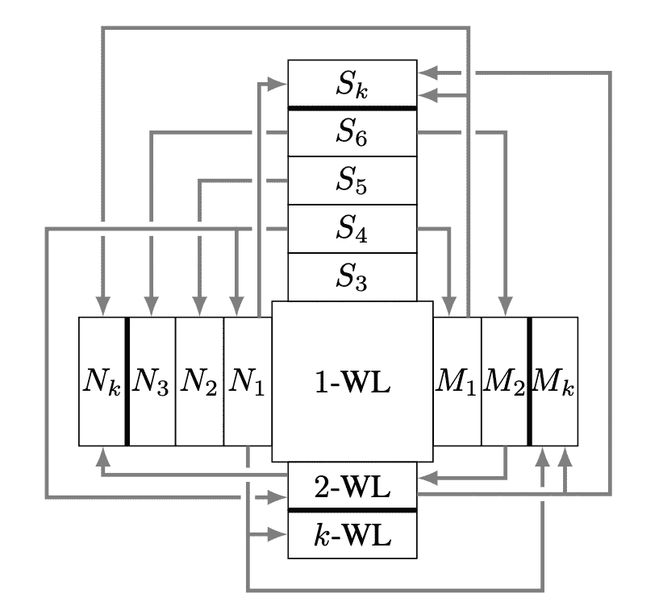*

*不同的富有表现力的 GNN 家族的等级制度。n =子图 GNNs，S =子结构计数，M =带标记的 GNNs。资料来源: [Papp 和 Wattenhofer](https://proceedings.mlr.press/v162/papp22a/papp22a.pdf)*

*➡️也许是最美味的 ICML'22 作品是由厨师们用🥓 [SpeqNets](https://github.com/chrsmrrs/speqnets) 🥓(*斯帕克*在德语中是*培根*)。已知的高阶 k-WL gnn 要么在 k 阶张量上操作，要么考虑所有的 *k* 节点子图，这意味着在存储器需求上对 *k* 的指数依赖，并且不适应图的稀疏性。 **SpeqNets** 为图同构问题引入了一种新的启发式算法，即 **(k，s)-WL** ，它在表达性和可伸缩性之间提供了更细粒度的控制。*

*本质上，该算法是[局部 k-WL](https://arxiv.org/abs/1904.01543) 的变体，但仅考虑特定元组以避免 k-WL 的指数存储复杂性。具体来说，该算法只考虑最多具有 **s 个连通**分量的 k 节点上的 **k 元组**或子图，有效地利用了底层图的潜在稀疏性——变化的 **k** 和 **s** 导致理论上的可扩展性和表达性之间的折衷。*

*基于上述组合见解，作者导出了一种新的置换等变图神经网络，记为 **SpeqNets** ，在极限情况下达到普适性。与受监督的节点和图形级分类和回归机制中的标准高阶图形网络相比，这些架构大大减少了计算时间，从而显著提高了标准图形神经网络和图形核架构的预测性能。*

**

*的等级制度🥓SpeqNets🥓。来源:[莫里斯等人](https://proceedings.mlr.press/v162/morris22a/morris22a.pdf)*

*接下来，[黄等人](https://proceedings.mlr.press/v162/huang22l/huang22l.pdf)以一种非正统的眼光看待排列不变的 gnn，认为精心设计的**排列敏感的**gnn 实际上更有表现力。Janossy pooling 的理论说，如果我们展示一组变换的所有可能的例子，那么一个模型对于这样一组变换是不变的，对于 n 个 T21 元素的排列，我们有一个难以处理的 n！排列组合。相反，作者表明，只考虑节点的邻域的成对 2 元排列就足够了，并且可以证明比 2-WL 更强大，并且不比 3-WL 更弱。*

*实际上，提出的 [**PG-GNN**](https://github.com/zhongyu1998/PG-GNN) 扩展了 GraphSAGE 的思想，通过两层 LSTM 对节点邻域的每个随机排列进行编码，而不是传统的 *sum/mean/min/max* 。此外，作者设计了一种基于哈密顿圈的线性置换采样方法。*

**

*PG-GNN 排列敏感聚集思想。来源:[黄等](https://proceedings.mlr.press/v162/huang22l/huang22l.pdf)*

*你可能想看看其他一些有趣的作品:*

*   *[蔡和王](https://proceedings.mlr.press/v162/cai22b/cai22b.pdf)研究[不变图网络](https://arxiv.org/abs/1812.09902)的收敛性质，与传统 MPNNs 的不同之处在于，它们对节点和边特征的操作如同对整体张量的等变操作。基于 [graphon](https://en.wikipedia.org/wiki/Graphon) 理论，作者找到了一类可证明收敛的 ign。更多技术细节在[牛逼的 Twitter 帖子](https://twitter.com/ChenCaiUCSD/status/1550109192803045376)！*
*   *[高与里贝罗](https://proceedings.mlr.press/v162/gao22e/gao22e.pdf)研究⏳时间 GNNs⏳设计两个系列:(1)*——我们首先通过一些 GNN 嵌入图形快照，然后应用一些 RNN；(2) *先时间后图形*其中，我们首先通过 RNN 对所有节点和边特征(在所有快照的统一图形上)进行编码，然后仅应用单个 GNN 过程，例如， [TGN](https://arxiv.org/abs/2006.10637) 和 [TGAT](https://openreview.net/forum?id=rJeW1yHYwH) 可以被认为是该家族的实例。理论上，作者发现当使用像 GCN 或 GIN 这样的标准 1-WL GNN 编码器时，*时间-图形*比*时间-图形*更有表现力，并提出了一个带有 GRU 时间编码器和 GCN 图形编码器的简单模型。该模型在时态节点分类和回归任务上表现出极具竞争力的性能，速度快 3-10 倍，GPU 内存效率高。有趣的是，作者发现**无论是** *时间和图形*还是*时间和图形* **都不足以表达时间链接预测的**🤔。**
*   **最后，“*魏斯费勒-雷曼遇上-瓦瑟斯坦*”作者【陈、林、梅莫利、万、王(5-第一作者联合论文👀)从 WL 核中导出一个多项式时间的 [WL 距离](https://github.com/chens5/WL-distance)，这样我们可以测量两个图的相异度——WL 距离为 0 当且仅当它们不能被 WL 测试区分，并且正的当且仅当它们可以被区分。作者进一步认识到，提出的 WL 距离与[格罗莫夫-瓦瑟斯坦距离](https://arxiv.org/abs/1808.04337)有着深刻的联系！**

****

**魏斯费勒-莱曼如何在实践中遇到格罗莫夫-沃瑟斯坦？本应在论文中由[陈、老林、莫文蔚、万、王](https://proceedings.mlr.press/v162/chen22o/chen22o.pdf)。来源:[期限](https://tenor.com/view/predator-arnold-schwarzenegger-hand-shake-arms-gif-3468629)**

# **光谱 GNNs**

**➡️光谱 GNNs 往往被忽视的空间 GNNs 的主流，但现在有一个理由让你看看光谱 GNNs 🧐.在王[和张](https://proceedings.mlr.press/v162/wang22am/wang22am.pdf)的《 [*谱图神经网络*](https://proceedings.mlr.press/v162/wang22am/wang22am.pdf) 有多强大》一文中，作者证明了在一些较弱的假设下，线性谱是图上任何函数的通用逼近子。更令人兴奋的是，根据经验，这些假设对于真实世界的图来说是正确的，这表明线性谱 GNN 对于节点分类任务来说足够强大。**

**但是我们如何解释光谱 GNNs 实验结果的差异呢？作者证明了谱 GNNs 的不同参数化(特别是多项式滤波器)影响收敛速度。我们知道 Hessian 矩阵的条件数(等损线有多圆)与收敛速度高度相关。基于这种直觉，作者提出了一些有利于优化的正交多项式。被命名为[雅可比基](https://en.wikipedia.org/wiki/Jacobi_polynomials)的多项式是[切比雪夫基](https://proceedings.neurips.cc/paper/2016/file/04df4d434d481c5bb723be1b6df1ee65-Paper.pdf)中使用的[切比雪夫基](https://en.wikipedia.org/wiki/Chebyshev_polynomials)的推广。雅可比基由两个超参数定义， *a* 和 *b* 。通过调整这些超参数，可以找到一组有利于输入图形信号的基。**

**实验上， **JacobiConv** 在嗜同性和嗜异性数据集上都表现良好，即使作为线性模型也是如此。或许是时候抛弃那些华而不实的 gnn 了，至少对于节点分类任务来说是这样😏。**

**➡️:还有两篇关于光谱 gnn 的论文。一个是基于光谱浓度分析的[图高斯卷积网络](https://proceedings.mlr.press/v162/li22h/li22h.pdf) (G2CN)，在嗜异性数据集上显示出良好的结果。另一篇来自 [Yang 等人](https://proceedings.mlr.press/v162/yang22n/yang22n.pdf)的文章分析了基于光谱平滑度的图形卷积中的相关性问题，显示了锌上的 **0.0698** MAE 的非常好的结果。**

# **可解释的 GNNs**

**由于大多数 GNN 模型都是黑箱，所以解释 GNNs 在关键领域的应用预测是很重要的。今年我们在这个方向有两篇很棒的论文，一篇是熊等人[的高效而强大的事后模型](https://proceedings.mlr.press/v162/xiong22a/xiong22a.pdf)，另一篇是苗等人的内在可解释模型。**

**熊等人扩展了他们之前的 GNN 解释方法 [GNN-LRP](https://arxiv.org/pdf/2006.03589.pdf) ，使之更具可扩展性。与其他方法( [GNNExplainer](https://arxiv.org/pdf/1903.03894.pdf) 、 [PGExplainer](https://arxiv.org/pdf/2011.04573.pdf) 、 [PGM-Explainer](https://arxiv.org/pdf/2010.05788.pdf) )不同的是， [GNN-LRP](https://arxiv.org/pdf/2006.03589.pdf) 是一种考虑子图中节点联合贡献的高阶子图归属方法。对于子图不仅仅是一组节点的任务来说，这种性质是必要的。例如，在分子中，六个碳的子图(忽略氢)可以是苯(一个环)或己烷(一个链)。如下图所示，高阶方法可以计算出这样的子图(右图)，而低阶方法(左图)则不能。**

****

**来源:[熊等人](https://proceedings.mlr.press/v162/xiong22a/xiong22a.pdf)。**

**然而，GNN-LRP 算法的缺点是，它需要计算子图中每一次随机行走的梯度 w.r.t .对于一个子图 *S* 和 *L* 跳随机行走需要 *O(|S|L)* 。这里动态编程来拯救😎。请注意，梯度 w.r.t. a 随机游走是乘法的(链式法则)，不同的随机游走通过求和来聚合。这可以通过和积算法有效地计算出来。这个想法是利用乘法上的求和的分配性质(更普遍的是，[半环](https://en.wikipedia.org/wiki/Semiring))，在每一步聚合部分随机游走。这就构成了模型， [**子图 GNN-LRP (sGNN-LRP)**](https://github.com/xiong-ping/sgnn_lrp_via_mp) 。**

**sGNN-LRP 还通过广义子图属性对 GNN-LRP 进行了改进，该属性考虑了子图 *S* 及其补图 *G\S* 中的随机游动。虽然看起来很复杂，但广义子图属性可以通过两次和积算法来计算。实验上， **sGNN-LRP** 不仅比所有现有的解释方法更好地发现属性，而且运行速度与常规消息传递 GNN 一样快。可能是解释和可视化的有用工具！🔨**

**💡顺便说一句，基于随机游走的模型比简单的节点或边模型更有表现力，这并不新鲜。NeurIPS 的 21 篇论文 [NBFNet](https://papers.nips.cc/paper/2021/file/f6a673f09493afcd8b129a0bcf1cd5bc-Paper.pdf) 用随机游走和动态规划解决知识图推理，在直推式和归纳式设置中都取得了惊人的结果。**

**➡️ [苗等](https://proceedings.mlr.press/v162/miao22a/miao22a.pdf)从另一个角度研究内在可解释的 GNN 模型。他们表明，事后解释方法，如 [GNNExplainer](https://arxiv.org/pdf/1903.03894.pdf) ，对于解释来说是不合格的，因为它们仅仅使用了一个固定的预训练 GNN 模型。相比之下，联合优化预测器和解释模块的内在可解释 GNN 是更好的解决方案。沿着这个思路，作者从图信息瓶颈( **GIB** )原理中推导出 [**图随机注意(GSAT)**](https://github.com/Graph-COM/GSAT) 。 **GSAT** 对输入图进行编码，从后验分布中随机抽取一个子图(解释)。它基于采样的子图进行预测。作为一个优势， **GSAT** 不需要限制采样子图的大小。**

**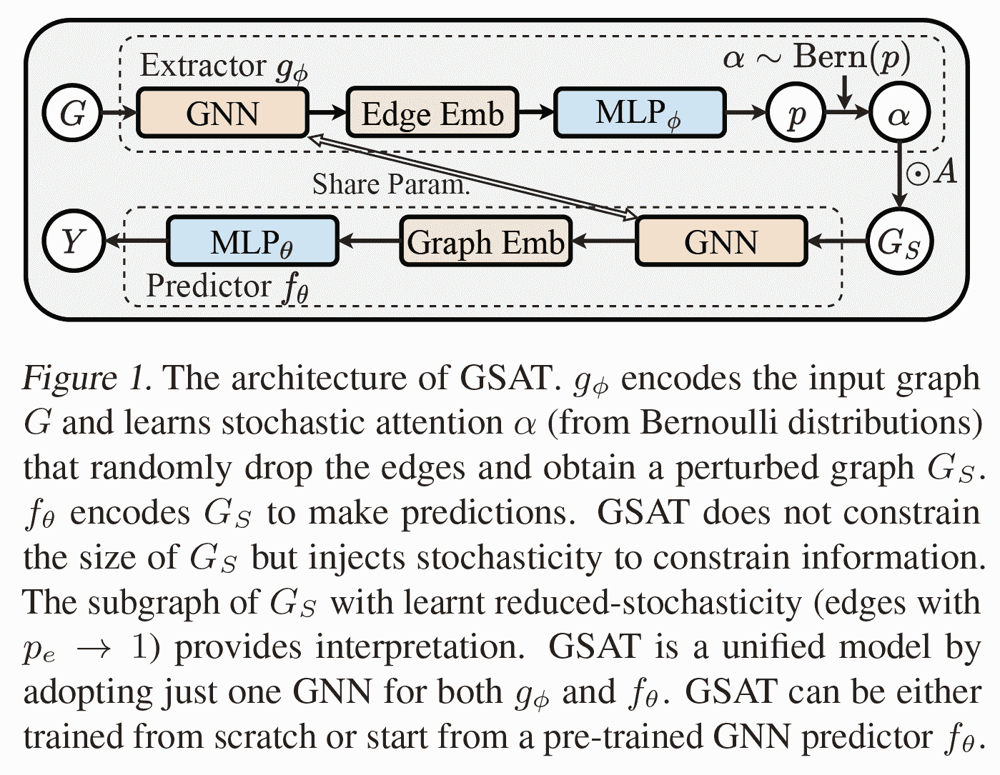**

**来源:[苗等人](https://proceedings.mlr.press/v162/miao22a/miao22a.pdf)**

**实验上， **GSAT** 在解释和预测性能方面都比事后方法好得多。它也可以与预训练的 GNN 模型相结合。如果您正在为您的应用程序构建可解释的 gnn，GSAT 应该是一个不错的选择。**

# **图形扩充:超越边缘丢失**

**今年带来了一些关于改进 gnn 的自我监督能力的工作，这些工作超越了像节点/边丢失这样的随机边索引扰动。**

**[韩等人](https://arxiv.org/pdf/2202.07179.pdf)将 2017 年以来用于图像增强的[混合](https://github.com/facebookresearch/mixup-cifar10)的思想带到了带有**g-mix**的图中(ICML 2022 优秀论文奖🏅).混合的想法是拍摄两幅图像，将它们的特征混合在一起，并将它们的标签混合在一起(根据预定义的加权因子)，并要求模型预测这个标签。这种混合提高了分类器的鲁棒性和泛化质量。**

> **但是我们如何混合两个通常可能有不同数量的节点和边的图呢？**

**作者找到了优雅的答案——让我们不要混合图表，而是混合他们的[图表](https://en.wikipedia.org/wiki/Graphon)——简而言之，就是图表生成器。来自同一个生成器的图具有相同的底层 graphon。因此算法变得相当简单(见下图)——对于一对图，我们 1️⃣估计它们的图；2️⃣通过加权求和将两个文法混合成一个新文法；3️⃣从新 graphon 和它的新标号中抽取一个图样本；4️⃣把这个送到分类器。在说明性示例中，我们有两个分别具有 2 个和 8 个连通分量的图，并且在混合它们的图之后，我们得到两个主要社区的新图，每个主要社区具有 4 个次要社区。估计图可以用一个阶跃函数和几种计算复杂度不同的方法来完成(作者大多求助于[【最大间隙】](https://arxiv.org/abs/1110.6517))。**

**实验上， **G-Mixup** 稳定了模型训练，表现得比传统的节点/边扰动方法更好或相当，但是在具有标签噪声或许多添加/移除的边的鲁棒性场景中远远超过它们。一种众所周知的扩充方法对图形的冷静适应👏！如果你感兴趣，ICML 22 提供了一些关于混合的更一般的作品:一项关于混合如何改进校准的研究和如何在生成模型中使用它们的研究。**

**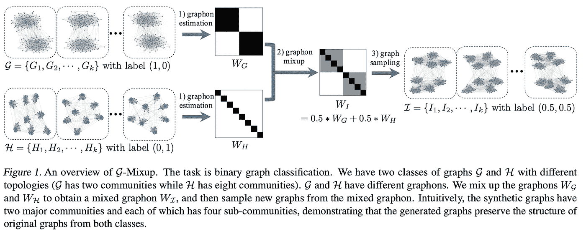**

**G-Mixup。来源:[韩等](https://arxiv.org/pdf/2202.07179.pdf)**

**刘等人从另一个角度来看增强技术，特别是在节点的邻域很小的情况下。 [**局部增强 GNNs (LA-GNN)**](https://github.com/SongtaoLiu0823/LAGNN) 的思想是训练一个生成模型，为每个节点产生一个附加的特征向量。生成模型是(在整个图形上)训练的条件 VAE，以预测以中心节点为条件的相连邻居的特征。也就是说，一旦 CVAE 被训练，我们只需传递每个节点的一个特征向量，并获得另一个特征向量，该特征向量应该比普通邻居捕获更多的信息。**

**然后，我们将每个节点的两个特征向量连接起来，并将其发送给任何下游的 GNN 和任务。注意，CVAE 是预先训练过的，不需要用 GNN 训练。有趣的是，CVAE 可以为看不见的图形生成特征，即，局部增强也可以用于归纳任务！最初的假设通过实验得到了证实——增强方法对于小角度的节点特别有效。**

****

**局部增强的想法。来源:[刘等](https://arxiv.org/pdf/2109.03856.pdf)**

**下一步，[于，王，王等人](https://arxiv.org/pdf/2206.07161.pdf)，处理 GNN 可扩展性任务，其中使用标准邻居采样器 a-la GraphSAGE 可能导致指数邻域大小扩展和陈旧的历史嵌入。作者提出了 [**GraphFM**](https://github.com/divelab/DIG/tree/dig/dig/lsgraph) ，一种特征动量方法，其中历史节点嵌入通过动量步骤从它们的 1 跳邻居获得更新。通常，动量更新经常出现在 SSL 方法中，如用于更新*目标*网络的模型参数的 [BYOL](https://papers.nips.cc/paper/2020/file/f3ada80d5c4ee70142b17b8192b2958e-Paper.pdf) 和 [BGRL](https://arxiv.org/abs/2102.06514) 。这里，GraphFM 使用动量来减轻不同小批量中历史再现的方差，并为不同大小的邻域提供特征更新的无偏估计。**

**一般来说，GraphFM 有两种选择**graph FM-*in batch*和**graph FM-*out of batch*T21。(1) GraphFM-InBatch 通过大幅减少必要邻居的数量来实现 GraphSAGE 风格的邻居采样，而 GraphSAGE 需要 10–20 个邻居，具体取决于级别，GraphFM 只需要每层每个节点 1 个随机邻居。唯一👌！(2) GraphFM Out-of-batch 构建在 [GNNAutoScale](https://arxiv.org/pdf/2106.05609.pdf) 之上，我们首先应用图分割将图分割成 k 个小批。******

**从实验上看，特征动量看起来对 SAGE 风格的采样(批量版本)特别有用——对于所有基于邻居采样的方法来说，这似乎是一个很好的默认选择！**

****

**与 [GNNAutoScale (GAS)](https://arxiv.org/pdf/2106.05609.pdf) 相比，历史节点状态也根据新的嵌入和特征动量(移动平均)进行更新。来源:【于，王，王，等**

**最后，[赵等人](https://arxiv.org/pdf/2106.02172.pdf)提出了一个巧妙的基于反事实链接的链接预测增强技巧。本质上，作者问:**

> **"如果图形结构变得与观察不同，这种联系还会存在吗？"**

**这意味着我们想找到链接，在结构上类似于根据一些给定的链接💊*处理*(这里，那些是经典的度量标准，如 SBM 聚类、k-core 分解、Louvain 等等)但是给出了相反的结果。通过 [**CFLP**](https://github.com/DM2-ND/CFLP) ，作者假设训练 GNN 正确预测真实和反事实的联系有助于模型摆脱虚假的相关性，并只捕捉对推断两个节点之间的联系有意义的特征。**

**在获得一组反事实链路之后(基于所选的*处理函数*的预处理步骤) **CFLP** 首先在事实链路和反事实链路上被训练，然后链路预测解码器利用一些平衡和正则化项被微调。从某种意义上来说，这种方法类似于挖掘硬性否定来增加真实肯定联系的集合🤔实验上， **CFLP** 与 GNN 编码器配对大大优于单个 GNN 编码器在 Cora/Citeseer/Pubmed 上的结果，并且仍然在 OGB-DDI 链接预测任务的 [top-3 中！](https://ogb.stanford.edu/docs/leader_linkprop/)**

****

**反事实链接(右)。来源:[赵等人](https://arxiv.org/pdf/2106.02172.pdf)**

# **算法推理和图形算法**

**🎆算法推理社区的一个巨大里程碑——CLRS 基准测试 [**的出现**](https://github.com/deepmind/clrs) (以一本经典教科书[命名，由 Cormen、Leiserson、Rivest 和 Stein 编写](https://en.wikipedia.org/wiki/Introduction_to_Algorithms)，Velič ković等人编写！现在，没有必要发明玩具评估任务——CLRS 包含 30 种经典算法(排序、搜索、MST、最短路径、图形、动态规划等等),将一个 [ICPC](https://icpc.global/) 数据生成器转换成一个 ML 数据集😎。**

**在 **CLRS** 中，每个数据集元素是一个*轨迹*，即输入、输出和中间步骤的集合。底层的表示格式是一组节点(通常不是一个图，因为边可能不是必需的)，例如，对 5 个元素的列表进行排序被构造为对一组 5 个节点的操作。轨迹由*探测器*组成——格式元组(阶段、位置、类型、值)，用其状态编码算法的当前执行步骤。输出解码器取决于预期的类型—在示例图中👇排序是用指针建模的。**

**分开来看，训练和验证轨迹具有 16 个节点(例如，长度为 16 的排序列表)，但是测试集在具有 64 个节点的任务上探测模型的分布外(OOD)能力。有趣的是，普通 GNNs 和 MPNNs 非常适合训练数据，但在 OOD 设置中表现不佳，其中[指针图网络](https://proceedings.neurips.cc//paper/2020/file/176bf6219855a6eb1f3a30903e34b6fb-Paper.pdf)显示更好的数字。这是 GNNs 无法推广到更大的推理图的观察集合的又一个数据点——如何解决这个问题仍然是一个开放的问题🤔。代码[已经可用](https://github.com/deepmind/clrs)并且可以用更多的定制算法任务来扩展。**

****

**clr 中提示的表示。来源:[veli kovi 等人](https://arxiv.org/pdf/2205.15659.pdf)**

**➡️从更理论的角度来看， [Sanmartín 等人](https://proceedings.mlr.press/v162/sanmarti-n22a/sanmarti-n22a.pdf)通过[代数路径问题](https://www.youtube.com/watch?v=ZzBWh6orSHk) (APP)概括了图度量的概念。APP 是一个更高级的框架(在范畴理论中有[的一些根源](https://arxiv.org/abs/2005.06682))，它通过半环的概念统一了许多现有的图形度量，如最短路径、[通勤成本距离](https://en.wikipedia.org/wiki/Cost_distance_analysis)和极大极小距离，半环是具有特定运算符和属性的集合上的代数结构。例如，最短路径可以描述为一个半环，带有" *min* "和" *+* "带有中性元素的运算符" *+inf* "和" *0* "。**

**在这里，作者创建了一个单一的应用程序框架**对数范数距离**，允许仅使用两个参数在最短路径、通勤成本和 minimax 之间进行插值。本质上，您可以改变和混合边权重和周围图结构(其他路径)对最终距离的影响。虽然没有实验，但这是一个坚实的理论贡献——如果你在“吃你的蔬菜”时学习范畴理论🥦，这篇论文非常值得一读——并且肯定会在 GNNs 中找到应用。👏**

****

**对数范数距离。来源:[桑马丁等人](https://proceedings.mlr.press/v162/sanmarti-n22a/sanmarti-n22a.pdf)**

**➡️:最后，我们将在这一类别中添加一部作品*，作者是**罗西等人**，他们将图论与博弈论结合在一起。博弈论在经济学和其他多学科研究中被大量使用，你可能听说过定义非合作博弈解决方案的[纳什均衡](https://en.wikipedia.org/wiki/Nash_equilibrium)。在这项工作中，作者考虑了 3 种游戏类型:*线性二次型*、*线性影响*和*巴里克-奥诺里奥图形游戏*。游戏通常是通过他们的效用函数来定义的，但是在这篇文章中，我们假设我们对游戏的效用函数一无所知。***

**游戏被定义为采取特定行动的 n 个玩家(图中的节点)(为了简单起见，假设我们可以用某个数字特征来描述它，查看🖼️).下面的插图行动可以影响邻近的玩家——这个任务的框架是根据玩家的行动推断他们的图形。本质上，这是一个图生成任务——给定节点特征 X，预测 a(归一化)邻接矩阵 a，通常一个游戏玩 K 次，那些是独立游戏，所以编码器模型应该对游戏的排列不变(对每个游戏中节点的排列等变)。作者提出了**金块**🍗编码器-解码器模型，其中变换器编码器通过 N 个玩家处理 K 个游戏，产生潜在的表示，并且解码器是潜在的成对玩家特征的哈达玛乘积之和上的 MLP，使得解码器对于 K 个游戏的顺序是置换不变的。**

**实验表明，该模型在合成数据集和真实数据集上都运行良好。这篇论文绝对是“开阔你的眼界”🔭你可能没想到会在 ICML 看到这些作品，但后来会发现这是一种引人入胜的阅读，并学到了许多新概念👏。**

**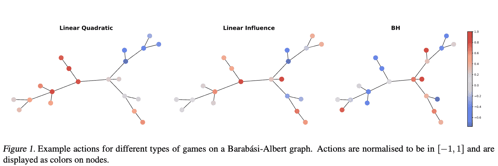**

**来源:[罗西等人](https://arxiv.org/pdf/2206.08119.pdf)**

# **知识图推理**

**知识图推理一直是 GraphML 方法的乐园。在今年的《ICML》上，有不少关于这个话题的有趣论文。作为今年的一个趋势，我们看到从嵌入方法( [TransE](https://proceedings.neurips.cc/paper/2013/file/1cecc7a77928ca8133fa24680a88d2f9-Paper.pdf) 、 [ComplEx](http://proceedings.mlr.press/v48/trouillon16.pdf) 、 [RotatE](https://arxiv.org/pdf/1902.10197.pdf) 、 [HAKE](https://ojs.aaai.org/index.php/AAAI/article/view/5701/5557) )到 GNNs 和逻辑规则(其实 GNNs 也是[和逻辑规则](https://openreview.net/pdf?id=r1lZ7AEKvB)相关)的一个显著漂移。有四篇论文基于 GNNs 或逻辑规则，两篇论文扩展了传统的嵌入方法。**

**先从颜等人提出的 [**循环基 GNN (CBGNN)**](https://github.com/pkuyzy/CBGNN) 说起。作者在逻辑规则和循环之间画了一个有趣的联系。对于任何一个链式逻辑规则，逻辑规则的头和体在知识图中总是形成一个循环。例如，下图的右图显示了`(X, part of Y) ∧ (X, lives in, Z) → (Y, located in Z)`的周期。换句话说，逻辑规则的推理可以被视为预测循环的合理性，这归结为学习循环的表示。**

****

**蓝色和红色三角形是更大的绿色循环中的循环。来源:[颜等人](https://proceedings.mlr.press/v162/yan22a/yan22a.pdf)**

**一个有趣的观察是，循环在*模 2* 加法和乘法下形成一个线性空间。在上面的例子中，红色❤️和蓝色的总和💙自行车，抵消了他们的共同优势，导致绿色💚循环。因此，我们不需要学习所有圈的表示，而是只需要学习线性空间的**几个圈基**。作者通过挑选与最短路径树有很大重叠的环来生成环基。为了学习循环的表示，他们创建了一个循环图，其中每个节点都是原始图中的一个循环，每个边都表示两个循环之间的重叠。应用 GNN 来学习循环图中的节点(原始图的循环)表示。**

****

**CBGNN 编码。来源:[严等](https://proceedings.mlr.press/v162/yan22a/yan22a.pdf)**

**为了将 **CBGNN** 应用于归纳关系预测，作者通过用 LSTM 对循环中的关系进行编码来为每个循环构建归纳输入表示。实验上，CBGNN 在 FB15k-237/WN18RR/NELL-995 的感应版本上实现了 SotA 结果。**

**接下来， [Das 和 godbole 等人](https://proceedings.mlr.press/v162/das22a/das22a.pdf)提出了用于 KBQA 的基于案例推理(CBR)方法 [**CBR-SUBG**](https://github.com/rajarshd/CBR-SUBG) 。核心思想是在解决查询时从训练集中检索相似的查询-答案对。我们知道检索的想法在 OpenQA 任务中很流行( [EMDR](https://arxiv.org/pdf/2106.05346.pdf) 、 [RAG](https://arxiv.org/abs/2005.11401) 、 [KELM](https://arxiv.org/pdf/2010.12688.pdf) 、[提内存 LMs](https://openreview.net/forum?id=OY1A8ejQgEX) )，但这是第一次看到这样的想法在图上被采用。**

**给定一个自然语言查询，CBR 首先基于由预先训练的语言模型编码的查询表示检索相似的 k-最近邻(kNN)查询。所有检索到的查询都来自训练集，因此它们的答案是可访问的。然后，我们为每个查询-答案对生成一个局部子图，它被认为是答案的推理模式(尽管不一定是精确的)。当前查询的局部子图(我们无法访问其答案)是通过遵循其 kNN 查询的子图中的关系路径来生成的。 **CBR-SUBG** 然后对每个子图应用 GNN，并通过将节点表示与 KNN 查询中的答案进行比较来预测答案。**

**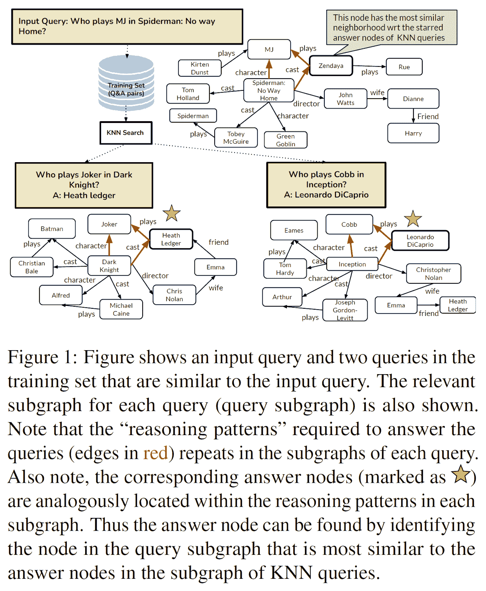**

**基于案例的推理直觉。来源: [Das 和 Godbole 等人](https://proceedings.mlr.press/v162/das22a/das22a.pdf)**

**➡️今年有两种神经符号推理方法。第一个是 [**层次规则归纳(HRI)**](https://github.com/claireaoi/hierarchical-rule-induction) 出自 [Glanois 等人](https://proceedings.mlr.press/v162/glanois22a/glanois22a.pdf)。HRI 扩展了以前的一个工作，[逻辑规则归纳(LRI)](https://arxiv.org/pdf/1809.02193.pdf) 关于归纳逻辑编程。规则归纳的想法是学习一堆规则，并应用它们来推断事实，如[正向链接](https://en.wikipedia.org/wiki/Forward_chaining)。**

**在 **LRI** 和 **HRI** 中，每个事实`P(s,o)`都由一个嵌入 *𝜃p* 的谓词和一个赋值`vp`(即事实为真的概率)来表示。每个规则`P(X,Y) ← P1(X,Z) ∧ P2(Z,Y)`都由其谓词的嵌入来表示。目标是迭代地应用规则来推导新的事实。在每次迭代过程中，通过软统一来匹配规则和事实，软统一衡量两个事实是否满足嵌入空间中的某些规则。一旦选择了一个规则，就会生成一个新的事实并将其添加到事实集中。所有嵌入和软统一操作被端到端地训练，以最大化观察到的事实的可能性。**

**HRI 模型在三个方面比 LRI 模型有所改进:1)使用分层的先验知识，将每个迭代步骤中使用的规则分开。2)使用 gumbel-softmax 来归纳用于软统一的稀疏且可解释的解决方案。3)证明 HRI 能够表达的逻辑规则集。**

****

**分层规则归纳。来源: [Glanois 等人](https://proceedings.mlr.press/v162/glanois22a/glanois22a.pdf)**

**第二篇是[朱等人](https://proceedings.mlr.press/v162/zhu22c/zhu22c.pdf)的 GNN-QE 论文(**免责声明**:本文作者的论文)。GNN-QE 用广义神经网络和模糊集解决知识图上复杂的逻辑查询。它兼具神经方法(例如强大的性能)和符号方法(例如可解释性)的优点。因为在 GNN-QE 有很多有趣的东西，我们很快会有一个单独的博客帖子。敬请期待！🤗**

**最后， [Kamigaito 和 Hayashi](https://proceedings.mlr.press/v162/kamigaito22a/kamigaito22a.pdf) 研究了**负抽样**在知识图嵌入中的理论和实证效果。从[旋转](https://arxiv.org/pdf/1902.10197.pdf)开始，知识图嵌入方法使用一个归一化的负采样损失，加上一个边际二进制交叉熵损失。这不同于原来 [word2vec](https://proceedings.neurips.cc/paper/2013/file/9aa42b31882ec039965f3c4923ce901b-Paper.pdf) 中使用的负采样。在本文中，作者证明了基于距离的模型([trans](https://proceedings.neurips.cc/paper/2013/file/1cecc7a77928ca8133fa24680a88d2f9-Paper.pdf)， [RotatE](https://arxiv.org/pdf/1902.10197.pdf) )要达到最优解，归一化负采样损失是必要的。边距在基于距离的模型中也起着重要的作用。只有当 *𝛾 ≥ log|V|* 时，才能达到**最优解**，这与经验结果一致。基于这个结论，现在我们可以确定最佳的保证金没有超参数调整！😄**

# **计算生物学:分子连接，蛋白质结合，性质预测**

**总的来说，comp bio 在 ICML 表现很好。在这里，我们将看看**分子连接**、**蛋白质结合**、构象异构体生成和分子性质预测的新方法。**

****分子连接**是设计[蛋白水解靶向嵌合体(PROTAC)](https://en.wikipedia.org/wiki/Proteolysis_targeting_chimera) 药物的关键部分。对我们来说，仅仅是 GNN 的研究者🤓在没有生物学背景的情况下，这意味着给定两个分子，我们想要生成一个有效的*接头*分子，它将两个*片段*分子连接在一个分子中，同时保留原始片段分子的所有属性(查看下面的插图以获得一个很好的示例)**

**为了生成分子链，[黄等人](https://arxiv.org/pdf/2205.07309.pdf)创造了 **3DLinker** ，这是一个 e(3)-等变生成模型(VAE)，它以**绝对**坐标顺序生成原子(和连接键)。通常，等变模型会生成相对坐标或相对距离矩阵，但在这里，作者旨在生成绝对 *(x，y，z)* 坐标。为了允许模型从等变(到坐标)和不变(到节点特征)变换中生成精确的坐标，作者应用了一个巧妙的[向量神经元](https://arxiv.org/pdf/2104.12229.pdf)的想法，它本质上是一个类似 ReLU 的非线性，通过巧妙的正交投影技巧来保持特征等变。**

**富含**向量神经元**的 e(3)-等变编码器对特征和坐标进行编码，而解码器以 3 个步骤顺序地生成链接(也在下面示出):1️⃣预测链接将被附加到的锚节点；2️⃣预测链接器节点节点类型；3️⃣预测边缘及其绝对坐标；4️⃣重复，直到我们在第二个片段中到达停止节点。 **3DLinker** 是(到目前为止)第一个生成具有**精确 3D 坐标**的连接分子并预测片段分子中锚点的等变模型——以前的模型在生成之前需要已知锚点——并显示最佳实验结果。**

****

**3d 链接器直觉。来源:[黄等](https://arxiv.org/pdf/2205.07309.pdf)**

**➡️ **蛋白质-配体结合**是另一项至关重要的药物发现任务——预测一个小分子可能在哪里附着到一个更大蛋白质的某个区域。先是，[史塔克，加内亚等人](https://arxiv.org/pdf/2202.05146.pdf)创作 [**对等**](https://github.com/HannesStark/EquiBind) (ICML 聚焦💡)以蛋白质和配体图的随机 RDKit 构象作为输入，并输出结合相互作用的精确 3D 位置。EquiBind 已经在[麻省理工学院新闻](https://news.mit.edu/2022/ai-model-finds-potentially-life-saving-drug-molecules-thousand-times-faster-0712)和[阅读小组](https://www.youtube.com/watch?v=706KjyR-wyQ&list=PLoVkjhDgBOt11Q3wu8lr6fwWHn5Vh3cHJ&index=14)中获得了非常热烈的欢迎和宣传，因此我们鼓励您详细了解技术细节！ **EquiBind** 比商业软件快几个数量级，同时保持较高的预测精度。**

****

**EquiBind。资料来源:[斯特尔克、加内亚等人](https://arxiv.org/pdf/2202.05146.pdf)**

**如果结合分子是未知的，并且我们想要生成这样的分子，[刘等人](https://proceedings.mlr.press/v162/liu22m/liu22m.pdf)创建了 [**GraphBP**](https://github.com/divelab/GraphBP) ，这是一种自回归分子生成方法，其将目标蛋白质位点(表示为初始上下文)作为输入。使用任何 3D GNN 对上下文进行编码(此处为 [SchNet](https://proceedings.neurips.cc/paper/2017/file/303ed4c69846ab36c2904d3ba8573050-Paper.pdf) ，GraphBP 生成原子类型和球坐标，直到不再有接触原子可用或达到所需的原子数量。一旦原子生成，作者就求助于[开放巴别塔](https://jcheminf.biomedcentral.com/articles/10.1186/1758-2946-3-33)来创造化学键。**

****

**用 GraphBP 生成结合分子。来源:[刘等](https://proceedings.mlr.press/v162/liu22m/liu22m.pdf)**

**在**分子性质预测中，** [于和高](https://proceedings.mlr.press/v162/yu22a/yu22a.pdf)提出了一个简单而惊人强大的想法，用一包基序来丰富分子表征。也就是说，他们首先在训练数据集中挖掘出一个模体词汇表，并根据 [TF-IDF](https://en.wikipedia.org/wiki/Tf%E2%80%93idf) 分数对它们进行排序(你好，来自 NLP😉).然后，每个分子可以被表示为一个模体包(多热编码),并且整个分子数据集被转换为一个具有关系“模体-分子”(如果任何分子包含该模体)和“模体-模体”(如果任何两个模体在任何分子中共享一条边)的异质图。边缘特征是之前挖掘的那些 TF-IDF 得分。**

**分子的最终嵌入是通过分子上的任何香草 GNN 和来自基序图的采样子图上的另一个异质 GNN 的串联获得的。这样一个 [**异构基元 GNN (HM-GNN)**](https://github.com/ZhaoningYu1996/HM-GNN) 始终优于[图子结构网络(GSN)](https://arxiv.org/abs/2006.09252) ，这是最早提出在社交网络中计算三角形和在分子中计算 k-循环的 GNN 架构之一，甚至优于[细胞同构网络(CIN)](https://arxiv.org/pdf/2106.12575.pdf) ，这是一个顶级的高阶消息传递模型。HM-GNNs 可以作为高阶 GNNs 领域的后续研究的简单有力的基线💪。**

**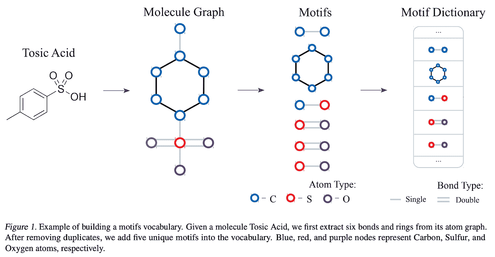**

**在 HM-GNN 建立主题词汇。来源:[于、高](https://proceedings.mlr.press/v162/yu22a/yu22a.pdf)**

**➡️最后，[strk 等人](https://proceedings.mlr.press/v162/stark22a/stark22a.pdf)的一项工作展示了使用 [**3D Infomax**](https://github.com/HannesStark/3DInfomax) 方法对 2D 分子图及其 3D 构象图进行预训练的好处。 **3D Infomax** 的想法是最大化 2D 和 3D 表示之间的互信息，使得在 2D 图上的推断时间，当没有给出 3D 结构时，模型仍然可以受益于 3D 结构的隐含知识。**

**为此，2D 分子用[主邻域聚集(PNA)](https://arxiv.org/abs/2004.05718) 网编码，3D 构象异构体用[球形信息传递(SMP)](https://openreview.net/forum?id=givsRXsOt9r) 网编码，我们取它们表示的余弦相似性，并通过对比损失使一个分子与其真实 3D 构象异构体的相似性最大化，并将其他样品视为阴性。有了预训练的 2D 和 3D 网络，我们可以在下游任务中微调 2D 网络的权重——在这种情况下是 QM9 属性预测——结果明确显示预训练有效。顺便说一句，如果你对预训练进一步感兴趣，可以看看 ICLR 2022 上发布的 [GraphMVP](https://openreview.net/forum?id=xQUe1pOKPam) 作为另一种 2D/3D 预训练方法。**

**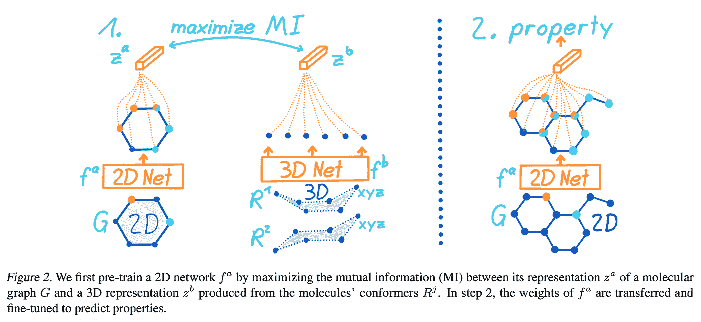**

**在 3D Informax 中，我们首先预训练 2D 和 3D 网络，并在推理时使用经过训练的 2D 网络。资料来源:[strk 等人](https://proceedings.mlr.press/v162/stark22a/stark22a.pdf)**

# **酷图应用**

**GNNs 极大地推动了物理模拟和分子动力学的发展。物理模拟的标准设置是一个粒子系统，其中节点特征是几个最近的速度，边缘特征是相对位移，任务是预测粒子在下一个时间步移动到哪里。**

**⚛️今年， [Rubanova，Sanchez-Gonzalez 等人](https://proceedings.mlr.press/v162/rubanova22a/rubanova22a.pdf)通过在 **C-GNS** **(基于约束的图网络模拟器)**中加入明确的标量约束，进一步改进了物理模拟。从概念上讲，MPNN 编码器的输出通过解算器进一步细化，该解算器最小化一些学习到的(或在推理时指定的)约束。求解器本身是一个可微分函数(在这种情况下是 5 次迭代梯度下降),因此我们也可以通过求解器进行反向投影。C-GNS 与[深层隐含层](http://implicit-layers-tutorial.org/)有着内在的联系，这些深层隐含层的可见性越来越强，包括[GNN 应用](https://fabianfuchsml.github.io/equilibriumaggregation/)。**

**物理模拟作品通常是花哨的模拟可视化的来源——查看带有视频演示的[网站](https://sites.google.com/view/constraint-based-simulator)！**

**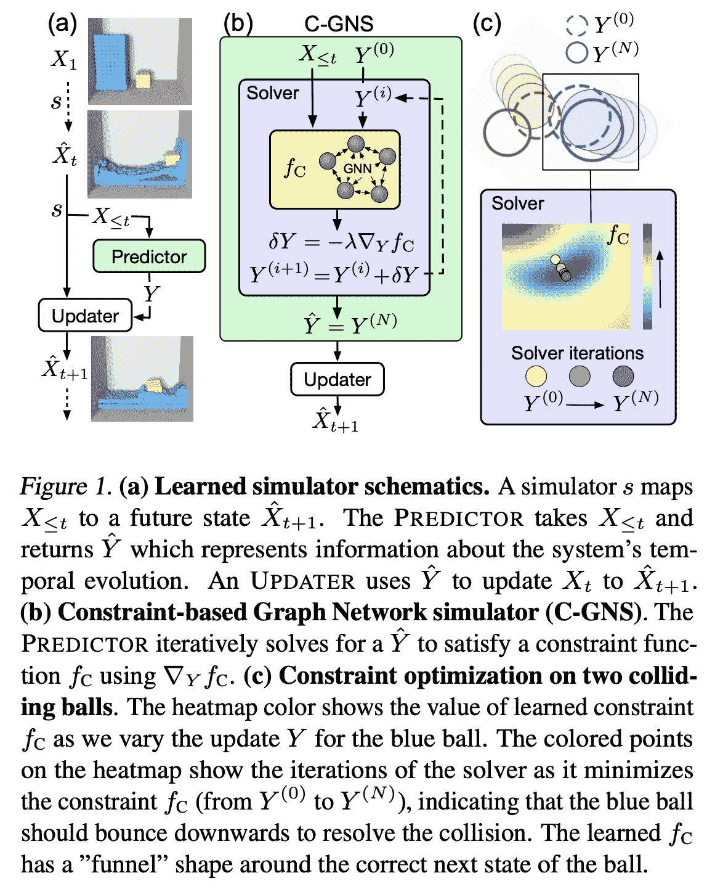**

**基于约束的图形网络模拟器。来源:[鲁巴诺瓦、桑切斯-冈萨雷斯等人](https://proceedings.mlr.press/v162/rubanova22a/rubanova22a.pdf)**

**您可能想看看其他一些很酷的应用程序:**

*   ****交通预测** : [兰、马等](https://proceedings.mlr.press/v162/lan22a/lan22a.pdf)创建了[**【DSTA-GNN】**](https://github.com/SYLan2019/DSTAGNN)(动态时空感知图神经网络)用于交通预测🚥在繁忙的加州道路的真实世界数据集上进行评估——去年，在谷歌和 DeepMind 对改进谷歌地图 ETA [进行大量工作后，用图表预测交通得到了推动，我们在 2021 年的结果](/graph-ml-in-2022-where-are-we-now-f7f8242599e0#2ddd)中报道了这些工作。**
*   ****神经网络剪枝** : [于等](https://proceedings.mlr.press/v162/yu22e/yu22e.pdf)设计[**【GNN-RL】**](https://github.com/yusx-swapp/GNN-RL-Model-Compression)在给定期望的 FLOPs 缩减率的情况下，迭代地剪枝深度神经网络的权重。为此，作者将神经网络的计算图视为块的分层图，并将其发送到分层 GNN(通过中间可学习池来粗粒度化 NN 架构)。编码的表示被发送到 RL 代理，该代理决定删除哪个块。**
*   ****排名** : [何等人](https://arxiv.org/pdf/2202.00211.pdf)处理一个有趣的任务——给定一个两两互动的矩阵，例如，在足球联赛中的球队之间，其中 *Aij > 0* 表示球队 *i* 比球队 *j* 得分更高，找出得分最高的节点(球队)的最终排名。换句话说，我们希望在看到所有比赛的配对结果后，预测谁是联赛的冠军。作者提出 [**GNNRank**](https://github.com/SherylHYX/GNNRank) 将成对结果表示为有向图，并应用有向 GNN 来获得潜在节点状态，并计算图拉普拉斯的[费德勒向量](https://en.wikipedia.org/wiki/Algebraic_connectivity)。然后，他们将该任务设计为一个约束优化问题，具有*近似*梯度步骤，因为我们无法通过费德勒向量的计算轻松地反向推进。**

**这就是 ICML 2022 的最终目标！😅**

**期待看到 NeurIPS 2022 论文以及全新 [**图学(LoG)**](https://logconference.org/) 会议的投稿！**