# 使用 Python 的图机器学习第 3 部分:无监督学习

> 原文：<https://towardsdatascience.com/graph-machine-learning-with-python-part-3-unsupervised-learning-aa2854fe0ff2>

## 大都会艺术博物馆中绘画的聚类和嵌入


大都会艺术博物馆的绘画网络。作者图片

在第 1 部分中，我介绍了我们如何从图中推理，为什么它们如此有用，用于分析和浓缩大量信息的度量标准，等等。

</graph-machine-learning-with-python-pt-1-basics-metrics-and-algorithms-cc40972de113>  

在第 2 部分中，我查看了 CryptoPunks 交易网络，介绍了更高级别的图形推理——随机世界和扩散模型。

</graph-machine-learning-with-python-pt-2-random-graphs-and-diffusion-models-of-cryptopunks-trading-99cd5170b5ea>  

然后我稍微离题讨论了我们如何使用网络和图表分析来看待 NBA 比赛。这一部分将使用那个故事中介绍的概念来进一步分析图形机器学习。

<https://animadurkar.medium.com/network-analysis-of-nba-playoffs-via-flow-dynamics-e5d5de70d4af>  

我强烈建议在深入研究这一部分之前先回顾一下前面的部分，因为它们为这一部分做了很好的准备，我在这里不深入研究的许多概念已经在每一部分中讨论和展示了。

在这个故事中，我将分析一个不同于我以前故事中看到的数据集。我会看一看被归类为绘画的大都会艺术博物馆的艺术品。这个数据集可以在 Github 上找到:[https://github.com/metmuseum/openaccess](https://github.com/metmuseum/openaccess)

来自他们的 GitHub 数据集:

> [大都会艺术博物馆](http://www.metmuseum.org/)展示了来自世界各地超过 5000 年的艺术，供每个人体验和欣赏。该博物馆位于纽约市的两个标志性建筑——大都会第五大道和大都会修道院。数百万人也在线参加了大都会博物馆的体验活动。
> 
> 自 1870 年成立以来，大都会博物馆一直渴望不仅仅是一个珍奇美丽物品的宝库。每一天，艺术都在博物馆的画廊里，通过展览和活动变得生动起来，揭示了新的思想和跨时间、跨文化的意想不到的联系。
> 
> 大都会艺术博物馆为其收藏的超过 470，000 件艺术品提供精选的数据集，用于无限制的商业和非商业用途。在法律允许的范围内，大都会艺术博物馆已经放弃使用 [Creative Commons Zero](https://creativecommons.org/publicdomain/zero/1.0/) 对该数据集的所有版权和相关或邻接权。该作品发表于:美利坚合众国。你也可以在这个资源库的[许可](https://github.com/metmuseum/openaccess/blob/master/LICENSE)文件中找到 CC Zero 契约的文本。这些精选的数据集现在可以在任何媒体上免费使用；它们还包括受版权保护的艺术品的识别数据。数据集支持对博物馆藏品的搜索、使用和交互。

# 目录

1.  简介和网络拓扑
2.  图的无监督嵌入
3.  节点表示学习(Node2Vec)
4.  边的表示学习(Edge2Vec)
5.  图的表示学习(Graph2Vec)
6.  摘要

# 简介和网络拓扑

在任何类型的数据项目之前，从一些探索性的数据分析开始总是好的。除此之外，通过可视化网络拓扑，我们可以很好地了解我们正在处理的数据类型。


作者图片

数据似乎有相当多的空值，而且 450，000 行数据在图形中编码和操作(在我的本地机器上)需要很长时间。为了简单一点，我只筛选出“画”这一类的作品。

```
Prints                                  69260
Prints|Ephemera                         30033
Photographs                             26821
Drawings                                25230
Books                                   14685
Ceramics                                13332
Paintings                               11038
Textiles-Woven                          10995
Photographs|Ephemera                    10940
Glass                                    8838
Negatives                                6460
Vases                                    5050
Textiles-Laces                           4966
Prints|Ornament & Architecture           4554
Sculpture                                4487
Ceramics-Porcelain                       4104
Textiles-Embroidered                     4093
Metalwork-Silver                         3969
Drawings|Ornament & Architecture         3910
Books|Prints|Ornament & Architecture     3583
Name: Classification, dtype: int64
```

为了处理未知数，如果一个字段丢失了，那么我们将使用“unknown_{column_name}”来估算 NaNs，这可能是非常有趣的。再做一点清理，我们就可以选择一些字段，这些字段为我们的图表填充了大量的值。


作者图片

```
Top 10 for Culture
Culture
unknown_Culture                 6591
China                           2059
Japan                           1173
India (Gujarat)                  200
American                         107
Tibet                             81
Nepal (Kathmandu Valley)          65
India (Bengal) or Bangladesh      63
Korea                             52
India                             32
dtype: int64

Top 10 for Period
Period
unknown_Period                                  8599
Edo period (1615–1868)                           701
Qing dynasty (1644–1911)                         466
Ming dynasty (1368–1644)                         212
Meiji period (1868–1912)                         151
Muromachi period (1392–1573)                      90
Pala period                                       89
Ming (1368–1644) or Qing dynasty (1644–1911)      86
Ming (1368–1644) or Qing (1644–1911) dynasty      78
Yuan dynasty (1271–1368)                          54
dtype: int64

Top 10 for Artist Display Name
Artist Display Name
unknown_Artist Display Name       1104
Unidentified Artist                373
Xie Zhiliu                         344
John Singer Sargent                115
Fu Baoshi                          101
Marsden Hartley                     87
Shibata Zeshin                      74
Kerry James Marshall                72
Bhadrabahu                          71
Élisabeth Louise Vigée Le Brun      69
dtype: int64

Top 10 for Medium
Medium
Oil on canvas                                3592
Watercolor on ivory                           632
Oil on wood                                   576
Hanging scroll; ink and color on paper        434
Hanging scroll; ink and color on silk         374
Hanging scroll; ink on paper                  249
Ink, opaque watercolor, and gold on paper     226
Tempera on wood, gold ground                  155
Album leaf; ink and color on silk             136
Ink and opaque watercolor on paper            129
dtype: int64

Top 10 for Object Name
Object Name
Painting                                5808
Hanging scroll                          1362
Painting, miniature                      693
unknown_Object Name                      641
Folio                                    462
Handscroll                               297
Drawing                                  283
Album leaf                               278
Folding fan mounted as an album leaf     172
Album                                    104
dtype: int64
```

正如所料，我们可以看到有很多值是未知的或者很难准确计算出来的。此外，我们还看到了奇怪的分类碎片(例如“明朝(1368–1644)”、“清朝(1644–1911)”、“明朝(1368–1644)或清朝(1644–1911)”、明朝(1368–1644)或清朝(1644–1911)朝代”)。没有领域专家，可能很难知道为什么或如何发生这种情况，以及值是否应该被组合、删除、重新标记或保持不变，所以现在我将把它们留在这里。这些也只是在这几个类别的前 10 个值中看到的，所以人们只能想象这些类别在更低的级别上变得多么支离破碎，更难辨别。

在我们的图表中，我们需要转换这些列来创建 From 和 to 格式。有几种不同的方法可以做到这一点，数据的上下文可以决定处理这一点的最佳途径。我们将创建一个类似如下的无向图:


作者图片

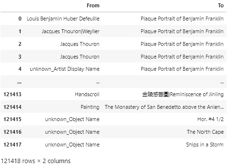

作者图片

虽然这仍然是一个很大的图，但是让我们来看看拓扑是什么。

```
Graph Summary:
Number of nodes : 12688
Number of edges : 66693
Maximum degree : 9092
Minimum degree : 2
Average degree : 10.512767969735183
Median degree : 6.0

Graph Connectivity
Connected Components : 1

Graph Distance
Average Distance : 2.500517379796479
Diameter : 6

Graph Clustering
Transitivity : 0.0015246604242919772
Average Clustering Coefficient : 0.5194453022433385
```

相当低的传递性是有意义的，因为这不是一个社会图，没有理由相信三元闭包会在这里成立。除此之外，只有 1 个连通分量是一个有趣的度量，因为我们不应该有很多只连通而没有其他的子图。节点和边的数量表明有大量的小众类别、艺术家、风格等。在图表中创造了进一步的分割。

如果我能接触到领域专家，我可能会通过一个广泛的练习来清理类别，因为它们中的一些可能会有潜在的重叠，但现在，我们将继续。

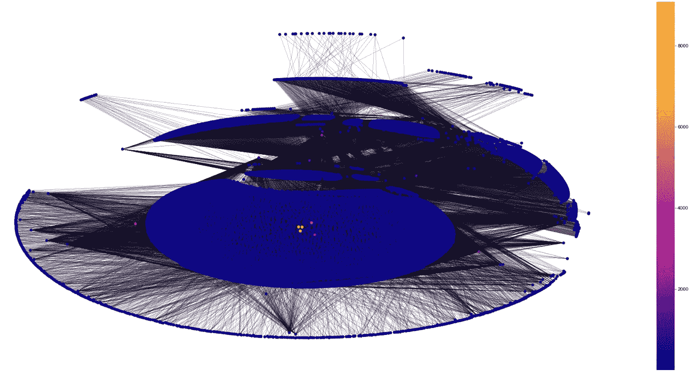

作者图片

该图的节点颜色由度中心性编码，边颜色由 Jaccard 相似性编码(我将在本系列的监督学习部分讨论链接预测时讨论链接度量)。有趣的是，在这个图中有一些节点完全支配着其他节点。当我们按流中心性排序时(中间中心性的一种变体，用于度量进入过程之间的实体)，我们发现许多“未知”或 NaN 字段占主导地位。


作者图片

对中心性度量的进一步分析也证实了有少数节点强烈地扭曲了分布。一种解决方案是简单地删除具有任何这些 nan 的行，但是某些数据点丢失的事实对于在低维空间中嵌入该节点可能是非常重要的信息。

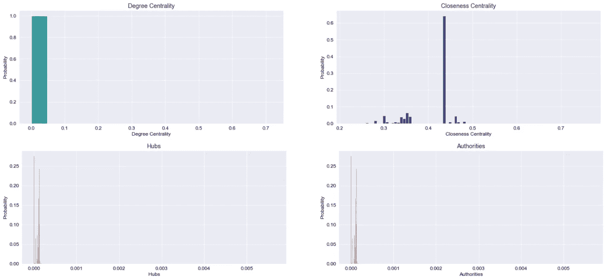

作者图片

# 图的无监督嵌入

图的无监督机器学习主要可以分为以下几类:矩阵分解、跳跃图、自动编码器和图神经网络。图形机器学习(Claudio Stamile，Aldo Marzullo，Enrico Deusebio)有一个奇妙的图像，概述了这些和每个下面的算法:


本书中描述的不同无监督嵌入算法的层次结构。[图形机器学习(Claudio Stamile，Aldo Marzullo，Enrico Deusebio)，O'Reilly](https://learning.oreilly.com/library/view/graph-machine-learning/9781800204492/B16069_03_Final_JM_ePub.xhtml#_idParaDest-45)

尽管我将简要介绍嵌入及其工作原理，但我不会在本文中介绍自动编码器和图形神经网络。自动编码器和 gnn 应该有自己的故事(*提示提示*)，所以我将只关注我发现性能最好的主要无监督算法——跳格算法。

与大多数结构化数据不同，图是在非欧几里得空间中定义的。具有讽刺意味的是，它们没有空间成分；一个节点的相关性仅在于它是否与其他节点相连，而与该节点在图中的位置或方向无关。由于这个原因，我们经常把一个图简化成一个结构化的数据问题来简化它。我们通过创建图的邻接矩阵并学习矩阵中成对关系的嵌入来做到这一点。这些学习到的表示允许我们在节点、边和图形之间的潜在关系中发现隐藏的和复杂的新模式。

邻接矩阵看起来像这样:

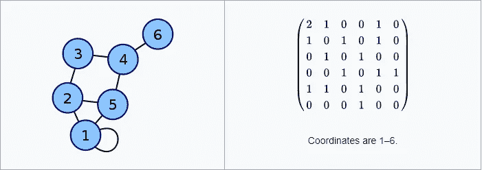

无向标号图及其邻接矩阵。[维基百科](https://en.wikipedia.org/wiki/Adjacency_matrix)

每行和每列代表每个节点，数字代表节点之间的链接数量。该邻接矩阵可以被学习为用于降维、聚类和进一步的下游预测任务的嵌入。这里的目标是对节点进行编码，使得嵌入空间中的相似性近似于图中的相似性。

每种矩阵分解方法都使用这种分解技术来创建节点和边缘级数据的嵌入。根据谷歌的说法，“嵌入是一个相对低维的空间，你可以将高维向量转换到其中。嵌入使得在大量输入上进行机器学习变得更加容易，比如表示单词的稀疏向量。理想情况下，嵌入通过在嵌入空间中将语义相似的输入放在一起来捕获输入的一些语义。嵌入可以被学习并跨模型重用。”

在浅层方法中，通过具有以下步骤的表示学习来学习节点嵌入:

1.  编码器将节点映射到嵌入
2.  定义节点相似度函数
3.  解码器将嵌入映射到相似性得分
4.  优化编码器的参数，使得解码的相似性尽可能接近地匹配基础网络相似性

Skip-gram 模型使用各种随机行走来优化相似性度量的嵌入。这些模型不使用标签或显式特征来估计节点的一组坐标，以便捕捉网络结构的某些方面。对于节点通过边连接的图，随机漫步有两个明显的好处:

1.  表现性:一种灵活的获取局部和全局节点邻域信息的方法。这源于这样的想法:如果从节点 u 开始的随机行走以高概率行进到节点 v，那么它们是相似的。
2.  效率:我们不想考虑网络中的每一条路径，因为这将很快变得难以计算。这种方法只考虑随机漫步中同时出现的配对。

生成随机行走路径后，我们现在有了序列数据，可以像处理文本一样生成嵌入。这就是跳格模型，特别是 Word2Vec，出现的原因。Skip-gram 模型通常被称为 Word2Vector，因为它是一个简单的神经网络，具有一个隐藏层叛逆者来预测当输入单词存在时给定单词存在的概率。它基于输入语料库建立训练数据，然后被训练来预测单词成为给定目标的上下文单词的概率。下图显示了第一步训练是如何进行的。

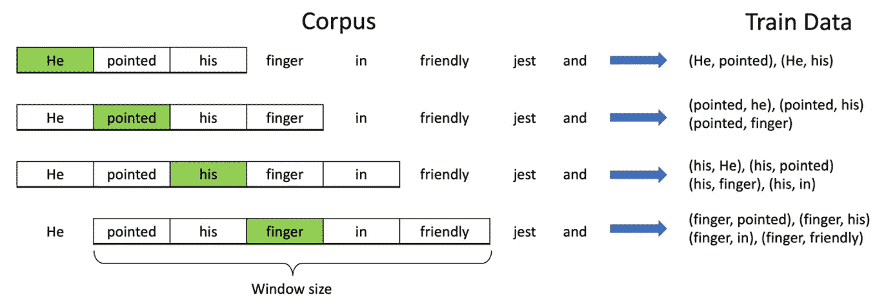

从给定语料库生成训练数据的示例。在填充的框中，目标单词。在虚线框中，由长度为 2 的窗口大小标识的上下文单词。[图形机器学习(克劳迪奥·斯塔米尔，奥尔多·马尔祖洛，恩里科·德乌塞比奥)，奥莱利](https://learning.oreilly.com/library/view/graph-machine-learning/9781800204492/B16069_03_Final_JM_ePub.xhtml#_idParaDest-45)

然后，简单的神经网络根据该数据进行训练，以基于每个单词在训练语料库中的位置来生成每个单词的概率。这将输出一个嵌入，在一个低得多的维度空间中表示该单词。


跳跃图模型的神经网络结构。隐藏层中 d 个神经元的数目代表了嵌入空间的最终大小。[图形机器学习(Claudio Stamile，Aldo Marzullo，Enrico Deusebio)，O'Reilly](https://learning.oreilly.com/library/view/graph-machine-learning/9781800204492/B16069_03_Final_JM_ePub.xhtml#_idParaDest-45)

对于图中的 skip-gram 模型，此图展示了随机游走如何连接到 skip-gram，然后生成嵌入的示例:


DeepWalk 算法用来生成给定图的节点嵌入的所有步骤。[图形机器学习(Claudio Stamile，Aldo Marzullo，Enrico Deusebio)，O'Reilly](https://learning.oreilly.com/library/view/graph-machine-learning/9781800204492/B16069_03_Final_JM_ePub.xhtml#_idParaDest-45)

深度遍历跳过程序算法是这样的:

1.  从图上的每个节点开始，进行短距离固定长度(不一定都是相同长度)的随机行走。
2.  对于每个节点 u，收集在从 u 开始的随机行走中访问的节点的多重集，并在其上训练 skip-gram 模型。当给定图作为跳格模型的输入时，图可以被视为输入文本语料库，而图的单个节点可以被视为语料库的单词。随机漫步可以被看作是一个单词序列(一个句子)。在这一步中使用了跳格模型的参数(窗口大小， *w* ，以及嵌入大小， *d* )。
3.  使用随机梯度下降优化嵌入。给定节点 *u* ，我们想要预测它的邻居 *N(u)。【Jure Lescovec 博士的图形机器学习课程中生动地描述了这里正在优化的损失函数:*

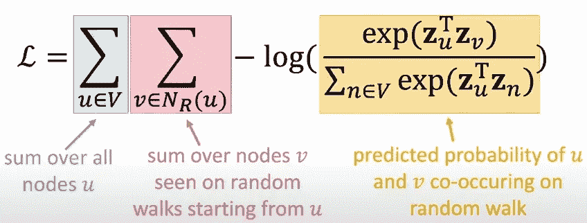

Jure Lescovec，斯坦福， [CS224W:带图的机器学习](http://web.stanford.edu/class/cs224w/)

该模型的常见参数有:

*   walk_number:为每个节点生成的随机行走的次数
*   walk_length:生成的随机漫步的长度
*   window_size:跳格模型的窗口大小参数

虽然我相信这足够让这个故事继续下去了，但这里还有很多内容要讲。矩阵分解方法、负采样(以有效地近似损失函数最优化)等。仅举几个例子。如果您想深入了解，我强烈推荐这些资源:

[图机器学习第三章:无监督学习](https://learning.oreilly.com/library/view/graph-machine-learning/9781800204492/B16069_03_Final_JM_ePub.xhtml#_idParaDest-49)

[斯坦福 CS224W:带图的机器学习](https://www.youtube.com/playlist?list=PLoROMvodv4rPLKxIpqhjhPgdQy7imNkDn)

# 节点表示学习(Node2Vec)

Node2Vec 是深度遍历模型的一种变体，在随机遍历的生成方式上有显著的不同。深度遍历在保存节点的局部邻域信息方面存在局限性，因此 Node2Vec 采用了宽度优先搜索(BFS)和深度优先搜索(DFS)的灵活而强大的组合来进行图探索。这两种算法的组合通过以下方式进行调整:

1.  *p* :随机游走回到前一个节点的概率
2.  *q* :随机漫步可以通过图中以前看不见的部分的概率。BFS 与 DFS 的比率。

该模型引入了有偏行走，可以在网络的局部微观(BFS)和全局宏观(DFS)视图之间进行权衡。

Node2Vec 算法是这样的:

1.  计算随机行走概率
2.  模拟从每个节点 *u* 开始的 *r* 长度 *l* 的随机行走
3.  使用随机梯度下降优化模型的目标

该模型的常见参数有:

*   num_walks:为每个节点生成的随机行走的次数
*   walk_length:生成的随机漫步的长度
*   p，q:随机游走生成算法的参数 *p* 和 *q*

让我们用 2 维来绘制节点嵌入，并找到与文森特·梵高相似的艺术家，他是个人的最爱。

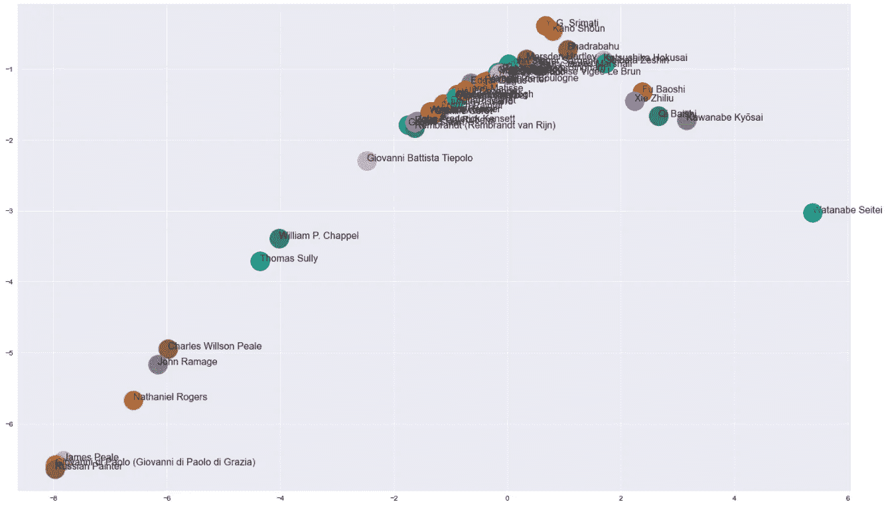

作者图片

```
#Artists similar to Vincent van Gogh
Adrien Dauzats
Anne Louis Girodet-Trioson
Eugène Isabey
```

上面的代码仅假设二维空间足以捕捉低维空间中的每个节点。通常，这在大型复杂的图表中是不够的，但是随着维度的增加，它可能很难可视化。另一点要注意的是，当模型评估相似性时，它仅基于节点中的信息(时期、文化、介质等)。)，所以艺术家相似性将仅与图中的节点邻近度/相似性相关。这与使用计算机视觉来分析艺术品的像素值以找到相似的图像截然不同。

尽管梵高是一位荷兰艺术家，但众所周知，他在法国找到了自己的标志性风格，并最终在法国去世。这三位艺术家都是法国人，但他们的主要风格是浪漫主义，与梵高的后印象派风格形成鲜明对比。

让我们添加更多的维度来让模型学习我们的图表的更好的表示。

```
#Artists similar to Vincent van Gogh
Paul Cézanne
Goya (Francisco de Goya y Lucientes)
Georges Rouault
Alfred Sisley
Georges Seurat
Claude Monet
Gustave Courbet
Edward McKnight Kauffer
```

这样其实好多了！这些艺术家在时代、文化和风格上更相似。请注意，我们还在图表中添加了媒介、部门和对象类型，因此可能这些艺术家中的一些人可能在该时期有所不同，但使用了与梵高相同的材料，或者出现在博物馆的同一部门。

以下是文森特·梵高和保罗·塞尚的作品供参考:

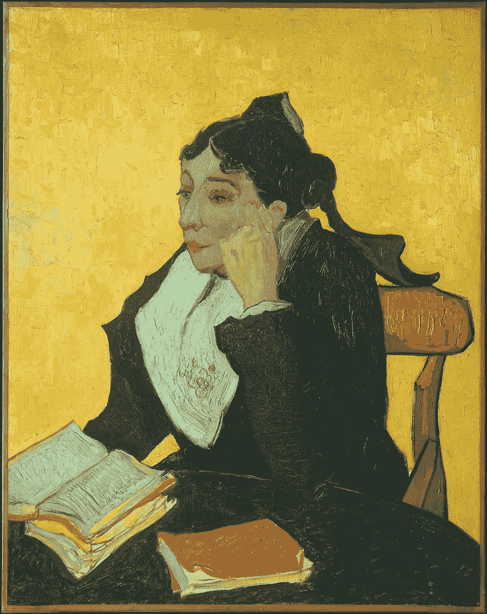

L'Arlésienne:约瑟夫-米歇尔·吉诺夫人(玛丽·朱利安，1848–1911)，文森特·梵高。[大都会艺术博物馆(公共领域)](https://www.metmuseum.org/art/collection/search/435868)

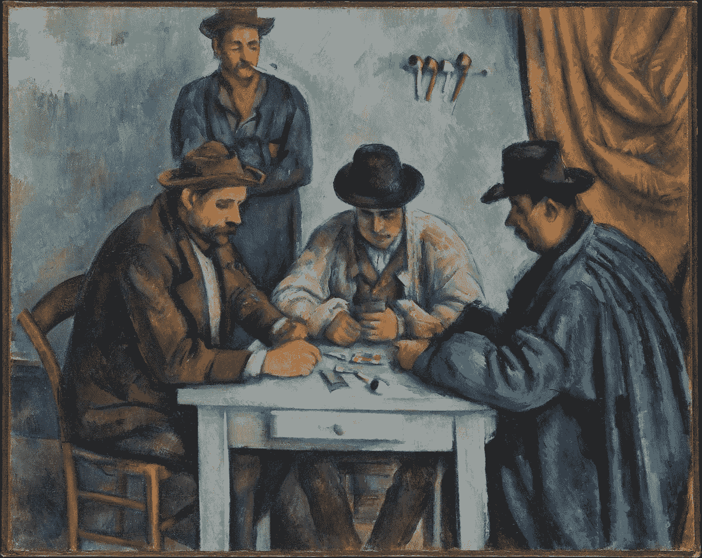

打牌的人，1890-1900，保罗·塞尚。[大都会艺术博物馆(公共领域)](https://www.metmuseum.org/art/collection/search/435868)

# 边的表示学习(Edge2Vec)

Edge2Vec 是 Node2Vec 相对简单的扩展，它使用两个相邻节点的节点嵌入来执行一些基本的数学运算，以便提取连接它们的边的嵌入。以下是图形机器学习(Claudio Stamile，Aldo Marzullo，Enrico Deusebio)中阐述的主要问题:


Node2Vec 库中的边嵌入操作符及其方程和类名。[图形机器学习(Claudio Stamile，Aldo Marzullo，Enrico Deusebio)，O'Reilly](https://learning.oreilly.com/library/view/graph-machine-learning/9781800204492/B16069_03_Final_JM_ePub.xhtml#_idParaDest-45)

根据数据的性质以及数据之间的关系，不同的嵌入会有不同的价值。一种有效的评估方法是尝试每一种方法，看看哪一种方法具有最合理的边缘分离。

虽然我们不能一下子看到所有的维度，但你可以通过下面的方法看到梵高和他的相似作品与艺术家之间边缘嵌入的前两个维度。

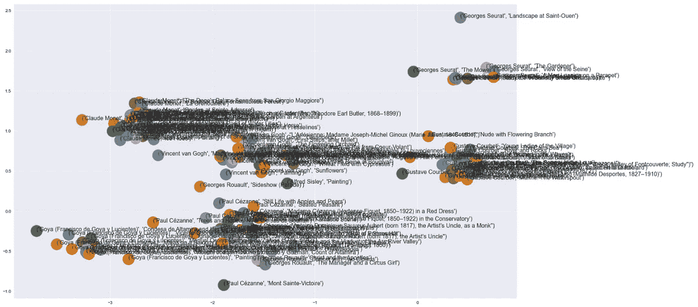

作者图片

# 图的表示学习(Graph2Vec)

这是节点和边表示学习的最高概括。在自然语言处理中，这种模型被称为 Doc2Vec，因为它是多个文档的嵌入，而不是单词或句子。当涉及到图时，我们可以将其划分为子图，然后训练模型来学习这些子图中每一个的表示作为嵌入。

Doc2Vec 模型的功能与 Node2Vec 相关，如下图所示:

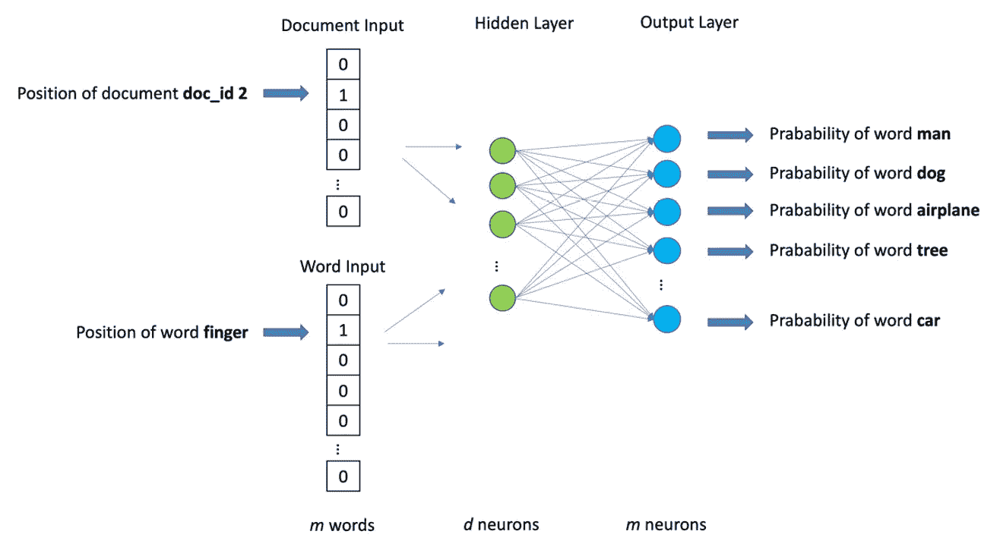

Doc2Vec 跳跃图模型的简化图形表示。隐藏层中 d 个神经元的数目代表了嵌入空间的最终大小。[图形机器学习(Claudio Stamile，Aldo Marzullo，Enrico Deusebio)，O'Reilly](https://learning.oreilly.com/library/view/graph-machine-learning/9781800204492/B16069_03_Final_JM_ePub.xhtml#_idParaDest-45)

这个算法是这样的:

1.  围绕每个节点生成一组有根子图。
2.  使用生成的子图训练 Doc2Vec 跳转图。
3.  使用包含在经训练的 Doc2Vec 模型的隐藏层中的信息，以便提取每个节点的嵌入。通过随机梯度下降进行优化。

生成子图的方式可以变化，并显著改变模型学习精确表示的能力。基本上，有三种不同的方法可以创建子图:

方法 1:嵌入节点并聚合它们(最常见的是求和或平均)

方法 2:创建一个节点(超级节点),它代表并跨越每个子图，然后嵌入该节点

方法 3:匿名行走嵌入。捕获与随机漫步中第一次访问节点的索引相对应的状态。被认为是匿名的，因为这种方法不知道被访问节点的身份。

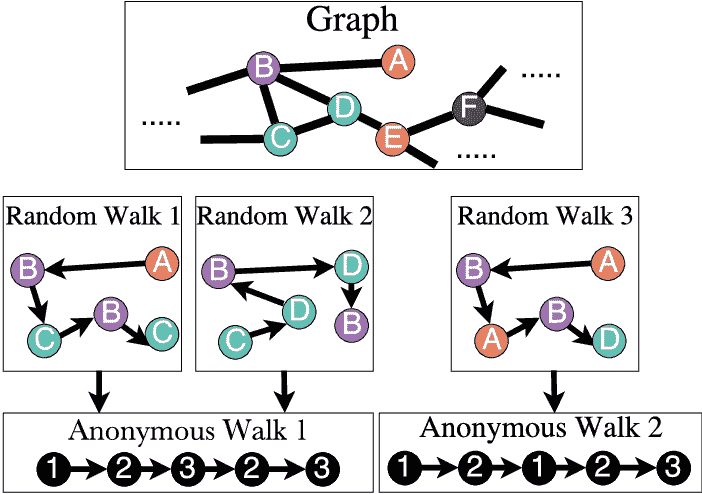

Jure Lescovec，斯坦福， [CS224W:带图的机器学习](http://web.stanford.edu/class/cs224w/)

使用方法 3，随着匿名遍历的数量呈指数级增长，您很容易遇到所需计算资源的问题。由于这种计算复杂性，我们可以:

*   对匿名遍历进行采样，然后将图形表示为每次匿名遍历发生次数的一部分
*   嵌入匿名遍历，连接它们的嵌入得到一个图嵌入。本质上，嵌入行走，以便可以预测下一次行走。

整个目标是将图形表示为这些行走的概率分布。

对于我们的例子，我们可以创建仅包含 Vincent van Gogh 和与他相似的艺术家的行的子图。我们可以使用嵌入以一种更加简洁和有效的方式来表示他们所有的信息。请注意，我们需要将节点标签转换为整数，以使模型更加合适，出于示例的原因，我们将只做二维处理。

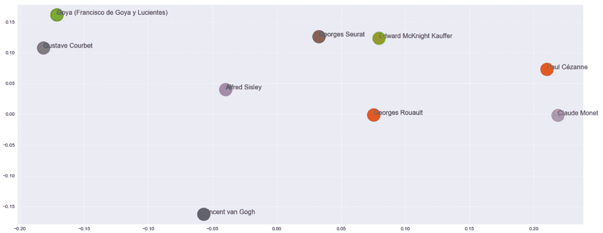

作者图片

# 摘要

这个故事旨在说明即使在相对不干净、不完整和最少的数据上，表征学习的力量。在没有目标标签或基础真值的情况下，我们可以使用图表来真正有效地找到潜在的结构相似性。显然，像任何机器学习项目一样，在这个过程中，我们做了很多假设和警告，但图表给了我们一个额外的维度来分析我们的数据。

我们的模型可以[潜在地]变得更好的一些重要方式:

*   将数据帧中的行表示为不同的节点和边
*   在领域专家的监督下清理无关和不完整的值
*   添加更多维度，将艺术家与其作品和其他艺术家联系起来

这是一篇很长的文章，但是谢谢你坚持下来！在本系列的下一部分，我们将讨论监督学习。跟着一起玩吧！

## 参考

[1] Claudio Stamile，Aldo Marzullo，Enrico Deusebio，[图机器学习](https://learning.oreilly.com/library/view/graph-machine-learning/9781800204492/)

[2] Jure Leskovec，斯坦福， [CS224W:带图的机器学习](http://web.stanford.edu/class/cs224w/)

[3]伊斯利，大卫和克莱因伯格，乔恩。2010.[网络、人群和市场:关于高度互联世界的推理](http://umich.summon.serialssolutions.com/2.0.0/link/0/eLvHCXMwpV1LS8QwEB7UPagI6qr4Wi0eRMGuTTZN3JOsukVEBFH0WNImBdnHwdbXv3fy2KIe9OAlJe0kJUyYTCbfNwEgP-xBZvJIP1Uhab-M1BALH0TDud1lJ2FskxhcXNNeEl8lnb6HFhpijBMtB0_DoXFGreGua4U-HuHmue3w_6foauoKFdmJueDT0KAcV74ZaPR6t493ddTFoEDcXU-GtEosttKn4ZnUyTzMy3KAJgbNT1V-8zxn7d9LNJBfFqFksQaLOOiJzfE0GeWP7I7_GtYSNLShQCzDlB43oeWpDcF-4LlLpkngjUITNhzDd_KiDA58KuvDJmzWfBhs7eVcYpKPFWjdOAh6eRTgavCm8CnHKhhZHna5Cg9J__78MvS3NYSSm7O7kEmR64J19AlaBa25oLnQuuBUqIJmkQ2YUFV0GWdYUqIzGSkRE8WE5BodzTVYkAbWP64s_U-tQ8DziEn04TImFdOMyjwmWSzzruKcERVtwN4XXaWvQ3vEXKZWoeY8muB-6hchgg4w7TDBsKfdiZ5T-92DY9P-2XmMe7TISNTqT20PlL2LNBu481jUz-afElsw5-AHJoazDTPV84tuQcPOiB0_WXdgOrmkn1d_-7o)

[4] [大都会艺术博物馆开放存取](https://www.metmuseum.org/about-the-met/policies-and-documents/open-access)

## 您可以在这里找到本系列的第 4 部分:

</graph-machine-learning-with-python-part-4-supervised-semi-supervised-learning-d66878161b79> 