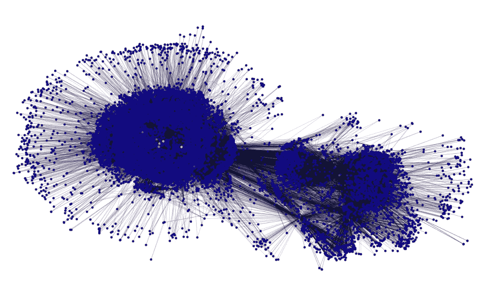
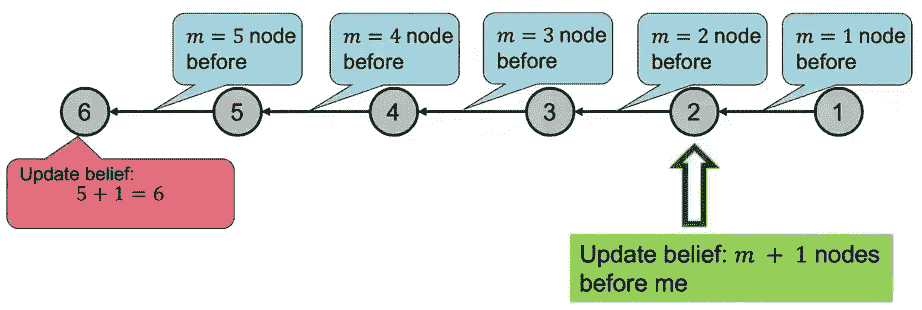
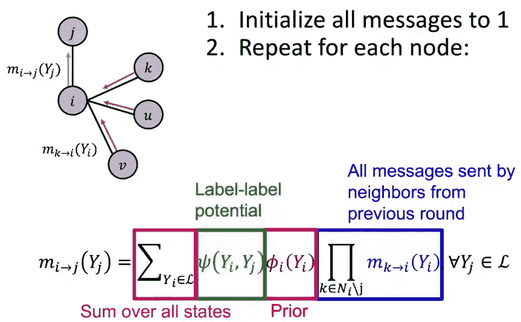

# 基于 Python 的图机器学习第 4 部分:监督和半监督学习

> 原文：<https://towardsdatascience.com/graph-machine-learning-with-python-part-4-supervised-semi-supervised-learning-d66878161b79>

## 大都会艺术博物馆绘画的分类和预测



大都会艺术博物馆的绘画网络。作者图片

# 介绍

这个故事将探索我们如何通过监督和半监督学习，使用标签从图形中推理和建模。我将使用 MET Art Collections 数据集，它将建立在我以前关于度量、无监督学习等部分的基础上。在这篇文章之前，请务必查看之前的文章，以便跟上一些片段，因为我不会在这篇文章中再次涵盖所有概念:

</graph-machine-learning-with-python-part-3-unsupervised-learning-aa2854fe0ff2>  

# 目录

1.  基于特征的方法
2.  嵌入方法
3.  集体分类
4.  摘要

# 基于特征的方法

进行监督学习的最简单方法是使用图测量作为新数据集中的要素，或者作为现有数据集中的附加要素。我已经看到这种方法对建模任务产生了积极的结果，但是它可能真的依赖于 1。你如何以图表的形式建模(输入、输出、边等是什么？)和 2。要使用哪些指标。

根据预测任务，我们可以计算节点级、边级和图级指标。这些度量可以作为关于实体本身及其与其他实体的关系的丰富信息。这可以看作是一个经典的监督 ML 任务，但这里的重点是特征选择。根据您的预测任务，您可以选择不同的图表度量来预测标签。

在我们的数据集中，我们将选择的标签是“突出显示”字段。标签的选择可以根据个人的目标而改变，但对于这个项目，我的假设是，有许多艺术作品值得突出显示(在公共领域展示)，但大部分都被隐藏了。让我们看看是否可以使用图表来创建模型，以帮助预测哪些其他艺术品应该突出显示。

```
0 10733 
1 305
Name: Highlight, dtype: int64
```

我们在这里看到了很大的阶级不平衡，这是有道理的，因为只有一些艺术品能够得到强调，通常博物馆在他们的档案中包含大量的收藏。


dataframe 仅包含各种图表指标，我们将使用这些指标作为预测“突出显示”的特征。

让我们对数据集进行随机过采样，然后预测我们的目标变量。

```
Accuracy 0.7889492753623188 
Precision 0.08961303462321792 
Recall 0.6984126984126984 
F1-score 0.15884476534296027
```

不是最好的结果，但我们只是使用了基本模型，所以我们可能会通过广泛的调整或功能工程使其性能更好，但这超出了本故事的范围。需要注意的一点是，我们希望针对我们的问题进行召回优化。在这种情况下，获得“相关的”结果比“精确的”结果更好，因此看到相对较高的召回分数是件好事(记住，我们只是使用了一些图表指标来做到这一点！).

最后，这是一个节点级别的预测任务，其中有问题的节点是一个艺术品。同样的概念也可以很容易地用于边缘或图形级(具有传统功能)任务，使其高度通用。

# 嵌入方法

基于浅层嵌入的监督学习方法与非监督学习的不同之处在于，它们试图找到节点、边或图形级预测任务的最佳解决方案。这方面的两个主要算法是:标签传播和标签扩散。

这两种方法属于半监督学习领域，因为图中只有几个标记节点。这里的主要假设是网络中存在同向性，这意味着相似的节点比不相似的节点更有可能相互连接。

图表至少增加了一个维度的建模和选择，使得您的假设对于验证非常重要。例如，在第 3 部分中，我特别选择了用一种特殊的方式来设计这个网络，但是它也可以很容易地用不同的方式来制作。我选择的方法是为艺术品的每个属性创建节点，而不是将其嵌入到艺术品节点中。


作者图片

这可能仍然适用于我们的用例(即相似时期或文化中的艺术作品自然会比其他作品更紧密地联系在一起)，但是这些是你应该和建模假设一起重新评估的选择类型。

## 标签传播

该算法将节点的标签传播到它的邻居(节点),这些邻居具有从该节点到达的最高概率。

sklearn 已经为我们实现了这个算法，使用两个主要的内核:kNN 和 rbf。我们可以控制 gamma 和 n_neighbors 等参数，以控制模型在标记节点周围扫描的“距离”。

对于我们的用例，从技术上来说，我们只有一个标签(1 代表“突出显示”)，我们还有大量连接到节点的艺术品，如第 3 部分中看到的“未知时期”或“未知文化”(这些节点具有高中心性度量)。这基本上意味着我们的大多数模型配置将只输出“Highlight ”,以传播给几乎所有的节点，表明所有的艺术品都应该被突出显示。虽然这没有什么错，但是从模型的角度来看，它并没有给我们提供太多的价值——我们可以直接说出来，然后就完成了。

```
Highlight     Is Public Domain 
No Highlight  True                6567               
              False               4166 
Highlight     True                 235               
              False                 70
dtype: int64
```

我们首先需要做的是创建一个启发，允许我们控制什么是真正被突出显示的“合格的”。在我们的数据集中，只有大约 300 件艺术品被突出显示，其中超过 75%的作品属于公共领域。我们可以给没有突出显示和不在公共域中的节点加 0，表示它们“没有资格”被突出显示。在给定数据和领域的情况下，这可以很容易地更改为任何有意义的启发式规则。

```
-1    6567  
0     4166  
1     305 
Name: Highlight, dtype: int64
```

请注意，该模型需要未标记的节点具有-1 值。

您可以使用 predict_proba()方法提取每个类的模型概率，然后在模型拟合后使用 transduction_ after 将标签归属于行。

```
array([[4.46560147e-17, 1.00000000e+00],        
      [4.46560147e-17, 1.00000000e+00],        
      [4.89043690e-17, 1.00000000e+00],        
      ...,        
      [1.00000000e+00, 4.60058884e-51],        
      [1.00000000e+00, 1.50981524e-52],        
      [1.00000000e+00, 1.07327710e-50]])
```

```
0    6300 
1    4738 
dtype: int64
```

我们现在有超过 4000 件艺术品可以考虑在博物馆中重点展示！还应该进行模型评估，可以调整一些参数(gamma 或 n_neighbors)以确保“良好”的分割，但这是一项相当主观的任务，因此由领域专家进行基于任务的评估可能是最佳的评估策略。

从数学上讲，该算法使用一个转移矩阵乘以某个时间步长上每个节点的类值矩阵。如此迭代多次，直至收敛。

让我们来看看一些符号以及矩阵是如何组合在一起的。[Stamile 等人的图形机器学习。艾尔。](https://learning.oreilly.com/library/view/graph-machine-learning/9781800204492/)如果你想了解更多细节，我会解释得很清楚。


图的邻接矩阵


图的对角度矩阵


表示每个节点遍历到另一个节点的概率的转移矩阵


时间 t 时班级分配的概率矩阵

## 标签扩散

标签传播算法解决了标签传播算法的一个关键功能/限制:节点到类的初始标签。标签传播假设最初在数据集中提供的标签是真实的，并且它们不能在训练期间改变。标签扩散放松了这种约束，并允许在训练期间重新标记最初被标记的节点。

为什么？如果在最初标记的节点中存在一些误差或偏差，这可能是非常有益的；初始标记时出现的任何错误都会传播开来，仅通过指标很难发现这一点。

```
array([[1.00000000e+00, 2.14018170e-10],        
      [1.00000000e+00, 2.05692171e-10],        
      [1.00000000e+00, 2.13458111e-10],        
      ...,        
      [1.00000000e+00, 4.27035952e-18],        
      [1.00000000e+00, 3.85172946e-28],        
      [1.00000000e+00, 1.33374342e-32]])
```

```
0    6127 
1    4911 
dtype: int64
```

尽管表面上看起来非常相似，但由于概率的不同，这可能会产生非常不同的结果。标签扩散算法不是计算转移矩阵，而是计算归一化的图拉普拉斯矩阵，该矩阵类似于转移矩阵，可以被视为图的节点和边的低维表示。


归一化图拉普拉斯矩阵


使用 alpha 的概率矩阵，alpha 是一个正则化参数，用于调整原始解对每次迭代的影响程度

# 集体分类

图的强大之处在于使用了同向性、影响力等关键概念，通过连接提取模式。同质性指的是节点与它们相似的其他节点相关联的趋势，而影响力指的是社会联系影响个人/节点的个体特征的能力。这两种影响都可以在图表中捕捉到，我们可以利用这些作为假设来执行真正强大的监督和半监督 ML 任务。

我在上面讨论了一些更常见的技术，但是我们可以更深入地研究这个广阔的世界，并揭示网络中未知标签分类背后的一些理论。这一部分将紧密跟随 Jure Leskovec 博士在斯坦福在线上关于[机器学习的课程。让我们澄清我们的方法将依赖的前提:](https://www.youtube.com/playlist?list=PLoROMvodv4rPLKxIpqhjhPgdQy7imNkDn)

1.  相似的节点通常靠得很近或者直接相连
2.  节点的标签可能取决于:它的特征、它附近的邻近节点的标签以及它附近的邻近节点的特征。

集体分类是建立在马尔可夫假设上的概率框架:一个节点的标签依赖于其邻居的标签(一阶马尔可夫链)。它包括 3 个步骤:

局部分类器:分配初始标签。

*   基于节点属性/特征预测标签的标准分类任务。不使用网络信息。

关系分类器:捕获节点之间的相关性。

*   使用网络信息根据其邻居的标签和/或属性对节点的标签进行分类。

集体推理:通过网络传播相关性。

*   迭代地将关系分类器应用于每个节点，并迭代直到相邻标签之间的不一致性最小化。

集体分类有三种常用模型:

**概率关系分类器**

*   节点的类概率是其邻居的类概率的加权平均值。
*   带标签的节点用真实标签初始化。未标记的节点用 0.5 初始化。
*   通过将邻近的一阶节点标签(地面真实标签和 0.5 用于未标记的节点)相加并除以总的一阶节点来标记节点。
*   所有节点以随机顺序更新，直到收敛或达到最大迭代次数。

局限性:

*   不能保证收敛
*   模型不使用节点特征信息

**迭代分类**

*   主要思想是根据节点的属性以及邻居集的标签对节点进行分类。
*   基本上训练了两个分类器。一种是基于节点特征向量预测节点标签。第二种方法基于节点特征向量和节点邻居标签的汇总来预测节点标签。
*   相邻标签的汇总是一个向量，可以表示为:每个标签的数量直方图、最常见的标签或相邻集中不同标签的数量。
*   在阶段 1 中，在训练集上建立两个分类器，在阶段 2 中，基于分类器 1 在测试集上设置标签，计算摘要向量，并且用分类器 2 预测标签。对每个节点重复这一过程。

局限性:

*   这种方法也不能保证收敛。

**循环信念传播**

*   动态编程方法，其中节点相互“传递消息”,反复回答概率查询。达成共识才算信念。
*   每个节点只能与其邻居交互(传递消息),该消息被每个节点从其邻居处听到，被更新，然后被转发。把这个想象成游戏电话。



Jure Lescovec，斯坦福， [CS224W:带图的机器学习](http://web.stanford.edu/class/cs224w/)

*   该算法需要对节点进行排序，并且边缘方向根据节点集合的顺序。这定义了消息是如何传递的。
*   利用标签-标签势矩阵，该矩阵是节点与其邻居之间的依赖关系。它与一个节点属于一个类的概率成正比，假设它在同一个类中有一个邻居。
*   利用与节点成为一个类的概率成比例的先验信念。
*   利用“消息”,它是一个节点对下一个节点是一个类的估计。
*   所有的消息都被初始化为 1，然后对于每个节点，我们想要计算什么消息将被一起发送(给定节点对下一个节点的类的信任)。这是通过对邻居的所有状态加总标签-标签电势、先验以及邻居从前一轮发送的消息来计算的。



Jure Lescovec，斯坦福， [CS224W:带图的机器学习](http://web.stanford.edu/class/cs224w/)

局限性:

*   当你的图中有圈时，会出现一些问题，因为如果节点的初始信念是不正确的，它可以通过圈和/或不收敛来加强。这可能是因为每个消息都被认为是独立的，这在 cycles 中并不真实。

其中一些是需要通过遵循算法来构建的模型，但我建议快速阅读文档中引用的一些 sklearn 或 networkx 论文背后的研究论文——很可能提到了其中的一些技术！

# 摘要

在这一部分中，我介绍了如何利用图形信息进行监督和半监督学习。使用图表的价值在于至少可以提供丰富的空间连通性和中心性特征，并提供大量新技术来扩展您的问题解决策略库。

如果您将这里讨论的想法与前面关于度量、随机世界和扩散模型以及无监督学习技术的部分结合起来，您会发现自己正在以一个全新的维度分析您的数据。

即使有了所有这些新的想法和方法，我仍然没有讨论最近几年对图形——图形神经网络的大肆宣传。在接下来的部分中，我将把这个系列带到图形神经网络中，但请记住，深度学习仍然只与特定的数据问题相关。大多数数据问题都是表格形式的，不应该真的需要深度神经网络来解决，但是扩展自己的知识库也无妨！

为了避免写一本书和内容超载，我在这个故事中也没有涉及到很多内容，但这里有一些我使用的主要资源和特定主题，我认为从业者会从回顾中获得很多价值:

*   [图正则化方法](https://learning.oreilly.com/library/view/graph-machine-learning/9781800204492/B16069_04_Final_JM_ePub.xhtml#_idParaDest-68)
*   [集体分类模式示例](https://www.youtube.com/watch?v=6g9vtxUmfwM&list=PLoROMvodv4rPLKxIpqhjhPgdQy7imNkDn&index=14)

# 参考

[1] Claudio Stamile，Aldo Marzullo，Enrico Deusebio，[图机器学习](https://learning.oreilly.com/library/view/graph-machine-learning/9781800204492/)

[2] Jure Leskovec，斯坦福， [CS224W:带图的机器学习](http://web.stanford.edu/class/cs224w/)

[3]伊斯利，大卫和克莱因伯格，乔恩。2010.[网络、人群和市场:关于高度互联世界的推理](http://umich.summon.serialssolutions.com/2.0.0/link/0/eLvHCXMwpV1LS8QwEB7UPagI6qr4Wi0eRMGuTTZN3JOsukVEBFH0WNImBdnHwdbXv3fy2KIe9OAlJe0kJUyYTCbfNwEgP-xBZvJIP1Uhab-M1BALH0TDud1lJ2FskxhcXNNeEl8lnb6HFhpijBMtB0_DoXFGreGua4U-HuHmue3w_6foauoKFdmJueDT0KAcV74ZaPR6t493ddTFoEDcXU-GtEosttKn4ZnUyTzMy3KAJgbNT1V-8zxn7d9LNJBfFqFksQaLOOiJzfE0GeWP7I7_GtYSNLShQCzDlB43oeWpDcF-4LlLpkngjUITNhzDd_KiDA58KuvDJmzWfBhs7eVcYpKPFWjdOAh6eRTgavCm8CnHKhhZHna5Cg9J__78MvS3NYSSm7O7kEmR64J19AlaBa25oLnQuuBUqIJmkQ2YUFV0GWdYUqIzGSkRE8WE5BodzTVYkAbWP64s_U-tQ8DziEn04TImFdOMyjwmWSzzruKcERVtwN4XXaWvQ3vEXKZWoeY8muB-6hchgg4w7TDBsKfdiZ5T-92DY9P-2XmMe7TISNTqT20PlL2LNBu481jUz-afElsw5-AHJoazDTPV84tuQcPOiB0_WXdgOrmkn1d_-7o)

[4] [大都会艺术博物馆开放存取](https://www.metmuseum.org/about-the-met/policies-and-documents/open-access)