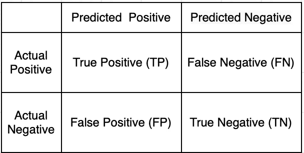
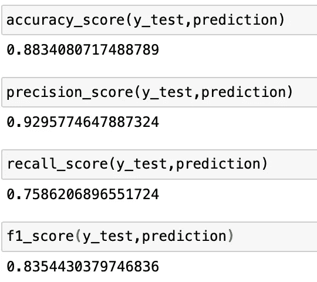

# 混淆矩阵和分类性能度量指南

> 原文：<https://towardsdatascience.com/guide-to-confusion-matrices-classification-performance-metrics-a0ebfc08408e>

## 准确度、精确度、召回率和 F1 分数


图片由 [Unsplash](https://unsplash.com/s/photos/accuracy?utm_source=unsplash&utm_medium=referral&utm_content=creditCopyText) 上的 [Afif Kusuma](https://unsplash.com/@javaistan?utm_source=unsplash&utm_medium=referral&utm_content=creditCopyText) 拍摄

在本文中，我们将探索混淆矩阵，以及如何使用它们来确定机器学习分类问题中的性能指标。

当运行分类模型时，我们得到的结果通常是二进制的 0 或 1 结果，0 表示假，1 表示真。我们可以将得到的分类结果与给定观察的实际值进行比较，以判断分类模型的性能。用于反映这些结果的矩阵被称为**混淆矩阵**，如下所示:



作者图片

这里有四种可能的结果:真阳性(TP)表示模型预测的结果为真，实际观察结果为真。假阳性(FP)表示模型预测了真实的结果，但实际观察是错误的。假阴性(FN)表示模型预测了错误的结果，而实际观察结果是真实的。最后，我们有真阴性(TN)，这表明模型预测的结果是假的，而实际结果也是假的。

混淆矩阵可用于计算分类模型的性能度量。在使用的许多性能指标中，最常用的是准确度、精确度、召回率和 F1 分数。

**准确率:** 计算准确率的公式，基于上图，是(TP+TN)/(TP+FP+FN+TN)或所有真正真负案例除以所有案例数。

精度通常用于判断模型性能，但是，在大量使用精度之前，必须考虑一些缺点。其中一个缺点是处理不平衡的数据集，其中一个类(真或假)比另一个类更常见，导致模型根据这种不平衡对观察值进行分类。例如，如果 90%的情况是错误的，只有 10%是正确的，那么我们的模型很有可能有大约 90%的准确率。天真地说，看起来我们有很高的准确率，但实际上，我们只有 90%的可能预测“错误”类，所以我们实际上没有一个好的度量标准。通常情况下，我不会使用准确性作为性能指标，我宁愿使用精确度、召回率或 F1 分数。

**精度:** 精度是真阳性与模型预测的总阳性数的比值。精度的公式可以写成:TP/(TP+FP)。这个度量允许你计算你的正面预测实际上是正面的比率。

**回忆:**
回忆(又称敏感度)是衡量你真正的积极程度与实际积极结果的比值。召回的公式可以表示为:TP/(TP+FN)。使用这个公式，我们可以评估我们的模型识别实际结果的能力。

**F1 评分:** F1 评分是准确率和召回率之间的调和平均值。F1 分数的公式可以表示为:2(p*r)/(p+r)其中“p”是精度，“r”是召回率。该分数可以用作包含精确度和召回率的总体度量。我们使用调和平均值而不是常规平均值的原因是调和平均值会惩罚相距较远的值。

在 p = .4 和 r = .8 的情况下可以看到这样的例子。用我们的公式，我们看到 2(0.4*0.8)/(0.4+0.8)，简化为 0.64/1.20 = 0.533；而正常的平均值应该是(. 4+.8)/2=0.6

**我们应该使用哪种绩效指标？** 一个非常常见的问题是应该使用哪种指标？什么时候？简单的答案是——视情况而定。不幸的是，这些指标没有一个尺寸适合所有人，每个指标都有其自身的重要性，提供关于分类模型性能的不同信息。

如前所述，精确度通常不是衡量整体模型性能的一个很好的指标，但它可以用来比较模型结果，同时调整训练数据并找到最佳超参数值。

Precision 衡量的是您的预测阳性率，当我们想要专注于限制假阳性时，它是一个很好的衡量标准。在资源有限的救灾工作中，精确是一个很好的度量标准。如果你在救援工作中知道你只能进行 100 次救援，而可能需要 100 次以上来拯救每个人，你希望确保你所做的救援是真正积极的，而不是浪费宝贵的时间让你误报。

当我们专注于限制我们的假阴性时，测量真阳性率的回忆是一个很好的指标。这方面的一个例子是医学诊断测试，如新冠肺炎的测试。如果这些诊断测试不专注于限制假阴性，我们会看到实际患有 Covid 的人将其传播给其他人的风险，因为假阴性测试结果会导致他们认为自己是阴性的。在这种情况下，假阳性不是一个大问题，因为如果没有 Covid 的人测试为阳性，他们的结果将是隔离并再次测试，这可能会显示阴性结果，让他们继续生活，而不会对其他人产生重大影响。

最大化 F1 分数看起来尽可能地限制了假阳性和假阴性。我个人喜欢使用 F1 分数作为我的一般性能指标，除非特定的问题需要使用 precision 或 recall。

**真实例子:** 我们现在将学习如何使用 sklearn 库生成混淆矩阵，手动计算我们得到的混淆矩阵，并展示如何使用 sklearn 得到相同的结果。对于这个演示，我将参考在我之前的文章中创建的基本随机森林模型(可以在这里找到[)。本文的数据是 CC0 授权的公共领域，最初由 Syed Hamza Ali 发布给 Kaggle(链接到此处的数据](/cross-validation-and-grid-search-efa64b127c1b))。

```
## Run the training model 
rf = RandomForestClassifier(n_estimators = 200, max_depth = 7, max_features = 'sqrt',random_state = 18, criterion = 'gini').fit(x_train, y_train)## Predict your test set on the trained model
prediction = rf.predict(x_test)## Import the confusion_matrix function from the sklearn library
from sklearn.metrics import confusion_matrix## Calculate the confusion matrix
confusion_matrix(y_test, prediction, labels = [1,0)
```


作者图片

一旦我们成功地训练了我们的模型，并对我们的维持数据进行了预测，使用 confusion_matrix()函数就和上面的步骤一样简单。在这个混淆矩阵中，我们看到 TP = 66，FP = 5，FN = 21，TN = 131。

*   我们可以将**精度**计算为(66+131)/(66+5+21+131)=0.8834
*   接下来我们可以计算**精度**为 66/(66+5)=0.9296
*   现在我们可以计算**召回**为 66/(66+21)=0.7586
*   最后我们可以计算出 **F1 得分**为 2(0.9296 * 0.7586)/(0.9296+0.7586)= 0.8354

既然我们已经演示了手动计算这些指标，我们将确认我们的结果，并展示如何使用 sklearn 计算这些指标。

```
## Import the library and functions you need
from sklearn.metrics import f1_score, accuracy_score, precision_score, recall_score## Accuracy
accuracy_score(y_test,prediction)## Precision
precision_score(y_test,prediction)## Recall
recall_score(y_test,prediction)## F1 Score
f1_score(y_test,prediction)
```

运行这段代码将产生以下结果，这些结果证实了我们的计算。



作者图片

**结论:** 有许多指标可以用来确定他们的分类模型的性能。在本文中，我们描述了混淆矩阵，以及通过手工和代码计算的四个常见的性能指标:准确度、精确度、召回率和 F1 分数。

感谢您花时间阅读这篇文章！我希望您喜欢这本书，并且了解了更多关于性能指标的知识。如果你喜欢你所读的，请关注我的个人资料，成为第一批看到未来文章的人！