# 黑掉浓缩咖啡

> 原文：<https://towardsdatascience.com/hacking-the-espresso-puck-511e4bae56f6>

## 咖啡数据科学

## 寻找理解提取的其他方法

我最近买了一个 [CoffeeJack](/coffeejack-and-wafo-vs-vst-flair-and-kompresso-espresso-filter-basket-2991314b224e?postPublishedType=repub) ，它没有无底的 portafilter，所以我没有办法了解水是如何流过圆盘的。此外，冰球很难击倒，但我想到了用吸管的好主意。这可以让我在中心或侧面取一些样品，然后对每个样品，我可以做一些切片，添加一些水，并进行[地面 TDS (gTDS)测量](/stability-of-grounds-tds-samples-in-spent-coffee-8e98df95bdc8)。然后我利用这一点来理解[蒸汽预注入](https://medium.com/nerd-for-tech/steam-pre-infusion-for-espresso-a-summary-1c58c65a937a?source=rss-ae592466d35f------2)。

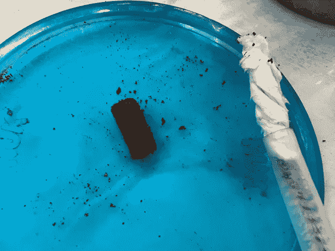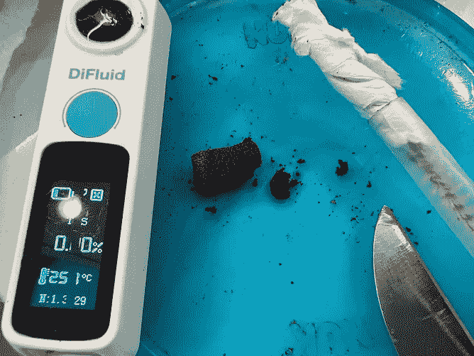

所有图片由作者提供

# 初始实验

我没有像样的浓缩咖啡机的透明 portafilter，我想看看蒸汽预注入是如何影响冰球的。因此，在这些测试中，我在不同的时间停止拍摄，拉动冰球，并拍摄一些图像和测量数据。

## 10 秒蒸汽 PI

冰球是上下颠倒的，所以顶部(没有弄湿的地面)是从篮子底部开始的。

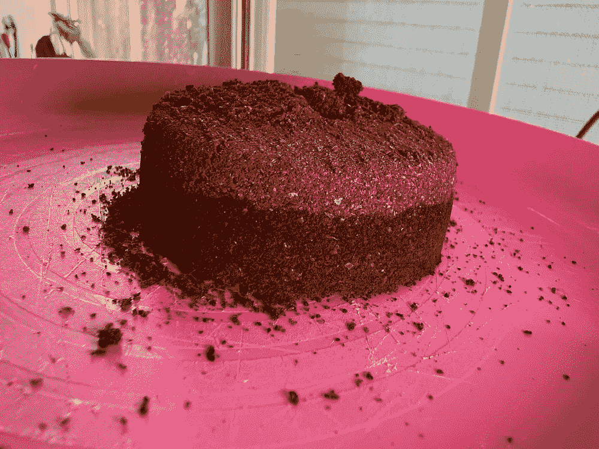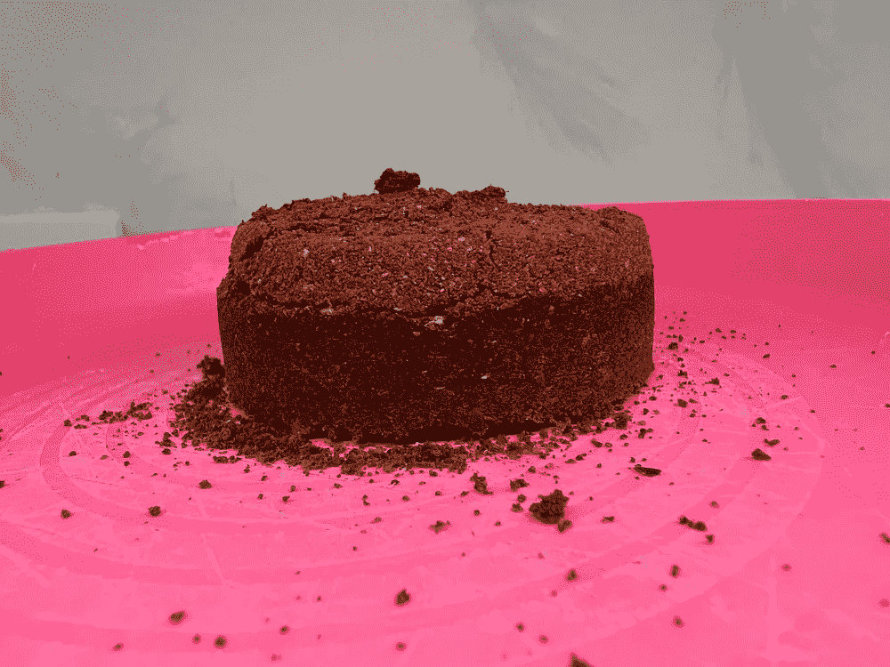

# 20 秒蒸汽 PI

水渗透得更深，但形成了不均匀。

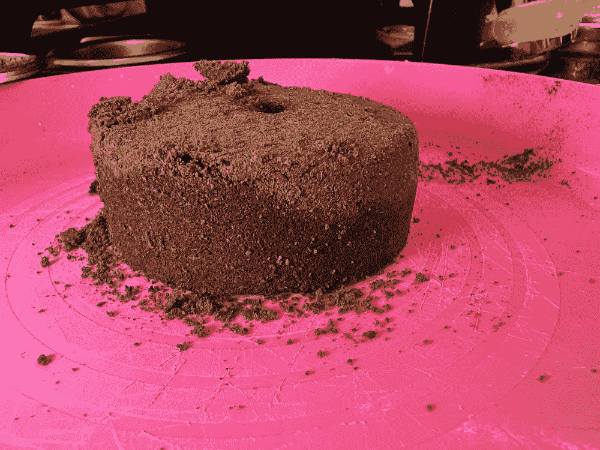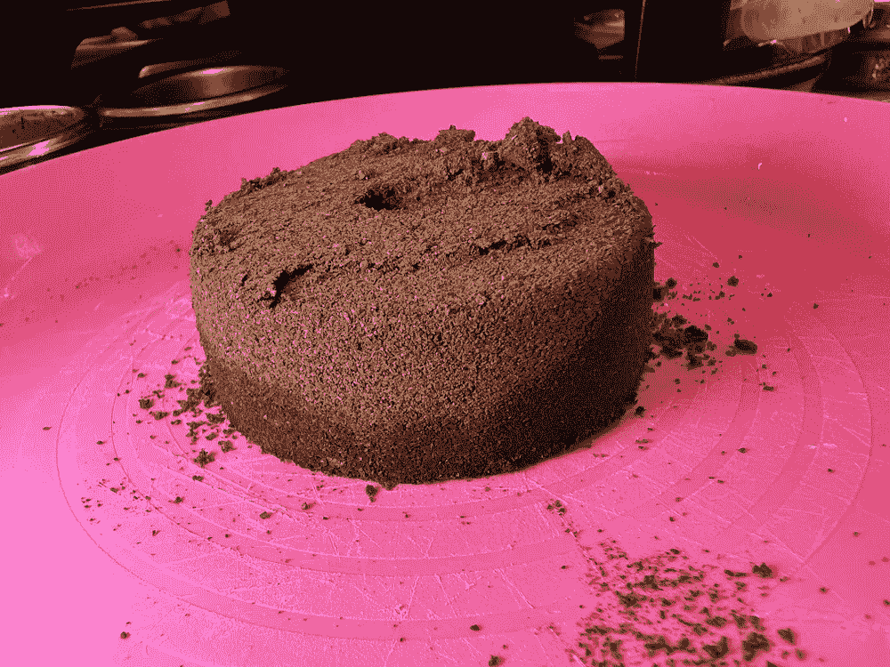

# 30 秒蒸汽 PI

水到达了底部，但还是不均匀。进一步的实验表明这导致了射击通道。有趣的是看到黑线表明溶解的固体被推到了圆盘的底部。

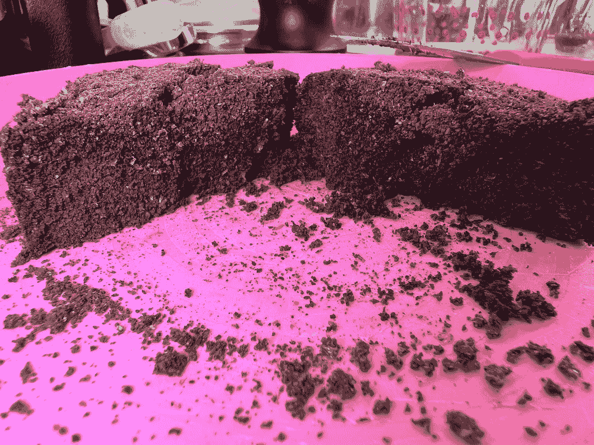

# 50 秒蒸汽 PI

水最终到达了底部，但是有一个通道。

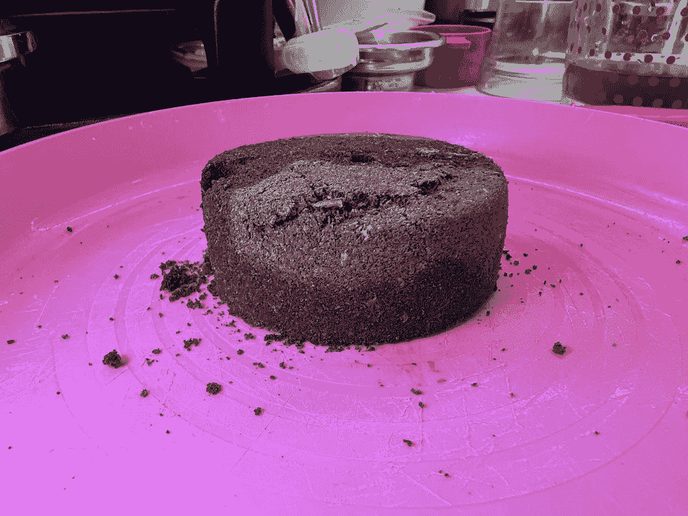

关于通灵，它似乎在 PI 的 10 秒之后开始。这恰好发生在冰球上，第一次夯实是在[断奏夯实击球](/staccato-tamping-improving-espresso-without-a-sifter-b22de5db28f6)中，所以大约在冰球的一半处。

# 平脉冲与长脉冲

我们可以比较 50 秒的平坦过渡脉冲和平滑过渡脉冲(间隔 10 秒)，使用快速快速过渡和 0.1 毫升/秒的流量而不是 0.2 毫升/秒。两者具有相似的模式，我没有看到特别的好处。

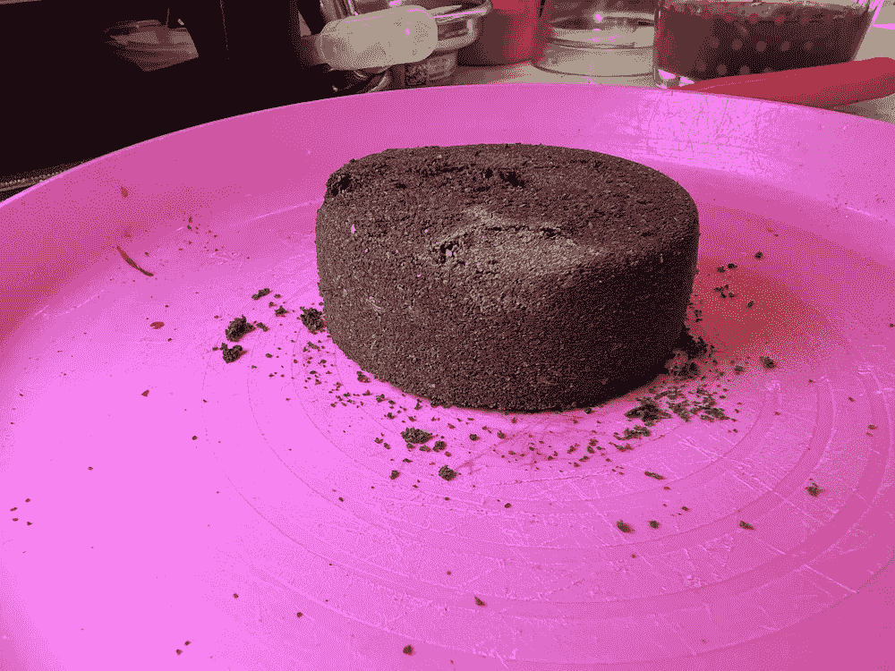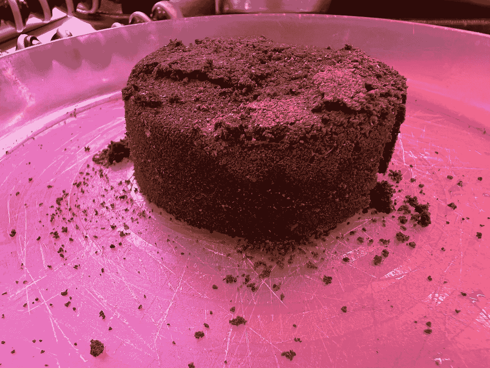

左图:50 秒，右图:10 秒脉冲乘以 10 秒暂停 100 秒。

# gTDS 指标

对于这些测试，我还从圆盘的中心和侧面切割了一些核心样本。然后我加了一些水，测量了 TDS。目的是寻找一种趋势，更好地理解中心与边缘的不同。对于每个中心和侧面的核心，我从圆盘的顶部、中部和底部垂直取样。

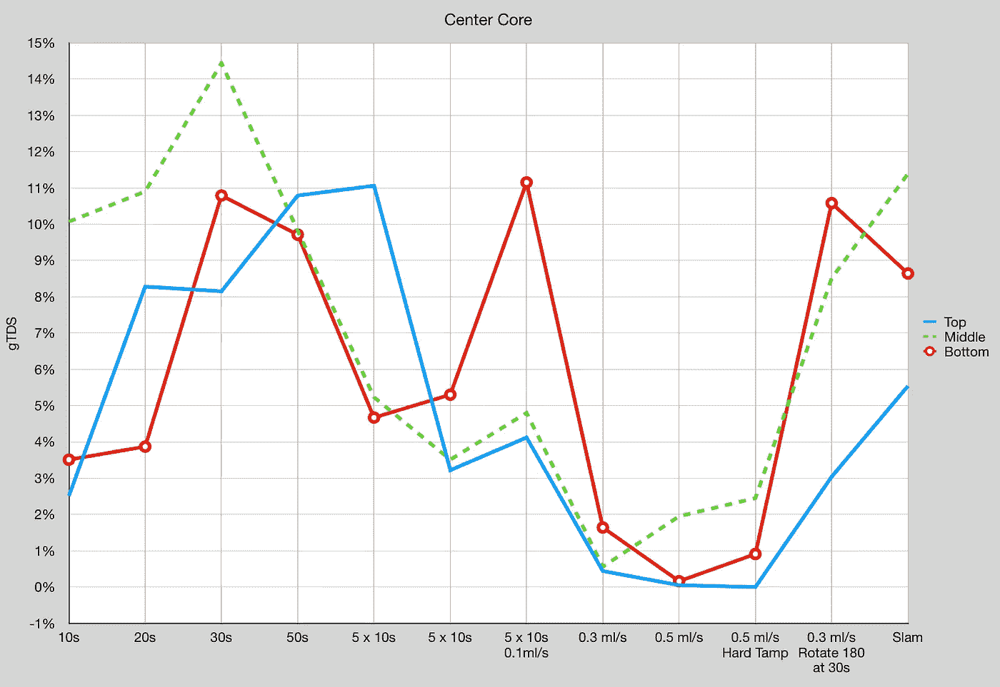

侧面尺寸通常较低。这是意料之中的，因为存在侧沟，并且淋浴帘将水更多地从侧面而不是中心推入圆盘。

我们可以看看中心和侧面，在顶部，侧面的值肯定比中心低很多。然而，事情在底部变得更加接近。

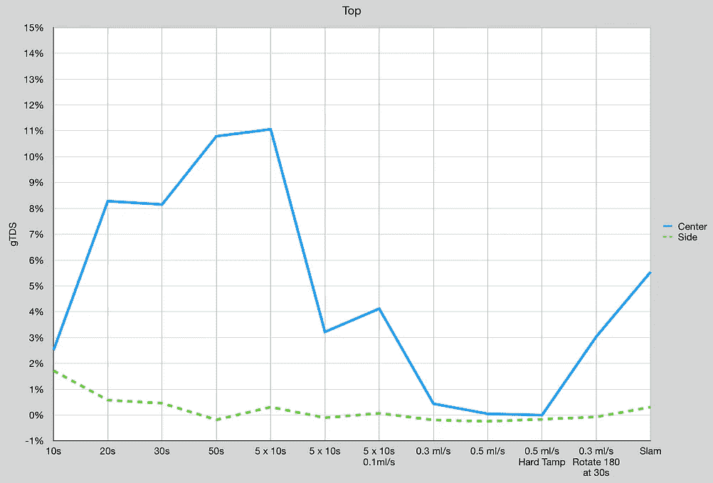

总的来说，这是一个中间实验，看看我如何通过大量的尝试和错误来改善我的投篮命中率。

如果你愿意，可以在推特、 [YouTube](https://m.youtube.com/channel/UClgcmAtBMTmVVGANjtntXTw?source=post_page---------------------------) 和 [Instagram](https://www.instagram.com/espressofun/) 上关注我，我会在那里发布不同机器上的浓缩咖啡照片和浓缩咖啡相关的视频。你也可以在 [LinkedIn](https://www.linkedin.com/in/dr-robert-mckeon-aloe-01581595) 上找到我。也可以关注我在[中](https://towardsdatascience.com/@rmckeon/follow)和[订阅](https://rmckeon.medium.com/subscribe)。

# [我的进一步阅读](https://rmckeon.medium.com/story-collection-splash-page-e15025710347):

[我的书](https://www.kickstarter.com/projects/espressofun/engineering-better-espresso-data-driven-coffee)

[我的链接](https://rmckeon.medium.com/my-links-5de9eb69c26b?source=your_stories_page----------------------------------------)

[浓缩咖啡系列文章](https://rmckeon.medium.com/a-collection-of-espresso-articles-de8a3abf9917?postPublishedType=repub)

工作和学校故事集