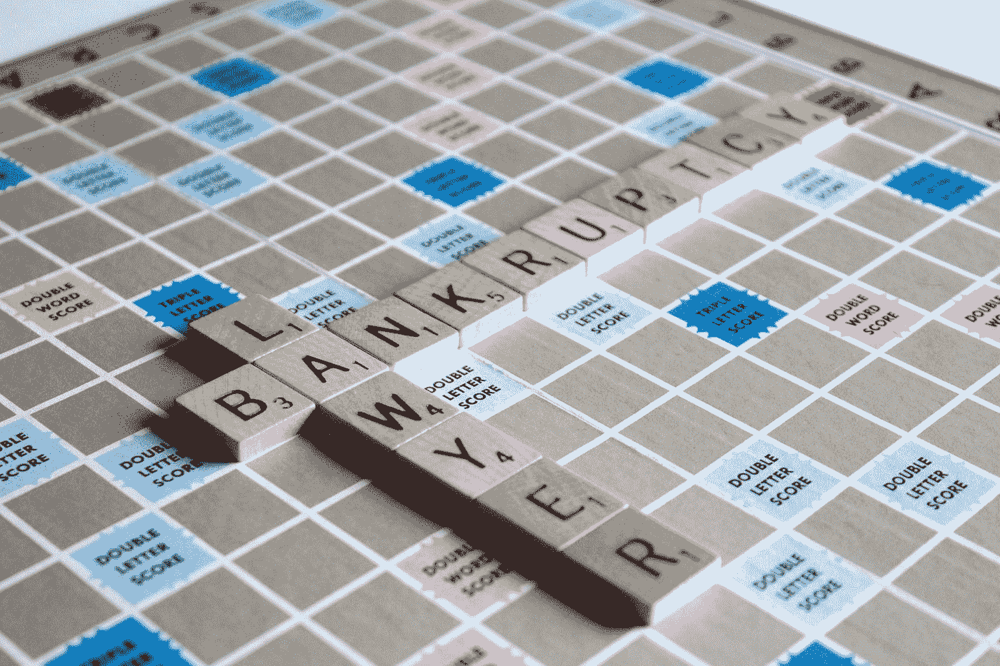

# 黑客世界

> 原文：<https://towardsdatascience.com/hacking-wordle-f759c53319d0>

# 黑客世界

## 对 Wordle 的分析方法(有点欺骗)



照片由[梅林达·金佩尔](https://unsplash.com/@melindagimpel?utm_source=medium&utm_medium=referral)在 [Unsplash](https://unsplash.com?utm_source=medium&utm_medium=referral) 上拍摄

啊是的。沃尔多。我们这一代的填字游戏。朋友和亲人之间的许多争论都是由这个美丽而简单的游戏引发的。

我不是一个喜欢文字的人(正如你所知道的)，但我在日常生活中确实与数学、编程和统计打交道很多，所以自然我想看看我是否能算出 Wordle 并击败我的朋友。在这篇文章中，我将向你展示在解决一个新的单词难题时，我是如何选择我的第一个*单词和第二个*单词的。**

# 战略

我的看法是，我想找到一个包含英语中最常用字母的 5 个字母的单词。然后根据这个猜测，我想找到下一组。因此，我的前两个猜测不会是正确的，但我应该有足够的信息来完成这个难题。

首先，我们需要从互联网上获取一个由 5 个字母组成的单词列表，最好是从 API 或数据库中获取。

> 注意:我用 Python 和 Kaggle 工作簿写我的代码，你可以在下面自己运行！

[](https://www.kaggle.com/kapastor/wordle-strat) [## 沃尔得战略

### 使用 Kaggle 笔记本探索和运行机器学习代码|使用来自无附加数据源的数据

www.kaggle.com](https://www.kaggle.com/kapastor/wordle-strat) 

我快速搜索后发现的数据集是:

【https://www-cs-faculty.stanford.edu/~knuth/sgb-words.txt 

> 引用:以上数据集来自斯坦福大学计算机编程艺术荣誉退休教授唐纳德·e·克努特。

它以 txt 文件的形式列出了由新空格字符分隔的单词。我将把它作为一个列表加载到 python 中，这样我就可以解析出数据。

```
**# Standard imports** import urllib
import string
import re**# Open the URL using the urllib package**
url = "[https://www-cs-faculty.stanford.edu/~knuth/sgb-words.txt](https://www-cs-faculty.stanford.edu/~knuth/sgb-words.txt)"
file = urllib.request.urlopen(url)**# Build up a list of the words (remove new space character)**
word_set = []
for line in file:
    decoded_line = line.decode("utf-8")
    word_set.append(decoded_line.replace('\n',''))
```

现在我有了单词列表，我需要从每个单词中找出最重要的信息。为此，我需要查找 5 个字母单词中每个字母的出现率。这是通过简单地循环每个字母(a-z)并比较它在所有字母集中出现的次数来实现的。这应该给我一个粗略的概率，这个字母出现在 5 个字母的单词集中。

```
**# Generate a string of all letters**
all_letters = string.ascii_lowercase[:]**# Initialize a dictionary for the letter count and set to 0**
letter_stats_dict = {}
for letter in all_letters:
    letter_stats_dict[letter]=0**# We know the total number of letters...**
total_letters = len(word_set)*5.0**# Now for each letter we look in each word and add the count of that letter in the given word**
for letter in all_letters:
    for word in word_set:
        letter_stats_dict[letter]+=word.count(letter)**# Finally we divide by the total number of letters to get a percent chance**
for letter in all_letters:
    letter_stats_dict[letter]/=total_letters
    total = total + letter_stats_dict[letter]
```

现在我有了每个字母的流行度，然后我可以给每个单词分配一个信息分数，告诉我字母的组合如何包含最可能的选择。分数是字母平均出现概率的唯一总和。例如，如果单词是 **ABBEY** 如果我们假设每个字母的概率是

> A = 0.2，B=0.05，Y=0.05，E = 0.3

那么艾比的得分是

> 分数(修道院)= 0.2+0.05+0.05+0.3

注意，我们只使用了字母 B 的一个实例，因为我们在这里寻找唯一性。让我们输入代码！

```
**# Set up a word dictionary and initialize**
word_stat_dict = {}
for word in word_set:
    word_stat_dict[word] = 0 **# For each word find the unique set of characters and calculate the information score**
for word in word_set:
    unq_char_word = "".join(set(word))
    for letter in unq_char_word:
        word_stat_dict[word]+=letter_stats_dict[letter] **# Sort the list from best to worst score**
word_stat_dict = sorted(word_stat_dict.items(), key=lambda x:x[1],reverse=True)
word_stat_dict = dict(word_stat_dict)**# Print to find the first entry!**
print(word_stat_dict)
```

瞧啊。第一个词是…..

> **出现了**

厉害！我们有第一个单词！接下来的部分很棘手。我们需要一个信息得分高的新单词，但它不能包含上面的字母。这里我们将使用正则表达式来查找不包含上述任何字符但得分最高的单词。

*注意:如果你不知道正则表达式，可以用谷歌，因为它很棒。*

```
**# Regular Expression that looks for words not containing characters in arose**
regex = r"^[^arose]+$"
regex = re.compile(regex)**# Loop over our word stats dictionary to find the next best Wordle guess!**
for word, information_value in word_stat_dict.items():    
    if re.search(regex, word):
        **print(word)**
        break
```

这给了我们第二个词…..

> 直到

所以我的前两件事应该是**起**接下来是**直到**。让我们看看它是如何工作的！我会好起来吗？我会是个傻瓜吗？只有时间会证明一切！

感谢阅读，祝你好运！！！！

如果你喜欢这样，并想支持我，你可以使用我的推荐链接，如果你加入媒体！

[](https://kapastor.medium.com/membership) [## 加入我的介绍链接-凯尔牧师媒体

### 作为一个媒体会员，你的会员费的一部分会给你阅读的作家，你可以完全接触到每一个故事…

kapastor.medium.com](https://kapastor.medium.com/membership)